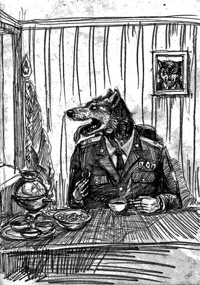

- ~~[Вступление. Игорь](./1.md)~~
- ~~[Контекст. Дело анархистов](./2.md)~~
- ~~[1](./3.md)  [2](./4.md)  [3](./5.md)  [4](./6.md)  [5](./7.md)  [6](./8.md)  [7](./9.md)  [8](./10.md)~~
# [9](./11.md)
- [10](./12.md)  [11](./13.md)  [12](./14.md)  [13](./15.md)  [14](./16.md)  [15](./17.md)  [16](./18.md)  [17](./19.md)  [18](./20.md)  [19](./21.md)  [20](./22.md)  [21](./23.md)  [22](./24.md)
- [Корпорация](./25.md)
- [Самоопределение](./26.md)
- [Политические](./27.md)
- [Открытое письмо анархистским кругам](./28.md)
- [Per aspera ad astra (По мотивам «Ultima verba» В.Гюго)](./29.md)
- [Послесловие](./30.md)

---

Вызовы к хозяину «американки» – отдельная тема. Во всём этом дурдоме лишь его кабинет представлял собой лагуну спокойствия и умиротворения. Обычно он встречал очень доброжелательно, умел интересно говорить и выслушивать. Он не пил и не курил. Рассказывал о себе: что участвовал в операциях в горах, сидел где-то в азиатской тюрьме. Даже как-то не верилось, что именно он мучает нас, как кот играется с мышами, дирижирует всей этой трагикомедией. Он не делал топорных ошибок, как простые опера. Он мог исподтишка поинтересоваться мнением о сокамернике. Собственное мнение сделать твоим за счёт отрицания ещё более неприемлемой позиции и т.п. Помню, как он предлагал посмотреть фотки, где будто бы отображено, что Лебедько не соблюдал голодовку. Тут он сплоховал, так как этот же фокус проворачивал с кем-то другим ранее. В том случае компьютер «внезапно» подвисал при попытке открыть фотографии. Точно так же произошло и со мной, так что я не удивился. Всё-таки и мастера совершают ошибки. К тому же я лично видел, как Лебедько за несколько дней порядочно ослаб так, что он был бледен и его пошатывало. Орлов говорил о ситуации в тюрьме, как об «ответе на тот вызов, с которым столкнулась страна». Он сравнивал оппозицию с французскими революционерами, которые подводят обстоятельства к террору, и «неизвестно, чей террор будет хуже».

Всё время мне приходилось быть в максимальном напряжении: следить за каждым словом, следить за ходом мысли (его и своей), следить за диалогом в целом. Это очень непросто. Всегда есть опасность высказать мнение или упомянуть какую-то деталь, которую он для правдоподобности сможет вплести в разговор с другими заключёнными, посеяв тем самым сомнение и раздор. Не говорить с ним было невозможно. Неоднократно я шёл с мыслью свести беседу к односложным ответам, но раз за разом Орлову удавалось разговорить меня. Как и тот полковник из 4-го отделения, своё дело он знал хорошо. В кабинете стоял красивый сервиз, на столе ждали пряники, коньяк – всё, как в фильмах. Никаких чаев с карателями! Я так сразу и заявил и повторял каждый раз, когда начальник предлагал. Люди почему-то думают, что это – мелочи. Дескать, если мент ведёт себя культурно и порядочно, то можно и чаи погонять. Тем самым признаются допустимыми все те издевательства и обман, которым подвергают заключённых. Тюремщики делятся на два вида: плохие и очень плохие. Это – аксиома. Любая обходительность с их стороны есть элемент паутины, призванной вызвать подсознательное доверие. Орловым практиковалась подстройка через присоединение к системе ценностей (согласие с рядом ваших мыслей), а также отзеркаливание (копирование позы). Увы, мои познания в этой области очень скромны, и большая часть этой психологической осады осталась для меня незримой.

Я принимал контрмеры. В качестве защиты, глядя на начальника с полуулыбкой, я повторял в уме раз за разом: «Это он меня давит, душит, унижает, приносит боль близким мне людям. Он – враг. Всё, что он говорит, ложь».

Ненависть к врагу… Как-то один приятель рассказывал мне, что соблазняя девушку, нужно раздевать ее взглядом. Для насущной ситуации я адаптировал этот подход следующим образом: представлял, что через весь стол хватаю начальника за горло одной рукой и душу, а он хрипит, исходит пеной, выпучивает глаза, паникует в безуспешной попытке разжать стальную хватку. Помогало отлично!

Орлов открыто обсуждал методы мучений, моральную сторону дела. Он утверждал, что его целью является заставить нас сомневаться. На моё возражение, что мы ещё не осуждённые, он ничего не ответил. Впрочем, уже тогда было ясно, что человек виновен для них не тогда, когда суд выносит свой вердикт, а когда человек попадает под подозрение. Они ведь не могут ошибаться! КГБ. Куда уж простым смертным до них!

Из разговоров мне стало известно, что они практикуют индивидуальный подход к каждой камере и к каждому человеку. Всего 18 камер, около 60 арестантов. Больших технических средств и крупного штата сотрудников не требуется. Все чётко планировалось: когда, где и сколько раз. Где проводить шмон, кого подвергать персональной экзекуции, где оставить свет на ночь, где запретить курить. Даже кого задеть в строю во время прогонов в туалет или на прогулку. Орлов при мне звонил куда-то и давал инструкции, чтобы Молчанова два дня не трогали. Ну и, конечно же, камеры перетасовывали, чтобы осложнить или облегчить жизнь.

— Мир – это стая волков. И более сильная стая всегда пытается урвать у соседа поменьше. Я отождествляю себя со своей стаей и ее благополучие – это благополучие моей семьи, близких, соплеменников, – рассуждал Орлов о своем мировоззрении.

На эти патриотические доводы мне было, что сказать.

— Классика фашизма. Почитайте Муссолини, вам понравится, – комментировал я. – Да, картина цивилизации такая, как есть сегодня, не поспоришь. И с волками всё ясно. Только что в вашем мире делать простым антилопам, которые тащат этих волков на своём горбу?

Похоже, антилопам оставалось лишь пахать и сидеть, выполнять продразвёрстку, сдавать кожу на военные ремни и ранцы. Ну, а пока антилоп – в зависимости от поведения – водили к начальнику либо культурно, без наручников, либо «ласточкой». «Ласточкой» – это когда кандалы захлопываются за спиной, а руки выкручиваются вверх настолько, что при желании можно поцеловать собственные ботинки. И так по коридорам, по ступенькам, опять-таки, словно я пэзэшник (пожизненно заклечённый). Однажды забыли инструкцию насчёт меня. Звонили начальнику, уточняли, как именно вести. «Я вам устрою Гуантанамо тут», – грозил Орлов. Так «американка» стала «гуантанамкой».

---

- ~~[Вступление. Игорь](./1.md)~~
- ~~[Контекст. Дело анархистов](./2.md)~~
- ~~[1](./3.md)~~
- ~~[2](./4.md)~~
- ~~[3](./5.md)~~
- ~~[4](./6.md)~~
- ~~[5](./7.md)~~
- ~~[6](./8.md)~~
- ~~[7](./9.md)~~
- ~~[8](./10.md)~~
- ~~[9](./11.md)~~
# [10](./12.md)
- [11](./13.md)
- [12](./14.md)
- [13](./15.md)
- [14](./16.md)
- [15](./17.md)
- [16](./18.md)
- [17](./19.md)
- [18](./20.md)
- [19](./21.md)
- [20](./22.md)
- [21](./23.md)
- [22](./24.md)
- [Корпорация](./25.md)
- [Самоопределение](./26.md)
- [Политические](./27.md)
- [Открытое письмо анархистским кругам](./28.md)
- [Per aspera ad astra (По мотивам «Ultima verba» В.Гюго)](./29.md)
- [Послесловие](./30.md)
