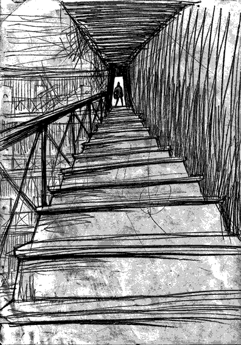

- ~~[Вступление. Игорь](./1.md)~~
- ~~[Контекст. Дело анархистов](./2.md)~~
- ~~[1](./3.md)  [2](./4.md)  [3](./5.md)  [4](./6.md)  [5](./7.md)  [6](./8.md)  [7](./9.md)  [8](./10.md)  [9](./11.md)  [10](./12.md)~~
# [11](./13.md)  
- [12](./14.md)  [13](./15.md)  [14](./16.md)  [15](./17.md)  [16](./18.md)  [17](./19.md)  [18](./20.md)  [19](./21.md)  [20](./22.md)  [21](./23.md)  [22](./24.md)
- [Корпорация](./25.md)
- [Самоопределение](./26.md)
- [Политические](./27.md)
- [Открытое письмо анархистским кругам](./28.md)
- [Per aspera ad astra (По мотивам «Ultima verba» В.Гюго)](./29.md)
- [Послесловие](./30.md)

---

В начале февраля маски озверели вконец. Была пятница, трое в камере заболели гриппом. Всю ночь трясло; температура, озноб. Наутро сходили к врачу, он выписал таблетки. Вечером дёрнули меня и Молчанова со всеми шмотками. Наученные горьким опытом, мы выложили книги и другие тяжёлые вещи. Как обычно, спустили в спортзал, но почему-то шагом и без рёва. Подозрительно тихо. Ничего хорошего это не предвещало. Кешер и пакеты выворачивают, сваливая содержимое в одну кучу. Ожидание, босиком на бетонном полу, голым. Началось.

«собрать вещи!», «живо!», «что непонятно?!!», «живее!», «я сказал!!!», «бегооооом!!!!»

По лестницам, коридорам. Загоняют в дурхату^[Камера, обитая резиной и дерматином, для усмирения буйных (жарг.)] в подвале. Снова шмон. Ставят на растяжку и уходят, но периодически подходят к глазку проверить. Сбор шмоток, едва успеваешь одеваться, матрас под мышку и бегом по коридору на лестницу, ведущую в центр этого неоколизея. На финише стоит каратель и орет: «Слишком медленно, назад!» Другой подгоняет. Слышу, как на другой лестнице гоняют Саню Молчанова. Сволочи. Возвращаюсь назад в дурхату. Дико жарко, пот льётся буквально ручьём, в голове туман. Это – предел. Если переступить, то что будет дальше??? Всё, плевать.

Каратель орёт:

— Дубль два! беегооом марш!!!

— Нет.

— Я сказал – взял вещи и бегом, живее!!!

— Отказываюсь.

— Вещи в руки и бегом!

— Делай, что хочешь. Больше не побегу.

Некоторое время он смотрит на меня, затем идёт за вторым, что-то шёпотом обсуждает. Затем второй каратель подходит и, как ни в чём не бывало, самым вежливым и миролюбивым тоном говорит: «Собирайте ваши вещи и проходите в камеру». Я аж опешил, не веря своим ушам. Настолько этот тон противоречил ситуации. Оказывается, они умеют говорить по-человечески. Всё…

…Не расстилая матраса, падаешь прямо на железные прутья. Сил нет ни на что. В голове всё ходуном. Саня заваливается следом. Еле живой, бледный как смерть. Ему плохо, тошнит. В камере гробовое молчание. Кирилл с Максом ещё так не попадали. Всем страшно. Да какое страшно?! Ужас проник в каждый атом тела и разума настолько глубоко, что все сидели молча, боявшись сказать хоть слово…

Я лихорадочно соображаю, что делать. Ситуация подошла к черте, переступив которую уважать себя уже невозможно. Ещё один шаг, и тогда что угодно станет возможным. Приходит четкое понимание того, что такого и близко допускать нельзя. Категорически. Нужно идти в отказ в самом начале, не собирать вещи. Если это будет не очередной прогон, а переселение в другую камеру, придёт дежурный. А так его никогда нет. Специально отсутствует, чтобы не быть свидетелем. Хитро придумали, сволочи.

На следующее утро дежурный спросил: «Ну кто ещё болен?».

А через несколько дней случился самый жёсткий пресс за всю эту чёрную зиму. Рёв стоял такой, что звук отчётливо доносился из спортзала, т.е. через две двери и центральный холл. Мы не могли ни читать, ни писать, ни играть, ни просто лежать. Кто-то ходил вперед-назад, кто-то отжимался. Несколько часов в ожидании, всё время открываются соседние камеры, но почему-то проходят мимо нас. Извне доносится крик: «лечь! встать! лечь! встать!…» Это кошмар. Никто не смотрит друг другу в глаза и только губы выдают: «Суки, твари, сволочи…». Ужин. Значит, нашу камеру пронесло. Но надолго ли? Чудо не случается дважды, в следующий раз обязательно зацепят».

В субботу с самого утра меня отвели к начальнику. Орлов, одетый по граждански, встретил меня радушно. Сразу же спросил меня: «Что вас тревожит?». Затем он прямо сказал что-то насчёт моего состояния и что ему поручено развеять «недопонимание».

«Ведь это всё не более чем театральная постановка, – говорил он доверительно-доброжелательным тоном. – Мы пристально следим за состоянием каждого, и уверяю вас, ничего никому на самом деле не угрожает». И добавил: «Главный враг – собственный страх. Не нужно делать поспешных действий и любую проблему можно решить вот здесь».

Я был в шоке. Каким образом это стало известно? Неужели все эти разговоры про психологический контроль не пустой разгон? Спрашиваю в лоб:

— Как вы узнали?

— По глазам, – серьезным тоном ответил гражданин начальник СИЗО КГБ.

---

- ~~[Вступление. Игорь](./1.md)~~
- ~~[Контекст. Дело анархистов](./2.md)~~
- ~~[1](./3.md)~~
- ~~[2](./4.md)~~
- ~~[3](./5.md)~~
- ~~[4](./6.md)~~
- ~~[5](./7.md)~~
- ~~[6](./8.md)~~
- ~~[7](./9.md)~~
- ~~[8](./10.md)~~
- ~~[9](./11.md)~~
- ~~[10](./12.md)~~
- ~~[11](./13.md)~~
# [12](./14.md)
- [13](./15.md)
- [14](./16.md)
- [15](./17.md)
- [16](./18.md)
- [17](./19.md)
- [18](./20.md)
- [19](./21.md)
- [20](./22.md)
- [21](./23.md)
- [22](./24.md)
- [Корпорация](./25.md)
- [Самоопределение](./26.md)
- [Политические](./27.md)
- [Открытое письмо анархистским кругам](./28.md)
- [Per aspera ad astra (По мотивам «Ultima verba» В.Гюго)](./29.md)
- [Послесловие](./30.md)
