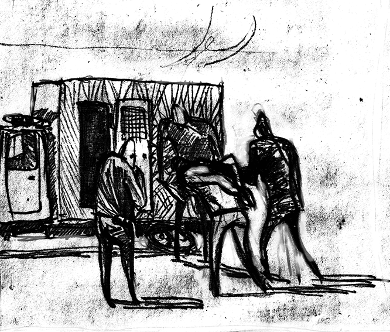

- ~~[Вступление. Игорь](./1.md)~~
- ~~[Контекст. Дело анархистов](./2.md)~~
- ~~[1](./3.md)  [2](./4.md)  [3](./5.md)  [4](./6.md)  [5](./7.md)  [6](./8.md)  [7](./9.md)  [8](./10.md)  [9](./11.md)  [10](./12.md)  [11](./13.md)  [12](./14.md)  [13](./15.md)  [14](./16.md)  [15](./17.md)  [16](./18.md)  [17](./19.md)  [18](./20.md)~~
# [19](./21.md)  
- [20](./22.md)  [21](./23.md)  [22](./24.md)
- [Корпорация](./25.md)
- [Самоопределение](./26.md)
- [Политические](./27.md)
- [Открытое письмо анархистским кругам](./28.md)
- [Per aspera ad astra (По мотивам «Ultima verba» В.Гюго)](./29.md)
- [Послесловие](./30.md)

---

…Утро. Конвой, наручники, автозак, глухой «стакан»^[Заднее место в полицейском УАЗике (жарг.)] в кромешной тьме. Машина мчится по зеленой, с мигалками. Чтобы усидеть на месте, приходится упираться головой в стенку. Подъехали прямо к дверям с чёрного входа. До дверей двойной коридор из ментов. Поодиночке ведут в подвал. Распределяют по камерам-стаканам, на этот раз бетонным. Полметра на метр. Шмон: тщательно проверяют одежду. В этот момент встречаемся взглядами. Саня, Колян… Столько хочется сказать, обняться, пожать руки. Но пока здороваемся, придирчиво оцениваем друг друга. Видно, что каждый хочет избавиться от мельчайших внутренних сомнений: «А не пали ли духом?» Но по твердости голоса, по манере поведения с ментами очевидно, что никто не прогнулся. Общаемся смелее, несмотря на постоянные замечания конвоя, и от этих первых слов становится тепло на душе. Веткин пробует общаться, но с ним никто не разговаривает. В его глазах лишь школьный интерес. Мог быть всем, а стал никем. Это печально. Ожидание в стакане. Стены исписаны: погремухи^[Прозвище, кличка (жарг.)], статьи, сроки, пожелания. Больше всего 205-х и 328-х, кражи и наркотики. Добавляю себя, рисую символы и лозунги. Пусть знают, что сидят не только за корысть или бытовуху. Время идёт очень медленно.

…Наконец, наша очередь. Выстраивают колонной и выводят в зал заседаний. В холле куча народа, вспышки фотокамер. Всё это вводит в ступор. У входа – металлоискатели, очень много милиции и людей в гражданском, бред какой-то. В клетке снимают кандалы. Пробуем общаться, но вертухаи следят зорко, пресекают общение. Говорят, что суд оцеплен ОМОНом. Одним словом, цирк вокруг цирка. Приходят адвокаты, один за другим появляется множество знакомых и незнакомых лиц. За долгие месяцы в СИЗО так отвыкаешь от социума, что теряешься при таком обилии людей. Родители, родственники, друзья, приятели, товарищи. Эта поддержка многократно укрепляет. Ведь своими глазами убеждаешься, что можешь рассчитывать не только на себя, но и на всех этих неравнодушных людей. Изоляция изолятора трещит по швам.

Судья и две кивалы^[Кивала — народный заседатель, присяжный в суде (жарг.)] делают вид, что не замечают абсурдности ряда улик и показаний, давления оперов и т.п. Зомби. В показаниях свидетелей отказ за отказом. Прокурор давит, но безрезультатно. Долгие нудные часы абсолютно бесполезных слов левых людей, а я смотрю в окно. Никогда не думал, что так буду рад увидеть зелень деревьев и чистое синее небо. Не в клеточку.

Прокурор, получивший кличку «дружище бобёр», на прениях заявляет, что мы признаём лишь законы физики и химии. Верно, как и все естественные законы бытия: законы биологии, истории, а также самый главный нравственный закон, утвержденный всей сутью человеческой природы и социального развития.

Последнее слово. Не готовился, думал, что завтра. Решил сказать о Диме Дубовском, нашем оболганном и преследуемом товарище. Веткин и Конофальский, подонки, назвали его ответственным за некоторые вещи, но так заврались, что на суде это выплыло. Из нас четверых ему выпали самые тяжёлые испытания. Пусть даже ему и удалось сохранить то, что в этом убогом обществе называют «свобода». К нему применили самые подлые и мерзкие методы оперативной разработки. Но Дима всё вынес и преодолеет любые трудности. Такие люди – навсегда. И годы в застенках не преграда для нашего братского товарищества. Саня и Коля сказали очень достойно. За нами нет вины перед совестью, а значит, любые лишения – лишь награда. Приговор. Что ж, Махно сидел и нам велел. Восемь лет на одном вздохе! Последний взгляд на близких мне людей. За исключением родителей, я их увижу совсем не скоро. Прощаюсь с адвокатом. Его появление в ­СИЗО КГБ было как глоток свежего воздуха. И в этой безнадёжной ситуации он смог мне помочь. Пожимаем руки и обнимаемся с Колей. Для меня честь разделить судьбу с такими людьми.

Веткин выхватил милость: 4 года химии. Он, Захарчик, Арсенчик, Бурочка будут жить жалкой презренной жизнью. Нет прощения предательству. Если у них будут дети, чему их научат такие отцы?

…Снова автозак; остановка «КГБ». Выходя, кричу: «Товарищи, до встречи!»

---

- ~~[Вступление. Игорь](./1.md)~~
- ~~[Контекст. Дело анархистов](./2.md)~~
- ~~[1](./3.md)~~
- ~~[2](./4.md)~~
- ~~[3](./5.md)~~
- ~~[4](./6.md)~~
- ~~[5](./7.md)~~
- ~~[6](./8.md)~~
- ~~[7](./9.md)~~
- ~~[8](./10.md)~~
- ~~[9](./11.md)~~
- ~~[10](./12.md)~~
- ~~[11](./13.md)~~
- ~~[12](./14.md)~~
- ~~[13](./15.md)~~
- ~~[14](./16.md)~~
- ~~[15](./17.md)~~
- ~~[16](./18.md)~~
- ~~[17](./19.md)~~
- ~~[18](./20.md)~~
- ~~[19](./21.md)~~
# [20](./22.md)
- [21](./23.md)
- [22](./24.md)
- [Корпорация](./25.md)
- [Самоопределение](./26.md)
- [Политические](./27.md)
- [Открытое письмо анархистским кругам](./28.md)
- [Per aspera ad astra (По мотивам «Ultima verba» В.Гюго)](./29.md)
- [Послесловие](./30.md)
