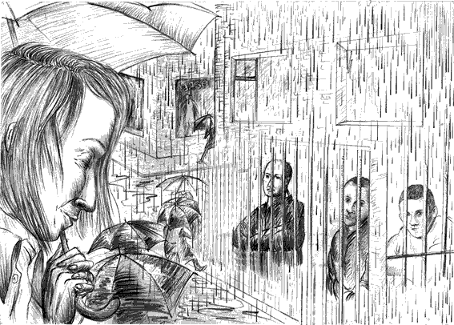

- ~~[Вступление. Игорь](./1.md)~~
- ~~[Контекст. Дело анархистов](./2.md)~~
- ~~[1](./3.md)  [2](./4.md)  [3](./5.md)  [4](./6.md)  [5](./7.md)  [6](./8.md)  [7](./9.md)  [8](./10.md)  [9](./11.md)  [10](./12.md)  [11](./13.md)  [12](./14.md)  [13](./15.md)  [14](./16.md)  [15](./17.md)  [16](./18.md)  [17](./19.md)  [18](./20.md)  [19](./21.md)~~
# [20](./22.md)
- [21](./23.md)  [22](./24.md)
- [Корпорация](./25.md)
- [Самоопределение](./26.md)
- [Политические](./27.md)
- [Открытое письмо анархистским кругам](./28.md)
- [Per aspera ad astra (По мотивам «Ultima verba» В.Гюго)](./29.md)
- [Послесловие](./30.md)

---

Свидание с родителями. На этот раз пустили и мать. Наши дорогие матери… Кто уж по-настоящему несчастлив, так это они. Отцы тоже страдают, но по природе своей понимают, что суровые испытания пойдут их чаду на пользу. А мать не принимает никаких доводов, если её сын за решёткой. Заключённых всегда двое. Мать не может и дня прожить без переживаний за своего ребёнка. Стоять в очередях на передачу, ждать письма, ловить любую новость о тюрьме или колонии, где мы отбываем срок — вот их приговор изо дня в день, из года в год. И потому настоящими героинями и мучениками являются матери заключённых. Знаю и вижу, что очень за меня переживают. Но мне радостно видеть их бодрыми и гордыми. Обсуждаем суд. Узнаю мнения разных людей, их приветы и пожелания. Это поражение, на самом деле, — наша победа. Такими процессами режим копает себе могилу. Не учли уроки сталинских репрессий, не учли.

Последние дни в «американке». Чувствую, как это место теряет свою власть. Лучи солнца на шершавой стене смотрятся очень красиво. Но всё же в них остается что-то тревожное. Эти полгода не дались даром. На душе навсегда останется отпечаток этого дома, красного дома. Никогда не забыть мне то измерение, когда внешний мир распадается, когда умирает даже надежда, когда не существует ни времени, ни пространства. И в этом унылом постоянстве жизнь сворачивается в клубок чистого страха и чистой воли. Последний раз оглядываю эти массивные и суровые стены, коридоры, лестницы, поручни, вышку, мотки проволоки, железные двери. Сотни деталей и все образуют монолит, наделённый единственной целью — растоптать личность. Но именно в этом аду, благодаря этому кошмару, я смог заглянуть в себя и многое понять. Отменный материал для антиутопических картин, для музыки в стиле industrial ambient. Жаль, в искусстве не смыслю, не то раскрыл бы это содержание через форму. Увы!

За неделю трижды сталкивался с симпатичной девицей с белыми косами. Из обслуги. С чего бы это такая расхлябанность контролёров? Хотя всё равно. Я уже морально не здесь. Со дня на день ожидаю этапа на «Володарку». В камере каждый ушёл в себя. Все на судах. Владимиру пришёл отказ по помилованию. Захар сказал, что «дядя Вова» рассчитывает очень сильно на применение ст.70 (меньше меньшего), но такое снисхождение нужно чем-то заслужить. Вспоминаю, как у Молчанова при ознакомлении с делом оказалась бумага о камерной разработке, не давшей результатов. По датам восстановили тот день и вспомнили, что через пару дней Владимира перевели. Сюда же и его расспросы о том, кто у анархистов главный, кто мне распоряжения отдаёт. И попытки узнать рецептуру коктейля Молотова, и подстрекательство к действиям как БГ (в книге Акунина «Статский советник»). В свою очередь, я «врубал дурачка» и вешал дятлу всякую лапшу…

В один из этих последних дней открылась дверь и в камеру вошел… полковник Орлов собственной персоной! Естественно, по мою душу. Состоялась беседа. Начальник интересовался моим настроением, отношением к предстоящему сроку. Даже выразил некоторое сочувствие. Я не верю в сентиментальных чекистов и потому ждал сути диалога. Несмотря на это, все-таки был застигнут врасплох. Орлов вдруг прямо в лоб выпалил: «А давайте к нам хакером? Вон как китайцы развернулись! Собственный ноутбук Вам дадим». Признаться, я оторопел и совсем потерялся. Тогда Орлов выдал вторую порцию: «Ну, если не хотите хакером, давайте сюда в хозяйственную обслугу. Тут хорошие условия, много преимуществ». Разрыв шаблонов, вынос мозга, тотальный шок… Неужели я где-то когда-то хоть в чем-то дал повод, чтобы предлагать мне такое? Сколько людей пало в борьбе с этой конторой? А сколько миллионов лучших представителей народа они извели?! А как издеваются над народом сейчас? И ещё рассчитывают, что я могу променять совесть на их жалкие подачки. Комфорт, возможности… Всё это у меня было, и об этой потере я не жалею. Ответил так:

— Я лучше возьму срок в лагере.

— 8 лет — это немало.

— Мне безразличен срок, буду развиваться.

— Все так говорят. Первые три года еще терпимо, а потом…

— У меня будет возможность всё узнать на практике. Наше гуманное государство предоставило мне такую возможность.

Честно говоря, так и не смог понять этих комитетских полковников. Они умеют говорить очень убедительно, когда врут. Но лгать — их профессиональная обязанность, и потому для меня так и осталось неясным, в каких словах был прагматический расчёт, а в каких — действительные суждения. Всё звучит одинаково. Орлов неоднократно заявлял, что его цель — заставить нас сомневаться. Что ж, этой цели он, безусловно, достигал. Я пришёл к выводу, что полковник КГБ — это мастер деликатных поручений: ни добавить, ни отнять. Что касается Орлова, то мне кажется, что он нас жалел. Но не стоит путать это чувство с обычной людской жалостью. Тут нечто другое. Чем-то он был похож на Крамера, того полуманьяка из фильма «Пила». Но не совсем точно. «Пила» всё-таки руководствовался этическими соображениями. Он жаждал гуманистического преображения личности в экстремальных условиях. Тут же о гуманизме речи не идёт вовсе. Наиболее подходящим персонажем для сравнения будет все-таки О’Брайн из «1984» Оруэлла: убеждённый, системный, беспощадный.

…Этап на «Володарку». Свершилось! Прощаюсь с сокамерниками, кешер в руки, шмон, формальные процедуры. Ведут к бусику. Оборачиваюсь, осматриваю это место, насквозь пропитанное страданием, горем, отчаянием. «Американка»… Когда-нибудь здесь будет музей.

---

- ~~[Вступление. Игорь](./1.md)~~
- ~~[Контекст. Дело анархистов](./2.md)~~
- ~~[1](./3.md)~~
- ~~[2](./4.md)~~
- ~~[3](./5.md)~~
- ~~[4](./6.md)~~
- ~~[5](./7.md)~~
- ~~[6](./8.md)~~
- ~~[7](./9.md)~~
- ~~[8](./10.md)~~
- ~~[9](./11.md)~~
- ~~[10](./12.md)~~
- ~~[11](./13.md)~~
- ~~[12](./14.md)~~
- ~~[13](./15.md)~~
- ~~[14](./16.md)~~
- ~~[15](./17.md)~~
- ~~[16](./18.md)~~
- ~~[17](./19.md)~~
- ~~[18](./20.md)~~
- ~~[19](./21.md)~~
- ~~[20](./22.md)~~
# [21](./23.md)
- [22](./24.md)
- [Корпорация](./25.md)
- [Самоопределение](./26.md)
- [Политические](./27.md)
- [Открытое письмо анархистским кругам](./28.md)
- [Per aspera ad astra (По мотивам «Ultima verba» В.Гюго)](./29.md)
- [Послесловие](./30.md)
