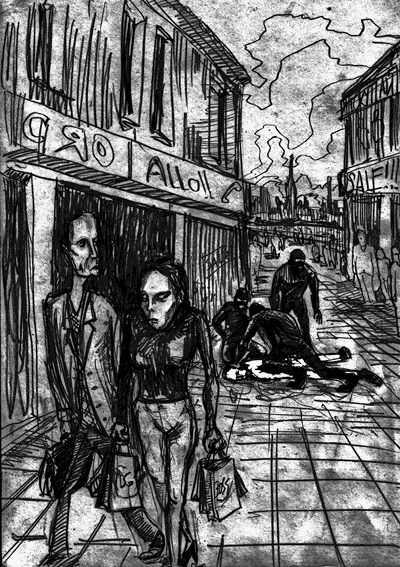

- ~~[Вступление. Игорь](./1.md)~~
- ~~[Контекст. Дело анархистов](./2.md)~~
# [1](./3.md)
- [2](./4.md)  [3](./5.md)  [4](./6.md)  [5](./7.md)  [6](./8.md)  [7](./9.md)  [8](./10.md)  [9](./11.md)  [10](./12.md)  [11](./13.md)  [12](./14.md)  [13](./15.md)  [14](./16.md)  [15](./17.md)  [16](./18.md)  [17](./19.md)  [18](./20.md)  [19](./21.md)  [20](./22.md)  [21](./23.md)  [22](./24.md)
- [Корпорация](./25.md)
- [Самоопределение](./26.md)
- [Политические](./27.md)
- [Открытое письмо анархистским кругам](./28.md)
- [Per aspera ad astra (По мотивам «Ultima verba» В.Гюго)](./29.md)
- [Послесловие](./30.md)

---

28 ноября 2010 года, Москва, кафе торгового центра «У Горбушки», 14.45 на часах. От бессонной ночи слипаются глаза. Толпы людей, суета, озабоченные лица. В каждом втором мерещится сотрудник, например, в этих троих в черных куртках на сложных мордах. Дима сидит напротив. Смеёмся от собственной паранойи. Ночью пришло предложение от Буратино (он же Лаптёнок Антон) встретиться. В душе настойчивое желание отказаться, ведь мы знаем, что он – предатель. Но это необходимо. Дима нервничает. По плану, он должен наблюдать в бинокль за встречей, но он изначально против всей этой затеи. Конечно, Дима прав. И место, и план должны быть продуманы лучше, но три месяца в бегах притупляют чувство опасности, и так не хочется думать, что этот тоже предал. Я должен успеть срисовать агентов во время встречи и дать по тапкам, попутно залив газом морду «казачка». Поздно что-либо менять. Уже время, пора выдвигаться.

Выходим из комплекса – со всех сторон метнулись четыре тени, схватив под руки. Я не удивился, ни один мускул не дрогнул. Дима отпрыгнул в сторону и бросился наутёк. Случайный прохожий ставит ему подножку, но, к счастью, безуспешно. Страна рабов, страна господ.

Один из men in black ^[Люди в черном (англ.)] успокаивает: «Это мы вашим помогаем». Хм, эти «наши» – ваши, а не наши. Звякнули браслеты, запихнули в машину, шмон по карманам, мобила, кошелёк, плеер. За часа полтора до встречи я включил телефон, с которого звонил Буре. Думал, что в людном месте не успеют найти или не будут искать вовсе, чтобы не рисковать. Дурацкая ошибка… Шапка на глаза; одна машина, затем другая, между собой люди в черном – фсбшники – не переговариваются, пишут текст на телефоне и передают друг другу. Пара остановок в туалет, смотришь на поле, лес, и кажется, что это сон…

…Граница с Беларусью. Голову втапливают в пол, значит операция – нелегальная. Передача местным в бусик ^[Бусик (от англ. bus — автобус) — микроавтобус (разг.)]. Московские говорят:

— Больше такой хуйни не подкидывайте.

— Конечно, за нами долг, мужики, – отвечают тутэйшыя.

Трогаемся. Начинают с угроз:

— Ты понял, что сказать надо? Или заедем в одно место для разъяснений?

— Да понял-понял, – отвечаю я, – чего уж тут… Ага, как же. Не копаться в памяти, не сожалеть, считать секунды, успокаивать нервы. Нужно мобилизоваться, сосредоточиться на одной истине: «Не верь, не бойся, не проси…»

— Уже 20.30, заезжай.

Лязгнули ворота, машина заехала. На глазах по-прежнему шапка. Я полностью дезориентирован. Заводят в кабинет, сажают на стул, лицом в стол, на шею опускается ребро чьей-то ладони. Впереди самая долгая ночь в моей жизни…

— Игорь, давай поговорим с тобой как человек с человеком, – раздался голос напротив.

— В таком положении люди не разговаривают, – я сам удивился своему голосу.

Видимо, они не ожидали сопротивления и на некоторое время замешкались. Это придало мне уверенности. Затем приступили:

— Мы всё знаем, говори, признавайся!

— Не знаю, не был.

— Тебя уже все сдали, чего отнекиваться?

Мучает лишь один вопрос: Дима ушел или всё же взяли позже? Но как это узнать?

— А что Дима? Даёт показания?

— Какой Дима? Ты имеешь в виду Дубовского?

Ясно! Не взяли! Значит, всё не так уже плохо.

— Какие новости в Интернете? Никого не похитили? Плохо работаете. О вашем «казачке» было известно заранее. Мы подготовились.

Открылась дверь, кто-то сказал:

— Действительно, уже висит на сайте.

Повисла неловкая пауза. Похоже, им было обидно признать, что в руках находились оба. Все, а их было трое или четверо, вышли. С сердца как камень свалился: Димон на воле, не растерялся, а Буратино вскрыт подчистую. Теперь предстоит пережить дознание. Побывав как-то на семинаре с участием Маркелова ^[Маркелов Станислав Юрьевич (1974 — 2009 гг.) – российский адвокат, правозащитник, президент Института верховенства права, сотрудник Института «Коллективное действие». Убит нацистами в 2009 г.] (земля ему пухом), я усвоил твердо: никаких признаний! Именно на показаниях, данных в первые дни, как правило, строятся дела.

Вернулись дознаватели.

— Ты наивен. Ты думаешь, у тебя есть друзья? Тебя все предали, а ты подозревал не того!

Но я уже не слушал этот бред. Первое правило – «Не верь!». Всё, что они говорят – ложь, полуправда. А если и правда, то с целью дальнейших манипуляций. Методика была проста: начинали с одного эпизода, но, как только получали отпор, переходили к другому. Генштаб… Казино… Билборды… Профсоюзы… Банк… Посольство… ИВС… Банк... Казино… И так до бесконечности.

Брали измором. Я засыпал и просыпался много раз – как только чувствовали усталость, сразу усиливали давление. В ход шло всё: угрозы, лесть, шантаж, увещевали в бессмысленности борьбы, ставили под сомнение верность товарищей, упор на эгоизм и т.п. Я не знал, сколько времени прошло. Оно перестало существовать. Было неясно, где реальность, а где сон…

«Закинем в хату к скинхэдам! У нас есть специальная скинхата!… Ты – красавчик, таких в тюрьмах любят… Тебя ещё не били нормально… Зачем тебе это? Жил бы как все. Ещё есть возможность!… Ты занимаешься каратэ? Оно ведь иерархично, ты противоречишь своим принципам!… Ты боишься взять, ты – трус!… Ты сядешь. Вопрос решённый. Только вот на пять или десять лет – решать тебе… Я бы дал тебе 12, нет, даже 20 лет… («А я бы тебя расстрелял без вариантов, сука», – думалось мне). Я звоню твоей бабушке. Пусть узнает о тебе всё… Тебе никто не наймет адвоката… Нам нужно знать только одно: кто тебе заплатил?…»

Я включался только, чтобы сказать «Не знаю, не был», и вновь уходил в беспамятство. Второе правило гласит: «Не бойся». Как правило, они блефуют. Но даже если нет, то только так можно узнать, выдержишь ты или нет. Кто испугался – уже побежден. Стоит показать страх – и ты на крючке, из тебя вытянут всё.

На некоторое время сняли шапку. За столом сидел только один:

— Эх, хороший ты парень. Инженер, здоровый образ жизни ведёшь, спортом занимаешься. Нельзя так пропадать. Я же и сам понимаю, что вы очень многое правильно говорите, вот только реализация… А может, ну его всё это?

В течение всего дознания периодически возникало чувство узнавания, что вот это и это я где-то читал. Эта мысль очень отрезвляла, подтверждалось, что всё это – инсценировка. Ведь всё равно возникало ощущение некой оторванности, подсознательно хотелось поверить в их аргументы и тем самым всё прекратить. Психологическая защитная реакция. От неё никуда не деться.

Снова нацепили шапку на глаза. Пришел некто новый. Он не стал всесторонне распрягать, а со всем внушением, отборными фразами и специфическим тоном стал втирать какое же я типа «ссыкло». …Снова ожидание. Ужасно хотелось пить и подмывало стрельнуть сигаретку. Но я знал, что этого делать нельзя. Любую просьбу нужно ставить в формат требования. Третье правило – «не проси». Любая просьба делает психологический климат мягче, и, может быть, именно этой капли будет достаточно, чтобы перевесить чашу в их пользу.

Сняли шапку, принесли еду. Опера сидят потухшие, исчерпались. Чего-то ждём, очень долго. Через маленькую форточку пробивается свет. Значит, уже день. Вдруг подъём. Снова коридорами, лестницами, коротким переходом по внутреннему дворику, мимо множества кабинетов с табличкой «Идёт допрос». Заводят к следователю. Тут же адвокат. Всё культурно. Вручается ордер на арест по обвинению в акции у ИВС на Окрестина. Начинается допрос, на часах 16.00. Уже сутки в их лапах. Дознание длилось 19 часов. Наконец-то сняли наручники… Это волшебное ощущение – свободно подвигать руками… Беру на себя дымовуху на Генштабе. Всё равно на видео есть – опознают, да и Миколу лучше разгрузить. Ведь сказали бы, что это его план, а теперь не выйдет. В любом случае, никакой вины.

Обыск. Изъятие вещей, отшмонали берцы, дали какие-то тапки довоенных времен. Уже не выдерживаю, засыпаю прямо на лавке в отстойнике. Поднимают, ведут в большой круглый холл с массивными стенами. Узкая лестница на второй этаж. Ощущение, что попал в некий симбиоз противоядерного бункера и колизея. Горизонтальная решётка закрывает весь проём со второго этажа на первый. В середине – центральный пульт с телефоном. Конвоир ведет меня вдоль дверей, одной за другой, по кругу. В руках у меня матрас, подушка, простыни. Остановка. Открывается дверь №3, и я захожу в камеру. Никого. Два железных шконаря с жесткими прутьями, два табурета, вмонтированных в стену. Такой же стол. В углу пластиковое ведро с крышкой. На тумбочке стоит поднос: картошка, селёдка, сок. Маленькое окошко за двойной решёткой в виде намордника связывает с внешним миром. Вид на кирпичную стену. Дверь с лязгом захлопывается. Падаю на матрас и моментально проваливаюсь в сон.

---

- ~~[Вступление. Игорь](./1.md)~~
- ~~[Контекст. Дело анархистов](./2.md)~~
- ~~[1](./3.md)~~
# [2](./4.md)
- [3](./5.md)
- [4](./6.md)
- [5](./7.md)
- [6](./8.md)
- [7](./9.md)
- [8](./10.md)
- [9](./11.md)
- [10](./12.md)
- [11](./13.md)
- [12](./14.md)
- [13](./15.md)
- [14](./16.md)
- [15](./17.md)
- [16](./18.md)
- [17](./19.md)
- [18](./20.md)
- [19](./21.md)
- [20](./22.md)
- [21](./23.md)
- [22](./24.md)
- [Корпорация](./25.md)
- [Самоопределение](./26.md)
- [Политические](./27.md)
- [Открытое письмо анархистским кругам](./28.md)
- [Per aspera ad astra (По мотивам «Ultima verba» В.Гюго)](./29.md)
- [Послесловие](./30.md)
