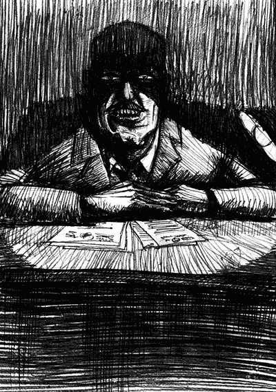

- ~~[Вступление. Игорь](./1.md)~~
- ~~[Контекст. Дело анархистов](./2.md)~~
- ~~[1](./3.md)~~
# [2](./4.md)
- [3](./5.md)  [4](./6.md)  [5](./7.md)  [6](./8.md)  [7](./9.md)  [8](./10.md)  [9](./11.md)  [10](./12.md)  [11](./13.md)  [12](./14.md)  [13](./15.md)  [14](./16.md)  [15](./17.md)  [16](./18.md)  [17](./19.md)  [18](./20.md)  [19](./21.md)  [20](./22.md)  [21](./23.md)  [22](./24.md)
- [Корпорация](./25.md)
- [Самоопределение](./26.md)
- [Политические](./27.md)
- [Открытое письмо анархистским кругам](./28.md)
- [Per aspera ad astra (По мотивам «Ultima verba» В.Гюго)](./29.md)
- [Послесловие](./30.md)

---

Проснулся от того, что в камеру вошёл старший прапорщик и потребовал доклада.

«В камере один человек, писем и заявлений нет, прогулка 1 час. Дежурный по камере Олиневич», – так звучало каждый день.

Тянулись часы… Заняться было решительно нечем. Дикий холод и сквозняк, но закутаться в одеяло нельзя. Для тех, кто попадает сюда без теплых вещей – это пытка. Особенно чувствуется отсутствие обуви. Ноги продувает в любых носках, даже вязаных. Становится лучше, только если укутать стопы в свитер. Но это – мелочи. Самое важное – вокруг постоянная тишина, отсутствует время. Иногда доносятся шаги, скрип наручников, лязг кормушек, «маяковые» уведомляющие удары в дверь, свист и шепот контролёров (они не разговаривали!).

За несколько дней начинаешь ловить и распознавать малейшие звуки. В сутки кормушка открывается несколько раз: завтрак, обед, ужин, лекарства. Дверь открывается 4 раза: утром и вечером в туалет, ещё утром на обход дежурного, один раз на прогулку (если есть). И так месяцами, у некоторых – годами, с круглосуточным люминесцентным освещением.

Полная неизвестность того, где я и что дальше. Часы забрали. Дни смешались… Просыпаешься и засыпаешь, не зная, ни как долго спал, ни времени суток.

Что такое сознание арестанта в первые дни? Это – разыгравшееся воображение под катализатором подсознательного животного страха. Лишь постоянные физические упражнения возвращали в чувство реальности. Изоляция… Каково это? Жизнь человека сплетается из тысячи социальных нитей: общение, обязательства, планы, отношения, работа, даже салат в холодильнике – всё имеет ниточку в нашем сознании. И в один миг ты начинаешь соскальзывать с этого прочного настила. Не сразу, а постепенно. Внезапно вспоминаешь о каких-то делах, от более оперативных к менее срочным, разум начинает как бы содрогаться, метаться – желает что-то предпринять. Ты пытаешься ухватиться за нити, не упустить, как-то увязать по-новому, но вместо этого теряешь одну за другой все и падаешь в бездну пустоты. Это ещё не самое страшное: здесь хотя бы видишь, что теряешь…

…В этом кромешном вакууме первая передача и первое письмо от близких, как луч света, пробивает мрак и обжигает теплом. Помню. Как вытащил из пакетов теплые носки и шерстяное одеяло. Закутался в него и тут же провалился в сон с ощущением дома и родительской заботы…

— У меня есть, о чём с вами поговорить, – сказал седой, но крепкий полковник из 4-го отделения КГБ. Из окна самого дальнего кабинета открывался внезапный вид ночного города, центрального проспекта Минска. Не поверю, что после камеры на кого-то это не произвело бы впечатления. Так близко и так далеко, длиною в годы… Чай, печенье, пряники, прочая обходительность, как в фильмах.

­— Вы знаете, почему вы здесь? – прозвучал коварный вопрос, так это делала инквизиция столетия назад.

— Хотелось бы знать для начала, где я нахожусь, – ответил я.

— Это не тюрьма, слава Богу, а СИЗО КГБ. Есть разница. «Американка», как говорят в народе. В 30-е годы здесь было расстреляно более 30 тыс. человек. Печально, но уверяю вас, ни я, ни мои коллеги даже в мыслях не могут допускать больше такого, – продолжал полковник.

Три беседы до ночи. Об анархическом движении, методах, личном выборе, смысле жизни и т.п. Я сразу решил вести разговор исключительно в рамках информации, доступной в Интернете. То есть, когда звучал вопрос, я представлял себе открытый источник, где есть такая информация, и только затем отвечал. Никакой конкретики.

Полковник интересовался такими вещами, как «финансирование», «лидеры», «зарубежные связи», т.е потенциал движения в плане использования его внешними силами для дестабилизации обстановки в стране. Ясно: у них мысль в одну сторону заточена. Никто уже не верит, что люди могут что-то делать самостоятельно из идейных побуждений. На третий день всё закончилось вопросом:

— А могут ли анархисты и власть идти вместе к светлому будущему? Хотели бы Вы создать собственную организацию?

Тут, как щелчок, в памяти всплыл фрагмент из «Дневника источника», где через такое предложение и произошла вербовка!

— По окончании срока я собираюсь заняться вопросами альтернативной энергетики, – медленно, слово за словом отчеканил я. Мой ответ сильно опечалил полковника… По дороге в камеру вспомнился Маяковский и его великое «…я лучше блядям в ресторанах буду подносить ананасную воду» ^[В оригинале: «Я лучше в баре блядям буду подавать ананасную воду!» («Вам!»)].

…Первая прогулка под падающим мокрым снегом, в дырявых матерчатых тапочках. Прогулка – это трехметровые суровые стены, дворик три на шесть шагов (!) и решётки с колючей проволокой под электрическим напряжением. Первый раз надолго отбивает охоту выходить снова, но ровно до тех пор, пока не приходит понимание того, что небо, пусть и в клеточку, лучше, чем неизменно грязно-белый потолок с неизменным светом 24 часа в сутки. Холодные капли дождя стекали по лицу, прямо как в том лесу, через который нам с Димой часто приходилось ходить на электричку, пока скрывались в Москве.

---

- ~~[Вступление. Игорь](./1.md)~~
- ~~[Контекст. Дело анархистов](./2.md)~~
- ~~[1](./3.md)~~
- ~~[2](./4.md)~~
# [3](./5.md)
- [4](./6.md)
- [5](./7.md)
- [6](./8.md)
- [7](./9.md)
- [8](./10.md)
- [9](./11.md)
- [10](./12.md)
- [11](./13.md)
- [12](./14.md)
- [13](./15.md)
- [14](./16.md)
- [15](./17.md)
- [16](./18.md)
- [17](./19.md)
- [18](./20.md)
- [19](./21.md)
- [20](./22.md)
- [21](./23.md)
- [22](./24.md)
- [Корпорация](./25.md)
- [Самоопределение](./26.md)
- [Политические](./27.md)
- [Открытое письмо анархистским кругам](./28.md)
- [Per aspera ad astra (По мотивам «Ultima verba» В.Гюго)](./29.md)
- [Послесловие](./30.md)
