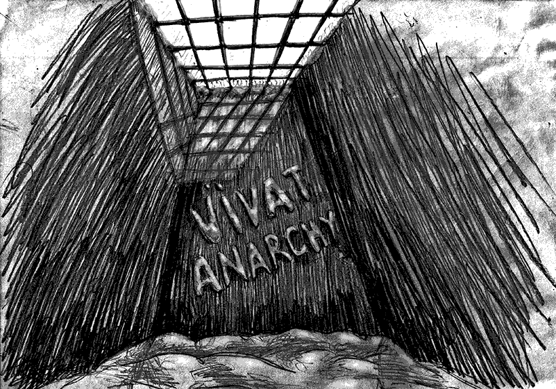

- ~~[Вступление. Игорь](./1.md)~~
- ~~[Контекст. Дело анархистов](./2.md)~~
- ~~[1](./3.md)  [2](./4.md)  [3](./5.md)  [4](./6.md)  [5](./7.md)~~
# [6](./8.md)  
- [7](./9.md)  [8](./10.md)  [9](./11.md)  [10](./12.md)  [11](./13.md)  [12](./14.md)  [13](./15.md)  [14](./16.md)  [15](./17.md)  [16](./18.md)  [17](./19.md)  [18](./20.md)  [19](./21.md)  [20](./22.md)  [21](./23.md)  [22](./24.md)
- [Корпорация](./25.md)
- [Самоопределение](./26.md)
- [Политические](./27.md)
- [Открытое письмо анархистским кругам](./28.md)
- [Per aspera ad astra (По мотивам «Ultima verba» В.Гюго)](./29.md)
- [Послесловие](./30.md)

---

2011 год начался мрачно. 1 января на прогулке мы с Максом нарисовали снежками смайлик и слоган «Vivat anarchia»[11]. Только вернулись в камеру, как в кормушке появилась голова контролёра с вопросом: «И кто у нас тут художник?» Я взял на себя и пошёл затирать назад один. Ошибка. Как-то не обратил внимания на эскорт из двух масок, которые зашли за мной во дворик. Внезапно они приказали снять свитер (бабушка вязала) и им же стереть снежные художества. Разумеется, я отказался. Тут же получил дубинкой в голову. Первые секунды я был в шоке, не мог поверить, что они всерьёз рассчитывают, что нормальный человек будет раздеваться в мороз и драить своей шмоткой эту грязную шершавую стену. Но именно этого они и хотели! Приказ – отказ – удар, приказ – отказ – удар… Били в голову, по ушам, по шее, в пах, под колено, тычки в зубы, глаза. Кровь вскипела, кулаки сжались сами собой. Увидев такой поворот, маски отошли на пару шагов и встали с дубинками наперевес, орали, чтобы разжал кулаки, но я их уже не слышал. Ситуацию разрулил вдруг выросший из-за их спин дежурный. При нём они не осмелились продолжать. Внутри всё горело… На обратном пути у лестницы снова тормознули. Те или другие, не разобрал. Требовали по команде склонить голову. Отказ. Мощный удвр в голову по шее сзади. Отказ. Снова комплексный подход. Отказ. Вконец выведенный из себя каратель заорал:

— Ты что идейный?!

— Да, идейный.

— Не пойму, ты – вор, что ли?!

— Нет.

— Так, блядь, за какую ты идею?!

— За свободу я!

А вертухай все орал: «Блядь! Иди на хуй отсюда!»

…Истеричка.

Утром следующего дня экзекуция продолжилась. Выцепили на обратном пути из сортира. На этот раз маски собрались все вместе, четверо или пятеро. Перегородили дорогу, команда – опустить голову. Отказ. Пару ударов, ноль реакции. Ставят на растяжку у стены. Поинтересовались, буду ли дальше отказываться. Ответ положительный. Резкий удар по ногам, падаю как подкошенный на колени и локти. Хватаются поднять, но крышу уже сорвало, в глазах – красная пелена. Это уже не я. Отбиваюсь от захватов, кручусь на полу как волчок. Скручивают, щелкают браслеты. Тащат в спортзал. Ставят на очень жесткую растяжку, уперев головой в стену. Растягивают ноги берцами, на голени подошвой рвут кожу. Бьют под дых, туда, сюда, но боли уже не чувствую. В крови львиная доля адреналина. Подносят к лицу включенный шокер. Страшно, но только сильнее стискиваю зубы. Переговоры. Сходимся, что буду лишь опускать взгляд при команде «голову вниз». Хоть что-то. Втихую мажут ссадины, видимо, перекисью водорода.

Ещё через сутки записываюсь в медпункт, чтобы снять побои. На лбу – гематома, колени и локти разбиты. На голени – шрам. Губы, ухо – более, чем достаточно. Однако вместо врача вся камера идёт на приём к начальнику СИЗО. В просторном, хорошо обустроенном кабинете сидит человек невысокого роста, но с властным и самоуверенным лицом.

— Вы – террорист? – жёстко спросил меня полковник Орлов.

— Нет.

— Зачем вы избили двоих контролёров? У меня вот рапорта лежат. Одному пришлось больничный давать. У другого – рука повреждена.

Во как! Рассказываю всё, как было, но начальник лишь одобрил действия своих подчинённых.

— Тут как в армии, – продолжал Орлов. – Дисциплина требует наказания даже невиновных. Мне нужен порядок, и не нужны проблемы. Сами видите, с какими испытаниями страна столкнулась.

По дороге назад до меня стало доходить, что тут всё схвачено и эти события не были случайностью. Как и само появление Орлова, заменившего прежнего начальника СИЗО, аккурат после выборов. Стало совсем мрачно.

# Cноски

- [11] — Да здравствует анархия (лат.)

---

- ~~[Вступление. Игорь](./1.md)~~
- ~~[Контекст. Дело анархистов](./2.md)~~
- ~~[1](./3.md)~~
- ~~[2](./4.md)~~
- ~~[3](./5.md)~~
- ~~[4](./6.md)~~
- ~~[5](./7.md)~~
- ~~[6](./8.md)~~
# [7](./9.md)
- [8](./10.md)
- [9](./11.md)
- [10](./12.md)
- [11](./13.md)
- [12](./14.md)
- [13](./15.md)
- [14](./16.md)
- [15](./17.md)
- [16](./18.md)
- [17](./19.md)
- [18](./20.md)
- [19](./21.md)
- [20](./22.md)
- [21](./23.md)
- [22](./24.md)
- [Корпорация](./25.md)
- [Самоопределение](./26.md)
- [Политические](./27.md)
- [Открытое письмо анархистским кругам](./28.md)
- [Per aspera ad astra (По мотивам «Ultima verba» В.Гюго)](./29.md)
- [Послесловие](./30.md)
