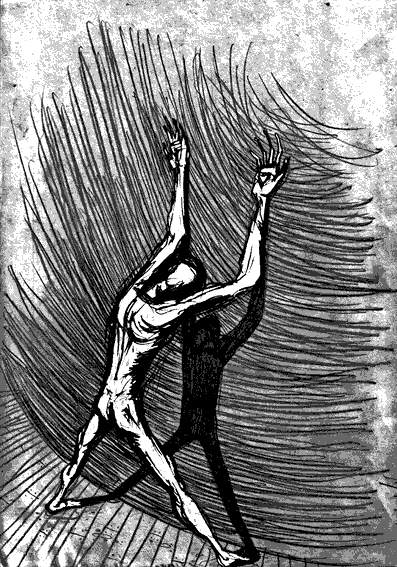

- ~~[Вступление. Игорь](./1.md)~~
- ~~[Контекст. Дело анархистов](./2.md)~~
- ~~[1](./3.md)  [2](./4.md)  [3](./5.md)  [4](./6.md)  [5](./7.md)  [6](./8.md)~~  
# [7](./9.md)  
- [8](./10.md)  [9](./11.md)  [10](./12.md)  [11](./13.md)  [12](./14.md)  [13](./15.md)  [14](./16.md)  [15](./17.md)  [16](./18.md)  [17](./19.md)  [18](./20.md)  [19](./21.md)  [20](./22.md)  [21](./23.md)  [22](./24.md)
- [Корпорация](./25.md)
- [Самоопределение](./26.md)
- [Политические](./27.md)
- [Открытое письмо анархистским кругам](./28.md)
- [Per aspera ad astra (По мотивам «Ultima verba» В.Гюго)](./29.md)
- [Послесловие](./30.md)

---

Дни, и без того безрадостные, стали превращаться в пытку. Всё начиналось утром в 6 часов с рёва масок на продоле, когда людей выгоняли в сортир. Резкие удары дубинками по стенам, перилам, полу, постоянные окрики «Голову вниз!», «Живее!», «Бегом!» тоном эсэсовца, орущего «Schneller!»[12] евреям в Аушвице у газовых камер. Лязг дверей, одно и то же повторялось с каждой камерой.

Всё вместе это создавало звучную и жёсткую какофонию, подавляющую волю и питающую страх. После утреннего обхода дежурного всё повторялось. Сначала в 8.30, когда на прогулку выходила первая смена, затем каждые 1-2 часа вплоть до 12.30, когда возвращалась последняя смена. Шесть пробежек на улицу, шесть в камеры – ровно по числу двориков. Если меньше, мы делали вывод, что некоторые камеры идти отказались. Со временем мы стали замечать, что на одних орут сильно, на других – средне, на третьих – совсем не орут. Дифференцированный подход.

С 13 до 15 – обед. Пару часов передышки. После трех часов дня начинается второй подход: шмоны. Если раньше обыски проводились раз в полтора месяца, то теперь это превратилось в еженедельную процедуру (конкретно для нашей камеры). Обычно нас выгоняли в спортзал, где мы должны были раздеться и присесть несколько раз. После прощупывания одежды ставили на растяжку к стене, зачастую с выгнутыми на тыльную сторону ладонями, как ПЗ (пожизненно заключённые). Однажды мы с Максом простояли так полчаса, пока шёл обыск. Помню, первый раз стояли «весело» пять минут, но и это – пытка, после которой с трудом удаётся пошевелить ногами. После 30 минут уже вообще ничего не хочется. Держишься, лишь бы в обморок не упасть, а под ногами лужа собственного пота и дикая дрожь в руках.

В 16.30 второй вывод в сортир. Все то же самое по утренней схеме. И снова шмоны до 18.00. Ужин. В 20.00 заступает новая смена, которая также пытается успеть провести «мероприятия». Тут обычно дергали на так называемый «личный досмотр». Это означало сбор всех личных вещей, скручивание матраса с бельём, упаковка продуктов и т.п. Затем со всеми баулами спускали в спортзал, причем раздельно занести вещи разрешали только в первые дни, впоследствии заставляли нести на себе сразу всё. Контролёры вытряхивали сумки, обыскивали шмотки, письма, пакеты; и снова всё нужно собирать. Причём всё время подгоняют: «Живее!», «Быстрее!». Не понравилась скорость исполнения – ещё раз по кругу. Назад вещи не складывались, а запихивались. Ведь времени было мало. На очереди стояли многие другие. Потом начиналось самое сложное – дорога назад. Сначала мы ходили шагом, затем – бегом. В итоге пришли к многократным забегам. По команде, загрузившись кешерами[13] и матрасом с вечно выпадающей простынёй, нужно было бежать вверх по узкой крутой лестнице. Почти у финиша каратели останавливали и заставляли спускаться вниз. И снова наверх… Этого не выдержит даже очень физически сильный человек! Доползаешь до нар взмыленный, как лошадь, и даже не раскладываешься, так всё становится безразлично.

Замучив «телесно и душевно», каратели принимались за мозг. С 18.00 до 22.00 по местному ­«СИЗО ТВ» (обычное ТВ отключили ещё в декабре) начинали крутить всякие программы, из которых 90% составлял самый настоящий шлак. Мистика, псевдоистория, чеченские боевики, террористы, политиканы, наркоманы, еврейский заговор, доллар-кровопийца – одним словом, сенсации, рассчитанные на запугивание обывателя. Всё бы ничего, но это повторялось каждый день. Десятки раз одно и то же. Они долбили мозг тревожностью, чувством опасности. Расчёт строился, видимо, на появление неврозов, в первую очередь, неврастении. Это ТВ-зомбирование было хуже всего. Иногда доводили до паники и самобичевания. Кроме перечисленного, транслировались программы откровенно ультраправого содержания таких контор, как RUSTV и «Куликово поле». Показывали фильмы «Россия с ножом в спине» и т.п. Выглядит совсем по-идиотски, когда зэков убеждают, что Путин – еврей, а Россия – сионистская держава. Периодически заходили контролёры в сопровождении масок с дубинками в руках. Проверяли, смотрим ли. Со временем стали хитрить, делали звук фоновым, а впоследствии отключали вовсе.

Прогулка во дворике – 1-2 часа – была отдушиной, несмотря на угрюмые матово-серые стены и размеры 3 на 6 шагов (были дворики и поменьше). Контора на вышке включала радио (позже отключили вовсе) или диски, иногда с вполне приличной электроникой. Но и тут каратели сумели подпортить нам жизнь: заставляли ходить по кругу, первое время с руками за спиной. Отказываешься – уводят назад в камеру. В итоге часть арестантов совсем отказалась выходить. Стали принуждать. Очень непросто отходить 2 часа по кругу, когда уже через 15 минут пол превращается в ледяной каток. Естественно, лёд никто и не думал посыпать песком. Лишь через несколько недель, когда снег начал таять и люди стали падать в этой слизкой жиже каждый день, песок появился.

Письма пропали резко. Ещё в декабре я успел получить целую кипу, но с января почти ничего не было. Доходили лишь отдельные письма от отдельных людей: родителей, родных, пары друзей и разовые письма от товарищей, где по тексту сложно было понять, что это – политические. В зависимости от поведения, а также содержания разговоров в камере, письма шли от нескольких дней до месяца. В среднем, две недели для тех, что из Минска в Минск.

Письма – коварная штука! Они здорово поднимают настроение, особенно когда описывают различные мелочи из нормальной повседневной жизни. Но коварство в том, что каратели, регулируя и фильтруя поток писем, могут создавать ложное впечатление о действительном отношении людей к тебе, о реальном положении дел на воле. Например, пишут несколько людей, с которыми у тебя примерно одинаковые по степени близости отношения, но пропустят только одного, а потом и его обрежут. Вот и начинает казаться, что тебя подзабыли, и никому ты не нужен. Или могут собрать подряд несколько писем с негативной информацией. Это тяжело. Конечно, разум тысячу раз твердит, что это – подстава, и не нужно брать в голову, но червячок сомнения-то точит. От этого нельзя убежать. На это и рассчитывают. В условиях информационного вакуума избирательная подача информации влияет на тебя независимо от твоего желания. В этой ситуации необходимо повторять, как молитву: «Придёт время, и я узнаю, как всё было», что я и делал ежедневно. Несмотря на технологии фильтрации, кое-что они упустили. Пара писем – не содержанием, но самим фактом, — сориентировали меня, вскрыли целый пласт лжи со стороны оперов, так что я знал некоторые моменты дела и мог на них рассчитывать. Информация – на вес золота. Весточки от друзей, которые я успел получить в самом начале, дали мне дополнительную точку опоры. Друзья… Сколько лет совместного пути, веселых тусовок, отвязных приключений, душевного понимания. Казалось, что это будет вечно. Кто мог думать, что вместо штурма деревянных стен ролевого замка в кольчугах и шлемах вы будете штурмовать застенки этого «красного дома» письмами с воли. Каждое послание со словами поддержки, что я получил, оказалось бесценным. Эти слова будоражили память, не давали забыть, кем я был и кто я есть, не позволяли карателям лепить из меня слепое послушное чучело.

# Cноски

- [12] — Быстрее! (нем.)
- [13] — Кешер — вещевой мешок (жарг.)

---

- ~~[Вступление. Игорь](./1.md)~~
- ~~[Контекст. Дело анархистов](./2.md)~~
- ~~[1](./3.md)~~
- ~~[2](./4.md)~~
- ~~[3](./5.md)~~
- ~~[4](./6.md)~~
- ~~[5](./7.md)~~
- ~~[6](./8.md)~~
- ~~[7](./9.md)~~
# [8](./10.md)
- [9](./11.md)
- [10](./12.md)
- [11](./13.md)
- [12](./14.md)
- [13](./15.md)
- [14](./16.md)
- [15](./17.md)
- [16](./18.md)
- [17](./19.md)
- [18](./20.md)
- [19](./21.md)
- [20](./22.md)
- [21](./23.md)
- [22](./24.md)
- [Корпорация](./25.md)
- [Самоопределение](./26.md)
- [Политические](./27.md)
- [Открытое письмо анархистским кругам](./28.md)
- [Per aspera ad astra (По мотивам «Ultima verba» В.Гюго)](./29.md)
- [Послесловие](./30.md)
