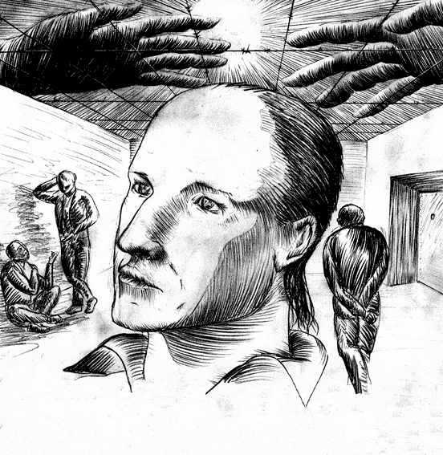

# Еду в Магадан

## Игорь Олиневич

Эта книга написана о том, что происходит сейчас в современной Беларуси, о выборе человека в ситуации между жизнью и смертью, между свободой и пленом, совестью и предательством. Всё, что случилось с ним, произошло в реальной жизни в XXI веке, в считающей себя цивилизованной европейской стране, в преддверии и после президентских выборов 2010 г. Замысел этой книги возник весной 2011 г. во время единственного свидания, которое нам дали в следственном изоляторе КГБ. Общаться можно было с большой оглядкой, но мы с мужем были так счастливы видеть его…

# Содержание

# 1. [Вступление. Игорь](./1.md)
2. 
3. 
4. 
5. 
6. 
