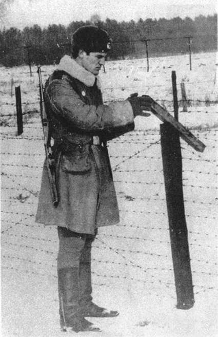
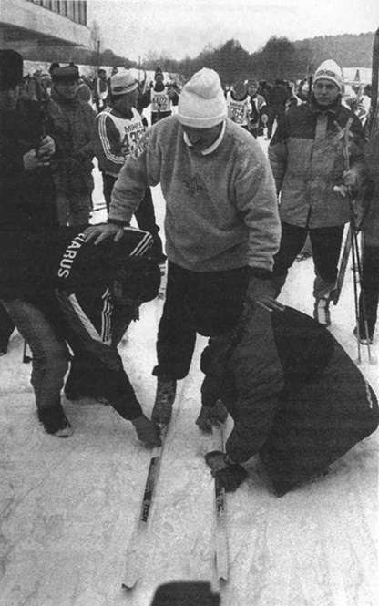
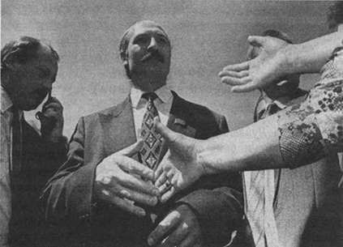

# О книге

Это первая в мире политическая биография Александра Лукашенко, написанная членом его первого предвыборного штаба, позднее отказавшимся участвовать в становлении диктатуры в Белоруссии. Исследуются перипетии и закономерности этого процесса. Кто и что привело белорусского диктатора к власти: население, личный талант демагога-вождя или группа политиков, сделавших на него ставку в борьбе за власть? Став президентом, Лукашенко одобрительно отозвался о довоенных порядках в гитлеровской Германии, видя в них образец для современной Белоруссии. В отличие от политологов, считающих его откровенность ошибкой начинающего правителя, автор утверждает, что это был сознательный зондаж общественного мнения.

Книга основана на многочисленных беседах со сторонниками и оппонентами Александра Лукашенко.

## От автора

Автор искренне благодарит Анатолия Стреляного, Юрия Хащеватского, Олега Богуцкого, Аллу Данилову, Геннадия Грушевого, Василия Леонова за помощь и поддержку в работе над этой книгой.

Автор благодарит также региональный фонд «За новую Беларусь» и всех белорусских, российских и литовских друзей, без поддержки которых эта книга не вышла бы в свет.

