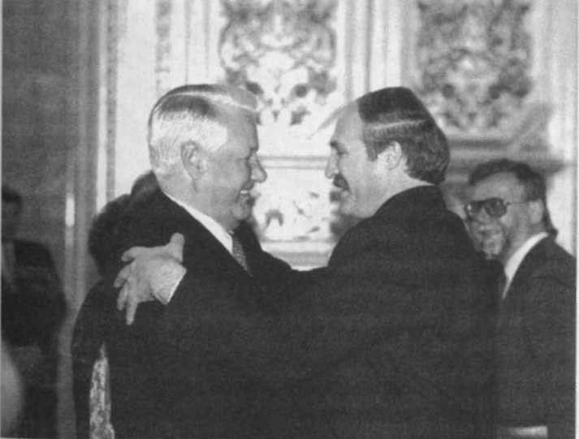
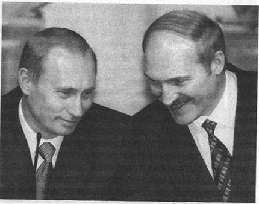
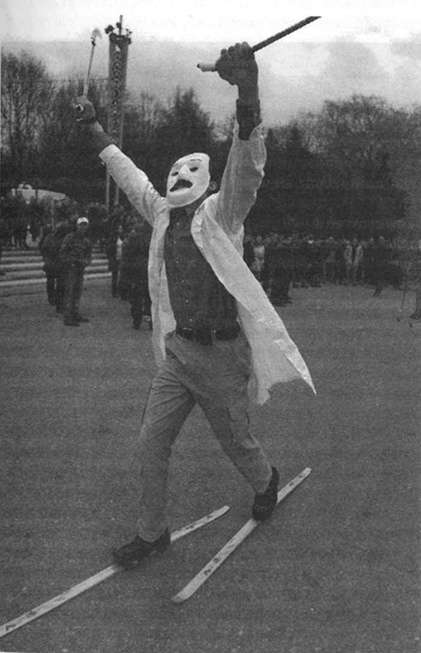
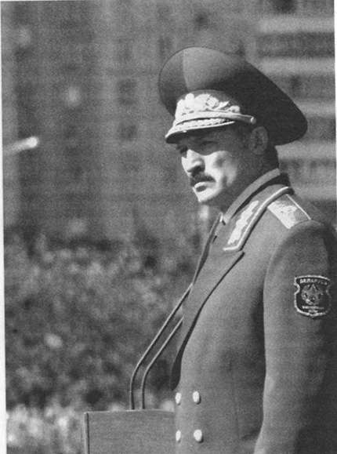

# Глава пятая. Под этот мир не стоит прогибаться

---

## Вокруг — враги **  
**

Остатки депутатского корпуса 13-го созыва сумели добиться победы лишь в одном: они действительно оповестили все международные организации о незаконности принятого на референдуме решения об изменении белорусской Конституции и продлении полномочий Александра Лукашенко на два года. Благодаря полноценной системе наблюдения, созданной с опорой на партии и общественные организации горсткой энтузиастов во главе с активистами БНФ Владимиром Анцулевичем, Верой Чуйко и Виктором Ивашкевичем, удалось доказать всему миру, что были и массовые нарушения законодательства.

Верховный Совет не сумел оплатить участникам наблюдения даже бензин, чтобы привезти копии протоколов о многочисленных нарушениях в Минск. Тем не менее, протоколы были привезены, и уже в середине дня в здании Дома правительства журналистам и дипломатам было рассказано о нескольких тысячах совершенных при голосовании и подсчете голосов нарушений^[Будь на месте белорусов украинцы, результат, как показывают президентские выборы 2004 года на Украине, мог быть иным.].

Весь мир, кроме России, результаты референдума не признал. Россия же в детали не вдавалась, а только благодушно махнула рукой: обошлось без выстрелов, без танков на улицах, без импичмента — ну и славно.

«Строев в начале еще как-то общался с Шарецким, — вспоминает Валентина Святская. — И Шарецкий однажды попытался сказать ему по телефону:

— Ну и как вас провели?

Строев пытался объясниться:

— Да, мы не ожидали, что Лукашенко окажется таким непорядочным человеком.

А потом Строев просто перестал отвечать на звонки. То был занят, то еще что-то… И Шарецкий перестал ему звонить».

Видимо, председатель Совета Федерации Егор Строев даже не думал о том, что такое поведение можно назвать предательством. Обычная «политическая целесообразность»: всегда разумнее общаться с победителями.

Вот так российские руководители приняли на себя политическую ответственность за все, в чем они помогли своему «стратегическому партнеру», роль которого Лукашенко играл и продолжает играть, хотя теперь уже и не всегда успешно \(Россия, наконец, протрезвела и начала подсчитывать, во сколько обходится ей такое стратегическое партнерство\). Но к анализу причин подобного поведения хозяев Кремля и в целом к истории отношений нашего героя с Россией мы обязательно вернемся в конце книги.

А сейчас посмотрим, как складывались взаимоотношения Лукашенко с тем, что принято называть «международным сообществом».

Самое удивительное, что точно так же, как и с «внутренним противником».

Причина для этого была: Запад не признал итоги референдума, озвученные Лидией Ермошиной, и навсегда занял почетное место в списке главных врагов Лукашенко.

Теперь у Лукашенко не было иного выхода, кроме как попытаться «опустить» и этого врага, продемонстрировать его полную несостоятельность в попытках воздействия на главу белорусского государства.

Впрочем, демонстрировать свой нрав и провоцировать ссору Лукашенко начал задолго до референдума, как бы предвидя все наперед. Весь мир потрясло сообщение об уничтоженном в белорусском воздушном пространстве воздушном шаре с двумя американскими пенсионерами: несчастные сбились с курса во время международных соревнований. Ничего не стоило заставить пилотов сесть, не уничтожая шар — и никакого смысла в этом уничтожении не было. Кроме одного — нежелания Лукашенко считаться с общепринятыми правилами и намерения об этом громогласно заявить.

Более того, как сообщали потом газеты, все командиры, принимавшие решение об уничтожении шара, получают от Лукашенко благодарность, а непосредственный исполнитель приказа — персональную награду в виде наручных часов.

## «Может, поймет?» **  
**

Но благодушный Запад не сумел понять, что сбитый воздушный шар — не случайность. В 1996 году — еще до объявления референдума — Запад предпринимает попытку договориться с Лукашенко о правилах поведения в общем европейском доме. Для переговоров было решено пригласить Лукашенко во Францию с официальным визитом, а роль переговорщика исполнял президент Франции Жак Ширак.

«Этот визит уже давно и настойчиво требовала белорусская сторона. Решение о его проведении было без энтузиазма принято в результате многочисленных консультаций в Париже»^[*Жолифф А.* Белорусское приключение // ARCHE. 2004. № 2. С. 224. Анни Жолифф — супруга первого посла Франции в Минске Клода Жолиффа.].

Я хорошо помню беседу с послом Клодом Жолиффом, сообщившим мне о возможности подобного визита.

— Как вы думаете, — поинтересовался Жолифф, — будет ли этот визит результативным? Я имею в виду, что президент Ширак попытается объяснить президенту Лукашенко, чего ждет от него Европа. Может быть, он поймет?

— Мне кажется, вы ошибаетесь, господин посол. Не нужно быть пророком, чтобы понять: Лукашенко учится лишь тому, чему он хочет научиться.

К сожалению, прав оказался я. В чем и пришлось убедиться не в меру наивным французам.

Визит «прошел достаточно пристойно, в том числе и на высшем уровне, даром что там состоялись, скорее, обмены монологами \(особенно с белорусской стороны\), чем настоящий диалог… После того как белорусский президент весело поразвлекался на пикардийской ферме, он выглядит довольным своим путешествием и доверчиво сообщает о том, что французская Конституция вдохновила его на реформирование собственной…»^[*Жолифф А.* Белорусское приключение//ARCHE. 2004. № 2. С. 224.].

Главное открытие, которое Лукашенко сделал во время своего официального визита во Францию, — оказывается, согласно французской Конституции президент избирается на семь лет\! И одним из аргументов в пользу референдума 1996 года была необходимость «приблизить» Основной Закон Беларуси к европейским стандартам\!

Стоит ли после этого удивляться тому возмущению, с которым «благодарный ученик» воспринял недовольство своих «учителей» всем происходящим в Беларуси? Он ведь искренне хотел научиться тому, что считал лучшим и достойным внимания. И когда «учителя» начали высказывать недовольство результатами усвоенных им уроков, он предпочел покинуть класс со скандалом.

## «Да куда они денутся?» **  
**

Страна, как следует из многочисленных высказываний Лукашенко — некое замкнутое пространство, которому постоянно что-нибудь или кто-нибудь угрожает. Все, что забредает, заползает, залетает в него извне, без личного согласования с контролирующим это пространство главой государства — враг^[Так из Минска выдворили вице-спикера Государственной думы России Ирину Хакамаду и лидера думской фракции СПС Бориса Немцова, прибывших по приглашению независимого аналитического центра.]. А если все-таки залетело — поступить с ним, как и положено с врагом: уничтожить, поставить на колени, «опустить». И точно так же следует поступать со всеми, кто не признает его, Лукашенко, власти или не соглашается с устанавливаемыми им порядками.

Наказать весь Запад за неприятие результатов референдума Лукашенко не мог. Но можно было «опустить» полномочных представителей западных государств: вы не хотите меня поддерживать — так я вас проучу\!

И вот заместитель министра иностранных дел Беларуси Николай Бузо сообщил представителям ряда посольств \(США, Литвы, Франции, Польши, Германии\), что им надлежит немедленно освободить загородные резиденции в поселке Дрозды под Минском^[До августа 1991 года там располагались дачи руководства белорусской компартии. После падения коммунистической системы в Дроздах мирно соседствовали резиденции первых лиц белорусского государства и руководителей аккредитованных в Минске дипломатических миссий.]. Дипломатов пытались убедить в том, что предстоит ремонт канализации в поселке, что все это — не более чем временные неудобства. Послы согласились терпеть неудобства, поскольку договоры об аренде резиденций были заключены на длительный срок, а место было очень удобным: в лесной зоне — но и в пяти минутах от центра Минска.

Хотя все понимали, что дело вовсе не в канализации, поначалу конфликт протекал вяло. Шла борьба на выдержку — у кого раньше нервы сдадут. Заниматься таким «перетягиванием каната» можно было долго, но это не устраивало Александра Лукашенко.

Ворота в резиденцию посла США были заварены, подъездные пути перекопаны, вода, электричество и телефонная связь отключены. А на следующий день послы Германии, Великобритании, Франции и Италии от имени всех стран Европейского Союза уведомили белорусские власти о своем намерении покинуть Беларусь на неопределенный срок. К их демаршу присоединились США, Литва, Латвия, Польша.

Беспрецедентный в мировой дипломатической практике кризис продолжался полгода, пока западные державы не поняли бессмысленность конфронтации и не согласились с требованием белорусской стороны освободить Дрозды — правда, лишь при условии равнозначной компенсации. Дольше всех продержался в «добровольном изгнании» американский посол Дэниэль Спекхард, но в конце концов и он вернулся в Минск.

Никакого разумного объяснения происшедшему никто из белорусских официальных лиц так и не дал. В выступлениях Александра Лукашенко в разное время звучали намеки на то, что западные дипломаты использовали свою близость к его летней резиденции для осуществления разведывательных целей.

Нет сомнений, что причины происшедшего носят чисто психологический характер: Лукашенко, который сравнивает руководителей различного уровня со свиньями, хрюкающими и толкающимися у корыта власти, не может позволить себе «вшивую дипломатию» и добивается своего. Дипломаты до сих пор убеждены в том, что Лукашенко просто избрал наиболее хамский способ продемонстрировать всему миру свою «крутизну».

И ведь — продемонстрировал\! Вернулись все, как миленькие\!

Вот как комментирует эту ситуацию писатель Евгений Будинас, который, по неоднократным уверениям министра Антоновича, заслужил право считаться «почетным дипломатом» Беларуси^[Созданный Будинасом музей белорусской материальной культуры «Дудутки» многие годы являлся центром дипломатической жизни Беларуси.]:

«Успокаивая общественность по поводу отъезда дипломатов, что грозило разрывом дипломатических отношений чуть ли не со всем цивилизованным миром, Лукашенко заявил: “Да куда они денутся? Зарплаты большие — вернутся\!”. Тем самым он продемонстрировал свою обычную житейскую логику и знание бытовой психологии не только белорусского народа, не только собственных лизоблюдов-чиновников, готовых всегда прогибаться ради благ и зарплат, но и менталитета чиновников западных, которые нашим по этим показателям не больно уступают. Вернулись-таки, и мне не однажды приходилось выслушивать их сетования по поводу благ, бездарно потерянных из-за так нелепо сокращенной каденции. Ведь это здесь он посол, со всей прислугой, охраной, почетом. А там он — рядовой служащий, вынужденный на работу ездить в метро».

Лукашенко победил.

## Скандалом больше, скандалом меньше… **  
**

Но этим дело не закончилось. Лучшая оборона — это наступление. Столь постыдный и мелковатый скандал должен быть поднят до уровня скандала принципиального. И в самый разгар конфликта Лукашенко отправляется на экономический форум в Кран-Монтано, причем с установкой на грандиозный скандал.

Аудитория была заведомо враждебна. Но Лукашенко спокойно переносит, что его, президента европейской страны, в лицо называют диктатором. Он даже доволен, потому что это оскорбление приходится как нельзя кстати: это прекрасный повод обратиться не столько к Западу, сколько к собственным «подданным», «авторитетно» — международная трибуна все же\! — высказать свою версию происходящего:

«Резиденция посольства — это территория страны, которую представляет посол. Она неприкосновенна.

Этих цивилизованных норм мы никогда не нарушали и нарушать не будем. И то, что вас здесь вводят в заблуждение, будто мы “захватили” территорию посольств, — это заурядная ложь. Речь идет о временном жилье — об особняках и дачах, в которых жили послы, уехавшие для “консультаций”. Вы являетесь приверженцами неприкосновенности собственности. Так вот, срок аренды у них давно истек, кроме представительств двух государств — России и США. Поэтому дипломаты этих двух государств имеют право остаться в “Дроздах”. Все остальные переедут в новое комфортабельное жилье, которое построено по их же просьбе в самом фешенебельном районе Минска»^[Кран-Монтана: пытаясь унизить гостя, хозяева унизили себя. Инструменты те же: провокация, клевета и ложь // Советская Белоруссия. 1998. 14 июля. № 181–182.].

Никакой срок аренды не истек, так что сведущим людям понятно, что президент Лукашенко попросту лжет.

Предположить, что все эти, мягко выражаясь, неточности, были от неведения, невозможно. Лукашенко ведь знал, о чем его будут спрашивать во время пресс-конференции, и, обвинив западных журналистов и организаторов форума в предвзятости и наличии двойных стандартов по отношению к Беларуси, сознательно шел на скандал. Не случайно во время проходившей в жесткой форме пресс-конференции он демонстративно покинул зал, а затем досрочно отбыл в Минск.

Теперь любые санкции, которые Европа может ввести по отношению к Беларуси, будут трактоваться не как реакция на нарушение белорусскими властями Венской конвенции, а как месть за «принципиальную» позицию президента в Кран-Монтано. Лукашенко ведь важно не то, что подумает Запад, а то, что скажет его электорат где-нибудь в Пуховичах или в Глубоком:

— Наш-то каков?\! Не сробел\!

— Как он их лихо отделал\! Не покорился\!

Избиратели из Пухович и Глубокого, не отягощенные познанием дипломатических конвенций, лукашенковское хамство воспринимают как нечто естественное:

— Не хотите нас признавать? А мы вас мордой в грязь\!

— Не пускаете нас к себе? А больно нам это надо\!

Так началась та личная изоляция, в которой оказался Александр Лукашенко после референдума 1996 года. Но Лукашенко полностью реализовал принцип Людовика XIV — «Государство — это я». И личная изоляция президента обернулась тем, что вся «республика оказалась в международной изоляции, она не признана в Европе, а в мире с ней решили “подружиться” лишь несколько диктаторских режимов»^[*Дейч М.* Коричневые. М., 2003. С. 394].

Наиболее ярким проявлением изоляции стало троекратно принимавшееся решение Европейского Союза об ограничении въезда на территорию ЕС высших должностных лиц белорусского государства^[Троекратное — в связи со скандалом вокруг «Дроздов», в связи с отказом белорусского МИДа выдать визы иностранным сотрудникам офиса ОБСЕ в Минске и в связи с нежеланием белорусских властей содействовать следствию об исчезновениях политических оппонентов режима — о чем чуть позже.].

У Запада оставалась лишь одна надежда: Лукашенко — это временно. В конце концов, все президенты приходят и уходят — по окончании срока полномочий.

Надежда была, прямо скажем, слабой. Привыкшие к определенным правилам игры, западные политики плохо представляли себе, с кем имеют дело. Лукашенко не вмещался ни в какие привычные рамки.

В какой-то момент он констатировал: «Так случилось, сегодня в Беларуси избрали президентом Лукашенко. Его наделили властью и требуют высочайшей ответственности буквально за все. Но это когда-либо кончится, понимаете?»^[*Силицкий В.* Гістарычны выбар Лукашэнкі. ARCHE. 2004. № 2. С. 15.]

Поняли ли это его слушатели — неизвестно. Но он сам вдруг понял и ужаснулся.

Да, Лукашенко добился власти безмерной, но не бесконечной. Он не предусмотрел этого, перекраивая Конституцию. Тогда, в 1996 году, он думал, что двенадцать лет — это очень много. А оказалось — мало. Оказалось, что сделать свою власть еще и бесконечной сейчас ему мешает даже не вся Конституция, а всего лишь одна строка в ней: «Не более двух сроков…»

**Конец первой книги**

