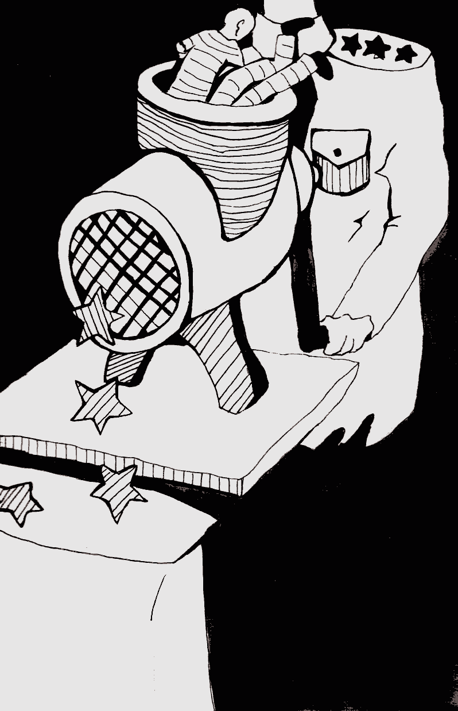

- ~~[Вступление](./1.md)~~
- ~~[Список сокращений и жаргонизмов](./2.md)~~
- ~~[ШИЗО](./3.md)~~
- ~~[Опер](./4.md)~~
- ~~[Режим](./5.md)~~
- ~~[Неприкасаемые в тюремной иерархии](./6.md)~~
- ~~[Запах](./7.md)~~
- ~~[Бунт против божественной иерархии в древнегреческой мифологии](./8.md)~~
- ~~[Божья кара](./9.md)~~
- ~~[Бунт в карантине](./10.md)~~
- ~~[Маугли](./11.md)~~
- ~~[Улетевшие](./12.md)~~
- ~~[Колдун](./13.md)~~
- ~~[Жизнь прекрасна](./14.md)~~
# [Открытое письмо](./15.md)
- [Крайняя мера](./16.md)
- [Освобождение](./17.md)
- [Заключение](./18.md)

---

>В любой тюрьме усилия ее сотрудников направлены на то, чтобы не дать заключенному бороться за свои права. Огромную роль в этом играет, кроме физической угрозы, изоляция от социума и источников информации. В середине ноября 2014 года, сидя в одиночной камере Могилевской крытой я узнал о возбуждении против меня нового уголовного дела по статье 411 УК РБ, что означало, что мое скорое освобождение откладывается еще на год. Повлиять на этот факт я был не в состоянии, разве что убить себя, чтобы не было кого судить. Единственным доступным средством борьбы оставался лист бумаги и ручка. Я должен был, насколько это возможно, привлечь внимание общественности, в том числе международной, к наличию этой статьи и практики её применения против политзаключенных и простых уголовных заключенных, борющихся за свои права. Так родилась идея написать открытое письмо в СМИ.\
\
Но написать — даже не половина дела, а одна десятая ее часть. Как переправить его на свободу? Тюремные администрации редко выпускают даже официальные жалобы в ДИН, не говоря уже о разгромных письмах в прессу. Я должен был пойти на хитрость, раскрывать которую здесь не стоит. Скажу только, что результатом ее стали усиленные шмоны при выходе к адвокату, а также угрозы перевести меня в худшую камеру. Но это меня уже мало волновало — свое дело я сделал…\
\
Написанное в марте 2015 г. письмо уже в апреле, благодаря моим родителям и соратникам, было переведено на русский и английский языки, передано представителям Евросоюза в Беларуси, дипломатам из американского посольства, опубликовано в газете «Народная воля» и во множестве других беларуских интернет-СМИ.

Здравствуйте\!

Меня зовут Николай Дедок.

Я обращаюсь с этим письмом ко всем, для кого слова «справедливость», «гуманизм» и «человеческое достоинство» не пустой звук.

26 февраля этого года я был осужден по части 1 статьи 411 Уголовного кодекса на 1 год лишения свободы. Название этой статьи — «Злостное неповиновение требованиям администрации исправительного учреждения». Приговор мне вынесен в тюрьме за пять дней до окончания моего предыдущего срока — четырех с половиной лет заключения. Отмечу также, что мне назначено максимальное наказание по этой статье — один год из возможного одного года. В 2012 по этой же статье был осужден уже вышедший на свободу политический заключенный Дмитрий Дашкевич.

В чем же состояло мое «преступление»? В шестнадцати дисциплинарных нарушениях за без малого два года пребывания в тюрьме № 4, в частности: ношение спортивного костюма, переговоры с соседними камерами и хождение по камере после 22 часов. Немаловажно то, что за каждое из этих шестнадцати нарушений я уже был наказан в дисциплинарном порядке, получив выговор или от пяти до десяти суток ШИЗО \(штрафного изолятора\), отсидев в штрафном изоляторе — только в этой тюрьме — шестьдесят суток.

В Конституции, Уголовном и Уголовно-исполнительном кодексах Республики Беларусь декларируется множество хороших принципов и прав, но они мало чего стоят, пока в Беларуси действует статья 411 УК, которая позволяет отправить человека в колонию на один год \(или на два — по части второй данной статьи\) за ношение или не ношение предмета одежды, за разговор с соседом по камере. Есть ли такая чудовищная и абсурдная правовая норма еще где-нибудь в мире?\!

Изначально статья 411 вводилась в УК для борьбы с криминальными авторитетами в местах лишения свободы и криминальными «понятиями», перешедшими Беларуси в наследство от уголовного сообщества времен СССР. Однако сегодня криминальные «понятия» практически повсеместно побеждены властью, а статья осталась, и все активнее применяется к политическим заключенным и другим заключенным, которые хоть как-то борются за свои права. Уже сама формулировка статьи открывает величайшее пространство для морального насилия и унижения человеческого достоинства. Пример: тюремный контролёр \(надсмотрщик\) плюет на асфальт и дает осужденному в руки швабру: «Убирай\!» Тот отказывается: «Не буду\!» Четырех таких отказов достаточно для возбуждения уголовного дела\! Этот случай мне рассказал один из осужденных, и, даже если он немного раздут или преувеличен — все в нем происходит в рамках закона, и это самое страшное. В полном соответствии с законом заключенного можно посадить за четыре отказа выполнять унизительную работу\! И мне не известно ни единого случая оправдания судом по статье 411 УК.

Вообще, нарушения прав человека и издевательства в беларуских тюрьмах достигли такого размаха, что стали системой и привычкой, о них можно писать не письмо, а книгу. Но в этом письме я не могу охватить все и сосредоточусь только на статье 411 УК.

Такое раздолье для произвола администрации тюрем и колоний создают написанные в МВД Правила внутреннего распорядка \(ПВР\), которые обязан выполнять каждый заключенный. Однако осужденных не знакомят с ПВР полностью, только частично, мотивируя это тем, что ПВР «для служебного пользования», что не мешает администрации требовать их выполнения от осуждённых. Сами ПВР составлены таким образом, чтобы наказать можно было любого осуждённого в любой момент за такие вещи, как небритость, грязные одежда или обувь, незастегнутая пуговица на воротнике, за то, что неправильно поздоровался или не поздоровался с представителем администрации, не встал в его присутствии и за многое другое. Нередко акты о нарушениях просто фальсифицируются, и попробуй потом докажи, что твоя обувь на самом деле блестела\! За подобные «нарушения» продолжают попадать в ШИЗО, ПКТ \(помещения камерного типа\), лишаться свиданий с родными беларуские политические заключенные: Игорь Олиневич^[В том варианте, который опубликовала «Народная воля» и другие СМИ, текст моего обращения был изменен. Неизвестный цензор, который читал рукописный оригинал, вместо перечня «Игорь Олиневич, Николай Статкевич, Артем Прокопенко, Евгений Васькович» начал список политзаключенных с Николая Сгаткевича, а Игоря Олиневича поставил вторым в списке. Хотя, казалось бы, какая разяща? Мелочь, но как хорошо она характеризует оппозиционные СМИ и политику как таковую\!], Николай Статкевич, Артем Прокопенко, Евгений Васькович. Причём строгого соблюдения ПВР требуют исключительно от тех, кто как-то «выделяется»: от политических заключенных и тех, кто смеет говорить начальству о своих правах. Остальные живут более-менее спокойно — пока молчат. Сколько раз я наблюдал применение статьи 411 УК, и всегда оно было местью осужденному за несгибаемую волю, за отстаивание своих прав и никогда чем-то иным.

В официальных изданиях чиновники исправительной \(хотя правильнее писать — карательной\) системы постоянно повторяют, что взяли лучшее от советской исправительной системы. Это действительно так, если лучшим считать тотальное пренебрежение личностью, безжалостное подавление свободы осужденных, содействие разделению их на касты и роли, использование страха как единственного метода управления. При этом президент Беларуси любит повторять, что Беларусь — центр Европы. Однако почему этот «центр» грубо игнорирует взятые на себя международные обязательства — хотя бы Декларацию прав человека, которая гарантирует человеку уважение его человеческого достоинства, право на гуманное отношение к нему и справедливый суд? В Беларуси осужденный — бесправное и зависимое существо, чью судьбу полностью удерживают в своих руках чиновники исправительного учреждения и ДИН \(Департамент исполнения наказаний МВД\). Захотят — посадят в СИЗО, ПКТ, на тюремный режим, захотят — снизят статус осужденного до того, что он перестанет существовать для других как личность \(для этих дел есть лояльные администрации заключенные, которые выполняют любой приказ\), захотят — добавят срок наказания. Это чувство отчаяния и бесправия трудно передать — его нужно пережить самому.

Конечно, мне очень хотелось бы кричать на весь мир о несправедливости, которую совершила и совершает со мной карательная система, но еще больше я хочу стать последним осужденным по статье 411 УК. Поэтому обращаюсь к международным и беларуским правозащитным структурам, ко всем заинтересованным в соблюдении прав человека международным организациям и всем неравнодушным людям Беларуси с призывом сделать все возможное для отмены статьи 411 УК. Да, беларуское общество атомизировано, сковано страхом и конформизмом, отдельные группы в нем с трудом отстаивают свои экономические права, а те, кто пытается отстаивать политические права, подвергаются бесконечным репрессиям. Но я убежден, что беларусы одумаются и поймут: «тот, кто променял свою свободу на безопасность — не заслуживает ни первого, ни второго», коллективная воля людей может заставить государственную машину прислушаться к голосу разума и начать выполнять свои международные обязательства.

Безусловно, внимание всего мира, и в первую очередь Европы, сегодня приковано к Украине, где люди гибнут десятками и сотнями, и по сравнению с этим кажется, что страдания каких-то пяти политических заключенных в относительно стабильной и, главное, мирной Беларуси не так уж значительны, чтобы кричать о них на весь мир. Но вспомним, что и события в Украине начались во многом из-за отсутствия у авторитарной власти уважения к человеческому достоинству, из-за попыток навязать обществу жизнь в страхе и антидемократическую систему ценностей. То же мы наблюдаем и в Беларуси, разве нет?

Поэтому я обращаюсь со своим призывом к вам и всем, у кого есть силы и возможность повлиять на *status quo*, с надеждой, на то, что все, что происходит со мной больше не произойдёт ни с кем в Беларуси.

Николай Дедок

Тюрьма № 4

Март 2015 года

---

- ~~[Вступление](./1.md)~~
- ~~[Список сокращений и жаргонизмов](./2.md)~~
- ~~[ШИЗО](./3.md)~~
- ~~[Опер](./4.md)~~
- ~~[Режим](./5.md)~~
- ~~[Неприкасаемые в тюремной иерархии](./6.md)~~
- ~~[Запах](./7.md)~~
- ~~[Бунт против божественной иерархии в древнегреческой мифологии](./8.md)~~
- ~~[Божья кара](./9.md)~~
- ~~[Бунт в карантине](./10.md)~~
- ~~[Маугли](./11.md)~~
- ~~[Улетевшие](./12.md)~~
- ~~[Колдун](./13.md)~~
- ~~[Жизнь прекрасна](./14.md)~~
- ~~[Открытое письмо](./15.md)~~
# [Крайняя мера](./16.md)
- [Освобождение](./17.md)
- [Заключение](./18.md)
