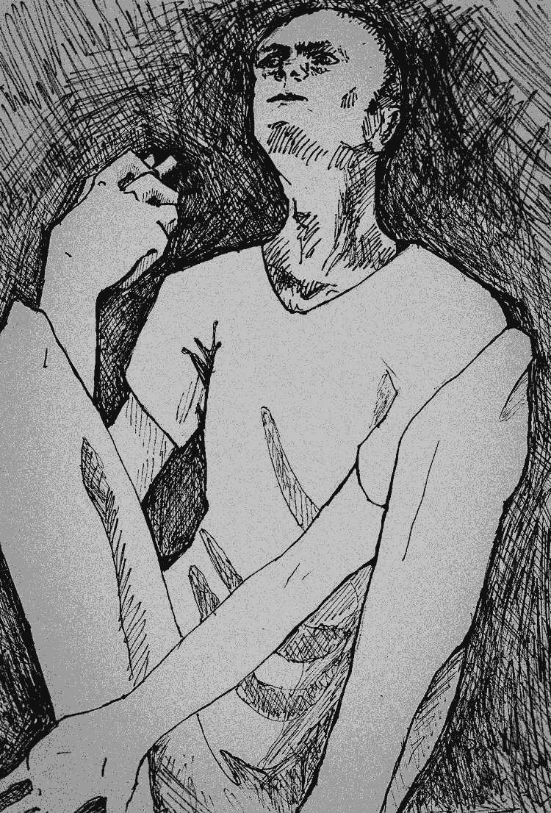

- ~~[Вступление](./1.md)~~
- ~~[Список сокращений и жаргонизмов](./2.md)~~
- ~~[ШИЗО](./3.md)~~
- ~~[Опер](./4.md)~~
- ~~[Режим](./5.md)~~
- ~~[Неприкасаемые в тюремной иерархии](./6.md)~~
- ~~[Запах](./7.md)~~
- ~~[Бунт против божественной иерархии в древнегреческой мифологии](./8.md)~~
- ~~[Божья кара](./9.md)~~
- ~~[Бунт в карантине](./10.md)~~
- ~~[Маугли](./11.md)~~
- ~~[Улетевшие](./12.md)~~
- ~~[Колдун](./13.md)~~
- ~~[Жизнь прекрасна](./14.md)~~
- ~~[Открытое письмо](./15.md)~~
# [Крайняя мера](./16.md)
- [Освобождение](./17.md)
- [Заключение](./18.md)

---

«А что это за порезы у тебя на руках? Хотел покончить жизнь самоубийством?» — спрашивают меня время от времени. Многие не понимают, зачем, сидя в тюрьме, калечить себя и какой в этом может быть смысл.

В тюремном этикете есть понятие «крайние меры». К ним относится голодовка и членовредительство. Согласно неформальным тюремным правилам крайние меры применяются в трех случаях: угроза жизни, угроза здоровью и угроза личному достоинству. Логика таких действий проста: ставя свою жизнь под угрозу, арестант вынуждает администрацию госпитализировать себя и тем самым временно избегает критической для себя ситуации, ведь за умершего зэка начальство может «вздрючить» вертухая или другого сотрудника: дать выговор, лишить премии, иногда даже уволить.

Именно угроза здоровью и довела меня в 2015 году до крайних мер. Отношения с администрацией в ИК-9 \(Горки\), куда меня привезли после осуждения по статье 411 и докинутого года срока, не сложились с самого начала, что неудивительно — не затем меня туда привезли, чтобы я спокойно отбывал срок. Среди зэков Горки считаются «пресс-колонией», где осужденных, которые выделяются из общей массы \(политических, неуправляемых криминальных авторитетов, любителей пожаловаться на условия содержания\) прессуют особенно жестко.

Не успел я приехать в колонию, как начались придирки: рано лег в постель \(за 30 минут до отбоя\), отказался от уборки туалета \(то есть не стал делать «петушиную» работу\), не так поздоровался и так далее. «Десять суток ШИЗО», — только я и слышал от начальника колонии. Но и в ШИЗО все было, мягко говоря, не так гладко. Первый срок я сидел с другими ребятами в камере, и уже там меня поразили равнодушие и цинизм администрации в отношении всего, что касается нужд арестантов. Я думал, что после четырех с половиной лет тюрьмы меня уже ничем нельзя удивить. Оказалось, можно. Например, после первых десяти суток ШИЗО дежурный офицер вывел меня не тогда, когда у меня закончился срок — около девятнадцати ноль-ноль, а почти на три часа позже. Сколько сидел в ШИЗО в других учреждениях — нигде такого не было. На мои замечания контролеру о том, что у меня срок ШИЗО уже закончился, — никакой реакции. Таким образом, я должен был дойти до отряда, побриться, умыться \(т. к. ничего этого сделать в ШИЗО толком нельзя\) и успеть все это до отбоя, который в двадцать два ноль-ноль. Если бы я не успел, на меня бы с утра обязательно составили акт за то, что я небрит \(не говоря уже о том, что не очень приятно ложиться спать, не умывшись\). Но я решил, что чистота важнее режима, и из-за того, что приводил себя в порядок, пошел спать немного позже чем в двадцать два ноль-ноль, чего и ждали контролеры, которые через пять минут после отбоя пришли в отряд и составили на меня бумагу за «невыполнение команды “отбой”». Вот вам и нарушение, за которое снова можно выписать новый срок в ШИЗО\! Такая наглость меня разъярила. Мало того, что продержали в изоляторе на три часа больше, чем должны были, так еще и исподтишка толкнули на нарушение\!

Другой неприятный случай касался горковских медиков. Согласно закону, в ШИЗО дважды в день врач должен делать обход, выяснять, все ли хорошо себя чувствуют. В ШИЗО ИК-9 врач делал один обход в день, и то, кроме воскресенья. В субботу, сидя в ШИЗО, я простыл и на следующий день начал звать врача, чтобы он хоть как-то помог, поскольку в том чтобы температурить и кашлять на дощатом полу в легкой робе приятного мало. На все мои просьбы у контролера был один ответ: «Врача нет, сегодня воскресенье\!» Да и зеки подтверждали: по воскресеньям врач не ходит. Но я знал, что это ложь. В каждой колонии в любой день недели и в любое временя есть дежурный врач, просто по скотскому обычаю этого учреждения ему лень вылезать из своего кабинета в санчасти и идти целых пятьсот метров только ради того, чтобы принести таблетки какому-то там зэку — авось до завтра не сдохнет\!

Но даже все это — недостаточная причина для применения крайних мер. Повод появилась после того, как меня посадили в ШИЗО за отказ от работы. На этот раз посадили одного, и в довольно специфическую хату — она находилась в метре от «дежурки» контролера. Якобы для лучшего контроля. Но главным было не это, а то, что хата была угловая — находилась на углу барака. Казалось бы, какая разница? Камера и камера. Но постоянный посетитель ШИЗО хорошо знает, в чем разница. Знают это и менты. Дело в том, что угловые камеры — самые сырые и холодные. В них холодно даже летом, не говоря уже о зиме.^[Как раз зимой в Могилевской крытой мне пришлось полтора месяца просидеть в камере на углу здания. Благодаря сырости на стенах появлялся конденсат. Стекая по стене вниз, он образовывал леденец в углу камеры, который, если его не «ликвидировать», вырастал буквально за день. Двадцать четыре часа в сутки мы жили в телогрейках.]

Когда тогда, девятнадцатого мая, меня отвели в камеру № 16, я сразу закрыл окно, надеясь, что к ночи «надышу» на более-менее приемлемую температуру. Но эти надежды не оправдались.

Дальше началась самая тяжелая ночь в моей жизни. Когда пришел отбой, и я прилег на пол, то обнаружил, что он никакой не дощатый. Он был настолько холодным и жестким, что мне сначала показалось, что это бетон. Но, расколупав ее в одном месте, я понял, что она из ДСП, что в свою очередь тоже нарушение закона, так как, согласно регламенту, все полы в ШИЗО и ПКТ должны быть дощатыми.

Первый «раунд» сна длился у меня минут тридцать. И он же был самым длинным. Далее у меня не получалось поспать больше пятнадцати минут — не давало всепроникающее ощущение холода. В эту ночь я понял, насколько въедливым и беспощадным он может быть: отбирая одну за другой доли градусов тепла от вашего тела, он заставляет разум не думать больше ни о чем, кроме как о том, как согреться. Навязчивая мысль стучит в голове, как дятел, который никак не закончит свою работу, ощущается вечно голодным хищником, которого тебе нечем накормить. Холодно, очень холодно. Холодно рукам, холодно ногам, холодно спине, холодно носу и ушам. Заправленные в носки брюки и заправленная в брюки роба уже давно не помогают. Где-то в середине ночи перестали помогать и традиционные «согревалки» — отжимания и приседания. У организма уже не было в запасе свободных калорий, чтобы переработать их в тепло. Мало того, после нескольких сотен отжиманий и приседаний, не оставалось уже и сил, чтобы делать их дальше. Ситуация становилась безвыходной. Ближе к утру \(как мне казалось, ведь часов, конечно, не было\), начались своеобразные «сонные галлюцинации»: мне снилось, что я сплю у себя дома под огромным теплым одеялом. Мне очень хорошо и комфортно, приятно и легко… В голове пролетает мысль: и чего это я беспокоился, прыгал, отжимался и приседал, когда мне так хорошо спится? И тут мозг дает команду на пробуждение. Открываю глаза, и по всему телу проходят тяжелая и болезненная дрожь: я наконец понимаю, где я, и что опять надо вставать и пытаться выдавить из себя какие-то активные движения, чтобы повысить температуру тела и поспать еще хоть несколько минут. Атмосферу и общее впечатление дополнял яркий электрический свет сразу двух лампочек из-под потолка. Свет в ШИЗО на ночь не выключали, и я чувствовал себя в какой-то смеси сумасшедшего дома и пыточной.

Наконец пришло утро. Поев, я надеялся поспать, чтобы хоть как-то «отбить» часы, которые не добрал за ночь, и привести себя в норму. Контролер, конечно, написал на меня акт за это \(за который мне потом добавили еще несколько суток\), но мне было уже все равно.

После утренней проверки я прилег на пол и понял, что я наивно ошибался: даже дневная температура в камере не позволяла нормально спать. Получается, спать нельзя ни днем ни ночью… Я вспомнил мучительную ночь и понял, что у меня впереди еще минимум девять таких ночей, а скорее всего больше, так как, бесспорно, начальник зоны накинет еще. И тогда я понял — надо что-то делать.

Дальше в течение всего дня я требовал у ДПНК, который время от времени приходил в ШИЗО, перевода в другую камеру. Аргументы: температура в ней ниже, чем должна быть согласно законодательству^[Внутренними правовыми актами МВД установлено, что в ШИЗО она должна быть не менее восемнадцати градусов.], а пол — ДСПшный, хотя должен быть дощатый, что тоже «не по закону». Он слушал мои просьбы и бросал безразличное «разберемся…» или «я уточню…», и ситуация не двигалась с места. Я тем временем понимал, что еще девять таких ночей — и выйти из СИЗО можно будет с целым букетом заболеваний в дополнение к имеющимся. Надо соскакивать любыми средствами. Я подготовил «мойку», которую пронес с собой в ШИЗО, несмотря на шмон \(спасибо советам бывалых арестантов\) и начал составлять план. Первоначально он был такой: сразу после вечерней проверки вскрываю вены на обеих руках и живот. Главным моментом здесь было вскрыться как следует, а не просто поцарапаться: насмотрелся я на таких, которые «вскрывались», чуть поцарапав руки, менты над ними только смеялись: перебинтуют прямо в камере и даже не спросят, чего хотел. Чтобы больше не мерзнуть в этой хате, надо резаться всерьёз, но в то же время и не «переборщить», так как, порезавшись слишком сильно, можно замёрзнуть уже навсегда. Решил так: сначала добираюсь до вен на руках, делаю точечные надрезы, кровь аккуратно сцеживаю в свою пол-литровую кружку, набираю полную \(человек может выжить, потеряв до половины крови, а во мне — около пяти литров\), после чего выливаю ее под дверь камеры \(сразу после проверки там будет ДПНК и контролер — заметят, никуда не денутся\), а после вскрываю живот \(два пальца ниже пупка — так учили\), желательно до брюшной полости — тут уж как болевой порог позволит.

В сотый раз попросив перевести меня в другую камеру, я понял, что делать этого они не будут и что нужно переходить к действиям.

Планы с самого начала спутал неожиданный сдвиг в ходе проверки, в результате чего я решил не ждать и начал вскрываться раньше.

Спрятался за «броню» \(перегородка между туалетом и остальной хатой\), чтобы меня не было видно из глазка, перекрестился, взял «мойку» и нанес первый порез — по левой руке. Было ли страшно? Конечно, да. Но я понимал, что и зачем делаю. Вопреки ожиданиям, кровь не пошла фонтанчиком, вместо этого выступила парой капель, которые потом слились в слабенький ручеек — я накапал в чашку совсем немного. Тогда начал наносить по руке уже не просто порезы, а порезы-удары, чтобы тоненькое лезвие «мойки» вошло как можно глубже. Пару раз бил лезвием дважды в один и тот же порез, чтобы его расширить. Некоторые порезы получились довольно удачными: добрые полсантиметра в глубину и сантиметр в ширину. Но крови по-прежнему было очень мало. Может, от волнения она отошла от периферии тела внутрь? Говорят, есть такой биологический механизм приспособления к опасности… Тут около моей хаты начали топтаться легавые — проверка\! Я спрятал руки за спину, выскочил из-за «брони» и встал навытяжку, а-ля послушный зек. Теперь главное, чтобы они ничего не заметили — еще рано\!

— Добрый вечер, — говорит ДПНК.

— Добрый вечер. Дедок. Всё в порядке.

— Точно всё нормально? — в глазах мусора отражается недоверие.

— Точно, — улыбаюсь.

Мусор подозрительно осматривает камеру…

— А чего не по форме одежды? — пока они заходили, я не успел надеть клифт, стоял в майке.

— Да не успел надеть, вы так быстро зашли\! — снова улыбаюсь, а сам думаю: «Господи, только бы капли на полу не заметили\!»

Наконец двери закрываются, и я внутри себя смеюсь с того, как я их провел. Лошары\!

Но тут меня подвела бдительность контролера. Я сразу полез за «броню», а контролер, видимо, интуитивно почувствовал что-то неладное и продолжил смотреть в глазок вместо того, чтобы идти к следующей хате. И, очевидно, увидел то ли кровь, то ли мою руку, которая высовывалась из-за «брони». Крик за дверью: «Он режется\!\!\!», считанные секунды — мент открывает первый замок. Я понимаю, что времени нет, перекладываю «мойку» в другую руку и быстро, сколько есть сил, полосую себя уже по правой. Мент начал открывать второй замок, от решетки. Как хорошо, что он винтовой\! Это дает мне еще пару секунд, я приспускаю резинку штанов и с максимально возможным давлением провожу себе «мойкой» по животу. Успеваю сделать так три раза, и легавые врываются в камеру. Скидываю «мойку» в умывальник, да так удачно, что она сразу попадает в слив.

ДПНК и контролер стоят, смотрят. С обеих рук и с живота у меня течет кровь. Они достают наручники и заковывают мне руки. Ведут в прогулочный дворик — в то время там как раз идет прогулка. Я сижу в состоянии легкого шока… Теперь главное, чтобы выполнили требования. Но жалею, что все произошло не так, как я запланировал. Ну да ладно, что уж поделаешь — как получилось, так получилось.

Проходит минут десять. Разговоры заключенных \(перекрикиваются с одной дворика в другой\):

— Слушай, а что там за кипиш? Чего менты суетятся?

— А это Дедок вскрылся\!

— Кто?

— Дедок\!

— А кто это?

— Политический.

— Это я — Дедок\! — вступаю в разговор.

— Так а чего ты вскрылся?

Разговорились с парнями. Объяснил им свое общее положение в этой колонии, послушал их советы…

Тут в мой дворик заходит «тройка»: начальник оперативного отдела, начальник режимного отдела и начальник медицинской части. Режимник просит раздеться — меня начинают шмонать. Всех интересует только один вопрос: как я пронес «мойку»? Конечно, я им этого не говорю. После того как они прощупали все, вплоть до резинки на моих трусах, посмотрели на мои пятки \(вдруг там что-то приклеено\), чтобы убедиться, что больше «моек» у меня нет, и только потом задали вопрос: в чем причина моего поступка?

И меня прорвало: в эмоциональной форме пересказал им, что с выполнением КГБшных приказов они явно перестарались, и озвучил свои требования: перевести меня в любую другую камеру. Они послушали.

Опер попросил всех выйти и скомандовал снять с меня наручники. Мы остались с ним наедине. Дверь дворика закрылись, и он раздраженно спрашивает меня:

— Чего ты хочешь? — по своей оперской природе он не верит, что мои требования такие, которые я озвучил, думает, что держу на уме что-то другое.

Такой вопрос сначала меня немного смущает.

— Чего я хочу, я вам не скажу, потому что вы тогда сделаете всё, чтобы я этого не получил, — был мой ответ. 

Не видел смысла у него еще чего-то просить — все равно хороших условий содержания мне в этой зоне не дождаться.

Выслушал от опера многословные полунамеки, типа: «Разве ты не понимаешь, кто ты?» \(мол, будем тебя прессовать в любом случае\), «Есть определённые правила игры…» \(что он хотел этим сказать, я до сих пор не понял\), а также попытки убедить меня жить по их правилам — опер сказал, что у них даже бывший вор в законе Галей — «уважаемый человек\!» — ходит на промзону и работает. Твердого обещания перевести меня в другую хату я от него так и не услышал.

Наконец меня повели к врачу. Отодрали от рук и от живота ткань одежды, которая уже почти присохла, а потом советовались, зашивать порезы или достаточно будет перебинтовать. Решили перебинтовать — так происшествие можно будет квалифицировать как легкий инцидент, а если бы меня зашивали, это говорило бы о том, что раны серьёзные. Это было невыгодно местному начальству, которое, как я потом узнал, докладывало о ситуации на самый верх — министру МВД.

После перевязки меня повели в хату… Туже самую. И тут я сделал еще одну ошибку. Вместо того чтобы всеми силами упираться и не идти туда, я поверил ДПНК, который сказал, что вопрос о моем переводе в другую камеру «решается». Камера была перевернута вверх дном: весь мой небогатый скарб перетряхнули, вывернули мусорное ведро — просто на пол. Искали «мойку». Было около девятнадцати часов вечера…

Примерно каждые полчаса я начинал молотить в дверь и спрашивать, почему меня не переводят. Меня кормили обещаниями, что «вот-вот». Но, когда начал наступать отбой, я понял, что меня обманули: решили пойти на принцип, мол, «он к нам с ультиматумом, тогда и мы не уступим».

На такой случай у меня был «План Б».

В шестнадцатой камере до меня сидел бывший вор в законе Дима Галеев \(«Галей»\), которого, чтобы посадить в беларускую тюрьму, экстрадировали из Швеции — МВД хотело от него чего-то в своих криминальных играх. Как результат, камера была забита разными вещами, которых обычно в ШИЗО не бывает. Одну из них я заметил с самого начала — около уборной стояла какая-то изогнутая палка непонятного происхождения и назначения \(скорее всего для того, чтобы «срабатываться» через канализацию между камерами\). Я взял тряпку и закрыл глазок на двери, чтобы контролер не видел, что я делаю. Взял палку и просунул ее в решетку, которая окружала лампочку под потолком. С ее помощью я надеялся разбить лампочку, осколком стекла вскрыться во второй раз и порезать ноги — там вен больше, и находятся они более плотно, на этот раз точно переведут в больничку, никуда не денутся\! После нескольких ударов лампочка начала раскачиваться \(она висела на проводе\), но биться не спешила. Удар о решетку, другой — она звенит, но по-прежнему не бьётся\! Размахнуться палкой тоже не получится — она ограничена «квадратом» стальных прутьев, в которые я ее продвинул. Прибегает ДПНК и с криком «Баян качает\! Открывай двери\!» приказывает контролеру открывать дверь. Офицер и два контролера влетают в камеру и быстро понимают, что я задумал. Хватают меня за руки и ставят к стене. От злости на их обман и на то, что мой план снова не удался, я уже плохо себя контролирую: начинаю кричать на них и грозить всеми смертными карами. ДПНК командует: «Доставай наручники\!» Достают наручники и пытаются меня скрутить. Я сопротивляюсь, как могу. Но их трое. Буквально вбивают мои руки в наручники: в ходе борьбы все свежие перевязки сорвались, снова пошла кровь. ДПНК хочет пристегнуть меня наручниками к металлической табуретке. Острых предметов в камере нет, но даже если бы и были, я понимаю, что, пристегнутый наручниками, я до них не дотянусь, поэтому вынужден пообещать ему не вскрываться.

Легавые уходят, оставляя меня в камере в наручниках. Проигран бой, но не война. Через полчаса приходит врач и перевязывает меня по новой. Отбой прошел, и я ложусь спать, как есть, «закованный». Через какое-то время менты заходят и снимают «браслеты».

В ту ночь я снова спал очень тяжело — кроме холода, напоминала о себе боль. Да и с порезанными руками не особо поотжимаешься. Но природа сделала мне подарок — уже на следующий день на улице значительно потеплело, и остальной свой срок в ШИЗО я провел более-менее сносно.

А через пару недель мне поставили еще один профилактический учет. Кроме профучета по категории «склонен к захвату заложников» я стал «склонен к суициду». Чушь, конечно, если бы хотел убить себя, то резал бы вены вдоль, а не поперек.

На следующий день история получила продолжение: в ШИЗО закрыли «смотрящего» за зоной и его помощника, а по всему бараку ШИЗО/ПКТ провели капитальный шмон, выкидывая нехитрые «запрещённые предметы» арестантов: таблетки, журналы, «лишнюю» одежду, нитки, канатики и подобное, при этом не забывая напоминать: это из-за того, что «политический вскрылся». Таким нехитрым способом менты натравливали на меня других зэков..

---

Какая во всем этом мораль? Мораль здесь только одна: если идешь в ШИЗО, бери с собой две «мойки».

---

- ~~[Вступление](./1.md)~~
- ~~[Список сокращений и жаргонизмов](./2.md)~~
- ~~[ШИЗО](./3.md)~~
- ~~[Опер](./4.md)~~
- ~~[Режим](./5.md)~~
- ~~[Неприкасаемые в тюремной иерархии](./6.md)~~
- ~~[Запах](./7.md)~~
- ~~[Бунт против божественной иерархии в древнегреческой мифологии](./8.md)~~
- ~~[Божья кара](./9.md)~~
- ~~[Бунт в карантине](./10.md)~~
- ~~[Маугли](./11.md)~~
- ~~[Улетевшие](./12.md)~~
- ~~[Колдун](./13.md)~~
- ~~[Жизнь прекрасна](./14.md)~~
- ~~[Открытое письмо](./15.md)~~
- ~~[Крайняя мера](./16.md)~~
# [Освобождение](./17.md)
- [Заключение](./18.md)
