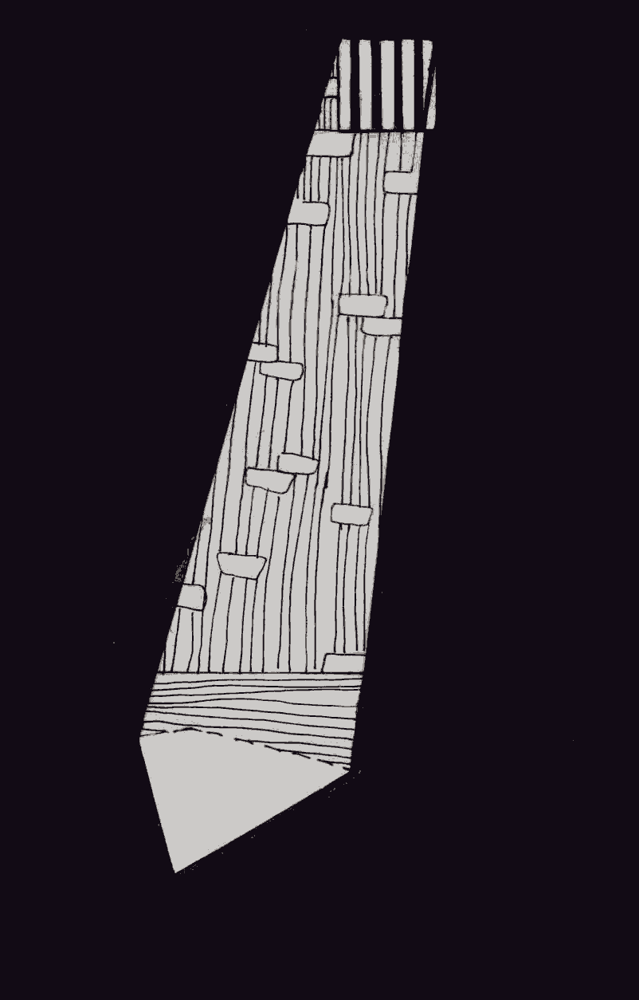

- ~~[Вступление](./1.md)~~
- ~~[Список сокращений и жаргонизмов](./2.md)~~
# [ШИЗО](./3.md)
- [Опер](./4.md)
- [Режим](./5.md)
- [Неприкасаемые в тюремной иерархии](./6.md)
- [Запах](./7.md)
- [Бунт против божественной иерархии в древнегреческой мифологии](./8.md)
- [Божья кара](./9.md)
- [Бунт в карантине](./10.md)
- [Маугли](./11.md)
- [Улетевшие](./12.md)
- [Колдун](./13.md)
- [Жизнь прекрасна](./14.md)
- [Открытое письмо](./15.md)
- [Крайняя мера](./16.md)
- [Освобождение](./17.md)
- [Заключение](./18.md)

---

«Кто не был на “губе”, тот не служил в армии», — часто говорят бывшие солдаты. Аналогично можно сказать: «Кто не был в ШИЗО, тот не сидел в тюрьме».

Без понимания того, что собой представляет штрафной изолятор, или, как его еще называют, кича, невозможно понять суть тюремной системы и многие поступки заключенных.

Согласно ПВР и УИК, штрафной изолятор — одна из тяжелейших мер дисциплинарного взыскания, которая должна применяться только за грубые нарушения режима. А поскольку определения «грубого» нарушения никто не давал, оно полностью лежит на совести начальника колонии, который и назначает это наказание.

Что такое ШИЗО? На территории колонии за дополнительным рядом колючей проволоки и КСП^[Контрольно-следовая полоса — перекопанная полоса земли, на которой видны следы.], как на острове, находится отдельный барак — барак ШИЗО/ПКТ, который является своеобразной лагерной спецтюрьмой. В этом бараке \(в случае тюремного ШИЗО — это просто подвал\), как и в обычной тюрьме, находятся камеры. В одну из таких камер после «дисциплинарной комиссии» и заводят нарушителя.

Представьте себе помещение длиной примерно два метра и шириной метр с чем-то. Дощатый пол. На этой небольшой площади находятся: нары, пристегнутые к стене \(отстёгиваются контролёром снаружи, с продола\), табуретка, столик «для приёма пищи», туалет \(унитаза нет, есть «очко», огороженное с одной стороны стенкой около метра высотой\), умывальник, небольшие полочки на стенах. Часто они расположены так, что по камере нельзя сделать и двух шагов, чтобы на что-нибудь не наткнуться. Под потолком висит лампочка, есть и «окно», если его можно так назвать. Между свежим воздухом и вами — стекло в раме, решётка с внутренней стороны и металлические жалюзи с внешней, чтобы заключённые не могли «срабатываться» — передавать что-то из камеры в камеру, а также для большего психологического давления, чтобы не было видно солнца и неба. Но администрация часто проявляет изобретательность и делает в «окнах» ШИЗО дополнительная решётку. Рекордсменами здесь можно смело назвать ментов ИК-9 \(Горки\), которые сделали в окне аж четыре решётки плюс стекло — солнечный свет в камеру почти не попадал — вполне возможно, они заслужили за такое «ноу-хау» похвалу от проверяющих из ДИН.

Перед заходом в ШИЗО заключённого ждёт обязательный шмон. Самое важное — практически ничего из одежды брать с собой нельзя, только свою «форменную» \(в некоторых колониях и «форменную» нельзя — в изоляторе выдают особую, с надписью «ШИЗО» на всю спину\). Вам разрешат взять только полотенце, мыло, зубную пасту, зубную щётку и туалетную бумагу. Даже станки для бритья можно не везде. В тех же Горках, например, тем, кто находится в ШИЗО, бриться в бане не дают, чтобы не разобрали станки на «мойки» и не использовали их, например, для того, чтобы вскрыться \(конечно, никто не думает об улучшении жизни зэков, чтобы они перестали вскрываться — проще запретить бриться\). Как результат, заключённые выходят из ШИЗО заросшие, как бармалеи.

Все остальное, что бы вы ни захотели с собой пронести \(еду, сигареты, бумагу, ручку, письма, газеты, книги\) «не положено». В ШИЗО вы должны остаться наедине с собой и, по замыслу тюремщиков, наверное, «думать о своем поведении».

Правда, хитрые зеки, которые не хотят лишаться сигарет на десять или более суток, делают так называемые «торпеды» — скрутки из сигарет, герметично запакованные в несколько слоёв целлофана, которые потом запихиваются в прямую кишку. Конечно, много сигарет так не влезет, поэтому упаковывать их в «торпеду» нужно очень плотно — это целая технология. В результате средняя торпеда из сорока сигарет имеет диаметр три-четыре сантиметра. Большинство зэков не может взять с собой более трех торпед, но доводилось слышать об умельцах, которые брали до девяти штук. После «расторпедирования» сигареты надо где-то хранить, чтобы на плановом шмоне в камере их не нашли и не изъяли. Это тоже требует от зэка определённой смекалки и хитрости.

В кормушку камеры ШИЗО трижды в день приносят еду. Ложку и миску иметь тоже нельзя — их выдают, а как поел — забирают. К 1998 г. зэков в ШИЗО кормили так: один день давали пищу по сниженной норме \(меньше, чем в отрядах\), а второй день — только хлеб и воду. «День летный, день нелетный», — так называли этот порядок арестанты, большинство из которых выходили из изолятора после пятнадцати суток наказания, держась за стенку. В 1998 г. закон поменялся, но сниженная норма питания в изоляторах была оставлена до 2010 г. Теперь зэков кормят одинаково как в ШИЗО, так и в отряде. Гуманизация\!

Трёхразовое питание — почти единственное по чему, сидя в ШИЗО, можно более-менее точно узнать который сейчас час. Ведь часы в ШИЗО тоже запрещены. Также как и все, что может помочь убить время. С ШИЗО не выводят на свидания, телефонные звонки запрещены. Нельзя получать передачи, посылки, бандероли и письма. На прогулку не выводят — двадцать четыре часа в сутки находишься в бетонной каморке. Во весь рост перед узником встаёт вопрос: чем заняться? Ответ на него он должен найти, во-первых, если не хочет сойти с ума, во-вторых, чтобы время для него не тянулось с такой мучительной неторопливостью. Ситуацию осложняет то, что сидят в ШИЗО обычно по одному. Менты знают, что делают, ведь еще Дюма заметил: «разделенная тюрьма — это уже лишь наполовину тюрьма». Администрация лагеря с удовольствием даст вам почувствовать себя узником замка Иф и посадит к вам соседа только тогда, когда все другие камеры будут заняты.

Те, кто курит, решают проблему относительно легко: пока достанешь сигареты из «нычки», пока дождёшься, чтобы контролер прошел мимо глазка, пока покуришь в окошко, потом полотенцем развеешь дым по хате, чтобы не «спалиться» — уже какое-никакое занятие. Четыре-пять сигареток за день — время бежит. Тем, кто не курит, куда сложнее. Но в любом случае почти все формы времяпрепровождения в ШИЗО запрещены ПВР. За них можно получить дополнительное взыскание — например, продление срока в ШИЗО. Разговаривать с соседями через стены, окно или канализацию — запрещено, читать-писать — запрещено \(даже если вы чудом что-то пронесли — у вас это заберут на первом же «шмоне»\), спать — запрещено, а если вас двое, и вы вылепите из хлеба шашки и решите в них сыграть, то и за это на вас могут наложить взыскание.«Не положено\!».

Остаётся немногое: ходить по камере из угла в угол, если «мебель» позволяет \(обычно это пять маленьких шагов в одну сторону\), заниматься спортом \(если можно назвать «спортом» упражнения в помещении, в которое почти не попадает свежий воздух\) или просто сидеть и думать… Лично меня спасала йога, медитация, мечты о будущем и длинные «пешие прогулки».

Но это — днём. Самое интересное в ШИЗО начинается ночью. Согласно ПВР, матрас, как и другие постельные принадлежности, заключенным в ШИЗО не разрешаются, вместо этого на ночь от стены отстегивается нара. Заключённые же на ней никогда не спят — спят на полу, потому что там теплее. Если на улице не тридцать и более градусов тепла, то ночью вас ждёт отличное приключение под названием «Попробуй поспи». Мало того, что спать придётся на досках, что тяжеловато с непривычки, главное — холод редко даст вам уснуть более чем на тридцать-сорок минут. Проспав полчаса \(зависит от температуры в камере\), вы проснётесь от озноба и осознаете, что больше спать не можете, а также очень быстро уясните, зачем на «шмоне» с вас сняли все теплую одежду\! Инстинкт выживания безошибочно подскажет вам: если невозможно поднять температуру окружающей среды, нужно поднять хотя бы температуру собственного тела, и вы начнёте делать упражнения из школьного курса физкультуры, чтобы хоть немного разогнать кровь по окоченевшим конечностям. Если вы успешно справитесь с этой задачей, то сможете поспать ещё полчаса. Чередовать спорт со сном вам придётся до самого подъёма, когда на завтрак баландёр принесёт вам горячего \(если повезет\) чайку и миску каши.

С течением времени набираешься опыта: заходя в камеру, заклеиваешь окно туалетной бумагой \(хотя нет свежего воздуха, зато теплее\), находишь места, где спать удобнее всего \(я высчитывал их по стертости краски на полу: где краска самая стёртая, там и нужно ложиться спать, ведь это говорит о том, что там спали многие до меня\), заправляешь брюки в носки, чтобы уберечь крупицы тепла, делаешь из своих тапочек и свитков туалетной бумаги отличную подушку.

В любом случае, проснетесь вы разбитым, и весь день вам будет хотеться спать. Наконец, поддавшись этому желанию, вы приляжете на пол, и контролер с радостью напишет на вас акт о нарушении. \(Еще не забыли? Спать днем запрещено\!\) А через несколько дней откроется дверь, и вам сообщат: «Такого-то числа в таком-то часу осужденный такой-то спал на полу камеры номер такой-то штрафного изолятора, чем нарушил пункт такой-то Правил внутреннего распорядка». И предложат расписаться за очередные десять суток. Особым шиком у ментов считается принести такую бумагу в последние часы, даже минуты, до освобождения, когда ты уже наперед смакуешь, как вот-вот попьёшь в отряде горячего кофе с шоколадкой и будешь спать эту ночь в тёплой и мягкой постели.

Сколько же можно держать заключенного в штрафном изоляторе? К 2008 году этот срок составлял пятнадцать суток. Потом с очередной волной «гуманизации» его снизили до десяти, но де-факто это ничего не изменило, так как речь идет о «одноразовом» наказании, за одно нарушение. А за «нарушения в ШИЗО» узника могут содержать там сколь угодно долго. «Спит на полу» — не единственный повод. В каждом лагере своя типичная отписка, которая стряпается на арестованного, чтобы продлить его срок в ШИЗО. Где-то это «не произвел уборку», где-то — «расстегнутая пуговица»…

Никогда не забуду, как в ИК-17 в Шклове, где я попал в ШИЗО через два часа после того, как приехал в колонию, решил: ну, сейчас не дам им повода, буду делать все по уставу\! Не будет к чему придраться, и выпустят через десять суток\! Крошечной тряпочкой вычистил всю камеру: убрал паутину, пыль, грязь, даже в тех местах где, уверен, их не убирали с момента сооружения барака. Вечерняя проверка. Открываются двери. В тесную камеру буквально врываются сразу три контролёра и ДПНК, и начинают остервенело мотать головой по сторонам, проводить руками по полкам, рёбрам нар, батареям, столику, наклоняться, забираться под столик и чуть не на четвереньках ползать, выискивая пыль и хоть какую-нибудь частичку грязи. Все тщетно — камера «сверкает». Тогда один из контролеров, тот, который перед этим проводил рукой по полке, на которой частично облупилась старая краска, нажал рукой и растер ее, частички краски остались на его руках:

— О\! А вот и пыль\! Составляем на тебя документ\!

Что я им ответил, уже не помню. Но тот случай окончательно похоронил веру в то, что политзаключенному в зоне можно «жить-чтобы-тебя-нет-трогали».

Другой случай с ИК-9 \(Горки\). Парень, который знал, что менты на него злы и скорее всего захотят продлить ему срок пребывания в ШИЗО, намеренно вёл себя примерно — застёгивал клифт на последнюю пуговицу, не спал днём и так далее. И вот очередной день. Прошёл обед. Несколько парней, сидевших с ним в хате \(он был не один\), разлеглись на полу и «дают храпака». Открывается дверь, в хату заходит ДПНК. На тех, кто спит, он не обращает никакого внимания. Между ним и «примерным зеком» происходит такой разговор:

— А ты чего не спишь?

— А я не нарушаю распорядок дня\!

— Не нарушаешь, да?… Ну, тогда бумага на тебя, бумага\!

И потом на дисциплинарной комиссии арестант может сколько угодно доказывать, что он не спал или еще чего-то не нарушал. Я не слышал и не видел ни одного случая, чтобы эти объяснения хоть раз помогли кому-то хотя бы снизить наказание, не то что избежать его.

В ИК-17 \(Шклов\) еще в былые времена, когда в зоне часто можно было встретить мобильные телефоны, оперативники вдалбливали зекам: за владение мобилой — тридцать суток ШИЗО\! А как же тридцать, когда законом разрешено максимум пятнадцать? Получается, человек еще не попал в ШИЗО, а менты уже знают, что он совершит там «нарушение режима» и придётся докинуть ему еще пятнадцать суток?

Наглость ментов и привычность к беззаконию у зеков доходят до комического абсурда. Один из бывших сидельцев ИК-8 \(Орша\), рассказывал мне, как там ему добавляли суток в ШИЗО. На проверке в камеру заходит ДПНК, сверяет количество людей в камере по списку. Смотрит, кто в камере по расписанию дежурный, и, если это тот самый, кого оперативники приказали «отстрелить», говорит, даже не отрывая взгляда от списка: «Иванов, паутинка\!» — и выходит. Это значит, что в камере под потолком висит паутинка \(или ДПНК считает, что висит — а есть она действительно или нет, не играет никакой роли\), и в этом виноват дежурный по камере, который плохо в ней убрал. Это значит, что на него составят акт о нарушении, который будет рассмотрен начальником колонии на дисциплинарной комиссии, где сотрудники колонии, в свою очередь, будут решать вопрос о наложении на Иванова дисциплинарного взыскания. Но заключённому такое длинное объяснение ни к чему. Слово «паутинка» после его фамилии означает одно: его пребывание в ШИЗО продлевается минимум на десять суток. Но во время этого спектакля никто даже не задаёт вопросов, полное взаимопонимание\!

Сколько я ни искал — не нашел правового акта, который бы ограничивал срок пребывания заключённого в ШИЗО без выхода. Максимальный срок, который я находился там безвыходно — двадцать суток, а общий мой «стаж» на момент освобождения подошёл к полугоду. Бывший политзаключённый Евгений Васькович без выхода проводил в ШИЗО могилевской крытой по тридцать суток, а в общей сложности отбыл там год. При мне одного парня держали в изоляторе шестьдесят суток без выхода — просто за то, что он не хотел подписывать «обязательство о правопослушном поведении».

А мой сокамерник по все той же «крытой» в 2005 году высидел в ШИЗО без выхода сто восемьдесят суток\! Раз в пятнадцать дней его выводили в штаб, чтобы там выписать очередное взыскание, и сразу заводили обратно. И так двенадцать раз…

Поэтому, если вам когда-нибудь придётся услышать от мента, бывшего или действующего, или от государственного журналиста, от продажного псевдоправозащитника о гуманных и европейских стандартах содержания в беларуских тюрьмах, просто расскажите им про ночные отжимания, сто восемьдесят суток в бетонной каморке и «паутинку»…

*Июль 2016*

---

- ~~[Вступление](./1.md)~~
- ~~[Список сокращений и жаргонизмов](./2.md)~~
- ~~[ШИЗО](./3.md)~~
# [Опер](./4.md)
- [Режим](./5.md)
- [Неприкасаемые в тюремной иерархии](./6.md)
- [Запах](./7.md)
- [Бунт против божественной иерархии в древнегреческой мифологии](./8.md)
- [Божья кара](./9.md)
- [Бунт в карантине](./10.md)
- [Маугли](./11.md)
- [Улетевшие](./12.md)
- [Колдун](./13.md)
- [Жизнь прекрасна](./14.md)
- [Открытое письмо](./15.md)
- [Крайняя мера](./16.md)
- [Освобождение](./17.md)
- [Заключение](./18.md)
