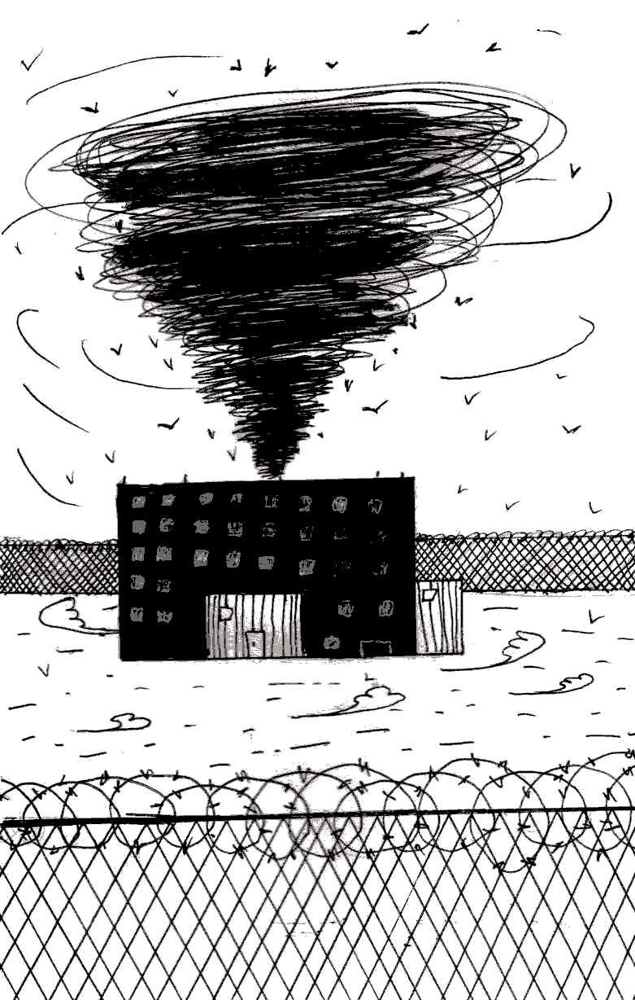

- ~~[Вступление](./1.md)~~
- ~~[Список сокращений и жаргонизмов](./2.md)~~
- ~~[ШИЗО](./3.md)~~
- ~~[Опер](./4.md)~~
- ~~[Режим](./5.md)~~
- ~~[Неприкасаемые в тюремной иерархии](./6.md)~~
# [Запах](./7.md)
- [Бунт против божественной иерархии в древнегреческой мифологии](./8.md)
- [Божья кара](./9.md)
- [Бунт в карантине](./10.md)
- [Маугли](./11.md)
- [Улетевшие](./12.md)
- [Колдун](./13.md)
- [Жизнь прекрасна](./14.md)
- [Открытое письмо](./15.md)
- [Крайняя мера](./16.md)
- [Освобождение](./17.md)
- [Заключение](./18.md)

---

Каждая тюрьма пахнет по-своему.

Вываливаясь из тесного автозака со своими клунками-кешерами, первое что видишь — изучающие рожи вертухаев. На подсознательном же уровне поры уже начинают впитывать запах той тюрьмы, которая станет на эти месяцы или годы твоим домом.

Володарка пропиталась тревогой. От «кабинетов» до «подлодки», от «сборки» до «кичи», от прогулочных двориков до санчасти, от нового корпуса до «красного корпуса» — её бетонные стены, местами отделанные кафелем, дышат тревожным ожиданием, беспокойством за собственную судьбу, неуверенностью в завтрашнем дне, пугающей неизвестностью. Куда же опер кинет? В «братскую» хату? В «мужицкую»? Или, может в «пресс-хату»? Следак пришел\! Что там? Очная ставка? Подельник стал меня сливать? Или, может, уже будут с делом знакомить? Адвокат\! Чего так рано-то? Недавно ведь приходил\! Может, у родных что случилось?

24 часа в сутки это место впитывает душевные волнения и нервозность тех, кто в нём заточён.

СТ-8, она же «Жодино», она же «Черный бусел» \(романтическую кличку дали тюрьме, я так подозреваю, для пущего пафоса и важности, сами же менты по аналогии с российским «Черным лебедем»\) пахнет страхом. Он въелся в истёртые ступеньки, надраенные полы, бетонно-металлические камеры, выкрашенные бежевым стены и головы арестантов. На Жодино заключённых бьют. Корпусные и «резерв» бьют за отказ становиться на растяжку, за грубое слово в адрес контролёра, тюремные опера бьют за нежелание давать явки с повинной и за объявление голодовки. Жодино — «красная» тюрьма, в начале 2000-х в ней ломали воров в законе и всевозможных тюремных авторитетов. Их кровь продолжает пахнуть страхом, заражая им уже сегодняшних арестантов и опьяняя вседозволенностью вертухаев.

Могилёвская крытая — официально «Тюрьма № 4» — пахнет сном. Персонал спокоен и невозмутим \(хотя бывают и исключения\), на продолах тихо, никто никуда не торопится: в воздухе витает сонная и флегматичная атмосфера. Примерно за час до отбоя по каждому продолу в крытой расстилается длиннющий ковёр: чтобы заглушать шаги контролёра. Я так и не выяснил для себя, зачем же это делается: чтобы громкими шагами не мешать зэкам спать или же чтобы те не слышали, как вертухай подкрадывается к двери и подслушивает, о чём беседуют в камере?

Ночью на этаже настолько тихо, что, лёжа на наре, слышишь, как вертухай готовит себе чай. Вот он закипятил электрочайник, залил кипяток, насыпал сахар, размешал… сёрбнул из кружки…

Интересно, ведь и в Могилёве зэков бьют, ведь и там кто-то ждёт нового срока. Но всё же — атмосфера совсем другая. Быть может это оттого, что половина тамошнего населения — люди со сроками от 10-ки и больше? Им уже надоело бояться, незачем нервничать и нечего ждать…

Есть такая программа — «Битва экстрасенсов». Однажды, смотря на колдунов, делающих пассы руками и загадочно вглядывающихся вдаль, я подумал: вот бы они умели своими глазами видеть энергетику зданий и мест\! Тогда над каждым из этих строений: Пищаловским замком, бывшей психиатрической лечебницей, переоборудованной в Могилёвскую тюрьму, тюрьмой в городе Жодино — в местах, где злая воля людей, однажды причинивших боль своим ближним, встречается со злой волей государственной системы, синергетически умножая друг друга, — они бы увидели огромную, на полнеба, чёрную воронку, секунда за секундой вытягивающую жизнь из тех, кто под ней оказался.

*Июль 2016*

---

- ~~[Вступление](./1.md)~~
- ~~[Список сокращений и жаргонизмов](./2.md)~~
- ~~[ШИЗО](./3.md)~~
- ~~[Опер](./4.md)~~
- ~~[Режим](./5.md)~~
- ~~[Неприкасаемые в тюремной иерархии](./6.md)~~
- ~~[Запах](./7.md)~~
# [Бунт против божественной иерархии в древнегреческой мифологии](./8.md)
- [Божья кара](./9.md)
- [Бунт в карантине](./10.md)
- [Маугли](./11.md)
- [Улетевшие](./12.md)
- [Колдун](./13.md)
- [Жизнь прекрасна](./14.md)
- [Открытое письмо](./15.md)
- [Крайняя мера](./16.md)
- [Освобождение](./17.md)
- [Заключение](./18.md)
