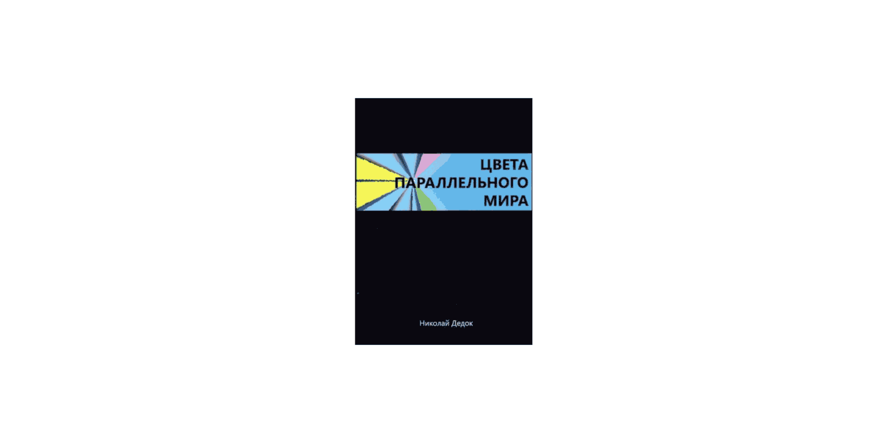

# Цвета параллельного мира

## Николай Дедок

Николай Дедок — активист анархистского движения, был задержан 3 сентября 2010 года по обвинению в нападении на российское посольство в Минске. В ходе следствия обвинение были переквалифицировано: автору вменили организацию символических акций прямого действия против государственных учреждений, сопряженных с уничтожением имущества. Своей вины он не признал.

В ноябре 2011-го международные правозащитные организации признали Николая политическим заключенным. В ходе своего 5-летнего тюремного срока сменил несколько карательных учреждений. Освобожден 22 августа 2015 года указом президента Беларуси. На данный момент является студентом Европейского гуманитарного университета (Вильнюс) по специальности «Всемирная политика и экономика» и журналистом беларуской газеты «Новы час».

# Блоги автора

- Фэйсбук: facebook.com/happymikola
- ВКонтакте: vk.com/mikola_dziadok
- Телеграм: https://t.me/MikolaDziadok
- Некорпоративная платформа: https://mikola.noblogs.org/

# Контакт с автором: mikola@riseup.net

# Поддержать автора:

- valjalee@gmail.com — PayPal
- Jd@q28w_^APmXFfMeeU6&T — Bitcoin

## [О книге](./0.md)

«Цвета параллельного мира» — сборник рассказов бывшего беларуского политзаключенного Николая Дедка. Автор был арестован в 2010 году по обвинению в акциях прямого действия в Минске и провел в заключении пять лет. В сборнике представлено 16 рассказов и эссе, написанных в неволе и после выхода на свободу и повествующих о «многоцветных» ситуациях тюремной реальности — комичных и ужасающих, оптимистичных и мрачных.

Будучи убежденным анархистом, автор сопровождает свои наблюдения размышлениями о политической составляющей увиденного и анализом механизмов контроля в карательной системе и обществе в целом.

[Подробнее о книге](./0.md)

# Содержание

# [Вступление](./1.md)
- [Список сокращений и жаргонизмов](./2.md)
- [ШИЗО](./3.md)
- [Опер](./4.md)
- [Режим](./5.md)
- [Неприкасаемые в тюремной иерархии](./6.md)
- [Запах](./7.md)
- [Бунт против божественной иерархии в древнегреческой мифологии](./8.md)
- [Божья кара](./9.md)
- [Бунт в карантине](./10.md)
- [Маугли](./11.md)
- [Улетевшие](./12.md)
- [Колдун](./13.md)
- [Жизнь прекрасна](./14.md)
- [Открытое письмо](./15.md)
- [Крайняя мера](./16.md)
- [Освобождение](./17.md)
- [Заключение](./18.md)
