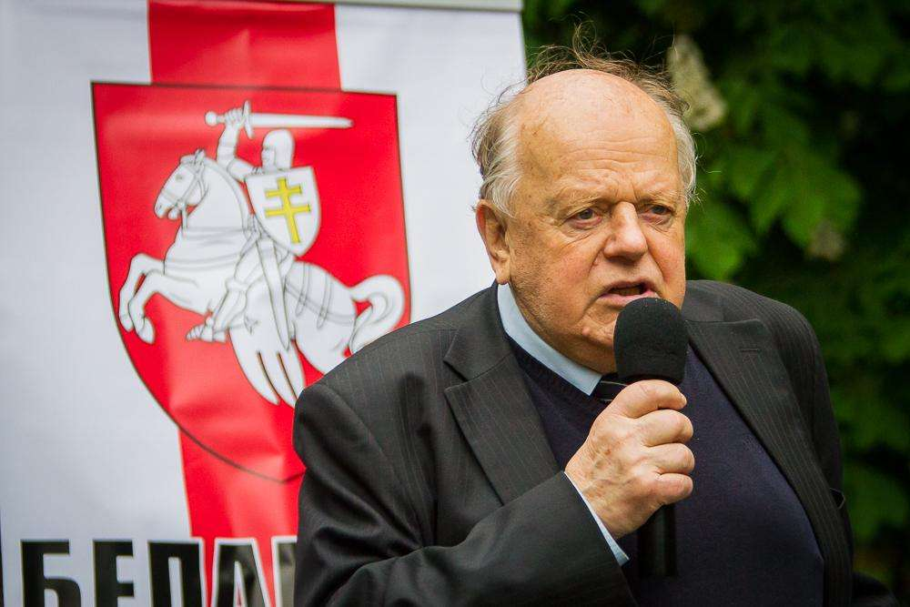
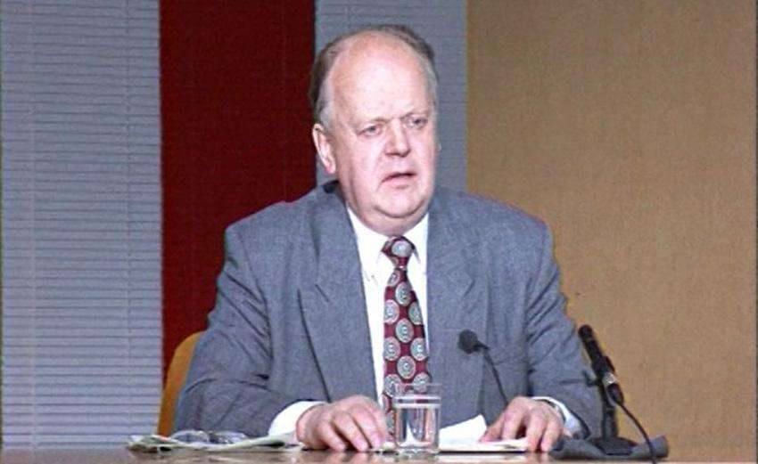
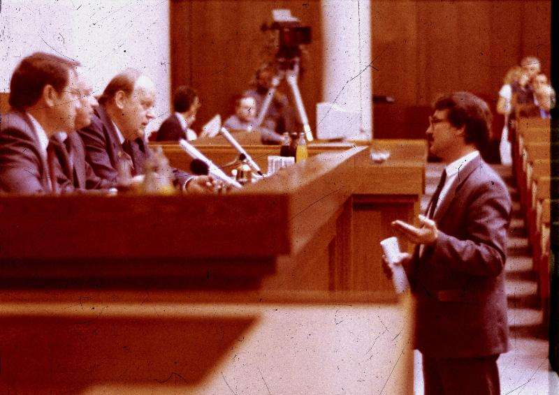

- ~~[Кебич](./1.md)~~
# [Шушкевич](./2.md)
- [Дубко](./3.md)
- [Новиков](./4.md)
- [Пазьняк](./5.md)

---

**Что было бы с Беларусью, если бы победил…**

# Шушкевич

Я уже выходил из комнаты, где записывали мое выступление для радиостанции «Беларуская Маладзёжная», как меня остановил невысокий и тогда еще просто седоватый незнакомец:

— Молодой человек, мне понравилось, как вы говорили. Что вы делаете в штабе Лукашенко? Бросайте его, переходите к нам\! Победит Шушкевич. Это я вам говорю. Я, — с твердой уверенностью еще раз повторил седоватый, затушил бычок \(кажется\) и ушел.

— Кто это? — спросил я журналистку Инну Студинскую.

— Мацкевич. Он недавно приехал. Говорят, что умный, — задумчиво сказала Инна.

— Да? — удивился я. Я был убежден, что Станислав Шушкевич не победит. Но если умные люди утверждают…

Представим, что победил.

## Кадр за кадром

Победа Шушкевича была бы воспринята в Верховном Совете, всего несколько месяцев тому назад отправившем Станислава Станиславовича в отставку, как собственное сокрушительное поражение. Еще бы\! Депутаты были просто народными, а Шушкевич стал всенародным\! Что же теперь делать?

Они пошли бы сдаваться новому государю десятками, понимая, что конец парламента близок, как никогда. И Шушкевич многих даже простил, тем более, что распускать высший законодательный орган он не собирался. А зачем? Выборы уже на носу, меньше года осталось.

И парламентское большинство вздохнуло с некоторым облегчением. Тем более, что Вячеслав Кебич ушел с поста премьер-министра, но в правительстве осталось множество знакомых лиц. Даже Михаил Мясникович сохранил пост первого вице-премьера при новом премьере Станиславе Богданкевиче — экс-главе Национального банка.

Правда, Шушкевич настоял на увольнении Петра Кравченко с поста министра иностранных дел, но тот как ни апеллировал к своим бывшим коллегам по депутатскому корпусу, никакой поддержки от них не добился: по вступившей в силу Конституции глава МИД становился креатурой президента. И на этот пост Станислав Станиславович назначил тоже всем хорошо знакомого Петра Садовского. Как говорится, от Петра Петра не ищут, а вон оно как случилось — нашли\!..

На многие посты у Шушкевича были свои кандидатуры. Все-таки в должности спикера парламента он успел поездить по стране, поговорить с руководителями разного ранга. Да и, прямо скажем, БГУ, которому он отдал лучшие годы своей жизни, представлял собой неиссякаемую кадровую кладовую. Так что правительство превратилось при Шушкевиче в эдакий профессорский клуб.

Но людей все равно не хватало. И Шушкевич обратился с просьбой к руководству Белорусского Народного Фронта — мол, есть у вас люди, так поделитесь\! Скажем, дайте мне того же Винцука Вячорку.

Однако лидер БНФ Зенон Пазьняк неожиданно для всех отказал. Он не верил в то, что Шушкевич пришел всерьез и надолго. Для Пазньяка тот был фигурой временной, скоротечной. И вот падет Шушкевич — и народ, слегка поумнев, таки доверит бразды правления Зенону Станиславовичу.

## Верховный Совет как бомба

Но время шло, а Шушкевич никак не падал. Не то, чтобы он вцепился в кресло президента посиневшими пальцами, нет — просто не падал.

Премьер Богданкевич как-то сумел выкрутиться и, не соглашаясь на предложения россиян перейти на российский рубль, все-таки стабилизировал рубль белорусский. Так что к моменту выборов нового состава Верховного Совета правительство сидело в своих кабинетах довольно прочно — даром что вечный оппонент Богданкевича депутат Александр Лукашенко критиковал министров за излишнее внимание к белорусскому языку в ущерб прочим насущным проблемам.

Но и проблем все-таки становилось несколько меньше. Рынок наконец наполнился товарами, за что избиратели благодарили депутатов, и многие из них сумели даже переизбраться в новый состав Верховного Совета. Но самые значительные фракции создали в нем Партия Народного Согласия, которую возглавлял мэр Молодечно Геннадий Карпенко, и Белорусский Народный Фронт Зенона Пазьняка. Третьей была фракция ПКБ, в которую вошли многие деятели из бывшего депутатского корпуса. Однако появились и новые лица — в том числе и руководство партии. Так что открывать первую сессию первого демократически избранного Верховного Совета пришлось… бывшему члену Политбюро ЦК КПСС Анатолию Малофееву. Что он и сделал с искренним удовольствием.

Так парламент превратился в бомбу замедленного действия. Три ведущие политические силы ожидали в нем падения профессорского правительства, искренне веря в то, что вслед за правительством все-таки падет и президент.

И, как писали Ильф и Петров, когда все застраховались, стало понятно, что «Воронья слободка» обречена.

## Спички в руках Кремля

Вопрос оставался в том, кто именно и с какой стороны подожжет фитиль.

То, что президент Шушкевич намерен начать переговоры о вступлении в Европейский союз, было известно всем: сам Станислав Станиславович этого и не скрывал. Россия должна была забеспокоиться.

Фактически единственной гарантией невмешательства России во внутренние дела Беларуси были личные отношения Шушкевича и его российского коллеги Бориса Ельцина. Но после выборов 1996 года Ельцин начал отходить от дел. Старая команда силовиков и руководителей ВПК ушла в политическое небытие.

Новые члены «регентского совета» при больном президенте России были прагматиками. И Шушкевич превратился в серьезную помеху: его протекционистская политика препятствовала свободному проникновению российского капитала. Приватизация в Беларуси шла, но приоритет отдавался европейским инвесторам.

И российский рынок начал постепенно «схлопываться» для белорусских товаров. Не имея возможности купить пакеты акций интересующих ее олигархов белорусских предприятий, Россия начала строить аналогичные предприятия. Причем правительство страны давало тем, кто строил такие заводы, серьезные налоговые льготы.

В Беларуси начался кризис перепроизводства. Крупные предприятия, которые приходилось сохранять государственными, чтобы избежать резкого роста безработицы, лишились традиционного рынка. Новые рынки освоить не успели. Правительство рассчитывало на западные кредиты, однако их не хватало.

На очередной сессии \(это должно было бы произойти в конце 1998 года\) вопрос об отставке правительства Станислава Богданкевича был внесен в повестку дня — и получил поддержку большинства. Вмешательство президента и его попытка защитить потерявшего популярность премьер-министра оказались безуспешными. Неожиданно сблокировавшиеся Партия Народного Согласия и Партия коммунистов Беларуси сумели отправить Богданкевича и «профессорский кабинет министров» в отставку.

## Кризис. «Шушкевич.Бай»

Единственной крупной депутатской фракцией, которая заявила о неприемлемости «путча», была фракция Белорусского Народного Фронта. Ее лидер Зенон Пазьняк понимал, что в этой политической ситуации падение Шушкевича ничего ему не даст. Напротив, БНФ рискует потерять значительно больше, чем приобрести. Пазьняк призвал людей выйти на улицы.

Но у Беларуси уже было новое правительство. Правящая парламентская коалиция вынудила Шушкевича передать пост премьер-министра лидеру «соглашателей» Геннадию Карпенко, за что ему и позволили сохранить в должности министра внутренних дел Владимира Егорова.

Это было ошибкой президента: опытный аппаратчик Егоров готов был поддерживать президента, но вовсе не тогда, когда его популярность очевидно падала. Он уже проходил когда-то через отставку \(вместе с тем же Шушкевичем\), и второй раз ему лишаться портфеля вряд ли хотелось бы. И митинги, проходившие под лозунгами свержения нового кабинета министров, были разогнаны. Не жестоко, но жестко.

Шушкевич оказался в ситуации, когда ему пришлось бы взять на себя ответственность за разгон мирных акций протеста. Отправить Егорова в отставку без согласия Верховного Совета он не мог. Тогда он начал угрожать досрочным роспуском парламента. Это заявление вызвало смех в Овальном зале.

У Шушкевича оставался последний козырь. Он декларировал свою готовность к досрочным выборам. И это заявление неожиданно нашло поддержку в обществе. Тем более, что до очередных выборов и так оставалось менее года.

…Новый президент Беларуси, которым неожиданно для всех избрали коммуниста Сергея Калякина, начал с подписания указа об обеспечении бывшего главы государства. Вероятно, подписав указ, он с облегчением положил ручку на стол и сказал присутствующим:

— Поработал человек. Заслужил…

Первый визит второго президента Беларуси состоялся в Москву.

---

- ~~[Кебич](./1.md)~~
- ~~[Шушкевич](./2.md)~~
# [Дубко](./3.md)
- [Новиков](./4.md)
- [Пазьняк](./5.md)
