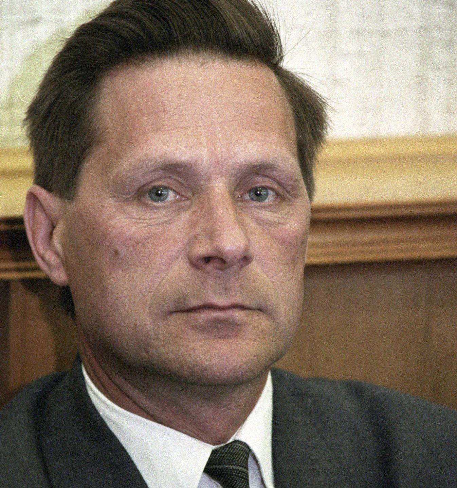

- ~~[Кебич](./1.md)~~
- ~~[Шушкевич](./2.md)~~
- ~~[Дубко](./3.md)~~
# [Новиков](./4.md)
- [Пазьняк](./5.md)

---

**Что было бы с Беларусью, если бы победил…**

# Новиков

Имя Василия Новикова сегодня мало что говорит читателю, родившемуся уже при Лукашенко. А в 1994 году Василия Николаевича, одного из пяти секретарей Партии коммунистов Беларуси — это феникса, возникшего на пепелище бывшей республиканской партийной организации КПСС, — всерьез выдвинули кандидатом в президенты. И я даже помню, как в комнате отдыха первого секретаря ЦК Союза молодежи Беларуси \(такой пост занимал в те времена автор этих строк\) товарищ Новиков, которого привел познакомиться Сергей Возняк, всерьез рассказывал мне, как важно, чтобы Кебич и прочие посткоммунистические хозяйственники узнали, что идеалы не погибли.

Поговорили мы тогда и о шансах Александра Лукашенко. Но о них Василий Николаевич, бывший заместитель заведующего отделом ЦК КПБ, говорил крайне неохотно. Он был слишком умен, чтобы выдавать желаемое за действительное. И набрал на выборах чуть больше четырех процентов.

Но представим себе неслучившееся: в 1994 году белорусы проголосовали за Василия Николаевича Новикова.

## Коммунист против антикоммуниста

Разумеется, первый визит новоизбранный президент Беларуси совершил бы в Москву. Но положение его было бы весьма и весьма странным: действующий секретарь ЦК белорусской партии коммунистов должен был бы вступить в диалог с главным антикоммунистом постсоветского пространства. Василию Новикову пришлось бы пожать руку Борису Ельцину — терминатору, сокрушившему КПСС.

Конечно, волей-неволей Новиков это сделал бы. Беларусь нуждалась в российской поддержке, а еще больше — в российских нефти и газе. Но сердце коммуниста горячо билось бы в его груди, и кроме общения с Ельциным Новиков налаживал бы и межпартийные связи. Геннадий Зюганов, глава КПРФ, получил бы в лице Беларуси надежную базу для идеологического нападения на Ельцина.

Собственно говоря, это чуть не произошло и в случае с Лукашенко. Но Лукашенко сам надеялся стать преемником Ельцина, если бы был возрожден СССР. И Зюганов с его партией был для Александра Григорьевича всего лишь полезным инструментом в диалоге с российскими элитами. А Новиков с готовностью примерил бы на себя костюм старшего коммунистического брата и покровительствовал бы российским коммунистам, как говорится, «по большому счету». Союз с ельцинской Россией был бы для Новикова невозможен, но он бы всячески поддерживал эволюцию России по направлению к коммунизму — так сказать, стимулировал бы коммунистический реванш за восточной границей.

## Новая старая модель

Для распространения коммунистической идеологии всегда были нужны деньги. Коммунистическим премьер-министром при Новикове имел все шансы стать Анатолий Лашкевич, секретарь Минского обкома КПСС, превратившийся в крупного бизнесмена. Анатолию Владимировичу было бы позволено развивать в Беларуси бизнес — однако под жестким идеологическим контролем самого президента. В лучшем случае, Новиков принял бы китайскую модель или, скажем, модель, характерную для советской власти времен НЭПа. То есть, избранным бизнесменам позволили бы зарабатывать деньги, в нужный момент вытряхивая их сбережения — в точности, как из цирковой обезьянки, набившей защечные мешки орехами без позволения хозяина, вытрясают эти орехи.

Трудно представить себе, как долго высшее руководство Беларуси времен новиковской президентуры могло бы выступать одним из спонсоров российского коммунистического реванша. Хотя почему — трудно? Мы можем даже подсчитать, до каких пор терпел бы все это Кремль. Ровно до 1996 года, когда самому Ельцину пришлось бы переизбираться на второй срок. И на малом госсовете, каким являлась при Борисе Николаевиче в то время группа Олега Сосковца \(первый вице-премьер\), Александра Коржакова \(начальник службы безопасности президента\) и Михаила Барсукова \(директор Федеральной службы безопасности\), наверняка решила бы избавиться от такого удобного плацдарма.

Как ни странно, против такого варианта развития событий не возражал бы и вечный оппонент этой тройки Анатолий Чубайс, возглавлявший в предвыборном штабе Ельцина аналитическую группу. Если читатель захочет убедиться в этом, достаточно прочесть выступление Чубайса на форуме в Давосе 5 февраля 1996 года: Анатолий Борисович там активно убеждал мировую финансовую элиту в катастрофических последствиях коммунистического реванша в России для всего мира.

Кандидаты в президенты поздравляют друг друга с регистрацией после заседания ЦИК 31 мая 1994 года. Слева направо: Александр Лукашенко, Василий Новиков, Вячеслав Кебич

Правда, никто не занимался бы физическим устранением президента Беларуси. Для этого было бы достаточно обрушить созданную им полукоммунистическую модель. То есть, перевести экономические отношения с Беларусью на рыночные отношения. Захлопнуть двери российского рынка.

На запад коммунист Новиков повести свой народ не мог. Не хотел. Это противоречило его убеждениям.

Пришлось объявить, что белорусы будут жить плохо — но не долго. Построение острова процветающего социализма в центре Европы было бы отложено, а сами граждане дружно начали изучать исторический опыт СССР времен позднего Брежнева. Никакой другой модели эта власть предложить им не могла.

## Заговор силовиков

Но в СССР времен Брежнева и Андропова были сильны силовые структуры: МВД, КГБ, Министерство обороны были надежными исполнителями воли правящей партии и ее Политбюро. Средств для поддержания их в статусе советской элиты у государства хватало. А вот в Беларуси эпохи Новикова денег не хватало бы после конфликта с российским руководством даже на идеологический аппарат.

Однако связи между силовиками Беларуси и России вряд ли прервались бы даже в этот момент. Поэтому председатель КГБ Беларуси \(история не говорит нам, кто именно мог возглавлять эту организацию в президентуру коммуниста Новикова\), общаясь со своим российским коллегой директором ФСБ Михаилом Барсуковым, не то что намеком — прямо услышал бы совет, что именно должно произойти в Беларуси, чтобы братскую республику Кремль вновь, как говорится, поставил бы на довольствие.

Мол, убирайте вы этого коммунистического чудака. Республике нужно развиваться нормально, по российскому образцу.

Российским образцом белорусские силовики были бы чрезвычайно довольны. Они хорошо знали, что к этому моменту передел собственности в пользу генералитета уже шел. Постепенно, разумеется. Банкиры и директора ваучерных фондов уже строили свои империи. Но кто, если не генералы спецслужб, знал, как долго «семибанкирщине» предстояло владеть богатствами России?

Маловероятно, что подобные беседы не состоялись бы в Москве и с руководителями других силовых ведомств Беларуси.

Так что не удивительно, что в одном из регионов страны неожиданно возбудилось бы национальное меньшинство, подумывавшее о самостоятельности. Ну, или не совсем о создании собственного государства, но, скорее, об автономии.

В таких случаях начинается политический кризис: подавить национальное движение без опоры на силовиков трудно, а значит, те усилятся до чрезвычайности.

Они и усилились.

## Кризис. «Новиков.Бай»

Применение силы в любом регионе Беларуси неизбежно вызывало бы протесты соседней страны. Условно говоря, даже подави коммунистическое правительство бунт каких-нибудь ятвягов — и за ятвягов нашлось бы, кому заступиться.

Вопрос о соблюдении прав человека в Беларуси был бы поднят на заседании Парламентской ассамблеи ОБСЕ. Не исключено, что это сделал бы министр иностранных дел России Андрей Козырев. Поддержал бы Козырева и его польский коллега Дариуш Росати, понимавший: начали давить ятвягов — рано или поздно перейдут к полякам.

Белорусский парламент потребовал бы срочно провести конституционную реформу. По крайней мере, урезать полномочия президента. Но Василию Новикову не дано было сопротивляться: его не поддерживали силовики. Хотя в Верховном Совете у коммунистов была большая фракция, в Минск срочно прилетели бы главы палат российского Федерального Собрания Егор Строев и Геннадий Селезнев, уговорившие Василия Николаевича пойти на досрочные выборы.

И тут на досрочных выборах неожиданно выяснилось, что партии, готовой повторно выдвинуть коммуниста Новикова, за ним уже нет.

Кандидатом в президенты от ПКБ стал действующий глава правительства Анатолий Лашкевич, который и победил. Ему даже полномочия не стали урезать: Анатолий Владимирович был достаточно умен, чтобы восстановить хорошие отношения с переизбравшимся Борисом Ельциным \(вернее, с его окружением\). А экс-президент вначале уехал послом в Молдову, а затем возглавил в Минске Институт философии.

И, как нам кажется, против такого поворота своей судьбы Василий Николаевич не возражал бы.

---

- ~~[Кебич](./1.md)~~
- ~~[Шушкевич](./2.md)~~
- ~~[Дубко](./3.md)~~
- ~~[Новиков](./4.md)~~
# [Пазьняк](./5.md)
