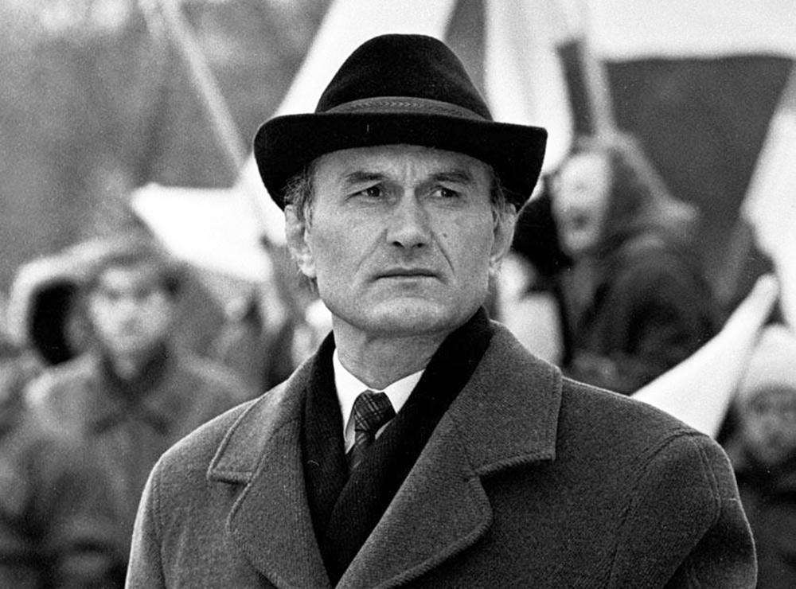
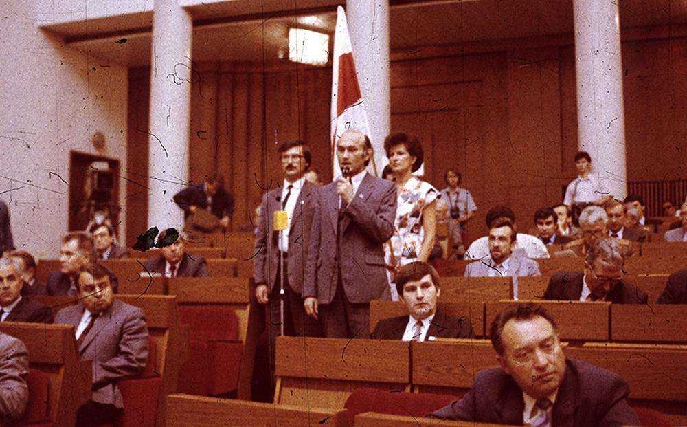
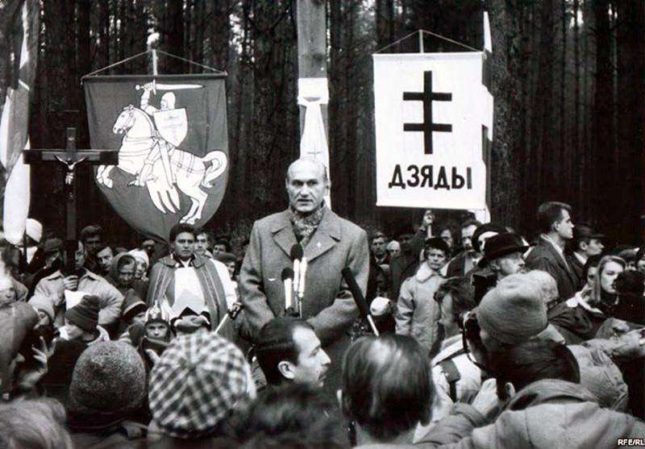
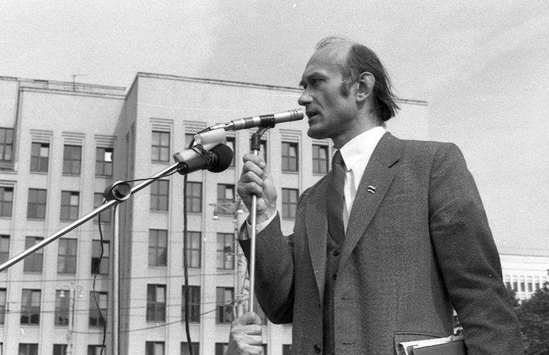
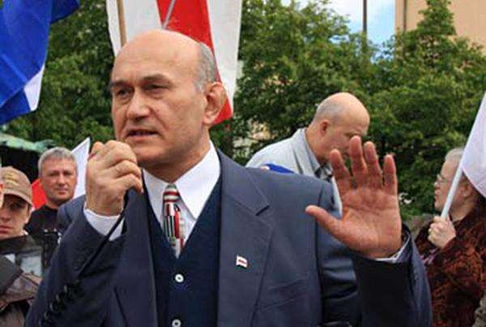

- ~~[Кебич](./1.md)~~
- ~~[Шушкевич](./2.md)~~
- ~~[Дубко](./3.md)~~
- ~~[Новиков](./4.md)~~
# [Пазьняк](./5.md)

---

**Что было бы с Беларусью, если бы победил…**

# Пазьняк

Не знаю, делали ли социологи в 1994 году кросс-таблицы, чтобы узнать, как разложатся голоса во втором туре — в случае, если он состоится. И особенно, если одним из участников второго тура станет лидер парламентской оппозиции БНФ Зенон Пазьняк.

Вероятно, делали. И было очевидно, что Пазьняк, окажись он рядом с Вячеславом Кебичем в бюллетене для голосования, имел бы все шансы на выигрыш. У Шушкевича он выигрывал наверняка. У Лукашенко…

Но, следуя законам жанра, попытаемся подумать, как развивались бы события в случае победы Зенона Пазьняка после его инаугурации.

## Президент против парламента

Думается, что шок у номенклатуры после избрания Пазьняка президентом был бы едва ли не большим, чем после избрания Лукашенко. Тем более, что Лукашенко всегда был частью парламентского большинства, как бы он ни отыгрывал свою «оппозиционность». А Пазьняк и будучи депутатом не скрывал: Верховный Совет, созданный, во многом, под указку и с участием ЦК Компартии БССР, должен быть распущен. Не исключаем, что он сказал бы об этом даже в своей инаугурационной речи — примерно так же, как это сделал в 2019 году Владимир Зеленский.

С той только разницей, что Зеленский всем казался шоуменом, милым и совсем не страшным. А аскетичного фанатика Пазьняка в Верховном Совете ненавидели и боялись. И знали, что он настоит на своем.

Но конституционного права на роспуск парламента у президента Беларуси не было. Поэтому Верховный Совет вступил с новоизбранным президентом в переговоры об условиях своего самороспуска. Депутатам оставался год работы, многие из них не собирались переизбираться, и хотели получить гарантии того, что их хотя бы не оставят без работы. От лица Верховного Совета переговоры вел спикер Мечислав Гриб, от президентской стороны — бывший депутат, а ныне первый заместитель главы Администрации Валентин Голубев.

Теоретически можно было договориться. Но статусных должностей на всех не хватало. Например, в посольства их всех не направишь, — возражал министр иностранных дел Петр Садовский. А отдавать в руки бывшим секретарям райкомов исполнительную власть на местах не хотел уже сам президент.

Поэтому во время очередного доклада сопредседателя согласительной комиссии Голубева, президент посмотрел бы на него исподлобья и прекратил бы все переговоры. Часть была бы трудоустроена, остальным — в лице Гриба — предложили бы самораспуститься.

И Гриб согласился на предложение провести референдум по этому поводу. Тот самый, который был отклонен Верховным Советом еще во время спикерства Станислава Шушкевича.

Так парламент продлил бы свою политическую жизнь еще на три месяца. Новый же состав депутатского корпуса, как мы увидим чуть позже, имел все шансы продлить конфронтацию с президентом на несколько более длительный срок.

## Достучаться до Кремля

Отношения же с Россией развивались сложно. Ельцин своего нового белорусского визави откровенно невзлюбил. Дело было вовсе не в национализме Пазьняка и не в его готовности хоть завтра вступить в НАТО. Просто жизнелюб Ельцин откровенно почувствовал бы антипатию к человеку, который всем своим видом осуждал не столько имперскую политику России, сколько личный образ жизни самого Бориса Николаевича. Схлестнулись бы жовиальность Ельцина и аскеза Пазьняка.

С другой стороны, за Пазьняка в России некому было б и похлопотать. Не считать же его политическими опекунами Новодворскую и Борового? Кем они были вообще в глазах ельцинского окружения?

Поэтому сразу после знакомства президентов было решено переключить решение всех двусторонних вопросов в экономике на уровень премьеров. Виктор Черномырдин и Владимир Заблоцкий тоже не слишком понравились друг другу, но бежать им с этой подводной лодки было некуда. Народы считались братскими со всеми вытекающими для российской экономики последствиями. Поэтому поставки в Беларусь нефти и газа сохранялись, но по рыночным ценам. Соответственно и транзит энергоносителей из России в Европу через Беларусь шел тоже по рыночной цене. Как договорятся, так и будет.

Но параллельно Минск начал реализовывать свою старую идею — строительство балтийско-черноморской транзитной системы. Пазьняк говорил об этом еще до получения депутатского мандата. С прагматичным Леонидом Кучмой он договорился. Проблема застряла на уровне балтийских государств: и в Литве, и в Латвии земля уже стала частной собственностью, и продавать ее относительно дешево для какого-либо международного \(а стало быть, денежного\) проекта никто не собирался. А европейская бюрократия не спешила оказывать финансовую помощь межгосударственному консорциуму, в котором, по мнению Еврокомиссии, еще надо было бы с коррупцией разобраться. В Украине, как точно знал Брюссель, ее просто не искоренишь, а из Беларуси поступали смутные сообщения о продажности некоторых членов нового правительства: автором сообщений числился переизбравшийся в депутаты Александр Лукашенко.

Чтобы сломать сопротивление латвийских землевладельцев нужны были бы очень весомые финансовые аргументы. Но неожиданно премьер Заблоцкий предложил рассматривать проект не как антироссийский, а как совместный с Россией. Россия уже искала новые логистические возможности, а свободные деньги у нее были. Дело осталось за малым — уговорить президента Беларуси на включение представителей российского олигархата в новый консорциум.

## Неожиданное решение

Это решение давалось Пазьняку с трудом. Все слова о том, что вместо отдаления от России мы еще больше привязываемся к ней, Зеноном Станиславовичем были сказаны. И в ответ он, разумеется, услышал все и про газ, и про нефть, и про российский рынок, альтернативы которому правительство все еще не смогло найти. И, в конце концов, почему бы не укрепить собственные позиции за московские деньги?

Последний аргумент неожиданно сработал. Пазьняк даже улыбнулся, что с ним после избрания президентом случалось все реже и реже. Идея Заблоцкого ему понравилась. И отмашка на ее реализацию была дана.

«Стройка века» начала свою работу. Строительная отрасль Беларуси развивалась. Появились новые «вертикальные» дороги, трубопроводы, логистические хабы. Иностранные авиакомпании предложили оживить, казалось бы, безнадежно умершие аэропорты в областных центрах Беларуси. Нашлись отчаянные смельчаки, решившиеся вложить деньги в речной транспорт страны — в первую очередь, грузовой.

И вместо конфликта с Россией неожиданно началось достаточно плодотворное сотрудничество. В Минске, правда, старались не обращать внимание на то, что деньги, шедшие на осуществление проекта, были чересчур тесно связаны с Кремлем и Белым домом, в котором располагалось правительство России. Москва тоже особо не интересовалась, кто получит реальную прибыль на белорусской стороне. Для облегчения грузопотоков было решено даже открыть границу, чему, впрочем, президент Пазьняк долго сопротивлялся. Но… чего уж тут поделаешь? Как говорится, назвался груздем…

## Кризис. «Пазьняк. Бай?»

Но неожиданно группа депутатов потребовала создать комиссию для изучения коррупции в правительстве Беларуси. Возглавить ее поручили Александру Лукашенко.

Пазьняк занервничал. Он хорошо помнил, как предшествующий доклад стоил политической карьеры Станиславу Шушкевичу и во многом — Вячеславу Кебичу. Ему не хотелось, чтобы его президентура завершилась столь же бесславно.

Но тут случилось нечто еще более неожиданное. Секретарь Совета Безопасности Николай Статкевич сообщил президенту, что никто из силовых структур не согласился работать в комиссии Лукашенко. Даже те, кого просили руководители соответствующих ведомств — ну просто чтобы не ругаться с Верховным Советом. Дело в том, что силовикам удалось поставить на часть финансовых потоков «стройки века» своих людей — иногда бывших коллег по работе, а иногда и родственников. Открывались колоссальные перспективы, и если бы вдруг доклад Лукашенко прекратил работу по проекту, многие «свои» лишились бы больших денег.

Генералы объяснили это полковникам. Полковники — майорам. И так — далее, вниз по лестнице.

Деятельность комиссии закончилась пшиком. И народ особо не возмущался: да, говорить приходилось на белорусском языке, но были созданы новые рабочие места, причем на этих местах хорошо платили. Тем более, дома никто не запрещал говорить даже на китайском языке.

И Пазьняка переизбрали на следующий срок.

Приехавшие из России съемочные телегруппы уделяли особое внимание плодотворному российско-белорусскому сотрудничеству. Наблюдатели из России, балтийских и скандинавских государств, Украины и Турции охотно подтвердили, что выборы прошли без нарушений: правду говорить всегда легко и приятно.

Пазьняка переизбрали на второй срок. За вторую пятилетку проект был доведен до конца, и, поскольку избиратели таки притомились от действующего главы государства, они охотно согласились на его преемника. Им стал…

Вот тут мы уже ничего даже предположить не можем. Поэтому именно закончим наш антифутурологический роман.

Возвращаемся в реальность.

---

- ~~[Кебич](./1.md)~~
- ~~[Шушкевич](./2.md)~~
- ~~[Дубко](./3.md)~~
- ~~[Новиков](./4.md)~~
- ~~[Пазьняк](./5.md)~~

[Все книги](../..)
