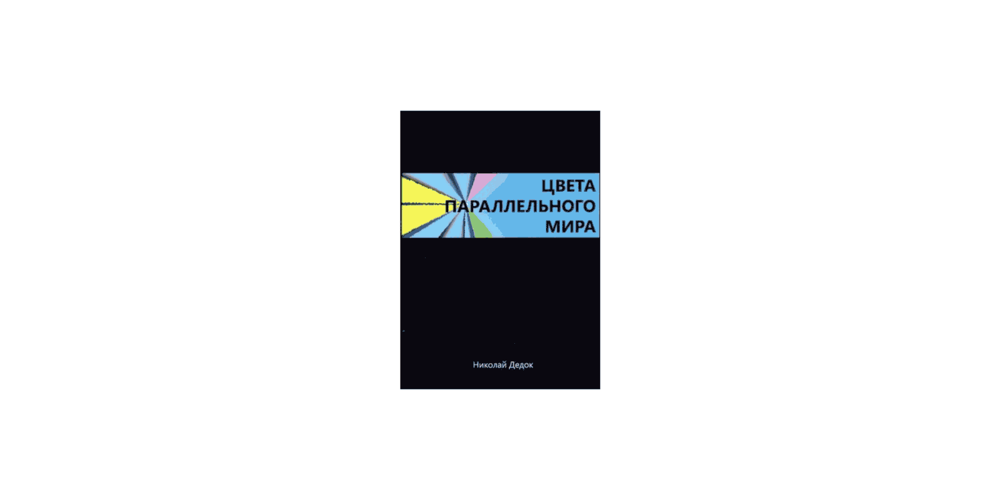

- **ru**: Эту книгу вы можете прочитать [на русском](./ru), [на белорусском](./by), [на английском](./en)
- **by**:  Гэтую кнігу вы можаце прачытаць [на рускай](./ru), [на беларускай](./by), [на англійскай](./en)
- **en**: This book you can read [in Russian](./ru), [in Belarussian](./by), [in English](./en) 

# [ru: Цвета параллельного мира](./ru)

# [Вступление](./ru/1.md)
- [Список сокращений и жаргонизмов](./ru/2.md)
- [ШИЗО](./ru/3.md)
- [Опер](./ru/4.md)
- [Режим](./ru/5.md)
- [Неприкасаемые в тюремной иерархии](./ru/6.md)
- [Запах](./ru/7.md)
- [Бунт против божественной иерархии в древнегреческой мифологии](./ru/8.md)
- [Божья кара](./ru/9.md)
- [Бунт в карантине](./ru/10.md)
- [Маугли](./ru/11.md)
- [Улетевшие](./ru/12.md)
- [Колдун](./ru/13.md)
- [Жизнь прекрасна](./ru/14.md)
- [Открытое письмо](./ru/15.md)
- [Крайняя мера](./ru/16.md)
- [Освобождение](./ru/17.md)
- [Заключение](./ru/18.md)

## Николай Дедок

Николай Дедок — активист анархистского движения, был задержан 3 сентября 2010 года по обвинению в нападении на российское посольство в Минске. В ходе следствия обвинение были переквалифицировано: автору вменили организацию символических акций прямого действия против государственных учреждений, сопряженных с уничтожением имущества. Своей вины он не признал.

В ноябре 2011-го международные правозащитные организации признали Николая политическим заключенным. В ходе своего 5-летнего тюремного срока сменил несколько карательных учреждений. Освобожден 22 августа 2015 года указом президента Беларуси. На данный момент является студентом Европейского гуманитарного университета (Вильнюс) по специальности «Всемирная политика и экономика» и журналистом беларуской газеты «Новы час».

# Блоги автора

- [Фэйсбук](https://facebook.com/happymikola/)
- [ВКонтакте](https://vk.com/mikola_dziadok)
- [Телеграм](https://t.me/MikolaDziadok)
- [Некорпоративная платформа](https://mikola.noblogs.org/)

# Контакт с автором

- <mikola@riseup.net>

# Поддержать автора

- PayPal — <valjalee@gmail.com>
- Bitcoin — `Jd@q28w_^APmXFfMeeU6&T`

## [О книге](./0.md)

«Цвета параллельного мира» — сборник рассказов бывшего беларуского политзаключенного Николая Дедка. Автор был арестован в 2010 году по обвинению в акциях прямого действия в Минске и провел в заключении пять лет. В сборнике представлено 16 рассказов и эссе, написанных в неволе и после выхода на свободу и повествующих о «многоцветных» ситуациях тюремной реальности — комичных и ужасающих, оптимистичных и мрачных.

Будучи убежденным анархистом, автор сопровождает свои наблюдения размышлениями о политической составляющей увиденного и анализом механизмов контроля в карательной системе и обществе в целом.

[Подробнее о книге](./0.md)

---

# [by: Фарбы паралельнага свету](./by)

# [Уступ](./by/1.md)
- [Спіс скарачэнняў і жарганізмаў](./by/2.md)
- [ШІЗА](./by/3.md)
- [Опер](./by/4.md)
- [Рэжым](./by/5.md)
- [Недатыкальныя ў турэмнай іерархіі](./by/6.md)
- [Пах](./by/7.md)
- [Бунт супраць боскай іерархіі ў старажытнагрэцкай міфалогіі](./by/8.md)
- [Божая кара](./by/9.md)
- [Бунт у каранціне](./by/10.md)
- [Маўглі](./by/11.md)
- [Адляцелыя](./by/12.md)
- [Чараўнік](./by/13.md)
- [Жыццё цудоўнае](./by/14.md)
- [Адкрыты ліст](./by/15.md)
- [Крайняя мера](./by/16.md)
- [Вызваленне](./by/17.md)
- [Заканчэнне](./by/18.md)

---

# [en: The Colours of the Parallel World](./en)

# [Introduction](./en/1.md)
- [Glossary](./en/2.md)
- [The De-Seg](./en/3.md)
- [The Operative](./en/4.md)
- [The Security](./en/5.md)
- [The Untouchables in the Prison Hierarchy](./en/6.md)
- [The Smell](./en/7.md)
- [Rebellions Against the Divine Hierarchy](./en/8.md)
- [The Divine Retribution](./en/9.md)
- [A Riot in the Prison Quarantine](./en/10.md)
- [Mowgli](./en/11.md)
- [The Spaced-Out](./en/12.md)
- [The Wizard](./en/13.md)
- [Life is Beautiful](./en/14.md)
- [An Open Letter](./en/15.md)
- [The Last Resort](./en/16.md)
- [The Release](./en/17.md)
- [Afterword](./en/18.md)
