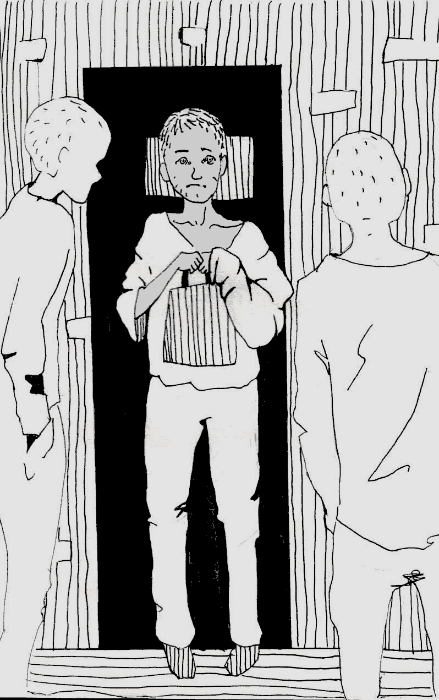

- ~~[Уступ](./1.md)~~
- ~~[Спіс скарачэнняў і жарганізмаў](./2.md)~~
- ~~[ШІЗА](./3.md)~~
- ~~[Опер](./4.md)~~
- ~~[Рэжым](./5.md)~~
- ~~[Недатыкальныя ў турэмнай іерархіі](./6.md)~~
- ~~[Пах](./7.md)~~
- ~~[Бунт супраць боскай іерархіі ў старажытнагрэцкай міфалогіі](./8.md)~~
- ~~[Божая кара](./9.md)~~
- ~~[Бунт у каранціне](./10.md)~~
# [Маўглі](./11.md)
- [Адляцелыя](./12.md)
- [Чараўнік](./13.md)
- [Жыццё цудоўнае](./14.md)
- [Адкрыты ліст](./15.md)
- [Крайняя мера](./16.md)
- [Вызваленне](./17.md)
- [Заканчэнне](./18.md)

---

Яго прывялі ў нашу сто пяцьдзясят другую хату ўвечары. Худая, зарослая, мурзатая істота гадоў шаснаццаці на выгляд, са спужаным позіркам — якраз як зацкаваны звярок. Першыя некалькі хвілін мы наогул нічога не маглі ад яго дабіцца. Хто такі? З якой хаты? Ён толькі неўпапад матляў галавой, разгублена лыпаючы вачыма з-пад ілба. Нарэшце пасадзілі яго за стол, напаілі гарбатай і выцягнулі-такі тое-сёе. Знаёмцеся: Саша К., дваццаць адзін год, сам з Чэрвеня. Сядзеў у хаце са страгачамі ^[Арыштанты, што ўжо адбывалі ў мінулым пакаранне ў месцах пазбаўлення волі.], але тыя яго «паставілі на лыжы ^[Прымусілі звярнуцца да мянтоў з просьбай перавесці ў іншую камеру.]»\(забягаючы наперад, скажу, што далей мы добра зразумелі за што\). Сядзіць за нейкі скрадзены заплечнік з фотаапаратам. Я жартам назваў яго Маўглі, бо ён і сапраўды быў нібы з лесу збегшы, да таго ж са смуглявым тварам. Мянушка хутка прыжылася.

Прайшло некалькі дзён. Сумеснымі высілкамі хата апранула, пастрыгла Маўглі і прымусіла памыцца — стаў больш падобны да чалавека. Пры сабе ў яго не было нічога, нават станка для галення, але ўсім неабходным мы яго забяспечылі. Саня не «грэўся» \(нават лісты яму ніхто не пісаў\), але, натуральна, еў, піў і паліў разам з усімі, бо жылі мы агульным.

Неяк незаўважна, трохі разняволіўшыся, пабачыўшы, што жывуць тут людзі, а не звяры, пачаў ён праяўляць сябе не з лепшага боку. То ўлезе ў чужую размову ды вярзе пры гэтым лухту, то каментуе, дзе не просяць, то лезе да кармушкі размаўляць з мянтамі, чаго рабіць зусім не ўмее, то агыркваецца на справядлівыя заўвагі. Пасля некалькіх такіх эпізодаў асноўным метадам размовы з ім стаў крык. На Маўглі сварыліся з ранку да вечара, бо не праходзіла гадзіны, каб ён што-небудзь не «накасячыў». Але Саню было хоць бы што.

Мяне ж ён зацікавіў як «рэдкі від». На волі, вядома, з такімі людзьмі мець зносіны не даводзілася, а тут — калі ласка, колькі заўгодна. Я быў у хаце, пэўна, адзіны, хто на яго не крычаў \(ну, шчыра кажучы, амаль не крычаў\) і размаўляў як роўны з роўным, хоць і было гэта няпроста. Хутка ў біяграфіі Маўглі высветлілася шмат цікавых рэчаў: бацька ягоны сядзеў шмат гадоў на Глыбокім \(ПК-13\), што з маці — няясна, ну а сам Маўглі жыве з цёткай, якая яго, відавочна, недалюблівае. Рос хлопец сам па сабе, прынамсі, прымет мэтанакіраванага выхавання ў яго асобе я не заўважыў. Ледзь не ўсё жыццё Сані прайшло на вуліцы: бухаў, «факаў» клей, краў. Па ягоных словах, скончыў ПТВ, але пры гэтым амаль не ўмеў пісаць, ды і прачытаць больш за некалькі радкоў для яго было непасільнай справай. Развіццё ягонае, па маёй ацэнцы, цягнула на ўзровень адзінаццаці-дванаццацігадовага. Часам я глядзеў на Маўглі і думаў: вось табе і дваццаць першае стагоддзе ў цэнтры Еўропы… Пад носам у хвалёных сацыяльных і адукацыйных службаў ды той жа інспекцыі па справах непаўналетніх вырас дзікун, які ў дваццаць адзін год не ўмее чытаць. І ўсё, што яны здолелі з ім зрабіць, гэта пасадзіць у турму. Зараз жа з верагоднасцю ў дзевяноста дзевяць працэнтаў ён будзе ўсё жыццё бухаць, сядзець, красці і калоцца. І ўсім усё роўна. Усім… Акрамя мясцовага РУУС, якому ён робіць статыстыку.

Але калі да Маўглі не было справы дзяржаве, дык была справа няўрадавым арганізацыям: Саня яшчэ падлеткам ездзіў у Італію па Чарнобыльскай лініі. Падрабязнасцей я ўжо не памятаю, толькі памятаю, як ён распавядаў аб сваім званку італьянцам адсюль, з Беларусі: «Звоню, она берет трубку… Ну я: “Привет\!” Она: “Пронто\! Пронто\!” А я ей: “Х\*ёнто\!” — и бросил трубку\!» На гэтым месцы Маўглі заліўся смехам, відавочна, задаволены сваім тонкім гумарам.

Яшчэ ў Маўглі была астма. Часам ён заходзіўся цяжкім кашлем і тады прасіў у кантралёра балончык з аэразолем, які яму не далі ў камеру \(бо ён быў металічны\), пакінулі ў ячэйцы на прадоле. Балончык, дарэчы, быў «ад італьянцаў». Але, нягледзячы на жудасныя прыступы, Саня і не думаў кідаць курыць.

Дні ішлі, Маўглі рабіўся ў хаце яўным ізгоем. Не ўмеючы паводзіць сябе прыстойна, Саня да таго ж увесь час «пароў касякі» — то «запарафініць» агульную рэч, то нап’ецца на ноч чыфіру і потым уначы ванітуе, не даючы іншым спаць. Акрамя таго, яго прыходзілася ўвесь час прымушаць мыць свае рэчы і ўдзельнічаць у прыбіранні хаты. Зразумела, на яго бясконца лаяліся. Першым часам я яго нават абараняў — шкада было глядзець, як ён скукожваўся ад грознага рыку і вылупленых вачэй сукамернікаў, — і сам спрабаваў не раз і не два размаўляць па-добраму, тлумачачы правілы жыцця ў хаце. Дапамагалі мае «душавыратавальныя» гутаркі ў лепшым выпадку на паўдня, таму пасля чарговай спробы я іх закінуў. Як сказана раней, «жорсткія» метады таксама не дапамагалі ў яго выхаванні. Да таго ж хутка мы зразумелі адзін цікавы псіхалагічны нюанс: Маўглі проста жыццёва неабходна было знаходзіцца ў цэнтры ўвагі, нават калі гэта ўвага выражалася выключна ў лаянцы і крыках. Дзеля таго каб быць «зоркай хаты» і цягам усяго дня чуць размовы пра сябе, ён гатовы быў цярпець і абразы, і напады, і пагрозы. Ужо ў наступныя гады я зразумеў, што гэта асобны тып людзей, які асабліва яскрава праяўляе сябе менавіта ў камернай сістэме. Яны знарок напружваюць тых, хто іх акружае, каб любым коштам замкнуць іх увагу на сабе.

Хутка ўсе шляхі выхавання \(акрамя, бадай, фізічнага\) скончыліся. Яго прасілі, на яго крычалі, усяляк пагражалі, пужалі, пазбаўлялі цыгарэт, спрабавалі ігнараваць. Але ўсё гэта толькі больш распаляла нашага Маўглі, бо ён яўна адчуваў, што намаганні ўсёй хаты, а значыць, і ўвага, скіраваныя на яго. Ён пачаў выказваць незадаволенасць: маўляў, да яго дрэнна ставяцца. Папярэджваў кантралёра, што «ўкрыецца», аб’яўляў галадоўку \(якая доўжылася 15 хвілін, да першага баршчу, прынесенага баландзёрам\), а аднойчы нават напісаў заяву оперу. На сшыткавым аркушыку хвалістымі радкамі, ледзь разборлівымі, неверагодна крывымі літарамі было напісана прыкладна наступнае \(перадаю блізка да арыгінала\):

>**заявлене**\
\
прашу пиривисти миня вдругую хату патамушта у миня 1000 касиков явсем мишаю наминя пастаяна арут

…і гэтак далей.

Праўда, заяву гэту ён так і не падаў. Затое працэс яе складання і абмеркаванне самога ўчынку Маўглі зацягнуліся на паўдня. А большага Саня і жадаць не мог.

Пасля Новага года \(надышоў 2011 год\) мяне адправілі ў бальнічны корпус жодзінскай турмы — лячыць уросшы ногаць на назе. Праз два тыдні я вярнуўся, але Маўглі ў хаце ўжо не было. І вось што мне распавялі пацаны. Амаль адразу пасля майго адыходу Саня нібы з ланцуга сарваўся: ці то ў яго адкрылася псіхічнае захворванне, ці то ён удала яго сімуляваў. А ў прыватнасці: барабаніў у сцены без дай нагоды, нёс лухту горш ранейшага, хаваўся за дзвярыма прыбіральні, краў рэчы з агульнага «катла», а потым наогул скраў і схаваў у сябе чужы ліст. Хутка ён пачаў атрымліваць ад хлопцаў «ляшчэй», бо трываць ужо не было ніякай магчымасці. У выніку мянты, пэўна, зразумелі, што з Санем нешта не так, і забралі яго ў санчасць.

Прайшло амаль тры гады. Я зноў у жодзінскай турме, але ўжо не ў рангу падследнага — перавялі з магілёўскай «крытай» лячыць страўнік, бо ў Жодзіне філіял Рэспубліканскай турэмнай бальніцы. Выклікаў опер, відаць, каб прабіць, што я за «пасажыр». На сцяне ў апярскім кабінеце фотаздымкі асуджаных з прафілактычным улікам. Прабягаючы вачыма па радку «Схільныя да суіцыду і членашкодніцтва», я сустракаюся позіркам з Маўглі. Вось табе на\! Так, сапраўды ён. І прозвішча супадае. Пэўна, заехаў ужо, вызваліўшыся, па другім разе, а можа, ужо і па трэцім.

Вярнуўшыся ў хату, я стаў прыгадваць усё тое, што распавёў вам. Узгадаў балончык ад астмы, позірк ваўчаняці, суцэльна гнілыя ў дваццаць адзін год зубы, патлы, што падалі ў тазік з мыльнай вадой, калі мы галілі Маўгліну галаву… І чамусьці на розум прыйшло пытанне: а што з Санем станецца, калі ён памрэ? На жаль, было мала сумневу ў тым, што пражыве ён доўга, калі толькі не сядзе на доўгі тэрмін і турма яго не «закансервуе».

А хто па ім будзе плакаць?

Ці будзе каму несці ягоную труну?

Ці атрымаецца, як з бальзакаўскім «Айцом Горыа», які паміраў амаль у поўнай адзіноце, і патурбаваліся ягоным апошнім шляхам, лічы, чужыя людзі?

Родных у Маўглі няма, сябры ёсць наўрад ці, а калі ёсць — гэта яўна не лепшыя прадстаўнікі чалавечага роду… Падумалася, як жа сумна і няўтульна так не толькі жыць, але і паміраць, калі ты зусім адзін. А яшчэ падумалася, што той, хто кінуў мяне ў вязніцу за палітычнае злачынства, і той, хто зрабіў Маўглі крадуном і маргіналам на ўскрайку жыцця, — гэта адзін і той жа Левіяфан.

*Сакавік 2015*

---

- ~~[Уступ](./1.md)~~
- ~~[Спіс скарачэнняў і жарганізмаў](./2.md)~~
- ~~[ШІЗА](./3.md)~~
- ~~[Опер](./4.md)~~
- ~~[Рэжым](./5.md)~~
- ~~[Недатыкальныя ў турэмнай іерархіі](./6.md)~~
- ~~[Пах](./7.md)~~
- ~~[Бунт супраць боскай іерархіі ў старажытнагрэцкай міфалогіі](./8.md)~~
- ~~[Божая кара](./9.md)~~
- ~~[Бунт у каранціне](./10.md)~~
- ~~[Маўглі](./11.md)~~
# [Адляцелыя](./12.md)
- [Чараўнік](./13.md)
- [Жыццё цудоўнае](./14.md)
- [Адкрыты ліст](./15.md)
- [Крайняя мера](./16.md)
- [Вызваленне](./17.md)
- [Заканчэнне](./18.md)
