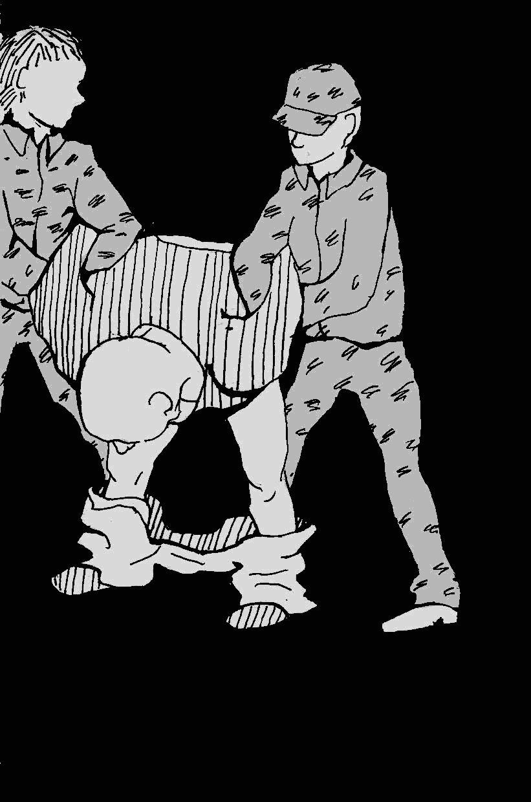

- ~~[Уступ](./1.md)~~
- ~~[Спіс скарачэнняў і жарганізмаў](./2.md)~~
- ~~[ШІЗА](./3.md)~~
- ~~[Опер](./4.md)~~
- ~~[Рэжым](./5.md)~~
- ~~[Недатыкальныя ў турэмнай іерархіі](./6.md)~~
- ~~[Пах](./7.md)~~
- ~~[Бунт супраць боскай іерархіі ў старажытнагрэцкай міфалогіі](./8.md)~~
- ~~[Божая кара](./9.md)~~
- ~~[Бунт у каранціне](./10.md)~~
- ~~[Маўглі](./11.md)~~
# [Адляцелыя](./12.md)
- [Чараўнік](./13.md)
- [Жыццё цудоўнае](./14.md)
- [Адкрыты ліст](./15.md)
- [Крайняя мера](./16.md)
- [Вызваленне](./17.md)
- [Заканчэнне](./18.md)

---

Лета 2012 года. Горад Шклоў, ПК-17. Адзіночная камера ПКТ: адзін дзень змяняе другі такі самы — я сам выдумляю ім напаўненне, каб не засумаваць. Вось прайшоў абед, баландзёр забраў міскі. Рабіць няма чаго, настрою чытаць або вучыцца няма, затое паабедная спёка схіляе ў сон. Я паслаў свой кліфт пад столікам \(каб у вочы не біла святло лямпы\), пад галаву — падручнік арабскай і падрыхтаваўся прабавіць у сне яшчэ адну гадзіну яшчэ аднаго дня.

Уладкаваўшыся зручней, пачаў быў засынаць, як раптам у канцы прадола пачулася гудзенне электроннага замка, а потым ляскат металічных кратаў. «Кагосьці прывялі», — падумалася мне. Як раз каля 15 гадзін у зоне кожны дзень праходзяць «хрэсьбіны» \(дысцыплінарная камісія\), дзе начальнік зоны раздае зэкам суткі ШІЗА, месяцы ПКТ, а таксама пазбаўленні свіданак ды перадачаў.

…Тупат як найменш двух чалавек. Ага, атраднік прывёў свайго зэка. Цікава, у ШІЗА ці ў ПКТ? Тут з прадола раздаўся хрыплы пракураны голас, які роў што ёсць моцы:

>Ра-а-асцветали яблони и груши\!\
Зацвели туманы над рекой\!\
Выходи-ила на берег Катюша…  

Усё ясна. Гэта Коля.

Коля — зэк, што паехаў дахам, мужык гадоў 50–55, а можа й маладзейшы — вельмі ўжо нездарова выглядаў. «Улетевший», як такіх часта называюць арыштанты. Пра яго, як і пра кожнага такога, хадзілі легенды: нібыта ходзіць па зоне без біркі, не голіцца, пасылае мянтоў на х\*й, раве што яму ўздумаецца і дзе ўздумаецца. У моманты ж асаблівых абвастрэнняў яго і саджаюць у ШІЗА — каб зусім ужо не шалеў.

Далі Колю дзесяць сутак. Для яго яны, вядома, былі вясёлымі, але яўна не для астатніх зэкаў і не для мянтоў. Забаўляўся Коля тым, што пасля прыёму ежы не аддаваў баландзёру алюмініевую міску. Трымаць іх у сябе ў камеры ШІЗА або ПКТ было забаронена, таму пасля кожнага прыёму ежы іх забіралі. Але толькі не ў Колі. Часцяком пасля абеду, сняданку ці вячэры даводзілася чуць на прадоле такі дыялог:

>Кантралёр: Пад’еў?\
\
Коля: Пад’еў.\
\
Кантралёр: Давай міску.\
\
Коля: Пайшоў на х\*й\!\
\
Кантралёр: Давай міску, сука підарас бл\*дзь\!\
\
Коля: Пайшоў на х\*й\!\!\!

Далей ішлі спрэчкі на працягу хвілін пятнаццаці, пасля чаго раз’юшаны кантралёр адчыняў краты, сам забіраў міску, заадно даючы Колю па пячонцы.

Зэкі ж не любілі Колю за яго начныя фокусы. Удзень ён адсыпаўся, а ўначы браў ланцуг, якім прышпільвалася нара, і біў гэтым ланцугом па нары, ствараючы пякельны грукат на ўвесь барак, не даючы спаць ні зэкам, ні кантралёрам.

Адседзеўшы тую дзясятку \(ужо не першую за тэрмін\), Коля некуды падзеўся. Па чутках, яго вывезлі на ПА \(псіхіятрычнае аддзяленне\) — так зэкі клічуць турэмную псіхушку, што знаходзіцца на ПК-3, у Віцебску.

---

Страта чалавекам розуму ў турме — з’ява даволі частая. Мала таго, што ў турмы часта трапляюць людзі з «ограниченной вменяемостью» альбо разумова адсталыя, дык яшчэ і сама турма садзейнічае развіццю рознага кшталту псіхічных разладаў. Вось як пра гэта пісаў у «Запісках рэвалюцыянера» Пётр Крапоткін:

>«Пада мною сядзеў селянін, па прозвішчы Гаваруха, знаёмы Сердзюкова, з якім ён перастукваўся. Супраць маёй волі часта нават у час працы я сачыў за іхнім перамаўленнем. Я таксама перастукваўся з ім. Але калі адзіночнае зняволенне без усялякай працы цяжкае для інтэлігентных людзей, то нашмат больш невыноснае яно для селяніна, які прывык да фізічнай працы і зусім не здольны чытаць увесь дзень запар. Наш прыяцель-селянін пачуваўся вельмі няшчасным. Яго прывезлі ў крэпасць, пасля таго як ён пасядзеў ужо два гады ў іншай турме, і таму ён быў ужо надламаны. Злачынства ягонае палягала ў тым, што ён слухаў сацыялістаў. Да вялікага майго жаху, я стаў заўважаць, што селянін часам пачынае загаворвацца. Паступова ягоны розум усё больш затуманьваўся, і мы абодва з Сердзюковым заўважалі, як крок за крокам, дзень за днём ён набліжаўся да вар’яцтва, пакуль размова яго не ператварылася ў сапраўднае трызненне. Тады з ніжняга паверха сталі даносіцца дзікія крыкі і страшэнны шум. Наш сусед памяшаўся, але яго тым не менш яшчэ некалькі месяцаў пратрымалі ў крэпасці, перш чым адвезлі ў вар’ятню, з якой няшчаснаму не судждана ўжо было выйсці. Прысутнічаць пры такіх умовах пры павольным разбурэнні чалавечага розуму — жудасна».

Не менш жудасна назіраць наступствы гэтага разбурэння.

На той жа ПК-17 \(Шклоў\) у ШІЗА пры мне сядзеў Кузя — певень. У ШІЗА ён сядзеў не ў якасці пакарання, а як на БМ-е. Туды яго схавалі ад зэкаў. Праблема Кузі была ў тым, што ён паводзіў сябе неадэкватна, у прыватнасці — гадзіў пад сябе і наогул дзе папала. Калі верыць расповедам зэкаў, такім ён стаў у выніку рэгулярнага збіцця ў атрадзе. Кузю білі да таго, як ён стаў срацца, — за тое, што певень, і, хутчэй за ўсё, за тое, што ненармальны. А потым працягнулі біць — ужо за тое, што сраўся і жыць з ім побач у бараку было невыносна. Акрамя збіцця былі і ўгаворы — яму шмат разоў давалі чыстую вопратку і пасцельную бялізну, але ўсё было марна. Ад граху падалей адміністрацыя знайшла «выдатнае» выйсце: пасадзіла Кузю ў «бяспечнае месца», якое па ўмовах утрымання адрознівалася ад ШІЗА толькі тым, што там на падлозе валяўся матрас. Кожныя некалькі дзён я чуў крыкі днявальнага, які лаяў Кузю на чым свет стаіць: матрас рэгулярна бываў абгаджаны. Кажуць, маці, прыехаўшы да Кузі на спатканне, была ў сапраўдным шоку і доўга патрабавала ад начальства растлумачыць, што яны зрабілі з яе сынам…

Там жа, на сямнаццатай, сядзеў яшчэ адзін персанаж — не памятаю ягонага імя. Яго пасадзілі ў адзіночку за тое, што той меў звычку красці ў іншых жыхароў барака. Некалькі разоў зэкі яго білі, пакуль ён сам не папрасіўся яго схаваць. На яго амаль кожны дзень находзіла буйства — ён пачынаў выдаваць з камеры моцныя невыразныя гукі і шумна мацюкацца незразумела на каго і на што. Гэта працягвалася гадзінамі. Але аднойчы ён нават стаў калаціць немудрагелістую пэкатэшную «мэблю», і толькі тады мяты заварушыліся — як жа, казённую маёмасць псуе\! — і прыслалі доктара. Вертухаі скруцілі небараку, і доктар нешта яму ўкалоў, пасля чаго гукі пачалі паступова сыходзіць на нішто і праз паўгадзіны сціхлі зусім.

Іншым разам пад дахам у ПК-17 збіралася адразу некалькі псіхічна нездаровых, і тады пачыналася сапраўдная весялосць. Уявіце сабе: прадол з дваццаццю чатырма камерамі, драўляныя дзверы, праз якія чутно ўсё, што адбываецца ўнутры, і бетонныя сцены, што ствараюць выдатную акустыку. Ты сядзіш у сваёй камеры адзін і слухаеш адначасова ўсё, што даносіцца з некалькіх бакоў:

— Э-э-э… э-э-э… ы-ы-ы… ы-ы-ы…

— Бл\*дзь на\*уй ё\*аны в рот\! Підары бл\*дзь\!\!\!\!

— А-а-а-а-а-а\!\!\! А-а-а-а-а-а\!\!\! А-а-а-а-а-а\!\!\!

… і так на працягу многіх гадзінаў — пакуль у таварышаў псіхаў не скончыцца запас энергіі. У такія моманты пачынаеш сумнявацца, што ты ў турме, а не ў дурдоме, — і пачынае здавацца, што сам паступова з’язджаеш з глузду.

Як я пісаў, многія адляцелыя становяцца сапраўднымі знакамітасцямі: праблемных зэкаў перакідаюць з зоны ў зону, і слава ідзе паперадзе іх. Да ліку такіх адносіцца Хакей — арыштант з ПК-15 Магілёва. Ссутулены мужык каля 40 гадоў, з пастаяннай шчацінай. Тэрмін — 25 гадоў. Як кажуць зэкі, за забойства кадэбэшніка. Першыя пяць гадоў, як асуджаны па асабліва цяжкай, ён праседзеў на гродзенскай крытай, дзе, відаць, і крануўся розумам — альбо кадэбэшнікі адбілі галаву. Падрабязнасцяў ніхто не ведае, бо блізка стасавацца з Хакеем немагчыма.

Адзін з самых вядомых прыколаў пра Хакея — радыёперадатчык у яго шапцы. Ён лічыць, што мянты ўсталявалі яму туды мікрафон, і таму яго часта можна сустрэць у прагулянках па лакалцы і бубненні ў шапку праклёнаў ды адборнай лаянкі на адрас міліцыі, дзяржавы й Лукашэнкі. Любіць Хакей аблаяць і беларусаў \(за тое, што абралі Лукашэнку\), асабліва падчас прагляду тэлевізара. Хоць сярод зэкаў прыхільнікаў Лукашэнкі наўрад ці знойдзеш, але за абразы на адрас беларусаў Хакей неаднойчы быў біты. Сам ён, дарэчы, расеец.

Ён любіць вынаходзіць мудрагелістыя лаянкі і занатоўваць іх у сшытак. У Хакея было шмат агульных сшыткаў, спісаных дробным почыркам ад пачатку і да канца. Тыя, хто меў магчымасць з імі азнаёміцца, гавораць, што гэта проста бяссувязная і невытлумачальная плынь свядомасці, лаянкі і трызнення.

Але самай невычарпальнай крыніцай весялосці для зэкаў было тое, як Хакей паводзіцца з мусарамі. Неяк ён набраў са сталоўкі кашы-сечкі і выклаў яе пасярод лакалкі на газетку, падпісаўшы: «Для Махоўні» \(Махоўня — мянушка былога начальніка ПК-15 па прозвішчы Маханькоў\). А аднойчы проста хадзіў па лакалцы, на ўвесь голас брыдкасловячы на адрас «Махані і Таўкачыхі». Яго выклікала да сябе адміністрацыя: начальнік калоніі Маханькоў і яго намеснік Талкачоў. Задалі пытанне:

— Хто такія Маханя і Таўкачыха?

— Гэта мае маскоўскія шлюхі\! — Хакей сумленна паехаў у ШІЗА.

Аднойчы ў магілёўскую калонію прыехалі нейкія курсанты. Прайшоўшы па «цэнтральнай алеі», яны пайшлі далей — аглядаць зону, адзін курсант адстаў ды пачаў азіраць закратаваныя лакальныя ўчасткі вакол сябе. На ягонае няшчасце, у адным з іх стаяў Хакей. Учапіўшыся рукамі ў краты, ён утаропіўся ў курсанта вар’яцкімі вачыма і выцадзіў у ягоны бок нейкую непамысную лаянку:

— Чё смотришь, сука бл\*дь… Приехали пидарасы, свинобыдло е\*аное\!..

Курсанцік палічыў за лепшае дагнаць сваіх…

Не ведаю, білі яго мяты на пятнаццатцы ці не, але ў ШІЗА ён катаўся рэгулярна. Зрэшты, на яго паводзіны гэта аніяк не ўплывала.

Але самым актыўным рассаднікам памяшальніцтва розуму сярод зэкаў з’яўляецца, безумоўна, крытая. У групе рызыкі — людзі з вялікімі тэрмінамі, як тыя, хто сядзіць у адзіночках, так і сядзельцы агульных хатаў. Сціснутая прастора, пастаянныя канфлікты, лаянка, напружаная атмасфера, страх, немагчымасць змяніць абстаноўку, правакацыі і здзекі з боку мянтоў, доўгія гады зняволення наперадзе і, як наступства, безвыходнасць вельмі гэтаму спрыяюць.

Адзіночак на ўсіх не хапае, таму адміністрацыя часта саджае «ненармальных» у кічу. Аднойчы, седзячы ў тамтэйшым ШІЗА \(ён, да ўсяго, яшчэ й знаходзіцца ў падвале\), позна ўвечары ў адной з суседніх камераў раптоўна пачалі раздавацца гучныя рытмічныя ўдары і дзікі лямант:

— Людзі\!\!\! Людзі\!\!\!

Удары не спыняліся добрую гадзіну, перемяжаючыся з крыкамі: «Выпусціце мяне адсюль\!\!\!», пакуль карпусны не прыйшоў і не надаваў кухталёў буяну. На той дзень ён супакоіўся, але на наступны ўсё пачалося зноў. Я стаў цікавіцца ў пацаноў у суседніх камерах, што там адбываецца, але акрамя «ў кагосьці з нечысьці дах сарвала» так нічога й не дамогся. Сказаць, што я адчуваў да гэтага чалавека моцнае спачуванне, было б крывадушным. Але, паспрабаваўшы ўявіць узровень страху і адчаю, які прымусіў яго, седзячы ў падвале крытай турмы, малаціць нагою ў дзверы і клікаць «людзей», я пасапраўднаму жахнуўся. Аднастайнасць, безнадзейнасць, камера кічы, якая цісне, псіхічная хвароба і, напэўна, вялізны тэрмін наперадзе — гэта сапраўдная бездань.

Варта заўважыць, што ў большасці адляцелых памяшальніцтва праяўляецца перыядычна, час ад часу. Здараюцца і перыяды прасвятлення. Такім быў, напрыклад, Саня па мянушцы «Шрэк» — яшчэ адзін жыхар магілёўскай крытай. Гэтаму хлопцу не было і 30 гадоў. У дзяцінстве ён вучыўся ў школе для дзяцей з затрымкамі псіхічнага развіцця. Бацькі ў яго калі і былі, то ў турме не дапамагалі ніяк, і, адседжваючы свой тэрмін за забойства, «грэву» ён не атрымліваў наогул. Трымалі яго, як правіла, у адзіночцы, бо ні з кім не ўжываўся. Звычайна ў ягонай камеры было ціха, але час ад часу адтуль пачынала чуцца лаянка на адрас мусароў — як з нагоды, гэтак і без. Вымяшчаў сваю злосць ён, як правіла, на кантралёрах, якія зазіралі ў кармушку падчас раздачы ежы. Але горш за ўсё было, калі ў Шрэка сканчаліся цыгарэты. Паколькі грошай для атаварвання ў лаўцы ў яго не было, ён займаўся тым, што клянчыў іх у мянтоў. На дзень яму давалі каля пяці адзінак «Прымы». Калі даваць пераставалі, ён пачынаў лямантаваць і біць у дзверы, ламаць камерную мэблю, умывальнік, біць шкло ў аконнай раме. На знак пратэсту супраць сквапнасці мянтоў ён адмаўляўся ісці на прагулку, суправаджаючы гэта адборнай лаянкаю ў іхні бок.

Мяты білі Шрэка часта. Часам проста ў камеры, часам выводзячы на «зборку», але заўсёды — без асаблівага эфекту. У моманты асаблівага буйства, калі шум з ягонай камеры зусім ужо даставаў падольных, яны проста выклікалі лекара, які рабіў яму ўкол \(як казалі зэкі — аміназіна\), і на якіясьці суткі Шрэк супакойваўся.

Але як Хакей быў знакамітасцю ў ПК-15, так знакамітасцю магілёўскай крытай была Іра. Адна з нямногіх сустрэтых мной жанчын-крытчыц, яна сядзела са мной у суседняй камеры: я быў у 18-й, яна ў 19-й. Узровень памяшальніцтва, які яна дэманстравала, быў проста жахлівым. Штодня з 24 гадзін у суткі прыблізна пяць-шэсць гадзін — незалежна ад пары сутак, гэта магло быць і на досвітку, і позна ўночы — з яе камеры даносіўся бесперапынны бязладны тэкст, плынь хворай свядомасці. Аднавіць нават маленькую яго частку я ніяк не магу — памяць адмаўлялася гэта фіксаваць. Скажам так, яна пачынала гаварыць пра нешта, напрыклад пра самалёты, ці пра пабачанае па тэлевізары, ці пра планеты і галактыкі, гаварыла пра гэта некалькі сказаў, потым, чапляючыся за апошнія словы сказа, пачынала ад іх ужо новую тэму — і гэтак бясконца. Што было для мяне самым уражальным, яна не проста гаварыла, яна крычала, раўла настолькі гучна, што яе было чуваць на ўсім паверсе, а калі яна падыходзіла да акна — то й на ўсіх астатніх паверхах. Сваю прамову яна нязменна перамежвала пагрозамі і мацюкамі на адрас мусароў. Выкшталцона і мудрагеліста мацюкала іх, і калі яе выводзілі на прагулку. Разумнейшыя лягавыя проста маўчалі, іншыя пачыналі лаяць яе ў адказ.

Іра актыўна стасавалася з суседнімі хатамі праз рэшку — выпрошвала цыгарэты. І гора было той хаце, з якой на яе адрас была сказаная грубасць або праяўлена непавага: яна вылазіла на падваконне і гадзінамі бэсціла яе насельнікаў — і гэта слухала ўся турма. У адплату мянтам за тое, што не даюць цыгарэты, ці проста дзеля забаўкі яна магла стаць голай на штодзённай праверцы. Ці пачаць тарабаніць па батарэі глыбокай ноччу, пазбаўляючы сну, фактычна, увесь паверх. У такім выпадку прыходзіў доктар ды калоў Іры аміназін.

А вось тыя зэкі, хто з ёй перапісваўся, гаварылі, што, мяркуючы па цалкам асэнсаваных і нават літаратурных лістах-малявах, 39-гадовая Іра — зусім прыстойная жанчына з вышэйшай адукацыяй, у якой на волі засталася дачка. Менавіта імкнучыся забяспечыць яе, Іра, як кажуць, і ўзялася цягаць з Расіі наркотыкі, за што і атрымала 12 гадоў калоніі строгага рэжыму…

Чалавека, што страціў розум, адміністрацыя разглядае як прыкрае непаразуменне. Калі ён «ціхі», то бок сваім памяшальніцтвам не парушае рэжым утрымання \(такіх поўна\), на яго ўвогуле ніхто не зверне ўвагу. Ну з’ехаў з глуздоў чалавек — з кім не бывае? Ні аб якім лячэнні казаць не даводзіцца: у турэмнай аптэчцы ёсць толькі валяр’янка \(ад усіх нервовых разладаў\) ды аміназін для супакойвання буйных. Гаварыць аб прафілактыцы псіхічных расстройстваў у ПУ і зусім смешна. У кожнай папраўчай установе усяго адзін псіхолаг \(дарэчы, мент у форме, што яўна не садзейнічае даверлівым адносінам паміж ім і зэкамі\). У зонах, дзе работа са «спецкантынгентам» пастаўлена хоць на нейкі, няхай паказушны, узровень, ён сустракае прыбылых з этапа ды размаўляе з імі, часам можа арганізаваць наведванне малельнага пакоя ці царквы. На гэтым усё. Паводле рэжыму ён абавязаны праводзіць рэгулярныя гутаркі з кожным асуджаным, але ці рэальна гэта, калі ў калоніі, напрыклад, 1500 чалавек? У некаторых калоніях я за ўвесь час знаходжання там псіхолага не бачыў зусім. То бок чалавек лічыцца ў штаце, запаўняе нейкія паперкі, робіць выгляд, што нечым займаецца, атрымлівае за гэта зарплату — але пры гэтым рэальна не выконвае зусім нічога. Ну а далей ДВП дае справаздачу ў МУС аб «псіхалагічнай рабоце» і «індывідуальным падыходзе» да асуджаных, МУС, у сваю чаргу, «спявае» міжнародным арганізацыям, як якасна ды гуманна працуе ў Беларусі пенітэнцыярная сістэма, — і ўсе задаволеныя. Затое турмы і калоніі працягваюць перамолваць нечыя мазгі, рыхтуючы да выхаду на волю маральных інвалідаў. Карная сістэма збудаваная так, каб працаваць з наступствамі, а не з прычынамі. Павесіўся нехта ў камеры? Навошта высвятляць, што да гэтага прывяло, лепш адабраць па ўсёй турме шнуркі, папругі й ніткі — каб не змаглі павесіцца, нават калі вельмі захочуць. Некага сарвала з катушак і ён/яна стаў\(ла\) малаціць па дзвярах нагамі з дзікімі крыкамі? Укалоць аміназіну — няхай на іншай змене лямантуе, колькі хоча\! І ўсім пляваць, у чым прычына: рэжымнікі адправілі назад перадачу ад сваякоў, на волі маці памерла ці проста адчай давёў да неадэквату.

Псіхічна хворых у турме ніхто не лечыць. На вядомае ПА ў ПК-3 \(Віцебск\) адпраўляюць толькі тых, хто ўжо цалкам страціў дзеяздольнасць — не можа працаваць альбо трымаць яго ў ШІЗА стала нявыгадна. Як і ў любым аспекце Сістэмы, іх хвалюе толькі твая функцыянальнасць: выконвай, што табе сказана, і не адсвечвай, будзь ты хоць сто разоў параноік, шызафрэнік або проста дурань. Пра якасць жа лячэння ў турэмнай дурцы ПК-3 мне меркаваць складана, але я яшчэ не бачыў ніводнага чалавека, які хацеў бы туды вярнуцца…

---

Восень 2012 года. Горад Шклоў, ПК-17. Я даседжваю свае апошнія месяцы ў ПКТ — наперадзе суд на крытую і этап у Магілёў. Скончыўся абед — сёння былі макароны, развараныя да стану аднароднай масы. Што ж, прыйшоў час паспаць. Падрыхтаваў сваю звыклую ляжанку, заплюшчыў вочы і ўжо пачаў быў адрубацца, як на пачатку прадола раздаліся звыклыя гукі — гудзенне электразамка. Каго на гэты раз? Даслухаўшы, калі зэка давядуць да дзяжуркі, я ўже амаль заснуў — і раптам быў выкінуты са стану напаўсну пранізлівым голасам, падобным да каркання вароны:
 
>Ра-а-асцветали яблони и груши\!  

*Ліпень 2016*

---

- ~~[Уступ](./1.md)~~
- ~~[Спіс скарачэнняў і жарганізмаў](./2.md)~~
- ~~[ШІЗА](./3.md)~~
- ~~[Опер](./4.md)~~
- ~~[Рэжым](./5.md)~~
- ~~[Недатыкальныя ў турэмнай іерархіі](./6.md)~~
- ~~[Пах](./7.md)~~
- ~~[Бунт супраць боскай іерархіі ў старажытнагрэцкай міфалогіі](./8.md)~~
- ~~[Божая кара](./9.md)~~
- ~~[Бунт у каранціне](./10.md)~~
- ~~[Маўглі](./11.md)~~
- ~~[Адляцелыя](./12.md)~~
# [Чараўнік](./13.md)
- [Жыццё цудоўнае](./14.md)
- [Адкрыты ліст](./15.md)
- [Крайняя мера](./16.md)
- [Вызваленне](./17.md)
- [Заканчэнне](./18.md)

