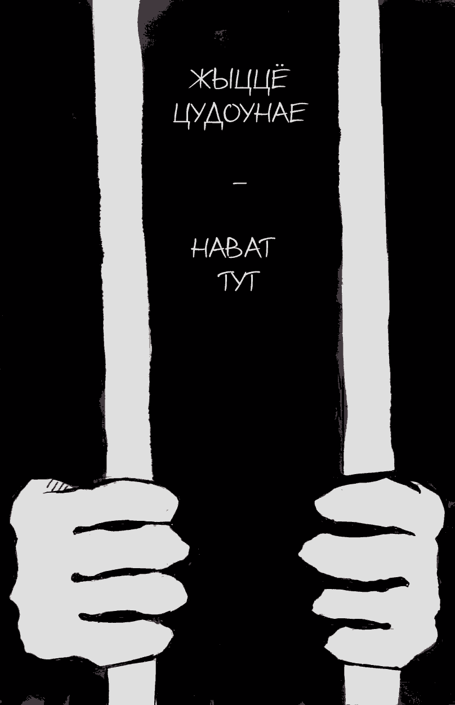

- ~~[Уступ](./1.md)~~
- ~~[Спіс скарачэнняў і жарганізмаў](./2.md)~~
- ~~[ШІЗА](./3.md)~~
- ~~[Опер](./4.md)~~
- ~~[Рэжым](./5.md)~~
- ~~[Недатыкальныя ў турэмнай іерархіі](./6.md)~~
- ~~[Пах](./7.md)~~
- ~~[Бунт супраць боскай іерархіі ў старажытнагрэцкай міфалогіі](./8.md)~~
- ~~[Божая кара](./9.md)~~
- ~~[Бунт у каранціне](./10.md)~~
- ~~[Маўглі](./11.md)~~
- ~~[Адляцелыя](./12.md)~~
- ~~[Чараўнік](./13.md)~~
# [Жыццё цудоўнае](./14.md)
- [Адкрыты ліст](./15.md)
- [Крайняя мера](./16.md)
- [Вызваленне](./17.md)
- [Заканчэнне](./18.md)

---

Чарговыя дзесяць сутак ШІЗА ў шклоўскай калоніі № 17. Гэтым разам мне пашчасціла: я ў хаце не адзін, нас ажно трое. Гэтак і цяплей, бо батарэі амаль не грэюць, і весялей, бо ёсць з кім прабавіць час. Адзін мой сусед — маладзей з адным годам тэрміну, яму вызваляцца праз пяць дзён. Другі — Саня, па мянушцы Лётчык. Сівыя валасы, хаця самому яшчэ няма сарака гадоў. Стомлены голас. Погляд старога воўка. Сядзіць ужо трынаццаць гадоў, а наперадзе яшчэ сем — побытавае забойства. За тыя дзесяць сутак, што мы правялі разам, я пачуў ад яго шмат цікавага: як ён да пасадкі паспеў паслужыць у арміі \(ягоная служба якраз прыпала на перыяд распаду Саўка\); як на пачатку свайго тэрміну «блатаваў» на Оршы \(ПК-8\), дзе быў сведкам «чорнага ходу»: блатных разборак проста ў зоне, ледзь не вольнага карыстання мабіламі, застаў мянтоў, гатовых за грошы прынесці любую наркату. Ён памятаў, як раней сядзелі зэкі ў ШІЗА па прынцыпе «дзень лётны, дзень нялётны» \(гэта значыць адзін дзень кармілі гарачай пайкай, а другі — кавалкам хлеба і кубкам кіпеню\), і многае-многае іншае.

Але не гэтыя аповеды, а філасофія жыцця Лётчыка прымусіла ягоную асобу назаўжды ўрэзацца ў маю памяць.

Неяк я трохі прымаркоціўся. Не памятаю ўжо нагоды: ці то пасля чарговай бяссоннай ночы, ці то пасля чарговага мусарскога выбрыку, але раздражняльнасць, што назапашвалася шмат дзён, вырвалася з мяне вонкі з патокам нематываванай лаянкі на гэту ўстанову, на мянтоў і ўвогуле на наш сённяшні стан. Лётчык слухаў. А потым пагадзіўся:

— Да, базара нет. Зона здесь — петушок. То ли дело на «восьмерке»\! Бывает с утра, пока все спят, выйду в локалку, сяду на скамеечку с чаем… Солнышко светит, птички поют. Настроение — за\*бись… А ты не переживай. Скоро выйдешь обратно в ПКТ, заваришь чайку… Да и срока у тебя — понты. Не гони…

Ён памаўчаў, зірнуў на мяне сваімі стомленымі, крыху вар’яцкімі вачыма і дадаў:

— Жизнь прекрасна. Даже здесь…

Жыццё цудоўнае. Нават тут… Гэта фраза ў маёй галаве адначасова адбілася пячаткай і забіла звонам, выклікаўшы нябачны выбух у нейронных сетках. Я замаўчаў. З кожнай хвілінай яе сэнс даходзіў да мяне ўсё больш.

Уявіце сабе: душная, змрочная бетонная каробка, у якой ноччу адціскаешся і прысядаеш, каб сагрэцца і паспаць, у якой сядзіш столькі, колькі захоча начальнік зоны. За межамі «каробкі» — лагер, з агрэсіўным, у большасці здрадлівым і пакорлівым насельніцтвам, людзі, да якіх не варта паварочвацца спінаю, а таксама звыклыя да беспакаранасці мянты з садысцкімі схільнасцямі, якія не бачаць у табе чалавека. Няма правоў, няма волі, няма жонкі, якая б прыязджала на спатканні, няма дабрабыту і простых чалавечых радасцей. І так ужо трынаццаць гадоў, а яшчэ сем наперадзе. Але: «Жыццё цудоўнае. Нават тут…»

Гэта сіла волі, прага да жыцця ўразілі мяне і ўсялілі вялікую павагу да гэтага чалавека. Колькі жыццёвых сіл, імкнення да свабоды і духу трэба мець, каб гэтак разважаць у ягоным стане, і наколькі смешна пасля гэтага наракаць на свой лёс большасці з тых, хто лічыць, што ў яго ў жыцці праблемы\!

---

Ужо потым, калі пасля «сямнашкі» мяне сустракала крытая са сваімі «блатнымі» і «аўтарытэтамі», калі цэнзары і оперы стосамі выкідалі мае лісты, ізалюючы ад навакольнага свету, калі ў Жодзіне «вертухаі» ставілі да сценкі, білі па нагах і закоўвалі ў кайданкі за тое, што «палітычны», калі ў той жа крытай па дваццаць сутак не вылазіў з ШІЗА, калі за пяць дзён да вызвалення дадалі яшчэ год тэрміну, калі ў Горках пазбаўлялі спатканняў з роднымі і адвакатам, кожны раз, раней ці пазней, калі мне вельмі хацелася разгубіцца, замаркоціцца і пашкадаваць сябе, перад вачамі ўсплываў твар Лётчыка і ягоныя словы:

— Жизнь прекрасна. Даже здесь…

*Студзень 2016*

---

- ~~[Уступ](./1.md)~~
- ~~[Спіс скарачэнняў і жарганізмаў](./2.md)~~
- ~~[ШІЗА](./3.md)~~
- ~~[Опер](./4.md)~~
- ~~[Рэжым](./5.md)~~
- ~~[Недатыкальныя ў турэмнай іерархіі](./6.md)~~
- ~~[Пах](./7.md)~~
- ~~[Бунт супраць боскай іерархіі ў старажытнагрэцкай міфалогіі](./8.md)~~
- ~~[Божая кара](./9.md)~~
- ~~[Бунт у каранціне](./10.md)~~
- ~~[Маўглі](./11.md)~~
- ~~[Адляцелыя](./12.md)~~
- ~~[Чараўнік](./13.md)~~
- ~~[Жыццё цудоўнае](./14.md)~~
# [Адкрыты ліст](./15.md)
- [Крайняя мера](./16.md)
- [Вызваленне](./17.md)
- [Заканчэнне](./18.md)

