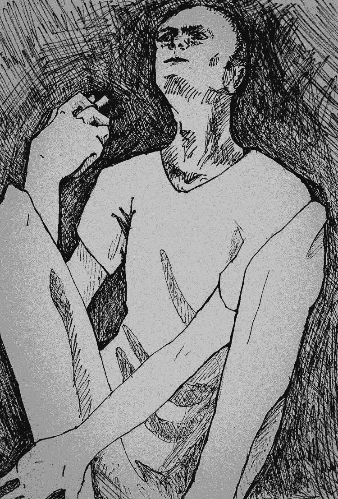

- ~~[Уступ](./1.md)~~
- ~~[Спіс скарачэнняў і жарганізмаў](./2.md)~~
- ~~[ШІЗА](./3.md)~~
- ~~[Опер](./4.md)~~
- ~~[Рэжым](./5.md)~~
- ~~[Недатыкальныя ў турэмнай іерархіі](./6.md)~~
- ~~[Пах](./7.md)~~
- ~~[Бунт супраць боскай іерархіі ў старажытнагрэцкай міфалогіі](./8.md)~~
- ~~[Божая кара](./9.md)~~
- ~~[Бунт у каранціне](./10.md)~~
- ~~[Маўглі](./11.md)~~
- ~~[Адляцелыя](./12.md)~~
- ~~[Чараўнік](./13.md)~~
- ~~[Жыццё цудоўнае](./14.md)~~
- ~~[Адкрыты ліст](./15.md)~~
# [Крайняя мера](./16.md)
- [Вызваленне](./17.md)
- [Заканчэнне](./18.md)

---

«А што гэта за парэзы ў цябе на руках? Хацеў скончыць жыццё самагубствам?» — задаюць мне пытанні час ад часу. Многія не разумеюць, навошта, седзячы ў турме, калечыць сябе і які з гэтага можа быць толк.

У турэмным этыкеце ёсць паняцце «крайнія меры». Да іх адносіцца галадоўка і членашкодніцтва. Згодна з нефармальнымі турэмнымі правіламі крайнія меры ўжываюцца ў трох выпадках: пагроза жыццю, пагроза здароўю і пагроза асабістай годнасці. Логіка такіх дзеянняў простая: ставячы сваё жыццё пад пагрозу, арыштант вымушае адміністрацыю шпіталізаваць сябе і тым самым часова пазбягае крытычнай для сябе сітуацыі, бо за памерлага зэка начальства можа «вздрючить» вертухая ці іншага супрацоўніка: даць вымову, пазбавіць прэміі, часам нават звольніць.

Менавіта пагроза здароўю і прывяла мяне ў 2015 годзе да крайніх мер. Адносіны з адміністрацыяй у ПК-9 \(Горкі\), куды мяне прывезлі пасля асуджэння па артыкуле 411 і дабаўлення дадатковага года зняволення, не склаліся з самага пачатку, што нядзіўна — не для таго мяне туды прывезлі, каб я спакойна адбываў тэрмін. Сярод зэкаў Горкі лічацца «прэс-калоніяй», дзе асуджаных, якія неяк вытыркаюцца з агульнай масы \(палітычных, некіраваных крымінальных аўтарытэтаў, аматараў паскардзіцца на ўмовы ўтрымання\) прасуюць асабліва жорстка.

Не паспеў я прыехаць у калонію, як пачаліся прычэпкі: рана лёг у пасцель \(за трыццаць хвілін да адбою\), адмовіўся ад уборкі санвузла \(гэта значыць не стаў рабіць «петушиную» работу\), не так павітаўся і гэтак далей. «Десять суток ШИЗО», — толькі і чуў я ад начальніка калоніі. Але і ў ШІЗА ўсё было, мякка кажучы, не так гладка. Першы тэрмін я сядзеў з іншымі хлопцамі ў камеры, і ўжо там мяне ўразілі абыякавасць і цынізм адміністрацыі ў дачыненні да ўсяго, што датычыцца патрэб арыштантаў. Я думаў, што пасля чатырох з паловай гадоў турмы мяне ўжо нічым нельга здзівіць. Аказалася, можна. Напрыклад, пасля першых дзесяці сутак ШІЗА дзяжурны афіцэр вывеў мяне не тады, калі ў мяне скончыўся тэрмін — каля дзевятнаццаці нуль-нуль, а амаль на тры гадзіны пазней. Колькі сядзеў у ШІЗА ў іншых установах — нідзе такога не было. На мае заўвагі кантралёру пра тое, што ў мяне ШІЗА ўжо скончылася, — ніякай рэакцыі. Такім чынам, я павінен быў дайсці да атрада, пагаліцца, памыцца \(бо нічога гэтага рабіць у ШІЗА толкам немагчыма\) і паспець усё гэта да адбою, які ў дваццаць два нуль-нуль. Калі б я не паспеў, на мяне б зранку абавязкова склалі акт за тое, што непаголены \(не кажучы ўжо аб тым, што не надта прыемна класціся спаць не памыўшыся\). Але я вырашыў, што чысціня важнейшая за рэжым, і з-за таго, што прыводзіў сябе ў парадак, пайшоў спаць трошкі пазней чым у дваццаць два нуль-нуль, чаго і чакалі кантралёры, якія праз пяць хвілін пасля адбою прыйшлі ў атрад і склалі на мяне дакумент за «невыполнение команды “Отбой”». Вось вам і парушэнне, за якое зноў можна выпісаць новы тэрмін у ШІЗА\! Такая нахабнасць мяне раз’юшыла. Мала таго, што пратрымалі ў ізалятары на тры гадзіны болей, чым маглі, дык яшчэ і наўмысна справакавалі на парушэнне\!

Іншы непрыемны выпадак датычыўся горкаўскіх медыкаў. Згодна з законам, у ШІЗА двойчы ў дзень урач павінен рабіць абход, высвятляць, ці ўсе добра сябе адчуваюць. У ШІЗА ПК-9 урач рабіў адзін абход у дзень, і тое, акрамя нядзелі. Якраз у суботу, седзячы ў ШІЗА, я прастыў і на наступны дзень пачаў клікаць урача, каб хоць як дапамог, бо тэмпературыць і кашляць на дашчанай падлозе ў лёгкай робе — прыемнага мала. На ўсе мае просьбы ў кантралёра быў адзін адказ: «Врача нет, сегодня воскресенье\!» Ды і зэкі пацвярджалі: па нядзелях урач не ходзіць. Але я ведаў, што гэта хлусня. У кожнай калоніі ў любы дзень тыдня і ў любую гадзіну часу ёсць дзяржурны ўрач, проста па скочкай завядзёнцы гэтай установы яму лянота вылазіць са свайго кабінета ў санчасці і ісці цэлых пяцьсот метраў толькі дзеля таго, каб прынесці таблеткі нейкаму там зэку — ану ж, да заўтра не здохне\!

Але нават усё гэта — недастатковая нагода для ўжыцця крайніх мер. Нагода з’явілася пасля таго, як мяне пасадзілі ў ШІЗА за адмову ад работы. На гэты раз пасадзілі аднаго, і ў даволі спецыфічную хату — яна знаходзілася ў метры ад «дзяжуркі» кантралёра.

Для лепшага кантролю як быццам. Але галоўнае тое, што хата была кутняя — знаходзілася на рагу барака. Звонку можа здацца: якая розніца? Камера і камера. Але сталы наведвальнік ШІЗА добра ведае, у чым розніца. Ведаюць гэта і мянты. Справа ў тым, што кутнія камеры — самыя сырыя і халодныя. У іх холадна нават летам, а пра зіму няма чаго і казаць. ^[Якраз зімой у магілёўскай крытай мне давялося паўтара месяца праседзець у камеры на рагу будынка. Дзякуючы сырасці на сценах з’яўляўся кандэнсат. Сцякаючы па сцяне ўніз, ён утвараў лядзяш у кутку камеры, які, калі яго не «ліквідаваць», вырастаў літаральна за дзень. Дваццаць чатыры гадзіны ў суткі мы жылі ў целагрэйках.]

Калі тады, дзевятнаццатага мая, мяне завялі ў камеру № 16, я адразу зачыніў акно, спадзеючыся, што да ночы «надыхаю» на больш-менш прымальную температуру. Але гэтыя спадзяванні не спраўдзіліся.

Далей пачалася самая цяжкая ноч у маім жыцці. Калі прыйшоў адбой і я прылёг на падлогу, то выявіў, што яна ніякая не дашчаная. Яна была настолькі халодная і цвёрдая, што мне спачатку падалося, што гэта бетон. Але, раскалупаўшы яе ў адным месцы, я зразумеў, што яна з ДСП, што ў сваю чаргу таксама парушэнне закону, бо згодна з рэгламентам усе падлогі ў ШІЗА і ПКТ павінны быць дашчанымі.

Першы «раўнд» сну цягнуўся ў мяне хвілін трыццаць. І ён жа быў самым доўгім. Далей у мяне не атрымлівалася паспаць больш чым пятнаццаць хвілін — не давала ўсёпранікальнае адчуванне холаду. У гэту ноч я зразумеў, наколькі ўедлівым і бязлітасным ён можа быць: адбіраючы адну за адной долі градусаў цяпла ад вашага цела, ён прымушае розум не думаць больш ні аб чым, акрамя як аб тым, як сагрэцца. Дакучлівая думка стукае ў галаве, як дзяцел, які ніяк не скончыць сваю работу, адчуваецца, як вечна галодны драпежнік, якога няма чым накарміць. Холадна, вельмі холадна. Холадна рукам, холадна нагам, холадна спіне, холадна носу і вушам. Запраўленыя ў шкарпэткі штаны і запраўленая ў штаны роба ўжо даўно не дапамагаюць. Дзесьці ў сярэдзіне ночы перасталі дапамагаць і традыцыйныя «саграванні» — адцісканні і прысяданні. У арганізма ўжо не было ў запасе свабодных калорый, каб перапрацаваць іх на цяпло. Мала таго, пасля некалькіх соцень адцісканняў і прысяданняў, не заставалася ўжо і сіл, каб рабіць іх далей. Сітуацыя станавілася ўсё больш безвыходнай. Бліжэй да ранку \(як мне падавалася, бо гадзінніка, вядома, не было\), пачаліся своеасаблівыя «сонныя галюцынацыі»: мне снілася, што я сплю ў сябе дома пад вялізнай цёплай коўдрай. Мне вельмі добра і камфортна, прыемна і лёгка… У галаве пралятае думка: і чаго гэта я турбаваўся, скакаў, адціскаўся і прысядаў, калі мне так добра спіцца? І тут мозг дае каманду на абуджэнне. Адкрываю вочы, і па ўсім целе праходзяць цяжкія і балючыя дрыжыкі: я нарэшце разумею, дзе я, і што зноў трэба ўставаць і спрабаваць выціснуць з сябе нейкія актыўныя рухі, каб павысіць тэмпературу цела і паспаць яшчэ хоць некалькі хвілін. Атмасферу і агульнае ўражанне дапаўняла яркае электрычнае святло адразу дзвюх лямпачак з-пад столі. Свет у ШІЗА на ноч не выключалі, і я адчуваў сябе ў нейкай сумесі вар’яцкага дома і катавальні.

Нарэшце прыйшла раніца. Паеўшы, я спадзяваўся паспаць, каб хоць неяк «адбіць» гадзіны, не дабраныя за ноч, і прывесці сябе ў норму. Кантралёр, вядома, напісаў на мяне акт за гэта \(за які мне пасля дадалі яшчэ колькі сутак\), але мне было ўжо ўсё роўна.

Пасля ранішняй праверкі я прылёг на падлогу і зразумеў, што мае спадзяванні былі дачаснымі: нават дзённая тэмпература ў камеры не дазваляла паўнавартасна спаць. Атрымліваецца, спаць нельга ні ўдзень ні ўначы… Я прыгадаў пакутлівую ноч і зразумеў, што ў мяне наперадзе яшчэ мінімум дзевяць такіх начэй, а хутчэй за ўсё больш, бо, бясспрэчна, начальнік зоны накіне яшчэ. І тады я зразумеў — трэба нешта рабіць.

Далей на працягу ўсяго дня я патрабаваў у ДПНК, які час ад часу прыходзіў у ШІЗА, пераводу ў іншую камеру. Аргументы: тэмпература ў ёй ніжэйшая, чым павінна быць згодна з заканадаўствам,\[10\] а падлога — ДСПшная, хаця павінна быць дашчаная, што таксама «не па законе». Але раз-поразу ён выслухоўваў і кідаў мне абыякавае «разберемся…» альбо «я уточню…», і сітуацыя не рухалася з месца. Я тым часам разумеў, што яшчэ дзевяць такіх начэй і выйсці з ШІЗА можна будзе з цэлым букетам захворванняў у дадатак да наяўных. Трэба выходзіць любымі метадамі. Я падрыхтаваў «мойку», якую пранёс з сабой у ШІЗА, нягледзячы на шмон \(дзякуй парадам бывалых арыштантаў\), пачаў складаць план. Першапачаткова ён быў такі: адразу пасля вячэрняй праверкі ўскрываю вены на абедзвюх руках і жывот. Галоўным момантам тут было ўскрыцца як след, а не проста падрапацца: наглядзеўся я на такіх, хто «ўскрываўся», ледзь падрапаўшы рукі, мянты з іх толькі смяяліся: перабінтуюць проста ў камеры і нават не запытаюцца, чаго хацеў. Каб больш не мёрзнуць у гэтай хаце, трэба рэзацца ўсур’ез, але ў той жа час і не «перабраць», бо, парэзаўшыся занадта моцна, можна замёрзнуць ужо назаўсёды. Вырашыў так: спачатку дабіраюся да вен на руках, раблю кропкавыя надрэзы, кроў акуратна сцэджваю ў свой паўлітровы кубак, набіраю поўны \(чалавек можа выжыць, страціўшы да паловы крыві, а ва мне — каля пяці літраў\), пасля чаго выліваю яе пад дзверы камеры \(адразу пасля праверкі там будзе ДПНК і кантралёр — заўважаць, нікуды не падзенуцца\), а пасля ўскрываю жывот \(два пальцы ніжэй за пупок — так вучылі\), пажадана да брушной поласці — тут ужо як болевы парог дазволіць.

У соты раз папрасіўшы перавесці мяне ў другую камеру, я зразумеў, што рабіць гэтага яны не будуць і што трэба пераходзіць да дзеянняў.

Планы з самага пачатку зблытаў нечаканы зрух у часе праверкі, у выніку чаго я вырашыў не чакаць і пачаў ускрывацца раней.

Схаваўся за «браню» \(перагародка паміж прыбіральняй і астатняй хатай\), каб мяне не было бачна з вочка, перахрысціўся, узяў «мойку» і нанёс першы парэз — па левай руцэ. Ці было страшна? Вядома, так. Але я разумеў, што і навошта раблю. Насуперак чаканню, кроў не пайшла фантанчыкам, замест гэтага выступіла некалькімі кроплямі, якія потым зліліся ў слабенькі ручаёк — я накапаў у кубак зусім нямнога. Тады пачаў наносіць па руцэ ўжо не проста парэзы, а парэзы-ўдары, каб тоненькае лязо «мойкі» ўвайшло як мага глыбей. Пару разоў біў лязом двойчы ў адзін і той жа парэз, каб яго пашырыць. Некаторыя парэзы атрымаліся даволі ўдалымі: добрыя паўсантыметра ў глыбіню і сантыметр у шырыню. Але крыві паранейшаму было вельмі мала. Можа, ад хвалявання яна адышла ад перыферыі цела ўнутр? Кажуць, ёсць такі біялагічны механізм прыстасавання да небяспекі… Тут каля маёй хаты пачалі таптацца лягавыя — праверка\! Я схаваў рукі за спіну, выскачыў з-за «брані» і стаў навыцяжку, а-ля паслухмяны зэк. Зараз галоўнае, каб яны нічога не заўважылі — яшчэ рана\!

— Добрый вечер, — кажа ДПНК.

— Добрый вечер. Дедок. Всё в порядке.

— Точно всё нормально? — у вачах мусара бачны недавер.

— Точно, — пасміхаюся.

Мусар падазрона аглядае камеру…

— А чего не по форме одежды? — пакуль яны заходзілі, я не паспеў надзець кліфт, стаяў у цішотцы.

— Да не успел надеть, вы так быстро зашли\! — зноў пасміхаюся, а сам думаю: «Божа, толькі б кроплі на падлозе не заўважылі\!»

Нарэшце дзверы зачыняюцца, і я ўнутрана смяюся з таго, як я іх правёў. Лашары\!

Але тут мяне згубіла пільнасць кантралёра. Я адразу палез за «браню», а кантралёр, відаць, інтуітыўна адчуў нешта нядобрае і працягнуў глядзець у вочка замест таго, каб ісці да наступнай хаты. І, відавочна, убачыў ці то кроў, ці то маю руку, што вытыркалася з-за «брані». Крык за дзвярыма: «Он режется\!\!\!», лічаныя секунды — мент адкрывае першы замок. Я разумею, што часу няма, перакладваю «мойку» ў другую руку і хутка, колькі ёсць сіл, паласую сябе ўжо па правай руцэ. Мент пачаў адкрываць другі замок, ад кратаў. Як добра, што ён вінтавы\! Гэта дае мне яшчэ пару секунд, я прыспускаю гумку штаноў і з максімальна магчымым націскам праводжу сабе «мойкай» па жываце. Паспяваю зрабіць гэта тры разы, і лягавыя ўрываюцца ў камеру. Скідваю «мойку» ва ўмывальнік, ды так удала, што яна адразу трапляе ў зліў.

ДПНК і кантралёр стаяць, глядзяць. З абедзвюх рук і з жывата ў мяне цячэ кроў. Яны дастаюць кайданкі і закоўваюць мне рукі. Вядуць у прагулачны дворык — у той час там якраз ідзе прагулка. Я сяджу ў стане лёгкага шоку… Зараз галоўнае, каб выканалі патрабаванні.

Але шкадую, што ўсё адбылося не так, як я запланаваў. Ну ды ладна, што ўжо зробіш — як атрымалася, так атрымалася.

Праходзіць хвілін дзесяць. Размова двух вязняў \(перакрыкваюцца з аднаго дворыка ў другі\):

— Слушай, а что там за кипиш? Чего менты суетятся?

— А это Дедок вскрылся\!

— Кто?

— Дедок\!

— А кто это?

— Политический.

— Это я Дедок\! — уступаю ў размову.

— Так а чего ты вскрылся?

Разгаварыліся з хлопцамі. Растлумачыў ім сваё агульнае становішча ў гэтай калоніі, паслухаў іх парады…

Тут у мой дворык заходзіць «тройка»: начальнік аператыўнага аддзела, начальнік рэжымнага аддзела і начальнік медыцынскай часці. Рэжымнік просіць распрануцца — мяне пачынаюць шманаць. Усіх цікавіць толькі адно пытанне: як я пранёс «мойку»? Вядома, я ім гэтага не кажу. Пасля таго як яны прамацалі ўсё, ажно да гумкі на маіх трусах, паглядзелі на мае пяты \(раптам там нешта прылеплена\), каб пераканацца, што болей «моек» у мяне няма, і толькі потым задалі пытанне: у чым прычына майго ўчынку?

І мяне прарвала: у эмацыянальнай форме пераказаў ім, што з выкананнем КДБшных загадаў яны відавочна перастараліся, і агучыў сваё патрабаванне: перавесці мяне ў любую іншую камеру. Яны паслухалі. Опер папрасіў усіх выйсці і скамандаваў зняць з мяне кайданкі. Мы засталіся з ім сам-насам. Дзверы дворыка зачыніліся, і ён раздражнёна пытае мяне:

— Чего ты хочешь? — згодна са сваёй сутнасцю опера ён не верыць, што мае патрабаванні тыя, якія я агучыў, думае, што трымаю на розуме нешта іншае.

Такое пытанне спачатку мяне трохі бянтэжыць.

— Чего я хочу, я вам не скажу, потому что вы тогда сделаете всё, чтобы я этого не получил, — быў мой адказ. 

Не бачыў сэнсу ў яго яшчэ нечага прасіць — усё роўна добрых умоў утрымання мне ў гэтай зоне не дачакацца.

Выслухаў ад опера шматслоўныя паўнамёкі, тыпу: «Разве ты не понимаешь, кто ты?» \(маўляў, будзем цябе прэсаваць у любым выпадку\), «Есть определённые правила игры…» \(што ён хацеў гэтым сказаць, я дагэтуль не зразумеў\), а таксама спробы пераканаць мяне жыць па іх правілах — опер даводзіў, што ў іх нават былы злодзей у законе Галей — «уважаемый человек\!» — ходзіць на прамзону і працуе. Цвёрдага абяцання перавесці мяне ў іншую хату я ад яго так і не пачуў.

Нарэшце мяне павялі да ўрача. Пааддзіралі ад рук і ад жывата тканіну адзення, якая ўжо амаль прысохла, а потым раіліся, зашываць парэзы ці дастаткова будзе перабінтаваць. Вырашылі перабінтоўваць — так здарэнне можна будзе кваліфікаваць як лёгкі інцыдэнт, бо калі б мяне зашывалі, гэта казала б аб тым, што раны сур’ёзныя. А гэта было нявыгадна мясцоваму начальству, якое, як я потым даведаўся, дакладвала аб сітуацыі на самы верх — да міністра МУС.

Пасля перавязкі мяне павялі ў камеру… Тую ж самую. І тут я зрабіў яшчэ адну памылку. Замест таго каб усімі сіламі ўпірацца і не ісці туды, я паверыў ДПНК, які сказаў, што пытанне аб маім пераводзе ў іншую камеру «вырашаецца». Камера была перавернутая ўверх дном: усе мае нямногія рэчы ператрэслі, вывернулі смеццевае вядро — проста на падлогу. Шукалі «мойку». Было каля дзевятнаццаці гадзін вечара…

Прыкладна кожныя паўгадзіны я пачынаў малаціць у дзверы і пытацца, чаму мяне не пераводзяць. Мяне кармілі абяцанкамі, што «вось-вось». Але, калі пачаў надыходзіць адбой, я зразумеў, што мяне падманулі: вырашылі пайсці на прынцып, маўляў, «ён да нас з ультыматумам, тады і мы не саступім».

На такі выпадак у мяне быў «План “Б”».

У шаснаццатай камеры да мяне сядзеў былы злодзей у законе Дзіма Балееў \(«Галей»\), якога, каб пасадзіць у беларускую турму, экстрадыравалі са Швецыі — МУС нешта хацела ад яго ў сваіх крымінальных гульнях. Як вынік, камера была забіта рознымі рэчамі, якіх звычайна ў ШІЗА не бывае. Адну з іх я запрымеціў з самага пачатку — каля прыбіральні стаяла нейкая выгнутая палка незразумелага паходжання і прызначэння \(хутчэй за ўсё для таго, каб «срабатываться» праз каналізацыю паміж камерамі\). Я ўзяў анучу і закрыў вочка на дзвярах, каб кантралёр не бачыў, што я раблю. Узяў палку і прасунуў яе ў краты, што абкружалі лямпачку пад столлю. З яе дапамогай я спадзяваўся разбіць лямпачку, асколкам шкла ўскрыцца ў другі раз і парэзаць ногі — там вен болей, і месцяцца яны больш шчыльна, на гэты раз дакладна шпіталізуюць, нікуды не дзенуцца\! Пасля некалькіх удараў лямпачка пачала разгойдвацца \(яна вісела на провадзе\), але біцца не спяшалася. Удар аб краты, другі — яна звініць, але паранейшаму не б’ецца. Размахнуцца палкай таксама не атрымаецца — яна абмежаваная «квадратам» сталёвых прутоў, у які я яе прасунуў. Прыбягае ДПНК і з крыкам «Баян качает\! Открывай двери\!» загадвае кантралёру адчыняць дзверы. Афіцэр і два кантралёры залятаюць у камеру і хутка разумеюць, што я задумаў. Хапаюць мяне за рукі і ставяць да сцяны. Ад злосці на іх падман і на тое, што мой план зноў не ўдаўся, я ўжо дрэнна сябе кантралюю: пачынаю крычаць на іх і пагражаць усімі смяротнымі карамі. ДПНК камандуе: «Доставай наручники\!» Дастаюць кайданкі і спрабуюць мяне скруціць. Я супраціўляюся, як магу. Але іх трое. Літаральна ўбіваюць мае рукі ў кайданкі: у ходзе барацьбы ўсе свежыя перавязкі пазлазілі, зноў пайшла кроў. ДПНК хоча прышпіліць мяне кайданкамі да металічнай табурэткі. Вострых прадметаў у камеры няма, але нават калі б і былі, я разумею, што, прышпілены кайданкамі, я да іх не дацягнуся, таму вымушаны паабяцаць яму не ўскрывацца.

Лягавыя сыходзяць, пакідаючы мяне ў камеры ў кайданках. Прайграны бой, але не вайна. Праз паўгадзіны прыходзіць урач і перавязвае мяне па новай. Адбой прайшоў, і я кладуся спаць, як ёсць, «закаваны». Праз нейкі час мянты заходзяць і здымаюць «бранзалеты».

У тую ноч я зноў спаў вельмі цяжка — акрамя холаду, нагадваў аб сабе боль. Ды і з парэзанымі рукамі не надта паадціскаешся. Але прырода зрабіла мне падарунак — ужо на наступны дзень на вуліцы істотна пацяплела, і астатні свой тэрмін у ШІЗА я правёў больш-менш ніштавата.

А праз пару тыдняў мне паставілі яшчэ адзін прафілактычны ўлік. Акрамя прафуліку па катэгорыі «склонен к захвату заложников» я стаў «склонен к суициду». Лухта, вядома, калі б хацеў забіць сябе, то рэзаў бы вены ўздоўж, а не ўпоперак.

На наступны дзень гісторыя атрымала працяг: у ШІЗА закрылі «смотрящего» за зонай і ягонага памагатага, а па ўсім бараку ШІЗА/ПКТ правялі капітальны шмон, выкідаючы няхітрыя «запрещённые предметы» арыштантаў: таблеткі, часопісы, «лішняе» адзенне, ніткі, канацікі і падобнае, пры гэтым не забываючы даводзіць: гэта з-за таго, што «политический вскрылся». Такім простым метадам мяты нацкоўвалі вязняў на мяне.

---

Якая ва ўсім гэтым мараль? Мараль тут толькі адна: калі ідзеш у ШІЗА, бяры з сабой дзве «мойкі».

---

- ~~[Уступ](./1.md)~~
- ~~[Спіс скарачэнняў і жарганізмаў](./2.md)~~
- ~~[ШІЗА](./3.md)~~
- ~~[Опер](./4.md)~~
- ~~[Рэжым](./5.md)~~
- ~~[Недатыкальныя ў турэмнай іерархіі](./6.md)~~
- ~~[Пах](./7.md)~~
- ~~[Бунт супраць боскай іерархіі ў старажытнагрэцкай міфалогіі](./8.md)~~
- ~~[Божая кара](./9.md)~~
- ~~[Бунт у каранціне](./10.md)~~
- ~~[Маўглі](./11.md)~~
- ~~[Адляцелыя](./12.md)~~
- ~~[Чараўнік](./13.md)~~
- ~~[Жыццё цудоўнае](./14.md)~~
- ~~[Адкрыты ліст](./15.md)~~
- ~~[Крайняя мера](./16.md)~~
# [Вызваленне](./17.md)
- [Заканчэнне](./18.md)
