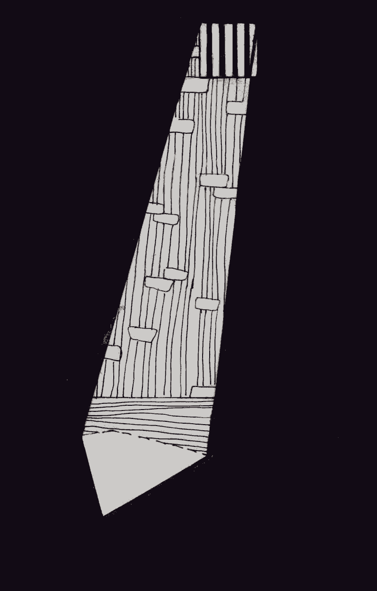

- ~~[Уступ](./1.md)~~
- ~~[Спіс скарачэнняў і жарганізмаў](./2.md)~~
# [ШІЗА](./3.md)
- [Опер](./4.md)
- [Рэжым](./5.md)
- [Недатыкальныя ў турэмнай іерархіі](./6.md)
- [Пах](./7.md)
- [Бунт супраць боскай іерархіі ў старажытнагрэцкай міфалогіі](./8.md)
- [Божая кара](./9.md)
- [Бунт у каранціне](./10.md)
- [Маўглі](./11.md)
- [Адляцелыя](./12.md)
- [Чараўнік](./13.md)
- [Жыццё цудоўнае](./14.md)
- [Адкрыты ліст](./15.md)
- [Крайняя мера](./16.md)
- [Вызваленне](./17.md)
- [Заканчэнне](./18.md)

---

«Хто не быў на “губе”, той не служыў у арміі», — часта кажуць былыя салдаты. Аналагічна можна сказаць: «Хто не быў у ШІЗА, той не сядзеў у турме».

Без разумення таго, што сабой уяўляе штрафны ізалятар, альбо, як яго яшчэ называюць, кіча, немагчыма зразумець сутнасць турэмнай сістэмы і многія паводзіны вязняў.

Згодна з ПУР і КВК, штрафны ізалятар — адна з найцяжэйшых мер дысцыплінарнага спагнання, якая павінна прымяняцца толькі за грубыя парушэнні рэжыму. А паколькі вызначэння «грубага» парушэння ніхто не даваў, яно цалкам ляжыць на сумленні начальніка калоніі, які і прызначае гэта пакаранне.

Што такое ШІЗА? На тэрыторыі калоніі за дадатковым радам калючага дроту і КСП,\[2\] як на выспе, знаходзіцца асобны барак — барак ШІЗА/ПКТ, які з’яўляецца своеасаблівай лагернай спецтурмой. У гэтым бараку \(у выпадку турэмнага ШІЗА — гэта проста падвал\), як і ў звычайнай турме, знаходзяцца камеры. У адну з такіх камер пасля «дысцыплінарнай камісіі» і заводзяць парушальніка.

Уявіце памяшканне даўжынёй прыкладна два метры і шырынёй метр з нечым. Дашчаная падлога. На гэтай невялічкай плошчы знаходзяцца: нары, прышпіленыя да сцяны \(адшпільваюцца кантралёрам звонку, з прадолу\), табурэтка, столік «для прыёму ежы», прыбіральня \(унітаза няма, ёсць «очко», абгароджаная з аднаго боку сценкай каля метра вышынёй, умывальнік, невялікія палічкі на сценах. Часта яны размешчаны так, што па камеры нельга зрабіць і двух крокаў, каб на нешта не наткнуцца. Пад столлю вісіць лямпачка, ёсць і «акно», калі яго можна так назваць. Паміж свежым паветрам і вамі — шкло ў раме, краты з унутранага боку і металічныя жалюзі са знешняга, каб вязні не маглі «срабатываться» — перадаваць нешта з камеры ў камеру, а таксама для большага псіхалагічнага ціску, каб не было бачна сонца і неба. Але адміністрацыя часта праяўляе вынаходлівасць і робіць у «вокнах» ШІЗА дадатковая краты. Рэкардсменамі лічу мянтоў ПК-9 \(Горкі\), якія зрабілі ў акне ажно чацвёра кратаў плюс шкло — сонечны свет у камеру амаль не трапляў, — так што, цалкам магчыма, заслужылі пахвалу ад правяраючых з ДВП.

Перад заходам у ШІЗА вязня чакае абавязковы шмон. Самае важнае — браць з сабой нельга практычна нічога, з адзення толькі сваё «форменнае» \(у некаторых калоніях і «форменнае» нельга — у ізалятары выдаюць асобае, з надпісам «ШИЗО» на ўсю спіну\). Вам дазволяць узяць толькі ручнік, мыла, зубную пасту, зубную шчотку і туалетную паперу. Нават станкі для галення можна не паўсюль. У тых жа Горках, напрыклад, тым, хто знаходзіцца ў ШІЗА, галіцца ў лазні не даюць, каб не разабралі станкі на «мойкі» і не скарысталі іх, напрыклад, для таго, каб ускрыцца \(вядома, ніхто не думае пра паляпшэнне жыцця зэкаў, каб яны перасталі ўскрывацца — прасцей забараніць галіцца\). Як вынік, вязні выходзяць з ШІЗА зарослыя, як бармалеі.

Усё астатняе, што б вы ні захацелі з сабой пранесці \(ежу, цыгарэты, паперу, ручку, лісты, газеты, кнігі\), не дазволена. У ШІЗА вы павінны застацца сам-насам з сабой і, па задуме турэмшчыкаў, напэўна, «думаць пра свае паводзіны».

Праўда, хітрыя зэкі, якія не хочуць пазбаўляцца цыгарэт на дзесяць ці больш сутак, робяць так званыя «тарпеды» — скруткі з цыгарэт, герметычна запакаваныя ў некалькі слаёў цэлафану, што потым запіхваюцца ў прамую кішку. Вядома, шмат цыгарэт так не ўлезе, таму ўпакоўваць іх у «тарпеду» трэба вельмі шчыльна — гэта цэлая тэхналогія. У выніку сярэдняя тарпеда з сарака цыгарэтамі мае дыяметр тры-чатыры сантыметры. Большасць зэкаў не можа ўзяць з сабой больш за тры тарпеды, але даводзілася чуць аб умельцах, якія бралі да дзевяці штук. Пасля «растарпедавання» цыгарэты трэба недзе захоўваць, каб на планавым шмоне ў камеры іх не знайшлі і не забралі. Гэта таксама патрабуе ад зэка пэўнай кемнасці і спрыту.

У кармушку камеры ШІЗА тройчы на дзень прыносяць ежу. Лыжку і міску мець таксама нельга — іх выдаюць, а як паеў — забіраюць. Да 1998 г. зэкаў у ШІЗА кармілі так: адзін дзень давалі ежу па зніжанай норме \(менш, чым у атрадах\), а другі дзень — толькі хлеб і ваду. «Дзень лётны, дзень нялётны», — так называлі гэты парадак арыштанты, большасць з якіх выходзілі з ізалятара пасля пятнаццаці сутак пакарання, трымаючыся за сценку. У 1998 г. закон памяняўся, але зніжаная норма харчавання ў ізалятарах была пакінутая да 2010 г. Зараз зэкаў кормяць аднолькава як у ШІЗА, так і ў атрадзе. Гуманізацыя\!

Трохразовае харчаванне — амаль адзінае, па чым, седзячы ў ШІЗА, можна больш-менш дакладна дазнацца колькі зараз часу. Бо гадзіннік у ШІЗА таксама забаронены. Таксама як і ўсё, што можа дапамагчы бавіць час. З ШІЗА не выводзяць на спатканні і тэлефонныя званкі. Там нельга атрымліваць перадачы, пасылкі, бандэролі і лісты. На прагулку не выводзяць — дваццаць чатыры гадзіны ў суткі знаходзішся ў бетоннай каморцы. На ўвесь рост перад вязнем паўстае пытанне: чым заняцца? Адказ на яго ён мусіць знайсці, па-першае, калі не хоча звар’яцець, па-другое, каб час для яго не цягнуўся з такой пакутлівай павольнасцю. Сітуацыю ўскладняе тое, што сядзяць у ШІЗА звычайна па адным. Мянты ведаюць, што робяць, бо яшчэ Дзюма заўважыў: «Турма, падзеленая з кім-небудзь, ужо толькі напалову турма». Адміністрацыя лагера з задавальненнем дасць вам адчуць сябе вязнем замка Іф і пасадзіць да вас суседа толькі тады, калі ўсе іншыя камеры будуць занятыя.

Тыя, што кураць, вырашаюць праблему адносна лёгка: пакуль дастанеш цыгарэты з «нычкі», пакуль дачакаешся, каб кантралёр прайшоў міма вочка, пакуль пакурыш у акенца, потым ручніком развееш дым па хаце, каб не «спаліцца» — ужо які-ніякі занятак. Чатыры-пяць цыгарэтак за дзень — час бяжыць. Тым, што не кураць, яшчэ складаней. Але ў любым выпадку амаль усе формы баўлення часу ў ШІЗА забаронены ПУР. За іх можа атрымаць дадатковае спагнанне — напрыклад, прадаўжэнне тэрміну ў ШІЗА. Размаўляць з суседзямі праз сцены, акно ці каналізацыю — забаронена, чытаць-пісаць — забаронена \(нават калі вы цудам нешта пранеслі — у вас гэта забяруць на першым жа «шмоне»\), спаць — забаронена, а калі вас двое і вы вылепіце з хлеба шашкі і вырашыце ў іх згуляць, то і за гэта на вас могуць накласці спагнанне. «Не положено\!»

Застаецца няшмат: хадзіць па камеры з кутка ў куток, калі «мэбля» дазваляе \(звычайна гэта пяць маленькіх крокаў у адзін бок\), займацца спортам \(калі можна назваць «спортам» практыкаванні ў памяшканні, куды амаль не трапляе свежае паветра\) ці проста, седзячы, думаць… Асабіста мяне ратавала ёга, медытацыя, мары аб будучыні і доўгія «пешыя прагулкі».

Але тое — удзень. Самае цікавае ў ШІЗА пачынаецца ноччу. Згодна з ПУР, матрас, як і іншыя пасцельныя рэчы, вязням у ШІЗА не выдаюцца, замест гэтага на ноч ад сцяны адшпільваецца нара. Вязні ж на ёй ніколі не спяць — спяць на падлозе, бо там цяплей. Калі на вуліцы не трыццаць і болей градусаў цяпла, то ноччу вас чакае выдатная прыгода пад назвай «Паспрабуй паспі». Мала таго, што спаць прыйдзецца на дошках, што цяжкавата з непрывычкі, галоўнае — холад рэдка дасць вам заснуць больш чым на трыццаць-сорак хвілін. Паспаўшы якія паўгадзіны \(залежыць ад тэмпературы ў камеры\), вы прачнецеся ад дрыжыкаў і зразумееце, што больш спаць не можаце, і хутка зразумееце, навошта на «шмоне» з вас знялі ўсё цёплае адзенне\! Інстынкт выжывання беспамылкова падкажа вам: калі немагчыма падняць тэмпературу навакольнага асяроддзя, трэба падняць хаця б тэмпературу ўласнага цела, і вы пачнеце рабіць практыкаванні са школьнага курса фізкультуры, каб хоць трошкі разагнаць кроў па задубелых канечнасцях. Калі вы паспяхова справіцеся з гэтай задачай, то зможаце паспаць яшчэ паўгадзіны. І чаргаваць спорт са сном вам давядзецца да самага пад’ёму, калі на снеданне баландзёр прынясе вам гарачай \(калі пашанцуе\) гарбаткі і міску кашы.

З цягам часу набіраешся досведу: заходзячы ў камеру, залепліваеш акно туалетнай паперай \(хоць няма свежага паветра, зато цяплей\), знаходзіш месцы, дзе спаць зручней за ўсё \(я вылічваў іх па сцёртасці фарбы на падлозе: дзе фарба самая сцёртая, там і трэба класціся спаць, бо гэтая сцёртасць кажа аб тым, што там спалі ўсе да мяне\), запраўляеш штаны ў шкарпэткі, каб зберагчы кропелькі цяпла, а таксама робіш са сваіх тапачак і скрутку туалетнай паперы выдатную падушку.

У любым выпадку прачнецеся вы разбітым, і ўвесь дзень вам будзе хацецца спаць. Нарэшце, паддаўшыся гэтаму памкненню, вы прыляжаце на падлогу, і кантралёр з радасцю напіша на вас акт аб парушэнні. \(Яшчэ не забылі? Спаць удзень забаронена\!\) А праз колькі дзён адчыняцца дзверы, і вам паведамяць: «Такого-то числа во столько-то осужденный такой-то спал на полу камеры номер такой-то штрафного изолятора, чем нарушил пункт такой-то Правил внутреннего распорядка». І прапануюць распісацца яшчэ за дзесяць сутак. Асаблівым шыкам у мянтоў лічыцца прынесці такую паперу ў апошнія гадзіны, нават хвіліны, да вызвалення, калі ты ўжо наперад смакуеш, як вось-вось пап’еш у атрадзе гарачай кавы з шакаладкай і будзеш спаць гэту ноч у цёплай і мяккай пасцелі.

Колькі ж можна трымаць вязня ў штрафным ізалятары? Да 2008 года гэты тэрмін складаў пятнаццаць сутак. Потым з чарговай хваляй «гуманізацыі» яго знізілі да дзесяці, але дэ-факта гэта нічога не змяніла, бо гаворка ідзе аб «аднаразовым» пакаранні, за адно парушэнне. А за «парушэнні ў ШІЗА» вязня могуць утрымліваць там колькі заўгодна доўга. «Спаў на падлозе» — не адзіная нагода. У кожным лагеры свая тыповая адпіска, якая фабрыкуецца на арыштанта, каб прадоўжыць яго тэрмін у ШІЗА. Дзесьці гэта «не произвел уборку», дзесьці «расстегнутая пуговица»… Ніколі не забуду, як у ПК-17 у Шклове, дзе трапіў у ШІЗА праз дзве гадзіны пасля таго, як прыехаў у калонію, вырашыў: ну, зараз не дам ім нагоды, буду рабіць усё па статуце\! Не будзе чаго прычапіцца, і выпусцяць праз дзесяць сутак\! Малюсенькай анучкай вычысціў усю камеру: прыбраў павуцінне, пыл, бруд, нават у тых месцах дзе, упэўнены, яго не прыбіралі з моманту будавання барака. Вячэрняя праверка. Адчыняюцца дзверы. У цесную камеру літаральна ўрываюцца адразу тры кантралёры ды яшчэ і ДПНК і пачынаюць азвярэла матляць галавамі па баках, праводзіць рукамі па паліцах, рэбрах нараў, батарэі, століка, нахіляцца, залазіць пад столік і ледзь не на карачках поўзаць, вышукваючы пыл і хоць якую часцінку бруду. Усё беспаспяхова — камера «зіхаціць». Тады адзін з кантралёраў, той, што перад гэтым праводзіў рукой па паліцы, на якой часткова аблупілася старая фарба, націснуў рукой і расцёр яе, часцінкі фарбы засталіся на ягоных руках:

— О\! А вот и пыль\! Составляем на тебя документ\!

Што я ім адказаў, ужо не помню. Але той выпадак канчаткова пахаваў веру ў тое, што палітвязню ў зоне можна «жыць-каб-цябе-не-чапалі».

Іншы выпадак з ПК-9 \(Горкі\). Хлопец, які ведаў, што мянты на яго злыя і хутчэй за ўсё захочуць працягнуць ягоны тэрмін знаходжання ў ШІЗА, наўмысна паводзіў сябе прыкладна — зашпільваў кліфт на апошні гузік, не спаў удзень і гэтак далей. І вось чарговы дзень. Прайшоў абед. Некалькі хлопцаў, што сядзелі з ім у хаце \(ён быў не адзін\), разлягліся на падлозе і «даюць храпака». Адчыняюцца дзверы, у хату заходзіць ДПНК. На тых, хто спіць, ён не звяртае аніякай увагі. Паміж ім і «прыкладным зэкам» адбываецца такая размова:

— А ты чего не спишь?

— А я не нарушаю распорядок дня\!

— Не нарушаешь, да?.. Ну тогда бумага на тебя, бумага\!

І потым на дысцыплінарнай камісіі арыштант можа колькі заўгодна даказваць, што ён не спаў ці яшчэ нешта не парушаў. Я не чуў і не бачыў аніводнага выпадку, каб гэтыя тлумачэнні хоць раз дапамаглі камусьці хаця б знізіць пакаранне, не тое што пазбегнуць яго.

У ПК-17 \(Шклоў\) яшчэ ў былыя часы, калі ў зоне часта можна было сустрэць мабільныя тэлефоны, аператыўнікі даводзілі да зэкаў: за валоданне мабілай — трыццаць сутак ШІЗА\! А як жа трыццаць, калі законам дазволена максімум пятнаццаць? Атрымліваецца, чалавек яшчэ не трапіў у ШІЗА, а мянты ўжо ведаюць, што ён зробіць там «парушэнне рэжыму» і прыйдзецца дакінуць яму яшчэ пятнаццаць сутак\!

Нахабнасць мянтоў і звыкласць да беззаконнасці ў зэкаў даходзяць да камічнага абсурду. Адзін з былых прабывальнікаў ПК-8 \(Орша\), распавядаў мне, як дадавалі суткі ў ШІЗА там. На праверцы ў камеру заходзіць ДПНК, звярае колькасць людзей у камеры па спісе. Глядзіць, хто ў камеры па раскладзе дзяжурны, і калі гэта той самы, каго аператыўнікі загадалі «адстрэліць», кажа, нават не падымаючы галавы ад спіса: «Иванов, паутинка\!» — і выходзіць. Гэта значыць, што ў камеры пад столлю вісіць павуцінне \(ці ДПНК лічыць, што вісіць — а есць яно сапраўды ці не, не іграе ніякай ролі\), і ў гэтым вінаваты дзяжурны па камеры, які дрэнна ў ёй прыбраў. Гэта значыць, што на яго складуць акт аб парушэнні, які будзе разгледжаны начальнікам калоніі на дысцыплінарнай камісіі, дзе супрацоўнікі калоніі, у сваю чаргу, будуць вырашаць пытанне аб накладанні на Іванова дысцыплінарнага спагнання. Але вязню такое доўгае тлумачэнне без патрэбы. Слова «паутинка» пасля яго прозвішча азначае адно: ягонае прабыванне ў ШІЗА працягваецца як мінімум на дзесяць сутак. Але падчас гэтага спектаклю ніхто нават не задае пытанняў, поўнае ўзаемаразуменне\!

Колькі я ні шукаў — не знайшоў прававога акта, які б абмяжоўваў тэрмін знаходжання вязня ў ШІЗА без выхаду. Максімальны тэрмін, колькі я знаходзіўся там без выхаду — дваццаць сутак, а агульны мой «стаж» на момант вызвалення падышоў да паўгода. Былы палітвязень Яўген Васьковіч правёў у ШІЗА магілёўскай крытай трыццаць сутак, а агулам адбыў там год. Пры мне аднаго хлопца трымалі ў ізалятары шэсцьдзясят сутак без выхаду — проста за тое, што ён не хацеў падпісваць «Обязательство о правопослушном поведении».

А мой сукамернік па ўсё той жа «крытай» у 2005 годзе выседзеў у ШІЗА без выхаду сто восемдзесят сутак\! Раз у пятнаццаць дзён яго выводзілі ў штаб, каб там выпісаць чарговае спагнанне, і адразу заводзілі назад. І так дванаццаць разоў…

Таму, калі вам калі-небудзь давядзецца пачуць ад мянта, былога або дзейнага, ці ад дзяржаўнага журналіста, ці ад прадажнага псеўдаправаабаронцы аб гуманных і еўрапейскіх стандартах утрымання ў беларускіх турмах, проста раскажыце ім пра начныя адцісканні, сто восемдзесят сутак у бетоннай каморцы і «паутинку»…

*Ліпень 2016*

---

- ~~[Уступ](./1.md)~~
- ~~[Спіс скарачэнняў і жарганізмаў](./2.md)~~
- ~~[ШІЗА](./3.md)~~
# [Опер](./4.md)
- [Рэжым](./5.md)
- [Недатыкальныя ў турэмнай іерархіі](./6.md)
- [Пах](./7.md)
- [Бунт супраць боскай іерархіі ў старажытнагрэцкай міфалогіі](./8.md)
- [Божая кара](./9.md)
- [Бунт у каранціне](./10.md)
- [Маўглі](./11.md)
- [Адляцелыя](./12.md)
- [Чараўнік](./13.md)
- [Жыццё цудоўнае](./14.md)
- [Адкрыты ліст](./15.md)
- [Крайняя мера](./16.md)
- [Вызваленне](./17.md)
- [Заканчэнне](./18.md)
