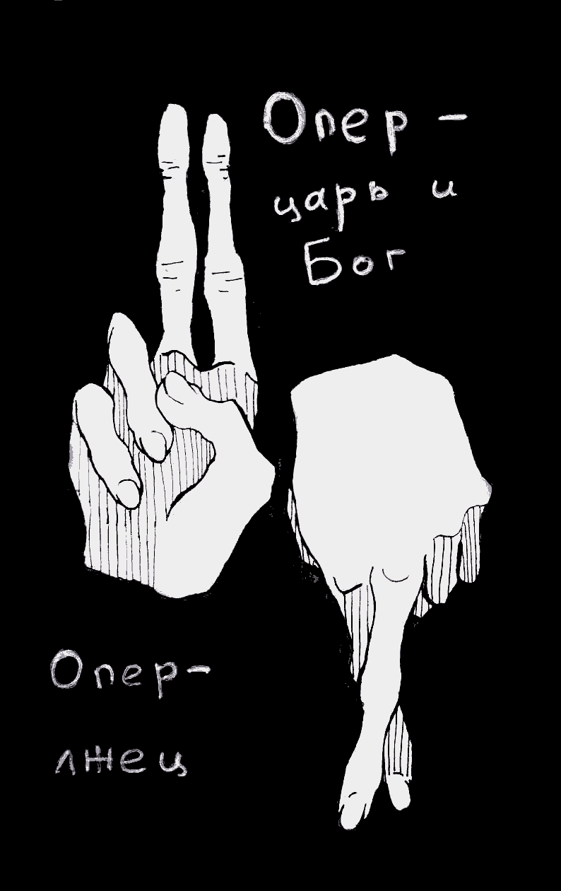

- ~~[Уступ](./1.md)~~
- ~~[Спіс скарачэнняў і жарганізмаў](./2.md)~~
- ~~[ШІЗА](./3.md)~~
# [Опер](./4.md)
- [Рэжым](./5.md)
- [Недатыкальныя ў турэмнай іерархіі](./6.md)
- [Пах](./7.md)
- [Бунт супраць боскай іерархіі ў старажытнагрэцкай міфалогіі](./8.md)
- [Божая кара](./9.md)
- [Бунт у каранціне](./10.md)
- [Маўглі](./11.md)
- [Адляцелыя](./12.md)
- [Чараўнік](./13.md)
- [Жыццё цудоўнае](./14.md)
- [Адкрыты ліст](./15.md)
- [Крайняя мера](./16.md)
- [Вызваленне](./17.md)
- [Заканчэнне](./18.md)

---

Феномен савецкай і, на жаль, постсавецкай рэальнасці. Слова, знаёмае кожнаму, хто пазбаўлены ці некалі быў пазбаўлены волі. Той, хто пазначаны гэтым словам, можа быць усмешлівым маладзёнам з хітрым прыжмурам ці перадпенсійнага ўзросту мужыком з сівізною ў валасах і стомленым поглядам, крыкуном з мітуслівымі вачыма ці ветлівым інтэлігентам, які глядзіць на цябе спакойна і засяроджана, слабавольным гультаём ці фанатычным прафесіяналам — сутнасць яго была й застаецца адна.

Опер.

За часамі імперскай Расіі яны зваліся жандарамі, потым проста супрацоўнікамі «ЧК», «УгРо» і да таго падобных структураў, зараз яны — «оперупаўнаважаныя». Цікава, а як клічуць іх у іншых краінах? Агент? Інспектар паліцыі? Дэтэктыў? І ці цягнецца за імі такі ж крывавы след, які на працягу без малога стагоддзя валачэ за сабою «наш» опер?

Афіцыйныя абавязкі опера, прапісаныя ў прыгожых законах, — збіраць аператыўную інфармацыю, кантраляваць аператыўную абстаноўку і тым самым садзейнічаць выяўленню злачынстваў, ахоўваючы… «правы і законныя інтарэсы грамадзян» \(смех у зале\). Але рэальная дзейнасць гэтых хлапцоў з «халоднай галавой і гарачым сэрцам» \(партрэты аўтара гэтай метафары — садыста Дзяржынскага — да гэтае пары з’яўляюцца абавязковым атрыбутам кожнага опернага кабінета\), канечне ж, палягае далёка за межамі гэткіх сухіх і нецікавых фармулёвак.

Першая сустрэча з апярамі адбылася 4 верасня 2010 года ў кабінетах ІЧУ на вуліцы Акрэсціна, на наступны дзень пасля затрымання. Два супрацоўнікі з учэпістым позіркам і звычкамі гаспадароў жыцця, Сакалоў і Ярошык, на працягу шматгадзінных гутарак спрабавалі давесці мне, што стаць мярзотай і здраднікам нашмат лепей, чым шмат гадоў сядзець у турме. Адзін за адным абкатваліся псіхалагічныя прыёмы: мне распавядалі, што яны і так ужо «ўсё ведаюць» і мне трэба толькі палегчыць сваю долю, сказаўшы «ўсю праўду»; што ўсе сябры мяне ўжо здалі; што мяне выкарыстоўваюць, але яны хочуць мне дапамагчы \(ах, класіка\!\), адзін нават прызнаўся, што ў глыбіні душы падзяляе анархісцкія перакананні. З гэтага пазней пачаў гутаркі і кадэбэшнік — відаць, такі іхні шаблон для працы з палітычнымі. Сканчалі ж яны, як правіла, жывапісаннем жахаў, якія мяне чакаюць у турме і зоне, у чарговы раз прапаноўваючы мне здрадзіць сябрам дзеля ўратавання ўласнае шкуры.

Але што такое дзесяць-пятнаццаць гадзін допытаў у параўнанні з пяццю гадамі, у якія апяры сталі маімі пастаяннымі спадарожнікамі?

Турэмны опер і опер з крымінальнага вышуку і КДБ — па сутнасці, адзін і той жа біялагічны від. Яны ідэнтычныя і ўзаемазамяняльныя, але тут я раскажу вам непасрэдна пра турэмна-зонаўскага опера, паколькі менавіта ў паўсядзённым кантакце з ім можна ўвабраць порамі, адчуць і, выпакутаваўшы, зразумець і на ўсё жыццё запомніць ролю і месца гэтых істотаў у нашым свеце.

За часамі ГУЛАГа зэкі, завербаваныя операм у лагеры, падслухоўвалі чужыя гутаркі альбо самі, заціраючыся ў давер, выклікалі чалавека на шчырасць, вынікам чаго станавіліся новыя крымінальныя справы аб «контррэвалюцыйных змовах», «антысавецкай агітацыі», «падрыхтоўцы да ўцёкаў» і да т. п. У выніку ахвяра оперскіх выкармышаў атрымлівала новы тэрмін у даважку да старога ці расстрэльвалася. І хоць зараз такога ўжо няма, метады і сутнасць оперскай работы засталіся такімі ж. Опер у турме і ў зоне — цар і Бог. Ён вырашае, дзе і з кім будзе жыць зэк, ці будзе ён атрымліваць перадачы, мець спатканні з блізкімі, «катацца» ў ШІЗА, і ўвогуле, будзе яму ў зоне добра ці кепска. Атрадны опер праз завербаваных ім зэкаў \(сук\) тузае за нітачкі грамадскую думку, і яму нічога не значыць зрабіць так, каб няўгоднага загналі ў касту «пакрыўджаных» або проста пачалі сістэматычна гнабіць. У вядомым сэнсе опер значыць нават больш, чым начальнік калоніі, бо начальнік жа — далёка, а опер заўжды тут, побач. У негалоснай іерархіі адміністрацыі «папраўчай» установы — рэжымнага, аператыўнага, медыцынскага аддзелаў, спецаддзела, аддзела папраўпрацэсу — аператыўны аддзел стаіць на самым версе. Опер можа ўсё. «Чтоб жить в радости и счастье, дерни ручку оперчасти», «Запомни сам, скажи другому: путь в оперчасть — дорога к дому», — іранізуе арыштанцкі фальклор.

Опер — гэта карнік для таго, хто, паводле яго пераканання, павінен пакутаваць, і гарант усемагчымых дабротаў ды прывілеяў для сваіх сук. На ПК-15 \(Магілёў\) опер пасадзіў мяне на пяць сутак у ШІЗА за «няправільную» размову з прыезджым губазаўцам. Фармальнай падставай стала тое, што я зайшоў да яго ў кабінет у расшпіленым кліфце, то бок лагернай куртцы \(хоць усе і заўсёды да яго так заходзілі\).

На ПК-17 \(Шклоў\) нейкі час зэкам было дазволена выносіць са спатканняў неабмежаваную колькасць гародніны й садавіны. Потым рэжымны аддзел забараніў — у межах звычайнага і бесперапыннага ўзмацнення жорсткасці рэжыму ў зоне. А опер праз сваіх падручных пусціў па зоне чутку: «Гэта Дзядка бацька паскардзіўся, вось мы й забаранілі». Цяжка ўявіць сабе больш подлы спосаб пасварыць чалавека з калектывам.

У магілёўскай крытай \(турма-4\) я неяк быў паскардзіўся оперу з прыгожым прозвішчам Ліхута, што цэнзар, які працуе пад яго непасрэдным кіраўніцтвам, не прапусціў мне шэсць паштовак са Швейцарыі. «Як так? — кажу. — Там жа нічога такога, звычайныя паштоўкі з віншаваннямі\!» — «Добра, разбяромся», — быў адказ.

На працягу наступнага тыдня цэнзар выняў тры самыя звычайныя лісты ад бацькі і жонкі. Фірменная фішка магілёўскай турмы: пусты канверт, а на ім стэплерам прымацаваны аркушык з надпісам: «Письмо не прошло цензуру». Гэта быў намёк у аператыўным стылі: будзь задаволены тымі лістамі, якія атрымліваеш, а то і гэтага пазбавім.

Опер — гэта езуіт. Майму паплечніку Ігару Аліевічу на допыце ў КДБ апяры, «знатакі» анархізму, даводзілі недарэчнасць анархісцкай тэорыі: «Ты ж займаешся каратэ. Яно іерархічнае\!» — каб хоць неяк расхістаць стомленую свядомасць вязня, падарваць ягоную веру ў сваю рацыю. Аналагічна і мне ў першыя дні пасля затрымання, пабачыўшы, што «лабавая атака» не спрацавала, апяры казалі: «А мы возьмем дый напішам на Індымедыі, што ты ўсіх здаў\!» Ужо памянёны Ліхута праводзіў са мной гутарку, калі мне заставалася, як я думаў, тры з паловам месяцы да вызвалення: «Ну і якія ў цябе планы на волю? …Паедзеш, так? А працаваць дзе?.. Дык там жа ўсё дорага». Жадаў удачы з добрай усмешкай. Крыху пазней я даведаўся, што на момант размовы ён ужо чатыры дні як накіраваў на мяне дакументы ў Следчы камітэт для ўзбуджэння крымінальнай справы паводле артыкула 411, — то бок выдатна ведаючы, што я атрымаю яшчэ год, ён вырашыў пацвяліць мяне марамі аб хуткай волі, каб навіна пра дадатак да тэрміну аказалася для мяне яшчэ больш балючай. Прыклад таго, як чалавек можа вычарпальна ахарактарызаваць сябе адным толькі ўчынкам.

Опер — гэта лгун. Хлусня — яго асноўная і любімая прылада для падпарадкавання іншых і здабыцця «аператыўнай інфармацыі». «Толькі скажаш нам тое й тое — адразу цябе адпускаем. Даю слова афіцэра\!» — часта кажуць апяры падазраваным на допытах. Колькі наіўных і даверлівых людзей купіліся на гэта, агаварыўшы сябе, а часам, самі таго не жадаючы, і іншых\! І вось чалавек атрымлівае свае пяць, дзесяць, колькі заўгодна гадоў — але не дзякуючы таму, што следства сабрала пераканаўчыя доказы ягонае віны, а дзякуючы сваёй даверлівасці. Опер дасць любое слова, паклянецца, паабяцае ўсё, што хочаш, назаве цябе сябрам, скажа, што падзяляе твае ідэі, паспачувае, аблае ўладу — абы атрымаць ад цябе тыя паказанні, што патрэбны яму, незалежна ад таго, праўдзівыя яны ці не. А атрымаўшы, загадае адвесці цябе назад у камеру. Ты цяпер — адпрацаваны матэрыял, а твой душэўны боль ад падманутага даверу нікога не цікавіць, галоўнае, што справа клеіцца. Колькі дзякуючы такім падманам зляпана — на роўным месцы\! — крымінальных страваў, колькі «вісякоў» даведзена да суда\! А купляюцца ж на такое, што відавочна, ніяк не закаранелыя злачынцы, а легкаверныя і больш-менш прыстойныя людзі, якія не мелі раней праблемаў з законам і не падазраюць, што ягоныя служкі могуць гэтак цынічна лгаць.

Аднаго опера на ПК-15 \(Магілёў\), які вечна запэўніваў, што ён «не мае дачынення» да таго, што мяне ў зоне прасуюць, я аднойчы наўпрост папракнуў: «Гэта няпраўда, …евіч. Вы мяне пастаянна падманваеце». На што той, усміхнуўшыся, адказаў: «Падманваць — гэта мая прафесія».

Пры сваёй бесчалавечнай натуры опер не можа не быць яшчэ і расістам.

Адыёзны губазавец Літвінскі, гутарачы са мной на ПК-15 \(Магілёў\), пусціўся ў крытыку скінхэдаў сказаўшы спачатку, што ў яго «дзед ваяваў», а потым дадаў: «Я неграў таксама не люблю. Але я ж іх не б’ю\!» Опер Шамёнаў з ПК-17 \(Шклоў\) доўга распавядаў мне пра сваё бачанне тэракту Андэрса Брэйвіка: «Вось да чаго мультыкультуралізм даводзіць\! — і ганарліва дадаваў: — А ў Беларусі я магу хадзіць па вуліцы і быць упэўненым, што мяне хачы не адп\*здзяць\!» Па чутках, гэты супрацоўнік быў пазней пераведзены ў КДБ.

Опер — кат чалавечых душаў. На ПК-15 \(Магілёў\) адзін хлапчук скардзіўся мне, што опер схіляе яго да супрацоўніцтва, патрабуючы дакладаць, пра што гутараць зэкі, дзе ў каго «запрет» ляжыць і да т. п. Іначай абяцаў «жыцця не даць». І не дарма опер пачаў ціснуць менавіта на яго: таму хлопцу скрай патрэбна было УДВ — на волі застаўся маленькі сын, а жонка… сядзела на Валадарцы. Ён жа з усіх сілаў пазбягаў парушэнняў, старанна ўкалваў на промцы і цэлымі днямі перажываў за сваіх родных. Опер, безумоўна, усё гэта ведаў і таму спыніў выбар менавіта на ім. Я бачыў маральныя пакуты і мітусенні таго зэка: паміж сям’ёй і сумленнем, дабрабытам родных і магчымымі наступствамі ператварэння ў суку. Ён спрабаваў выкруціцца, распавядаў оперу нейкія малазначныя і агульнавядомыя рэчы. Але гэты варыянт не пракаціў. Неўзабаве мяне вывезлі з той зоны, і я так і не даведаўся, чым скончылася гэтая маленькая драма. Спадзяюся, той хлопец усё ж зразумеў, што здраднікам нельга быць напалову.

Баяцца патрэбна не тых, хто можа забіць цела, а з душой нічога не можа зрабіць, але *тых, хто забівае душу,* — разумееш з досведам. У сістэме МУС ёсць як забойцы целаў, так і забойцы душаў. Усе яны — каты з растрэльных камандаў і «оперупаўнаважаныя» — атрымліваюць грошы кожны за сваё забойства.

Так, опер пакідае жывым цела, арганізм, што жыве на інстынктах ды базавых патрэбах, але гэта ўжо і не асоба ў поўным сэнсе гэтага слова. Нюанс у тым, што калі ў характары чалавека, які трапіў у зону, ад пачатку ёсць хоць найменшая гнільца, зерне подласці і несумленнасці, то пад пільным наглядам опера і ягонымі намаганнямі яно абавязкова разрасцецца і высмакча з чалавека ўсё добрае, што ў ім ёсць. Гэтаму садзейнічае сама атмасфера зоны, яе маральны клімат з імператывам: «плюнь в ближнего, пня нижнего». А опер, без сумневаў, паскорыць рост гэтых усходаў, падбіраючы ўгнаенне кожнаму індывідуальна, у залежнасці ад асаблівасцяў характару: камусьці гэткім стане лішняя свіданка з жонкаю, камусьці — страх за ўласную бяспеку, камусьці — аўтарытэт, камусьці — УДВ, камусьці дастаткова пакунка гарбаты і пачка цыгарэтаў. Але вынік заўжды адзін: чалавек выходзіць на свабоду наскрозь прагнілым, беспрынцыпным, ні ў што не верачы. У ягоным светаўспрыманні сцёртыя межы паміж дабром і злом. Усё гэта — вынік працы «аператыўнага аддзела папраўчай установы».

Часам я думаю: а якія яны ў звычайным жыцці? Не ўсе ж яны б’юць сваіх жонак, дзяцей, ашукваюць сяброў… Напэўна, і яны здольныя любіць блізкіх, клапаціцца пра іх, быць добрымі для сваіх жонак і мацярок, ад душы смяяцца, сябраваць, карацей — адчуваць чалавечыя пачуцці. Падчас святаў, застолляў яны, напэўна, цалкам шчыра вяселяцца. Абдымаючы сяброў і калег, спяваюць любімыя песні з келіхам у руцэ: «Да\! И если завтра будет круче, чем вчера, “Прорвемся\!” — ответят опера».

Вядома, прарвяцеся. Бадзёрым маршавым крокам.

У пекла.

*Сакавік 2015*

---

- ~~[Уступ](./1.md)~~
- ~~[Спіс скарачэнняў і жарганізмаў](./2.md)~~
- ~~[ШІЗА](./3.md)~~
- ~~[Опер](./4.md)~~
# [Рэжым](./5.md)
- [Недатыкальныя ў турэмнай іерархіі](./6.md)
- [Пах](./7.md)
- [Бунт супраць боскай іерархіі ў старажытнагрэцкай міфалогіі](./8.md)
- [Божая кара](./9.md)
- [Бунт у каранціне](./10.md)
- [Маўглі](./11.md)
- [Адляцелыя](./12.md)
- [Чараўнік](./13.md)
- [Жыццё цудоўнае](./14.md)
- [Адкрыты ліст](./15.md)
- [Крайняя мера](./16.md)
- [Вызваленне](./17.md)
- [Заканчэнне](./18.md)
