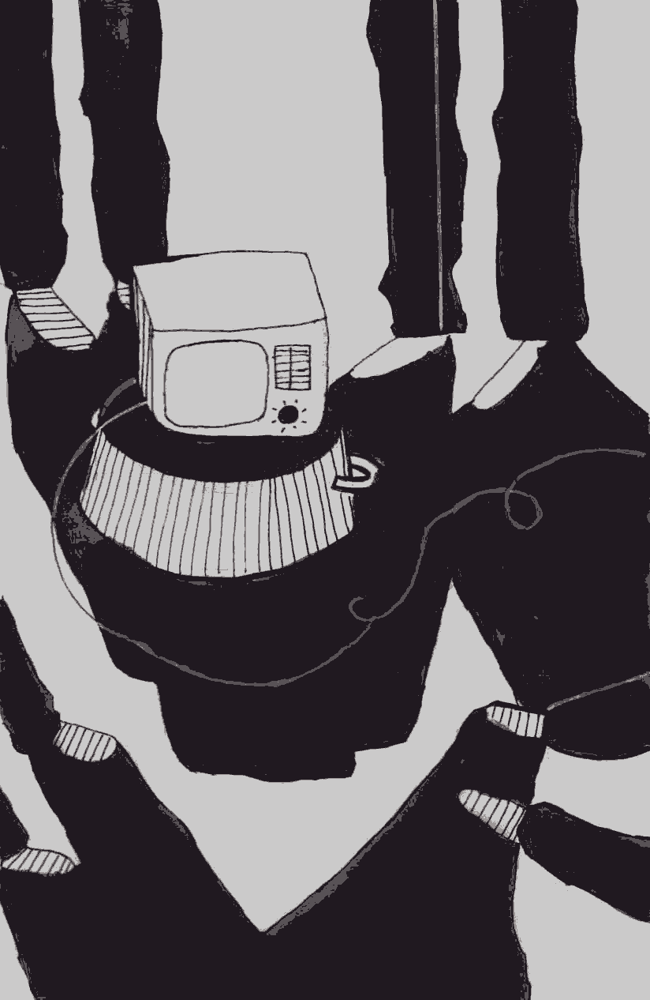

- ~~[Уступ](./1.md)~~
- ~~[Спіс скарачэнняў і жарганізмаў](./2.md)~~
- ~~[ШІЗА](./3.md)~~
- ~~[Опер](./4.md)~~
# [Рэжым](./5.md)
- [Недатыкальныя ў турэмнай іерархіі](./6.md)
- [Пах](./7.md)
- [Бунт супраць боскай іерархіі ў старажытнагрэцкай міфалогіі](./8.md)
- [Божая кара](./9.md)
- [Бунт у каранціне](./10.md)
- [Маўглі](./11.md)
- [Адляцелыя](./12.md)
- [Чараўнік](./13.md)
- [Жыццё цудоўнае](./14.md)
- [Адкрыты ліст](./15.md)
- [Крайняя мера](./16.md)
- [Вызваленне](./17.md)
- [Заканчэнне](./18.md)

---

Ёсць з’явы жорсткія. Ёсць з’явы бессэнсоўныя. Але любыя з’явы і рэчы падаюцца больш жорсткімі, калі яны бессэнсоўныя. Менавіта да такой катэгорыі паняццяў і адносіцца турэмны рэжым — Малох, у ахвяру якому прыносяцца псіхалагічны і фізічны камфорт вязняў, іх душэўны спакой і самапавага.

Чалавек, які ўпершыню трапляе ў турму, першы час знаходзіцца ў стане разгубленасці, збянтэжанасці. Сваім розумам нармальнай, вольнай асобы ён не можа ўсвядоміць тых рэчаў, якіх ад яго патрабуюць турэмшчыкі, спасылаючыся на загадкавае «так положено».

Усё пачынаецца са шмону. Здзіўленне пачынае пераследаваць вязня яшчэ ў ІЧУ, калі на шмоне перад пасяленнем у камеру ў яго забіраюць паясны рэмень і шнуркі ад абутку. Ён пытаецца: «А чаму мне іх нельга?» «Не положено\!» — рыкае ў адказ мент. Пазней ад дасведчаных сукамернікаў ён дазнаецца, што ўвесь час падцягваць штаны і хадзіць у красоўках, як у смешных разлапістых шлёпанцах, будзе таму, што на рэмені ці шнурках можна павесіцца. Але самае цікавае яго чакае ў СІЗА, калі родныя пачынаюць насіць яму перадачы. Цыгарэты? Павінны быць выняты з пачка і пакладзены ў празрысты пакет. Гарбата? Таксама толькі перасыпаная ў празрысты пакет. Цукеркі? З кожнай павінна быць знята абгортка \(уявіце, колькі трэба зрабіць, каб перадаць трыццацікілаграмовую перадачку\). Газіроўку? Нельга\! Тварог, малако, сыркі, сметанковае масла — нельга\! Мёд? Нельга\! Чаму? «Не положено\!» Нешта ў шклянай бутэльцы? Барані Божа\! «Они же перережут друг друга\!» Кансервы ў бляшаных банках — нельга, «заточку сделают».

І калі раптам родныя пойдуць па рознага роду начальніках ды пачнуць скардзіцца, то ім пакажуць доўгі спіс рознага кшталту пастаноў і загадаў, пакажуць ПУР \(Правілы ўнутранага распарадку\) і патрабаванні санстанцыі, з якіх яны даведаюцца, што малочныя прадукты нельга, бо баяцца эпідэмій, цыгарэты трэба перакладваць, бо «раптам вы там нешта схавалі», па той жа прычыне трэба здымаць абгортку з кожнай цукеркі, па той жа прычыне кожны яблык, апельсін, любая садавіна ці агародніна, што вы перададзіце вязню, будзе праткнутая шылам \(і не важна, што «пражыве» яна пасля гэтага толькі пару дзён\), любая вакуумная ўпакоўка — прадзіраўленая, любая шакаладка — паламаная ледзь не да крошкі.

Але што СІЗА\! У калоніі, куды арыштант едзе пасля прысуду, яго чакаюць новыя адкрыцці і новыя здзіўленні. Па прыездзе — абавязковы шмон. Усё «лішняе» адбіраюць і кладуць на склад, дзе яно будзе ляжаць да таго моманту, як чалавек вызваліцца. Гэта вельмі драматычны момант для любога вязня: усё нажытае за год, а то і болей, усё нагружанае сукамернікамі, якія збіралі яго на этап, «ляціць» на склад альбо ў сметніцу. Калі гэта ежа — яшчэ паўбяды. Але найбольш крыўдна, калі гэта адзенне ці абутак, набытыя роднымі. У СІЗА, ІЧУ і некаторых зонах дазволены абутак толькі без металічных супінатараў — бо з іх, зноў жа, можна зрабіць заточку. Для таго каб даведацца, ці ёсць у абутку супінатары, вертухаі неміласэрна згінаюць красовак ці бот, ламаюць падэшву і прасвечваюць яе металадэтэктарам. Калі гэта твой адзіны абутак, выдадуць зменны \(так званыя «каранцінкі»\), калі ж ён куплены роднымі і яны намагаюцца яго табе перадаць, яго папросту вернуць назад — грошы патрачаны дарма.

ПУР ПУ \(Правілы ўнутранага распарадку папраўчых устаноў\) пабудаваны вельмі хітрым чынам. У іх замест таго, каб пералічыць спіс рэчаў, якія арыштанту мець забаронена, пералічваюць рэчы, якія дазволена мець арыштанту. Адпаведна ўсё астатняе — забаронена, і за валоданне рэчамі, якіх няма ў спісе, можна трапіць у ШІЗА.

Сказаць, што спіс дазволенага недастатковы для нармальнага, годнага існавання, асабліва для тых, у каго доўгія тэрміны, — гэта нічога не сказаць. Узяць хаця б такую дробязь: кожны асуджаны павінен перамяшчацца па тэрыторыі лагера ў форменным адзенні \(у робе, афіцыйна: у «костюме хэбэ»\). Гэта ўстаноўленая «форма адзення арыштанта». Але ж робу трэба час ад часу мыць. І калі памыў яе, яна павінна высахнуць. У чым тады хадзіць у сталовую, на працу ды і проста па лакальным участку каля барака? Застаецца спартыўны касцюм. Але вось калізія: надзенеш спартыўны касцюм — «парушэнне формы адзення». Атрымаеш акт аб парушэнні і можаш загрымець у ШІЗА. І нікога не цікавіць, што твая роба проста памытая і вісіць мокрая на вяроўцы. Але і не мыць нельга. Калі цябе пабачаць у бруднай робе, то і за гэта могуць скласці дакумент аб парушэнні, бо «осужденный должен иметь опрятный внешний вид». Вось і круцяцца зэкі, як могуць, каб і чыстымі хадзіць, і ў ШІЗА не трапіць: хто «пятляе» ў сталовую ў сярэдзіне шэрага, каб не трапіцца на вочы кантралёрам, хто просіць робу панасіць у кагосьці з суатраднікаў. Дарэчы, мець дзве робы таксама забаронена, знойдуць на шмоне — забяруць, ды яшчэ акт могуць скласці \(зноў маячыць перспектыва ШІЗА\). Гэтай праблеме — у чым хадзіць, калі памыў адзенне, — ужо шмат гадоў, але ўсім — ад начальнікаў атрадаў да кіраўніцтва ДВП — пляваць на нязручнасці жыцця нейкіх там зэкаў. Прасцей дзесяць, дваццаць, трыццаць чалавек «спецконтингента» адпраўляць штогод у ШІЗА, чым адзін раз змяніць пару сказаў у ПУР.

Эпапея з адзеннем на гэтым не заканчваецца. За некалькі гадоў да майго вызвалення літаральна ва ўсіх зонах кіраўніцтва развярнула цэлыя «кампаніі» барацьбы: з курткамі на замках-маланках, са світэрамі і масцеркамі пад «костюмами хэбэ». Барацьба з маланкамі вялася проста так, каб уніфікаваць адзенне вязняў. Да пары да часу ў лагеры людзі хадзілі ў чорных куртках на замках-маланках, перададзеных роднымі з волі, пакуль нейкі чын з ДВП не прыехаў з інспекцыяй і не запытаўся: «А чего это у вас осужденные ходят не по форме?» Бо «па форме» — гэта значыць у нязграбнай целагрэйцы \(якая не грэе ні кроплі\) на гнілой ваце, у якой адвальваюцца гузікі. І тут жа пачаўся шал, спачатку на адной зоне, потым на іншых: нармальныя «вальнячыя» курткі пачалі «адмятаць», замест іх выдаваць целагрэйкі, тых, хто спрабаваў узбунтоўвацца, саджалі ў ШІЗА. Барацьба ж з галоўнымі ворагамі «исправительного процесса» — світэрамі ды масцеркамі выглядала так. Восень \(ці вясна\), на вуліцы холад. Атрад зэкаў выходзіць на працу на прамзону і стаіць на КПП у чаканні шмону. Кожнага шманаюць па чарзе і прымушаюць расшпіліць «костюм хэбэ». Калі раптам пад ім масцерка ці світэр — ідзі ў атрад, здымай. Пачынаеш абурацца — у ШІЗА. І не важна, што на вуліцы плюс дзесяць, а пад тваёй «курткай хэбэ» толькі лёгкая цішотка. І не важна, што пасля такой праверкі зэкі на прамзоне будуць увесь дзень трэсціся ад холаду і паўатрада пабяжыць у санчасць з прастудай ці грыпам. Затое любое начальства, наведаўшы зону, будзе задаволена: «Форма одежды соблюдена\!»

Такія кампаніі на кожнай зоне распачынаюцца часта, хаатычна і непрадказальна. Пстрыкне нешта ў галаве Дарошкі\[3\] — па зонах ідзе цыркуляр, і грамадзяне начальнікі гатовыя дэманстраваць службовы імпэт. Сёння — маланкі на куртках, заўтра — боты «неуставного образца», паслязаўтра — сталёвыя лыжкі \(ва ўсіх павінны быць алюмініевыя\!\), затым — кампанія па барацьбе з «выносом хлеба из столовой» \(гэта калі выдаюць дысцыплінарныя спагнанні за тое, што сваю пайку хлеба панёс са сталовай у атрад\) і гэтак далей… Зэкі вызначаюць гэтыя кампаніі па доўгіх чэргах на КПП, дзе па шэрагах чуецца раздражнёны шэпт: «Опять?.. Что, б\*\*\*ь, в этот раз?.. Бирки на трусах проверяют, что ли? Сука, за\*\*\*\*и…»

На ПК-17 \(Шклоў\) намеснікам начальніка калоніі быў, а можа, і сёння ёсць, калі не пайшоў на павышэнне, вельмі старанны служака, Павел Мікалаевіч Егулеўскі, па мянушцы Мерседэс. У час адной з такіх кампаній \(тады змагаліся са штанамі няправільнага фасону\) ён стаяў з канцылярскім нажом і проста на КПП уздоўж рэзаў штаніны зэкам. І аднаму з іх такім чынам разрэзаў нагу да крыві. Хлопец аказаўся не з самых «прыбітых», пайшоў на прынцып і пачаў адстойваць свае правы, а яго родныя скардзіліся ў розныя інстанцыі. Але ніякага выніку гэта так і не прынесла, Мерсу ўсё сышло з рук.

Далей — болей. Тэндэнцыя да ўзмацнення рэжыму прабіраецца ў кожную шчыліну паўсядзённага жыцця арыштанта. У кожнага зэка ёсць прыложкавая тумбачка. Думаеце, там можна захоўваць тыя рэчы з дазволеных, якія табе хочацца? А як жа\! Некалькі гадоў таму ў кожным спальным памяшканні павесілі спіс таго, што можна мець кожнаму зэку ў тумбачцы. Спіс вельмі сціслы: ручка \(адна\), сшытак \(адзін\), дзве кніжкі, канверт \(адзін ці два, ужо не памятаю\), адзін пачак цыгарэт і адна ўпакоўка гарбаты.

Усё\! Прадуктаў харчавання ў гэтым спісе няма. Вы запытаецеся: а дзе ж захоўваць усе астатнія рэчы? Для гэтага, згодна з мудрымі пастановамі мусароў ДВП, у кожным атрадзе існуе «комната хранения личных вещей», альбо па-зэкаўску «кешарка», «бобовня», «каптерка». Загадвае гэтым пакоем капцёр — зэк, у якога маюцца ключы ад яго. Улада капцёра і прывілеяванасць навідавоку. Сябраваць з ім — значыць мець сапраўдны блат у атрадзе. «Але што з таго, што там ляжаць рэчы? Што можа быць прасцей, — скажаце вы, — зайшоў у любы момант і ўзяў тое, што табе патрэбна, — няма чаго спальнае памяшканне захламляць». Усё так, але адкрываецца гэты пакой… двойчы ў дзень, на дваццаць-трыццаць хвілін. І вы, вядома, не адзіны з сотні зэкаў атраду, хто хоча зайсці туды і нешта ўзяць — новую пару шкарпэтак, шматок сала, кніжку ці пачак цыгарэт. «В комнату хранения личных вещей заходить по одному человеку\!» — вісіць аб’ява на дзвярах. Нарэшце вы падлавілі момант, калі капцёр зайшоў у капцёрку, адстаялі сваю чаргу і прарваліся ў запаветны пакой, каб адкрыць свой «кешер» і дастаць адтуль шакаладку, каб папіць гарбаты з прыяцелем, ці кніжку, каб правесці вечар у адзіноце. Схапіў рэч, закрыў сумку і пайшоў? А як жа\! У кожнай сумцы ляжыць вопіс асабістых рэчаў, вамі ж складзены пры прыездзе ў атрад. У ім запісана ўсё, ад стрыжняў для ручак да ніжняй бялізны, карамелек, часопісаў ці нейкага іншага няхітрага скарбу, нажытага ў лагеры. Калі ўзяў нешта — выкраслі са спіса, калі паклаў — абавязкова ўпішы. Галоўнае — не забыцца гэта зрабіць, бо кожныя колькі месяцаў мае быць «режимное мероприятие», а менавіта «смотр внешнего вида с выносом вещей». Атрад выстройваецца на лакальным участку, кожны са сваімі сумкамі, і начальнік атрада правярае, у каго вопіс не супадае са зместам. Калі што не так, складаецца акт аб парушэнні. Прыклад, які стаў у свой час хрэстаматыйным: Міколу Статкевіча пасадзілі ў ШІЗА за тое, што колькасць ягоных насовак у вопісе не адпавядала колькасці іх у кешары.

Нярэдка, як у любой бюракратычнай і іерархічнай сістэме, патрабаванні розных начальнікаў уваходзяць у супярэчнасць адно з адным. Гэта добра ілюструе выпадак з ПК-4 \(Горкі\). У кожнай камеры ПКТ ці ШІЗА стаіць радыёкропка \(яна ўключаецца ці выключаецца з пульта кантралёра\), але без рэгулятара гучнасці: будзеш слухаць радыё на той гучнасці, на якой уключыў кантралёр. Але раптам ва ўстанову прыехала чарговая праверка з ДВП. Вялікі начальнік паглядзеў на радыёкропкі ў камерах і запытаўся: «А чаго яны ў вас без рэгулятараў? Непарадак\!» І адразу пасля яго ад’езду казлы і гаспадарчая абслуга пад кіраўніцтвам адміністрацыі наладзілі літаральна ў кожнай камеры рэгулятары. Зэкі сядзелі задаволеныя\! Але прайшоў час, прыехаў ужо іншы начальнік з таго ж ДВП. Паглядзеў наверх і самлеў: «Вы что это им, регуляторы громкости поставили? С ума сошли, что ли?» У яго разуменні гэта быў проста недапушчальны камфорт, вакханалія геданізму і разбэшчанасці. Праз лічаныя гадзіны абслуга \(тыя ж зэкі, вядома, што і ставілі гэтыя рэгулятары\) ужо выдзіралі іх з кожнай амаль з дваццаці камер ШІЗА/ПКТ.

Але наіўна было б думаць, што рэжым закранае толькі матэрыяльны аспект, тое, што можна ці нельга мець вязням. Як я ўжо казаў, ягоны сэнс у тым, каб пранікаць ва ўсе сферы жыцця. Статутам рэгламентаваныя пад’ём і адбой. Замарудзіўся на колькі хвілін — атрымаў акт і, магчыма, ШІЗА. І калі ў лагеры гэта яшчэ можна неяк рацыянальна растлумачыць \(атраду трэба ісці ў сталовую, на працу\), то ў СІЗА строгая наяўнасць пад’ёму і адбою не паддаецца тлумачэнню, асабліва калі камеры перапоўненыя і палова насельніцтва не мае магчымасці спаць ноччу і спіць удзень. Не тое што спаць, нават ляжаць на ложках удзень таксама забаронена. І мозг чалавека, які толькі трапіў у турму, адмаўляецца разумець: чаму? Каму будзе горш ад таго, што арыштант у СІЗА \(віна якога нават не даказаная, ён яшчэ абвінавачаны, а не асуджаны\), прыляжа на ложак удзень, паспіць? Ды і што яшчэ рабіць у камеры? Але не, толькі паспрабуй, пільны кантралёр адразу грукне нагой у дзверы: «Не спать\!\!\!» У Жодінскім СІЗА мянты ідуць яшчэ далей — на ложку нельга сядзець з нагамі \(\!\). Але сядзець з нагамі на падлозе нязручна — у ложкаў жалезныя ражкі, якія ўпіваюцца ў ногі. Уся астатняя «мэбля», калі яе можна так назваць, відавочна, прызначаная для каго заўгодна, але не для людзей. Абабітая жалезам, цвёрдая, рассохлая, ці занадта высокая, ці занадта нізкая. Але прызвычаішся, нічога не зробіш…

У камеры пры кожным заходзе адміністрацыі зэк павінен зрабіць даклад. Выглядае ён так: «Гражданин начальник, в камере номер такой-то столько-то осужденных. Санитарное состояние в норме. Дежурный по камере такой-то. Жалобы и заявления отсутствуют» \(у розных установах тэкст нязначна адрозніваецца\). Асабліва смешна дадзены даклад гучыць у адзіночнай камеры, калі ледзь не гадамі сядзіш адзін і два разы надзень па праверцы кажаш: «Дежурный по камере осужденный Дедок…» Нібы ўчора дзяжурыў нейкі іншы асуджаны…

Пры позірку збоку ўзятыя асобна ўсе гэтыя правілы і патрабаванні могуць падацца нязначнымі. Ну, сапраўды, падумаеш, праблема: зашпіліць гузік, калі праходзіш міма вертухая, пацярпець нязручнасці з мыццём робы, зрабіць даклад ці прыбраць лішняе з тумбачкі, тым больш, што гэта ж турма, а не санаторый\! Але гэта толькі на першы погляд. Жыццё арыштанта складваецца вось з такіх дробязей. Іх сотні. І чым далей, тым больш яно рэгламентуецца рэжымам, што ўскладняе і без таго не вельмі салодкае жыццё арыштанта. І вось ужо не застаецца месца, дзе ты мог бы дзейнічаць спантанна, нават у тым, што датычыцца засцілання ложка ці баўлення вольнага часу, якога і так няшмат. Кожную хвіліну табе трэба азірацца і думаць: «А ці правільна я зрабіў? Ці не пакараюць мяне за гэта?» Вядома, на многія адхіленні ад рэжыму вертухаі не звяртаюць увагі да пары да часу, пакуль не прыйдзе разнарадка аб тым, што ў ШІЗА мала народу, альбо пакуль пэўны зэк не пачне адстойваць свае правы. Тады табе хутка прыгадаюць і тое, што ў цябе лішняя ручка ў тумбачцы, і што няголены, і што павуцінне ў камеры вісіць. Калі ж ты палітычны зняволены, то гэта табе пачнуць прыгадваць з самага пачатку. Фармаванне рэжымных патрабаванняў такім чынам, як яны ёсць зараз, значна палягчае задачу адпраўкі любога зэка ў ШІЗА і ўвогуле ўсебаковага прэсінгу. Не трэба нічога выдумляць, фальсіфікаваць, проста пачакай пару гадзін — зэк сам нешта парушыць, бо жыць цалкам па правілах немагчыма. Логіка рэжымнікаў прымушае зэкаў успрымаць любы мінімальны камфорт і любую магчымасць рэалізаваць свае патрэбы як прывілей, для захавання якога трэба паводзіць сябе цішэй вады, ніжэй травы.

З іншага боку, рэжым існуе для таго, каб прынізіць арыштантаў, прымусіць іх адчуць сябе бяспраўнымі і залежнымі ад адміністрацыі нават у самых элементарных патрэбах. Як вы думаеце, чаму ў СІЗА КДБ \(«амерыканцы»\) у палове камер няма санвузлоў? Няўжо няма сродкаў ці магчымасцей іх паставіць, і ў дваццаць першым стагоддзі ў камерах стаіць «параша», а «по-большому» выводзяць два разы на дзень? Адказ просты: арыштант павінен адчуць, што нават спраўленне ягоных натуральных патрэб цалкам залежыць ад адміністрацыі, таму падпарадкавацца ёй у астатнім — найлепшы выбар з магчымых.

І так ва ўсім. Ніколі не забуду, як стрыглі ногці ў камеры Валадаркі. Каб зрабіць гэту няхітрую гігіенічную працэдуру, якая на волі не зойме вашай увагі ні на грам, там трэба было правярнуць цэлую аперацыю. У нас у камеры былі кусачкі для ногцяў \(вядома, забаронены прадмет\). Спачатку іх трэба было незаўважна для вертухая, які мог у любы момант паглядзець у вочка, дастаць з хованкі, потым пранесці ў прыбіральню \(«мёртвую зону», што не праглядвалася з вочка\), там — адкрыць краны і толькі потым пачынаць стрыгчы ногці. Краны адкрываліся для таго, каб шум вады замінаў вертухаю пачуць характэрныя гукі «пстрык\! пстрык\!» і здагадацца, што ў камеры — забароненая рэч. Потым кусачкі трэба было такім жа чынам пакласці на месца.

Паказальна, што на афіцыйным узроўні кожную забарону мянты намагаюцца тлумачыць нейкімі рацыянальнымі прычынамі: рамяні нельга, каб не павесіліся; тварог нельга, каб не патравіліся; адзенне з маланкамі нельга, бо ўсе павінны выглядаць аднолькава; харчаванне ў тумбачках нельга, бо «антысанітарыя» і гэтак далей. Але не кожную забарону падвядзеш пад рацыянальную прычыну, як ні біся. Навошта дакладваць: «В камере один осужденный, дежурный по камере осужденный такой-то \(он же\)»? Чаму не дазволіць зэкам сядзець з нагамі на ложку? Хіба гэта ставіць кагосьці ў небяспеку? Адказы на гэтыя пытанні можна знайсці. На дапамогу прыходзяць унутраныя дакументы ПУ, змест якіх мне давялося пачуць асабіста. У час знаходжання ў ПКТ на ПК-17 \(Шклоў\), нам, зноў жа, «па рэжыме», уключалі вытрымкі з Правілаў унутранага распарадку і розных іншых нарматыўных прававых актаў. Сёе-тое з гэтага я запісаў даслоўна. На жаль, не памятаю дакладна назву гэтай пастановы. Вось сядзіш сабе ў адзіночцы, а металічны голас праз дынамік вяшчае:

*«Режим исправительных учреждений \[…\] Исправительная функция режима состоит в отношении осужденного в установлении запретов и ограничений. Цель запретов и ограничений состоит в причинении осужденному **страданий и переживаний**, которые призваны заставить его задуматься о своем прошлом поведении».*

Калі я першы раз пачуў гэта — не паверыў сваім вушам. А як жа Крымінальны кодэкс, у якім чорным па белым напісана, што «наказание и иные меры уголовной ответственности не имеют своей целью причинение физических страданий или унижение человеческого достоинства»? Нарэшце, ва «ўнутраных» прававых актах Сістэма сама зрывае маскі і дэманструе, што ёсць сапраўднай мэтай рэжыму. І ў зэка, які з першых дзён зняволення задаецца пытаннем: навошта ўсе гэтыя правілы, якія ніяк нельга растлумачыць, апраўдаць ці рацыяналізаваць, усё становіцца на свае месцы. Яны для таго, каб ты пакутаваў. А ўся афіцыёзная балбатня вертухаяў пра «антисанитарию», «меры безопасности» і гэтак далей — не больш чым пыл у вочы, які пускаецца для таго, каб надаць хоць якую бачнасць легітымнасці і гуманнасці людажэрнай і бесчалавечнай сістэме, мэта якой адна: зламаць тваю волю праз прычыненне пакут.

Цікава, што рэжым і ягоныя патрабаванні робяць сапраўднымі ідыётамі і без таго не надта разумных супрацоўнікаў ПУ. Аднойчы ў жодзінскай турме нам удалося-такі зацягнуць тэлевізар у камеру. Але ў бетоннай каробцы ён вельмі дрэнна лавіў сігнал, а перацягнуць яго бліжэй да акна было немагчыма: шнур быў кароткі, а падаўжальнік, вядома, «не положено». Так і застаўся ён у нас пасярод камеры. Але, калі ён стаяў на падлозе, яго не было бачна з іншых бакоў камеры, трэба было яго неяк прыўзняць. Выбар у нас быў невялікі, і мы паставілі яго на перагорнуты тазік. Праз некаторы час у камеру заходзяць рэжымнікі са шмонам. У галоўнага нахабны погляд, круціць галавой, шукае, да чаго прычапіцца. Натрэніраваны погляд заўважае адхіленне ад нормы — тэлевізар на перагорнутым тазіку:

— А что это у вас телевизор там стоит, на тазике?

— Не видно же его, когда на полу, а до стола шнур не дотягивается.

Выраз твара мянта робіцца незадаволеным. Адступленне ад шаблону, нерэгламентаваная сітуацыя, трэба тэрмінова рэагаваць:

— Так это ведь тоже\!.. — на секунду твар адлюстроўвае напружаную работу думкі, пошук рэлевантнай і праўдападобнай прыдзіркі. — *Износ тазика идет\!*

Калі зачыніліся дзверы, мы рагаталі з гэтага мянта яшчэ паўгадзіны — ён зрабіў наш дзень. Падсумавалі: вось гэта лёс, дажыць да трыццаці з капейкамі, каб шастаць па камерах і расказваць зэкам пра «износ тазика». Што ж, такім можна толькі паспачуваць. Яны стваралі гэты рэжым для нас, але зараз яны, ягоныя носьбіты, яшчэ менш вольныя, чым многія зэкі ў турме.

*Ліпень 2016*

---

- ~~[Уступ](./1.md)~~
- ~~[Спіс скарачэнняў і жарганізмаў](./2.md)~~
- ~~[ШІЗА](./3.md)~~
- ~~[Опер](./4.md)~~
- ~~[Рэжым](./5.md)~~
# [Недатыкальныя ў турэмнай іерархіі](./6.md)
- [Пах](./7.md)
- [Бунт супраць боскай іерархіі ў старажытнагрэцкай міфалогіі](./8.md)
- [Божая кара](./9.md)
- [Бунт у каранціне](./10.md)
- [Маўглі](./11.md)
- [Адляцелыя](./12.md)
- [Чараўнік](./13.md)
- [Жыццё цудоўнае](./14.md)
- [Адкрыты ліст](./15.md)
- [Крайняя мера](./16.md)
- [Вызваленне](./17.md)
- [Заканчэнне](./18.md)

