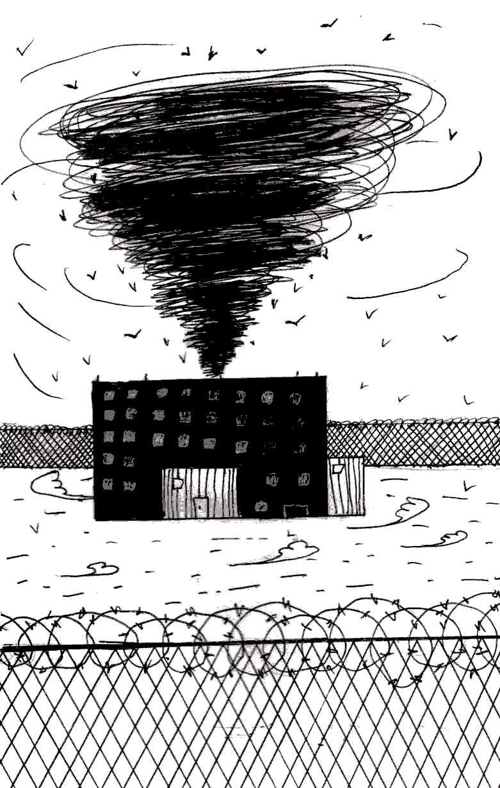

- ~~[Уступ](./1.md)~~
- ~~[Спіс скарачэнняў і жарганізмаў](./2.md)~~
- ~~[ШІЗА](./3.md)~~
- ~~[Опер](./4.md)~~
- ~~[Рэжым](./5.md)~~
- ~~[Недатыкальныя ў турэмнай іерархіі](./6.md)~~
# [Пах](./7.md)
- [Бунт супраць боскай іерархіі ў старажытнагрэцкай міфалогіі](./8.md)
- [Божая кара](./9.md)
- [Бунт у каранціне](./10.md)
- [Маўглі](./11.md)
- [Адляцелыя](./12.md)
- [Чараўнік](./13.md)
- [Жыццё цудоўнае](./14.md)
- [Адкрыты ліст](./15.md)
- [Крайняя мера](./16.md)
- [Вызваленне](./17.md)
- [Заканчэнне](./18.md)

---

Кожная турма пахне пасвойму.

Вывальваючыся з цеснага аўтазака са сваімі клункамі-кешарамі, першымі бачыш дапытлівыя пысы вертухаяў. На падсвядомым жа ўзроўні поры ўжо пачынаюць убіраць пах той турмы, якая стане на гэтыя месяцы ці гады тваім домам.

Валадарка набрыняла трывогай. Ад «кабінетаў» да «падлодкі», ад «зборкі» да «кічы», ад прагулачных дворыкаў да санчасткі, ад новага корпуса да «чырвонага корпуса» — яе бетонныя сцены, месцамі аздобленыя кафелем, дыхаюць трывожным чаканнем, непакоем за ўласны лёс, няўпэўненасцю ў заўтрашнім дні, страхатлівай невядомасцю. Куды ж опер кіне? У «брацкую» хату? У «мужыцкую»? Ці, можа, у «прэс-хату»? Слядак прыйшоў\! Што там? Вочная стаўка? Падзельнік стаў мяне зліваць? Ці, можа, ужо будуць са справай знаёміць? Адвакат\! Чаго ж гэтак рана? Нядаўна ж прыходзіў\! Можа, у родных што здарылася?

Дваццаць чатыры гадзіны на суткі гэтае месца ўбірае душэўныя хваляванні і нервознасць тых, хто ў ім зняволены.

СТ-8, яна ж «Жодзіна», яна ж «Чорны бусел» \(рамантычную мянушку далі турме, я так падазраю, для большага пафасу і важнасці, самі ж мянты па аналогіі з расійскім «Черным лебедем»\), пахне страхам. Ён уеўся ў сцёртыя прыступкі, надраеныя падлогі, бетонна-металічныя камеры, пафарбаваныя ў бэжавае сцены і галовы арыштантаў. На Жодзіне зняволеных б’юць. Карпусныя і «рэзерв» б’юць за адмову станавіцца на расцяжку, за грубае слова на адрас кантралёра, турэмныя апяры б’юць за нежаданне даваць яўкі з павіннай і за абвяшчэнне галадоўкі. Жодзіна— «чырвоная» турма, напачатку 2000-х у ёй ламалі зладзеяў у законе ды размаітых турэмных аўтарытэтаў. Іхняя кроў працягвае пахнуць страхам, заражаючы ім ужо сённяшніх арыштантаў і ап’яняючы ўсёдазволенасцю вертухаяў.

Магілёўская крытая — афіцыйна «Турма № 4» — пахне сном. Персанал спакойны \(хоць бываюць і выключэнні\), на прадолах ціха, ніхто нікуды не спяшаецца: у паветры лунае сонная і флегматычная атмасфера. Прыблізна за гадзіну да адбою па кожным прадоле ў крытай расцілаецца даўжэзны дыван: каб заглушаць крокі кантралёра. Я так і не высветліў для сябе, навошта гэта робіцца: каб гучнымі крокамі не перашкаджаць зэкам спаць ці каб тыя ня чулі, як вертухай падкрадаецца да дзвярэй і падслухоўвае, пра што гутараць у камеры?

Ноччу на паверсе настолькі ціха, што, лежачы на нары, чуеш, як вертухай гатуе сабе гарбату. Вось ён закіпяціў электраімбрык, заліў кіпень, усыпаў цукру, размяшаў… сёрбнуў з кубка…

Цікава, і ў Магілёве ж зэкаў б’юць, і там жа нехта чакае новага тэрміну. Але ўсё ж — атмасфера зусім іншая. Магчыма, гэта ад таго, што палова тамтэйшага насельніцтва — людзі з тэрмінамі ад дзясяткі і болей? Ім ужо надакучыла баяцца, няма чаго нервавацца і няма чаго чакаць…

Ёсць такая праграма — «Бітва экстрасэнсаў». Аднойчы, пазіраючы на чараўнікоў, што робяць пасы рукамі і загадкава ўглядаюцца ўдалячынь, я падумаў: вось бы яны ўмелі на свае вочы бачыць энергетыку будынкаў і месцаў\! Тады над кожным з гэтых збудаванняў: Пішчалаўскім замкам, былой псіхіятрычнай лякарняй, пераабсталяванай у магілёўскую турму, турмой у горадзе Жодзіне — у месцах, дзе злая воля людзей, што аднойчы ўчынілі боль сваім бліжнім, сустракаецца са злой воляй дзяржаўнай сістэмы, сінергічна памнажаючы адна адну, — яны б убачылі агромністую, на паўнеба, чорную прорву, якая секунда за секундай выцягвае жыццё з тых, хто пад ёю апынуўся.

*Ліпень 2016*

---

- ~~[Уступ](./1.md)~~
- ~~[Спіс скарачэнняў і жарганізмаў](./2.md)~~
- ~~[ШІЗА](./3.md)~~
- ~~[Опер](./4.md)~~
- ~~[Рэжым](./5.md)~~
- ~~[Недатыкальныя ў турэмнай іерархіі](./6.md)~~
- ~~[Пах](./7.md)~~
# [Бунт супраць боскай іерархіі ў старажытнагрэцкай міфалогіі](./8.md)
- [Божая кара](./9.md)
- [Бунт у каранціне](./10.md)
- [Маўглі](./11.md)
- [Адляцелыя](./12.md)
- [Чараўнік](./13.md)
- [Жыццё цудоўнае](./14.md)
- [Адкрыты ліст](./15.md)
- [Крайняя мера](./16.md)
- [Вызваленне](./17.md)
- [Заканчэнне](./18.md)

