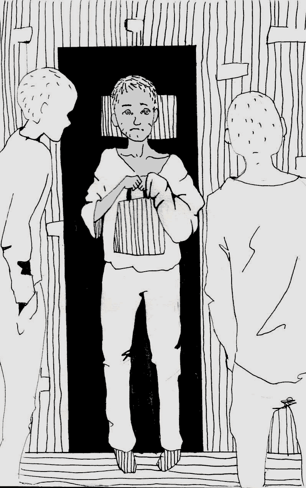

- ~~[Introduction](./1.md)~~
- ~~[Glossary](./2.md)~~
- ~~[The De-Seg](./3.md)~~
- ~~[The Operative](./4.md)~~
- ~~[The Security](./5.md)~~
- ~~[The Untouchables in the Prison Hierarchy](./6.md)~~
- ~~[The Smell](./7.md)~~
- ~~[Rebellions Against the Divine Hierarchy](./8.md)~~
- ~~[The Divine Retribution](./9.md)~~
- ~~[A Riot in the Prison Quarantine](./10.md)~~
# [Mowgli](./11.md)
- [The Spaced-Out](./12.md)
- [The Wizard](./13.md)
- [Life is Beautiful](./14.md)
- [An Open Letter](./15.md)
- [The Last Resort](./16.md)
- [The Release](./17.md)
- [Afterword](./18.md)

---

He was brought to our house, 152, in the evening. He was a
bare-boned, smutty creature of about sixteen years old with a
fearful glance - just like a baited animal. In the first few minutes
we couldn’t get any sense out of him. Who is he? Which house
is he from? He only shook his head, and sullenly blinked in
confusion. Eventually we took him to the table, gave him
some tea and finally got something out of him. Meet Sasha K.,
twenty-one years old, from Cherven'. He was staying in a house
with cons who were under high security, but they made him ask
the screws to be transferred to another cell. It was only later
that we figured out why.

He had been convicted of possessing a stolen backpack with
a camera. [ jokingly called him Mowgli, because he looked like
someone who had just come out of the forest, plus he had a
dark complexion. The nickname caught on quickly.

A few days passed. In a consolidated effort the house dressed
Mowgli, cut his hair and made him have a wash. He started to
look more human. He didn’t have anything on him, not even
a razor, but we provided him with everything that he needed.
Sasha didn’t receive parcels or letters, but he ate and smoked
with us since we lived communally.

As time went on he began to grow bolder, and as he saw
that we were people and not beasts, he started to put his worst
foot forward. He would butt in on people’s conversations and
talk nonsense. He would comment when it was not welcome, or
come to the feeder and talk to the cops - which he doesn’t know

how to do at all — and he’d snap at fair criticism. After a few such
episodes the main method of communicating with him became
screaming. Mowgli was screamed at from dusk till dawn, since
there wasn’t an hour when he wasn’t doing something wrong.
Sasha didn’t care a bit.

I was interested in him, and I felt he was a rare individual. Of
course, on the outside I didn’t have a chance to communicate
with such people, but here I could to my heart’s content. I was
probably the only one in the house who never shouted at him -
well, almost never - and spoke to him as an equal, though it
wasn’t always easy.

Soon, many interesting details about Mowgli’s background
revealed themselves. His father was in Glubokoye colony No.
13, and had been for a long time. Where his mother was, was
not clear, and Mowgli used to live with an aunt who apparently
wasn’t very fond of him. The guy had been growing up on his
own; at least I didn’t see any signs of a meaningful upbringing.
Sasha had spent almost his whole life on the street; drinking,
sniffing glue and stealing. He had finished studying at a technical
school but could hardly write, and it was an overwhelming task
for him to read more than a few lines. In my estimation, his
development was equal to that of an eleven or twelve year old
child. Sometimes I looked at Mowgli and thought: ‘So much for
the 21st century in the centre of Europe’. Under the nose of the
highly regarded social, welfare and educational institutions, a
shut-in grew up who can’t read at twenty-one - and the only
thing they could think to do with him was to put him in prison.
Now it’s almost inevitable that he will drink, steal and sit in jail
for his whole life, and nobody cares. Nobody, apart from a local
police department which has a higher crime rate because of him.

But if the state didn’t care for Mowgli, NGO’s did. As a child,
he went to Italy on a Chernobyl rehabilitation project. I don’t
remember the details, the only thing that comes to mind is how
he told us about his call to the Italians from Belarus:

‘I’'m calling, she picks up the phone... And I'm like: “Hello!”
She’s like: “Pronto! Pronto!” And I'm like: “Khuyonto!”? and I
hang up!” At this point Mowgli burst into laughter, apparently
satisfied with his subtle humour.

Mowgli also had asthma. Sometimes he would burst into a
heavy cough and then ask the screw for an inhaler. He couldn’t
take it into the cell because it was metal, so they left it in the
locker in the hall. The inhaler was actually ‘from the Italians’.
However, despite the horrible seizures he suffered, Sasha
wouldn’t even consider quitting smoking.

Days passed, and Mowgli was clearly turning into a pariah in
the house. Apart from not being able to behave himself, Sasha
constantly screwed up; he would spoil a communal object, or
drink a lot of diesel® late at night and then vomit the whole
night, preventing everyone from sleeping. He always had to be
forced to wash his clothes and do his part in the cleaning of the
house. At first, I defended him as he was constantly yelled at. It
was a pity to watch him shrink at the dreadful roar and popping
eyes of our cellmates. A lot of times I tried to explain to him
in a friendly way the rules of life in the house. These ‘edifying’
conversations helped for half a day at best, so after a few
attempts I dropped the ball. Like I said before, iron-fist methods
also didn’t help him with his education. We soon became aware

of an interesting psychological tendency; it was vital to Mowgli
to be the centre of attention, even if this attention manifested
itself solely in abuse and shouting. In order to be ‘the star of the
house’ and be able to listen to everyone discussing him, he was
ready to endure insults, attacks and threats.

In the following years I saw that it took a special kind of
person to create this dynamic in the cell system. I often
witnessed people who would deliberately annoy everyone
around them to focus all attention on themselves, by any
means possible.

Soon we ran out of ways to try and get through to him, apart
from physical ways. He was asked, shouted at, threatened with
many things, intimidated, deprived of cigarettes and ignored -
but all this attention excited our Mowgli even more.

He started complaining that we treated him badly. He
warned the screw of his intention to harm himself, and
declared a hunger strike that lasted for just 15 minutes before
he received his first portion of soup from the chow server. Once
he even wrote an application to be transferred again. On a sheet
of paper from a notebook, in wiggly lines, hardly legible and in
unbelievably curved letters he wrote something like:

>aplication\
\
Pleas can u bring me to anotha hous becus Ive done a thousand
screwups, Im in everybodys way they always shout at me

To be fair, he never filed this application. At the same time,
the process of drawing it up and the discussion of this act of
Mowgli’s took half a day, and he couldn’t wish for more.

After the New Year in 2011, I was sent to the hospital in
Zhodino prison (where I stayed at the pretrial facility during
the investigation) to be treated for an ingrowing toenail.
When I returned two weeks later, Mowgli was not in the house
anymore. My cellies informed me that just after my departure,
Sasha went rogue — he either experienced some mental issue,
or successfully imitated it. In particular, he would bang on the
walls for no reason, talk nonsense more than ever, hide behind
the toilet door, steal things from the collective pot, and he even
stole and hid someone else’s letter. Eventually they could bear
it no longer, and started kicking him heartily. As a result, the
cops realised that something was wrong with Sasha and took
him to the infirmary.

It’s been almost three years. I'm in Zhodino prison again,
but not as a defendant anymore. They brought me here from
Mogilev prison to treat my stomach, since Zhodino has a wing
of the Republican infirmary. When I got here I was called in
to see the Operative, probably to suss me out. On the wall of
the Operative’s office there are photos of convicts who are on
the preventive registry. While scanning the line ‘Inclined to
commit suicide or self-harm’, I met Mowgli’s eyes. Holy crap!
It’s him, indeed. The surname corresponds. He probably went
down for a second or even third time after the end of his term.
I returned to my house and started recalling everything I'm
telling you now. I remembered the asthma inhaler, the wolf-
ling’s gaze, totally rotten teeth at twenty-one, locks of hair
falling to a basin with soapy water when we were shaving his
head... And a question came to my mind: what would happen

with Sasha when he dies? Unfortunately, 'm pretty sure he
will not last long, unless he gets a long term sentence and the
prison ‘preserves’ him.

‘Who would weep for him? Will there be anyone to carry his
coffin?

Will he repeat the fate of Balzac’s Father Goriot, who was
dying almost totally alone, and it was strangers who took care
of his final journey?

Mowgli doesn’t have relatives, hardly any friends, and if he
has any they are obviously not the best representatives of the
human race. It occurred to me that it must be very boring and
bleak not only to live like that, but to die as well, when you
are all alone. It also occurred to me that the one who threw
me in jail for a political crime, and the one who made a thief
and an outcast in the margins of life out of Mowgli, is the same
leviathan.

March 2015


---

- ~~[Introduction](./1.md)~~
- ~~[Glossary](./2.md)~~
- ~~[The De-Seg](./3.md)~~
- ~~[The Operative](./4.md)~~
- ~~[The Security](./5.md)~~
- ~~[The Untouchables in the Prison Hierarchy](./6.md)~~
- ~~[The Smell](./7.md)~~
- ~~[Rebellions Against the Divine Hierarchy](./8.md)~~
- ~~[The Divine Retribution](./9.md)~~
- ~~[A Riot in the Prison Quarantine](./10.md)~~
- ~~[Mowgli](./11.md)~~
# [The Spaced-Out](./12.md)
- [The Wizard](./13.md)
- [Life is Beautiful](./14.md)
- [An Open Letter](./15.md)
- [The Last Resort](./16.md)
- [The Release](./17.md)
- [Afterword](./18.md)
