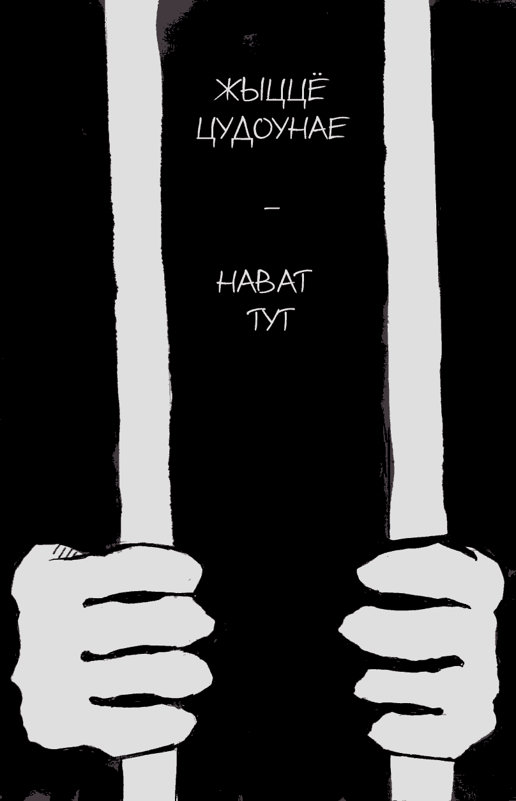

- ~~[Introduction](./1.md)~~
- ~~[Glossary](./2.md)~~
- ~~[The De-Seg](./3.md)~~
- ~~[The Operative](./4.md)~~
- ~~[The Security](./5.md)~~
- ~~[The Untouchables in the Prison Hierarchy](./6.md)~~
- ~~[The Smell](./7.md)~~
- ~~[Rebellions Against the Divine Hierarchy](./8.md)~~
- ~~[The Divine Retribution](./9.md)~~
- ~~[A Riot in the Prison Quarantine](./10.md)~~
- ~~[Mowgli](./11.md)~~
- ~~[The Spaced-Out](./12.md)~~
- ~~[The Wizard](./13.md)~~
# [Life is Beautiful](./14.md)
- [An Open Letter](./15.md)
- [The Last Resort](./16.md)
- [The Release](./17.md)
- [Afterword](./18.md)

---

Another 10 days of the punishment cell in Shklov colony No.
17. This time I was lucky: 'm not alone in the cell, there are three
of us. It’s warmer like that, because the radiators are almost cold,
and it’s more fun - there is someone to spend the time with. One
of my neighbours is a young pal with a one-year term, he is to be
released in five days. The other one is Sanya aka ‘Pilot’. His hair is
grey, though he must be under forty. Lived-in voice. Old wolf’s look.
He’s been inside for thirteen years, and seven more are ahead - it’s
for domestic homicide. In those ten days that we spent together, I
heard a lot of interesting things from him, like how he got to serve
in the army before his imprisonment (his service fell right within
the period of Soviet decay). I learned how at the beginning of his
stretch he used to be a ‘blatnoy’ in Orsha correctional colony No.
8, where he was a witness of the ‘black course’ - wrangles among
the ‘blatnoys’ right inside the pen, almost free access to mobile
phones, cops ready to bring any drugs for bribes. He remembered
how cons used to stay in the punishment cell according to the
system ‘one day the weather is flyable - the other it is not’, i.e. one
day they were fed on hot food, the other - on a slice of bread and a
cup of hot water; and many other things.

But it was not the stories, but the philosophy of the Pilot that
burnt into my memory.

One day I felt a bit down. I don’t remember the reason
anymore, either after another sleepless night, or after routine
screw’s tricks, but the irritation that had been accumulating for
many days finally burst out in a stream of rudderless abuse of
the institution, the screws and generally of our former situation.
Pilot was listening. Then he agreed:

“You bet your ass. The pen here is cockish. It is no match
for the number eight! In the morning while everyone’s asleep, I
used to go out to the yard and sit on a bench sipping a tea... The
sun is shining, birds are singing. The mood is fucking awesome...
Don’t you worry. Soon you’ll get back to the ward-type housing
unit, make yourself some tea... And you’ve got just a bit'. Cut
the shit, man...

He was silent for a moment, then looked at me with his tired
and a bit mad eyes and added:

‘Life is beautiful. Even in here...’

Life is beautiful. Even in here... This phrase struck with a
hammer and at the same time rang the bell in my head creating
an invisible explosion in the neural networks. I clammed up.
With every minute I got the meaning of it more and more.

Just imagine a stifling gloomy concrete box in which you are
doing push-ups and squats to warm up and get some sleep and in
which you stay as long as the governor wants. Outside the ‘box’
is the colony with an aggressive and mostly wily and obedient
population, people that one shouldn’t turn ones back upon, and
in addition to them - you are accustomed to screws who act with
impunity, who have sadistic tendencies and who don’t see a
person in you. There are no rights, there is no freedom, no wife
that would come for visits, no wellbeing or simple human joy.
And it’s been thirteen years like that, seven more are ahead. But
‘Life is beautiful. Even in here...’

This willpower and lust for life struck and inspired me with
great respect to this person. How much vitality, craving for
freedom and moral courage he must have to reason like that in

his situation, and how awkward it is to feel unhappy with your
lot for most of those who think that they have problems in life!

Much later, when in Mogilev prison after number seventeen
with its ‘blatnoys’ and ‘crime lords’, when the censors and
operatives were throwing out my mail in bulk trying to isolate
me from the outside, when screws in Zhodino were putting me
up against the wall, hitting my legs and handcuffing me for the
fact that I was a ‘political’, when in the prison I wasn’t getting
out of the dungeons for twenty days, when I got one more year
of imprisonment five days before my release, when in Gorky
colony they deprived me of visits from relatives and the lawyer,
every time, sooner or later, when I really wanted to take it hard,
become sad or feel sorry for myself, the Pilot’s face appeared in
front of my eyes and I heard his words:

‘Life is beautiful. Even in here...’

January 2016


---

- ~~[Introduction](./1.md)~~
- ~~[Glossary](./2.md)~~
- ~~[The De-Seg](./3.md)~~
- ~~[The Operative](./4.md)~~
- ~~[The Security](./5.md)~~
- ~~[The Untouchables in the Prison Hierarchy](./6.md)~~
- ~~[The Smell](./7.md)~~
- ~~[Rebellions Against the Divine Hierarchy](./8.md)~~
- ~~[The Divine Retribution](./9.md)~~
- ~~[A Riot in the Prison Quarantine](./10.md)~~
- ~~[Mowgli](./11.md)~~
- ~~[The Spaced-Out](./12.md)~~
- ~~[The Wizard](./13.md)~~
- ~~[Life is Beautiful](./14.md)~~
# [An Open Letter](./15.md)
- [The Last Resort](./16.md)
- [The Release](./17.md)
- [Afterword](./18.md)

