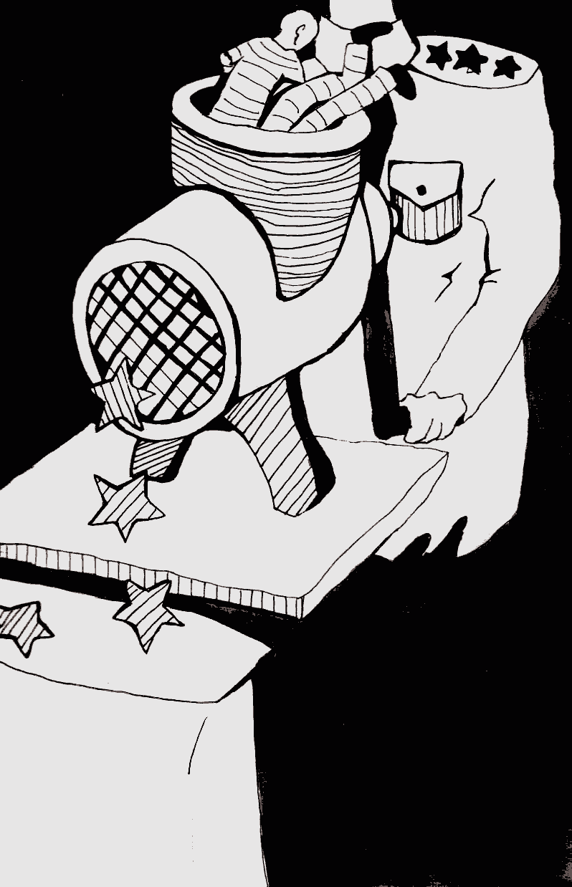

- ~~[Introduction](./1.md)~~
- ~~[Glossary](./2.md)~~
- ~~[The De-Seg](./3.md)~~
- ~~[The Operative](./4.md)~~
- ~~[The Security](./5.md)~~
- ~~[The Untouchables in the Prison Hierarchy](./6.md)~~
- ~~[The Smell](./7.md)~~
- ~~[Rebellions Against the Divine Hierarchy](./8.md)~~
- ~~[The Divine Retribution](./9.md)~~
- ~~[A Riot in the Prison Quarantine](./10.md)~~
- ~~[Mowgli](./11.md)~~
- ~~[The Spaced-Out](./12.md)~~
- ~~[The Wizard](./13.md)~~
- ~~[Life is Beautiful](./14.md)~~
# [An Open Letter](./15.md)
- [The Last Resort](./16.md)
- [The Release](./17.md)
- [Afterword](./18.md)

---

In any prison, officers spend their time preventing convicts
from fighting for their rights. As well as the use of physical
intimidation, a big part of this involves the isolation of convicts
from the prison community and sources of information. In the
middle of November 2014, while doing my time in solitary in
Mogilev prison, I learned that a new criminal case under Article
411 was opened against me. This meant that my forthcoming
release was postponed by another year. I was not able to
influence this situation, other than killing myself so they have
no one to try. The only reasonable way of fighting was with a
sheet of paper and a pen. I had to, as much as possible, attract
public attention - including the international public - to the
existence of this article and its practical application against
political and common prisoners fighting for their rights. This
is how the idea to write an open letter to the media leapt to
mind.

Writing was not even half the battle, but perhaps one
tenth of it. How to get it to the outside? Prison administration
rarely lets out even official complaints to the Department of
Corrections, never mind devastating letters to the media. I had
to resort to a trick that I can’t disclose here. I will only say that
as a result I experienced intense shakedowns before going to
see my lawyer, and threats to put me in a worse cell. But I didn’t
really worry about it — I had pulled it off.

The letter, written in March 2015 was translated into Russian
and English thanks to my parents and comrades, and was
handed to representatives of the European Union in Belarus,
diplomats from the US Embassy, published in Narodnaya Volya
newspaper and a bunch of other Belarusian online media'.

‘Greetings! My name is Mikalai Dziadok. I am writing this
letter to all those for whom the words ‘justice’, humanism’ and
‘human dignity’ are not an empty phrase.

On February 26 this year, I was sentenced under Part 1 of
Article411 of the Criminal Code to one year of imprisonment. The
title of this article is ‘Willful disobedience to the requirements of
the administration of a correctional facility’. The sentence was
handed down in prison just five days before the end of my previous
term, 4 years and 6 months. I noted that I received the maximum
penalty under this article. In 2012, a former political prisoner
Zmitser Dashkevich was convicted under the same article.

What was my ‘crime’? 16 disciplinary violations in almost 2
years in Prison No. 4, in particular; wearing a tracksuit, talking
to inmates in neighbouring cells and walking around the cell
after 10 p.m. It is also important to note that for each of the 16
violations I was reprimanded, either receiving a warning or five
to ten days in a punishment cell, thus serving sixty days in a
punishment cell of this prison alone.

The Constitution, the Criminal Code and the Correctional
Code of Belarus declare a lot of good principles and rights,

but they are trampled into the mud when Article 411 of the
Criminal Code is in action. It allows them to send a person to a
correctional colony for one year (or two years under the second
part of this article), for wearing or not wearing certain clothes,
or for a conversation with your cellmate. Is there such a terrible
and absurd legal norm elsewhere in the world?!

Initially, Article 411 of the Criminal Code was introduced
to deal with crime bosses in penitentiaries and the internal
prison laws inherited by Belarus from the Soviet era. Today,
however, these internal laws are almost universally defeated
by the administrations of prisons and colonies, and the article
was and is increasingly being used against political prisoners
and other inmates fighting for their rights. The very wording of
the article opens up a space for moral violence and violation of
human dignity. Here is an example: a prison inspector spits on
the ground and gives a convict a mop to clean it up. The latter
refuses. Four such refusals are enough for criminal prosecution!
One of the convicts told me this story, and even if it is not quite
true or exaggerated - everything in it is within the law, and this
is the worst thing about it. In full accordance with the law, a
prisoner can be put in prison for four refusals to perform work
that humiliates him! I do not know of even a single case of
acquittal under Article 411.

In general, human rights violations and abuses in Belarusian
prisons have reached such a scale that they have become a
system and a habit, they should be described in a whole book,
not a single letter! However, I don’t want to be overambitious in
this appeal, and so I will focus on the effects of Article 411.

This scope for arbitrary actions of prison administrations
is created by the Interior Ministry’s Internal Rules of Conduct
(IRC), which should be followed by each convict. However,
convicts are not familiarised with the entire rules, only part
of them, and they are told that the rest of the document is ‘for
official use’. This does not prevent the administration from
demanding full observance of the rules by the convicts. The rules
themselves are written in a manner that allows the punishment
of anyone at any time for things such as: being unshaven,
wearing dirty clothes or shoes, unbuttoned collars, improper
greeting or not greeting a representative of the administration,
not standing up in the presence of prison authorities and so on.
Often violations reports are simply falsified, and then try proving
that your shoes were actually clean! It is for such ‘violations’ that
Belarusian political prisoners continue to be put in disciplinary
segregation, secure housing unit and deprived of family visits.
These prisoners include: Thar Alinevich, Artsiom Prakapenka,
Yauhen Vaskovich and Mikalai Statkevich?.

Moreover, strict compliance with the rules is demanded only
from those who ‘stand out’ in some way: political prisoners and
those who dare to speak about their rights. The others have more
or less quiet lives — as long as they are silent. I have observed the
application of Article 411 so many times, and it was always out of
revenge to a prisoner for his indomitable will, or for the defense
of his rights, and never anything else.

In their official publications, correctional officers - though it
would be more correct to call them punitive - constantly repeat
that they took the best from the Soviet penal system. It is true,
if to you the best things are a total disregard for the individual,
ruthless suppression of prisoners’ will, promoting divisions
into castes and roles and the use of fear as the only method of
control. The President of Belarus likes to say that Belarus is the
centre of Europe. But why then does this ‘centre’ brutally ignore
its international commitments - not least the Declaration of
Human Rights, which guarantees respect for human dignity, the
right to humane treatment and a fair trial? A convict in Belarus
is a powerless and dependent creature, whose fate is entirely in
the hands of the officials of the penitentiary and the Department
of Corrections. If they want to, they will put you in a remand
prison, secure housing unit or transfer to a prison. They can
lower the status of a convict so that he will cease to exist as a
person for others (this is done by loyal prisoners who can execute
any order), or extend their sentence. This feeling of despair and
powerlessness is difficult to convey - it can only be felt.

Of course, I would really like to shout to the whole world
about the injustice caused to me by the punitive system, but I do
want to be the last convict under Article 411. Therefore, I appeal
to the international and Belarusian human rights agents, to all
international organisations interested in human rights, and
to concerned people of Belarus: do everything possible for the
repeal of Article 411 of the Criminal Code. The Belarusian society
is atomised, constrained by fear and conformism. Separate
groups can barely defend their economic rights, and those who
are trying to protect their political rights are subject to endless
repression. However, I am convinced that the Belarusian people
will wake up and realize that ‘those who would give up essential
Liberty, to purchase a little temporary Safety, deserve neither
Liberty nor Safety’3, that the collective will of the people can
force the state machine to listen to reason and begin to fulfill
its international obligations.

Of course, the world’s attention and that of Europe today is
focused on the Ukraine, where people die in tens and hundreds,
and it seems that the suffering of the five political prisonersina
relatively stable and peaceful Belarus is a small matter. However,
let’s not forget that the events in the Ukraine began largely due
to the lack of respect for human dignity, the attempts to impose
on society a life of fear and an anti-democratic system of values.
What are we witnessing in Belarus, if not the same thing?

I therefore send to you, and all those who have the power
and ability to influence the situation, my hope that what is
happening to me will not happen to anyone else in Belarus.

Mikalai Dziadok
Prison No. 4

March 2015’


---

- ~~[Introduction](./1.md)~~
- ~~[Glossary](./2.md)~~
- ~~[The De-Seg](./3.md)~~
- ~~[The Operative](./4.md)~~
- ~~[The Security](./5.md)~~
- ~~[The Untouchables in the Prison Hierarchy](./6.md)~~
- ~~[The Smell](./7.md)~~
- ~~[Rebellions Against the Divine Hierarchy](./8.md)~~
- ~~[The Divine Retribution](./9.md)~~
- ~~[A Riot in the Prison Quarantine](./10.md)~~
- ~~[Mowgli](./11.md)~~
- ~~[The Spaced-Out](./12.md)~~
- ~~[The Wizard](./13.md)~~
- ~~[Life is Beautiful](./14.md)~~
- ~~[An Open Letter](./15.md)~~
# [The Last Resort](./16.md)
- [The Release](./17.md)
- [Afterword](./18.md)
