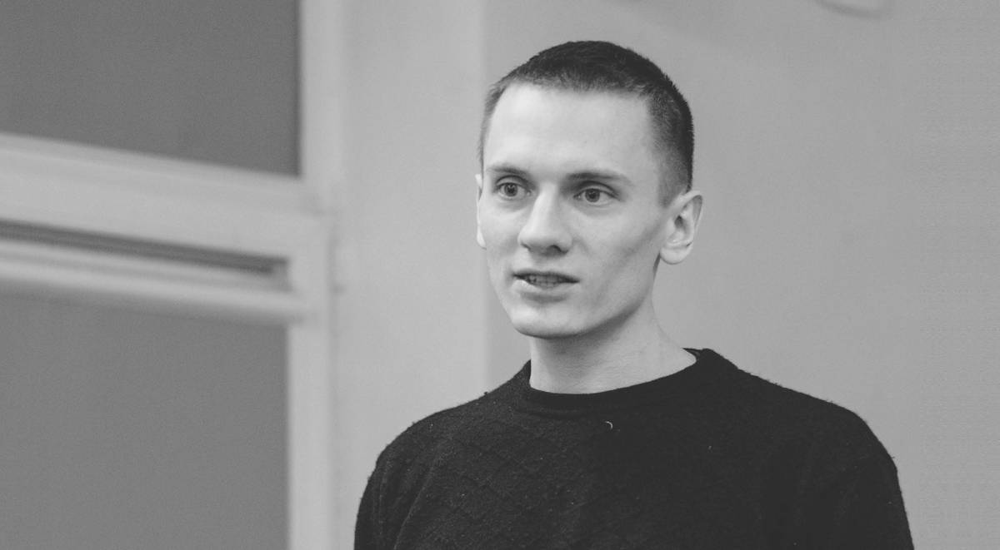

- ~~[Introduction](./1.md)~~
- ~~[Glossary](./2.md)~~
- ~~[The De-Seg](./3.md)~~
- ~~[The Operative](./4.md)~~
- ~~[The Security](./5.md)~~
- ~~[The Untouchables in the Prison Hierarchy](./6.md)~~
- ~~[The Smell](./7.md)~~
- ~~[Rebellions Against the Divine Hierarchy](./8.md)~~
- ~~[The Divine Retribution](./9.md)~~
- ~~[A Riot in the Prison Quarantine](./10.md)~~
- ~~[Mowgli](./11.md)~~
- ~~[The Spaced-Out](./12.md)~~
- ~~[The Wizard](./13.md)~~
- ~~[Life is Beautiful](./14.md)~~
- ~~[An Open Letter](./15.md)~~
- ~~[The Last Resort](./16.md)~~
- ~~[The Release](./17.md)~~
# [Afterword](./18.md)

---

Do I regret what’s happened? Today, when the time has
passed, I can answer the question definitely - I don’t. I don’t
regret anything. And if the clock could be turned back, then, at
my first interrogations where my fate was determined, I would
do the same thing.

I owe a lot to prison. For those who set oneself a goal of
self-improvement, prison is a real school of struggle with your
weaknesses, a school of understanding human psychology,
a school of identifying the limits of your possibilities, in
other words, the school of life. This is what it became for me.
Moreover, frankly speaking, staying in prison and suffering is
not difficult, if you know why and what for you are doing time.
You are not doing it to bring to power another president and
then complain that he let down his people, not to make the
state replace a pro-Russian bureaucracy with a pro-Western
one, not to have the workers of Belarusian enterprises change
a state boss to a private one, and not to make the paperwork
in the punitive institutions of KGB and Ministry of Interior in
Belarusian instead of Russian'. You are doing it to make your
own, though pitifully small, contribution to the building of a
society where one human being will never deprive another of
freedom, rights and human dignity.

The anarchist order seems utopian to many; where the very
premises of structural inequality, narrow-mindedness, hierarchy
and exploitation of human by human will cease to exist and
will make way for the equality of the many, tolerance, real
direct democracy and liberation from any oppression. State
propagandists specifically are fervently trying to prove the
‘utopian nature’ of anarchism. But as for me, only such a goal as
the striving for this ideal can become a worthy reason for risking
your freedom, health and even life in a single bet. All other goals
apart from the above-mentioned are tinkering at the margins
that lead to facelifting of the System which will continue to
produce prisoners and guards, exploiters and the exploited,
masters and slaves. The essence remains, and only the facade is
changing.

It’s not difficult to stay in prison for the idea if we remember
the fighters of the past. Narodniks? in tsarist Russia were literally
buried alive in lifeless dungeons - they used to spend decades
there, and not many were released alive.

During the civil war, the White Guardists® used to fry captured
Makhnovist anarchists on metal sheets.

In 1906 a 20-year old social-revolutionary Maria Spiridonova
who shot at a suppressor of peasants’ uprisings was beaten and
raped during her arrest and then sentenced to lifelong hard
labour in exile. In 1941 Romanian anarchists called Haiducks of
Kotovsky, who rose up to defend Jewish neighbourhoods from
pogroms, were killed in a slaughter house by the legionaries who
hung them on the hooks for dead animals. The memory of those
who survived much more severe ordeals didn’t let me lose heart
and bate demands to myself. This is another reason why you

shouldn’t think that you are the only martyr for social justice in
the world and overestimate your role in this war.

In one of the works of Carlos Castaneda, Don Juan tells his
student, “The main obstacle on the way of a warrior is considering
yourself the centre of the Universe’. Indeed, the consciousness
deceives us, making us in certain moments feel just our own pain
and consider just our own difficulties. Inherent egotism forces
us to consider ourselves unique, a person who deserves great
compassion, whose acts are uppermost and ordeals are the hardest.
But this is not true. You are just a link in a chain of thousands
and millions who were suffering before; they also had families,
friends, they also wanted to take the air of freedom and spend
time with friends instead of staying in humid dungeons. Your pain
is no greater than theirs. It inspires, because it makes you - with
no exaggeration - an accessory to history, and makes you more
critical and demanding to yourself. You begin to understand that
you are just a brick on the scale of the planet, a brick that must be
used as part of history to build the new world...

We know who we are. And we know what we want. Let
the people in power make up new methods of fighting with
‘extremism’ and think about more things to ban, let the
chekists* graft the budget buying new equipment for controlling
us, let the cops intimidate us with their water canons, tear-gas
grenades, and special units, let them demonise us from the
screens of zombie-boxes - we will still go forward holding hands
with those who have taken this path before us.

For only this means life, and meaning, and the truth.


---

- ~~[Introduction](./1.md)~~
- ~~[Glossary](./2.md)~~
- ~~[The De-Seg](./3.md)~~
- ~~[The Operative](./4.md)~~
- ~~[The Security](./5.md)~~
- ~~[The Untouchables in the Prison Hierarchy](./6.md)~~
- ~~[The Smell](./7.md)~~
- ~~[Rebellions Against the Divine Hierarchy](./8.md)~~
- ~~[The Divine Retribution](./9.md)~~
- ~~[A Riot in the Prison Quarantine](./10.md)~~
- ~~[Mowgli](./11.md)~~
- ~~[The Spaced-Out](./12.md)~~
- ~~[The Wizard](./13.md)~~
- ~~[Life is Beautiful](./14.md)~~
- ~~[An Open Letter](./15.md)~~
- ~~[The Last Resort](./16.md)~~
- ~~[The Release](./17.md)~~
- ~~[Afterword](./18.md)~~

# All Books
