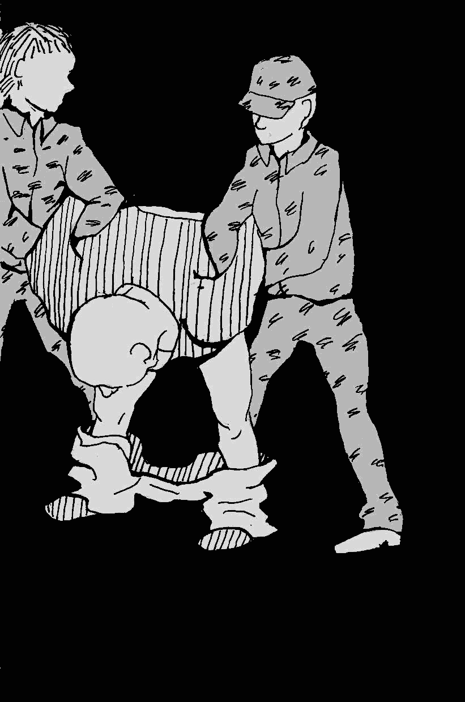

- ~~[Вступление](./1.md)~~
- ~~[Список сокращений и жаргонизмов](./2.md)~~
- ~~[ШИЗО](./3.md)~~
- ~~[Опер](./4.md)~~
- ~~[Режим](./5.md)~~
- ~~[Неприкасаемые в тюремной иерархии](./6.md)~~
- ~~[Запах](./7.md)~~
- ~~[Бунт против божественной иерархии в древнегреческой мифологии](./8.md)~~
- ~~[Божья кара](./9.md)~~
- ~~[Бунт в карантине](./10.md)~~
- ~~[Маугли](./11.md)~~
# [Улетевшие](./12.md)
- [Колдун](./13.md)
- [Жизнь прекрасна](./14.md)
- [Открытое письмо](./15.md)
- [Крайняя мера](./16.md)
- [Освобождение](./17.md)
- [Заключение](./18.md)

---

Лето 2012 года. Город Шклов, ИК-17. Одиночная камера ПКТ: один день сменяет другой такой же — я сам выдумываю им наполнение, чтоб не заскучать. Вот прошёл обед, баландёр забрал миски. Делать нечего, настроения читать или учиться нет, зато послеобеденная жара клонит в сон. Я расстелил свой клифт под столиком \(чтобы в глаза не бил свет от лампы\), под голову — учебник арабского и приготовился скоротать во сне ещё один час ещё одного Дня.

Устроившись поудобнее, начал было засыпать, как вдруг в конце продола послышалось жужжание электронного замка, а потом лязг металлической решётки. «Кого-то привели», — подумалось мне. Как раз около 15 часов в зоне каждый день проходят «крестины» \(дисциплинарная комиссия\), где начальник зоны раздаёт зэкам сутки ШИЗО, месяца ПКТ, а также лишения свиданок и передач.

…Топот как минимум двух человек. Ага, отрядник привёл своего зэка. Интересно, в ШИЗО или в ПКТ? Тут с продола раздался хриплый прокуренный голос, орущий что есть мочи:

> Ра-а-а-сцветали яблони и груши\!\
Зацвели туманы над рекой\!\
Выходи-ила на берег Катюша…\  

Всё ясно. Это Коля.

Коля — зэк, поехавший крышей, мужик лет 50—55, а может и младше — уж очень нездорово выглядел. «Улетевший», как таких часто называют арестанты. Про него, как и про каждого такого, ходили легенды: якобы ходит по зоне без бирки, не бреется, посылает ментов на х\*й, орёт что ему вздумается и где вздумается. В моменты же особых обострений его и сажают в ШИЗО — чтоб совсем уже не бесновался.

Дали Коле 10 суток. Для него они, конечно, были весёлыми, но явно не для остальных зэков и не для ментов. Развлекался Коля тем, что после приёма пищи не отдавал баландёру алюминиевую миску. Держать их у себя в камере ШИЗО или ПКТ было запрещено, поэтому после каждого приёма пищи их забирали. Но только не у Коли. Частенько после обеда, завтрака или ужина приходилось слышать на продоле такой диалог:

>Контролёр: Поел?\
\
Коля: Поел.\
\
Контролёр: Давай миску.\
\
Коля: Пошёл на х\*й\!\
\
Контролёр: Давай миску сука пидарас бл\*дь\!\
\
Коля: Пошёл на х\*й\!\!\!

…далее следовали препирательства на протяжении минут 15-ти, после чего разъярённый контролёр открывал решётку, сам забирал миску, попутно давая Коле по печени.

Зэки же не любили Колю за его ночные фокусы. Днём он отсыпался, а ночью брал цепь, которой пристёгивалась нара, и бил этой цепью по наре, создавая адский грохот на весь барак, не давая спать ни зэкам, ни контролёрам.

Отсидев ту десятку \(уже не первую за срок\), Коля куда-то пропал. По слухам, его вывезли на ПО \(психиатрическое отделение\) — так зэки называют тюремную «психушку», находящуюся на ИК-3, в Витебске.

---

Потеря человеком рассудка в тюрьме — явление довольно частое. Мало того, что в тюрьмы часто попадают люди с «ограниченной вменяемостью» либо умственно отсталые, так ещё и сама тюрьма способствует развитию разного рода психических расстройств. Вот как об этом писал в «Записках революционера» Пётр Кропоткин:

>«Подо мной сидел крестьянин, по фамилии Говоруха, знакомый Сердюкова, с которым он перестукивался. Против моей воли часто даже во время работы я следил за их переговариванием. Я тоже перестукивался с ним. Но если одиночное заключение без всякой работы тяжело для интеллигентных людей, то гораздо более невыносимо оно для крестьянина, привыкшего к физическому труду и совершенно неспособного читать весь день подряд. Наш приятель-крестьянин чувствовал себя очень несчастным. Его привезли в крепость, после того как он посидел уже два года в другой тюрьме, и поэтому он был уже надломлен. Преступление его состояло в том, что он слушал социалистов. К великому моему ужасу, я стал замечать, что крестьянин порой начинает заговариваться. Постепенно его ум все больше затуманивался, и мы оба с Сердюковым замечали, как шаг за шагом, день за днем он приближался к безумию, покуда разговор его не превратился в настоящий бред. Тогда из нижнего этажа стали доноситься дикие крики и страшный шум. Наш сосед помешался, но его тем не менее еще несколько месяцев продержали в крепости, прежде чем отвезли в дом умалишенных, из которого несчастному не суждено уже было выйти. Присутствовать при таких условиях при медленном разрушении человеческого ума — ужасно».

Не менее ужасно наблюдать последствия этого разрушения.

На той же ИК-17 \(Шклов\) в ШИЗО при мне сидел Кузя — петух. В ШИЗО он сидел не в качестве наказания а как на БМ-е. Туда его спрятали от зэков. Проблема Кузи была в том, что он вёл себя неадекватно, в частности — гадил под себя и вообще где попало. Если верить рассказам зэков, таким он стал в результате регулярных побоев в отряде. Кузю били до того, как он стал «сраться» — за то, что петух и, скорее всего, за то, что «ненормальный». А потом продолжили бить — уже за то, что «срался», и жить с ним рядом в бараке было невыносимо. Кроме побоев были и увещевания — ему много раз давали чистую одежду и постельное бельё, но всё было тщетно. От греха подальше администрация нашла «замечательный» выход: посадила Кузю в «безопасное место», которое по условиям содержания отличалась от ШИЗО только тем, что там на полу валялся матрас. Каждые несколько дней я слышал крики дневального, матерившего Кузю на чём свет стоит: матрас регулярно бывал обгажен. Говорят, мать, приехавшая к Кузе на свидание, была в настоящем шоке и долго требовала у начальства объяснить, что они сделали с её сыном…

Там же, на семнадцатке сидел ещё один персонаж — не помню его имени. Его посадили в одиночку за то, что тот имел привычку воровать у других жителей барака. Несколько раз зэки его били, пока он сам не попросился его спрятать. На него почти каждый день находило буйство — он начинал издавать из камеры громкие нечленораздельные звуки и шумно материться непонятно на кого и на что. Это продолжалось часами. Но однажды он даже стал колотить нехитрую ПКТшную «мебель», и лишь тогда менты зашевелились — как же, казённое имущество портит\! — и прислали врача. Вертухаи скрутили бедолагу, и врач что-то ему вколол, после чего звуки начали постепенно идти на убыль и через полчаса стихли совсем.

Иной раз под крышей в ИК-17 собиралось сразу несколько психически нездоровых, и тогда начиналось настоящее веселье. Представьте себе: продол с 24-мя камерами, деревянные двери, через которые слышно всё, что происходит внутри, и бетонные стены, создающие отличную акустику. Ты сидишь в своей камере один и слушаешь одновременно доносящееся с нескольких сторон:

>— э-э-э… э-э-э… ы-ы-ы… ы-ы-ы…\
\
— Бл\*дь на\*уй ё\*аны в рот\! Пидары бл\*дь\!\!\!\!\
\
— А-а-а-а-а-а\!\!\! А-а-а-а-а-а\!\!\!А-а-а-а-а-а\!\!\!

… и так на протяжении многих часов — пока у товарищей психов не закончится запас энергии. В такие моменты начинаешь сомневаться, что ты в тюрьме, а в не дурдоме — и начинает казаться, что сам постепенно сходишь с ума.

Как я уже писал, многие «улетевшие» становятся настоящими знаменитостями: проблемных зэков перекидывают из зоны в зону, и слава идёт впереди них. К числу таких относится Хоккей — арестант с ИК-15 Могилёва. Ссутуленный мужик около 40 лет, с постоянной щетиной. Срок — 25 лет. Как говорят зэки, за убийство КГБшника. Первые 5 лет как осуждённый по «особо тяжкой», он просидел на гродненской крытой, где, видимо, и тронулся умом — либо же КГБшники отбили голову. Подробностей никто не знает, т. к. близко общаться с Хоккеем невозможно.

Один из самых известных приколов о Хоккее — радиопередатчик в его шапке. Он считает, что менты установили ему туда микрофон, и поэтому его часто можно встретить разгуливающим по локалке и бубнящим в шапку проклятия и отборную ругань в адрес милиции, государства и Лукашенко. Любит Хоккей обругать и беларусов \(за то, что выбрали Лукашенко\), особенно во время просмотра телевизора. Хотя среди зэков сторонников Лукашенко найдёшь едва ли, но за оскорбления в адрес беларусов Хоккей неоднократно был бит. Сам он, кстати, россиянин.

Он любит изобретать замысловатые ругательства и записывать их в тетрадку. У Хоккея было много общих тетрадей, исписанных мелким почерком от начала и до конца. Те, кто имел возможность с ними ознакомиться, говорят, что это просто бессвязный и необъяснимый поток сознания, ругательств и бреда.

Но наиболее неиссякаемым источником веселья для зэков было то, как Хоккей ведёт себя с мусорами. Как-то он набрал из столовой каши-сечки, и выложил её посреди локалки на газетку, подписав: «Для Махоуни». \(Махоуни — кличка бывшего начальника ИК-15 по фамилии Маханьков\). А однажды просто ходил по локалке, во весь голос сквернословя в адрес «Махани и Толкачихи». Его вызвала к себе администрация: начальник колонии Маханьков и его заместитель Толкачёв. Задали вопрос:

— Кто такие Маханя и Толкачиха?

— Это мои московские шлюхи\! — Хоккей честно поехал в ШИЗО.

Однажды в Могилёвскую колонию приехали какие-то курсанты. Пройдя по «центральной аллее» они пошли дальше — осматривать зону, один курсант отстал и начал оглядывать зарешёченные локальные участки вокруг себя. На его несчастье в одном из них стоял Хоккей. Вцепившись руками в решётку, он уставился на курсанта сумасшедшими глазами и цедил в его сторону какие-то немыслимые ругательства:

— Чё смотришь, сука б л\* дь… Приехали пидарасы, свинобыдло е\*аное\!..

Курсантик счёл за лучшее догнать своих…

Не знаю, били его менты на пятнадцатке или нет, но в ШИЗО он катался регулярно. Впрочем, на его поведение это никак не влияло.

Но самым активным рассадником умопомешательства среди зэков является, безусловно, крытая. В группе риска — люди с большими сроками, как те, кто сидит в одиночках, так и те, кто сидит в общих хатах. Стеснённое пространство, постоянные конфликты, ругань, накалённая атмосфера, страх, невозможность сменить обстановку, провокации и издевательства со стороны ментов, долгие годы заключения впереди и, как следствие, — безысходность, очень этому способствуют.

Одиночек на всех не хватает, поэтому администрация часто сажает «ненормальных» в кичу. Однажды, сидя в тамошнем ШИЗО \(оно, ко всему, ещё и находится в подвале\), поздно вечером, в одной из соседних камер внезапно стали раздаваться громкие ритмичные удары и дикий вопль:

— Лю-ди\!\!\! Лю-ди\!\!\!

Удары не прекращались добрый час, перемежаясь криками: «Выпустите меня отсюда\!\!\!» пока корпусной не пришел и не надавал тумаков буяну. На тот день он успокоился, но на следующий всё началось вновь.

Я стал интересоваться у пацанов в соседних камерах, что там происходит, но кроме «у кого-то из нечисти крышу сорвало», так ничего и не добился. Сказать, что я испытывал к этому человеку сильное сочувствие, было бы лицемерием. Но, постаравшись представить уровень страха и отчаяния, который заставил его, сидя в подвале крытой тюрьмы, молотить ногой в двери и звать «людей», я по-настоящему ужаснулся. Однообразие, безнадёжность, давящая камера кичи, психическая болезнь и, наверняка, огромный срок впереди — это настоящая бездна.

Стоит заметить, что у большинства «улетевших» помешательство проявляется периодически, время от времени. Случаются и периоды просветления. Таким был, например, Саня по кличке «Шрек» — ещё один обитатель Могилёвской крытой. Этому парню не было и 30 лет. В детстве он учился в школе для детей с задержками психического развития. Родители у него если и были, то в тюрьме не помогали никак и, отсиживая свой срок за убийство, «грева» он не получал вообще. Держали его, как правило, в одиночке, потому что ни с кем не уживался. Обычно в его камере было тихо, но время от времени оттуда начинала раздаваться ругань в адрес мусоров — как по поводу так и без. Вымещал свою злость он, как правило, на контролёрах, которые заглядывали в кормушку во время раздачи еды. Но хуже всего было, когда у Шрека кончались сигареты. Поскольку денег для отоваривания в лавке у него не было, он занимался тем, что клянчил их у ментов. На день ему давали около 5 штук «Примы». Если давать переставали, он начинал орать и бить в двери, ломать камерную мебель, умывальник, бить стекло в оконной раме. В знак «протеста» против жадности ментов он отказывался идти на прогулку, сопровождая это отборной руганью в их адрес.

Менты били Шрека часто. Иногда прямо в камере, иногда выводя на «сборку», но всегда — без особого эффекта. В моменты особого буйства, когда шум из его камеры совсем уж доставал продольных, они просто вызывали врача, который делал ему укол \(как говорили зэки — аминазина\), и на какие-нибудь сутки Шрек успокаивался.

Но как Хоккей был знаменитостью в ИК-15, так знаменитостью Могилёвской крытой была Ира. Одна из немногих повстречавшихся мне женщин-крытчиц, она сидела со мной в соседней камере: я был в 18-й, она в 19-й. Уровень помешательства, который она демонстрировала, был просто ужасающим. Каждый день из 24 часов в сутках примерно 5–6 часов — независимо от времени суток, это могло быть и раннее утро, и поздняя ночь — из её камеры доносился непрерывный бессвязный текст, представлявший собой поток больного сознания. Воспроизвести даже маленькую его часть я никак не могу — память отказывалась это фиксировать. Скажем так, она начинала говорить о чём-то, например, о самолётах, или об увиденном по телевизору, или о планетах и галактиках, говорила об этом несколько предложений, потом, цепляясь за последние слова предложения, начинала от них уже новую тему — и так бесконечно. Что было для меня самым поразительным, она не просто говорила, она кричала, орала настолько громко, что её было слышно на всём этаже, а если она подходила к окну — то и на всех остальных этажах. Свою речь она неизменно перемежала угрозами и матерщиной в адрес мусоров. Изысканно и вычурно материла их и когда её выводили на прогулку. Те легавые, что поумнее, просто молчали, более ущербные начинали лаять её в ответ.

Ира активно общалась с соседними хатами через «решку» — выпрашивала сигареты. И горе было той хате, из которой в её адрес была сказана грубость или проявлено неуважение: она вылазила на подоконник и часами поносила её обитателей — и это слушала вся тюрьма. В отместку ментам за то, что не дают сигареты, или просто ради развлечения она могла стать голой на ежедневной проверке. Или начать тарабанить в батареи глубокой ночью, лишая сна, фактически, весь этаж. В таком случае приходил врач и колол Ире аминазин.

А вот те зэки, кто с ней переписывался, говорили, что, судя по вполне осмысленным и даже литературным письмам-малявам 39-летняя Ира — вполне приличная женщина с высшим образованием, у которой на воле осталась дочь. Именно стремясь обеспечить её Ира, как говорят, и взялась таскать из России наркотики, за что и получила 12 лет колонии строгого режима…

Человека, потерявшего рассудок, администрация рассматривает, как досадное недоразумение. Если он «тихий», то есть своим помешательством не нарушает режим содержания \(таких полным-полно\), на него вообще никто не обратит внимание. Ну сошел с ума человек — с кем не бывает? Ни о каком лечении говорить не приходится: в тюремной аптечке есть только валерьянка \(от всех нервных расстройств\) и аминазин для успокоения буйных. Говорить про профилактику психических расстройств в ИУ и вовсе смешно. В каждом исправительном учреждении всего один психолог \(кстати, мент в форме, что явно не способствует доверительным отношениям между ним и зэками\). В зонах, где работа со «спецконтингентом» поставлена хоть на какой-то, пусть показушный, уровень, он встречает приезжающих с этапа и общается с ними, иногда — может организовать посещение молельной комнаты или церкви. На этом всё. По режиму он обязан проводить регулярные беседы с каждым осуждённым, но реально ли это, если в колонии, например, 1500 человек? В некоторых колониях я за всё время нахождения там психолога не видел вовсе. То есть человек числится в штате, заполняет какие-то бумажки, делает вид, что чем-то занимается, получает за это зарплату — но при этом реально не выполняет совершенно ничего. Ну а далее ДИН отчитывается в МВД о «психологической работе» и «индивидуальном подходе» к осуждённым, МВД, в свою очередь, вешает лапшу на уши международным организациям — как качественно и гуманно работает в Беларуси пенитенциарная система — и все довольны. Зато тюрьмы и колонии продолжают перемалывать чьи-то мозги, готовя к выходу на волю моральных инвалидов. Карательная система построена так, чтобы работать со следствиями, а не с причинами. Повесился кто-то в камере? Зачем выяснять, что к этому привело, лучше отобрать по всей тюрьме шнурки, ремни и нитки — чтоб не смогли повеситься, даже если очень захотят. Кого-то сорвало с катушек и он/она стал\(а\) молотить по дверям ногами с дикими криками? Вколоть аминазина — пусть на другой смене вопит, сколько хочет\! И всем плевать, в чём причина: режимники отправили назад передачу от родственников, на воле мать умерла или просто отчаяние довело до неадеквата.

Психически больных в тюрьме никто не лечит. На пресловутое ПО в ИК-3, Витебск, отправляют только тех, кто уже полностью потерял дееспособность — не может работать либо держать его в ШИЗО стало уже невыгодно. Как и в любом аспекте Системы, их волнует только твоя функциональность: выполняй, что тебе сказано, и не отсвечивай, будь ты хоть сто раз параноик, шизофреник или просто дурак. О качестве же лечения в тюремной «дурке» ИК-3 мне судить сложно, но я ещё не видел ни одного человека, который хотел бы туда вернуться…

---

\
Осень 2012 года. Город Шклов, ИК-17. Я досиживаю свои последние месяцы в ПКТ — впереди суд на «крытую» и этап в Могилёв. Закончился обед — сегодня были макароны, разваренные до состояния однородной массы. Что ж, пришло время поспать. Подготовил свою привычную «лежанку», закрыл глаза и уже начал было отрубаться, как в начале продола раздались привычные звуки — жужжание электрозамка. Кого на этот раз? Дослушав, когда зэка доведут до дежурки, я уже почти заснул — и вдруг был выброшен из состояния полусна пронзительным голосом, похожим на карканье вороны:
 
> Ра-а-а-сцветали яблони и груши\!  

*Июль 2016*

---

- ~~[Вступление](./1.md)~~
- ~~[Список сокращений и жаргонизмов](./2.md)~~
- ~~[ШИЗО](./3.md)~~
- ~~[Опер](./4.md)~~
- ~~[Режим](./5.md)~~
- ~~[Неприкасаемые в тюремной иерархии](./6.md)~~
- ~~[Запах](./7.md)~~
- ~~[Бунт против божественной иерархии в древнегреческой мифологии](./8.md)~~
- ~~[Божья кара](./9.md)~~
- ~~[Бунт в карантине](./10.md)~~
- ~~[Маугли](./11.md)~~
- ~~[Улетевшие](./12.md)~~
# [Колдун](./13.md)
- [Жизнь прекрасна](./14.md)
- [Открытое письмо](./15.md)
- [Крайняя мера](./16.md)
- [Освобождение](./17.md)
- [Заключение](./18.md)
