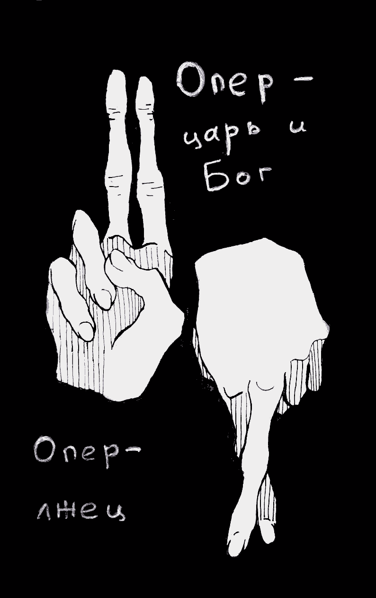

- ~~[Вступление](./1.md)~~
- ~~[Список сокращений и жаргонизмов](./2.md)~~
- ~~[ШИЗО](./3.md)~~
# [Опер](./4.md)
- [Режим](./5.md)
- [Неприкасаемые в тюремной иерархии](./6.md)
- [Запах](./7.md)
- [Бунт против божественной иерархии в древнегреческой мифологии](./8.md)
- [Божья кара](./9.md)
- [Бунт в карантине](./10.md)
- [Маугли](./11.md)
- [Улетевшие](./12.md)
- [Колдун](./13.md)
- [Жизнь прекрасна](./14.md)
- [Открытое письмо](./15.md)
- [Крайняя мера](./16.md)
- [Освобождение](./17.md)
- [Заключение](./18.md)

---

Феномен советской и, увы, постсоветской реальности. Слово, знакомое каждому, кто лишён или когда-то был лишён свободы. Тот, кто обозначен этим словом, может быть улыбчивым молодюком с хитрым прищуром или предпенсионного возраста мужиком с сединой в волосах и усталым взглядом, крикуном с бегающими глазами или вежливым интеллигентом, смотрящим на тебя спокойно и сосредоточенно, слабовольным лентяем или фанатичным профессионалом — суть его была и остаётся одна.

Опер.

Во времена имперской России они звались жандармами, потом просто сотрудниками ЧК, УгРо и тому подобных структур, сейчас они — «оперуполномоченные». Интересно, а как зовут их в других странах? Агент? Инспектор полиции? Детектив? И тянется ли за ними такой кровавый след, какой на протяжении без малого 100 лет волочит за собой «наш» опер?

Официальные обязанности опера, прописанные в красивых законах: собирать оперативную информацию, контролировать оперативную обстановку и тем самым — способствовать выявлению преступлений, охраняя… «права и законные интересы граждан». \(Смех в зале\). Но реальная деятельность этих парней с «холодной головой и горячим сердцем» \(портреты автора этой метафоры — садиста Дзержинского — до сих пор являются обязательным атрибутом каждого оперского кабинета\), конечно же, простирается далеко за пределы таких сухих и неинтересных формулировок.

Первая встреча с операми произошла 4 сентября 2010 года в кабинетах ИВС на ул. Окрестина, на следующий день после задержания. Два сотрудника с цепким взглядом и повадками хозяев жизни, Соколов и Ярошик, в течение многочасовых бесед пытались доказать мне, что стать мразью и предателем гораздо лучше, чем много лет сидеть в тюрьме. Один за другим обкатывались психологические приёмы: мне рассказывали, что они и так уже «всё знают», и мне надо лишь облегчить свою участь, сказав «всю правду»; что все друзья меня уже сдали; что меня используют, но они хотят мне помочь \(ах, классика\!\), один даже признался, что в глубине души разделяет анархистские убеждения. С этого впоследствии начал беседу и КГБшник — видимо, таков их шаблон для работы с политическими. Заканчивали же они, как правило, живописанием ужасов, которые меня ждут в тюрьме и зоне, в очередной раз предлагая мне предать друзей ради спасения собственной шкуры.

Но что такое 10–15 часов допросов по сравнению с 5 годами, в которые опера стали моими постоянными спутниками?

Тюремный опер и опер из уголовного розыска и КГБ — суть один и тот же биологический вид. Они идентичны и взаимозаменяемы, но здесь я расскажу вам непосредственно о тюремном\\зоновском опере, так как именно в повседневном контакте с ним можно впитать порами, прочувствовать и, выстрадав, понять и на всю жизнь запомнить роль и место этих существ в нашем мире.

Во времена ГУЛАГа зэки, завербованные опером в лагере, подслушивали чужие беседы или сами, втираясь в доверие, вызывали человека на откровенность, результатом чего становились новые уголовные дела о «контрреволюционных заговорах», «антисоветской агитации», «подготовке к побегу» и т. п. В итоге жертва оперских выкормышей получала новый срок в довесок к старому или бывала расстреляна. И хоть сейчас такого уже нет, методы и суть оперской работы остались такими же. Опер в тюрьме и в зоне — царь и Бог. Он решает, где и с кем будет жить зэк, будет ли он получать передачи, иметь свидания с близкими, «кататься» в ШИЗО, и вообще, будет ему в зоне хорошо или плохо. Отрядный опер через завербованных им зэков \(сук\) дёргает за ниточки общественное мнение, и ему ничего не стоит сделать так, чтобы неугодного загнали в касту «обиженных» или просто начали систематически гнобить. В известном смысле опер значит даже больше, чем начальник колонии, ведь начальник — далеко, а опер всегда тут, рядом. В негласной иерархии администрации «исправительного» учреждения — режимного, оперативного, медицинского отделов, спецотдела, отдела исправпроцесса — оперативный отдел стоит на самом верху. Опер может всё. «Чтоб жить в радости и счастье, дёрни ручку оперчасти», «Запомни сам, скажи другому: путь в оперчасть — дорога к дому», — иронизирует арестантский фольклор.

Опер — это каратель для того, кто, по его убеждению, должен страдать, и гарант всевозможных благ и привилегий для своих сук. На ИК-15 \(Могилёв\) опер посадил меня на 5 суток в ШИЗО за «неправильный» разговор с приезжим ГУБОПовцем. Формальным поводом стало то, что я зашел к нему в кабинет в расстёгнутом клифте, то есть лагерной куртке \(хотя все и всегда к нему так заходили\).

На ИК-17 \(Шклов\) какое-то время зэкам было позволено выносить со свиданий неограниченное количество овощей и фруктов. Потом режимный отдел запретил — в рамках обыкновенного и беспрерывного ужесточения режима в зоне. А опер через своих подручных пустил по зоне слух: «Это Дедка отец пожаловался, вот мы и запретили». Трудно представить себе более подлый способ поссорить человека с коллективом.

В Могилёвской крытой \(Тюрьма-4\) я как-то раз пожаловался оперу с красивой фамилией Лихута, что цензор, который работает под его непосредственным руководством, не пропустил мне шесть открыток из Швейцарии. «Как так? — говорю. — Там же ничего такого, обычные открытки с поздравлениями\!» — «Хорошо, разберёмся», — был ответ.

В течение следующей недели цензор изъял три самых обычных письма от отца и жены. Фирменная фишка Могилёвской тюрьмы: пустой конверт, а на нём степлером прикреплён листок с надписью: «Письмо не прошло цензуру». Это был намёк в оперативном стиле: довольствуйся теми письмами, которые получаешь, а то и этого лишим.

Опер — это иезуит. Моему соратнику Игорю Олиневичу на допросе в КГБ опера, «знатоки» анархизма доказывали несостоятельность анархистской теории: «Ты же занимаешься карате. Оно иерархично\!», чтобы хоть как-то расшатать уставшее сознание узника, подорвать его веру в свою правоту. Аналогично и мне в первые дни после задержания, увидев, что «лобовая атака» не сработала, опера говорили: «А мы возьмём да и напишем на Индимедии, что ты всех сдал\!». Уже упомянутый Лихута вёл со мной беседу, когда мне оставалось, как я думал, 3,5 месяца до освобождения: «Ну и какие у тебя планы на волю? …поедешь, да? А работать где?… Так там же всё дорого». Желал удачи с доброй улыбкой. Несколько позже я узнал, что на момент беседы он уже 4 дня как направил на меня документы в Следственный комитет для возбуждения уголовного дела по статье 411, — то есть прекрасно зная, что я получу ещё год, он решил поддразнить меня мечтами о скорой воле, чтобы новость о добавке срока оказалась для меня ещё больнее. Пример того, как человек может исчерпывающе охарактеризовать себя одним лишь поступком.

Опер — это лжец. Ложь — его основное и любимое орудие для подчинения других и добычи «оперативной информации». «Только скажешь нам то и то — сразу тебя отпускаем. Даю слово офицера\!» — часто говорят опера подозреваемым на допросах. Сколько наивных и доверчивых людей купились на это, оговорив себя, а порой, сами того не желая, и других\! И вот человек получает свои 5, 10, сколько угодно лет — но не благодаря тому, что следствие собрало убедительные доказательства его вины, а благодаря своей доверчивости. Опер даст любое слово, поклянётся, пообещает всё, что хочешь, назовёт тебя другом, скажет, что разделяет твои идеи, посочувствует, поругает власть — лишь бы получить от тебя те показния, что нужны ему, вне зависимости от того, правдивы они или нет. А получив, прикажет отвести тебя назад в камеру. Ты теперь — отработанный материал, а твоя душевная боль от обманутого доверия никого не интересует, главное, что дело клеится. Сколько благодаря таким обманам состряпано — на ровном месте\! — уголовных дел, сколько «висяков» доведено до суда\! А ведь покупаются на такое, что очевидно, никак не закоренелые преступники, а легковерные и более-менее порядочные люди, не имевшие ранее проблем с законом и не подозревающие, что его служители могут так цинично лгать.

Одного опера на ИК-15 \(Могилев\), который вечно уверял, что он «не имеет отношения» к тому, что меня в зоне прессует, я однажды прямо упрекнул: «Это не правда, …евич. Вы меня постоянно обманываете». На что тот, улыбнувшись, ответил: «Обманывать — это моя профессия».

При своей бесчеловечной натуре опер не может не быть ещё и расистом.

Одиозный ГУБОПовец Литвинский, беседуя со мной на ИК-15 \(Могилев\), пустился в критику «скинхедов», сказав сначала что у него «дед воевал», а потом добавив: «Я негров тоже не люблю. Но я же их ни бью\!». Опер Шамёнов с ИК-17 \(Шклов\) долго рассказывал мне про своё видение теракта Андерса Брейвика: «Вот до чего мультикультурализм доводит\!, — и гордо прибавлял: — А в Беларуси я могу ходить по улице и быть уверенным, что меня хачи не отп\*здят\!» По слухам, этот сотрудник был позже переведён в КГБ.

Опер — палач человеческих душ. На ИК-15 \(Могилев\) один парнишка жаловался мне, что опер склоняет его к сотрудничеству, требуя докладывать, о чем беседуют зэки, где у кого «запрет» лежит и тому подобное. В противном случае обещал «жизни не дать». И не зря опер начал давить именно на него: тому парню позарез нужно было УДО — на воле остался маленький сын, а жена… сидела на Володарке. Он же изо всех сил избегал нарушений, старательно вкалывал на промке и целыми днями переживал за своих домашних. Опер, безусловно, всё это знал и потому остановил выбор именно на нём. Я видел моральные мучения и метания того зэка: между семьёй и совестью, благополучием родных и возможными последствиями превращения в суку. Он пытался выкрутиться, рассказывал оперу какие-то малозначительные и общеизвестные вещи. Но этот вариант не прокатил. Вскоре меня вывезли с той зоны, и я так и не узнал, чем окончилась эта маленькая драма. Надеюсь, тот парень всё же понял, что предателем нельзя быть наполовину.

Бояться следует не тех, кто может убить тело, а с душой ничего не может сделать, **но тех, кто убивает душу** — понимаешь с опытом. В системе МВД есть как убийцы тел, так и убийцы душ. Все они: палачи из расстрельных команд и «оперуполномоченные» — получают деньги каждый за своё убийство.

Да, опер оставляет живым тело, организм, живущий на инстинктах и базовых потребностях, но это уже и не личность в полном смысле этого слова. Нюанс в том, что если в характере человека, попавшего в зону, изначально есть хоть малейшая гнильца, зерно подлости и непорядочности, то под бдительным надзором опера и его стараниями оно непременно разрастётся и высосет из человека всё хорошее, что в нём есть. Этому способствует сама атмосфера зоны, её моральный климат с императивом: «плюнь в ближнего, пни нижнего». А опер, без сомнения, ускорит рост этих всходов, подбирая удобрение каждому индивидуально, в зависимости от особенностей характера: кому-то таковым послужит лишняя свиданка с женой, кому-то страх за собственную безопасность, кому-то авторитет, кому-то — УДО, кому-то достаточно пакета чая и пачки сигарет. Но результат всегда один: человек выходит на свободу насквозь прогнившим, беспринципным, ни во что не верящим. В его миропонимании стёрты грани между добром и злом. Всё это — результат работы «оперативного отдела исправительного учреждения».

Порой я думаю — а каковы они в обычной жизни? Ведь не все же они бьют своих жён, детей, обманывают друзей… Наверное и они способны любить близких, заботиться о них, быть хорошими для своих жён и матерей, от души смеяться, дружить, в общем, испытывать человеческие чувства. На праздниках, застольях, они, наверное, вполне искренне веселятся. Обнимая друзей и коллег, поют любимые песни с рюмкой в руке: «Да\! И если завтра будет круче, чем вчера,“Прорвёмся\!” — ответят опера».

Конечно, прорвётесь. Бодрым строевым шагом.

В ад.

*Март 2015*

---

- ~~[Вступление](./1.md)~~
- ~~[Список сокращений и жаргонизмов](./2.md)~~
- ~~[ШИЗО](./3.md)~~
- ~~[Опер](./4.md)~~
# [Режим](./5.md)
- [Неприкасаемые в тюремной иерархии](./6.md)
- [Запах](./7.md)
- [Бунт против божественной иерархии в древнегреческой мифологии](./8.md)
- [Божья кара](./9.md)
- [Бунт в карантине](./10.md)
- [Маугли](./11.md)
- [Улетевшие](./12.md)
- [Колдун](./13.md)
- [Жизнь прекрасна](./14.md)
- [Открытое письмо](./15.md)
- [Крайняя мера](./16.md)
- [Освобождение](./17.md)
- [Заключение](./18.md)
