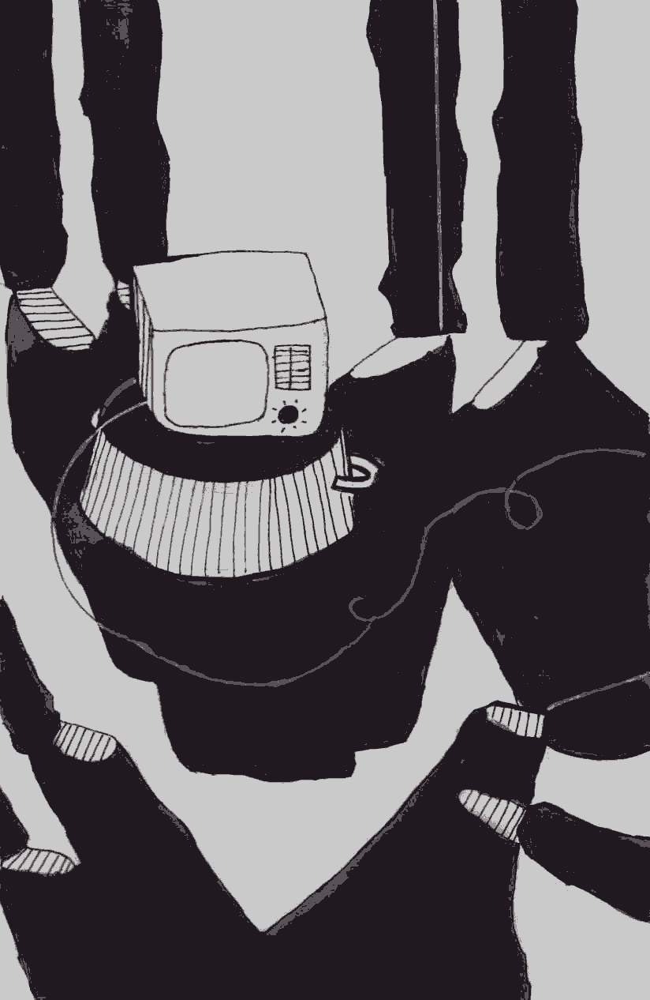

- ~~[Вступление](./1.md)~~
- ~~[Список сокращений и жаргонизмов](./2.md)~~
- ~~[ШИЗО](./3.md)~~
- ~~[Опер](./4.md)~~
# [Режим](./5.md)
- [Неприкасаемые в тюремной иерархии](./6.md)
- [Запах](./7.md)
- [Бунт против божественной иерархии в древнегреческой мифологии](./8.md)
- [Божья кара](./9.md)
- [Бунт в карантине](./10.md)
- [Маугли](./11.md)
- [Улетевшие](./12.md)
- [Колдун](./13.md)
- [Жизнь прекрасна](./14.md)
- [Открытое письмо](./15.md)
- [Крайняя мера](./16.md)
- [Освобождение](./17.md)
- [Заключение](./18.md)

---

Есть явления жестокие. Есть явления бессмысленные. Но любые явления и вещи кажутся более жестокими, если они бессмысленны. Именно к таким и относится тюремный режим — Молох, в жертву которому приносятся психологический и физический комфорт узников, их душевный покой и самоуважение.

Человек, который впервые попадает в тюрьму, первое время находится в состоянии растерянности и сильного удивления. Своим умом нормальной, свободной личности он не может осознать тех вещей, которых от него требуют тюремщики, ссылаясь на загадочное «так положено».

Все начинается со шмона. Удивление начинает преследовать заключенного еще в ИВС, когда на шмон перед поселением в камеру у него забирают поясной ремень и шнурки от обуви. Он спрашивает: «А почему мне их нельзя?» «Не положено\!» — рычит в ответ мент. Позже от опытных сокамерников он узнает, что все время подтягивать штаны и ходить в кроссовках, как в смешных разлапистых шлепанцах, он будет потому, что на ремне или шнурках можно повеситься.

Но самое интересное его ждет в СИЗО, когда родные начинают носить ему передачи. Сигареты? Должны быть изъяты из пачки и положены в прозрачный пакет. Чай? Тоже только засыпанный в прозрачный пакет. Конфеты? С каждой должна быть снята обёртка \(представьте, как нужно потрудиться, чтобы передать тридцатикилограммовую передачку\). Газировку? Нельзя\! Творог, молоко, сырки, сливочное масло — нельзя\! Мед? Нельзя\! Почему? «Не положено\!» Что-то в стеклянной бутылке? Боже упаси\! «Они же перережут друг друга\!» Консервы в жестяных банках — нельзя, «заточку сделают».

И если вдруг родные пойдут по разного рода начальникам и начнут жаловаться, то им покажут длинный список разного рода постановлений и приказов, покажут ПВР и требования санстанции, из которых они узнают, что молочные продукты нельзя, так как боятся эпидемий, сигареты надо перекладывать, так как «вдруг вы там что-то спрятали», по той же причине нужно снимать обёртку с каждой конфеты, по той же причине каждое яблоко, апельсин, любой фрукт или овощ, который вы передадите узнику, будет проткнут шилом \(и не важно, что «проживет» он после этого только пару дней\), любая вакуумная упаковка — продырявлена, любая шоколадка — поломана чуть ли не до крошки.

Но что СИЗО\! В колонии, куда арестант едет после приговора, его ждут новые открытия и новые недоумения. По приезду — обязательный шмон. Все «лишнее» отбирают и кладут на склад, где оно будет лежать до того момента, пока человек освободится. Это очень драматический момент для любого узника: все нажитое за год, а то и больше, все нагруженное сокамерниками, которые собирали его на этап, «летит» на склад либо в урну. Если это еда — ещё полбеды. Но самое обидное, если это одежда или обувь, купленные родными. В СИЗО, ИВС и некоторых зонах разрешена обувь только без металлических супинаторов — ведь из них, опять же, можно сделать заточку. Для того чтобы узнать, есть ли у обуви супинаторы, вертухаи нещадно сгибают кроссовок или ботинок, ломают подошву и просвечивают ее металлодетектором. Если это твоя единственная обувь, выдадут сменную \(так называемые «карантинки»\), если же она куплена родными и они пытаются её тебе передать, её попросту вернут обратно — деньги потрачены зря.

ПВР ИУ \(Правила внутреннего распорядка исправительных учреждений\) построены очень хитрым образом. Вместо того, чтобы перечислить список вещей, которые арестанту иметь запрещено, в них перечисляют вещи, которые разрешено иметь арестанту. Соответственно все остальное — запрещено, и за обладание вещами, которых нет в списке, можно попасть в ШИЗО.

Сказать, что список разрешенного недостаточен для нормального, достойного существования, особенно для тех, у кого длинные сроки, — это ничего не сказать. Взять хотя бы такую мелочь: каждый осужденный должен перемещаться по территории лагеря в форменной одежде \(в робе, официально: в «костюме хэбэ»\). Это установленная «форма одежды арестанта». Но робу нужно время от времени стирать. И если постирал, она должна высохнуть. В чем тогда ходить в столовую, на работу, да и просто по небольшому дворику у барака? Остаётся спортивный костюм, но вот парадокс: наденешь спортивный костюм — «нарушение формы одежды». Получишь акт о нарушении и можешь загреметь в ШИЗО. И никого не интересует, что твоя роба просто постирана и висит мокрая на веревке. Но и не стирать нельзя. Если тебя увидят в грязной робе, то и за это могут составить документ о нарушении, так как «осуждённый должен иметь опрятный внешний вид» \(ПВР\). Вот и крутятся зэки, как могут, чтобы и чистыми ходить, и в ШИЗО не попасть: кто «петляет» в столовую в середине колонны, чтобы не попасться на глаза контролёрам, кто просит робу поносить у кого-то из соотрядников. Кстати, иметь две робы также запрещено, найдут на шмоне — заберут, да еще акт могут составить \(опять маячит перспектива ШИЗО\). Этой проблеме — в чем ходить, когда постирал одежду, — уже много лет, но всем — от начальников отрядов до руководства ДИН — плевать на неудобства жизни каких-то там зэков. Проще десять, двадцать, тридцать человек «спецконтингента» отправлять ежегодно в ШИЗО, чем один раз изменить пару предложений в ПВР.

Эпопея с одеждой на этом не заканчивается. За несколько лет до моего освобождения буквально во всех зонах руководство развернуло целые «кампании» борьбы: с куртками на замках-молниях, со свитерами и мастерками под «костюмами хэбэ». Борьба с молниями велась просто так, чтобы унифицировать одежду заключённых. До поры до времени в лагере многие люди ходили в чёрных куртках на замках-молниях, переданных родными с воли, пока какой-то чин из ДИН не приехал с инспекцией и не задал вопрос: «А чего это у вас осуждённые ходят не по форме?» Ведь «по форме» — значит в неуклюжей телогрейке \(которая не греет ни капли\) на гнилой вате, в которой отваливаются пуговицы. И тут же началось безумие, сначала на одной зоне, потом на других: нормальные «вольнячие» куртки начали «отметать», вместо них выдавать телогрейки, а тех, кто пытался бунтовать, сажали в ШИЗО.

Борьба же с главными врагами «исправительного процесса» — свитерами и мастерками выглядела так. Осень \(или весна\), на улице холод. Отряд зэков выходит на работу на промзону и стоит на КПП в ожидании шмона. Каждого шмонают по очереди и заставляют расстегнуть «костюм хэбэ». Если вдруг под ним мастерка или свитер — иди в отряд, снимай. Начинаешь возмущаться — в ШИЗО. И не важно, что на улице плюс десять, а под твоей «курткой хэбэ» только лёгкая футболка. И не важно, что после такой проверки зэки на промзоне будут целый день трястись от холода и полотряда побежит в санчасть с простудой или гриппом. Зато любое начальство, посетив зону, будет удовлетворено: «Форма одежды соблюдена\!»

Такие кампании на каждой зоне возбуждаются часто, хаотично и непредсказуемо. Щёлкнет что-то в голове Дорошко^[Тогдашний начальник ДИН.] — по зонам идёт циркуляр, и граждане начальники готовы демонстрировать служебное рвение. Сегодня — молнии на куртках, завтра — сапоги «неуставного образца», послезавтра — стальные ложки \(у всех должны быть алюминиевые\!\), затем — кампания по борьбе с «выносом хлеба из столовой» \(это когда выдают дисциплинарные взыскания за то, что свою пайку хлеба вынес из столовой в отряд\) и так далее… Зеки определяют эти кампании по длинным очередям на КПП, где по рядам слышится раздраженный шепот: *«Опять?… Что, бл\*дь, в этот раз..? Бирки на трусах проверяют, что ли? Сука, за\*бали…»*

На ИК-17 \(Шклов\) заместителем начальника колонии был, а может, и сегодня есть, если не ушёл на повышение, очень старательный служака, Павел Николаевич Егулевский, по кличке Мерседес. Во время одной из таких компаний \(тогда боролись со штанами неправильного фасона\) он стоял с канцелярским ножом и прямо на КПП резал штанины зэкам. И одному из них таким образом разрезал ногу до крови. Парень оказался не из самых «прибитых», пошёл на принцип и начал отстаивать свои права, а его родные жаловались в различные инстанции. Но никакого результата это так и не принесло, Мерсу все сошло с рук.

Дальше — больше. Тенденция к усилению режима пробирается в каждую щель повседневной жизни арестанта. У каждого зэка есть прикроватная тумбочка. Думаете, там можно хранить все разрешенные вещи, которые хочется? Как же\! Несколько лет назад в каждом спальном помещении повесили список того, что можно иметь каждому зэку в тумбочке. Список очень краткий: ручка \(одна\), тетрадь \(одна\), две книжки, конверт \(один или два, уже не помню\), одна пачка сигарет и одна упаковка чая. Все\! Продуктов питания в этом списке нет. Вы спросите: а где же хранить все остальные вещи? Для этого, согласно мудрым постановлениям мусоров из ДИН, в каждом отряде существует «комната хранения личных вещей», либо, по-зековски, «кешарка», «бобовня», «каптёрка». Заведует этой комнатой каптёр — зэк, у которого имеются ключи от нее. Власть каптёра и его привилегированность очевидна. Дружить с ним — значит иметь твердый блат в отряде. Но что с того, что там лежат вещи? «Что может быть проще, — скажете вы, — зашёл в любой момент и взял то, что тебе нужно, — нечего спальное помещение захламлять». Все так, но открывается эта комната… дважды в день, на двадцать-тридцать минут. И вы, конечно, не единственный из сотни зэков отряда, кто хочет зайти туда и что-то взять — новую пару носков, кусочек сала, книжку или пачку сигарет. «В комнату хранения личных вещей заходить по одному человеку\!» — висит объявление на дверях. Наконец вы подловили момент, когда каптёр зашёл в каптёрку, отстояли свою очередь и прорвались в заветную комнату, чтобы открыть свой «кешер» и достать оттуда шоколадку, чтобы попить чаю с приятелем, или книжку, чтобы провести вечер в одиночестве. Схватил вещь, закрыл сумку и ушёл? Ага, конечно. В каждой сумке лежит опись личных вещей, вами же составленная при приезде в отряд. В ней записано все, от стержней для ручек до нижнего белья, карамелек, журналов или какого-то другого нехитрого скарба, нажитого в лагере. Если взял что-то — вычеркни из списка, если положил — обязательно впиши. Главное — не забыть это сделать, так как каждые несколько месяцев происходит «режимное мероприятие», а именно «смотр внешнего вида с выносом вещей». Отряд выстраивается на небольшом участке, каждый со своими сумками, и начальник отряда проверяет, у кого опись не совпадает с содержанием. Если что не так, составляется акт о нарушении. Пример, ставший в своё время хрестоматийным: Николая Статкевича посадили в ШИЗО за то, что количество его носовых платков в описи не соответствовало количеству их в кешере.

Нередко, как в любой бюрократической и иерархической системе, требования разных начальников входят в противоречие друг с другом. Это хорошо иллюстрирует случай с ИК-4 \(Горки\). В каждой камере ПКТ или ШИЗО стоит радиоточка \(она включается или выключается с пульта контролёра\), но без регулятора громкости: будешь слушать радио на той громкости, на которой включил контролёр. Но вдруг в учреждение приехала очередная проверка из ДИН. Большой начальник посмотрел на радиоточки в камерах и спросил: «А чего они у вас без регуляторов? Непорядок\!» И сразу после его отъезда козлы и хозяйственная обслуга под руководством администрации поставили в каждой камере регуляторы. Зеки сидели довольные\!

Но прошло время, приехал уже другой начальник из того же ДИН. Посмотрел наверх и чуть не упал в обморок: «Вы что это им, регуляторы громкости поставили? С ума сошли, что ли?» В его понимании это был просто недопустимый комфорт, вакханалия гедонизма и безнравственности. Через считанные часы обслуга \(те же зеки, конечно, что и ставили эти регуляторы\) уже выдёргивали их из каждой камеры ШИЗО/ПКТ, коих было почти 20.

Но наивно было бы думать, что режим затрагивает только материальный аспект, что можно или нельзя иметь узникам. Как я уже говорил, его смысл в том, чтобы проникать во все сферы жизни. Уставом регламентированы подъём и отбой. Замешкался на несколько минут — получил акт и, возможно, ШИЗО. И если в лагере это ещё можно как-то рационально объяснить \(отряду нужно идти в столовую, на работу\), то в СИЗО строгое наличие подъёма и отбоя не поддается объяснению, особенно если камеры переполнены и половина их населения не имеет возможности спать ночью и спит днём. Не то что спать, даже лежать на кроватях днём также запрещено. И мозг человека, который только попал в тюрьму, отказывается понимать: почему? Кому будет хуже от того, что арестант в СИЗО \(вина которого даже не доказана, он ещё обвиняемый, а не осужденный\), приляжет на кровать днем, поспит? Да и что ещё делать в камере? Но нет, только попробуй, бдительный контролёр сразу врежет ногой в дверь: «Не спать\!\!\!» В Жодинском СИЗО менты идут ещё дальше — на кровати нельзя сидеть с ногами \(\!\). Но сидеть с ногами, поставленными на пол неудобно — у коек железные уголки, которые впиваются в бедра. Остальная «мебель», если ее можно так назвать, очевидно, предназначена для кого угодно, но не для людей. Обитая железом, жесткая, рассохшаяся, или слишком высокая, или слишком низкая. Но привыкнешь, ничего не поделаешь…

В камере при каждом заходе администрации зэк должен сделать доклад. Выглядит он так: *«Гражданин начальник, в камере номер такой-то столько-то осужденных. Санитарное состояние в норме. Дежурный по камере такой-то. Жалобы и заявления отсутствуют».* \(В различных учреждениях текст незначительно отличается\). Особенно смешно данный доклад звучит в одиночной камере, когда чуть ли не годами сидишь один и два раза в день по проверке говоришь: *«Дежурный по камере осуждённый Дедок…»* Будто вчера дежурил какой-то другой осужденный…

При взгляде со стороны отдельно взятые все эти правила и требования могут показаться незначительными. Ну, действительно, подумаешь, проблема: застегнуть пуговицу, когда проходишь мимо вертухая, потерпеть неудобства со стиркой робы, сделать доклад или убрать лишнее с тумбочки, тем более, что это же тюрьма, а не санаторий\! Но это только на первый взгляд. Жизнь арестанта складывается вот из таких мелочей. Их сотни. И чем дальше, тем больше всё регламентируется режимом, что усложняет и без того не очень сладкую жизнь. И вот уже не остаётся места, где ты мог бы действовать спонтанно, даже в том, что касается застилания кровати или проведения свободного времени, которого и так немного. Каждую минуту тебе нужно оглядываться и думать: «А правильно ли я сделал? Или не накажут меня за это?» Конечно, на многие отступления от режима вертухаи не обращают внимания до поры до времени, пока не придёт разнарядка о том, что в ШИЗО мало народу, или пока конкретный зек не начнёт отстаивать свои права. Тогда тебе быстро припомнят и то, что у тебя лишняя ручка в тумбочке, и что небрит, и что в камере висит паутина. Если же ты политический заключенный, то это тебе начнут припоминать с самого начала. Формулирование режимных требований таким образом, как это делается сейчас, значительно облегчает задачу отправки любого зэка в ШИЗО и вообще всестороннего прессинга. Не надо ничего выдумывать, фальсифицировать, просто подожди пару часов — зэк сам что-то нарушит, так как жить полностью по правилам невозможно. Логика режимников заставляет зэков воспринимать любой минимальный комфорт и любую возможность реализовать свои потребности как привилегию, для сохранения которой нужно вести себя тише воды, ниже травы.

С другой стороны, режим существует для того, чтобы унизить арестантов, заставить их почувствовать себя бесправными и зависимыми от администрации даже касательно самых элементарных нужд.

Как вы думаете, почему в СИЗО КГБ \(«американке»\) в половине камер нет санузлов? Неужели нет средств или возможности их поставить, и в двадцать первом веке в камерах стоит «параша», а «по-большому» выводят два раза в день? Ответ прост: арестант должен почувствовать, что даже отправление его естественных потребностей полностью зависит от администрации, поэтому подчиниться ей в остальном — лучший выбор из возможных.

И так во всем. Никогда не забуду, как мы стригли ногти в камере Володарки. Чтобы сделать эту нехитрую гигиеническую процедуру, которая на свободе не займёт вашего внимания ни на грамм, там надо было провернуть целую операцию. У нас в камере были кусачки для ногтей \(конечно, запрещённый предмет\). Сначала их нужно было незаметно для вертухая, который мог в любой момент посмотреть в глазок, достать из нычки, потом пронести в туалет \(«мертвую зону», которая не просматривалось из глазка\), там — открыть краны и только потом начинать стричь ногти. Краны открывались для того, чтобы шум воды мешал вертухаям услышать характерные звуки: «щелк\! щелк\!» и догадаться, что в камере — запрещенный предмет. Потом кусачки нужно было таким же образом положить на место.

Показательно, что на официальном уровне каждый запрет менты пытаются объяснять какими-то рациональными причинами: ремни нельзя, чтобы не повесились; творог нельзя, чтобы не потравились; одежду с молниями нельзя, так как все должны выглядеть одинаково; питание в тумбочках нельзя, так как «антисанитария» и так далее. Но не каждый запрет подведёшь под рациональную причину, как ни бейся. Зачем докладывать: «В камере один осужденный, дежурный по камере осужденный такой-то \(он же\)»? Почему не позволить зэкам сидеть с ногами на кровати? Разве это поставит кого-то в опасноть? Ответы на эти вопросы можно найти. На помощь приходят внутренние документы ИУ, содержание которых мне довелось услышать лично. Во время пребывания в ПКТ на ИК-17 \(Шклов\), нам, опять же, «по режиму», включали выдержки из Правил внутреннего распорядка и различных других нормативных правовых актов. Кое-что из этого я записал дословно. К сожалению, не помню точно название этого постановления. Вот сидишь себе в одиночке, а металлический голос через динамик вещает:

*«Режим исправительных учреждений \[…\] Исправительная функция режима состоит в отношении осужденного в установлении запретов и ограничений. **Цель запретов и ограничений состоит в причинении осужденному страданий и переживаний**, которые призваны заставить его задуматься о своем прошлом поведении».*

Когда я первый раз услышал это — не поверил своим ушам. А как же Уголовный кодекс, в котором черным по белому написано, что «наказание и иные меры уголовной ответственности НЕ имеют своей целью причинение физических страданий или унижение человеческого достоинства»? Наконец-то, во «внутренних» правовых актах, Система сама срывает маску и демонстрирует, что является истинной целью режима. И у зэка, который с первых дней заключения задается вопросом: зачем все эти правила, которые никак нельзя объяснить, оправдать или рационализировать, все становится на свои места. Они для того, чтобы ты страдал. А вся официозная болтовня вертухаев о «антисанитарии», «мерах безопасности» и так далее — не более чем пыль в глаза, которая пускается для того, чтобы придать хоть какую видимость легитимности и гуманности людоедской и бесчеловечной системе, цель которой одна: сломить твою волю через причинение страданий.

Интересно, что режим и его требования делают настоящими идиотами и без того не очень умных сотрудников ИУ. Однажды в Жодинской тюрьме нам удалось-таки затянуть телевизор в камеру. Но в бетонной коробке он очень плохо ловил сигнал, а перетащить его ближе к окну было невозможно: шнур был короткий, а удлинитель, конечно, «не положено». Так и остался он у нас посреди камеры. Но, когда он стоял на полу, его не было видно с других сторон камеры, надо было его как-то приподнять. Выбор у нас был невелик, и мы поставили его на перевернутый тазик. Через некоторое время в камеру заходят режимники со шмоном. У главного наглый взгляд: крутит головой, ищет, к чему придраться. Натренированный взгляд замечает отклонение от нормы — телевизор на перевернутом тазике:

— А что это у вас телевизор там стоит, на тазике?

— Не видно же его, когда на полу, а до стола шнур не дотягивается.

Выражение лица мента делается недовольным. Отступление от шаблона, нерегламентированная ситуация, надо срочно реагировать:

— Да это ведь тоже\!.. — на секунду лицо отражает напряженную работу мысли, поиск релевантной и правдоподобной придирки. — Износ тазика идет\!

Когда закрылась дверь, мы хохотали с этого мента еще полчаса, он сделал наш день. Подытожили: вот это судьба, дожить до тридцати с копейками, чтобы шастать по камерам и рассказывать зэкам о «износе тазика». Что ж, таким можно только посочувствовать. Они создавали этот режим для нас, но теперь они, его слуги, еще менее свободны, чем многие зэки в тюрьме.

*Июль 2016*

---

- ~~[Вступление](./1.md)~~
- ~~[Список сокращений и жаргонизмов](./2.md)~~
- ~~[ШИЗО](./3.md)~~
- ~~[Опер](./4.md)~~
- ~~[Режим](./5.md)~~
# [Неприкасаемые в тюремной иерархии](./6.md)
- [Запах](./7.md)
- [Бунт против божественной иерархии в древнегреческой мифологии](./8.md)
- [Божья кара](./9.md)
- [Бунт в карантине](./10.md)
- [Маугли](./11.md)
- [Улетевшие](./12.md)
- [Колдун](./13.md)
- [Жизнь прекрасна](./14.md)
- [Открытое письмо](./15.md)
- [Крайняя мера](./16.md)
- [Освобождение](./17.md)
- [Заключение](./18.md)
