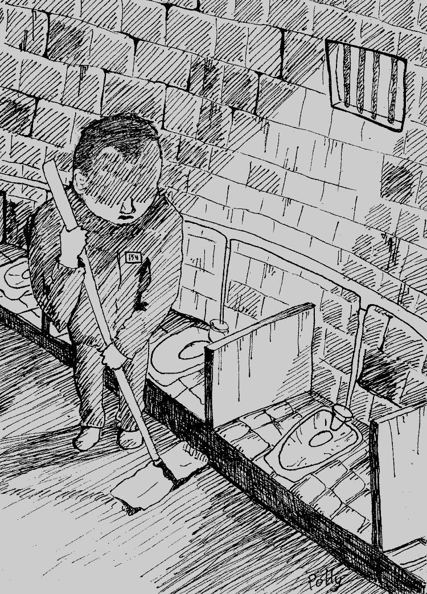

- ~~[Вступление](./1.md)~~
- ~~[Список сокращений и жаргонизмов](./2.md)~~
- ~~[ШИЗО](./3.md)~~
- ~~[Опер](./4.md)~~
- ~~[Режим](./5.md)~~
# [Неприкасаемые в тюремной иерархии](./6.md)
- [Запах](./7.md)
- [Бунт против божественной иерархии в древнегреческой мифологии](./8.md)
- [Божья кара](./9.md)
- [Бунт в карантине](./10.md)
- [Маугли](./11.md)
- [Улетевшие](./12.md)
- [Колдун](./13.md)
- [Жизнь прекрасна](./14.md)
- [Открытое письмо](./15.md)
- [Крайняя мера](./16.md)
- [Освобождение](./17.md)
- [Заключение](./18.md)

---

Тема тюремной кастовой системы постоянно поднимается в СМИ, особенно тех, которые пишут про политических заключённых. Однако почти все, кто пишет на эту тему, знают о предмете в лучшем случае из рассказов бывших сидельцев, в худшем — из распространённых в обществе стереотипов. Как итог, часто имеет место множество грубых ошибок и введение читателей в заблуждение. Именно поэтому я решил написать данную статью, цель которой — пролить свет на некоторые аспекты такого сложного и многосоставного явления, как неформальная иерархия в тюрьмах Беларуси. На эту тему написаны не то что статьи \([ru.wikipedia.org/wiki/Тюремные\_касты\_в\_странах\_бывшего\_СССР](https://ru.wikipedia.org/wiki/%D0%A2%D1%8E%D1%80%D0%B5%D0%BC%D0%BD%D1%8B%D0%B5_%D0%BA%D0%B0%D1%81%D1%82%D1%8B_%D0%B2_%D1%81%D1%82%D1%80%D0%B0%D0%BD%D0%B0%D1%85_%D0%B1%D1%8B%D0%B2%D1%88%D0%B5%D0%B3%D0%BE_%D0%A1%D0%A1%D0%A1%D0%A0)\), но даже целые научные работы. И, конечно, я не стремлюсь в рамках одной этой статьи рассмотреть всё явление в его разнообразии. Речь пойдёт главным образом об одной тюремной касте, существование которой очень сильно характеризует систему в целом, и знания о которой критично важны для любого попадающего в беларускую тюрьму, особенно политзаключённого. Это — так называемые «петухи» \(«обиженные», «опущенные», «гребни» и т. п.\) Рассмотреть эту тему в отрыве от всей тюремной системы, не вдаваясь в детали организации карательного аппарата и социальных ролей каждой из тюремных каст, достаточно тяжело. Но всё же попробую.

Итак, из этого текста вы узнаете:

- как появилась каста «опущенных» в тюрьмах;\
- каким образом в неё попадают;\
- каково положение этих людей в тюрьме и зоне \(исправительной колонии\);\
- какие функции выполняют эти люди в местах лишения свободы;\
- почему существование этой касты жизненно важно сотрудникам администрации исправительных учреждений \(ИУ\).

Закончу я рядом советов мужской части читателей, ведь для любого мужчины, живущего в Беларуси, знания о тюрьме лишними не будут, особенно если он занимается протестной активностью.

# Как появилась каста «петухов»

Начнём с экскурса в историю. Каста т. н. «петухов» традиционно ассоциируется с гомосексуальностью. И если подходить с этой точки зрения, то всё просто: проявления гомосексуальности в местах лишения свободы были всегда: и в царских тюрьмах, и в ГУЛАГе. Ввиду крайне мачистского и гомофобного характера тюремных понятий и арестантской субкультуры, становится ясно, почему гомосексуал в тюрьме автоматически заносится в низшую касту «опущенных» — мачизму свойственно презрение ко всему женскому, низведение женщин до уровня недолюдей, существ, не имеющих права на собственную волю. Это отношение переносится и на гомосексуалов. Собственно гомосексуалы — это меньшая часть касты «обиженных», в нее входит большое количество людей, совершивших проступки против неформального тюремного закона — «понятий».

И тут стоит отметить, что «петухи» как каста со строгими законами входа в неё и выхода \(точнее, невозможности выхода\) появилась не так давно. Она, например, не была свойственна царским тюрьмам и тюрьмам ГУЛАГа. Судя по тем источникам, которые читал я, появление касты тюремных неприкасаемых \(в которую и входят гомосексуалы\) относится к позднесоветскому периоду. Ряд исследователей считает, что появление касты заключённых, к которым нельзя прикасаться руками, является своеобразной реакцией воровского мира на «сучью войну» \([shalamov.ru/library/6/6.html](../extra/6.md)\) — чтобы сохранить себя, «ворам» было необходимо выдумать альтернативный убийству способ наказания провинившихся. Другие пишут, что это стало реакцией на переполнение следственных изоляторов: в обстановке скученности и нахождения на виду у сокамерников в режиме 24\\7 наиболее эффективным и жестким видом наказания будет являться всеобщее презрение и остракизм, экстремальная форма игнорирования.

# О «мастях» — небольшой ликбез

Исторически в криминальном мире существует лишь три масти \(или «образа жизни»\): «вор», «мужик», «петух». По этим ступенькам можно спускаться вниз, от высшей \(«вор»\) до низшей \(«петух»\). Вверх подняться нельзя. В современной криминальной субкультуре в Беларуси заключённые делятся на несколько иные касты, а именно: «блатной» \(«бродяга», «порядочный»\), «мужик», «козёл», «петух».

«Блатные» — это профессиональные преступники, которые живут преступным промыслом на воле. Их задача — продвигать «воровскую идею», где бы они ни находились, налаживать «чёрный ход» \(способствовать коррупции сотрудников администрации, переводить жизнь арестантов из русла официальных правил и установок в русло воровских понятий\) и т. д. Согласно понятиям, только они имеют право перевести зэка в касту «опущенных». Однако ввиду того, что далеко не во всех беларуских колониях есть «блатные» \(«воровское движение» Беларуси вообще находится в состоянии крайнего упадка\), это правило не соблюдается и в «петухи» переводит кто попало: оперативник, «козёл», а то и просто «мужики» после коллективного решения.

«Мужики» — основное население тюрьмы. «Мужик» никуда не лезет, ходит на работу, ничем не интересуется, кроме того, как уйти на УДО. Находится под «перекрёстным командованием» сразу нескольких сил: «блатных» \(если они есть\), «козлов» и администрации ИУ.

«Козёл» \(активист\) — заключённый, сотрудничающий с администрацией в открытую. Это зэк, как правило, с большим сроком, которого администрация ставит на должность и даёт некоторую власть над другими зэками. Насколько велика эта власть, зависит от степени ленивости сотрудников ИУ. Мне известны случаи, когда «козлы» составляли на других зэков акты о нарушениях, сотрудники администрации же их только подписывали. Часто «козлам» позволяют бить других арестантов для поддержания субординации. И, конечно, вполне официально в обязанности «козлов» входит доносить на других заключённых. В ИК-17 \(Шклов\), например, один «козёл» мне прямо признался: «Мне мусора сказали за тобой смотреть». Ещё как минимум двое не признавались, но «работу» свою выполняли очень активно. В моём дисциплинарном деле об отправке на тюремный режим \(крытую\) лежат письменные показания моего соседа по комнате, в которых подробно записано, как меня привели в барак, как я себя вёл, с кем общался, с кем спорил, на какие темы высказывался и т. п.

# Есть нюанс

Говоря же о касте «петухов», обязательно надо сказать, что помимо неё существует одна смежная «подкаста» — так называемые «отсаженные до выяснения», те, кто находится «на кружке». Объясняю, в чем суть: допустим, против человека выставили подозрение о том, что он, к примеру, имел гомосексуальные контакты на воле. Но весомых доказательств этому подозрению нет, есть только слухи. В таком случае, пока не наберутся подтверждения или опровержения этого обвинения, человек находится «на кружке»: он ест отдельно от остальных и только из своей посуды \(отсюда и фраза: «отсадить на кружку»\). В таком положении человек может находиться годами, до тех пор, пока «блатной» \(«козёл», или даже оперативник — в зависимости от учреждения\) не подтвердит обвинение — т. е. переведёт его окончательно в касту «петухов», либо не опровергнет его \(т. е. переведёт официально в касту «мужиков»\). Положение такого человека «на кружке» очень близко к положению «петуха», но не равно ему. Он не может пить чай с другими зэками и не имеет права голоса, однако назвать его «петухом» никто не в праве. И это *единственный случай*, когда можно перевестись из низшей касты в высшую. Зэк «на кружке» находится как бы на «карантине» — во избежание физических контактов с другими осуждёнными — вдруг он «петух» и этими контактами «зашкварит» остальных? Ведь тот, кто, к примеру, попил чай с «отсаженным», сам автоматически становится таким. В остальных случаях «отсаженный» или человек «на кружке» равно понятию «петух» и попасть в эту категорию проще простого.

# Каким образом становятся «петухами»

Идём далее. Вот вам исчерпывающий список случаев, в которых человека переводят в касту «обиженных» \(«в петушатню», «в гарем»\):

- Пассивный гомосексуализм. Человек, признавшийся в гомосексуальных контактах навечно получает ярлык «петух», «пидор» и т. п. Активный гомосексуализм при этом считается нормой и вообще не причисляется к гомосексуализму. Хотя стоит отметить, что в последние лет 10 и это понятие стало изменяться — к тем, кто имеет сексуальные контакты с «петухами» в зоне относятся настороженно. Сам я неоднократно слышал мнение, мол «какая разница, “кто кого” — и тот, и тот пидор». Однако, конечно, активного гомосексуала никто «петухом» назвать не вправе.
- Любые нетрадиционные сексуальные контакты с женщиной. Если зэк признается, что делал девушке куннилингус, либо же она делала ему минет, а после он с ней целовался\\ел\\пил из одной посуды — он «петух». Естественно, узнать об этом против воли самого человека почти нереально, поэтому в большинстве случаев люди попадают в «петушатню» после своих откровений. Нужно понимать: никто не в праве ни угрозами, ни хитростью расспрашивать вас о вашей сексуальной жизни. Об этом, кстати, в 1990-е был специальный «прогон» \(малява, содержащая правовое нововведение\) от «воров в законе», которые таким образом пытались бороться с чрезмерным количеством «петухов» в зонах. В некоторой степени с подобными проблемами пытаются бороться и сотрудники ИУ. Например, в Жодинской тюрьме перед тем, как ввести человека в камере, с ним разговаривает оперативник и наущает: «Запомни, х\*й не сосал, п\*зду не лизал\!»\
\
Сюда же стоит отнести общение с гомосексуалом по воле. Если кто-то вдруг обмолвится, что его друг — гей, то этого человека самого мгновенно определят в «петухи».
- Любые контакты с калом\\мочой и содержимым мусорок. Человек, облитый мочой, или тот, который совал руки в унитаз, автоматически становится «петухом». Поэтому, например, сантехники на большинстве зон считаются «отсаженными».\
\
Примером может стать один достаточно известный случай в ИК-5 \(Ивацевичи\). В одном из отрядов был завхоз \(главный козёл отряда\), который долго и упорно доставал одного паренька, всячески издеваясь над ним и третируя. Тот, в отместку, прямо на утренней проверке, набрав банку мочи, облил его перед всем строем. Естественно, парня избили и посадили в ШИЗО \(штрафной изолятор\). Судьба завхоза, по идее, была предрешена, однако в дело вмешались оперативники, для которых, видимо, тот был ценным кадром. Они объявили зэкам, что завхоза облили… зелёным чаем. А кто будет говорить, что он «петух», будет бит. Закончилось всё тем, что с завхозом всё равно почти никто не общался. Парня же того перекинули на другую зону.\
\
Также я лично знал «петуха», который попал в свою касту за то, что его во время драки на малолетке ударили головой об унитаз.\
\
Что касается содержимого мусорок, то этим путём попадают в касту «петухов» те, кто чрезмерно хочет курить и ищет там бычки. Сюда же стоит отнести такие случаи, как неумышленные касания чьих-либо гениталий, например, у людей, поскользнувшихся в бане.\
\
Правды ради, стоит сказать, что для людей с болезнью иногда \(в зависимости от адекватности тех, кто вправе решать\) делаются исключение. Например, если у человека недержание мочи, его не переведут в «петухи».\
\
- Выполнение любой «петушиной» работы. Строго «петушиными» видами работ считается уборка туалетов \(это относится к колонии; в СИЗО\\крытой тюрьме убирать туалет в своей камере может любой осуждённый\), в некоторых зонах — ещё и умывальников, а также вынос мусора. Совершение этих действий автоматически перенаправляет человека в касту «петухов».\
\
Вот вам пример, который произошёл в ИК-15 \(Могилёв\) в мою бытность там. «Мужик» стоял на проверке. Вдруг его «припёрло» — очень захотелось в туалет. Он побежал что есть силы, но не добежал — обгадился, не дойдя до унитаза. Будучи, видимо, человеком стыдливым и совестливым, решил за собой убрать. Взял швабру, тряпку… Это увидел кто-то из зэков и позвал завхоза, что называется, в свидетели. Завхоз пришёл и засвидетельствовал переход человека в «петухи».\
\
Неформальная норма недопустимости уборок туалетов очень удобна для сотрудников ИУ, когда нужно посадить какого-нибудь зэка в ШИЗО \(штрафной изолятор\). В каждом отряде существует официальный график уборок, не учитывающий, разумеется, кастовую систему. При этом все в курсе, что туалет убирают только «петухи». Политзаключённого Игоря Олиневича много раз сажали в ШИЗО за отказ убирать туалеты. Естественно, любой зэк в здравом уме согласится отсидеть сколько угодно суток в крошечном холодном чулане и без личных вещей, чем стать «петухом». Сотрудники ИУ это прекрасно знают и с удовольствием пользуются таким удобным орудием для прессинга неугодных.\
\
Аналогичный случай произошёл со мной в ИК-9 \(Горки\). Когда я в очередной раз отсидел в штрафном изоляторе, ко мне вскоре подошёл начальник отряда и сказал, что сегодня я по графику убираю умывальник и выношу мусор. Ещё заранее я навёл справки и узнал, что в этой зоне убирать умывальники можно только «петухам». Видимо, начальник отряда думал, что я этого не знаю и сейчас пойду чистить умывальник, поэтому в торжественной обстановке, собрав половину администрации колонии и местных козлов в свидетели, он указал мне на швабру и тряпку, предложив выполнить «дежурство по графику». Естественно, я отказался, после чего он не менее торжественным тоном сообщил: «На вас будет составлен документ об отказе выполнения дежурства». И вскоре я в очередной раз отправился греть своим телом доски в таком родном уже штрафном изоляторе.
- В «гарем» почти всегда попадают педофилы. Говорят, что в зонах насилуют насильников — однако это не так. Самое большее — с некоторыми насильниками кто-то из зэков может отказаться пить чай, но не более того. Что же касается педофилов, то у них более незавидная участь. Буквально до недавнего времени их принудительно переводили в «петушиную» касту ещё в СИЗО, даже не дожидаясь приговора. Однако веяние времени и тренд «всё по закону» и тут сыграл свою роль. Лично я встречал как минимум двух педофилов, которые не были «отсажены» и жили почти наравне с остальными. Конечно, вели они себя тише воды, ниже травы, и не каждый зэк разрешит такому присесть на свою нару или вообще с ним заговорит. Однако эта тенденция присутствует, особенно в зонах, где сидят «первоходы» \(лица, ранее не отбывавшие наказания в колониях\).
- В «гарем» попадает каждый, кто провёл некоторое время в камере с «петухами». Конкретный период времени тут варьируется. Кто-то говорит про час, кто-то про сутки. По понятиям, при попадании в такую камеру необходимо сделать так, чтобы «петухи» сами из неё ломились, оставив в ней «мужика». Однако понятно, что физически сделать это почти нереально.
- В «петухи» переводится любой человек, имевший физический \(кроме сексуального\) контакт с «петухом» либо пользовавшийся его личными вещами. На практике это выглядит так: по ошибке взял в руки посуду «петуха» либо поел из неё, попользовался средствами личной гигиены «петуха», обнял или поздоровался за руку, надел его одежду \(специально или неумышленно\), или попил с человеком чай, а он оказался «петухом» — и ты автоматически определяешься в эту касту.\
\
Давать что-либо «петуху» можно. Брать у него что-либо — значит самому стать «петухом». Однако в этих правилах есть некоторые послабления, особенно в зонах строгого режима. Например, «петухи» за сигареты стирают вещи «мужиков», «петуху» могут разрешить сесть на нару «мужика» и так далее.

Часто пишут или говорят, что в «петухи» могут определить за какие-то неблаговидные поступки против арестантского этикета. Раньше так и бывало, но не сейчас. По крайней мере, я не наблюдал ни одного такого случая. Того, кто ворует у своих, могут объявить «крысой» и всячески гнобить, того, кто сдал своих подельников на суде, могут за глаза называть «сукой» и так далее, но «опускания» за проступки — пережиток тех времён, когда в зонах Беларуси ещё были сильны воровские понятия.

Таким образом, понятие «законтаченности» чем-то сродни ритуальной нечистоты у иудеев, мусульман и парсов. И там, и там характерными признаками обычая являются иррациональность и суеверный страх перед «нечистотой». Только если, согласно Торе, человек, прикоснувшийся, например, к мертвечине, будет «нечист до вечера», то по понятиям человек, облитый мочой, будет «петухом» до конца своей жизни, даже если он освободится и заедет обратно в тюрьму через 30 лет.

# Положение «петухов» в ИУ

Что представляет собой жизнь «петуха» в зоне? Если кратко, то это полный и кромешный ад. Согласно понятиям, «петух» не имеет никаких прав. Не имеет права спорить, отвечать на оскорбления, отстаивать своё достоинство, потому что считается, что достоинства у него нет. Его можно бить, унижать, насмехаться. Когда по коридору барака идёт обычный зэк и «петух», последний обязан прислониться к стеночке, чтобы не дай Бог не задеть «мужика», иначе он может быть бит. «Петухи» выполняют всю грязную работу: мытьё туалетов \(а вы можете представить себе, что такое 8–10 «толчков» на отряд в 100 человек\), вынос мусора и тому подобное. Некоторые «петухи» оказывают сексуальные услуги другим зэкам, зарабатывая таким образом себе на чай и сигареты \(правда, надо сказать, что на тех зонах, где был я, сотрудники ИУ с этим борются и если найдут «петуха» и его клиента, предающихся «однополой любви», обоих посадят в ШИЗО\).

«Петухам» дают женские имена, называют их «она» или «малая». Признаюсь, довольно дико и тошно наблюдать, как молодые ржущие зэки обращаются, например, к 60-летнему беззубому деду «Алёнка» или «Марина».

«Петухам» ни на секунду не дают забыть о том, кто они такие. В столовую они заходят последними, моются в бане тоже последними. В клубе и ленкомнате \(комнате, где смотрят телевизор\) для них — отдельная скамейка в самом неудобном месте. Обращение «съ\*бал на\*й отсюда» в их адрес — вещь совершенно привычная и обыденная. Один уголовник мне упорно доказывал, что «“петухи” — это не люди».

Однако ещё хуже, чем зэки, к «петухам» относятся сотрудники администрации. Контролёры, а часто и офицеры, всячески их третируют, публично оскорбляют, угрожают, а в случае чего могут и избить. Будучи бесправными людьми со сломанной волей «петухи» ещё реже, чем обычные зэки, отстаивают свои права. Как итог — больше половины самоубийств, которые происходили при мне в тюрьмах и зонах, совершали именно «петухи», хотя в процентном соотношении они составляют не более 3–5 % от населения зоны. Что характерно, не лучше ситуация и в СИЗО, где «петухи» сидят в отдельных камерах. На «Володарке» такой «петушиной» камерой была 70-я. Как рассказывали парни, которые долго жили по соседству с ней, её обитатели резали себе вены едва ли не ежедневно.

# Чем они занимаются?

Жизнь «на дне», постоянная ненависть и унижения едва ли из кого-то могут сделать высокоморальное создание. По моим личным наблюдениям, большинство «петухов» люди совершенно беспринципные, подлые, готовые на всё ради собственной выгоды. Хотя, конечно, данные качества не редки среди зэков в целом, среди «петухов» они, пожалуй, распространены гораздо больше. Абсолютное большинство «петухов» работают на администрацию: стучат, выполняют «оперативные задания», провокации и т. п. Необходимость как-то выживать в сверхагрессивной и враждебной среде лагеря толкает их к союзу с наиболее сильной стороной — сотрудниками ИУ. Поэтому большинство функций, которые выполняют «петухи» так или иначе навязаны им оперативниками. В официальные обязанности «петухов» входит уборка туалетов \(никто кроме них делать это не возьмется\) и вынос мусора. Многие из них зарабатывают себе на жизнь и уборками в комнатах. «Петухов» делят на «рабочих» и «нерабочих». Первые — это те, кто за вознаграждение оказывает сексуальные услуги другим заключённым \(чай, сигареты, сладости\). Вторые — это те, которые этого не делают, и, следовательно, принудить их нельзя. Многие считают, что в «петухи» попадают через изнасилование в тюрьме или на зоне. 15–20 лет назад так оно и было. На сегодня же такое в тюрьмах Беларуси практически не встречается. По крайней мере я не знаю ни одного такого случая, и никто из тех, кто сидел со мной, ничего подобного не рассказывал. Также и случаев изнасилований «петухов» против их желания при мне не было. Сегодняшние зоны в гораздо большей степени находятся под контролем администрации, чем ранее, и «петух», которого изнасиловали, может просто написать заявление на насильника, и тому накинут срок.

# В чём выгода администрации?

Наверняка, пока вы читали эту статью, у вас возник вопрос: а почему государство и, в частности, администрация ИУ позволяет существовать в местах лишения свободы дикарской средневековой кастовой системе с её неприкасаемыми, слугами и проститутками? Ведь это негуманно, жестоко, и, в конце концов, не по закону, ведь согласно ПВР ИУ все заключённые должны подчиняться одним и тем же требованиям, и ни о каком делении на касты не может идти и речи. Неужели сотрудники ИУ не могут это пресечь и восстановить пусть строгую и жёсткую, но всё же дисциплину?

Ответ прост: им это не надо.

За достаточно долгий срок, проведённый в карательных учреждениях, я успел много где побывать и много кого увидеть. Я посидел в четырёх тюрьмах и трёх колониях, общался с простыми «мужиками» и «блатными», бандитами, наркоманами, «коммерсами» и «положенцами» \(«положенец» — это «смотрящий», назначенный на должность вором в законе\), мошенниками и убийцами, козлами и даже «петухами», и, конечно же, очень много общался с сотрудниками ИУ. Много размышляя над тем, как устроена карательная система Беларуси, я пришёл к однозначному выводу: блатная и милицейская системы руководства карательными учреждениями есть два столпа, которые поддерживают друг друга. Неформальная система понятий, придуманная «ворами», и Правила внутреннего распорядка сегодня скорее взаимно интегрировались, нежели находятся в состоянии войны и противоречия. Да, бесспорно, сотрудники ИУ насильно подчистили ту практику понятий, которая мешает управляемости и создаёт им неудобства. В частности — традиции взаимопомощи и солидарности среди зэков. В остальном мир профессиональных уголовников и мир МВД неплохо ладят. Они получают друг от друга то, что им надо: сотрудники ИУ — спокойствие в учреждении, отсутствие ЧП и управляемость \(зачем рулить сотней зэков, если можно рулить одним «блатным»\\козлом, который держит в страхе остальных?\), а «блатные»\\козлы получают привилегии и власть. Все довольны. Кроме, конечно, «мужиков», которые, как водится, оказались между двух огней и находятся, де-факто, в двойном подчинении. Многие старые арестанты, которые сидят уже более 10 лет и наблюдали за тем, как примерно с 2005 по 2010 годы все беларуские зоны из «чёрных» стали «красными», говорили мне в открытую примерно следующее: «А сейчас то же самое, что и раньше. Только вместо “блатных” — козлы. Если раньше водка и мобильники были у “бродяг”, то теперь у активистов. Если раньше за косяки “мужиков” били “блатные”, то теперь бьют козлы».

Что характерно, даже лица таких неформальных руководителей зачастую те же самые. Когда началась активная «ломка» зон и их перекраивание, как вы думаете, откуда оперативники брали верных и преданных активистов — завхозов и дневальных, готовых исполнить любой приказ? Их набирали из вчерашних «блатных», которые очень быстро предавали свою блатную идею, если им угрожали, например, отправкой в крытую или лишением привилегий, или же просто несколько раз сажали в их ШИЗО. Как результат, сегодня беларускими зонами вместе с администрацией управляют заключённые, «твёрдо вставшие на путь исправления» — при этом забитые с ног до головы воровскими татуировками, с накачанными вазелином кулаками.

Несмотря на внешнее противоречие в функциях, слияние уголовного мира и сотрудников ИУ заметно не только на институциональном, но и на лингвистическом уровне. Ни для кого из сидельцев не секрет, что сотрудники администрации не менее активно, чем зэки, используют тюремный жаргон. Как я уже писал, тех же «петухов» они гнобят и унижают похлеще, чем уголовники. Да что говорить: среди самих же сотрудников ИУ существуют свои «отсаженные», являющиеся изгоями в кругу коллег. В мою бытность на ИК-15 \(Могилёв\) там работал «отсаженный» контролёр. Коллеги не пили с ним чай, он был единственным, кто мог «шмонать» \(обыскивать\) «петухов». И такие случаи не единичны: на ИК-14 \(Новосады\), по рассказам одного моего сокамерника, был даже отсаженный офицер, о котором коллеги прознали, что он «неправильно» занимался сексом со своей женой. Как результат — они перестали пить с ним чай и стали демонстративно презирать, более того, даже зэки гнобили этого офицера совершенно безнаказанно. И таких примеров — немало.

Интересно, что многие зэки на волне ужесточения режима и относительного улучшения положения «петухов» \(лет 20 назад их били гораздо чаще, могли также и изнасиловать\) высказывали мне мнение, что скоро «“петухов” не будет, потому что всех заставят убирать толчки». При этом часто добавляя, что, мол, власти нужно «выглядеть прилично перед Европой». \(Да, попадались и такие политические аналитики\). Однако мне кажется, что этого в ближайшее время не произойдёт. Причина всё та же — существование касты «петухов» существенно облегчает управляемость зоны. Безо всякого сомнения, администрации беларуских зон могли бы заставить всех заключённых убирать туалеты и принимать пищу за одними столами независимо от «масти». Не будет по этому поводу ни бунтов, ни восстаний: максимум последствий, которыми чревато такое нововведение, — это несколько десятков особо упёртых сторонников понятий, которых придётся перевести в крытую. Большинство же зэков в Беларуси настолько забитая и бессловесная масса, что принудить их к чему угодно не составит большого труда. А если ещё и пообещать за уборку туалетов УДО — они побегут убирать их наперегонки. Однако, как видим, администрация не спешит этого делать.

Ещё один немаловажный момент: существование данной касты оказывает сотрудникам ИУ неоценимую помощь в прессинге заключённых, которые отказываются подчиняться. В любой зоне и тюрьме всегда находятся отдельные люди, которые отказываются играть по правилам, установленным милицией. Либо это асоциальные личности, которые «газуют» \(т. е. пытаются жить строго по воровским понятиям\), либо заключённые, пытающиеся отстаивать свои права, например, жалуясь в различные инстанции, либо же те, кто лишь по факту своего статуса будут подвергаться в тюрьме гонениям, например политзаключённые. Так вот, многих из перечисленных категорий людей уже не запугать ни лишением передач и свиданий, ни ШИЗО, ни ПКТ \(помещение камерного типа\), ни «крытой», ни 411-й статьёй УК. Вопрос: что же с ними делать? И тут на помощь приходит последний аргумент — «петушиная» каста. И тут даже те, кто не боится ни изолятора, ни дубинок, безусловно, задумаются. Ведь жизнь в данной касте — самое худшее, что может произойти с арестантом. Человеку с чувством собственного достоинства находиться в коллективе, обладая таким статусом, становится практически нереально. А выхода прочь из этой касты не существует.

Мне приходилось общаться с бывшим заключённым ИК-2 \(Бобруйск\), которому начальник колонии, в ответ на требования соблюдать закон и не нарушать его права ответил: «Ты что, забыл, где гарем находится?» И это далеко не единичный пример. Про использование этого орудия против политзаключённых и говорить не приходится. Лично мне известно как минимум три случая, когда политзаключённых загоняли в «петушиную» касту просто за то, что они политзаключённые. Во всех трёх случаях оперативная комбинация была очень похожей: по приезду политзаключённого в зону находится авторитетный зэк \(«блатной» или козёл\), который выдвигает против того обвинение в «косяке»: сидел ранее в одной камере с «опущенным», либо пил из «петушиной» кружки, либо же общался с «петухом» на воле. Естественно, это обвинение не имеет ничего общего с реальностью. Но, как по мановению волшебной палочки, из-под земли вырастает один или несколько свидетелей, подтверждающих: «Да, пил-пил, я сам видел\!», или «Да-да, полоскался с пидаром по воле, я сам видел\!», — хотя «обвиняемый» этих людей и знать не знает. И вот — можно выносить решение, всё по понятиям\! Результат: политзаключённый отправляется в «петушиную» касту, исполнитель \(«блатной» или «козёл»\) получает подачку в виде свидания или передачи, а хитрый оперативник, разработавший весь план, получает поощрение от начальства.

Меня, к счастью, эта участь миновала, хотя попытки, как я писал выше, были. Впрочем, очевидно, чёткой установки загнать меня в «гарем» у администрации не стояло, иначе они бы непременно это сделали.

Такое единодушие неформальных тюремных элит с администрацией в отношении политзаключённых вновь позволяет мне говорить о том, что иерархическая карательная система всегда действует в едином русле, когда необходимо подавление и выдавливание чужеродных элементов — потенциальных бунтарей, которые могут самостоятельно мыслить и отстаивать свои права. И, конечно, сами собой ложатся в эту канву аналогии с 30-ми-40-ми годами, когда уголовники приняли живое участие в ликвидации «троцкистов», «изменников родины» и прочей «58-й» \(см. В. Шаламов «Жульническая кровь», Э. Эппбаум «ГУЛАГ», А. Солженицын «Архипелаг ГУЛАГ», книга 3\).

Да, эти две головы карательной гидры могут порой грызться между собой, но тем не менее они нужны друг другу, и в момент, когда необходимо будет уничтожение нам подобных, они непременно будут вместе.

# Есть ли выход?

Здесь, думаю, будет уместно дать несколько советов, как поступать в случае, если вы, находясь в тюрьме, видите, что вас за неподчинение или за то, что «политический» \(что чаще всего\) пытаются определить или уже определили в «петушиную» касту.

Первое и самое главное — поменять своё отношение к происходящему. Всех нас, мужчин, учили, что «пидарас» — это обидно и мерзко, что быть таким позорно. И тут — коллектив взрослых и вроде как вменяемых мужчин говорит вам, что вы именно такой. Вам же необходимо в первую очередь понять, что в вашем текущем положении нет ничего постыдного или чего-то, в чём вы должны себя винить. Вы — не педофил, не насильник и даже не гей. Просто против вас использовали звериные кастовые нормы, господствующие в тюрьме, для того, чтобы сломать вашу волю и понизить ваш статус в глазах остальных.

Что же делать?

Если процесс ещё не зашёл в необратимую стадию, например, вас закинули в «петушиную» камеру, или же зэки публично провоцируют, задавая каверзные вопросы, имеет смысл сопротивляться до последнего — драться, совершать членовредительство, провоцировать любые конфликты, лишь бы выйти из данной ситуации, показать свою решимость идти до конца, отвечать на агрессию ещё большей агрессией. Если же момент упущен и вы уже в данной касте, то вам остаётся требовать у администрации своего законного права на обеспечение личной безопасности \(Статья 11 Уголовно-исполнительного кодекса РБ\) — перевода вас в безопасное место \(как правило, в одиночную камеру\). Согласно этой статье, *«при возникновении угрозы личной безопасности осужденного, он вправе обратиться с заявлением об обеспечении личной безопасности к любому должностному лицу учреждения, исполняющего наказание. В этом случае должностное лицо обязано незамедлительно принять меры по обеспечению личной безопасности осужденного».* Мне неизвестно ни одного случая, чтобы осуждённому отказали в таком требовании. Однако всё может быть, и не исключено, что для пущего эффекта человека, объявленного «отсаженным» и потребовавшего увести его из общего барака, могут специально там оставить — на ночь, например, дабы тот прочувствовал все прелести «петушиной» жизни. В этом случае, нужно быть готовым и к унижениям, и к драке, и к чему угодно. Опять же, это именно та ситуация, когда стоит идти на крайние меры в виде членовредительства или самозащиты всеми доступными способами. Стоит помнить — чем больше проблем вы создадите администрации, тем быстрее они обеспечат вам безопасность, ведь **пока что** перед администрациями ИУ не стоит цель физического уничтожения политзаключённых — речь идёт лишь о том, чтобы сломать морально. Лишний труп или инвалид в зоне им ни к чему.

Конечно, необходимо понимать, что обращение к администрации с заявлением о том, чтобы вас закрыли в одиночку, также является «косяком» с точки зрения понятий. Таких называют «ломанувшимися», «закрывшимися» и т. п. Согласно же понятиям, вы, если считаете, что вас «отсадили» «по беспределу» \(т. е. несправедливо\), должны найти вышестоящего в иерархии уголовника \(«смотрящего» или «вора в законе»\) и обратиться к нему с апелляцией, а уж никак не требовать от администрации посадить вас в безопасное место. Поступать так или иначе — решать вам. Однако моё мнение таково: апеллировать к понятиям, которые сами по себе являются инструментом ломания несогласных, как минимум недальновидно. Да и оперативники всегда найдут подход — «по-хорошему» или «по-плохому» — к любому уголовнику, который принимает решения. И между спасением вашей судьбы и собственным благополучием он однозначно выберет второе. Со мной, кстати, был подобный случай в мою бытность в «Тюрьме № 4» \(могилёвской крытой\), где правили бал «блатные». Правда, эта история заслуживает отдельного повествования.

Самое первое, что нужно сделать в подобных случаях, — это обнародовать произошедшее с вами, сообщив адвокату и родным, чтобы информация попала в СМИ. Они пока что ещё являются для политзаключённых каким-никаким щитом от откровенного произвола, поэтому необходимо прямо и открыто говорить обо всём, что с вами произошло: не стыдясь рассказывать и о кастах, и о «понятиях», и о провокациях оперативников. Ведь администрация, прессуя зэков подобным образом, как раз и играет на их мужских чувствах и ощущении стыда за то, что «я же теперь, как гомик». Благодаря этому абсолютное большинство подобных историй, происходящих, замечу, не только с политическими, никогда не выходят на волю. Люди просто стыдятся о них говорить, тем самым воспроизводя порочный круг молчания и позволяя сотрудникам ИУ и дальше использовать неформальные тюремные правила для давления на неугодных. Прекратить это можно, лишь начав говорить о проблеме вслух, поборов совершенно необоснованный стыд и страх.

Хотя побывать в подобном положении мне не доводилось, но вероятность того, что по КГБшной указке меня загонят «в гарем», я рассматривал постоянно. И путём долгих размышлений, наблюдений и анализа чужого опыта пришёл к выводу, что в случае чего буду вести себя именно так, как описано выше. Подытоживая, хотелось бы завершить это эссе чем-нибудь оптимистичным и жизнеутверждающим. Но реальность диктует немного другие тона. Количество людей, попадающих в тюрьмы за убеждения, постепенно растёт, а вместе с ними растёт и прессинг в местах лишения свободы. Немаловажной частью этого прессинга как раз и является та система каст и неформальной иерархии, которую я описал выше.

Уже не индивидуальная, а массовая система «отработки» особых категорий зэков апробируется на заключённых-наркоманах. В зонах ввели новшество: профилактический учёт для «экстремистов» — их заставляют носить [жёлтые бирки](../extra/6.2.md). Логично предположить, что в свете радикального ухудшения социально-экономического положения в стране, следующими после наркоманов, для кого создадут отдельные зоны, как раз и будут «политические».

В общем, думаю, что всем нам, тем, кто сегодня стоит за перемены и свержение диктатора, стоит оставить иллюзии и понять, что легче не будет — будет только тяжелее. Безусловно, администрации ИУ продолжат использовать против политзаключённых прессинг с помощью воровских понятий — этот инструмент удобен и не раз доказал свою эффективность. Изменить ситуацию к лучшему может только слом архаичной кастовой системы, а для начала — слом молчания и табу на обсуждения этой темы в обществе.

*12—16 июня 2016*

---

- ~~[Вступление](./1.md)~~
- ~~[Список сокращений и жаргонизмов](./2.md)~~
- ~~[ШИЗО](./3.md)~~
- ~~[Опер](./4.md)~~
- ~~[Режим](./5.md)~~
- ~~[Неприкасаемые в тюремной иерархии](./6.md)~~
# [Запах](./7.md)
- [Бунт против божественной иерархии в древнегреческой мифологии](./8.md)
- [Божья кара](./9.md)
- [Бунт в карантине](./10.md)
- [Маугли](./11.md)
- [Улетевшие](./12.md)
- [Колдун](./13.md)
- [Жизнь прекрасна](./14.md)
- [Открытое письмо](./15.md)
- [Крайняя мера](./16.md)
- [Освобождение](./17.md)
- [Заключение](./18.md)
