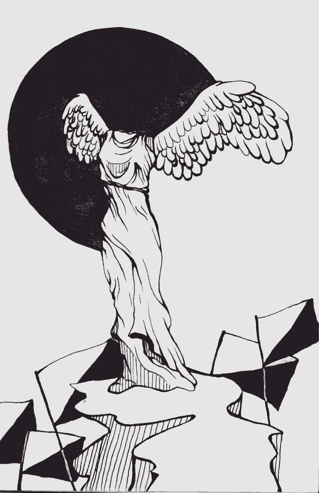

- ~~[Вступление](./1.md)~~
- ~~[Список сокращений и жаргонизмов](./2.md)~~
- ~~[ШИЗО](./3.md)~~
- ~~[Опер](./4.md)~~
- ~~[Режим](./5.md)~~
- ~~[Неприкасаемые в тюремной иерархии](./6.md)~~
- ~~[Запах](./7.md)~~
# [Бунт против божественной иерархии в древнегреческой мифологии](./8.md)
- [Божья кара](./9.md)
- [Бунт в карантине](./10.md)
- [Маугли](./11.md)
- [Улетевшие](./12.md)
- [Колдун](./13.md)
- [Жизнь прекрасна](./14.md)
- [Открытое письмо](./15.md)
- [Крайняя мера](./16.md)
- [Освобождение](./17.md)
- [Заключение](./18.md)

---

>Эту небольшую статью я написал примерно на третий месяц пребывания в одиночной камере ПКТ Шкловской колонии. Основой для неё стала широко известная в прошлом книга Н. А. Куна «Легенды и мифы Древней Греции», в которой изложен ряд древнегреческих мифов пусть в достаточно усечённой и местами цензурированной форме.\
\
Пребывание в одиночной камере приводит к тому, что вся энергия человека направляется внутрь: как правило, на мыслительный процесс. Не в силах обсудить свои мысли с кем-то, арестант изливает их на бумагу. То же было и у меня: ввиду отсутствия интеллектуального общения и возможности поделиться своими идеями, я оформлял их в какие-то статьи и заметки, чем убивал сразу двух зайцев: не позволял мозгу деградировать и давал выход жажде деятельности.\
\
Конечно, эта статья не тянет на исследование, скорее, это просто небольшой аналитический набросок, рефлексия о прочитанном. И хотя тематика тюрьмы прямо в ней не затронута, я решил включить её в сборник: некоторые из высказанных мыслей могут оказаться кому-то интересны. И пусть профессиональные историки простят меня за несколько вольное обращение с мифологическим материалом.

# Вступление

Древнегреческая мифология, будучи одновременно и религией, безусловно, исполняла и идеологические функции — те же, что религия в любом классовом обществе: обоснование социального неравенства, поддержание существующего государственного устройства, закрепление иерархии в умах людей.

О том, что греческий Олимп и схема его взаимодействия с земным миром отражает, как в зеркале, земное общество с его системой классового господства, сказано и написано немало. Подобно земным правителям, боги Олимпа требуют от людей безоговорочного признания своего превосходства, а также поклонения и материальных жертв. В случае неподчинения человека ждёт жестокая кара. Да и на самом Олимпе равенства не наблюдается. Есть главные боги и есть подчинённые. На самом верху этой пирамиды стоит Зевс.

Но, как и в земной жизни, в греческой мифологии обязательно найдется белая ворона, «деструктивный элемент», способный разрушить вековечный порядок. В нашем случае это либо тот, кто из самоуверенности и тщеславия заявит, что он равен богам и ничуть их не боится, либо тот, кто из стремления к справедливости потребует общественного равенства. И то и другое по тогдашним меркам — страшное кощунство. Любой бунт, будь то восстание масс, защищающих свои права, либо частная инициатива низкородного властолюбца, взявшего «не по чину», подлежит усмирению, а сам инсургент — наказанию. Однако сам факт наличия подобных сюжетов в древнегреческой мифологии свидетельствует о неистребимом, идущем сквозь века стремлении человека сбросить ярмо угнетения и несвободы в реальном мире, каким бы божественным ореолом это ярмо не осенялось.

В древнегреческой мифологии, таким образом, мы без труда находим события и персонажей, не признающих верховную власть богов и их родственников-полубогов, являвшихся, обычно, земными правителями. Рассмотрим самые характерные мифы этой тематики.

# Сыновья Алоэя

От и Эфиальт — сыновья Алоэя, рожденного, в свою очередь, от Посейдона и Канаки. Два этих сына были горды и не желали подчиняться никому. С детства они были храбрыми и сильными, отличаясь при этом необычайным ростом. Свое противостояние с богами они начали с того, что сковали цепями и заключили в темницу Ареса, бога войны. В темнице Арес томился долгих 30 месяцев, пока его не освободил Гермес.

Осмелев, От и Эфиаль стали грозить остальным богам:

— Дайте нам только возмужать, мы нагромоздим одна на другую горы Олимп, Пелион и Гессу, взойдем к вам и похитим у вас Геру и Артемиду\!

Ответом на эти, уже нешуточные, угрозы, стали стрелы Апполона, пронзившие бунтарей. Отметим особо — сыновья Алоэя были из числа смертных.

От и Эфиальт умерли сравнительно быстро, и поэтому, как увидим позже, по сравнению с другими непокорными им еще повезло.

# Арахна

Арахна — лидийская ткачиха, чьи работы славились на всю округу. Однажды, в пылу тщеславия, она заявила:

— Пусть приходит сама Афина-Паллада состязаться со мной\! Не победить ей меня.

Афина явилась к Арахне под видом сгорбленной старухи, но прежде чем наказывать ткачиху, решила попробовать обойтись воспитательными мерами, а именно посоветовала Арахне состязаться лишь со смертными и поскорей молить Афину, чтобы та простила её надменные слова. Арахна не вняла совету старухи, грубо пресекла ее и лишь посетовала: «Чего же Афина не идет?» Тогда богиня приняла свой истинный образ. Нимфы и лидийские женщины тут же склонились перед Афиной и славили ее. Но не такова была Арахна — она проигнорировала богиню, не воздав ей ни малейшей почести, и только настояла на скорейшем начале состязания. Обратим внимание: судей на нем не было, они не избирались и не были назначены, хотя, казалось бы, куда в этой ситуации без них.

Афина сплела полотно с изображением своего с Посейдоном спора за власть над Аттикой. А по углам полотна она изобразила, как боги карают людей за непокорность \(прозрачный намек\). Арахна, в свою очередь, выткала на полотне сцены из жизни богов, где, однако, боги были представлены одержимыми человеческими страстями \(а именно такими боги, заметим, и были на самом деле\) и вообще без должного к ним уважения. Отмечается, работа Арахны по совершенству ничуть не уступала работе Афины. Что же делать богине? Как быть? Признать свое поражение? Конечно, это было немыслимым. Решение Афины было простым, как вертикаль власти. Она ударила Арахну челноком, а полотно лидийской ткачихи разорвала. Не вынеся позора, Арахна свила веревку, сделал петлю и повесилась. Однако мстительной Афине даже такой исход показался недостаточно назидательным. Она достала Арахну из петли, оживила и превратила в паука, обрекая, тем самым, на пожизненное занятие ткачеством.

Весь этот миф — просто-напросто квинтэссенция вопиющей несправедливости, основанной на «природном» неравенстве. Посудите сами, Арахна, вызвав Афину на честный поединок, рассчитывала на то, что и между богами и людьми должны быть единые для всех «правила игры», и что и ей, смертной, может достаться победа, если объективно она одержит верх. Такой взгляд на вещи предполагает большое доверие к сопернику, игру «на честность», ведь, вспомним, даже судей на состязании не было. Таким образом, поступок Афины выглядит вероломным и предательским, что, впрочем, саму Афину ничуть не смутило. Богиня доступно показала и Арахне, и всем окружающим, что она не Руссо и не Вольтер, и принцип равенства всех перед законом чужд ей в принципе. Зато вполне приемлемо «право сильного». Ведь, применив насилие в случае, когда ее соперница, как минимум, не проиграла, Афина подчеркнула изначальное, «неоспоримое» неравенство богов и смертных, в связи с которым вторые не могут рассчитывать даже на малейшую толику справедливого отношения со стороны первых. Этот миф всем своим содержанием как бы утверждает: «Будь ты хоть семи пядей во лбу, будь ты хоть сто раз прав, боги все равно могут растоптать тебя просто потому, что они — боги».

# Прометей

Прометей — титан, сын богини Фемиды. В прошлом союзник Зевса в битве за власть на Олимпе, он впал к громовержцу в немилость за приверженность идеалам гуманизма. Живя на Олимпе в атмосфере вечного праздника, ни в чем не нуждаясь, он пожалел простых смертных. Видя страдания, на которые они обречены богами, он похитил из кузницы своего друга Гефеста \(кстати, сына Зевса\) огонь, после чего доставил его людям. Мало того, Прометей, спустившись на землю, продолжал оказывать помощь смертным: одомашнил дикого быка, впряг лошадь в колесницу, научил людей искусствам, чтению, счету, письму, кораблестроению, открыл им силу трав.

Обратим внимание на то, что Прометей не просто дал людям какой-то разовый инструмент для облегчения жизни, а помог им усмирить силы природы, которые в то время отождествлялись непосредственно с силой богов. Тем самым Прометей сделал их гораздо более независимыми. Входило ли это в планы Зевса? Едва ли. Его слуги привели Прометея к скале, а приковать его к ней было поручено его же другу Гефесту, он же должен был пронзить грудь Прометея, прибив его к скале остриём. Мучаясь угрызениями совести, но не в силах противиться воле отца, Гефест проделывает все это.

Но есть ещё один аспект, не дающий Зевсу покоя, умножающий его гнев и подозрение к Прометею. Прометей знает тайну: как и когда Зевсу суждено быть низвергнутым с Олимпа, лишившись власти. Зевс рассчитывает, конечно, выпытать эту тайну у Прометея.

Один за другим посещают Прометея разнообразные божества: Океан, Океаниды, Гермес, на все лады уговаривая его покориться и открыть Зевсу тайну. Но Прометей остаётся непреклонен. С Гермесом он вообще был предельно прямолинеен:

— Я не променяю своих скорбей на рабское служение Зевсу. Мне лучше быть прикованным к этой скале, чем стать верным слугой тирана Зевса. Нет такой казни, таких мук, которыми бы мог он устрашить меня и вырвать из моих уст хоть одно слово\!

Ну чем не революционер?

За эту непокорность Зевс низвергает скалу с Прометеем в вечный мрак, где тот проводит долгие века. Подняв его вновь, Зевс уже готовит Прометею новую проверку на прочность революционного духа. Каждое утро к скале прилетает орел, который улетает, лишь выклевав Прометею печень.

За ночь печень отрастает, и с утра пытка повторяется. В то время, как низвергнутые Зевсом в период борьбы за власть титаны уже прощены и возвращены из Тартара на поверхность, как признавшие власть громовержца, Прометей остаётся непреклонным и с гордостью переносит свои страдания. \(Заметим, участь заядлых врагов Зевса оказалась куда завидней участи попавшего в немилость союзника…\) К нему приходит мать — Фемида и герой — Геракл, и все просят об одном: признать итоги выб.., тьфу, то есть признать Зевса верховным правителем и открыть ему Тайну. По-рыцарски отнёсся к Прометею Геракл: убил орла, так долго терзавшего титана. Тут же с Олимпа прилетел Гермес и в очередной раз пообещал Прометею свободу в обмен на Тайну. И тут в борце за справедливость что-то надломилось. Прометей сказал Зевсу, как избежать свержения: олимпийскому альфа-самцу всего лишь надо держаться подальше от морской богини Фетиды, ибо любой сын, рожденный ею, будет могущественней отца.

Так Прометей обрёл свободу взамен на исполнение воли Зевса.

Миф о Прометее примечателен именно мотивацией, подвигшей героя на преступление против божественного порядка управления. Это не похоть и не упоение своей молодецкой силой, как у Ота и Эфльта, не самолюбование, вызванное наличием выдающихся художественных способностей, как у Арахны. В случае с Прометеем мотивация — живое сострадание, любовь к людям, чувство справедливости и неприятие рабства. И не важно, что Прометей, спустя долгие века, сломался, не выдержав мук. Отметим особо: будучи бессмертным титаном, он имел всё, был обласкан правителем и был вхож в высшие эшелоны власти. Однако всем этим о пожертвовал, чтобы чуточку уменьшить страдание людей в этом мире. Скажем прямо: Прометей — первый известный нам гуманист.

# Терсит

Вершиной эгалитарных эпизодов мифологии Древней Греции, на мой взгляд, является эпизод из Троянского цикла с воином по имени Терсит в главной роли. Речь здесь идёт уже не об индивидуальном бунте, а о попытке поднять народное восстание. Но обо всем по порядку.

Напомним фабулу Троянского цикла: сын царя Трои, Парис, посетив в Лаконии дворец местного царя, Менелая, будучи принят как почетный гость, вероломно увез из дворца его жену — прекрасную Елену. \(Кстати, внебрачную дочь Зевса\). Менелай стерпеть такого унижения не мог и, посоветовавшись со своим братом Агамемноном, решил пойти войной на Трою, дабы отомстить Парису и вернуть свою жену. Привлечь к этому походу в качестве хедлайнеров ему удалось едва ли не весь пантеон тогдашних героев: братьев Аяксов, Одиссея, Ахилла и многих других. Все они были высшей аристократией, сыновьями и внуками царей, а также богов и полубогов — обратим внимание на этот факт, он предельно важен. Помимо их, в походе приняли участие 100 тысяч воинов — очевидно, не аристократов, а свободных горожан и земледельцев. Осада Трои длилась 10 лет. На десятый год как раз и произошло интересующее нас событие.

Агамнемон решил в очередной раз напасть на троянцев под стенами города. Однако прежде он пожелал испытать свои войска на верность. Созвав народное собрание из всех имевшихся воинов, он обратился к ним, говоря о тяготах войны, бесплодности осады и о том, что, видимо, богам угодно, чтобы греки победили. Реакция воинов была мгновенной: как всколыхнувшееся море они бросились к кораблям, радуясь возможности вернуться на родину. Оно и понятно — простой парень из эллинской глубинки едва ли страстно желал драться и умирать ради амурных предпочтений местного царька.

Тут на сцену вышла уже знакомая нам Афина-Паллада. Отметим, кстати, важный момент: миф о Трое это не сказка, не плод фантазии автора а, скорее, мифологизированная история — ведь он, не смотря на наличие сказочных персонажей, основан на реальных событиях. Так что и рассматривать произошедшее в дальнейшем мы будем как летопись исторических событий.

И вот, явившись к Одиссею, Афина-Паллада говорит, чтоб тот скорей вернул воинов на место. Дважды повторять Одиссею не надо. Выхватив у Агамнемона скипетр \(знак верховной власти\), царь Итаки стал активно убеждать воинов вернуться на собрание, столь активно, что скипетр ходуном заходил по спинам и головам дезертиров.

Автор умалчивает о том, были ли жертвы от этого «убеждения», но мне представляется, что не убив одного или нескольких воинов Одиссей едва ли мог остановить такую массу людей. А это у него получилось: воины вернулись на собрание и затихли, и лишь один Терсит не угомонился и стал кричать. Терсит, сообщает автор, всегда смело выступал против царей. \(Правды ради заметим, что Терсит сам был родственником Диомеда, царя Аргоса\). В этот раз он ополчился против Агамнемона, говоря, что тот уже взял себе много добычи и невольниц, и пора бы уже насытиться, а им, простым воинам, пора вернуться на родину. Агамнемона же оставить под Троей одного — пусть воюет\! А теперь вспомним, кем приходились большинство царей богам и станет понятно, как далеко замахнулся Терсит, на кого возвысил голос. В принципе, все в словах Терсита было логично и справедливо, однако дальше начинаются совсем уж странные вещи. К Терситу подошел Одиссей и сказал:

— Не смей, глупец, поносить царей, не смей говорить о возвращении на родину\! Если я еще раз услышу, как ты, безумец, поносишь царя Агамнемона, то пусть лучше снесут мне с могучих плеч голову, пусть не зовут меня отцом Телемаха, коль не схвачу я тебя, не сорву с тебя всю одежду, и, избив тебя, не прогоню от народного собрания к кораблям, плачущего от боли.

В подтверждение своих слов Одиссей огрел Терсита скипетром по спине, да так, что у того из глаз хлынули слёзы. Далее, по словам автора, все громко смеялись и, глядя на Терсита, говорили:

— Много славных дел совершил Одиссей и в совете и в бою, но это славнейший из его подвигов. Как обуздал он крикуна\! Теперь не отважится он больше поносить любимых Зевсом царей.

Тут, мне думается, автор очень грешит против истины, выставляя всех греческих воинов безнадежными идиотами без собственного мнения. Посудите сами: еще несколько минут назад воины рвались к своим кораблям, позабыв о «любимых Зевсом царях», и только грубая сила и авторитет Одиссея смогли вернуть их на место. И тут же тысячи воинов, только что мечтавших поступить так, как предлагает Терсит, начинают смеяться над ним, хотя он выразил чаяния всех и каждого из них. Не будем забывать, что зачастую исторические события в летописях и мифах изменяются в угоду правящему классу, в нашем случае — в угоду царям-аристократам и их родне, которые, конечно, были заинтересованы в том, чтобы очернить Терсита, выставив его этаким фриком, крикуном, которого бьют смеха ради. Скорее всего поступку Одиссея обрадовались и громко хвалили его такие же, как и сам он: цари, «голубая кровь» греческого войска, и, возможно, приближенные к ним воины из рядовых. Простые воины, мне думается, с грустью смотрели на эту сцену, но не решались открыто выступить в поддержку Терсита: за 9 лет осады они привыкли подчиняться своим вождям, да и к тому же прекрасно понимали, что в случае бунта Одиссея незамедлительно поддержит верхушка армии — отлично экипированные и опытные воины-аристократы и их приближенные. Поэтому именно сжавши зубы от злости и страха, а не весело хохоча, смотрели рядовые на унижение Терсита; такая версия, на мой взгляд, куда более правдоподобна.

Но на этом история Терсита не закончилась.

Из далекого Понта на помощь троянцам прибыли амазонки — в очередной раз закипел бой, в котором женщины сражались под предводительством царицы Пенсефилии. В пылу сражения она была убита Ахиллом. Глядя на Пенсефилию, Ахилл понимает, что любит ее и в печали склоняет голову над убитой. Тут бы Пенсефилии открыть полные чувства глаза, Ахиллу — обнаружить под ее туникой бронежилет и поцеловать возлюбленную на фоне разгорающейся битвы, но всю малину вновь портит некстати объявившийся Терсит. Подойдя к Ахиллу, он стал бранить его \(правда, из текста не ясно, за что\), а потом, видимо, решив особо изощренным способом уязвить его, взял копье и проткнул им глаз мертвой Пенсефилии. Оправившись от шока, Ахилл ударил Терсита по лицу с такой силой, что убил его на месте. Бесславно закончилась жизнь этого персонажа, которого автор Троянского цикла так усердно обливал грязью.

Но попробуем и в этом эпизоде объективно взглянуть на произошедшее, руководствуясь здравым смыслом.

Во-первых, Ахилл принадлежал к героям-полубогам и был кровно заинтересован в победе греков над Троей — эта победа давала ему богатую добычу \(в т. ч. рабов\) и, наверняка, расширение своих владений, не говоря уже о славе и престиже. Во-вторых, до вступления Ахилла в бой \(он ввязался в битву, когда она уже шла\), амазонки серьезно теснили греков — те стали отступать и уже почти были прижаты к своим кораблям. Еще немного, и они сели бы в эти корабли. А куда бы они поплыли, сев в них, Ахиллу было предельно ясно. Для вождей сложилась крайне неприятная ситуация… Достаточно было малейшей искорки, например, клича того же Терсита, и войско, показав тылы, «делает ручкой» своим начальникам: воюйте, мол, сами, а мы — домой. Прецедент уже был и он, конечно, свеж в памяти у Ахилла. В этой ситуации аристократия решила действовать на опережение, и в суматохе боя Ахилл убивает такого неудобного борца, как Терсит, ведь он может в любой момент воспользоваться ситуацией и взять реванш за недавний позор. Однако прямое убийство равного себе было формально непозволительно даже для Ахилла \(ему пришлось впоследствии даже плыть на Лесбос, чтобы жертвоприношениями Аполлону и Артемиде очиститься от скверны пролитой крови\), и автору мифа-летописи было жизненно необходимо дать убийству достойное оправдание, такое же, какое, видимо, дал сам Ахилл в кругу аристократов: Терсит-безумец измывался-де над мертвым телом… На самом же деле Ахилл попросту воспользовался \(возможно, даже, по предварительной договореннности с другими аристократами\) случаем, идеально подходившим для устранения опасного бунтовщика. Не буду утверждать, что эта версия событий единственно верная, но, думается, она вполне имеет право на существование.

# Заключение

Всех героев-бунтарей из греческих мифов, как «простых смертных», так и бессмертных, объединяет одно: все они, говоря по-простому, плохо кончили. Либо вынуждены были склониться перед волей богов, и потому лишь получали прощение, либо безжалостно уничтожались. Ни один не одержал победу в этом противостоянии. И это вполне закономерно, иначе и быть не могло — в древнегреческом мифе \(да и, пожалуй, в древнегреческом сознании\) просто не нашлось бы места такому персонажу, он выпадал бы из системы координат. Арахна побеждает в соревновании с Афиной и та, опустив голову, уходит с «поля боя». От и Эфиальт весело проводят время с женой Зевса… Такое для гревнегреческого мифа, конечно, немыслимо. Отсюда вытекает важнейшая функция древнегреческой религии — воспитательно-идеологическая. Мифы были призваны со всей поучительностью показать: спор с богами и их наместниками на земле \(царями, знатью\) бесполезен, губителен для спорщика, а единственным его итогом станет безоговорочная победа вышестоящей по иерархии персоны. Так, через подчинение вождям небесным, в людях вырабатывали привычку подчиняться вождям земным.

Но, заглянув за ширму назидания и поучения, мы увидим самое главное — то, что двигало Одиссеем, бившим Терсита, Зевсом, терзавшим Прометея, Афиной, доведшей Арахну до самоубийства. Мы увидим страх. Страх богов, казалось бы, могущественных и неуязвимых, перед огромной бесправной массой смертных, среди которой раз за разом рождаются смельчаки, открыто выступающие против «вековечного» порядка. И здесь становится ясно: мифология лишь отражает вполне реальный вековечный ужас правителей перед малейшей вероятностью народного восстания.

Впрочем, как ни пугали греческий народ поучительными мифами, а в нем неизбежно появлялись и продолжают появляться новые Терситы и Прометеи. И, хочется верить, однажды они заставят Олимп содрогнуться.

*Октябрь—ноябрь 2012*

---
 
Кто возомнил себя хозяином небес, \
Того низвергнут в ад его же дети.\
И с Хроносом, имевшим всё на свете,\
Так поступили Посейдон и Зевс\
\
Без страха пред Афиной став,\
Её Арахна вызвала на спор\
Бил консулов вчерашний гладиатор\
За сто лет до распятия Христа\
\
На власть восстать не каждому дано\
Вслух объявить, что мёртв холодный идол,\
И, хотя в жизни равенства не видел,\
Меж громовержцем и рабом поставить знак «равно»\
\
Хоть и сегодня не стихает свист плетей,\
Герои прошлого, вы нами не забыты\!\
В Сети вещают новые Терситы\
И льёт бензин в бутылки новый Прометей…\

*Март 2015*

---

- ~~[Вступление](./1.md)~~
- ~~[Список сокращений и жаргонизмов](./2.md)~~
- ~~[ШИЗО](./3.md)~~
- ~~[Опер](./4.md)~~
- ~~[Режим](./5.md)~~
- ~~[Неприкасаемые в тюремной иерархии](./6.md)~~
- ~~[Запах](./7.md)~~
- ~~[Бунт против божественной иерархии в древнегреческой мифологии](./8.md)~~
# [Божья кара](./9.md)
- [Бунт в карантине](./10.md)
- [Маугли](./11.md)
- [Улетевшие](./12.md)
- [Колдун](./13.md)
- [Жизнь прекрасна](./14.md)
- [Открытое письмо](./15.md)
- [Крайняя мера](./16.md)
- [Освобождение](./17.md)
- [Заключение](./18.md)
