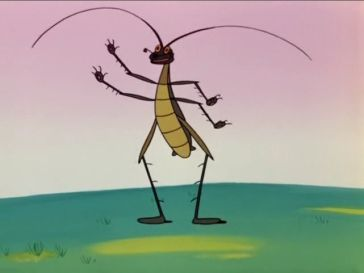

Корней Чуковский

Стих написан [весной 1921 года](https://ru.wikipedia.org/wiki/%D0%A2%D0%B0%D1%80%D0%B0%D0%BA%D0%B0%D0%BD%D0%B8%D1%89%D0%B5).

# Часть первая

Ехали медведи  
На велосипеде.  

А за ними кот  
Задом наперёд.  
  
А за ним комарики  
На воздушном шарике.  
  
А за ними раки  
На хромой собаке.  
  
Волки на кобыле.  
Львы в автомобиле.  
  
Зайчики  
в трамвайчике. 
  
Жаба на метле… 
  
Едут и смеются, 
Пряники жуют. 
  
Вдруг из подворотни  
Страшный великан,  
Рыжий и усатый  
Та-ра-кан!  
Таракан, Таракан, Тараканище! 
  
Он рычит, и кричит,  
И усами шевелит:  
«Погодите, не спешите,  
Я вас мигом проглочу!  
Проглочу, проглочу, не помилую».  
  
Звери задрожали,  
В обморок упали.  
  
Волки от испуга  
Скушали друг друга.  
 
Бедный крокодил  
Жабу проглотил.  
  
А слониха, вся дрожа,  
Так и села на ежа.  
  
Только раки-забияки  
Не боятся бою-драки;  
Хоть и пятятся назад,  
Но усами шевелят  
И кричат великану усатому:  
  
«Не кричи и не рычи,  
Мы и сами усачи,  
Можем мы и сами  
Шевелить усами!»  
И назад еще дальше попятились.  
  
И сказал Гиппопотам  
Крокодилам и китам:  
  
«Кто злодея не боится  
И с чудовищем сразится,  
Я тому богатырю  
Двух лягушек подарю  
И еловую шишку пожалую!»  
  
«Не боимся мы его,  
Великана твоего:  
Мы зубами,  
Мы клыками,  
Мы копытами его!»  
  
И весёлою гурьбой  
Звери кинулися в бой.  
  
Но, увидев усача  
(Ай-ай-ай!),  
Звери дали стрекоча  
(Ай-ай-ай!).  
  
По лесам, по полям разбежалися:  
Тараканьих усов испугалися.  
  
И вскричал Гиппопотам:  
«Что за стыд, что за срам!  
Эй, быки и носороги,  
Выходите из берлоги  
И врага  
На рога  
Поднимите-ка!»  
  
Но быки и носороги  
Отвечают из берлоги:  
«Мы врага бы  
На рога бы,  
Только шкура дорога,  
И рога нынче тоже не дёшевы».  
  
И сидят и дрожат под кусточками,  
За болотными прячутся кочками.  
  
Крокодилы в крапиву забилися,  
И в канаве слоны схоронилися.  
  
Только и слышно, как зубы стучат,  
Только и видно, как уши дрожат.  
  
А лихие обезьяны  
Подхватили чемоданы  
И скорее со всех ног  
Наутёк.  
  
И акула  
Увильнула,  
Только хвостиком махнула.  
  
А за нею каракатица —  
Так и пятится,  
Так и катится.  
  

# Часть вторая
 
Вот и стал Таракан победителем,  
И лесов и полей повелителем.  
Покорилися звери усатому  
(Чтоб ему провалиться, проклятому!).  
А он между ними похаживает,  
Золоченое брюхо поглаживает:  
«Принесите-ка мне, звери, ваших детушек,  
Я сегодня их за ужином скушаю!»  
  
Бедные, бедные звери!  
Воют, рыдают, ревут!  
В каждой берлоге  
И в каждой пещере  
Злого обжору клянут.  
  
Да и какая же мать  
Согласится отдать  
Своего дорогого ребёнка —  
Медвежонка, волчонка, слонёнка, —  
Чтоб ненасытное чучело  
Бедную крошку замучило!  
  
Плачут они, убиваются,  
С малышами навеки прощаются.  
  
Но однажды поутру  
Прискакала кенгуру.  
Увидала усача,  
Закричала сгоряча:  
«Разве это великан?  
(Ха-ха-ха!)  
Это просто таракан!  
(Ха-ха-ха!)  
  
Таракан, таракан, таракашечка,  
Жидконогая козявочка-букашечка.  
И не стыдно вам?  
Не обидно вам?  
Вы — зубастые,  
Вы — клыкастые,  
А малявочке  
Поклонилися,  
А козявочке  
Покорилися!»  
  
Испугались бегемоты,  
Зашептали: «Что ты, что ты!  
Уходи-ка ты отсюда!  
Как бы не было нам худа!»  
  
Только вдруг из-за кусточка,  
Из-за синего лесочка,  
Из далёких из полей  
Прилетает Воробей.  
Прыг да прыг!  
Да чик-чирик,  
Чики-рики-чик-чирик!  
  
Взял и клюнул Таракана —  
Вот и нету великана.  
Поделом великану досталося,  
И усов от него не осталося.  
  
То-то рада, то-то рада  
Вся звериная семья,  
Прославляют, поздравляют  
Удалого Воробья!  
  
Ослы ему славу по нотам поют,  
Козлы бородою дорогу метут,  
Бараны, бараны  
Стучат в барабаны!  
Сычи-трубачи  
Трубят!  
Грачи с каланчи  
Кричат!  
Летучие мыши  
На крыше  
Платочками машут  
И пляшут.  
  
А слониха-щеголиха  
Так отплясывает лихо,  
Что румяная луна  
В небе задрожала  
И на бедного слона  
Кубарем упала.  
  
Вот была потом забота —  
За луной нырять в болото  
И гвоздями к небесам приколачивать!
