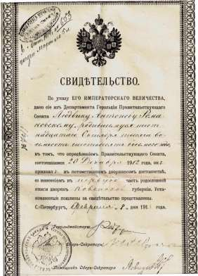

1. [**Про мой род, себя и нашу элиту**](./01.md)
2. [Бацькаўшчына](./02.md)
3. [Академия — завод — университет](./03.md)
4. [МРТИ — хорошо, БГУ — лучше](./04.md)
5. [Чернобыль](./05.md)
6. [В Москву, к властям](./06.md)
7. [Дорога к Вискулям](./07.md)
8. [Народы малочисленные и к ним приравненные](./08.md)
9. [Если б знал я, с кем еду, с кем водку пью…](./09.md)
10. [Беловежская пуща, Вискули, 7—8 декабря 1991 года](./10.md)
11. [Беларусь — Соединённые Штаты](./11.md)
12. [Интеллигенция и политика](./12.md)
13. [О университетах и ВУЗах, степенях и лекциях](./13.md)
14. [О «моём» зарубежье](./14.md)
15. [Патология](./15.md)
16. [Через годы, через расстояния](./16.md)

---

# Деды, родители, семья

До 1997 года я очень гордился своим «рабоче-крестьянским» происхождением. Отец моей матери Людвиг Романовский работал железнодорожником на Любаво-Роменской дороге. Он умер, когда мне не было и трёх лет, но я его помню! Точнее помню его сапоги, край которых мешал мне сидеть у него на коленях, после того, как я опрокинул в нашем саду на свою голую ногу раскалённую самоварную трубу. Дед успокаивал меня и говорил, что если бы я, как он, был в сапогах, то труба бы меня не обожгла.

Соседки нередко говорили его вдове — моей бабушке.
— Франтишка, ты счастливый человек, прожила с Людвигом интересную жизнь, родила 12 детей, была женой хорошо зарабатывающего человека — кондуктора.

Бабушка их поправляла.

— Обер-кондуктора!

Что такое «обер», я понял сравнительно поздно, а до того считал деда очень важным большим начальником. Реалии же были простыми: дед в любую погоду — хорошую и ненастную — ездил с керосиновым красным фонарём в хвосте товарного поезда.

Хорошо помню главную драгоценность дедовского наследства — карманные часы «Буре» в чугунном корпусе. Бабушка очень ими дорожила и берегла, как реликвию, но во время фашистской оккупации поменяла их на хлеб и кусочек сала для меня и сестры. Такие часы были только у железнодорожников-машинистов. Дед получил их в награду за то, что смело действовал, когда несколько вагонов случайно оторвались от товарного состава и остановились. Дед с фонарём побежал в сторону, противоположную движению и предотвратил аварию — остановил следующий поезд.

Трое из двенадцати бабушкиных детей умерли в детстве. Остальные выросли и оказались разбросанными по Беларуси, России, Литве и Польше.

Судьба некоторых из них оказалась трагической. Младшая — Ядвига — окончила педагогический институт и работала учительницей в школе на станции Красный Берег. Во время оккупации её муж — Семён Караваевский — был командиром партизанского отряда. Она, будучи беременной, находилась дома и, увидев полицаев, спряталась на чердаке, не успев захватить с собой тёплую одежду. Полицаи это поняли и отбросили лестницу-стремянку от чердачного проёма. Тётя Ядя, слезая без лестницы, свалилась, сильно ушиблась и умерла, оставив круглыми сиротами троих детей, так как муж её тоже погиб через несколько дней.

В конце второго тысячелетия моя сестра разыскала документ, согласно которому в 1912 году наш дед Людвиг был восстановлен в дворянском звании. Хорошо, что это произошло в постсоветское время, а то ведь могла случиться очередная кампания борьбы с наследниками потенциальных противников казарменного коммунизма.

Знаю только одно, что дед мой был простым тружеником. Всё, что было сделано его руками, заслуживало самой серьёзной похвалы: просто, прочно, надёжно. Он, как и бабушка Франя, считал труд источником благополучия и не относился свысока ни к какой работе. Когда у деда ухудшилось здоровье, он пошёл работать банщиком. Простым банщиком в общественной бане: принимал и выдавал одежду и тазики, убирал моечное отделение и раздевалку. Бабушка Франя до 91 года ходила с мешком по пустырям и стройкам за травой для своей козы, молоко которой оставалось ощутимым подспорьем в нашем семейном бюджете.

Деда со стороны отца — Петра Иосифовича Шушкевича — помню с начала войны. Его жена Розалия Викентьевна умерла, когда мне не было и двух лет. У них тоже была многодетная семья, и её члены тоже оказались разбросанными по всему СССР.

Зиму 1941—1942 годов я провёл в деревне Щитомиричи у деда Петра в 14 километрах, как считалось тогда, от Минска. Непосредственно перед началом войны дед завершил строительство нового дома с большими окнами и деревянным полом — самого близкого строения в деревне от дороги Минск-Слуцк. По-видимому, именно поэтому оккупанты деда с семьёй из дома выгнали. Дед вернулся в хату — старый дом — основательно прогнивший с глинобитным полом и двумя маленькими окнами.

В центре одной общей для всех комнаты стояла большая русская печь. Бабка Вера — женщина, на которой дед женился в 1939 году, пекла вкуснющие блины из теста, замешиваемого вечером перед днём выпечки из ржаной муки на закваске. Закваской служила часть теста, оставленного в деревянной дежке от предыдущей выпечки.

Один раз в 12—15 дней бабка Вера выпекала на той же закваске хлеб. После того как печь была основательно протоплена, она бросала на чисто выметенный специальным веником печной под увесистые комки теста овальной формы, похлопывала по ним деревянной лопатой, и закрывала печную заслонку. Через час-полтора комки превращались в большие чёрные буханки хлеба. И сколько бы ни убеждали меня, что сейчас можно купить хлеб более вкусный, я не верю. В городе в ту зиму было очень голодно, а в деревне довольно — сытно. Часто на завтрак были блины. На обед — крупник, борщ или щи, заправленные шкварочками, краюха хлеба и кружка молока на ужин.

Как настроила меня мама и как получалось в мои семь лет, я старался помогать деду и бабке Вере по хозяйству, но моя помощь была, увы, не тем, чего им не хватало в тяжёлой деревенской жизни. Меня же без моих уличных друзей и домашней библиотеки одолевала скука. Дедовы книжки остались в новом доме, куда входить было запрещено, а сюда, в старый, он сумел забрать только самое нужное —календари колхозника за добрый десяток лет, библию на церковно-славянском и журналы «Пчеловодство», тоже лет за десять. Всё это нужно было деду, убеждённому мичуринцу, сад и пасека которого славились далеко за пределами деревни Щитомиричи. Но его книжки меня мало увлекали.

К незабываемому в детстве я отношу и лето в деревне в 1942 году. Большинство крестьян в Щитомиричах были тогда безлошадным. Колхозных лошадей отдали отступающим красноармейцам. У деда была кобыла Машка, которую, наоборот, красноармейцы отдали ему. Он упросил их Машку не пристреливать, когда она сломала ногу. Дед полную безнадёгу, как говорили в деревне, выходил, постоянно советуясь со своим давним приятелем, имевшим какое-то представление о ветеринарии. В итоге Машка, хотя и основательно хромала, но выполняла все нужные крестьянину лошадиные работы. Меня же она страшно обидела. Когда я, взобравшись на машкину спину, направил её к водопою — небольшому озерцу, она так сильно наклонила голову к воде, что я съехал по лошадиному загривку в воду. К вечеру по всей деревне распространилось известие: хромая Машка чуть не утопила этого городского неумеку малого Шушкевича в озерце, глубина которого доходит до ушей даже взрослым, если встать на голову.

Мои родители — мать Елена Романовская и отец — Станислав Шушкевич были интеллигентами в первом поколении, детьми белорусских крестьян, но как позднее выяснилось, и обедневшей шляхты. Они учились в одной университетской студенческой группе и получили дипломы филологов с правом преподавания белорусского, русского и польского языков. Оба довольно успешно занимались писательской деятельностью и были приняты в Союз писателей СССР: мать в 1934 году, отец в 1935.

В то время мои родители искренне верили, что в Советском Союзе строится самое справедливое общество на Земле. Фактически, они воспевали социалистический строй и учили ненавидеть его врагов — рифмовали иллюзии, как скажет позднее уважаемый журналист.

Членский билет матери подписан Максимом Горьким, сохранился и является семейной реликвией. Отцовский билет конфисковали при аресте в конце 1936 года, когда он был осуждён как «враг народа».

После ареста отца мать мгновенно была уволена с работы в радиокомитете как политически неблагонадёжная и потеряла возможность заниматься литературной деятельностью. Она была вышвырнута из белорусского отделения Союза писателей СССР и исключена из комсомола, на комсомольском собрании, которое вёл комсорг Аркадь Кулешов. Главным аргументом для исключения послужила заполненная ею перед началом собрания анкета, в которой в графе «семейное положение» она написала «замужняя».

— Не может считаться комсомолкой та, которая считает своим мужем врага народа, — подытожил итоги собрания Аркадь Кулешов.
  
Везде в Минске матери отказывали в приёме на работу. Отчаявшись, она пошла в КГБ, пробилась на приём к какому-то клерку и заявила.
  
— Я отсюда никуда не уйду. Забирайте и меня в тюрьму, так как я нигде не могу устроиться на работу и мне нечем кормить сына и мать, не имея никаких денег.

Клерк, как рассказала через много лет мама моей сестре Ире, уже ставшей взрослой, оказался на редкость вежливым. Назначил время, когда мать должна была придти к нему на следующий день и добавил.

— Идите домой, не делайте никаких глупостей, приходите, как договорились.

Днём позже он сказал маме, что школе № 17 нужен преподаватель русского языка и литературы старших классов и что её диплом позволяет устроиться на эту должность. В тот же день мать была принята на работу.

Такой поворот дел оказался для матери радостным, есть работа будет зарплата, и грустным, требующим титанического напряжения, так как до этого времени и на радио и в писательской практике она использовала только белорусский язык и польский и, соответственно, лучше, как ей казалось, знала белорусскую и польскую художественную литературу, чем русскую. Во-вторых, 17-я школа была в добрых шести километрах от места проживания матери, а трамвай ходил тогда с большими сбоями, и, боясь опоздать, мать добиралась до места работы пешком.

О том, что мать была очень хорошей учительницей русского языка и литературы в средней школе № 17 города Минска не раз говорили мне её бывшие ученики. В их числе и известный кардиолог академик НАН РБ Георгий Иванович Сидоренко. Он и не догадывался, что преподавание русского языка и литературы требовало от неё большой и нелёгкой ежедневной подготовки. Прививая своим ученикам любовь к великой русской литературе, мать сделала всё, чтобы я не пошёл по стезе гуманитарных наук, так как была уверена, что в этом случае меня ждёт судьба отца.

В 1954 году отец был полностью реабилитирован и в 1956 году возвратился из Сибири в Минск. В этом же 1956-м я стал выпускником физико-математического факультета Белорусского государственного университета.

Отец не затаил ни обиды, ни желания мстить тем, кто бесчеловечно с ним обошёлся, но отыскал осудившего его судью и посоветовал ему уволиться с занимаемой должности, что тот незамедлительно сделал. Мне же он всё время говорил, что коммунистическая идея — самая прекрасная в мире и что нужно лишь следить за тем, чтобы к руководству под видом приверженцев коммунизма не пробирались негодяи. Романтиком был отец. В моём понимании, всё стало на должное место лишь после перестройки и гласности. Только за год до смерти, как мне показалось, отец осознал порочность коммунистической идеологии.

Самым надёжным и верным мне человеком всегда была моя сестра Ирина. Она окончила физический факультет Белорусского государственного университета и всю трудовую деятельность связала с одним заводом. Полная мне противоположность она никогда никого не осуждает, никогда ни с кем не ссорится, умеет договориться, как говорят, с самим чёртом, не идя ни на малейшие уступки своей человеческой гордости и своему человеческому достоинству. 

Я по-доброму ей завидую.

Время бежит. Вчерашняя малышка — моя внучка Стася — стала студенткой. То, чем дед так и не овладел по-человечески, она освоила, играя и балуясь. Бегло болтает по-английски, говорит по-польски, по-итальянски, по-немецки.

Дочь восполнила пробелы в нашем семейном музыкальном образовании — окончила консерваторию. Жена постоянно «мстит» мне за первую в её жизни четвёрку, которую она получила, сдавая мне экзамен на третьем курсе. До этого у неё были только пятёрки. Заставляет меня выключать телевизор во время завтрака, есть без соли, утверждая, что всё это идёт мне на пользу. Светлой памяти тесть — участник Сталинградской битвы, танкист — и тёща никогда не знали лучшего занятия, чем забавляться с внуком — моим сыном. Мальчику это тоже очень нравилось, он платил им любовью. Только один раз в жизни я видел как мой сын безудержно плачет. На похоронах деда Кузьмы он нёс подушечку с дедовыми наградами и без перерыва поливал их слезами. 

Безумно любил внука и другой дед — мой отец. Он реже с ним встречался, так как жил довольно далеко — в другом районе города Минска.

Но когда встречался, их трудно было разлучить.

Сын вырос, закончил университет, пытается стать бизнесменом. Пока испытывает на этом пути как удачи, так и поражения. Упрям, упорно хочет жизнеутвердиться в деле, которое для остальных членов семьи остаётся мало понятным. На одно поколение глубже, чем я, знает свою родословную, на порядок лучше рыскает в интернете. К сожалению, не знаю, кого любит больше — Родину мамы — Россию или Родину отца — Беларусь, но в том, что любит и ту другую сомнения нет. Студентом второго курса ездил во время летних каникул «на заработки» в США. Поездку оправдал и даже что-то заработал. Я же был счастлив, когда его первой фразой после приземления самолёта были слова.

— Никогда больше никуда на заработки не поеду. Буду работать здесь, в Беларуси.

# О себе: хронология и статистика

Я родился 15 декабря 1934 года в Минске. В 1951 с медалью окончил среднюю школу, в 1956 — физико-математический факультет университета, в 1959 — аспирантуру Института физики Академии наук БССР. В 1963 году защитил кандидатскую диссертацию, в 1970 — докторскую, в 1972 стал профессором, в 1982 — Заслуженным деятелем науки и техники Белорусской ССР, в 1986 получил Государственную премию, в 1988 — премию Совета Министров СССР, в 1991 избран членом-корреспондентом Национальной Академии Наук.

Под моим научным руководством защищены 33 кандидатские диссертации по физико-математическим и техническим наукам. Являюсь автором более 150 научных работ, двух учебников и нескольких учебных пособий для университетов, 7 монографий, вместе с соавторами — 73 изобретений. В советские годы был визит-профессором в престижных зарубежных университетах — Люблянском (Югославия), Ягеллонском (Польша), Йенском (ГДР), где читал лекции по ядерной электронике и радиоспектроскопии. Участвовал во многих научных конференциях и симпозиумах мирового уровня.

В 1966 году был назначен проректором по научной работе Минского радиотехнического института, в 1970 возвратился в университет, где в 1972 стал заведующим кафедрой ядерной физики и мирного использования атомной энергии. Название кафедры подчёркивало, что обучаемые на ней иностранцы, а их за время моей работы прошло через кафедру около 300, изучают ядерную физику для мирной деятельности.

В 1985 году, оставаясь заведующим кафедрой, был назначен проректором по науке Белорусского государственного (тогда — имени В. И. Ленина).

Сразу же после катастрофы в Чернобыле, когда сущность произошедшего тщательно скрывалась, мы зафиксировали высокий уровень радиации окружающего воздуха и произвели анализ спектра радиоактивного излучения, позволивший однозначно утверждать, что где-то на ядерном реакторе случилась крупная авария.

Реакция на последовавшие за этим мои обращения к руководителям Академии наук и Совета Министров БССР была типично советской: «не сейте панику, ничего серьёзного не случилось»! По-видимому, именно это подтолкнуло меня перейти от обязательной для советских работников формальной общественной работы к серьёзной, а позднее и к общественно-политической и политической деятель ности. Нелепое поведение советских чиновников, следовавших указаниями партийного руководства, а не рекомендациями профессионалов, ведущее к непоправимому пагубному отношению к здоровь ю людей, не могло не вызвать справедливого возмущения. Сотрудники кафедры и я сочли своим гражданским долгом разъяснять везде и всем суть произошедшего и пропагандировать методы и способы наименее болезненного преодоления последствий ядерной катастрофы.

Через три дня после чернобыльского взрыва — 29—30 апреля 1986 года — я открыл для свободного посещения двери одной из лабораторий руководимой мною кафедры, где сначала сотрудники университета, а затем и кто угодно, могли проверить уровень радиоактивности вещей, одежды, а вскоре и пищевых продуктов. Возможность осуществления последних измерений была в то время в Беларуси большой редкостью, но оборудование лабораторий нашей кафедры и высокая квалификация её сотрудников позволили сделать это мгновенно.

В 1989 году меня избрали Народным депутатом СССР. На съездах в Кремле вошёл в состав Межрегиональной депутатской группы (МДГ), в числе сопредседателей которой были Б.Н. Ельцин и академик А.Д.Сахаров. Главной целью МДГ было прогрессивное мирное реформирование СССР в правовое демократическое государство с рыночной экономикой.

В 1990 году я был избран депутатом Верховного Совета БССР, а затем, Первым заместителем Председателя Верховного Совета БССР. Сразу же осудил как попытку государственного переворота с целью коммунистического реванша августовский путч 1991 года в Москве (ГКЧП) и выразил поддержку Б. Ельцину.

В начале сентября 1991 года белорусский парламент избрал меня на высшую служебную должность страны — Председателя Верховного Совета БССР.

В начале декабря 1991 года, видя несостоятельность попыток возродить СССР и придать ему «человеческое лицо», я собрал в Беловежской пуще лидеров РСФСР, УССР и БССР совместно с главами и компетентнейшими членами правительств, экспертами. Цель — совместный поиск выхода из напряжённой внутренней экономической ситуации в Беларуси и соседних республиках. Там, в пуще, всем нам стало абсолютно ясно, что без правдивой документальной констатации реального состояния дел, никакие прогрессивные преобразования немыслимы. Участники встречи сочли невозможным внять единодушным рекомендациям ведущих политиков крупнейших стран мира и идти по пути, настоятельно предложенному в знаменитой речи Буша-старшего в Киеве в октябре того же 1991 года. В своей речи, названной журналистами «котлетой по-киевски», он настоятельно призывал «отказаться от национализма» и оставаться в составе Советского Союза. В Беловежской пуще было решено официально признать то, что имеет место. Признать, что СССР как геополитическая реальность и субъект международного права не функционирует как нормальное государство, иными словами — прекращает своё существование. Мы постарались найти наиболее плотную форму взаимоуважительного сотрудничества составных частей СССР и преобразовать его в Содружество Независимых Государств (СНГ).

Впоследствии неоднократно подчёркивалось и стало сейчас общепризнанным, что именно там, в Беловежской пуще был разработан, согласован и подписан документ, предотвративший силовой метод выделения из состава СССР новых независимых государств, предотвращён кровавый вариант неизбежного разделения страны на самостоятельные государства типа югославского. Сразу же по возвращении в Минск мне удалось убедить парламент ратифицировать Соглашение об образовании СНГ.

На встрече в Беловежской пуще я заявил о согласии Беларуси вывести со своей территории всё стратегическое и тактическое ядерное оружие безо всяких предварительных условий и компенсаций, так как отлично понимал, что наличие ядерного арсенала в Беларуси — реальная угроза существованию белорусов как нации. Все необходимые межгосударственные соглашения по вопросу вывода ядерного оружия были незамедлительно подписаны Беларусью, и до конца 1995 года всё это оружие покинуло Беларусь.

Летом 1993 года старая партийная номенклатура оправилась от страха, порождённого разгромом августовского путча 1991 года, пришла в себя и попыталась снять меня с должности высшего должностного лица Беларуси, но тогда при голосовании в парламенте ей не хватило шести голосов. В январе 1994 года ей это удалось.

В 1995 году я был снова в первом туре избран депутатом Верховного Совета Беларуси. В 1997 году Лукашенко, воспользовавшись помощью высших российских руководителей Селезнёва, Строева и Черномырдина, попрал конституцию и ликвидировал законно избранный парламент.

Последний диктатор Европы испытывает ко мне патологическую ненависть: лишил меня законной пенсии, не позволяет принять на какую бы то ни было работу в Беларуси.

Пришлось по-новому научиться зарабатывать на жизнь, читая за рубежом лекции преимущественно по политологии. Пока есть здоровье, не отказываюсь от приглашений. Побывал в известнейших университетах США, России, Польши, Украины, Южной Кореи, Франции, Японии, Швеции, удостоен звания почётного доктора (honoris causa) в четырёх зарубежных университетах. С 1997 года являюсь председателем Центральной Рады партии Белорусская социал-демократическая Грамада.

Получил ряд престижных международных наград за деятельность, направленную на демократизацию и уважение прав человека. В 1997 — Международную премию имени Пилипа Орлика, в 2005 — премию имени Яна Новака Ёзераньского в Польше. В июне 2010 года награждён высшим орденом Литовской Республики за содействие демократическим преобразованиям в Литве в 1989—1994 гг.

Фонд памяти жертв коммунизма наградил меня медалью Свободы Трумэна-Рейгана. Церемония вручения медали состоялась 26 марта 2012 года в фонде «Наследие» в Вашингтоне.

Меня не покидает надежда преобразовать диктаторскую Беларусь с предводителем, руководствующимся, преимущественно, инстинктами, в государство, достойное её народа. Преобразовать эволюционным путём, как поступили с СССР.

# О себе: исповедь совка

Советского Союза нет, а советский человек остался. Это факт. Шутникам, не вникающим в суть вещей, полная благодать. Человек разумный, утверждают они, появился на Земле тысяч семьдесят лет назад, человек советский — лет семьдесят. Сосуществуют сейчас на планете человек разумный и человек советский, кратко — совок. Он обучен ненавидеть других за то, что они лучше его. Все богатства считает нажитыми нечестным путём, окружение — враждебным, убеждён, что светлое будущее ему помешали строить демократы.

Термин «совок» придумали советские диссиденты. Вроде бы, и не обидный, и не ругательный, описывает и человека и стиль жизни. В нём всё: и невосприятие, и порицание, и упрёк, и сарказм, и похвала за терпение. Языковеды относят такие термины к *пейоративным* или выражающим отрицатель ную оценку, неодобрение, порицание, иронию и даже презрение. В нём — ничего общего с грозным оружием большевиков — ненормативной лексикой, а он её побеждает!

Совками считал многих, но не себя, однако, со временем понял, что, как и большинство граждан СССР, мало чем от среднестатистического совка отличаюсь, Не нашёл смелости покончить с совковостью, как делали это мужественные честные люди. Восторгался такими людьми, но сам не был способен на самопожертвование. Всему в себе советскому находил оправдание, даже вступлению в КПСС: на такой, мол, оказался должности, что беспартийному на ней работать невозможно.

Не упустил случай пойти во власть, стал первым без интриг и обмана. Мог, как совок, подмять инакомыслящих, но выдавил из себя совковость, не подмял, а пришедшим в себя от страха после подавления коммунистического путча совкам только это и нужно было.

Первый глава независимой Беларуси, первым подписал Соглашение о создании Содружества Независимых Государств. Первым предложил сделать Беларусь безъядерной, и сделал. А ведь до 54 лет не помышлял иметь отношения к политике. Воспринимал партийных деятелей, как людей абсолютно не способных заняться полезным делом — физикой, техникой, историей, филологией, строительством или, например, стать фермером. Обязан, казалось бы, окончательно покончить со своей совковостью, но она живуча и временами проявляется.

Общался с сильными мира сего, местами понял, кто они. Они разные. Хочу пояснить это людям, чтобы реже заблуждались. Убеждён, что нам не придти к европейской белорусской Беларуси без возрождения настоящей *национальной* интеллигенции — людей любой национальности, но высокой внутренней культуры, которых так неистово уничтожали большевики и устраняют их наследники, по прежнему замещая интеллигентов *людьми умственного труда*.

# Беларусь, белорусы, элита

Та история Беларуси, которую доводили в школе и вузах до людей от поколения моих родителей, до поколения моих детей, имеет мало общего с истинной историей моей страны. Однако, застряв в головах людей трёх-четырёх поколений, она и сегодня определяет мировоззрение большинства граждан страны. Поэтому расскажу кратко о том, как я понимаю основные вехи истории Беларуси сегодня.

Становление белорусской государственности началось в конце первого тысячелетия. Город Полоцк, как центр княжества, упоминается в летописях с 862 года. Интересная дата! Годом ранее — в 861 — новгородцы констатировали собственную несостоятельность, неумение наладить управление новгородским княжеством и пригласили княжить варягов. С той поры Россия испытывает комплекс неполноценности в деле государственного строительства. Лишь один раз 12 июня 1991 года российским народом был избран русский руководитель российского государства — президент Борис Николаевич Ельцин. Но даже его титанического здоровья и выносливости не хватило, чтобы утвердить такой подход на последующее время. Испытывающие комплекс неполноценности слились в единстве и заставили президента назначить преемника, а тот, воспитанный и обученный в старых имперских властных традициях, повернул всё в прежнее русло. Сегодня административный ресурс, а не народ, определяет, кому править Россией.

Беларусь, увы, не является сегодня примером достойной государственности. Одна из главных тому причин — российское вмешательство в 1996 году с целью сокрушить белорусский парламентаризм и наделить Лукашенко диктаторскими полномочиями. С самовлюблённым примитивом российской власти проще решать вопросы с выгодой для себя, чем с избранным народом парламентом.

Белорусы являются наследниками политических традиций одного из исторически великих европейских, средневековых государств — Великого Княжества Литовского (ВКЛ). Но сегодня многие в Европе ошибочно отождествляют с наследниками ВКЛ прежде всего литовцев, хотя долгое время белорусский язык был в ВКЛ государственным, а литовский — никогда. На старобелорусском языке написан Статут Великого Княжества Литовского — своего рода конституция ВКЛ. Белорусскому христианству исполнилось 1000 лет.

Московские цари, благословляемые православными патриархами, многократно ходили на Беларусь войной, грабили, уничтожали, жгли, оставляя после себя руины и пожарища. Российское дворянство пополняло ряды своих крепостных сотнями тысяч трудолюбивых белорусских крестьян. Даже «тишайший» (согласно В. В. Ключевскому,) и «добрейший человек славной русской души» — царь Алексей Михайлович — умудрился во время 13-летней войны с Речью Посполитой (1654—1667 гг.) убить или же угнать в безвозвратный плен более 50 % трёхмиллионного тогда края — 1 550 000 человек. По иным оценкам потери составили 1 800 000 человек. Четверть и более населения потеряла Беларусь в войне Петра I со шведами, в кампанию похода Наполеона в Россию, во время Первой и во время Второй мировых войн.

Чуть более 200 лет назад, после трёх разделов Польши территория Беларуси попала в состав Российской империи. Белорусский язык был запрещён, восстания белорусов против российских поработителей были потоплены в крови.

Ослабление антибелорусского прессинга произошло в начале 1900-х годов, когда революционное движение России стало угрожать монархии. Тогда в столице белорусской культуры — городе Вильне, в который после сталинского передела границ в 1939 году из Каунаса была перенесена столица Литовской ССР, начала издавать ся белорусская газета «Наша ніва», печатались белорусские книги, учебники, календари.

25 марта 1918 года была создана Белорусская Народная Республика (БНР). Её признали Армения. Австрия, Грузия, Латвия, Литва, Польша, Турция, Украина, Финляндия, Чехословакия, Эстония. Произошёл обмен консульствами между БНР и Украинской Народной Республикой. День создания БНР стал днём возрождения современной белорусской государственности.

БНР незамедлительно разрушили большевики, но она сыграла важнейшую роль в деле возрождения и становления независимого белорусского государства. БНР помешала большевикам осуществить их планы — создать на землях, заселённых белорусами, 5—7 западных областей (губерний) в составе Российской Федерации. После хотя и кратковременного существования Белорусской Народной Республики это было бы слишком явным подтверждением фальшивости ленинского «права наций на самоопределение вплоть до отделения». 1 января 1919 года большевики создали Белорусскую Советскую Социалистическую Республику (БССР), ставшую в 1922 году одним из учредителей СССР. Территория, вошедшая в состав БССР, оказалась значительно меньше той, которая была заселена белорусско — язычным населением.

После кратковременного, в 20-е годы, ослабления гонений на всё белорусское большевики под флагом борьбы с национализмом и контрреволюцией приступили в начале 30-х годов к *истреблению белорусской интеллигенции*. В 1937—39 гг. были уничтожены и сосланы десятки тысяч наиболее просвещённых образованных белорусов. Документально подтверждено, что только поэтов, писателей, публицистов, филологов, историков, писавших на белорусском языке, было расстреляно более 370. По столько же «пишущих интеллигентов» было расстреляно в Украине и в России, в которых. население было тогда соответственно в 5 и в 15 раз больше, чем в Беларуси. В годы Второй мировой войны погиб каждый четвёртый из 10 миллионов жителей Беларуси.

# Московские ставленники

Политические репрессии в Беларуси в первые годы советской власти отличались особой тщательностью и целенаправленностью. Московские эмиссары уничтожили большую часть белорусской национальной интеллигенции — более 90% её интеллектуальной элиты, а также наиболее грамотных и талантливых представителей белорусской партийно-советской номенклатуры. Чистки следовали одна за другой. На место Червякова, Игнатовского, Криницкого приходили Мясникян, Берман, Цанава, Гамарник, Гей…

Если называть вещи своими именами, то наиболее рьяные предводители Беларуси, такие как П. К. Пономаренко — первый секретарь ЦК КП(б)Б в 1938—1947 гг., фактически. просили Сталина разрешить устроить геноцид белорусов. Для него было недостаточно того, о чём позднее вспоминал народный поэт Беларуси Якуб Колас, как в Минске, а позднее и во всех городах Беларуси, людей арестовывали только за то, что они говорили на своём родном языке. 21 ноября 1938 года Пономаренко отправил вождю письмо «О белорусском языке, литературе и писателях».

Этнический кубанец, он без тени стеснения заверял вождя в том, что изучил состояние белорусского языка и литературы, познал белорусских писателей и их настроения. А далее прямым текстом: хочу этих, которые считают себя белорусами и набрались наглости писать и говорить по-белорусски, арестовывать, пытать, расстреливать.

>Враги народа, пробравшиеся в свое время к партийному и советскому руководству Белоруссии, ставившие целью отторжение Белоруссии от Советского Союза и организацию «самостоятельного» Белорусского государства, под протекторатом Польши, прилагали много усилий для идеологической подготовки этого отторжения… Работали они умело. Матерых националистов, «щирых белоруссов» вербовали сразу, и вводили в курс задач-идей…\
\
Наиболее крупную контр-революционную националистическую работу провел союз «советских» писателей Белоруссии, идейно возглавляемый всегда десятком профашистских писателей (в том числе известные Янка Купала и Якуб Колас), и всегда для прикрытия (в том числе и сейчас) имевший у руководства коммунистов. В этом союзе несправедливой критикой, клеветой, издевательством, пренебрежением затравили не одного честного коммуниста и беспартийного писателя. Здесь разлагали литературное движение, здесь боролись с советской властью под видом борьбы за эту власть. Здесь ненависть ко всему русскому доходила до болезненной истеричности.Здесь был центр-штаб национал-фашистской пропаганды. Здесь говорили о застое культуры и объясняли его тем, что белорусский и украинский языки близки к русскому, как языки славянские, и наиболее сильная славянская культура русская, их ассимилирует. Другое дело, говорили, Грузия, там язык совсем другой, руководители свои грузины, преданные своей грузинской культуре, не так как в Белоруссии, где всегда «московские генерал-губернаторы».\
\
Говорили о том, что русская культура действительно выше культур других союзных республик, но объясняли это тем, что русская культура выросла на костях малых народов.\
\
Сама мысль о сближении белорусского и русского языков была ужасной. Янка Купала пустил крылатое выражение «пока живе мова, живе народ»… Пользуясь полной свободой, не стесняемые ничем, эти писатели монополизировали за собой право толкователей языка, право создания новых слов, терминов, лозунгов и т.д. Они перед этим пытались и внешне отдалить язык от русского…\
\
Вся эта вражеская работа в области правописания, неразбериха, путанница, смесь в правилах определяют большую безграмотность оканчивающих школы. Позволю привести ряд примеров, слов и оборотов, имеющихся сейчас в белорусской литературе. Слово «подъем», заменено каким-то диким словом «уздым». Образование — адукацыя. Краски — фарбы. Борец — змагар. Отечественный — айчынны (от польского ойчизна). Правительство — урад??? Годовщина — гадавiна (Белорусы говорят так в смысле гад-гадюка). Баня — лазня. Беспредельный, безбрежный, безграничный — бязмежны (пример сознательного обеднения языка). Безопасность — бяспечнасть (отсюда органы государственной безопасности — органы государственной беспечности). Слово товарищ заменено словом сябр. Друг — тоже сябр. Дружба — сяброуства. Благожелатель — зычлiвец…\
\
Крупны — буйны (отсюда крупный деятель — буйны дзеяч)… В лозунге «Пролетарии всех стран, соединяйтесь», слово «соединяйтесь» заменено словом «злучайцеся», а в народе «злучайцеся — злучка», все равно, что и по-русски «случайтесь — случка». Лозунг «Да здравствует годовщина Октябрьской революции» на белорусском языке «Няхай жыве гадавiна Кастрычнiцкай рэвалюцыi», испохаблен от начала до конца. Белорусы говорят здравствуй, а «няхай» означает «пусть» в смысле пренебрежительного «так и быть». Гадавiна означает гада большого размера. Так и говорят «Ух, якая гадавiна». Кастрычник — октябрь. Но кастрыца — это не лен, а отбросы от льна…\
\
...Получилось так, что вся эта кучка нацдэмовских заправил сохранилась до сих пор. Даже организационно, в Союзе писателей. Они печатали и печатают внешне патриотические стихи и произведения, насквозь фальшивые, необходимые для выражения советскости (их буквальное выражение). Янка Купала говорит, что все, что он написал при Советской власти, не творчество, а дриндушки. Они говорят о том, что теперь литература сведена на роль придатка, разъясняющего или восхваляющего, что это не творчество, а иллюстрация. В литературе нельзя ничего ставить и решать, так как партия уже решила на много лет вперед, план составлен, иллюстрируй то, что прошло…\
\
Янка Купала недавно сказал: «Все наши карты биты, лучшие люди истреблены, надо самому делать харакири». (Он уже пытался один раз покончить с собой.) В другой раз он начал жаловаться (в своем кругу) на безудержную тоску, на то, что никакой Белоруссии он не видит вокруг себя, что его жизнь прожита даром, что он скоро умрет с такой же тоской о Белоруссии, с какой начинал свою жизнь в молодости.\
\
Эти настроения растерянности, творческой пассивности, обреченности, характерны и для других белорусских писателей, отдавших жизнь (в разной степени) нацдемовщине. Конечно, среди них есть и такие, которых политические события последнего времени сильно отрезвили, и повернуть которых для честной работы возможно и необходимо. Сейчас уже пора сделать определенные выводы, показать свое отношение к ним и начать большую работу. Что по-моему нужно сделать?..\
\
...Решительно очистить литературу от произведений с национал-фашистской контрабандой (кое-что мы в этом направлении уже сделали), поднять литературную, преданную молодежь, освежить литературу, укрепить руководство Союза писателей.
В отношении Янки Купалы, Якуба Коласа, Бровко, Глебки, Крапивы, Бядули, Вольского, Аксельрода и др. членов этой «могучей кучки», узурпировавшей представительство от Белорусской литературы всюду, в том числе и за рубежом, людей, творческая авторитетность которых непомерно раздута, проводивших лично всю описанную выше вражескую работу, имеются многочисленные показания разоблаченных и арестованных врагов, изобличающие их вплоть до связей с польской дефензивой.\
\
В отношении Янки Купалы имеется 41 показание, в большинстве прямые; Якуба Коласа… 31 показание; Крапивы… 12 показаний и так далее. По количеству и качеству изобличающего материала, а также по известным нам фактам их работы, они, безусловно, подлежат аресту и суду, как враги народа. В частности, Наркомвнудел Белоруссии запросил из центра санкцию на арест Купалы и Коласа уже давно, но санкция пока не дана…

— Які вычварэнец (по-русски: каков урод!), — воскликнул один из студентов на лекции, когда я прочёл эти строки.

— Великий Лермонтов ровно сто лет до страшного 1937 года сказал о таких лучше: «не мог хранить он нашей славы, не мог понять в сей миг кровавый на что он руку поднимал».

Не мог понять товарищ Пономаренко, строго говоря, ординарный кровож адный примитив и неук, зомбированный ненавистнической коммунистической идеологией и поставленный за это управлять Беларусью, почему нет санкции на арест, расстрел и пытки тех, кто тысячу лет живёт на белорусской земле, любит свой край, хочет работать на его благо и говорит на славянском языке более древнем, чем русский. Тем не менее, он пишет далее в письме, что готов проявить определённое великодушие и позволить отдельным писателям *«искупить свою вину перед Советской властью»*.

А вины то не было. И сама коммунистическая партия это признала ещё задолго до кончины СССР. Однако лично я не знаю ни одного коммунистического руководителя Беларуси — сторонника национального возрождения белорусов. А о руководителях КПСС и СССР и речи быть не могло. Так ставший первым лицом СССР Хрущёв вообще возмутился тем, что в Минске граждане имеют смелость говорить на непонятном ему языке. По его убеждению все, идущие к коммунизму, должны говорить по-русски.

В послевоенные годы тактика дебелорусизации видоизменилась. Благодаря трудолюбию, организованности и дисциплинированности белорусских крестьян и горожан, Беларусь быстрее других республик, включая прибалтийские, вышла на высокий по меркам СССР уровень социально-экономического развития. Но предшествовавшие репрессии и чистки плюс самые большие в пересчёте на одного жителя потери в войне — погиб каждый четвёртый — роковым образом сказались на готовности населения к восприятию идей правового и национального государства, гражданского общества. Большинство жителей республики воспринимало коммунистическое руководство и советскую власть, не как модифицированное колониальное господство России, а как часть собственной истории. Военные со всего СССР, уходя на пенсию, предпочитали селиться в Беларуси, не находя в ней неприязни по национальному вопросу в отличие, например, от трудно скрываемого пренебрежения ими коренного населения Литвы, Латвии, Эстонии.

Правящая номенклатура Беларуси после 1945 года всё более разбавлялась мигрантами, потеряла опыт самостоятельного государственного управления. Советские белорусы стали на просторах бывшего СССР самыми советскими людьми, более советскими, чем русские и испытывали по этому поводу нескрываемую гордость. Но даже в номенклатурной среде продолжалось удаление наиболее способных патриотически ориентированных по отношению к Беларуси трудолюбивых партийных функционеров. Их просто-напросто переводили на работу в Москву или на более высокие должности в других местах СССР. Там они быстро ассимилировались, проникались великодержавной идеей и нередко становились более ярыми шовинистами, чем их российские наставники. К началу горбачевской перестройки правящие круги Беларуси в большинстве своем были настроены антинационально. Любое проявление белорускости воспринималось как некий рудимент прошлого. Они навязывали такую же линию поведения всему остальному населению Беларуси.

В советское время вековой быт и народный характер белорусов сильно изменился под влиянием пропаганды, большевизации, коллективизации. индустриализации. Изменилась психика и мировоззрение белорусского селянина. Создан новый тип человека, мало чем похож ий по своему духовному облику на прежний, традиционный вековой. В духовном смысле белорусская деревня при советской власти изменила своё лицо не в лучшую сторону. Иногда трудно поверить, что сегодняшние граждане Беларуси это наследники тех белорусских крестьян, о которых писал архиепископ Афанасий Мартос, бывший епископ витебский и полоцкий:

>Белорусские крестьяне всегда отличались трудолюбием, выносливостью и любовью к своим семействам. Эти качества сильно привязывали их к родным очагам и удерживали от отъезда в другие края для поиска труда и поселения… По природе белорусские крестьяне миролюбивы, терпеливы и благожелательны. Благодаря таким качествам соседи жили в мире, в праздничные дни навещали друг друга, а в беде взаимно помогали.

Большинство руководителей республики присылались из Москвы и послушно выполняли ее волю. Московские выдвиженцы умело сталкивали между собой представителей различных кланов: минский с гродненским, гомельский с брестским и так далее. Горбачевская перестройка и гласность, обнажив эти процессы, ускорила крах верхних эшелонов партийной номенклатуры в Беларуси.

# Элита политическая и творческая

Той пёстрой смеси, которую логично считать политической элитой Беларуси, присущ комплекс неполноценности: она не активна в отстаивании права на историческое существование белорусской культуры, цивилизации, государственности. Её представители в лучшем случае относят к категориям мифологии Ефросинью Полоцкую, Кирилла Туровского, Франциска Скорину, Сымона Будного, Симеона Полоцкого, понаслышке знают о придворных театрах Радзивиллов, Сапегов, Огиньских, о театре Зорича в Шклове. Отдельные её представители лишь по хрестоматиям советского периода знакомы с творчеством Максима Богдановича, Янки Купалы, Якуба Колоса, Владимира Короткевича, Василя Быкова, Рыгора Бородулина.

Исключением из большинства, руководствующегося описанным подходом, стали граждане, создавшие в 1988 году Белорусский народный фронт (БНФ). Они попытались очистить историю Беларуси от советских, коммунистических и прочих извращений. Вначале им это удавалось. Но опытная старая партийная номенклатура сумела их победить на сравнительно честных парламентских выборах 1995 года, а впоследствии практически вытеснить из игры на политическом поле.

Немалую роль в национальном, культурном и духовном возрождении страны могла бы сыграть белорусская творческая интеллигенция. Однако люди, причисляющие себя к этой категории граждан, в большинстве своём пассивны. Они не предложили взамен навязанного советской системой «морального кодекса строителей коммунизма» *единую стройную привлекательную* систему базовых гражданских ценностей и морально-нравственных ориентиров.

За редчайшими исключениями в белорусской художественной литературе, кинематографе, живописи, практически, отсутствует увлекательный историко-героический жанр, хотя историческая наука дала для подобного рода творчества богатейший фактический материал. Белорусский писательский корпус, деятели белорусского образования и белорусской культуры редко упоминают о нашей более древней, чем российская, государственности, более давнем статусе белорусских городов, более раннем и более демократичном писаном праве, книгопечатании, опередившем российское на 50 лет, но с верноподданническим рвением изыскивают аргументы, оправдывающие поработителей белорусов типа Александра Суворова и палачей типа Муравьёва-вешателя.

Для большинства белорусских писателей история своей страны вообще начинается со второй мировой войны или в лучшем случае со времен русской революции 1905 года. Тем самым они невольно продолжают работать на укрепление советской ментальности, а не пытаются воспитать в молодом поколении законное чувство гордости за своё Отечество и устойчивое стремление сделать свою Родину современным независимым процветающим европейским государством.

К счастью, есть в современной белорусской литературе и великие творцы, на которых не вправе упасть тень предыдущих моих рассуждений. В эшелоне первом с большим отрывом от остальных — Василь Быков, Владимир Короткевич, Рыгор Бородулин, Нил Гилевич. Боюсь кого-то обидеть, начав перечислять тех, кто, по моему мнению, образует второй эшелон. Они, как и четвёрка первых, талантливы, трудолюбивы, честны, не поют славу правителю, не идут на сделки с совестью, а поэтому бесправны, а здравствующие, непозволительно плохо обеспечены материально.

В то же время послушное нелегитимной власти большинство представителей писательского корпуса и сегодня не блещет сколь-нибудь ощутимой политической грамотностью. Без устали поучая, они не пытаются разобраться в азах политологии даже на уровне учебников современной средней школы. При этом на редкость дружно сошлись во взглядах и те, кто за прежнюю критику советских реалий по инерции пригрет западными грантами, и те, кто по-прежнему с «коммунистической убеждённостью» восславляет реальную власть, и те, кто был уверен, что преуспеет в бизнесе, но не поднялся выше уровня заурядности в этом, как оказалось, весьма трудном деле. Во всех своих сложностях эти «инженеры человеческих душ» считают виновными оппозицию и народ. Они противодействуют какому бы то ни было прогрессивному реформированию Беларуси и вольно или невольно являются сообщниками сегодняшнего диктаторского режима.

В советское время белорусская национальная политическая элита в большей степени нежели элиты других республик СССР и стран «социалистического лагеря» уничтожена физически, деморализована и разъединена. Её наследники — партийная номенклатура — стала приученной к верноподданничеству Советскому Союзу, России, русскому языку, коммунистическим идеалам, потому что длительное время была более, чем иные, изолирована физически и информационно от утвердившихся в мире цивилизованных людских ценностей. После распада СССР она побоялась новых правил игры, побоялась трудностей овладения ими, трудностей обучения, побоялась, что белорусская государственность угрожает ей потерей принадлежности к элите.

Нет и не может быть сомнения, что оппозиция не лучшим образом пытается противостоять власти. Оппозиции в западном понимании слова «политическая оппозиция» в Беларуси нет, и пока не может быть. Но ретивые писаки, в том числе и титулованные писатели, журналисты, общественные деятели, побывавшие или же вообще живущие за границей, сидя на западных кормах и грантах, требуют от белорусских граждан, имеющих мужество противостоять диктаторскому режиму, того же, что гражданское общество демократических стран в праве требовать от своей оппозиции. Они паразитируют на теле противостоящих режиму репрессируемых белорусов и получают помощь за дезинформацию Запада из-за своей дремучей политической неграмотности. Им никак не понять, что на их родине нет никакого правового государства, что право отбрасывается дорвавшейся до власти шайкой в каждом случае, когда оно противоречит интересам шайки. Когда же их уличают в политической непросвещённости, они гордо заявляют: мы люди творческие, мы вне политики.

Повторяю: оппозиции в Республике Беларусь нет и не может быть, так как с 1996 года нет выборов, а имевшаяся в Верховном Совете оппозиция была ликвидирована вместе с Верховным Советом. Есть лишь люди — преимущественно бесправные, абсолютно необеспеченные и третируемые режимом, пытающиеся противостоять беззаконию, беспределу, унижению человека нелегитимной властью. Их называют оппозицией.

---

Белорусы толерантны и доброжелательны, они такие же как и французы Прованса, о которых так образно сказал Антуан де Сент-Экзюпери: «В Провансе, когда горит лес, все, кто не сволочь, хватают вёдра и лопаты». Оголтелой пропагандистской братии правящего режима удаётся пока держать многих граждан Беларуси в неведении, но белорусский лес горит, и всё больше жителей страны понимают это.

---

1. [~~Про мой род, себя и нашу элиту~~](./01.md)
2. [**Бацькаўшчына**](./02.md)
3. [Академия — завод — университет](./03.md)
4. [МРТИ — хорошо, БГУ — лучше](./04.md)
5. [Чернобыль](./05.md)
6. [В Москву, к властям](./06.md)
7. [Дорога к Вискулям](./07.md)
8. [Народы малочисленные и к ним приравненные](./08.md)
9. [Если б знал я, с кем еду, с кем водку пью…](./09.md)
10. [Беловежская пуща, Вискули, 7—8 декабря 1991 года](./10.md)
11. [Беларусь — Соединённые Штаты](./11.md)
12. [Интеллигенция и политика](./12.md)
13. [О университетах и ВУЗах, степенях и лекциях](./13.md)
14. [О «моём» зарубежье](./14.md)
15. [Патология](./15.md)
16. [Через годы, через расстояния](./16.md)
