1. [~~Про мой род, себя и нашу элиту~~](./01.md)
2. [**Бацькаўшчына**](./02.md)
3. [Академия — завод — университет](./03.md)
4. [МРТИ — хорошо, БГУ — лучше](./04.md)
5. [Чернобыль](./05.md)
6. [В Москву, к властям](./06.md)
7. [Дорога к Вискулям](./07.md)
8. [Народы малочисленные и к ним приравненные](./08.md)
9. [Если б знал я, с кем еду, с кем водку пью…](./09.md)
10. [Беловежская пуща, Вискули, 7—8 декабря 1991 года](./10.md)
11. [Беларусь — Соединённые Штаты](./11.md)
12. [Интеллигенция и политика](./12.md)
13. [О университетах и ВУЗах, степенях и лекциях](./13.md)
14. [О «моём» зарубежье](./14.md)
15. [Патология](./15.md)
16. [Через годы, через расстояния](./16.md)

---

# Моя малая родина — Комаровка

>«Камароўка-Камароўка,\
Дзе пачатак, дзе канец?\
Шчырая мая сяброўка\
І жыцця вянец.»\
\
— Б. Сармонт

# Моя малая родина — Комаровка

Почему не по-русски — Отечество? Иронический смысл обрело это русское слово после многих лет напевания «славься отечество наше свободное», как и нелепые белорусские слова о Родине, распеваемые у нас «Каб любіць Беларусь маю мілую, трэба ў розных краях пабываць». Зачем лишать права любить родину тех, кто в иных краях не был, а тем более тех, для кого они недоступны и сегодня? Как раз такие, лишённые судьбой возможности побывать в разных странах, стали для меня символами настоящего белорусского патриотизма, людьми безгранично любящими Родину.

Детство и юность я провёл в Минске, преимущественно на улице Слепянской. Такой улицы сегодня в городе нет. Остались от неё только старые клёны и два кирпичных двухэтажных дома. На ней то и были только два кирпичных, остальные — деревянные, правда, один даже двухэтажный. Называли его «звездовский», так как несколько квартир в нём занимали семь и сотрудников газеты «Звязда». Кирпичные дома, в одном из которых находились ясли, в другом — детский сад, имели водопровод и канализацию, в остальных, в том числе и в «звездовском», все удобства размещались во дворе.

Для меня, после знакомства с Нью-Йорком, аналогом моей Слепянской является самая знаменитая его улица — Бродвей, наискосок виляющим образом перерезающая строго перпендикулярные друг к другу авеню и стрит. Так и Слепянская, повиливая, наискосок перерезала Золотую горку, Деревообделочную, Бондаревскую и шла далее по направлению к деревне Слепянка до тех пор, пока ей не перегородили путь бывшая лесопилка и железнодорожные ветки. Начиналась Слепянская метрах в двухстах от пересечения тогдашних Советской и Долгобродской. Сейчас на месте этого пересечения стык улиц Козлова и проспекта Машерова. Коренным минчанам не по душе пришлось удаление Долгобродской от Советской (и от Слепянской!), и они долго называли начало улицы Козлова «козлобродской».

Жизнь обитателей Слепянской улицы не баловала. Состоятельными считались те, кто имел, кроме повседневной, и более-менее аккуратную праздничную одежду, зажиточными — имеющие свиней или, как мы — козу, богатыми — владельцы коровы или собственники дома под жестяной крышей. Таких было только две семьи.

Если сегодня после почти 20 лет проживания в девятиэтажном доме я в лучшем случае знаком с десятью обитателями своего подъезда, то до финской войны, как поясняла мне бабушка, и до Отечественной, как мог понять и я сам, на улице Слепянской все знали всех. Исключения, конечно же, были, но при проявлении интереса к какому-нибудь дому или конкретно к кому-то из проживающих, вы могли мгновенно получить все интересующие вас сведения от играющих на улице мальчишек.

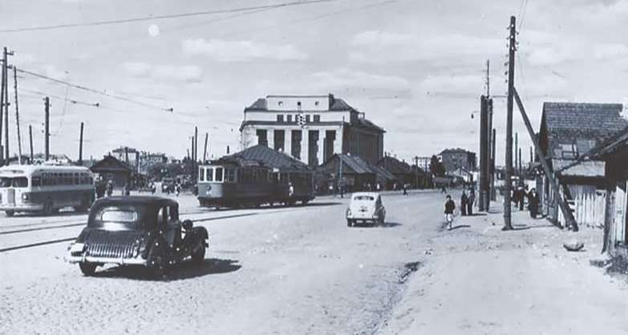

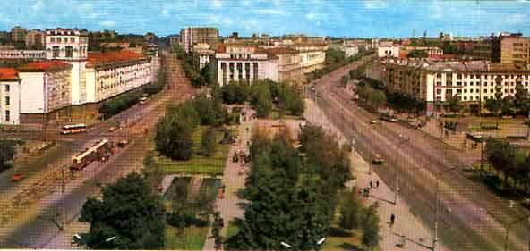

По понятиям моего детства Слепянская находилась на окраине Минска, по сегодняшним меркам — в его центре. Дом номер 33, в котором я прожил более четверти века, стоял в 150-200 метрахот того места, где сегодня воздвигнут памятник Якубу Колосу на площади его имени. Сейчас на месте нашего дома — Концертный зал филармонии, точнее, его левый тыльный угол.

Площади Якуба Колоса или какой-то другой на её месте раньше не было, была развилка, называвшаяся, как и всё вокруг, Комаровкой. Развилка считалась центром Комаровки. Она была образована улицей Советской, продолжением которой после Комаровки была улица Пушкина, и отходящими от неё улицами Цнянской, Логойским трактом, Деревообделочной (преобразованной сначала в бульвар Луначарского, а сейчас в бульвар Мулявина) и Красной. Позднее через примыкавшее почти к самой развилке болото проложили новую улицу — Веры Хоружей. Крытый Комаровский рынок находится там, где после войны в середине болота вокруг маленького озерца, росли водоросли и летними вечерами квакали лягушачьи хоры.

Слепянская шла на юго-восток под острым углом к Советской. Люди старшего поколения говорили, что Слепянская начинается у костёла Святого Роха, но перед войной костёл заслонили от Советской улицы многоэтажным, но не очень стойким Домом Специалиста, от которого после пожара в первые дни войны даже коробка не сохранилась, а осталась лишь груда кирпичных обломков. После войны перед костёлом воздвигли более прочный и более высокий дом, чтобы окончательно надёжно заслонить пережиток религиозности от глаз прохожих и проезжих по главной улице Минска.

До войны все обитатели южной части Комаровки, т.е. Слепянской и близлежащих улиц — Бондаревской, Деревообделочной, Берестянской, Кладбищенской, Высокой, Малявщинской и других разговаривали на белорусском языке. «Звездовцы» говорили на красивом «интеллигентном» белорусском, с них мы брали пример. Русский считался языком тех, кто занимался «непыльной работой», а таких здесь почти не было.

# Июнь 1941-го

Этот летний месяц мне запомнился на всю жизнь. За хорошее поведение и послушание в течение целой недели, которые дались мне очень непросто, бабушка обещала сводить меня в воскресенье 22 июня в парк имени Горького. Туда я и сам мог бы сходить, идти-то всего чуть более километра — не расстояние по тому времени для меня и моих сверстников в благополучном Минске. Ведь мне уже шесть с половиной! Но с бабушкой интереснее: купит билет на карусели, карамельного петушка на палочке, а если вообще не нарушу её строгих предписаний, то и мороженое, хотя обязательно пояснит, что продукт это очень дорогой, вредный и, если его есть так, как я ем всё остальное — быстро-быстро, то и простудиться можно и голос потерять.

То, что утром объявили по радио о начале войны — мелочь, война до Минска не дойдёт. Так считают и мама и бабушка. «Страна крепка и танки наши быстры, и наши люди мужеством полны…». Не допустят! Поэтому идём в парк. Там становятся реальностью все мои мечты от карамельного петушка до мороженого и даже более — мне удаётся уговорить бабушку купить мне билет на три выстрела из духового ружья в тире. Однако попасть в мишень — толстого буржуя с сигарой, что дало бы право ещё на три выстрела, мне не удалось.

С сегодняшних позиций детское гулянье в парке имени Горького в день начала войны 22 июня 1941 года — пир во время чумы!

А тогда!

Ни у кого и мысли не было о том, что война может докатиться до Минска. Все глубоко убеждены, что посягнуть на Советский Союз может только безумец, и он будет наказан незамедлительно. «Ведь от Москвы до британских морей Красная армия всех сильней!» Думать иначе могут только подлые враги народа, но с ними, пожалуй, покончено. Жаль, конечно, что кое-кого к ним причислили по ошибке, но в больших делах такое, к сожалению, может случиться.

Такова была философия обывателей, простых, как принято их называть, людей, зомбированных большевистской пропагандой.

Через два дня фашистские бомбардировщики подожгли центр города, и ветер гнал огонь в сторону Комаровки. Нужно было уходить от наступающих захватчиков, и мы — мама, бабушка, сестра и я — пошли по Борисовскому тракту на восток, захватив с собой всё, что могли нести. Бабушка вела на поводке козу. Шли два дня, ночь провели на сеновале в какой-то деревне. К концу второго дня пришлось повернуть обратно, так как навстречу нам двигалась масса таких же бедолаг, как и мы. Немецкий десант высадился впереди и перерезал дорогу.

Мы были убеждены, что когда вернёмся в Минск, от нашего дома останется пожарище, так как, уходя, видели, что горят дома с номерами 15 и 17 по нашей нечётной стороне и огонь быстро распространяется. Но, оказывается, ветер изменил направление и последним сгоревшим на нашей стороне был дом с номером 19. На четной стороне пожар дошёл до кирпичного здания детсада, и оно тоже уцелело.

Бабушка Франя проявила большую любовь к животным. Покидая дом, она настежь распахнула сарай и загородку с поросёнком. Пусть, мол, не сгорит, а убежит и кому-то пригодится. Но, вернувшись, искренне возмутилась, что поросёнок сбежал. Пошла на поиски и нашла своего поросёнка по свойственному именно ему поросячьему голосу в сарае на Студенческом переулке, в полукилометре от нашего дома.
На шестой день войны 28 июня немцы вошли в Минск.

# Неустранимое из памяти

Вряд ли когда-нибудь я смогу забыть первые дни фашистской оккупации, повешенных молодых девушек и парней с табличками на груди «Они стреляли по германским солдатам». Нельзя забыть колонны голодных измученных пленных красноармейцев; не забыть и не принёсший никому никакого вреда взрыв в вагоне трамвая «Только для немцев», после которого фашисты здесь же захватили и на виду у всех расстреляли 50 ни в чём не повинных случайных прохожих. После какой-то партизанской акции в Минске фашисты схватили и мою мать, но худшее с ней не произошло. Её поместили в концентрационный лагерь на улице Широкой. Война — это ужас и на фронте, и в тылу и на оккупированных землях.

Мать постаралась отодвинуть меня от городского ужаса, и отправила в деревню Щитомиричи к деду.

Есть много поводов любить Комаровку и гордиться моей исчезнувшей с карты Минска Слепянской улицей. Никто из её обитателей не возрадовался приходу фашистов, хотя не было на ней дома, который бы обошли сталинские репрессии. Про Комаровку в целом такого не скажешь. Нашлась на Комаровке одна семья, члены которой приветствовали немецкие войска цветами. И адрес их помню, и фамилию, но... может не все в ней были уродами, поэтому и здесь и в других случаях, заслуживающих по моему мнению осуждения, не назову ни фамилий, ни имён, ни адресов.

В середине июля оккупанты расклеили на столбах приказ «Об образовании еврейского жилого района в г. Минске», т. е. о создании гетто. Туда насиль ственно переселили все еврейские семь и. Приличные дома переселённых отдавали тем, кто пошёл в полицаи. Но на Слепянской улице всё освободившееся жилье было незавидного качества и его заняли погорельцы или же те, кого выселили немцы, создавая гетто. Одним из таких переселенцев оказался Гарик Шифрин, ребёнок года на два меня старше. Ему, его старшей сестре Рите, старшему брату Жене и их маме досталась квартирка из комнаты и кухни в доме номер 42. Мама Гарика — армянка — утверждала, что муж её тоже армянин и что он пропал без вести. Однако вся Слепянская хорошо знала, что отец Гарика Юрий Шифрин еврей, и согласно вывешенному на всех столбах приказу нужно сообщить об этом немецкому командованию, чтобы Гарика, Риту и Женю отправили в гетто. За укрывательство евреев и несообщение сведений о евреях — расстрел. И я ещё больше горжусь своей исчезнувшей с лица города Минска улицей Слепянской, что за три года оккупации никто из её обитателей этих людей фашистам не выдал!

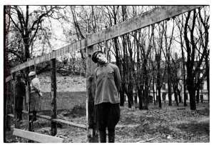

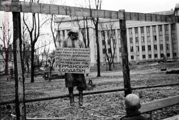

Геноцид, холокост. В последние десятилетия коммунистического властвования в СССР, когда вспоминали о потерях в войне, часто можно было слышать.

— Почему мы так много говорим о потерях евреев, ведь русских в войне погибло больше, да и других национальностей не меньше?

И это — правда, верно и то, что мы прощаем убийц, истязателей, клеветников, писавших доносы, по которым обвиняли и расстреливали невиновных, прощаем холуёв, угодливо лгавших ради собственного благополучия. Мы не всегда выражаем презрение и отвращение к тем, кто пишет фальшивые свидетельства, обвиняя воистину интеллигентных, не отступающих от достойных принципов людей, в нарушении общественного порядка в употреблении бранных выражений. А от этого — один шаг до клеветнических свидетельств во благо «порядка и стабильности».

Настоящая Родина начинается с правды, которой не обделяла вас мать, родные, близкие, соседи. Главное в этой Родине — человек. А «была бы страна родная, и нету других забот» — родина не для человека, а для торжества идей, нередко порочных, возносящих какой-то фрагмент бытия на небывалую высоту и забывающих о самом человеке.

Человеконенавистничество, в том числе и по национальному признаку, всегда было чуждо белорусам. И сколько бы ни клялись коммунистические функционеры, что они истинные интернационалисты, всё это враньё. Достаточно вспомнить донесение секретаря ЦК КП(б)Б П. К. Пономаренко товарищу Сталину в первые дни войны: 

>… настроение белорусов исключительно патриотическое... Должен подчеркнуть исключительное бесстрашие, стойкость и непримиримость к врагу колхозников в отличие от некоторой части служащего люда городов, ни о чем не думающего, кроме спасения шкуры. Это объясняется, в известной степени, большой еврейской прослойкой в городах. Их обуял животный страх перед Гитлером, а вместо борьбы — бегство… 

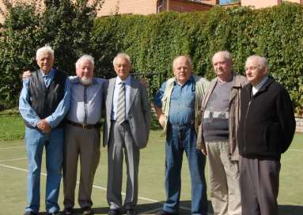

Странная логика. Дети, старики, женщины должны бороться, а ни в коем случае не убегать! Откуда было знать Пантелеймону Кондратьевичу, что евреев гитлеровцы будут убивать только за то, что они евреи. В «Кратком курсе истории ВКП(б)» об этом не написано, а другие источники знаний настоящему партийному руководителю знать не обязательно. Не обязательно помнить, что Гитлер пришёл к власти и настроил немцев воевать, убедив их в том, что у Германии есть внешний враг — французы, которые немцев унизили своей победой с помощью союзников в первой мировой войне. Есть и внутренний враг — евреи, которые немцев безжалостно обирают. А врагов нужно уничтожать. Да и до сих пор далеко не каждый понял, что такое геноцид, что такое холокост. Предельно упрощённо: геноцид (от греческих племя и убить) — тягчайшее преступление против человечности — это, когда негра убивают за то, что он негр; еврея — за то, что он еврей; мусульманина — за то, что он мусульманин; католика — за то, что он католик. Холокост (от греческого сгореть целиком) — скорбь и память о евреях, сожжённых заживо, убитых, замученных немецкими фашистами и их европейскими сообщниками во время Второй мировой войны. Об этом нужно помнить, говорить и кричать сегодня и всегда.

Когда я вспоминаю свою Комаровку и свою Слепянскую улицу, переставшую окончательно существовать в 1961 году, то стараюсь понять, почему населяющие её граждане были способны без громких призывов проявить настоящую гражданскую солидарность, на которую не способны жители упорядоченных анклавов сегодняшнего Минска. Неужто крылатая фраза зарубежных публицистов о ментальности граждан СССР «ничто так не разъединяет людей, как социализм» правильно отражала существовавшую ситуацию, созданную усилиями коммунистических идеологов. Если же задуматься, именно такое разделение и нужно было, чтобы управлять страной, в которой господствовали лицемерие, несправедливость, телефонное право, к которой до последних дней её существования ложь, преподносимая руководителями высшего ранга, должна была восприниматься восторженно как чистейшая правда.

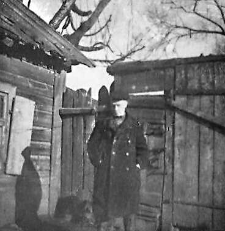

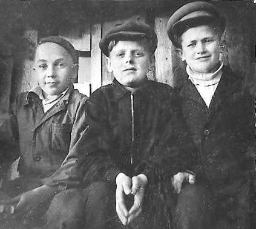

«Комаровско-слепянскую» солидарность и обще-политическую ситуацию я осознал позднее, а вот желание иметь собственный фотоаппарат, уметь фотографировать и делать снимки не покидало меня ни на минуту. Наконец, мечта сбылась. Мой первый собственный фотоаппарат назывался «Комсомолец» и стоил шесть рублей. Накопить на него деньги мне удалось в начале 1948 года. Дату я хорошо запомнил — именно в этом году возвратился отец. В день возвращения я сфотографировал его собственным  новеньким «Комсомольцем» во дворе нашего дома на улице Слепянской. Отец сразу же поехал работать учителем в деревню Даниловичи Дзержинского района: проживать и работать в Минске ему было запрещено. В Даниловичах учительство также быстро закончилось: через три месяца отца вернули в Сибирь.

«Фоторемесло» я освоил самостоятельно по книгам от проявки плёнки до контактной и проекционной печати, но проекционная была позднее. Если мой первый фотоаппарат в принципе не позволял получить качественные снимки, то потом все мои фотографические провалы происходили только по моей вине. За работу в пионерлагере летом 1952 года я получил около ста рублей и приобрёл «Зоркий» — один из лучших фотоаппаратов на моём студенческом курсе, после чего довольно скоро купил и фотоувеличитель.

# Школа, учителя

К моим четырём с половиной мать научила меня довольно бойко читать по-белорусски и по-русски. К этому же времени я начал отвечать печатными каракулями на письма отца из Сибири. Отец писал мне сначала печатными буквами, а потом и прописными, всегда по-белорусски. Я отвечал тоже по-белорусски. Война и оккупация прервали нашу переписку и сделали моими главными учебниками изданную в год моего рождения — 1934 — детскую книжечку отца «Звярыны баль» и десятитомник «Малая советская энциклопедия» (МСЭ). Первую книжку я окончательно истрепал, выучил наизусть и помню по сей день. Тома МСЭ — самые новые и самые красивые книги на нашей тогдашней большой самодельной, оклеенной обоями книжной полке — дождались отца, оставаясь в прекрасном состоянии. Мать разрешала мне брать с полки любую книгу, но обязательно возвращать её на то же самое место, откуда взял. Для того, чтобы раскрыть сразу несколько книг, а довольно часто мне хотелось поступить именно так, нужно было получить отдельное разрешение.

Моё, направляемое невидимой рукой моей матери, самообразование перешло в школьную стадию в 1944 году. Мама с бабушкой решили послать меня сразу в четвёртый класс, и я не испытывал никаких сложностей из-за того, что три первых освоил дома. Четвёртый класс закончил с похвальной грамотой. Как и все мои одноклассники, я запомнил на всю жизнь замечательного педагога — свою первую учительницу — Татьяну Константиновну Мальцеву. До сих пор для меня остаётся загадкой, как эта скромная всегда безукоризненно вежливая женщина смогла добиться от нас абсолютной дисциплинированности на уроках и на многие годы влюбить в себя весь наш разнородный по возрасту, по степени нравственного и психического изувечения войной класс. На нашей ежегодной традиционной встрече одноклассников мы всегда подымаем тост за её светлую память.

Мне повезло с учителями и в старших классах. Наша бессменная классная руководительница «историчка» Станислава Михайловна Петрушкевич, преподаватель белорусского языка и литературы Владимир Николаевич Комар, математик Моисей Самуйлович Эльперин, физик Финиас Соломонович Баркан... всех их помню, и всем им благодарен. Особый человек — Мария Иосифовна Марцулянис — преподаватель русского языка и литературы. Мы все ей тоже благодарны, но поняли её значимость уже после школы. Нередко она теряла терпение и обрушивала на нас осуждающие слова.

— Боже мой! Вы даже представить себе не можете, сколь вы все косноязычны! Я должна буду умереть от стыда, когда вы кому-то признаетесь, что я учила вас русскому языку! За что, за какие прегрешения, я осуждена на такой позор?

Лично для меня самым запоминающимся её действием стало домашнее задание выучить наизусть к следующему уроку стихотворение Лермонтова «На смерть поэта» с целью нанесения решительного удара по нашему и впрямь вопиющему косноязычию. Однако удар пришёлся в первую очередь по мне, и вот почему.

Следующий урок оказался на следующий день . Мария Иосифовна вызывала всех по очереди в алфавитном порядке от А до Я. Пока очередь дошла до меня в журнале красовалась колонка из двоек, разбавленная двумя-тремя тройками с минусом. Я же оказался в особом положении по нескольким причинам.

Во-первых, мама очень любила Лермонтова. Читая для меня «Белеет парус одинокий», мама объяснила мне, что такое море и что такое парус. В два года я знал это стихотворение наизусть. Позднее я понял, мать очень умело использовала в воспитательных целях моё не очень-то умеренное, но тщательно мною скрываемое самолюбие. Она, как бы между прочим, могла при мне сказать своей подруге-учительнице Зое Ивановне Буцевицкой.

— Знаешь, Зоя, а мой уже повзрослел, не только лермонтовские стихи читает, но и «Героя нашего времени» одолели, кажется, кое-что понял.

Во-вторых, отдельные строки из «На смерть поэта», например, «а вы, надменные потомки, известной подлостью прославленных отцов…», были крылатыми фразами в лексиконе моих двоюродных сестёр — Галины и Софьи Леонтьевны Бильдюкевичей — «патологических» отличниц-гуманитариев. В-третьих, я очень легко запоминал и долго храню в памяти то, что мне нравится.

И вот я выхожу к доске и начинаю

>Отмщенье, государь, отмщенье!\
Паду к ногам твоим,\
будь справедлив и накажи убийцу,\
чтоб казнь его в позднейшие века\
твой правый суд потомству известила,\
и видели злодеи в том пример!»

Класс замирает. Учительница — Мария Иосифовна — знает, а класс — не знает, что это эпиграф к «На смерть поэта», которого нет во многих изданиях произведений Лермонтова, в том числе и в школьной хрестоматии.

А уже потом:

>Погиб поэт! — невольник чести —\
Пал, оклеветанный молвой…

и далее без запинки — всё стихотворение до конца.

В моей журнальной клеточке появляется жирное «5», а под ним в колонке ещё несколько двоек.

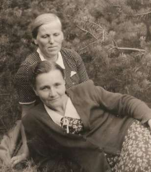

По сей день мои одноклассники, все кто может, каждый год собираются вместе. И не было ещё случая, чтобы кто-нибудь из них не вспомнил, как основательно они отколошматили меня после этого урока.

— Всегда помни, Шушкевич, не за то мы тебя тогда побили, что ты лучше всех нас выучил стихотворение, а за твоё выпендривание с эпиграфом.

С учителями не всё было идеально. Мы ж аж дали справедливости, недолюбливали бездушие и формализм и никак, например, не могли понять, за что наша учительница химии Анна Натановна была награждена орденом Ленина «за заслуги в коммунистическом воспитании подрастающего поколения». Объясняла она новый материал плохо, была вспыльчивой, даже истеричной. Постоянно нас в чём-то обвиняла. Иногда — справедливо, чаще — необоснованно. Мы платили ей взаимностью, и не прочь, как говорят, были её «подсидеть». Однажды это удалось и мне.

Проходили мы тогда рудничные лампы. Анна Натановна пояснила, что очень давно англичанин Гемфри Дэви изобрёл лампу с медной сеткой, которая размещалась в верхней части пламени, благодаря чему уменьшалась вероятность инициирования лампой взрыва метана, иногда присутствующего в опасной концентрации в воздухе шахт.

Подымаю руку.

— В чём дело?

— Извините, Анна Натановна, я вот читал днями журнал «Знание — сила», там сказано, что задолго до Дэви рудничную лампу придумал наш соотечественник уральский шахтёр Иван Подъелдыкин.

Немая сцена. Лицо химички делается белым, как полотно. И не удивительно. Как раз тогда развернулась безжалостная борьба с «космополитами безродными» и «идолопоклонниками перед Западом». В российской истории стали старательно отыскивать тех, кто обязательно раньше за именитых иностранцев сделал то или иное открытие или изобретение. Мол, паровоз придумал не Стефенсон, а братья Черепановы, радио — Попов, а не Маркони, и т. д.

— Садись, Шушкевич. Хорошо, что ты внимательно читаешь журналы. Я обязательно проверю всё относительно рудничной лампы. А пока давайте не будем связывать с ней чьи-то имена. Пусть будет просто рудничная лампа.

На перерыве мы давились от смеха. Поняли, Анна Натановна живёт в другом мире, далека от нашего ученического сленга и не понимает, что мнимый Подъелдыкин происходит от популярного для всех нас «подъелдыкивать», т. е. подкалывать.

# Материнская мудрость

Мать никогда не давала мне наставлений быть дисциплинированным, хорошо учиться, хорошо себя вести. Если и наставляла таким образом, то я этого не помню. Но что я запомнил, что было движущим стимулом моих действий, что привело меня к некоторым детским и юношеским достижениям, так это её оценки моих сверстников. Она отзывалась о них только положительно.

— Вот Гарик (тот самый Гарегин Шифрин, мой одноклассник, которого уберегла от фашистов моя Слепянская улица), он обязательно получит медаль, потому, что серьёзный, работает, учится, а не гоняет «в футбол» консервной банкой с утра до ночи.

Гарик, кстати, гонял консервную банку не меньше меня, но не под нашими окнами. Когда же я пытался это объяснить, мать переходила к другой не менее болезненной для меня теме.

— Если бы он поступал так как ты, то не был бы таким аккуратным, чистым, не запачканным. Ты посмотри на себя, ты ведь вытер своей одеждой грязь со всех стенок и заборов Комаровки и прошёлся, не обходя, прямиком по всем окрестным лужам.

Я пытался возненавидеть Гарика за его, в моей трактовке, усердную зубрёжку и чистоплюйство, но, увы, понимал, что моё самолюбие от этого не выиграет. Да и всех одноклассников, которых мать регулярно ставит мне в пример, не возненавидишь. И надо было искать иной выход. Оставалось действовать по наставлениям бабушки Франи. А они очень простые: бери пример с тех, кто лучше тебя, учись у тех, кто умней тебя.

В пятом классе уроки начали проводить разные преподаватели. Мне, как и другим моим одноклассникам, очень нравилось играть вместо нелюбимых уроков на пустырях и незаконченных стройках недалеко от школы. Среди прогульщиков я не был лидером, но на уверенного середнячка тянул. Успеваемость моя стала плохой и, пожалуй, я бы мог совсем опуститься до двоечника, если бы не Артек.

Да, меня — жалкого на тот момент троечника — премировали путёвкой в легендарный пионерский лагерь на южном берегу Крыма, куда, как я думал, посылали только самых лучших пионеров. Причиной всему было моё увлечение написанием заметок в русскоязычную газету «Пионер Белоруссии», ставшую позднее называться «Зорька».

Привлёк меня к этому делу сотрудник редакции Володя, фамилию которого я так и не узнал. Он, как и мама, сыграл на моём желании быть замеченным. По его совету я описывал наше школьное житьё-бытьё и был довольно часто печатаемым автором в «Зорьке». Перед моей фамилией начали ставить очень нравившееся мне слово «деткор». Но так как я поначалу, стесняясь одноклассников, подписывался не своей, а маминой фамилией, то так всё и продолжалось — деткор Стасик Романовский. Однако безжалостные одноклассники довольно быстро меня вычислили, и хотя я никогда не писал неправды, но получил кличку «детбрех». Дело в том, что редакция нередко приукрашала моё повествование, делая пионерскую жизнь более красивой и увлекательной.

И вот в конце марта 1946 года меня вызывают в учительскую. Я ж ду порицания за пропуск уроков и обдумываю варианты оправдательных ответов. Оказывается всё не так печально. Просто звонили из редакции и просили меня незамедлительно зайти в такую-то комнату в Доме печати к редактору «Зорьки» Анастасии Мазуровой.

Бегу, стучу в дверь, захожу.

— Здравствуй, Стасик. Так вот ты какой — один из лучших наших деткоров. Неплохо пишешь, но, думаю, сможешь и лучше. Да и с учёбой у тебя, я уверена, по-прежнему всё в порядке. Небось, снова тянешь на похвальную грамоту? Володя сейчас в командировке, но он мне о твоих успехах рассказывал. Мы здесь в редакции решили помочь тебе писать лучше и премировать тебя путёвкой в Артек. Там ты будешь вести дневник и присылать нам свои записи. Мы будем их печатать в газете. Вот тебе инструкция о том, какие нужны справки, как сдать твои продовольственные и хлебные карточки, что взять с собой. Поезд отправляется через два дня — 29 марта в 10—15. Все 50 человек из нашей республики — 48 пионеров и двое вожатых — едете через Москву и Харьков в Симферополь. Дальше — автобусом. Беги домой, обрадуй маму, и в поход за справками.

Редактор, к счастью, не делала никаких пауз, иначе, как не стыдно врать, я обязательно бы подтвердил, что с учёбой у меня всё по-прежнему.

# Артек

Так попал я на целых два месяца — апрель и май — во Всесоюзный пионерский лагерь Артек. Из Симферополя девочек повезли в лагерь Суук-су, нас мальчишек — в Верхний. Пришлось сдать всю одежду, которую тут же отправили на дезинфекцию и сказали, что вернут в день отъезда. После была стрижка под «нулёвку», душ, осмотр врача. Каждый получил бельё и два комплекта одежды — парадную, состоящую из тёмно-синих длинных брюк, белоснежной «мореходки» и бескозырки, плюс обыденную цвета хаки из штанов на шлейках, застёгивающихся ниже колена, куртки и рубашки. Потом была настоящая сказка — обед. Столы на четверых. На каждом — хлебница с белым и чёрным хлебом. Ешь, сколько хочешь. Еда вкусная, захотел добавку — подыми руку. Такое мне в ту пору и не снилось. По иждивенческим продовольственным карточкам моей, сестры и бабушки полагалось по 300 граммов хлеба в день, по маминой — рабочей — 500 граммов. Сейчас больше хлеба на человека и не нужно, но тогда хлеб был основным продуктом питания.

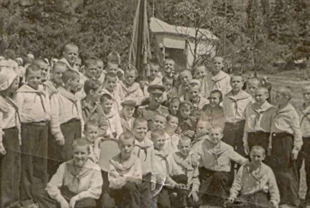

Сказку, конечно же, долж но было что -то омрачать . Всем, прибывшим из Беларуси, нужно было перед обедом глотнуть столовую ложку рыбьего жира. Нескольким, отнесённым к наиболее худосочным, в том числе и мне, ещё и ложку печёночного экстракта — горько-прегорького вязкого чёрного сиропа. Уклониться от этой обязанности было практически невозможно. И уж совсем нам всем не нравился обязательный полуторачасовой послеобеденный сон. Все не скрывали также, что им приходится терпеть школьные занятия, так как на южном берегу Крыма есть дела и повеселее. Я же, наоборот, со рвением относился к учёбе, так как хотел получить справку об окончании пятого класса с хорошими оценками. В итоге — получил справку-люкс, естественно, без троек и почти без четвёрок. Так Артек ликвидировал брешь в моей незавидной успеваемости в пятом классе, и до конца учёбы в школе у меня больше не было проблем с успеваемостью. Вопреки мрачным, преследующим воспитательные цели предсказаниям моей мамы я даже получил медаль, правда, серебряную.

# Распутье

Приближалось окончание школы. Мама очень хотела, чтобы я стал врачом, а уж если кем-то другим, то только бы не пошёл по стезе наук гуманитарных. Она знала, что меня влекло изучение изящной словесности, но перед глазами была судьба отца. Именно за литературу ему приклеили ярлык «нацдема». Поэтому мать настойчиво твердила: никаких гуманитарных наук, выбирай из естественных. К формулам прицепиться труднее, чем к стихам или прозе.

Что касается литературы, то никому я так не завидую, как мастерам слова. Не рифмоплётам, не писакам-приспособленцам, а творцам! Так уж сложилось, что я определил своего любимого писателя — Антона Павловича Чехова — ещё в школьные годы и не хочу менять привязанности. Но какой богатый выбор истинных мастеров белорусского художественного слова, которых престижно выбрать в любимые. От титанов до тех, кто за свою короткую жизнь успел лишь на мгновение блеснуть красотой строчек, оставив о себе память на века. Янка Купала, Якуб Колас, Владимир Короткевич, Василь Быков, Кузьма Чёрный, Лариса Гениюш, Паулюк Трус, Наталья Арсеньева… и даже повешенный в 26 лет российскими колонизаторами Кастусь Калиновский, написавший лишь несколько десятков строк в своей «Мужицкой правде». Да разве всех, кто любил Беларусь и в итоге именно её восславил, перечислишь?

Однако я никак не сожалею, что отдался другому увлечению — радиоэлектронике. Не один раз я приходил ко входной двери городской телефонной станции на улице Карла Маркса, чтобы еще и ещё прочесть объявление, приглашающее на учёбу в Московский институт связи. Там была специальность телевидение — по моим понятиям 1951 года — вершина радиоэлектроники. И я поехал в Москву поступать в институт связи. На парадной двери института висела табличка, указывающая, что в связи с ремонтом вход в приёмную комиссию со двора. Через скрипящую шаткую дверь по обшарпанному коридору с неприглядным полом и дурным запахом я пробрался в зал приёмной комиссии. Вспомнил дни «открытых дверей» в Минске: в политехническом, в университете, в педагогическом. Там было всё торжественно, аккуратно, с главного входа. Моё желание поступать в этот институт мгновенно отпало, и я вернулся домой, в Минск, так и не подав документы.

В родном городе меня ожидали серьёзные испытания. Хотя казалось, студенческий билет уже в кармане — медалистов положено было зачислять без экзаменов. Но когда я отнёс документы на физико-математический факультет БГУ, началась целая эпопея.

Через два дня меня вызвали и заставили здесь же в помещении комиссии переписать автобиографию. У мамы был великий опыт жены «врага народа». Она заблаговременно предупредила, на чём могут поймать. Либо на каком-то мелком несовпадении данных в первом и втором варианте, либо на допущенных в спешке ошибках или описках — тогда скажут, какой же ты медалист!

Никуда не заглядывая, написал.

— Вы, наверное, черновик в кармане носите, здесь же всё слово в слово.

— Нет, у меня память такая.

Кадровик, муштровавший меня с бумагами, в конце концов, сказал прямо.

— Фразу в автобиографии «отец с семьёй не живёт» нужно расшифровать!

Формулировку ту посоветовала мне мать. Она ожидала и такого поворота дела, поэтому я был готов к ответу и без замедления ответил, что, к сожалению, не могу больше ничего добавить к написанному. Позднее вплоть до хрущёвской оттепели мне пришлось не один раз приходилось заверять проверяющих в том, что больше об отце мне ничего не известно. Позднее, когда оказался в политике, мастера чёрного пиара перекрутили дело так, как будто «Шушкевич когда-то отказался от отца».

Ну а тогда, при поступлении в университет, мне пришлось пройти не один кабинет — от секретаря приёмной комиссии до самого ректора. Как заведённый я везде твердил одно и то же: вы не имеете права отказать мне в зачислении. Советские законы для всех одинаковы. Они вертелись как уж на сковородке, потому что никаких оснований для отказа не имели, но лезли из кожи вон, чтобы соблюсти негласную установку: на физику ненадёжных не брать!

Физика в 1951-м была в почёте. Советский Союз в глобальном противостоянии с Соединёнными Штатами как раз незадолго до этого испытал атомную бомбу и быстро создавал водородную. Разве можно было в сферу стратегически важную пускать сына врага народа?

С боем добился я зачисления, но клеймо оставалось. В 1952 году меня неожиданно отклонили от участия в широко разрекламированном мотопробеге Минск-Киев, хотя я был образцовым членом секции мотоспорта ДОСААФ, лучше других изучил гордость отечественного мотоциклостроения ИЖ-49, умел его ремонтировать, наконец, стал призёром отборочного кросса. Но ярлык неблагонадёжного заслонил все спортивные регалии. И ректор И. С. Чимбург мою фамилию из списка участников пробега вычеркнул. Не мог поступить иначе человек, вся научность которого состояла в редактировании книг типа «Ленин и Сталин организаторы Белорусской ССР» шефа белорусского КГБ Лаврентия Цанавы. Многие, правда, считали, что И. С. Чимбург был не только редактором, но и автором этой книги. Так тогда было принято.

В том же 1952 году вместо историка КПСС Ивана Саввича Чимбурга ректором назначили геолога Константина Игнатьевича Лукашова. Что касается уровня научной и педагогической квалификации, то он настолько контрастировал с предшественником, что я почувствовал настоящую гордость за университет и его руководство. С того времени я постоянно горжусь Белорусским государственным университетом, однако, гордость за его руководителей временами исчезает.

И всё же. Мои школьные учителя, кроме физика Баркана Финиаса Соломоновича, были убеждены в том, что я подамся в гуманитарии. А уже упоминавшаяся Мария Иосифовна Марцулянис почти сознание потеряла, когда при случайной встрече в городе, я поведал ей, что поступил на физику.

— Это ужасно! Зачем вам эта бездушная материя? Ведь вы вполне могли бы заняться субстанциями одухотворёнными. Вам бы пойти на филологию, историю, в конце концов. Ведь многие в состоянии понять Архимеда, Пифагора и даже Эвклида. А кто, скажите, из ваших сверстников понимает Гомера, Аристотеля, Платона? А ведь всем нам нужна мудрость древних, но почему-то люди, способные научиться понимать их, этих великих древних, идут в физики.

Печально, но неизбежно. Так много давшая мне и моим одноклассникам Мария Иосифовна Марцулянис ушла в мир иной, а мы её помним, благодарны ей и вспоминаем её добрым словом. Переживаем, что изводили её со всей нашей ученической безжалостностью. Я бы мог успокоить её сегодня тем, что не совсем оторвался от гуманитариев. Судьба свела меня с ними, а её похвалы придавали мне уверенность и силы, заставили думать, что я способен ладить и с ними. Правда, я вынужден был приобщиться к науке, которой в моё школьное и студенческое время здесь не было. Боюсь, что за эту науку — политологию — Мария Иосифовна осудила бы меня не менее страстно, чем за физику. Она считала, что в политике преуспевают только нахалы и лицемеры.

# Студенчество

На первый курс отделения физики БГУ в 1951 году было зачислено 50 абитуриентов — две группы по 25 человек. В моей группе были только медалисты. Во второй группе было лишь несколько медалистов, но время доказало, что нет никаких оснований считать её более слабой. К финишу — окончанию университета — пришли 46: несколько человек перевелись в другие вузы, двое перевелись к нам, один ушёл по собственному желанию, один умер. Поточные лекции по общественным наукам мы слушали вместе с математиками. Их поступило 25, окончили 20. Мы — физики — гордо заявляли, что мы с ними одной крови, так как математика — язык физики. Они не возражали. По сей день, мы — выпускники 1956 года — ежегодно встречаемся вместе физики с математиками, только и наши и их ряды поредели.

Выпуск физиков оказался очень сильным. Он дал 14 кандидатов наук, из них: 9 стали докторами наук, трёх академиков, трёх членов-корреспондентов НАН РБ, девять профессоров. Но, пожалуй, главная особенность нашего курса — мы оказались на редкость сплоченными. Не без исключений, конечно, но исключения были единичными. Мы и сейчас остаёмся дружным курсом.

Кроме желания знать, хорошо учиться нас заставляли правила получения стипендии. Она давалась только тем, кто занимался на хорошо и отлично. Удовлетворительная оценка была на нашем курсе явлением редким, так как большинство однокурсников должны были бы при этом распрощаться с университетом. На первом-четвёртом курсах у ребят один из шести рабочих дней недели отнимала спецкафедра.

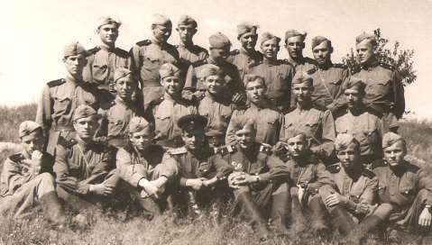

Из нас готовили офицеров запаса — артиллеристов. Восемь часов в неделю, т. е. один полный рабочий день отнимали общественные науки — история КПСС, научный коммунизм, политэкономия. Так что для физики и связанных с ней дисциплин оставалось не так уж много учебного времени, особенно для ребят.

В годы моего студенчества 5 марта 1953 года умер Сталин. Несколько моих однокурсниц плакали по этому поводу. После кратковременного остолбенения высшего руководства начались ощутимые нововведения. В недолгий период — до середины лета 1953 года, когда у руководства страны находился Георгий Маленков были закрыты крупные уголовные дела («ленинградское» и «врачей»), произведена амнистия заключённых за незначительные преступления. С середины 1950-х годов началась хрущёвская оттепель, характеризовавшаяся весьма незначительной либерализацией, политического режима, относительной демократизацией — общественной жизни, появлением — некоторой свободы слова и творческой деятельности.

Через неделю после начала последнего в моей жизни студенческого семестра — 14 февраля 1956 года открылся ХХ съезд КПСС. В своём отчётном докладе  Хрущёв подтвердил осуществлённое в течение  последних трёх лет  изменение политического курса, разрыв со сталинскими  традициями во внутренней и внешней политике, осудил преступления «клики Берия».

Самым неожиданным было заявление Хрущёва, которое отметало вдалбливаемое нам в головы преподавателями общественных наук положение о том, что пролетариат может придти к власти только революционным путём. Они, эти преподаватели, должны были теперь усвоить, что благодаря новому, благоприятному для социализма соотношению сил в мире *завоевание власти в «буржуазных странах» могло отныне происходить конституционным путем*. Им нужно было теперь проповедовать не неизбежность войны с капиталистическим миром, а «мирное сосуществование», не ругать по-сталински Югославию, а призывать к поиску путей сближения с ней.

Их «непоколебимые» марксистско-ленинские убеждения мгновенно изменились, и с прежним усердием они стали вдалбливать в наши головы новые, тоже, как оказалось, марксистско-ленинские.

Мы радовались ослаблению цензуры. На курсе образовалась очередь по передаче из рук в руки журнала «Новый мир» с повестью Александра Солженицына «Один день Ивана Денисовича», романа Владимира Дудинцева «Не хлебом единым», стихов Леонида Мартынова. Перестали быть малоизвестными Евгений Евтушенко, Андрей Вознесенский, Виктор Астафьев, Владимир Тендряков, Белла Ахмадулина. В СССР и странах социалистического лагеря были выпущены на свободу и реабилитированы многие политические заключённые. В их числе был и мой отец, который в 1956 году возвратился в Минск.

Таким образом, за время моего студенчества в стране и во всём социалистическом лагере произошли большие изменения, в том числе и в политической жизни. Следующий решительный поворот генеральной линии КПСС, названный концом оттепели, состоялся в 1964 году с приходом к руководству партией Брежнева.

Оттепель сказалась и на мне. Из сына врага народа я превратился в человека, отец которого был беспричинно репрессирован. Меня избрали комсоргом курса, я узнал, как партком запрещал моим однокурсникам сделать это ранее. Тот же партком весной 1954 года утвердил меня членом делегации университета на празднование 300-летия «воссоединения» Украины с Россией в Киеве. Я был на действительно великолепном празднике, подружился с киевлянами и студентами из других мест Украины. Небезынтересно заметить, что все делегаты от университета стали довольно известными людьми Беларуси. Юзик Ховратович — редактором энциклопедии, Римма Маленченко — заслуженной артисткой, Евгений Бабосов — академиком.

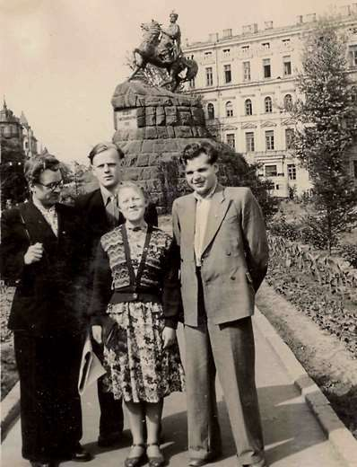

Хрущёвская оттепель сделала меня ещё более советским, а возвратившийся из Сибири отец только усилил во мне чувство гордости за мою великую социалистическую родину. Отец, оказалось, оставался таким же романтиком, каким был в свои 17 лет, когда было напечатано его первое стихотворение:

>«Скамячу, як снежку, Радасць я сваю\
І шпурну з усмешкай\
Сённяшняму дню. Радасць мая звоніць\
Словам маладым Ад сялянскіх гоняў,\
Ад сялянскіх ніў, Ад дубоў шумлівых,\
Ад вясковых хат, Дзе жыцця імклівы\
Крочыць новы лад…»

Казалось бы, есть все основания возненавидеть этот «новый лад», умертвивший безо всякой вины десятки отцовских друзей, прогнавший самого отца через пытки и издевательства и загнавший его в глухомань, где он несколько раз оказывался на грани смерти…

Ан нет! Пройдя незаслуженные муки и испытания, отец считает коммунистическую идеологию правильной и до окончания хрущёвской оттепели вступает в 1964 году в КПСС. А мне говорит.

— Социализм — задумка прекрасная, но негодяи проникают в руководители и на корню губят благородное дело. Нужно, чтобы в партию шли порядочные люди. С ними и социализм настоящий построим.

Находясь в ссылке, отец полюбил Сибирь, её величественную природу, но более всего — сибиряков. Когда вернулся в Минск, в его маленьком деревянном домике на Горном переулке постоянно были гости из Сибири, преимущественно те люди, с которыми он вместе работал в Кемеровской области как ссыльный. Меня удивляло, что обращался он к ним на белорусском языке. Они понимали практически всё и отвечали ему кто на русском, кто на украинском, а некоторые и на почти правильном белорусском. У них я узнал, что и в Сибири отец говорил по-белорусски, и это никого не удивляло и не смущало. Романтик, в мечтах и снах он всегда был в Беларуси и не пытался это скрывать.

В 1956 году, сразу же по возвращении на родину написал:

>«Зноў пабачыў цябе, Беларусь,\
Непакорную,\
    родную,\
        шчырую,\
            блізкую.\
Ты была мне заўсёды, ў любую пару,\
І надзеей, і марай, і шчасця калыскаю.»

И, как будто не было 20 лет лагерей и ссылок! В 1957 году мой отец продолжал считать себя сыном обездоленного царизмом народа, который на дорогу к счастью и процветанию вывел октябрьский переворот 1917 года или в тогдашней терминологии Великий Октябрь.

>«— Хто ты такі? Адкуль? Ды з якога роду?\
— Я з тых, што вякамі жылося гаротна,\
Сын занядбанага адвечна народа…\
\
Бачыш, Радзіма ідзе дарагая\
Дарогай Вялікага Кастрычніка!\
Зноў запытанні ляцяць неадвязна:\
Хто ты? Адкуль? Ды з якога роду?\
На ўвесь голас кажу, вымаўляю выразна:\
Сын неўміручага беларускага народа!»

Я нередко задумываюсь над потрясающей силой утопических лозунгов убеждать людей. Однако меня всегда мучает вопрос, верили ли в них те, кто эти лозунги породил. А если искренне верили, то почему как честные люди не отреклись от них, поняв их утопичность? Или же так, как и мой отец, продолжали оставаться в заблуждении, верили в нереализуемые идеалы и продолжали призывать людей в них верить. Из самых добрых побуждений звали в тупик типа казарменного коммунизма, из которого нет бескровного выхода?

# Когда труд — удовольствие

Мне всегда нравилась работа, результаты которой можно увидеть самому и показать другим. В жизни же было много дел иного рода. Не скажу, что я испытывал удовольствие от учёбы. Радовался, когда познавал то, что хотел понять или освоить. Но нельзя, сдать экзамен, изучая только то, что интересно, поэтому с нетерпением ждал времени, когда можно будет заниматься только тем, чем хочешь. Быстро понял: такое время никогда не наступит, поэтому нужно его уметь урвать, найти, занимаясь тем, чем заниматься обязан. Прекрасным отдыхом от нелюбимой работы или учёбы считал и считаю труд физический, эффективность которого зависит не только от навыков и опыта, но и от сообразительности. Люблю строить, мастерить, накопил прекрасные инструменты и приспособления для дел строительных, столярных, слесарных. В прошлом любил ремонтировать радиоаппаратуру, приёмники, телевизоры, но сейчас мой опыт такого рода никому не нужен, в первую очередь мне самому.

Студенческую стипендию я целиком отдавал дома. Поступать иначе, видя как мать трудится на трёх работах — в дневной, вечерней и посменной школе, плюс ведёт домашнее хозяйство в доме, как мы сейчас называем, без удобств и водопровода, было бы сыновним преступлением. Поздними вечерами мама долгими часами проверяла ученические тетради. Классы были переполненные, и тетрадей была уйма. Маму одолевали головные боли — давала знать себя серьёзная черепно-мозговая травма. Она неудачно поскользнулась во время зимнего полоскания белья на ледяной горке, образовавшейся возле водоразборной колонки и очень сильно разбила голову. Вызывали скорую помощь, две недели делались перевязки. Участковая врач рекомендовала покой, но мама считала, что её покой, т.е. уменьшенная учебная нагрузка, окончательно посадит семью на мель, оставит совсем без денег, которых и так было мало; и продолжала работать.

Все имевшиеся в доме деньги лежали в известном всем месте, но ни я, ни сестра, ни бабушка к ним никогда не прикоснулись. А было столько соблазнов, на которые так хотелось иметь деньги!

Ещё в школе летом, по окончании восьмого и девятого классов я с соседским Юрой научился зарабатывать кое-какие гроши, развозя на лошади воду для поливки в Ботаническом саду. Работа эта, хотя была и не из лёгких, мне нравилась. Труднее всего было черпать воду из пруда ведром и заливать в бочку на колёсах. А вмещала она литров триста. Зато, когда лошадь тащила телегу в назначенное место и потом, пока работницы сливали воду и производили поливку, можно было полчаса—час блаженствовать.

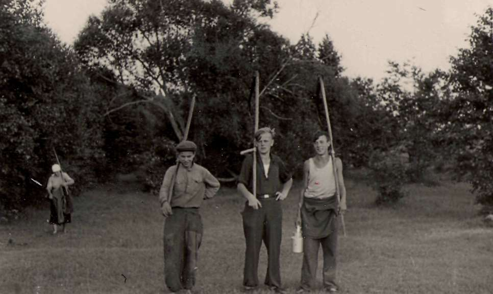

После первого курса всё лето работал старшим пионервожатым в лагере фабрики Крупской, после третьего — аккордеонистом в лагере в Королёвом Стане, где старшим вожатым был мой одноклассник Аль берт Алехнович, впоследствии ставший доцентом политехнического института.

Став студентом, я уже подрабатывал и «по специальности» лаборантом в физическом кабинете 12-й, а потом и моей родной 13-й школы. Начиная со второго курса, вёл в десятых классах 12-й школы уроки электротехники. Как раз тогда производилось преобразование мужских и женских школ в смешанные, т.е. в нормаль ные, и насаждалась политехнизация обучения. В большинстве школ уроки электротехники вели преподаватели физики, но обе «физички» 12-й школы от этих уроков отказались. Директор школы не смог найти преподавателя электротехники, а я, посмотрев программу, предложил ему свои услуги. Он вежливо попросил объяснить основные положения школьной программы электротехники упомянутым «физичкам», в физическом кабинете которых я на полставки работал лаборантом. После моего объяснения обе учительницы снова же не захотели преподавать электротехнику, но заявили, что я для этого подхожу. Директор растрогался и даже попросил завуча школы составить расписание занятий, которое бы лучше всего сочеталось с моими студенческими обязанностями.

Большинство моих школьных учителей, казалось бы, без великих усилий, умели добиться тишины и дисциплины с первого своего урока. Каждый делал это по-своему. Я хотел того же, но знал — подражание и обезьянничание редко ведёт к успеху. Тем более, когда ученицы в классе твоего же возраста, а среди ребят, переведённых из мужской школы, есть и постарше. Хотя директор пообещал помочь мне и заглянуть в класс, если шум в нём будет продолжаться долго, я попросил его ни в коем случае не вмешиваться.

Вошёл в класс. Поздоровался, представился, ответили… и каждый за своё. Мне казалось, что я смогу увлечь класс анекдотами о коротком замыкании, страшилками о трагическом исполь зовании электрокипятильников, ленинским «советская власть плюс электрификация всей страны», эдисоновским размораж иванием недоступных труб подземного водопровода с помощью электричества.

Но не тут-то было, я даже не знаю, как продолжить! У каждого на парте разное — открытая тетрадь, по которой скользит по строчкам карандаш, географическая карта, на которой что-то выискивается, наконец, ноты, над которыми руками делаются дирижёрские жесты.

— Вы что, в дирижёры хотите податься?

— Нет, я после занятий дирижирую нашим классным хором, а сейчас готовлюсь, — отвечает ученица. Я понимаю, что врёт, но класс молчанием утверждает, что говорит правду.

— А ноты зачем?

— А как же без нот?

Осенило. Вижу, что девочка вряд ли разбирается в нотах, и начинаю громко, чтобы все слышали «резать правду-матку».

— Я в школе так примитивно не вешал своим учителям лапшу на уши. Какие здесь цифры?

— Три и четыре.

— Правильно, три четверти, вальс. А при ваших помахиваниях хору придётся плясать «Лявониху». Кстати, простое электротехническое устройство может заменить такого пока ещё необученного дирижёра, как вы, и не делать ошибок. А теперь послушайте, что я хочу делать вместе с вами на уроках электротехники.

Предлагаемое пришло мне в голову буквально здесь на этом уроке. Ведь, строго говоря, электротехника — предмет для школьников не очень-то нужный. Дань моде — политехнизации обучения. Эврика! Знаю, как увлечь без анекдотов и плана ГОЭЛРО. И продолжил.

— Я знаю, что оценка по электротехнике в аттестат не выставляется. Но выставляется оценка по физике, да и сдавать на вступительных экзаменах в вуз физику придётся многим. Предлагаю поиграть с вами в кошки-мышки. Раз уж не вполне удалось вам сегодня меня разыграть, попробуйте сделать это иным способом. Исходим из того, что раздел физики «электричество» — основа электротехники. Давайте на моих уроках будем решать задачи по физике, по разделу электричество, а если кому-то очень захочется, то и по любому другому разделу физики. Вы предлагаете задачу из любого задачника или пособия для школы, я пытаюсь решить её на доске, вызвав кого-то из вас. Если даже с моими подсказками он не решит, решу я. Остаются три просьбы. Первая, не пояснять всему свету по секрету наш с вами метод изучения электротехники. Вторая, не выискивать олимпиадных задач, потеряем на них много времени. Третья, прошу завести новую тонкую тетрадь, написать на её обложке крупными буквами «Электротехника», своё имя и фамилию.

— А как с оценками?

— Тем, кто хорошо проявит себя у доски — пять. У остальных и четвёрки могут случиться.

Думаю, что учителя и директор знали о моём методе преподавания электротехники. Но он всех устраивал. При встрече с директором был примерно такой разговор.

— Рад, что вы нашли подход к этим непростым классам. Ведь ребят к нам перевели из бывшей мужской школы не лучших.

— Спасибо за добрые слова, но я не думаю, что вы перевели в бывшую мужскую ваших лучших учениц. А учить надо всех.

---

В начале 2000-х годов я летел во Франкфурт. Рядом со мной сидела молодая женщина.

— Простите, но я вас знаю и не только как первого главу независимой Беларуси, но и как учителя моей мамы, которая окончила 12-ю минскую школу. Она уже на пенсии, но хорошо помнит, как вы научили её класс решать самые трудные задачи по физике.

Мне приятно было такое слышать от случайной попутчицы через почти 50 лет после того, как я провёл в классе, где училась её мама, не более десяти уроков.

# Распределение

Во втором семестре пятого курса не было обязательных для посещения занятий. Считалось, что я постоянно тружусь на радиозаводе (теперь «Горизонт») — делаю дипломную работу в Центральной заводской лаборатории — ЦЗЛ. Однако кроме этого я ещё заменял преподавателя физики старших классов моей родной 13-й школы, ушедшую в отпуск, предоставляемый студентам-заочникам пединститута, заканчивающим вуз.

Директор моей родной школы — Николай Михайлович Струсевич и завуч Евгения Семёновна Левина также были удовлетворены моей работой. Однако мои преподавательские достижения в обеих школах породили неожиданную для меня неприятность.

Настал день распределения на работу. По успеваемости — суммарному балу оценок за всё время обучения — я седьмой. С добавкой за студенческую научную работу — пятый. Из 46 распределяющихся это совсем неплохо. Иными словами, проблем нет, из Минска уезжать не надо, а в Минске места замечательные. Но не нравится мне насмешливый взгляд члена комиссии профессора Антона Никифоровича Севченко — директора Института физики и математики Академии наук БССР. Фактически он решает все вопросы.

Ко мне обращается то ли шутя, то ли с пренебрежением.

— Скажи ты нам, Шушкевич, сколько твоих близких родственников работает в 12-й и 13-й школах, что они как под копирку написали в Комиссию по распределению трогательные письма с просьбой распределить тебя и в 13-ю и в 12-ю школу? Они, конечно не вправе обращаться непосредственно в комиссию, но у нас большая заявка Министерства просвещения и мы можем послать тебя в любую из этих школ.

Я понимаю, что профессор Севченко балагурит, но зная его непредсказуемый нрав, боюсь, что может случиться непоправимое. У него есть основания не очень-то меня любить. Я отказался пойти на его любимую специализацию «оптика» и не захотел пойти к нему в аспирантуру.

— Антон Никифорович, нет у меня родственников ни в одной из школ, откуда поступили письма. Я просто работал и там, и там. Наверное, не совсем плохо работал, поэтому и прислали письма, о которых я ничего не знаю. Зачем же вы направили меня на собеседование с заведующим лабораторией вашего института академиком Михаилом Александровичем Ельяшевичем, который после разговора со мной согласился быть моим научным руководителем. Я тоже хочу быть его аспирантом.

А профессор продолжает балагурить.

— Но письменной заявки академика Ельяшевича нет.

— И не может быть, Антон Никифорович, потому что он как и школа не может обращаться непосредственно в комиссию, и хорошо знает об этом. Но есть места в аспирантуре Института физики и математики Академии наук, где вы — директор, а Михаил Александрович заведует лабораторией.

— Ишь ты! Всё разнюхал и в школе, и в институте. Ладно, иди в аспирантуру. Ельяшевич Михаил Александрович, правда, чистый теоретик, тебе мало подходит, но все заслуживающие внимания физики-экспериментаторы в Союзе его знают, а он их и подавно. Считай, с руководителем тебе повезло!

---

1. [~~Про мой род, себя и нашу элиту~~](./01.md)
2. [~~Бацькаўшчына~~](./02.md)
3. [**Академия — завод — университет**](./03.md)
4. [МРТИ — хорошо, БГУ — лучше](./04.md)
5. [Чернобыль](./05.md)
6. [В Москву, к властям](./06.md)
7. [Дорога к Вискулям](./07.md)
8. [Народы малочисленные и к ним приравненные](./08.md)
9. [Если б знал я, с кем еду, с кем водку пью…](./09.md)
10. [Беловежская пуща, Вискули, 7—8 декабря 1991 года](./10.md)
11. [Беларусь — Соединённые Штаты](./11.md)
12. [Интеллигенция и политика](./12.md)
13. [О университетах и ВУЗах, степенях и лекциях](./13.md)
14. [О «моём» зарубежье](./14.md)
15. [Патология](./15.md)
16. [Через годы, через расстояния](./16.md)

