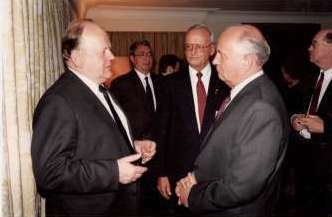
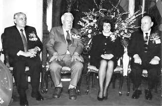
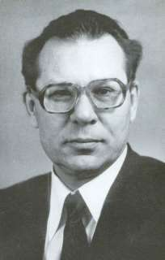

1. [~~Про мой род, себя и нашу элиту~~](./01.md)
2. [~~Бацькаўшчына~~](./02.md)
3. [~~Академия — завод — университет~~](./03.md)
4. [~~МРТИ — хорошо, БГУ — лучше~~](./04.md)
5. [**Чернобыль**](./05.md)
6. [В Москву, к властям](./06.md)
7. [Дорога к Вискулям](./07.md)
8. [Народы малочисленные и к ним приравненные](./08.md)
9. [Если б знал я, с кем еду, с кем водку пью…](./09.md)
10. [Беловежская пуща, Вискули, 7—8 декабря 1991 года](./10.md)
11. [Беларусь — Соединённые Штаты](./11.md)
12. [Интеллигенция и политика](./12.md)
13. [О университетах и ВУЗах, степенях и лекциях](./13.md)
14. [О «моём» зарубежье](./14.md)
15. [Патология](./15.md)
16. [Через годы, через расстояния](./16.md)

---

# Как в университете узнали о Чернобыле

Весть о серьёзной аварии на ядерном объекте пришла на кафедру ядерной физики и мирного использования атомной энергии физического факультета БГУ из скромной лаборатории студенческого практикума по ядерной физике. В таких лабораториях из соображений безопасности для здоровья студентов и преподавателей применяют очень слабые источники жёстких излучений, однако, правила обращения с ними навязываются такие же, как и при работе с источниками, дающими большой поток ионизирующих излучений. Это своего рода тренажёр, предназначенный для обучения навыкам постановки ядерно-физических экспериментов. Всё кроме источников излучения такое же, как и в исследовательской лаборатории: свинцовые кирпичи защиты, легко дезактивируемая мебель, а иногда и специальная одежда.

И вот студентка показывает преподавателю, который хорошо знает, какие цифры могут быть получены на данной установке, протокол с записью результатов. Преподаватель с улыбкой и даже издевкой замечает: «Вы, миленькая, ещё раз внимательно прочтите инструкцию. Вы просто уникум, такие результаты на данной установке удалось получить только вам. Устраните нелепости и убедитесь, что цифры будут отличаться в сотни раз от того, что вы намерили».

Но, как говорится, и студентка имеет право голоса. Она и инструкцию прочла, и схему правиль ную выбрала, и калибровку прибора произвела. Она убедительно доказывает это преподавателю, обоснованно отвергая упрёки в неграмотности подхода. И даже дерзить начинает.

— Если я такая неразумная, а вы такая умная (преподавателем, ведущим практикум, была молодая женщина), то подойдите, пожалуйста, к прибору и убедитесь, что не во мне дело.

Через несколько минут и преподаватель, и лаборант, и другие студенты, находящиеся в лаборатории, убеждаются, что все чувствительные приборы практикума для измерения ионизирующих излучений регистрируют необычно большой радиоактивный фон.

Ситуация ясна. Где-то произошёл неконтролируемый выброс радиоактивных веществ. По тогдашним нашим убеждениям предположить, что выброс произошёл за сотни километров от Минска, было абсолютной нелепицей. Ветер южный. Значит серьёзная авария в Соснах, там исследовательский реактор. Звоним в Сосны. Отвечают, тоже регистрируем радиоактивность, но выброс не у нас, где-то южнее.

И в Институте ядерной энергетики (ИЯЭ) в Соснах и у нас в университете включаем все имеющиеся спектрометрические приборы. Выясняем: высокий уровень радиоактивности обусловлен в основном йодом-131 и цезием-137. Тем, кто ориентируется в азах ядерной энергетики, всё ясно: произошла разгерметизация ядерного реактора и частичный выброс содержащихся в нём веществ. Но ведь вблизи Минска нет ядерных реакторов. А ветер южный, и в том направлении, откуда он дует, только Чернобыльская АЭС.

Так до официального сообщения об аварии мы вычислили её место и сущность, поняли, что авария серьёзная, но, увы, не могли даже подумать, что это катастрофа глобального масштаба. Не утечка из реактора, а настоящий ядерный взрыв.

Полное название кафедра ядерной физики и мирного использования атомной энергии употреблялось редко, чаще говорилось кафедра ядерной физики или коротко КЯФ. Студенты специализировались по трём направлениям: «ядерная физика», «ядерная электроника» и «ядерные энергетические установки». Последняя специальность обеспечивалась в основном сотрудниками Института ядерной энергетики (ИЯЭ) АН БССР и на 4—5 курсах именно там, в Соснах в 14 километрах от Минска (в 7 км от кольцевой магистрали), они проводили большую часть учебного времени, работая в лабораториях Института и на ядерном реакторе.

В курсах лекций для них рассматривались вопросы обеспечения безопасности ядерных реакторов, подробно анализировались и изучались имевшие место аварии, например, авария на американской АЭС «Three Mile Island» в 1979 году.

Что следует делать, в случаях непредвиденных выбросов радиоактивности, было детальнейшим образом доведено не только до студентов-ядерщиков, сотрудников служб и лабораторий ядерного профиля, но и содержалось в инструкциях штабов гражданской обороны (ГО) на всей территории СССР. Но когда взорвался 4-й реактор Чернобыльской АЭС, инструкциями, хранившимися в подразделениях ГО, никто не руководствовался. Ждали указаний власти, то есть партии. Указаний долго не было, и все партийные и государственные органы руководствовались стандартным — никакой паники!

Не только взрослых, но и детей выводили на праздничные шествия и демонстрации. А ведь у детей щитовидная железа в десять раз меньше, чем у взрослых и именно в ней концентрируется радиоактивный иод, подвергая этот маленький и очень важный орган высокой радиационной нагрузке. При этом резко возрастает вероятность заболевания раком щитовидной железы, что абсолютно однозначно подтвердилось позднее.

# Чернобыль и Горбачёв

Наконец последовали общесоюзные указания. По всесоюзному телевидению выступил Михаил Сергеевич Горбачёв. Его развёрнутое выступление опубликовано в газете «Правда» от 15 мая 1986 года.

До этого выступления он был моим кумиром. С 1984 года я боготворил его и как руководителя государства и как лидера партии. Он буквально потряс меня своим поведением на транслировавшейся по телевидению пресс-конференции с журналистами. За мою жизнь это был первый Генеральный секретарь КПСС, выступивший без написанного тщательно выверенного текста и отвечавший на вопросы даже иностранных(!) журналистов без бумажки. А ведь на всех уровнях политпросвещения нам безустанно твердили, что на высоком государственном и партийном уровне нужно читать именно по бумажке заранее написанный текст. Таково, мол, обязательное требование протокола!

И вот мой кумир — Михаил Сергеевич Горбачёв — выступает по телевидению в мае 1986 года

>Добрый вечер, товарищи! Все вы знаете, недавно нас постигла беда — авария на Чернобыльской атомной электростанции. Она больно затронула советских людей, взволновала международную общественность. Мы впервые реально столкнулись с такой грозной силой, какой является ядерная энергия, вышедшая из-под контроля.

Далее — работа, по сути, ведется круглосуточно, задействованы буквально все партийные, советские и хозяйственные органы.

>Что же произошло? Как докладывают специалисты, в период планового вывода из работы четвертого блока мощности реактора внезапно возросли. Значительное выделение пара и последовавшая затем реакция привели к образованию водорода, его взрыву, разрушению реактора и связанному с этим радиоактивному выбросу.

Это неправда, произошёл ядерный взрыв.

>Как только мы получили надежную первоначальную информацию, она стала достоянием советских людей, была направлена по дипломатическим каналам правительствам зарубежных стран.

И это неправда, истинная информация скрывалась и приукрашивалась.

Далее в выступлении говорилось о практической работе по ликвидации аварии, об обеспечении безопасности населения о помощи пострадавшим, о эвакуации, о погибших в момент аварии, о том, что 299 человек госпитализированы с диагнозом лучевой болезни, о том, что семеро из них скончались, о привлечении лучших научных и медицинских сил и современных средств медицины.

>От имени ЦК КПСС и Советского правительства выражаю глубокое сочувствие семьям, родственникам погибших, трудовым коллективам, всем, кто пострадал от этой беды, кого постигло личное горе. Советское правительство позаботится о семьях погибших и пострадавших.

Далее о многом, однако, ни слова о том, чего нельзя и что нужно делать людям. Но: 

>с полным основанием могу сказать — при всей тяжести случившегося ущерб оказался ограниченным в решающей мере благодаря мужеству и мастерству наших людей.

А дальше как в «12 стульях», Остапа понесло:

>Но нельзя оставить без внимания и политической оценки и то, как встретили событие в Чернобыле правительства, политические деятели, средства массовой информации некоторых стран НАТО, особенно США. Они развернули разнузданную антисоветскую кампанию. О чем только ни говорилось и ни писалось в эти дни… В общем, мы столкнулись с настоящим нагромождением лжи — самой бессовестной и злопыхательской. И хотя неприятно упоминать обо всем этом, но надо. Надо, чтобы международная общественность знала, с чем нам пришлось столкнуться. Надо для того, чтобы ответить на, вопрос: чем же на самом деле была продиктована эта в высшей степени аморальная кампания? Ее организаторов, конечно же, не интересовали ни истинная информация об аварии, ни судьбы людей в Чернобыле, на Украине, в Белоруссии, в любом другом месте, любой другой стране. Им нужен был повод для того, чтобы, уцепившись за него, попытаться опорочить Советский Союз, его внешнюю политику, ослабить воздействие советских предложений по прекращению ядерных испытаний, по ликвидации ядерного оружия и одновременно смягчить растущую критику поведения США на международной арене, их милитаристского курса.

Потом — ушат грязи на подлую «семёрку», собравшуюся в Токио.

>О чем поведали они миру, о каких опасностях предупредили человечество? О Ливии, бездоказательно обвиненной в терроризме, а еще о том, что Советский Союз, оказывается, «недодал» им информации об аварии в Чернобыле. И ни слова о самом главном: как прекратить гонку вооружений, как избавить мир от ядерной угрозы. Ни слова в ответ на советские инициативы, на наши конкретные предложения о прекращении ядерных испытаний, избавлении человечества от ядерного и химического оружия, сокращении обычных вооружений.\
\
Как все это понимать? Невольно складывается впечатление, что лидеры капиталистических держав, собравшиеся в Токио, хотели использовать Чернобыль как повод для того, чтобы отвлечь внимание мировой общественности от этих неудобных для них, но таких реальных и важных для всего мира проблем.\
\
Авария на Чернобыльской станции, реакция на нее стали своего рода проверкой политической морали. Еще раз обнажились два разных подхода, две разные линии поведения.\
\
Правящие круги США и их наиболее усердные союзники — среди них я бы особо отметил ФРГ — усмотрели в происшествии лишь очередную возможность поставить дополнительные преграды на пути развития и углубления и без того трудно идущего диалога между Востоком и Западом, оправдать гонку ядерных вооружений. Мало того, была сделана попытка вообще доказать миру, что переговоры, тем более соглашения с СССР невозможны, и дать тем самым «зеленый свет» дальнейшим военным приготовлениям…\
\
Это еще больше укрепило нас в убеждении, что внешнеполитический курс, выработанный XXVII съездом КПСС, верен, что наши предложения о полной ликвидации ядерного оружия, прекращении ядерных взрывов, создании всеобъемлющей системы международной безопасности отвечают тем неумолимо строгим требованиям, которые предъявляет к политическому руководству всех стран ядерный век.

Думаю, что сегодня это стыдно читать и самому Горбачёву, который стал великим борцом за человечность, гуманность и экологичность. Но тогда он был, прежде всего, коммунистом, а здоровье людей и детей, дышащих радиоактивным йодом, было менее важным, чем интересы КПСС, которая всегда права и не могла быть виновна ни в чём.

А ведь научные консультанты Горбачёва по ядерной проблеме — академики Анатолий Петрович Александров и Валерий Алексеевич Легасов! Они давно там, в Чернобыле. Ищут подходы к минимизации последствий катастрофы. Они, истинные учёные мирового уровня, не могли советовать ему говорить такое. Значит и он не отличается в главном от своих предшественников на посту Генерального секретаря: Хрущёва, Брежнева, Андропова, Черненко. Все они, прежде всего коммунисты, для которых интересы партии в толковании, например, Суслова и ему подобных превыше всего. В любом событии они не пытаются отыскать всё возможное для человеческого блага, а изощряются в осуждении подлых акул капитализма США, НАТО, ФРГ, пропагандируя такими приёмами коммунистическую идеологию. Потом уже может проскользнуть и что-то человеческое: чувства, устремления, горе, потребности.

А может и не проскользнуть.

Суть выступления Горбачёва, текст которого вместе с его фотографией занял всю первую страницу «Правды», была подана в остальных газетах предельно кратко: *«Генеральный секретарь ЦК КПСС Михаил Горбачев выступил по телевидению с обращением к советскому народу. В развернутом выступлении он рассказал о последствиях катастрофы, заверив граждан, что ликвидация последствий аварии идет по плану»*. И всё!

Я, мои ближайшие друзья и многие родственники всегда недолюбливали членов Политбюро ЦК КПСС, особенно старцев, потерявших способность эффективно работать . В значительной степени подобного рода отношение распространялось и на партийных иерархов более низкого уровня. Но только в узком кругу рассказывались о них анекдоты и смешные истории, в которых все они слыли придурками. Излишняя болтливость вне этого своего узкого круга не допускалась, так как вела к необратимым печальным последствиям.

Были и исключения. Думаю, что большинство белорусов искренне уважали и даже любили Кирилла Трофимовича Мазурова и уже упоминавшегося выше Петра Мироновича Машерова, а белорусские интеллигенты — Тихона Яковлевича Киселёва. Первые умели себя хорошо подать, по современной терминологии знали толк в пиаре, последний был вдумчивым и даже мудрым трудоголиком, что не ускользнуло от внимания не только его ближайшего окружения. Из союзных лидеров очень многим нравился Председатель Совета Министров СССР Николай Иванович Рыжков. Тоже трудоголик, да ещё и бывший директор легендарного Уралмаша.

Но вернёмся к Чернобылю.

# Виновники и без вины виноватые

К сожалению, и в дальнейшем никто не воспрепятствовал тому, чтобы виновными за чернобыльский взрыв считать учёных, а не коммунистические методы эксплуатации реактора, как это установили компетентнейшие эксперты.

А судьбы этих, хотя бы только упомянутых мною учёных — пример безнравственного отношения нашего остающегося во многих смыслах коммунистическим общества к заслуженным, безмерно талантливым высоконравственным людям, когда их детище стало источником зла, хотя и не по их вине.

Жертвами катастрофы стали и А. Александров, и В. Легасов.

В августе 1986 года на конференции экспертов МАГАТЭ в Вене Легасов представил доклад с анализом причин аварии на ЧАЭС и радиологическими последствиями катастрофы. Многие полагают — он был настолько требователен к себе, что отыскал и свою долю вины в Чернобыльской катастрофе. 27 апреля 1988 года, во вторую годовщину аварии на ЧАЭС, Легасов был найден у себя в кабинете повешенным. Перед смертью он записал на диктофон рассказ о малоизвестных фактах, касающихся катастрофы. Предположительно, часть послания была кем-то умышленно стёрта.

Президент Борис Ельцин. 20 сентября 1996 года присвоил Легасову посмертно звание Герой России за «отвагу и героизм, проявленные во время ликвидации Чернобыльской аварии». Александров умер в 1994 году и похоронен в Москве. Он родился на хуторе Млынок у села Веприк на Киевщине, но его столетний юбилей в 2003-м никто из старых и новых украинцев не заметил. О юбилее трижды Героя социалистического труда, Президента Академии наук СССР, награждённого шестью орденами Ленина, Лауреата Ленинской и четырёх Государственных премий, наконец, великого учёного — одного из основателей ядерной энергетики не вспомнили и в России.

Имя академика А. П. Александрова сделали в Украине синонимом бездушного и некомпетентного советского тоталитарного режима, а его самого — главным виновником и ответственным за Чернобыльскую катастрофу. Новая Украина, фактически, отказалась от своего выдающегося сына, а на некоторое время и от его детища — атомной энергетики. Был наложен мораторий на достройку блоков на Ровенской и Хмельницкой АЭС, который длился почти 15 лет. Потом блоки достроили, но Украина потеряла на этом моратории не менее 2 млрд. долларов США.

А была ли в случившемся на ЧАЭС прямая вина академика А.П.Александрова? Компетентнейшие эксперты — авторы официального документа о причинах катастрофы — так не считают.

# Фукусима и Чернобыль

Последствия *сильнейшего в известной истории Японии* разрушительного землетрясения и цунами 11 марта 2011 года, ставшего причиной крупнейшей аварии на японской АЭС Фукусима, способствовали решитель ному усилению противостояния ядерной энергетике в мире. Появилось немало заявлений общественных организаций и влиятельных политических деятелей о том, что все без исключения атомные электростанции являются потенциальными источниками рукотворных катастроф и представляют опасность для всего человечества. В подтверждение вспомнили аварию 1979 года на американской АЭС Three Mile Island, когда для уменьшения риска последствий были эвакуированы 140 тысяч человек, проживающих на соседствующей с АЭС территории.

Авария на «Фукусиме», действительно, напоминает катастрофу на американской АЭС Three Mile Island в 1979 году. Ремонт аварийных насосов привёл там к остановке системы охлаждения реактора. Начался перегрев тепловыделяющих сборок, выделение радиоактивного пара и взрывоопасного водорода, но трагических последствий удалось избежать.

Cерию взрывов и пожаров на АЭС «Фукусима-1» стали сравнивать с катастрофой 1986 года в Чернобыле. Противоречивые мнения о степени опасности произошедшего на «Фукусиме» начали выдавать за попытку снова скрыть от мирового сообщества пугающую правду.

Однако эксперты сразу же заявили: при самом неблагоприятном развитии событий повторения чернобыльского сценария в Японии удастся избежать. Что и подтвердилось. Подтвердилось и то, что частичное разрушение конструкций АЭС, выбросы радиоактивных веществ в атмосферу и повышение радиационного фона в пострадавшем от землетрясения районе несоизмеримо меньше в сравнении последствиями чернобыльской катастрофы. Ничем не были обоснованы и не базировались на научных фактах заявления об угрозе на Фукусиме ядерного взрыва.

Что же общего и что категорически различно в Чернобыльской катастрофе и в серьёзнейшей аварии на японской АЭС?

Обе электростанции относятся к одному и тому же поколению АЭС. Фукусима функционирует с 1971 года, ЧАЭС введена в строй в 1977 году. Электрическая мощность ЧАЭС 3800 МВт, мощность японского объекта — 9000 МВт, т.е. в 2,4 раза больше (на «Фукусима-1» и расположенной южнее на 11,5 км «Фукусима-2» вместе 10 энергоблоков). Советская станция проработала до катастрофы 9 лет. До момента аварии японская станция функционировала 40 лет.

Технологически станции имеют ряд принципиальных различий. На Фукусиме используются кипящие водные реакторы BWR (Boiling Water Reactor) производства General Electric. Ранее они никогда не становились причиной масштабных катастроф и относятся к числу самых безопасных в атомной энергетике. На ЧАЭС применены реакторы РБМК-1000. Известен ряд изъянов в их конструкции. Конструктивные недостатки сами по себе не стали причиной разрушительных последствий 26 апреля 1986 года. К взрыву привели грубейшие ошибки персонала. Тем не менее, в японской АЭС был предусмотрен дополнительный уровень защиты. Специальную герметичную защитную оболочку имеют не только тепловыделяющие элементы (ТВЭЛы) и корпус реактора, но и реакторный зал. Для замедления цепной ядерной реакции в Чернобыле использовался графит, в Фукусиме — обычная вода. Перегрев и испарение графитовых стержней на ЧАЭС привели к пожару в реакторе. «Водяная конструкция», используемая в Японии, также не идеальна, однако, исходящая от неё угроза в сотни раз меньше, чем от РБМК-1000.

Причины взрывов на АЭС разные. В Чернобыле ситуация вышла из-под контроля во время испытания дополнительной системы аварийного электроснабжения. С выявившимися при тестировании недостатками в конструкции реактора персонал станции справиться не смог. К взрыву в Японии привела стихия. Само землетрясение перевело «Фукусиму» в аварийный режим работы и не сулило ничего страшного. Однако последовавшее цунами — невиданной высоты волна — преодолела все защитные дамбы, затопила дизель-генераторы и вывела из строя аварийное энергоснабжение насосов, подающих воду в реактор. Система охлаждения была нарушена, топливные стержни стали перегреваться и плавиться. В конструкции BWR предусмотрено использование воды, насыщенной бором, которая полностью останавливает ядерную реакцию. Но её собственная независимая система энергоснабжения в результате затопления волной вышла и сделала ситуацию на станции напряженной. Охлаж дающую жидкость на АЭС доставляли по воздуху, однако, повышенный радиационный фон на «Фукусиме» не позволял полностью справиться с предотвращением взрывов.

Чернобыльские взрывы имели мало общего с японскими. Они раздались менее чем через минуту после сигнала тревоги. На «Фукусиме» же первый взрыв прогремел через сутки после перевода АЭС в аварийный режим. К этому времени реактор был отключен, а население эвакуировано из опасной зоны. Взрыв на ЧАЭС справедливо сравнивается со взрывом атомной бомбы —в атмосферу проникли тонны радиоактивных веществ. Японский инцидент привел к заражению, в тысячи раз меньшему.

Претензии к японским властям по поводу отсутствия необходимого объема доступной информации абсолютно несостоятельны в сравнении с попытками советского руководства умолчать правду о реальных масштабах чернобыльской катастрофы. Токио, безусловно, проводил политику умиротворения масс, политики и эксперты старались не драматизировать ситуацию и не нагнетать панические настроения среди населения. Однако в отличие от убаюкивавшего бдительность граждан СССР Михаила Горбачёва премьер-министр Наото Кан прямо заявил, что случившееся — самое страшное потрясение для страны с момента окончания Второй мировой войны. Эксплуатирующая АЭС Токийская энергетическая компания (ТЕРСО) также не скрывала правды.

Японцы своевременно эвакуировали население в радиусе 20 км вокруг «Фукусимы» и предупредили о повышении уровня радиации в стране.Для сравнения: власти СССР лишь на следующий после аварии день начали эвакуацию населения находящегося рядом с АЭС. Лишь через двое суток после аварии на ЧАЭС, когда ветер принёс радиацию в Скандинавию, началось дозированное раскрытие информации о катастрофе. Страна Советов традиционно не заботилась и о здоровье своих граждан: 1 мая жители украинских и белорусских городов вышли на праздничные демонстрации, не имея никакого предупреждения о возможной опасности.

Полгода специальная парламентская комиссия Японии выясняла причины катастрофы на АЭС «Фукусима-1» и 5 июля 2012 года опубликовала свой итоговый доклад. Основной причиной случившегося признан человеческий фактор. Обвинения коснулись правительства страны, органов, осуществляющих надзор над атомной энергетикой, а также компании-оператора станции ТЕРСО. По мнению составителей доклада, все они действовали безответственно, из-за чего «пострадали люди и общество».

Уместно заметить, что парламент Советского Союза — Верховный Совет СССР — парламентскую комиссию по расследованию причин катастрофы на ЧАЭС даже не создал.

---

1. [~~Про мой род, себя и нашу элиту~~](./01.md)
2. [~~Бацькаўшчына~~](./02.md)
3. [~~Академия — завод — университет~~](./03.md)
4. [~~МРТИ — хорошо, БГУ — лучше~~](./04.md)
5. [~~Чернобыль~~](./05.md)
6. [**В Москву, к властям**](./06.md)
7. [Дорога к Вискулям](./07.md)
8. [Народы малочисленные и к ним приравненные](./08.md)
9. [Если б знал я, с кем еду, с кем водку пью…](./09.md)
10. [Беловежская пуща, Вискули, 7—8 декабря 1991 года](./10.md)
11. [Беларусь — Соединённые Штаты](./11.md)
12. [Интеллигенция и политика](./12.md)
13. [О университетах и ВУЗах, степенях и лекциях](./13.md)
14. [О «моём» зарубежье](./14.md)
15. [Патология](./15.md)
16. [Через годы, через расстояния](./16.md)

