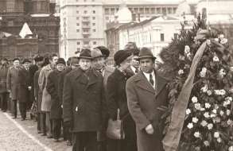
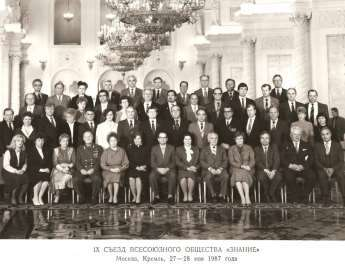
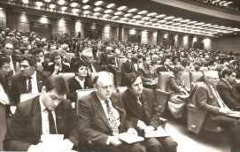
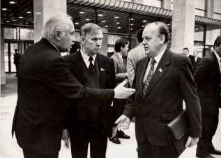

1. [~~Про мой род, себя и нашу элиту~~](./01.md)
2. [~~Бацькаўшчына~~](./02.md)
3. [~~Академия — завод — университет~~](./03.md)
4. [~~МРТИ — хорошо, БГУ — лучше~~](./04.md)
5. [~~Чернобыль~~](./05.md)
6. [**В Москву, к властям**](./06.md)
7. [Дорога к Вискулям](./07.md)
8. [Народы малочисленные и к ним приравненные](./08.md)
9. [Если б знал я, с кем еду, с кем водку пью…](./09.md)
10. [Беловежская пуща, Вискули, 7—8 декабря 1991 года](./10.md)
11. [Беларусь — Соединённые Штаты](./11.md)
12. [Интеллигенция и политика](./12.md)
13. [О университетах и ВУЗах, степенях и лекциях](./13.md)
14. [О «моём» зарубежье](./14.md)
15. [Патология](./15.md)
16. [Через годы, через расстояния](./16.md)

---

# Мавзолей и Кремль

Совок, не стремящийся попасть в мавзолей, должен был, по меньшей мере, вызывать подозрение. Но к мавзолею меня не тянуло, а венки к нему возлагал; и к телу вождя по ступенькам мавзолея опускался, когда нас, проректоров по научной работе ведущих университетов СССР, ежегодно собирали в Москве, где мы получали наставления и инструкции как работать дальше. Первоначально ведущими называли университеты, в которых один преподаватель приходился менее, чем на 8 студентов, потом слово «ведущий» никаких преимуществ не давало и служило просто похвалой вуза со стороны министерства.

Важным элементом программы считалось коллективное посещение мавзолея. Увильнуть от этого почётного дела невозможно. Считалось, что нам оказывается великое уважение: не нужно было стоять в длиннющей общей очереди. Для коллективных посещений по заранее поданным заявкам была своя отдельная очередь.

Попасть в Кремль я хотел, но это было делом трудно реализуемым. И вот в мае 1987 года меня, как председателя минской городской организации, избрали делегатом IX съезда общества «Знание», и моё желание сбылось.

Быть председателем городской организации считалось почётным и не составляло большого труда. Общественная работа такого рода не требовала особых затрат времени. Почти все вопросы решались по телефону. На углу улиц Комсомольской и Карла Маркса у меня был кабинет, приёмная и секретарь, но я там бывал очень редко и недолго — час-другой в неделю по расписанию приёма по личным вопросам. Всю работу вела моя заместитель, находившаяся на оплачиваемой должности, восседавшая в «моём» кабинете на «моём» кресле и командовавшая «моим» секретарём. Несколько членов правления собирались раз в три месяца и одобряли проделанную работу. Лишь несколько раз моя заместитель не могла выдержать атаку лекторов-марксистов, желавших увеличения квоты читаемых ими гонорарных лекций. Тогда она звонила мне и просила о помощи. Я поручал ей передать страждущим гонораров: жду их тогда-то, то есть в часы приёма. Когда приходили, объяснял, что знаю, насколько они хорошие лекторы, но, мол, трудно с деньгами, поэтому просил прочесть две-три безгонорарные лекции, как это делают некоторые другие лекторы и я, после чего страсти угасали, и мы мирно расставались.

IX съезд общества «Знание» происходил в Грановитой палате Кремля. Кроме стандартных заклинаний даёшь перестройку, нести знания в массы, сконцентрировать усилия, улучшить, расширить, не допускать и всемерно поощрять я на нём ничего не услышал. Однако было много встреч с интересными людьми, мероприятий и событий, сопутствующих съезду. Делегаты были «удостоены чести» сделать общий снимок в обстановке кремлёвской роскоши. Я на этом снимке — крайний слева в предпоследнем ряду. Из тех, кто у нас в республике читал лекции по линии обществе «Знание» кроме меня на съезде были лишь два человека — академик Хотылёва Любовь Владимировна и тогда ещё член-корреспондент (позднее — академик) Бабосов Евгений Михайлович (соответственно третья справа и третий слева в первом ряду). Остальные были партийными вдохновителями, иногда — организаторами лекторской работы с населением.

Запомнился прощальный приём для делегатов на верхнем этаже Дворца съездов, на котором было множество для кого-то важных лиц. Его трудно забыть, потому что, во-первых, приём был абсолютно безалкогольным — на нём не было даже пива. Этакая крупномасштабная поедаловка вкусных, почти невиданных в обычной жизни, яств с долгими тостами в честь КПСС, её предводителей и союзных руководителей общества «Знание».

Чоканье фужерами с соком или лимонадом меня, конечно же, раздражало, но раздражение приходилось скрывать. Хорошо знал — выпусти его наружу, и в Кремль больше не попадёшь. Во-вторых, делегаты съезда составили никчемное меньшинство в толпе важных московских персон, приглашённых на приём. Среди них были ветераны с орденами и медалями, которые в отличие от делегатов довольно громко поносили безалкогольные порядки и их авторов — секретарей ЦК КПСС Лигачева и Горбачёва. Воспроизвести их совковские речи в точности не совсем удобно. При устранении нецензурщины они звучат примерно так.

— Это же надо, до чего страну довели! Позор! Раньше, если на таком приёме я, как и любой другой присутствующий здесь человек, позволил бы себе напиться до невменяемости, то никаких бы дурных последствий из-за этого не произошло. Меня бы аккуратненько усадили в чёрную Волгу, привезли домой и ещё бы долго благодарили за то, что я удостоил их чести приём посетить. А теперь? Ни мне, ни всем осталь ным никакого удовольствия. Давись осетриной и закусывай апельсинами!

Со съезда общества «Знание» мы выходили через Спасские ворота Кремля и шли к в гостиницу «Россия», где нас поселили. Увидел на спуске от Красной площади к Москва-реке самолёт, похожий на наш АН-2, но поменьше размерами и красивее раскрашенный. Подошёл к группе зевак у самолёта и спросил у старшего по званию у находящихся возле самолёта милиционеров.

— Не с неба ли он свалился?

— Ну, сколько вам, граждане, объяснять, что реквизит это для съёмок приключенческого фильма. Перекур сейчас у киношников, они обедать уехали, а мы реквизит охраняем. Расходитесь, пожалуйста.

Я быстренько ушёл, чтобы меня не отнесли к числу недоверчивых примитивов. Назавтра узнал, что московская милиция — народ с хитрецой, квалифицированнее и деликатнее нашей минской, а недоверчивые зеваки — совсем не примитивы, а видавшие виды москвичи, хорошо знающие милицейские уловки. На охранявшемся милицией самолёте в Москву, практически, на Красную площадь из ФРГ прилетел немецкий пилот-любитель Руст, после чего в нашей стране почти три десятка военных командиров — профессионалов, имеющих отношение к ПВО, которым этот любитель «утёр нос», расстались со своими генеральскими должностями.

В холле гостиницы «Россия» была у меня и непростая личная встреча с белорусской детской поэтессой Эди Огнецвет, приехавшей на какое-то культурное мероприятие вместе с большой делегацией из БССР. Эдди, моя мать и мой отец были однокурсниками, окончившими в 1934 году литфак Высшего педагогического института в Минске. Моя мать неоднократно мне говорила, что Эди — единственная её подруга, которая осталась с мамой в самых дружеских отношениях после того, как осудили отца. Многие другие отвернулись от «жены врага народа» или же просто перестали узнавать. А вот Эди, не отвернулась: встречалась, приходила к нам, мама — к ней ит.д. Порядочный, достойнейший человек эта Эди, говаривала мама.

И вот вернулся отец и рассказал следующее. От него требовали в тюрьме, чтобы он написал доносы на нескольких человек, за что его обещали освободить. Отец категорически отказывался, тогда его начали убеждать, что все так делают. Это взаимовыгодный шаг, в итоге всех пожурят и отпускают на свободу. Отец не верил и продолжал отказывать ся. Тогда ему показали доносы на него, написанные рукой Эди Огнецвет (Каган) и Алесем Кучаром. Сказали: напишешь на всех, соберётесь на воле вместе и вдоволь насмеётесь — всех отпустим и дело закроем, так как все осознали всё, что и требуется. Отец отказался.

Что мог сказать я Эди Семёновне в вестибюле гостиницы «Россия» на её слова: «ну что же это ваш папа такое обо мне говорит?» Сказал, что не могу быть судьёй, тем более, судьёй поступков своих родителей. Мама к этому времени умерла, и вспоминать, что она говорила об Эди Семёновне только хорошее, мне не хотелось. Я и мысли не допускал, что отец рассказал что-то не совсем точно. Такого с ним никогда не было.

# Мои первые, но повторные в округе выборы

Через неполных два года после моего посещения Кремля в марте 1989 года избирались Народные депутаты СССР от территориальных и национально-территориальных округов. Несколько раз на собраниях вносились предложения включить меня в список кандидатов. Я всегда брал самоотвод, мотивируя это тем, что у меня есть серьёзная нравящаяся мне работа, и я хочу продолжать ею заниматься. Так выборы и закончились. Но в Московском территориальном округе города Минска, включающем Фрунзенский и Московский районы, на территории которого находились и университет и моя квартира, и где баллотировались только два кандидата, обоих с треском завалили. Оба вместе они набрали менее 15% голосов. Одного из них — первого секретаря горкома — завалили к моей великой радости, так как к этому времени я с ним основательно поругался после того, как он попытался меня отчитывать и требовал «понять, что нет оснований сеять панику из-за Чернобыля».

Ко времени начала выдвижения кандидатов на выборы на кафедре произошло приятное событие — мы успешно завершили все формальности с военпредами по сдаче серьёзной хоздоговорной работы. Как всегда в таких случаях, без лишнего шума и огласки собрались у одного из сотрудников дома (в данном случае это был доцент Александр Люцко) отметить достижение. В это смутное безалкогольное время, когда не очень легко было купить бутылку вина, мы соприкасались со спиртным редко. Хорошее настроение от того минимума алкоголя, который у нас был, стало ещё лучшим. Мы развеселились и начались «приколы», но не без трезвых предложений.

— Предлагаю тост за справедливость. Никто не возражает? Давайте действовать так, чтобы справедливость восторжествовала. Наш кафедральный питомец Дёма, точнее — Миша Демчук, вознёсшийся до заведующего отделом науки ЦК КПБ, избран Народным депутатом СССР от общества «Знание» как председатель республиканской организации общества, хотя по линии этого самого общества он никогда нигде не читал ни одной лекции. Шушкевич возглавляет городскую организацию и таких лекций прочёл множество. Заметьте, все — безгонорарные. Я предлагаю выдвинуть завтра нашего заведующего кафедрой и проректора кандидатом по этому нашему Московскому округу, где он живёт и мы сейчас находимся, и требую, чтобы он не взял самоотвод… Признавайся, будешь брать самоотвод? Если будешь, отказываемся с тобой пить сейчас и на все времена.

Если быть на 100% честным, то меня обрадовал такой поворот дел, но вида не подавал. Ведь соглашаться с тем, что кто-то случайный на собрании выдвигает тебя кандидатом в депутаты, означает обнажить своё тщеславие, поэтому самоотвод в некоторой степени украшает. Отпадает вариант провалиться. А здесь — друзья вынудили, в состоянии лёгкого подпития пообещал… Ну чем не демонстрация верности слову скромного человека, не претендующего на славу. И я продолжив веселье, пообещал самоотвод не брать.

На университетском собрании по выдвижению в бюллетень для тайного голосования были внесены три кандидатуры. За меня проголосовало более 450 человек, за проректора Евгения Петряева порядка 70, а неизвестный мне дотоле Зенон Позняк, не присутствующий на собрании, но выдвинутый сотрудниками университета, получил примерно 50. Я к стыду своему настолько погряз в неполитических делах и заботах, что ничего не знал ни о Позняке, ни о БНФ — Белорусском народном фронте, что стало всем понятным после моего выступления и моих ответов на вопросы. На следующее утро понял, что члены БНФ есть и на моей кафедре. На моём столе в кабинете заведующего кафедрой появилась небольшая брошюра — «Программа БНФ».

Если бы не эта программа, то я, пожалуй, был бы более горячим сторонником БНФ. Всё, что касалось в ней возрождения белорусской культуры, белорусского языка, исторической правды мне сразу же понравилось и продолжает нравиться сегодня. Но предложения по реформированию высшего образования, с которым была связана вся моя жизнь, демонстрировали незнание авторами ни истинного положения дел, ни путей совершенствования и устранения недостатков. Вместе с тем было на редкость приятно сознавать, что в Беларуси есть истинные патриоты, борющиеся против реально имеющего место унижения национального достоинства белорусов методами, не направленными против людей других национальностей.

Избирательная агитационная кампания была непродолжительной, но очень интенсивной. Моими конкурентами были два достойнейших человека — православный священник, настоятель церкви на Военном кладбище, и ставленник обкома партии (!) директор «Амкадора» Василий Михайлович Шлындиков.

Был и форменный негодяй — профессор, выпускник МГИМО. Фамилию я его забыл и вспоминать не хочу, но выступления и оскорбления в адрес оппонентов помню. Они напоминали взрыв бочки с нечистотами, которые обрызгивали всех: и правых и виноватых. Плюс коронная фраза: «как вы смеете идти в депутаты, не зная в совершенстве ни одного иностранного языка?»

— Зачем вы делаете такие заявления, ведь вы — образованный человек? — Спросил его как-то я.

— Ради самых простых людей, а их, таких избирателей, большинство. Они должны знать, что я не рафинированный чистюля, хотя и МГИМО кончал, а боец! Вот увидите, они меня выберут!

В итоге набрал, профессор, доли процента голосов.

Встречи кандидатов с избирателями можно было проводить где угодно и когда угодно. Организации, в распоряжении которых были зрительные залы, обязаны были предоставлять их кандидатам, если в желаемое время там не проводились какие-то плановые мероприятия. О встрече, например, в зале театра музкомедии, в клубе Киселёва, в зале газовиков на улице Гурского члены «моей команды» надёжно договаривались по телефону.

Было немало забавных инцидентов. В зале на Гурского кто-то наделил буквально всех участников листовкой, в которой я представлялся личностью настолько отвратной, что никакой уважающий себя человек за меня голосовать не должен.

Зал переполнен. Я выступил, ответил на вопросы. Выступили и другие кандидаты. Встаёт рабочего вида человек и обращается к президиуму.

— Откуда в зале эта неприличная листовка?

Президиум молчит. Вопрос повторяется.

— Откуда в зале эта листовка и ещё пачки таких же листовок в
коридоре, чтобы мы их разнесли по всему округу? Ответьте кто-нибудь из организаторов встречи.

Встаёт представитель райкома партии — третий секретарь.

— Товарищи, вы же знаете, у нас теперь свобода слова, свобода высказывания мнений. По-видимому, кто-то решил таким образом довести до вас своё мнение. Организаторы встречи к этой листовке никакого отношения не имеют.

К трибуне из зала с решительным видом рвётся женщина. Её пропускают. Она употребляет до сих пор непонятное для меня слово «лапидус», но я хорошо его запомнил и с того случая временами употребляю сам.

— Ах ты, лапидус проклятый. Я же вот этими руками по твоему приказу печатала эти листовки, как ты пояснял, для того чтобы негодяи к власти не прорывались. А негодяй-то оказывается ты…

Что здесь началось, словами передать трудно.

В конце концов, я был избран, но оформление документов несколько затянулось, и я прилетел в Москву, хотя и до начала съезда, но позднее других депутатов. Меня «подбросили» правительственным самолётом вместе с премьером Вячеславом Кебичем. Он объяснял своё опоздание большой занятостью.

# Первый съезд

Первый съезд Народных депутатов СССР открылся 25 мая 1989 года. Он состоял из 2250 депутатов: 750 — от территориальных округов, 750 — от национально-территориальных, 750 — от общественных организаций. По замыслу он как бы воплощал идею соборности — представительство всех слоёв населения, но по существу, КПСС держала в своих руках контрольный пакет акций. Со временем пакет становился более скудным, а на третьем съезде уже не позволил сохранить руководящую роль КПСС.

Полномочия съезда были широчайшими, он мог рассмотреть любой вопрос, касающийся СССР, и принять по нему окончательное решение. Заседания транслировались по телевидению в прямом эфире. Съездом руководил Председатель Верховного Совета СССР. В первый же день работы съезда Михаил Горбачёв был на эту должность избран. Предполагалось собирать съезд раз в год и решать на нём наиболее важные вопросы внутренней и внешней политики СССР. Законодательные, распорядительные и контрольные функции возлагались на формируемый Съездом относительно небольшой по численности Верховный Совет СССР.

Депутат Юрий Дмитриевич Черниченко, выступая на Съезде, назвал сторонников М.С. Горбачева « агрессивно-послушным большинством», а Гавриил Харитонович Попов открыто заявил об оппозиции этому большинству и призвал к формированию межрегиональной депутатской группы — МДГ. 7 июня прошло первое собрание МДГ. 29—30 июля состоялась первая конференция МДГ, на которой был избран Координационный совет (КС), 5 сопредседателей и приняты «Тезисы к программе практической деятель ности по реализации перестройки». Сопредседателями КС стали Б.Н. Ельцин, Ю.Н. Афанасьев, Г.Х. Попов, В.А. Пальм, А.Д. Сахаров, секретарём А.Н. Мурашов. В конференции участвовало 268 членов МДГ, в том числе из БССР — А.М. Адамович, В.В. Быков, А.О. Добровольский, С.С. Шушкевич, кроме них никто из Народных депутатов СССР из Беларуси не решился тогда войти в МДГ.

На второй конференции МДГ в сентябре 1989 года была принята Платформа МДГ, включавшая такие пункты, как отмена 6-й статьи Конституции о руководящей роли КПСС, демократизация избирательной системы, демократический закон о печати, законы о земле и собственности, о новом Союзном договоре. Многие пункты Платформы были приняты III и IV съездами Народных депутатов СССР. На III съезде в марте 1990 года была отменена статья 6 Конституции СССР. Ряд членов МДГ стали видными политиками и государственными деятелями. Среди них, кроме упомянутых выше, — А. А. Акаев, Г. Э. Бурбулис, А. И. Казанник, К. Прунскене, А. А. Собчак, С. Б. Станкевич, Г. В. Старовойтова, В. А. Яворивский.

За мной на заседаниях съездов было закреплено место в проходе между рядами, с которого было довольно просто подойти к микрофону для «голоса из зала», что позволяло мне чаще других подавать голос.

В свою очередь телекамера фиксировала ораторов у микрофона крупным планом, поэтому и в Москве и в Минске я буквально двадцати шагов не мог сделать, чтобы кто-то не крикнул: смотри вон «депутатик» пошёл. Почему «депутатик», не понимаю до сих пор.
Вроде не маленький.

# Что имели, умели и могли Народные депутаты СССР

Народные депутаты СССР располагали довольно обширными правами и возможностями. Скажу прямо, большинство из них не умели, а порой и не хотели ими пользоваться. То и другое было хлопотно. Для депутатов со стажем, то есть для тех, кто был депутатом в старое советское время, главным было ожидание партийных указаний и их беспрекословное выполнение. А к депутатскому довольствию и депутатским привилегиям они давно привыкли.

До начала первого заседания съезда первый секретарь ЦК КПБ Народный депутат Ефрем Евсеевич Соколов попытался собрать всех «белорусских депутатов», информировать их об общих целях и задачах. Адамовича и Быкова на встречу не приглашали, остальные собрались. Добровольский, Воронежцев, Корниенко, Игнатович, ещё несколько депутатов и, естественно, я, сказали, что избраны не от партии и не благодаря помощи партии, а скорее, наоборот, вопреки желанию её республиканского руководства. Поэтому, заявив, что будем выполнять наказы избирателей, а не руководствоваться пожеланиями партийных руководителей, мы собрание покинули. Произошёл раскол почти так на так. «Протестная» группа оказалась чуть меньшей, но, увы, далекой от сплоченности, а отдельные её представители сначала нередко оказывались в лагере старых партийцев. Ситуация серьёзно изменилась в пользу депутатов, настроенных на перемены, лишь к третьему съезду в марте 1990 года.

Каждый Народный депутат был личностью неприкосновенной, имел помощника, получающего заработную плату, имел «ковёр-самолёт» — право бесплатного проезда пассажирским водным транспортом, поездом, самолётом, общественным транспортом на всей территории Советского Союза, мгновенно получал дипломатический паспорт при направлении его в зарубежную поездку, в дни съездов ему выдавались суточные, которые и в обычных условиях можно было считать внушительными, а в кремлёвском буфете и подавно. На депутатский запрос в течение десяти дней должна была ответить любая инстанция, в которую депутат обратился, Генеральная прокуратура СССР должна была ответить на запрос депутата в течение 30 дней.

Я разбил ставку помощника депутата на две полставки и зачислил на них двоих студентов юридического факультета БГУ — «патологическую отличницу» и «афганца» — немало повидавшего парня, прошедшего Афганистан. О таких помощниках можно было только мечтать . Отличница подготовила ряд писем на основе обращений ко мне избирателей, причём пять из них — в Генеральную прокуратуру СССР. По четырём из этих писем протест прокуратуры был направлен в суд! Пересмотр дел привёл к освобождению невинно осуждённых. Успех невиданный, обычно Генпрокуратура положительно реагирует на (0,5—1)% поступающих заявлений.

Впоследствии моя замечательная помощница — Наталья Козыренко — уехала в Нью-Йорк в Колумбийский университет для совершенствования образования. Я был почти уверен, что она не вернётся в Беларусь, и не ошибся. В Беларуси, как в стране, где господствуют указания, а не закон, высококвалифицированным юристам делать нечего. Недавно я узнал, что «мою отличницу» нарасхват приглашали престижные фирмы и сейчас она возглавляет британскую юридическую фирму в Москве.

Студент-афганец был хорош по-своему при контактах с органами правопорядка и вообще с теми правдолюбцами, которые изображали из себя «крутых». В целом же народным депутатам СССР были даны права и возможности решать по справедливости жизненно важные вопросы избирателей любого ранга. Мы этим широко пользовались.

---

1. [~~Про мой род, себя и нашу элиту~~](./01.md)
2. [~~Бацькаўшчына~~](./02.md)
3. [~~Академия — завод — университет~~](./03.md)
4. [~~МРТИ — хорошо, БГУ — лучше~~](./04.md)
5. [**Чернобыль**](./05.md)
6. [~~В Москву, к властям~~](./06.md)
7. [**Дорога к Вискулям**](./07.md)
8. [Народы малочисленные и к ним приравненные](./08.md)
9. [Если б знал я, с кем еду, с кем водку пью…](./09.md)
10. [Беловежская пуща, Вискули, 7—8 декабря 1991 года](./10.md)
11. [Беларусь — Соединённые Штаты](./11.md)
12. [Интеллигенция и политика](./12.md)
13. [О университетах и ВУЗах, степенях и лекциях](./13.md)
14. [О «моём» зарубежье](./14.md)
15. [Патология](./15.md)
16. [Через годы, через расстояния](./16.md)
