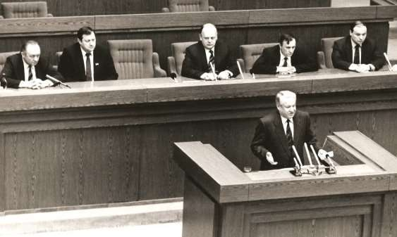
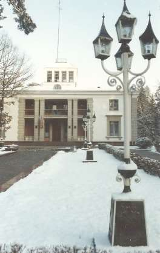
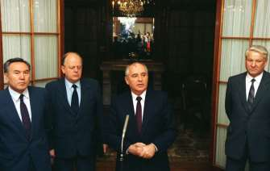
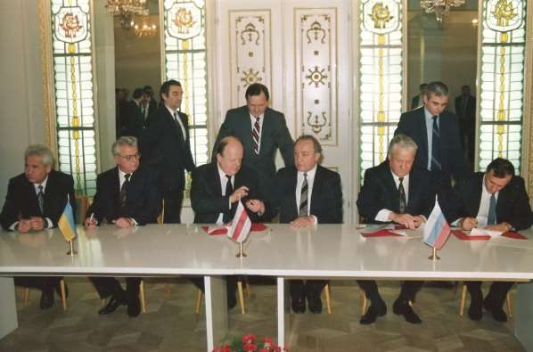

1. [~~Про мой род, себя и нашу элиту~~](./01.md)
2. [~~Бацькаўшчына~~](./02.md)
3. [~~Академия — завод — университет~~](./03.md)
4. [~~МРТИ — хорошо, БГУ — лучше~~](./04.md)
5. [~~Чернобыль~~](./05.md)
6. [~~В Москву, к властям~~](./06.md)
7. [~~Дорога к Вискулям~~](./07.md)
8. [~~Народы малочисленные и к ним приравненные~~](./08.md)
9. [~~Если б знал я, с кем еду, с кем водку пью…~~](./09.md)
10. [**Беловежская пуща, Вискули, 7—8 декабря 1991 года**](./10.md)
11. [Беларусь — Соединённые Штаты](./11.md)
12. [Интеллигенция и политика](./12.md)
13. [О университетах и ВУЗах, степенях и лекциях](./13.md)
14. [О «моём» зарубежье](./14.md)
15. [Патология](./15.md)
16. [Через годы, через расстояния](./16.md)

---

Одним из проявлений гениальности Владимира Высоцкого было умение кратко и образно, а поэтому предельно доходчиво, сказать очень многое. Когда вспоминаю, кто из наших белорусов оказался вместе со мной в Беловежской пуще, то так и хочется ещё раз воскликнуть: «**если б знал я, с кем еду, с кем водку пью…**» Хотя водки в Вискулях я не попробовал. Не по протоколу это, и даже не по нормам разговора при встречах без галстуков, но, правда. Главный герой предшествующей главы и главный тогдашний, как казалось, мой единомышленник в вискулёвском деле оказался настолько многолик, что и сегодня с радостью пришил бы мне 58 статью и был бы рад, что нет никаких оснований добавить по Высоцкому «ничего, вы так молоды!».

Упрекать тех, кто ранее и теперь придерживался и придерживается иного подхода, чем утверждённый в Вискулях, безнравственно. Каждый человек имеет право на собственное мнение, имеет право его отстаивать и право его изменить, объяснив, почему это произошло. Но иначе, чем кощунством я не могу назвать деяния тех политиков высокого ранга, кто принятию вискулёвского решения способствовал, горячо его приветствовал, а потом, боясь потерять мелкие, по большому счёту, блага, изменил своё мнение на противоположное, раболепствуя перед властвующим правителем.

# Приглашение

Наиболее деловым и преданным делу человеком в нашем правительстве я считал тогда премьер-министра Вячеслава Францевича Кебича. Нам чаще случалось говорить по телефону, чем встречаться, и мы имели по заверению связистов КГБ два вида неподслушиваемой телефонной связи — секретную «тройку» с трёхзначными номерами и «вертушку» с номерами четырёхзначными. Тем не менее, решили установить ещё и прямую связь, безномерную: подымаю трубку я, срабатывает вызов у премьера и наоборот. Эксплуатируя нашу индивидуальную, снова же неподслушиваемую по заявлению КГБ связь, мы с Вячеславом Францевичем убедились, что одинаково обеспокоены предстоящей зимой 1991—92 гг.

— Вы в очень хороших отношениях с Борисом Николаевичем Ельциным, — не раз говаривал мне Кебич, — это нельзя не использовать для обогрева наших граждан. Пригласите его на охоту в пущу, примем, как подобает принять президента России, и, не сомневаюсь, уговорим его нам помочь с нефтью и газом.

Я всегда подтверждал, что хочу именно так поступить, но не сложилась ещё такая ситуация, чтобы удобно было это сделать. Вячеслав Францевич, в свою очередь, регулярно напоминал: время не ждёт, торопитесь.

И вот подвернулся случай. 20 октября 1991 года Горбачёв собрал в Ново-Огарёво Госсовет и раздал всем его членам — главам республик — новый проект союзного договора. Все долго проект листали, но никто не торопился выступать. Меня же, как говорят, заело, и я выступил. Сказал, примерно следующее.

— Уважаемый Михаил Сергеевич. У меня странные чувства. Договор предусматривает объединение республик в Конфедерацию. Но мне неудобно будет докладывать Верховному Совету документ, в котором не соблюдаются ординарные словарные определения. Наши депутаты — люди грамотные, они осудят меня за некорректности во вносимом на их утверждение документе. Конфедерацией в проекте называется почти унитарное государство. Президент в нём наделён очень большой властью. Иными словами, получается новый Советский Союз, в котором вместо Политбюро ЦК КПСС — президент.

Все затихли, молчит и Горбачёв. После небольшой паузы встаёт Ельцин. Его речь была существенно менее сдержанной по сравнению со мной. Он решительно осудил проект. Опять молчание.

Горбачёв встаёт и уходит. Председательское место остаётся пустым. Через минуту-полторы, не вставая, молчание нарушает Ислам Каримов.

— Вы, Станислав Станиславович, и вы, Борис Николаевич, поссорили нас с Михаилом Сергеевичем. Находите его и возвращайте в председательское кресло.

Все члены Госсовета закивали головами в знак согласия с Президентом Узбекистана, а Борис Николаевич и я отправились искать Президента СССР. Случай для реализации нашей с Кебичем задумки оказался более, чем подходящим. Следуя в направлении удаления Горбачёва вместе с Президентом России, я и пригласил Бориса Николаевича на охоту в Беловежскую пущу.

Он охотно согласился.

А Горбачёв?

Нашли и Горбачёва. Это для меня ново-огарёвские коридоры,
залы и балюстрады — лабиринт. Для Ельцина — родная стихия. Михаил Сергеевич даже минимального неудовольствия не выразил, когда мы обнаружили его возле вазы с фруктами. Достал бутылку коньяка — отборного армянского, налил всем по рюмке, выпили. И, как будто ничего не случилось, вернулись на заседание Госсовета.

Мне хотелось быстрее сообщить премьеру Вячеславу Кебичу, что Борис Николаевич согласился приехать в пущу, однако, звонить из Москвы и доводить до него радостное, по моему убеждению, известие я не решился. Было достаточно тех, кто мог помешать встрече. Только в Минске мы подробно проанализировали сложившуюся ситуацию, Кебич ещё раз заверил меня, что пуща к приёму готова.

Оговорили и происходящее в России. Понимали: президент Ельцин, как говорят, на коне. Для завоевания его расположения нужно при встрече ненавязчиво отметить, что мы радуемся его успехам и что наши слова — не просто долг вежливости, а осознание его личных достижений, его изобретательности, уместного и своевременного проявления воли и находчивости на посту столь высоком. Что касается меня лично, я действительно был им восхищён, но никак не хотел выглядеть простым почитателем величия первого Президента России, тем более. угодничать.

Скажу сразу, не глядя на теоретическую готовность, воспеть наше восторженное отношение к российскому президенту так и не удалось никому из нас и в пуще и до пущи. Все разговоры с Ельциным были исключительно деловыми. Обстановка в России и в мире складывалась благоприятным для Беларуси образом.

Действительно: Россия 12 июня 1991 года впервые в своей истории всем народом избрала президента. Ельцин победил в первом туре, никто не был соизмерим с ним по популярности. В своём выступлении на Торжестве по поводу вступления в должность первый Президент России сделал заявления, принципиально отличающиеся от тех, с которыми выступали все высшие иерархи КПСС и СССР, завоевав руководящий пост.

>Веками государственный интерес, как правило, ставился выше человека, его нужд и устремлений. Мы, к сожалению, позже, чем другие цивилизованные народы, осознали, что государство сильно благополучием своих граждан… В основе возрождения нашего государства — духовное раскрепощение человека, подлинная свобода совести и полный отказ от любого идеологического диктата.

# «Расширение» приглашения

С Борисом Николаевичем мы договорились, что дату встречи в пуще согласуют наши службы. Помощники Ельцина и мои сразу же начали изыскивать взаимоприемлемый вариант, но Вячеслав Кебич предложил пригласить ещё и Леонида Макаровича Кравчука, если, конечно, Борис Николаевич не будет возражать.

Я позвонил Ельцину. Он не возражал, скорее, обрадовался. Приглашение Кравчука породило задержку, так как 1 декабря в Украине должны были состояться президентские выборы, и кандидат в президенты Л. М. Кравчук не мог отлучиться из страны во время избирательной кампании. Решили встречать ся сразу же после украинских выборов.

Зачем был нужен Кравчук? Были факторы за и против. Против, так как трёхсторонние договорённости достигаются значительно сложнее двухсторонних. За, потому что у нас одинаковая главная проблема — потребность в энергоносителях на зиму — и нелепо устроить нездоровую конкуренцию по вопросу, кто сумеет лучше угодить России, чтобы их получить . А вместе, всё честно, взаимопрозрачно, понятно.

Вторая причина расширения состава участников встречи была обусловлена тем, что многие отрасли промышленности, особенно крупные энергопотребители, должны были ясно представлять, что их ждёт в плане энергообеспечения в ближайшей перспективе. Поэтому делегации на вискулёвскую встречу укомплектовывались руководителями и представителями заинтересованных министерств и ведомств.

Таким образом, упомянутые и другие менее значимые факторы обусловили приезд в Беловежскую пущу представительных делегаций России, Украины и Беларуси, способных быстро принимать решение на высшем государственном уровне трёх стран.

# Что оставалось в сознании людей

В декабре 1991 года Советский Союз продолжал по инерции оставаться страной, где большинство продолжало думать одно, говорить другое, а делать третье. Откровенничали больше, чем в хрущёвские, брежневские или андроповские времена, но на самое «святое» — на страну — не замахивались. Принятая в октябре 1961 года ХХII съездом КПСС Программа Коммунистической партии Советского Союза, обязывающая строить коммунизм, была отвергнута два года назад Съездом Народных депутатов СССР вместе с руководящей ролью КПСС. Но она не выветрилась из сознания наивных сторонников самого справедливого общества, а их были миллионы. Да как мож но было сразу отвергнуть мечту — «*бесклассовый общественный строй с единой общенародной собственностью на средства производства, полным социальным равенством всех членов общества, где вместе с всесторонним развитием людей вырастут и производительные силы на основе постоянно развивающейся науки и техники, все источники общественного богатства польются полным потоком и осуществится великий принцип «от каждого — по способностям, каждому — по потребностям». Коммунизм — это высокоорганизованное общество свободных и сознательных тружеников, в котором утвердится общественное самоуправление, труд на благо общества станет для всех первой жизненной потребностью, осознанной необходимостью, способности каждого будут применяться с наибольшей пользой для народа*».

Как можно было мгновенно, резко отказаться от восславленного в Программе КПСС рая на земле, причём рая для всех!

>Высокая коммунистическая сознательность, трудолюбие и дисциплина, преданность общественным интересам — неотъемлемые качества человека коммунистического общества.\
\
Коммунизм обеспечивает непрерывное развитие общественного производства и повышение производительности труда на основе быстрого научно-технического прогресса, вооружает человека самой совершенной и могущественной техникой, поднимает на огромную высоту господство людей над природой, дает возможность все больше и полнее управлять ее стихийными силами. Достигается высшая ступень планомерной организации всего общественного хозяйства, обеспечивается наиболее эффективное и разумное использование материальных богатств и трудовых ресурсов для удовлетворения растущих потребностей членов общества.\
\
При коммунизме не будет классов, исчезнут социально-экономические и культурно-бытовые различия между городом и деревней; по уровню развития производительных сил и характеру труда, формам производственных отношений, бытовым условиям, степени благосостояния населения деревня поднимется до уровня города. С победой коммунизма произойдет органическое соединение умственного и физического труда в производственной деятельности людей. Интеллигенция перестанет быть особым социальным слоем, работники физического труда по своему культурно-техническому уровню поднимутся до уровня людей умственного труда, Таким образом, коммунизм покончит с делением общества на классы и социальные слои, в то время как вся история человечества, за исключением первобытных времен, была историей классового общества. Деление на противоположные классы вело к эксплуатации человека человеком, классовой борьбе и антагонизму между нациями и государствами. При коммунизме все люди будут иметь равное положение в обществе, одинаковое отношение к средствам производства, равные условия труда и распределения и активно участвовать в управлении общественными делами. Утвердятся гармонические отношения между личностью и обществом на основе единства общественных и личных интересов. Запросы людей при всем их громадном разнообразии будут выражать здоровые, разумные потребности всесторонне развитого человека.

Заканчивалась более, чем 200-страничная Программа словами: «*Нынешнее поколение советских людей будет жить при коммунизме!*».

Программу обязаны были изучить все граждане СССР, а финальные слова и определение коммунизма требовалось знать наизусть школьникам, студентам высших и средних специальных учебных заведений и многим другим категориям граждан.

Как ни парадоксально, но многие люди всему этому привыкли верить, а некоторые продолжают и сейчас верить в коммунизм и в то, что его помешали построить жадные до наживы капиталисты и неспособные постичь коммунистическое учение демократы.

# Солидарность VIP-персон мирового уровня

На день встречи в пуще не все мы чётко представляли политическую обстановку в мире. Многое стало известно позднее. Но то, что виднейшие политики мирового уровня президент США Буш, канцлер Германии Коль, президент Франции Миттеран и отошедшая от рычагов управления Британией, но по-преж нему знаменитая, Маргрет Тэччер — решительные противники так называемого сепаратизма, т. е. разделения СССР на независимые государства, знало большинство приехавших в Вискули. Все эти главы и экс-главы ведущих капиталистических стран считали, что им очень выгодно иметь дело с одним Горбачёвым, а не с множеством малопредсказуемых новых лидеров.

Не все приехавшие в Вискули сознавали, почему руководители крупнейших государств выступали против деления СССР на составляющие его части. Ведь распад уже, фактически, произошёл в августе 1991 года после разгрома ГКЧП. Но распад грозил быть неконтролируемым. Президент Франции Франсуа Миттеран предрекал.

— *Возможность говорить о Советском Союзе в прошедшем времени поставила на повестку дня сакраментальный вопрос: «Что дальше?». Дезинтеграция государства, кризис власти, утеря веры, сопровождающиеся экономическим спадом, — всё это способно привести к вспышке гнева населения, которое сделает практически невозможным управление страной, впадающей в анархию.*

Формально всё оставалось на своих местах. Запад, как и в послевоенное сталинское время, продолжал бояться русских. Европа искала пути и формы объединения. Главная политическая цель объединения была располагать силой, чтобы противостоять русским. Она следовала из коронной фразы в лекции Уинстона Черчилля 19 сентября 1946 года в Цюрихском университете. «**Было бы страшной катастрофой, если бы русское варварство подавило культуру и независимость древних государств Европы**».

А эти «русские», т. е. граждане СССР, порываются разделиться на множество государств, четверо из которых — с ядерным оружием. При их природной дикости они будут колошматить друг друга и, более того, могут втянуть в ядерный конфликт и наши благополучные страны. Запад не верил, что войну при распаде СССР на части можно предотвратить, поэтому все компетентнейшие политики настойчиво противостояли распаду СССР. Не будет распада — не будет войны.

Непримиримая к разделу СССР политика стран Запада была в значительной мере обусловлена и их хорошим пониманием, что такое политики Советского Союза. Познав Горбачёва, они понимали, что воспитывать в западном духе нескольких Горбачёвых будет очень сложно. А с этим одним будет проще, он уже кое-чему научен. С иными сложнее, они с настоящим догматическим марксиско-ленинским упрямством, а не из преуспевших на партработе помощников комбайнеров. Истинные партократы убеждены, что СССР — великая держава, ядерная супердержава, что весь мир против них, что если враг не сдаётся, его уничтожают, что все богатства нажиты нечестным путём, что деньги — не главное…

В 2011 году Министр иностранных дел Швеции Карл Билдт добился решения парламента разрешить опубликовать на сайте МИД Швеции дипломатические документы, посланные шведскими посольствами до 1991 года. По существующим в Швеции правилам гриф секретности снимается с таких документов через 50 лет, Билдт попросил снять через 20. Самое важное «открытие», которое можно сделать на основе анализа опубликованной переписки — чудовищная боязнь гражданской войны на территории Советского Союза, которая способна затронуть и иные страны.

Что касается внутренней жизни всё ещё формально существующего Советского Союза, то Центр терял последние остатки власти. На проведённом совместно с выборами президента Украины референдуме 1 декабря 1991 года за независимость Украины высказались 90,32% участников голосования. Не трудно было догадаться, что доля желающих независимости граждан в других республиках не меньше.

# Прилёт-приезд

Самолёт с Президентом России Ельциным и сопровождавшими его лицами прилетел в Минск утром 7 декабря. Российскую делегацию повезли сначала в Заславль, где все могли отдохнуть и подготовиться к кратковременному перелёту на авиабазу в Пружаны, а оттуда автотранспортом приехать в пущу.

Планировалось и выступление Бориса Николаевича в Верховном Совете. Депутаты надеялись из уст главного россиянина услышать основные положения российской концепции отношений с республиками СССР, принявшими декларации о государственном суверенитете.

При реализации этого пункта программы Ель цина постигла неудача. Ему пришлось оправдываться за грубую оплошность тех, кто подготовил для него старинную грамоту, которую он хотел передать в качестве подарка Верховному Совету Беларуси. Древняя грамота оказалась документом, подтверждающим имперский характер её составителей, что моментально уловили высокообразованные депутаты — профессионалы-историки. Они громко объявили об этом, после чего раздались довольно дружные крики осуждения. Зал стал неуправляемым, и хотя Ельцин достаточно быстро из зала удалился, рёв и гам преследовали его и в коридоре.

Меня случившееся не обрадовало. Происходящее было фактором, усложняющим реализацию задуманного. Но у меня не было морального права защищать Бориса Николаевича. Его политическая ошибка была очевидной, и не только депутаты от БНФ меня бы обоснованно освистали. Я сожалел о случившемся, так как начиналось всё совсем не так, как хотелось, но сгладить ситуацию был не в состоянии. По свежим следам в перерыве сессии я не смог переговорить с Ельциным, так как он уже уехал, наверное, в Заславль.

Я поехал в аэропорт. Успел к моменту прилёта президента Украины Кравчука. Встретил Леонида Макаровича, поздравил с победой на президентских выборах и должен был на своём ЯК-27 лететь вместе с нашей делегацией за ним на авиабазу Пружаны, но решил, что можно легко найти дополнительное время для общения с президентом Украины и напросился к нему в самолёт. Однако наш разговор в самолёте не стал источником дополнительных сведений о позиции украинской стороны.

В итоге все самолёты прилетели на авиабазу, где блеснул своим радушием и гостеприимством глава Брестской области Виктор Иванович Бурский, а все участники без приключений приехали в бывшую базу отдыха ЦК КПСС, перешедшую в ведение правительства БССР. Не возникло никаких проблем и с размещением гостей, хотя такого массового наплыва приезжих в Вискули никогда до этого дня не было.

# Вискули, день первый

В главном здании бывшей резиденции ЦК КПСС находились апартаменты для самых важных гостей. С позиций моей требовательности три комплекта номеров высшего качества были примерно одинаковой степени комфортности, одинакового уровня дизайна и почти не отличались по площади. Два из них были предоставлены соответственно Ельцину и Кравчуку. Я воздержался, чтобы занимать третий, не исключал, что всякое может случиться, и поселился в двухэтажном коттедже, который мне не меньше нравился. Там же поселились два моих охранника.

Вечером 7 декабря собрались в апартаментах Ельцина. Кроме глав делегаций от России присутствовали Геннадий Бурбулис, Егор Гайдар, Андрей Козырев, Сергей Шахрай; от Украины Витолд Фокин и три депутата Рады; от Беларуси Вячеслав Кебич, Михаил Мясникович, Пётр Кравченко.

Говорили о нефти, газе, многом ином, но неумолимо вставал вопрос, ставший волею судьбы главным, что делать в реально имеющей место ситуации, когда ни Горбачёв, ни какой-нибудь властный орган не управляет Союзом ССР.

Всё дальнейшее я запомнил с подробностями по той простой причине, что не очень жаловал Геннадия Бурбулиса, как и всех иных философов-марксистов. Ни разу ни от одного советского философа я не услышал чего-то такого, что не было бы озвучено в очередных призывах ЦК КПСС и Совмина СССР, напечатано в «Кратком курсе истории КПСС» или в университетских пособиях, толкующих этот «краткий курс». А слово взял именно философ первый (и, по-видимому, последний) Госсекретарь Российской Федерации Геннадий Эдуардович Бурбулис.

— Господа, а не согласитесь ли вы поставить свою подпись под таким предложением: *СССР как геополитическая реальность и субъект международного права, прекращает своё существование?*

Суть предложения Бурбулиса я понял мгновенно и, не скрою, оно мне сразу понравились. Почувствовал себя неуютно за то, что не лучшим образом к нему до этого относился. Поэтому я не стал ожидать, пока кто-то выскажется, и сказал сухо.

— Я подпишу.

А ведь мог и похвалить философа, так как, не стесняюсь это признать, даже позавидовал ему. Потом все присутствующие подтвердили, что готовы подписаться под словами Госсекретаря Российской Федерации Бурбулиса. Таким образом философ, «марксист-ленинец» — именно такие слова всегда ставились в СССР перед словом «философ», когда речь шла о университетском преподавателе или о научном сотруднике, фактически, определил, чем мы будем заниматься в Вискулях всё остальное время. Это, вдруг, начали пояснять друг другу все собравшиеся в резиденции президента России Бориса Ельцина. Здесь же прозвучало тогда и часто повторяемое впоследствии о Беловежском соглашении «мы обязаны делать то, что нельзя не делать»!

Галдёж прервало многократное ельцинское «понимаешь!»

— Кость, понимаешь, имеем, хорошую кость. Нужно нанизать на неё мясо. Но нельзя ничего упустить, оставить неупомянутым. Ничто не должно повиснуть в воздухе. Иначе нас добрым словом никто не вспомнит. Прежде всего, никто не должен испугаться того, о чём мы заявим нашим гражданам и всему миру. На первом месте должно быть созидание, а не разрушение. Мы должны показать, понимаешь, что существует способ остаться единением без лицемерия и попрания прав и свобод граждан по национальному и любому иному признаку. И хватит этих «СС», понимаешь: СССР, КПСС, а теперь ещё ССГ — Содружество Суверенных Государств. Независимых, понимаешь ! Содружество Независимых Государств!

Я радовался за Бориса Николаевича. Утреннее выступление в Верховном Совете забыто, значит исходная цель встречи — шанс договориться о нефти и газе не уменьшен. И хотя Ельцин не говорил ничего того, что не прозвучало бы в той части нашего общего разговора, которую я назвал «галдёж», но он великолепно всё обобщил. Не нужно было давать дополнительные пояснения тем, кто вошёл в группу подготовки проекта соглашения. Здесь же согласовали и отводимый на подготовку проекта срок: полная готовность — к завтрашнему раннему утру.

# Задумались: что творим?

Сформированная группа разработчиков проекта ушла заниматься порученным делом. На некоторое время отлучился и Кебич, проверить нормально ли всё обеспечено и нет ли проблем у каких-то служб. Чуть позднее и он присоединился к разговору оставшихся — Ельцина, Кравчука, Бурбулиса, Фокина и меня.

Что получалось? Мы решили денонсировать Договор 1922 года о создании СССР. В этой части предполагаемого соглашения всё правильно, всё легитимно. По должности Ельцин, Кравчук и я наделены Конституциями РФ, Украины и РБ правом подписывать международные договоры от имени наших государств. Подписанные договоры сразу же приобретают законную силу, но наша обязанность незамедлительно представить их на ратификацию парламентами. Если парламенты ратифицируют, действие договора продолжается. Если нет — останавливается.

СССР создали в 1922 году Российская Федерация, Украинская и Белорусская ССР, а также Закавказская Федерация. Но последняя ликвидирована и не имеет правопреемника. Значит, все без исключения существующие создатели СССР принимают решение о денонсации. И здесь всё легитимно.

Но появляются все основания считать, что мы создаём новый «СС», точнее ССР — Союз Славянских Республик. Однако есть возможность ситуацию подправить. Знаем, в Москву летит Назарбаев. Не позвать ли его к нам? Решили — позвать! И, ясное дело, лучше всего это сделать Борису Николаевичу.

Связались с самолётом Назарбаева. С нашей стороны связь была громкоговорящая. Ельцин информировал о том, что мы собрались, президента Казахстана и пригласил его прилететь . Встреча, мол, станет гораздо весомее. Как то ни странно, Нурсултан Абишевич самым вежливым образом поблагодарил за приглашение, сразу же с ним согласился и обещал прилететь после дозаправки самолёта в Москве. Наши белорусские службы засуетились, отыскали флаг Казахстана, закрепили его с моего согласия на «мой» «членовоз» ЗИЛ-117 и готовы были встретить высокого гостя на авиабазе возле Пружан.

Тогда я и подумать не мог, что Назарбаев может иметь решительно иное мнение по решаемому нами вопросу. Но он впоследствии неоднократно заявлял, что ни за что не подписал бы Беловежское соглашение. Вот свалился бы на наши головы! Как я понял позже — к счастью, связь с самолётом больше установить не удалось. Но по какой-то иной связи было сообщено, что самолёт Назарбаева не может вылететь из Москвы по техническим причинам. Каждый шаг Назарбаева был иллюстрацией к расхожим словам «Восток — дело тонкое». И до и после Вискулей. Трудно понять, когда он говорил правду. Когда заявлял, что никогда бы не поставил подпись под Беловежским соглашением или когда в Алма-Аты с большим энтузиазмом это соглашение подписал и добился того, чтобы не относить его самого и Казахстан к присоединившимся, а считать одним из творцов Соглашения о создании СНГ. Неужели признак восточной тонкости состоит в том, что следует по разному относиться к одному и тому же понятию в Беларуси, России и Казахстане?

Уже в третьем тысячелетии Горбачёв рассказал в телепередаче, почему Назарбаев не полетел в пущу. Президент СССР Горбачёв пообещал ему должность председателя Верховного Совета в обновлённом СССР.

# Поздний вечер 7 декабря, баня

Премьер-министр Вячеслав Францевич Кебич, на котором кроме официального представительства лежал весь груз хозяйственно-технического обеспечения встречи, действовал по-советски. Пишущую машинку он не предусмотрел, обычно на советских партийных встречах в таких устройствах потребности не было, того, кто бы мог быстро на ней печатать тоже. Но баню предусмотрел, без бани встреч на высшем уровне не бывает. И не просто баню. Любителей сауны и тех, кто парком с веничком баловался, ожидал фирменный кебичевский сюрприз — команда массажистов во главе с без пяти минут доктором медицинских (массажных!) наук. По мнению задумщика, эти внушительного вида ребята способны были снять любой стресс. Фактор для саммита немаловажный. Так и заменили господствовавший в резиденции со дня её основания «цэковский» подход на массажный, безалкогольный, но не отдающий идиотизмом горбачёвско-лигачёвского сокрушения виноделия и виноградарства.

# 8 декабря

Утро 8 декабря 1991 года не было ни туманным, ни седым. Было ясным. На предложенную всем охоту отправились только Кравчук и Фокин. Охотничье счастье улыбнулось премьеру Украины, президент нашей синеокой южной соседки стрельнул и... промазал. Но не расстроился, скорее, наоборот, весь день действовал энергично и целеустремлённо.

Я никогда не охотился. В студенческие годы, взяв у своего коллеги—завзятого охотника, сидевшего со мной в лодке, посмотреть ружьё, выстрелил и попал во взлетевшую утку. Мелкую погубленную птичку мне до сих пор жаль. Однако имею, значит, какой-то охотничий опыт. Спрашиваю у егерей, готовивших охоту.

— Как же так, один из лучших охотников Украины ничего не подстрелил?

— Да мы и тому и другому на длинную верёвку кабанчиков привязали, но первый верёвку выстрелом перебил, а второй в кабанчика попал.

Так и не знаю до сих пор, егерская это шутка, или правда.

На завтраке большинство высоких гостей присутствовало степенно от начала до конца, разработчики и эксперты — челночно или с опозданием. Кравчук и Фокин опоздали основательно. Так или иначе, все хорошо позавтракали и вдоволь наговорились.

Пришло время рассматривать проект. Шесть человек — первые и вторые лица стран-участниц — соблюдали последовательность от заглавия до последней строчки. 18 статей, предложенных разработчиками превратились в 14. Что -то объединили, что-то разнесли в иные статьи. Каждую статью дорабатывали до тех пор, пока ни у кого не оставалось никаких замечаний, никаких сомнений. Эксперты-разработчики основательно замаялись, выслушивая пожелания и советы о том, что не совсем понятно, что нужно добавить, что убрать или смягчить, как усилить акценты. Безропотно убегали дорабатывать и исправлять.

В этой, с точки зрения неискушённого наблюдателя, суете, в моём сознании вертелся анекдот о своенравии Горбачёва, который вдруг захотел сесть за руль своего служебного ЗИЛа и въезжает в Кремль. На вопрос начальника, «Кто там поехал?», милиционер отвечает: «Не знаю кто, но за рулём у него был сам Горбачёв!»

Так и у нас. На посылках был Егор Гайдар. Он был лучшим из тех, кто находил формулировки, снимающие всякие сомнения. За ним с малым отставанием следовал Сергей Шахрай. Да и все остальные работали прекрасно с максимальной отдачей.

В итоге постатейно и в целом к часам 14—15 был единогласно принят текст соглашения, подлежащего подписанию в официальной обстановке.

# Кто, когда, кому звонил?

Михаил Сергеевич Горбачёв не устаёт повторять, что ему — Президенту СССР — о Беловежском соглашении позвонили позднее, чем президенту Соединённых Штатов Америки Джорджу Бушу.

Это неправда.

Я позвонил ему первому, как мы втроём — Ельцин, Кравчук и я договорились. Позвонил гораздо раньше, чем Ель цин Бушу, по «тройке», по телефону, который находился у него под рукой. Но сначала трубку снял не он, а кто-то иной. Начал спрашивать, кто звонит, откуда? Я представился. Последовал ответ: передаю трубку президенту. Горбачёв важничал, держал паузу. Потом взял трубку. Я стал ему детально объяснять сущность подготовленного для подписания документа и очень удивился, что он обращается ко мне на «вы». До этого было только «ты».

Видя, что я говорю по телефону и, естественно, не прислушиваясь к моему разговору, Ельцин начал звонить Бушу. А говорил я ещё только с помощником. Ельцина соединили сразу же. Переводил разговор Андрей Козырев, переводил во всеуслышание громко, приложив к уху трубку параллельного с ельцинским аппарата. Буш сориентировался мгновенно. Михаил Сергеевич, как у него было принято, начал менторским тоном меня поучать и сказал, растягивая слова, примерно следующее.

— А не задумались ли вы над тем, как воспримет ваши деяния международная общественность?

— Уважаемый Михаил Сергеевич, в этом отношении всё в порядке. Вот Борис Николаевич говорит о предстоящем подписании с Бушем, и тот нормально на всё реагирует.

Далее в трубке было молчание до сигнала «отбой».

Около 16 часов соглашение было подписано в торжественной обстановке перед журналистами и телекамерами.

Подписание Беловежского соглашения я считаю вторым по значимости важным событием и для Беларуси, и в моей жизни. Привожу далее его полный текст, привожу потому, что десятки раз те, кто меня за подпись под ним упрекал, его не читали и не знали, но по инерции, как было принято в Советском Союзе, упрекали. А упрекать не за что. Документ признан серьёзными аналитиками «*шедевром легитимной дипломатии конца второго тысячелетия*».

# Соглашение о создании Содружества Независимых Государств

Мы, Республика Беларусь, Российская Федерация (РСФСР), Украина как государства-учредители Союза ССР, подписавшие Союзный Договор 1922 года, далее именуемые Высокими оговаривающимися Сторонами, констатируем, что Союз ССР как субъект международного права и геополитическая реальность, прекращает свое существование.

Основываясь на исторической общности наших народов и сложившихся между ними связях, учитывая двусторонние договоры, заключенные между Высокими Договаривающимися Сторонами, стремясь построить демократические правовые государства, намереваясь развивать свои отношения на основе взаимного признания и уважения государственного суверенитета, неотъемлемого права на самоопределение, принципов равноправия и невмешательства во внутренние дела, отказа от применения силы, экономических или любых других методов давления, урегулирования спорных проблем согласительными средствами, других общепризнанных принципов и норм международного права, считая, что дальнейшее развитие и укрепление отношений дружбы, добрососедства и взаимовыгодного сотрудничества между нашими государствами отвечают коренным национальным интересам их народов и служат делу мира и безопасности, подтверждая свою приверженность целям и принципам Устава Организации Объединенных Наций, Хельсинского Заключительного акта и других документов Совещания по безопасности и сотрудничеству в Европе, обязуясь соблюдать общепризнанные международные нормы о правах человека и народов, договорились о нижеследующем:

**Статья 1.** Высокие Договаривающиеся Стороны образуют Содружество Независимых Государств.

**Статья 2.** Высокие Договаривающиеся Стороны гарантируют своим гражданам независимо от их национальности или иных различий равные права и свободы. Каждая из Высоких Договаривающихся Сторон гарантирует гражданам других Сторон, а также лицам без гражданства, проживающим на ее территории, независимо от их национальной принадлежности или иных различий гражданские, политические, социальные, экономические и культурные права и свободы в соответствии с общепризнанными международными нормами о правах человека.

**Статья 3.** Высокие Договаривающиеся Стороны, желая способствовать выражению, сохранению и развитию этнической, культурной, языковой и религиозной самобытности населяющих их
территории национальных меньшинств и сложившихся уникальных этнокультурных регионов, берут их под свою защиту.

**Статья 4.** Высокие Договаривающиеся Стороны будут развивать равноправное и взаимовыгодное сотрудничество своих народов и государств в области политики, экономики, культуры, образования, здравоохранения, охраны окружающей среды, науки, торговли, в гуманитарной и иных областях, содействовать широкому информационному обмену, добросовестно и неукоснительно соблюдать взаимные обязательства.

Стороны считают необходимым заключить соглашения о сотрудничестве в указанных областях.

**Статья 5.** Высокие Договаривающиеся Стороны признают и уважают территориальную целостность друг друга и неприкосновенность существующих границ в рамках содружества.

Они гарантируют открытость границ, свободу передвижения граждан и передачи информации в рамках Содружества.

**Статья 6.** Государства-члены Содружества будут сотрудничать в обеспечении международного мира и безопасности, осуществлении эффективных мер сокращения вооружений и военных расходов. Они стремятся к ликвидации всех ядерных вооружений, всеобщему и полному разоружению под строгим международным контролем. Стороны будут уважать стремление друг друга к достижению статуса безъядерной зоны и нейтрального государства. Государства-члены Содружества будут сохранять и поддерживать под объединенным командованием общее военно-стратегическое пространство, включая единый контроль над ядерным оружием, порядок осуществления которого регулируется специальным соглашением.

Они также совместно гарантируют необходимые условия размещения, функционирования, материального и социального обеспечения стратегических вооруженных сил. Стороны обязуются проводить согласованную политику по вопросам социальной защиты и пенсионного обеспечения военнослужащих и их семей.

**Статья 7.** Высокие Договаривающиеся Стороны признают, что к сфере их совместной деятельности, реализуемой на равноправной основе через общие координирующие институты Содружества, относятся:

- координация внешнеполитической деятельности;
- сотрудничество в формировании и развитии общего экономического пространства, общеевропейского и евразийского рынков, в области таможенной политики;
- сотрудничество в развитии систем транспорта и связи;
- сотрудничество в области охраны окружающей среды, участие в создании всеобъемлющей международной системы экологической безопасности;
- вопросы миграционной политики;
- борьба с организованной преступностью.

**Статья 8.** Стороны осознают планетарный характер Чернобыль ской катастрофы и обязуются объединять и координировать свои усилия по минимизации и преодолению ее последствий.

Они договорились заключить в этих целях специальное соглашение, учитывающее тяжесть последствий катастрофы.

**Статья 9.** Споры относительно толкования и применения норм настоящего Соглашения подлежат разрешению путем переговоров между соответствующими органами, а при необходимости — на уровне глав Правительств и Государств.

**Статья 10.** Каждая из Высоких Договаривающихся Сторон оставляет за собой право приостановить действия настоящего Соглашения или отдельных его статей, уведомив об этом участников Соглашения за год.

Положения настоящего Соглашения могут быть дополнены или изменены по взаимному согласию Высоких Договаривающихся Сторон.

**Статья 11.** С момента подписания настоящего Соглашения на территориях, подписавших его государств не допускается применение норм третьих государств, в том числе бывшего Союза ССР.

**Статья 12.** Высокие Договаривающиеся Стороны гарантируют выполнение международных обязательств, вытекающих для них из договоров и соглашений бывшего Союза ССР.

**Статья 13.** Настоящее Соглашение не затрагивает обязательств Высоких Договаривающихся Сторон в отношении третьих государств.
Настоящее соглашение открыто для присоединения всех государств членов бывшего Союза ССР, а также для иных государств, разделяющих цели и принципы настоящего Соглашения.

**Статья 14.** Официальным место пребывания координирующих органов содружества является город Минск.

Деятельность органов бывшего Союза ССР на территориях государств — членов Содружества прекращается.

Совершено в городе Минске 8 декабря 1991 года в трех экземплярах каждый на белорусском, русском и украинском языках, причем три текста имеют одинаковую силу.

**За Республику Беларусь**

- С. Шушкевич
- В. Кебич

**За РСФСР**

- Б. Ельцин
- Г. Бурбулис

**За Украину**

- Л. Кравчук
- В. Фокин

# Напрасные сомнения, ратификация

Я решил возвратиться в Минск автомобилем.

«Мой» служебный ЗИЛ-117 был на редкость прожорливым и съедал 25 литров бензина на 100 километров пробега… Я предпочитал на нём не ездить, так как неплохо чувствовал себя в служебной «Волге» и помнил, что мои личные «Жигули» потребляли в самом худшем случае 10—11 литров на сто километров. Однако ЗИЛ пришлось погнать в Вискули для представительного приёма высоких гостей. И вот теперь, когда его следует отогнать обратно, я впервые решил попробовать, сколь приятна езда в лимузине, созданном специально для членов Политбюро КПСС и названного в простонародье «членовозом». Рядом с водителем сидел мой охранник, метрах в 50 впереди двигались милицейские «Жигули» с «мигалкой». Их тоже пригоняли в пущу для сопровождения гостей.

Я нажал кнопку подъёма стекла, отделяющего салон от водителя и охранника и включил радиоприёмник. Эфир был заполнен методически повторяющимися сообщениями о коллапсе СССР. На различных частотах и языках звучали фамилии Кравчука, Ельцина и моя со специфическим искажением на каждом из языков. Невольно подумал: «какой я стал важный!», но спесь быстро прошла, когда вспомнил, что еду в свою профессорскую двухкомнатную квартиру на тогдашней окраине города. Мысленно посочувствовал милиционерам, которые, сменяясь каждые 12 часов, постоянно дежурят на лестничной площадке моего подъезда. Опять заважничал, потому что на мой вопрос, зачем это надо, получил ответ руководителя секретариата Верховного Совета: положено охранять жилище первого лица государства. Однако было никак не положено и, строго говоря, было невозможно создать этому дежурному, осуществляющему мою охрану, хотя бы минимальные удобства, и моя жена вынесла на лестничную площадку кухонную табуретку.

Засыпая в роскошном салоне ЗИЛа, начал волноваться: как отнесутся депутаты к ратификации Соглашения? Ведь коммунистов в Верховном Совете 82%, и, хотя многие «легли на дно», но могут и всплыть.

На следующий день, на фоне заклинаний Горбачёва созвать съезд Народных депутатов СССР для обсуждения вопроса об образовании СНГ, передаю текст соглашения в комиссии Верховного Совета для подготовки к ратификации и включаю вопрос о ратификации в повестку дня сессии ВС РБ. Все СМИ заполнены сообщениями о событиях в Вискулях, но пресс-служба ВС доводит заявление Горбачёва: «Судьба многонационального государства не может быть определена волей руководителей трёх республик». Жив, оказывается, курилка. Только три месяца тому прикрыл съезд, чтобы не мешал ему править, а сейчас хватается за него как за спасательный круг.

Но караван идёт! 10 декабря на сессии Верховного Совета только восторженные выступления в поддержку Соглашения, за его ратификацию. Наиболее сдержанные выступления — депутатов от БНФ, совсем сдержанное и, как всегда, поучающее — лидера БНФ Зенона Позняка, но тоже в поддержку ратификации. И одно выступление — осуждение подписания. Это выступление Валерия Гурьевича Тихини, моего давнего знакомого, уважаемого профессора университета, поднявшегося по ступеням партийной иерархии до должности второго секретаря ЦК КПБ. В итоге при голосовании: против ратификации — один, за ратификацию — все остальные.

В тот же день — 10 декабря — Беловежское соглашение ратифицирует Рада Украины, 12 декабря решение о ратификации принимает Верховный Совет РСФСР («за» — 188, «против» — 6, воздержались — 7).

Значит, действовали мы правильно!

Запад же продолжал бояться, что Соглашение, подписанное в Беловежской пуще, сработает как детонатор и породит волнения и серьёзные вооружённые конфликты на территории бывшего СССР. Официальная констатация прекращения существования Советского Союза должна была, по их мнению, незамедлительно объединить просоветские силы — партноменклатуру, спецслужбы, генералитет армии на сотворение нового ГКЧП. Одно из ярких тому подтверждений прозвучало во время визита госсекретаря Российской Федерации Геннадия Бурбулиса во Францию в качестве специального посланника президента России 12 декабря 1991 года. Президент Франции Миттеран сказал ему, что он с нескрываемым волнением ожидал великих потрясений на советской территории. Но вот прошло уже четыре дня (!)…, и всё спокойно.

# Послесловие

Прошло 20 лет, а о самом важном значении для Республики Беларусь Соглашения о создании Содружества Независимых Государств мы вспоминаем редко. Наша сегодняшняя антибелорусская по своей природе власть приложила немало усилий, чтобы эту значимость унизить. Если называть вещи своими именами, то, подписав рукою Президента России и ратифицировав российским парламентом Беловежское соглашение, Россия впервые с 1794 года официально признала независимость своей граничащей с ней колонии — Беларуси.

Признание Россией независимости Беларуси и Украины никак не могут пережить российские политики имперского толка. Не умея должным образом руководить и планировать развитие государства ради благополучия своих граждан и испытывая давний комплекс своей государственной неполноценности, который впервые осознали их предки, позвав княжить варягов, они на самом высоком государственном уровне произносят заклинания, не проявляя способностей объединиться и работать на благо россиян. Так 15 марта 1996 года Госдума Российской Федерации признаёт утратившим силу Постановление Верховного Совета РСФСР «О денонсации Договора об образовании СССР», т.е., фактически, отменяет ратификацию Беловежского Соглашения. Однако российское законодательство не упорядочивается в соответствии с этим решением Думы, т. е. решение остаётся ничем иным, как очередным сотрясением воздуха — новым заклинанием, а не законом, что, кстати, не к лицу высшему законодательному органу страны.

Время от времени о подобного рода решениях вспоминают клоуны от политики типа Жириновского и делают новые заклинания. Так в середине декабря 2011 года депутаты от ЛДПР вносят на рассмотрение Госдумы проект «Об оценке последствий развала СССР» и предлагают «привлечь к уголовной ответственности лиц, виновных в распаде Союза». Естественно, делать подобного рода заклинания, ради того, чтобы привлечь к себе внимание обездоленного электората не сложно. Труднее думским депутатам работать, например, над законами, которые позволят сократить число россиян, находящихся на уровне бедности. Ещё труднее создавать законодательство, позволяющее полученные Россией нефтедоллары инвестировать на благополучие российских граждан, а не на рост роскоши для паразитирующих на теле страны олигархов.

С заклинаниями и в Беларуси дела обстоят лучше, чем с работой над законодательством по государственному строительству. Даже отдельные нерядовые представители Белорусского Народного Фронта не упустили возможности заявить, что независимость нам абсолютно неожиданно преподнесли на блюдечке. Не по «ихнему», видите ли, получилось, без крови, без страданий, поэтому это не чьё-то достижение и вообще никакая не независимость. Даже Зенон Позняк, хотя и деликатно, но нашёл способ бросить тень на Беловежское соглашение. Очень, мол, оно напоминает новый союзный договор.

А уйма доморощенных политологов — преимущественно вчерашних преподавателей истории КПСС, марксистко-ленинской философии, научного коммунизма и прочих им подобных дисциплин, надрываясь, твердят, что независимость свалилась на голову Беларуси неожиданно, как на голову снег.

Уймитесь, господа! То, что вы или вашего склада ума предшественники не приложили к этому руку, не означает, что это произошло само по себе. За независимость сложили головы достойнейшие сыны Беларуси.

Но мало получить независимость де-юре, её нужно сделать фактом. Независимое государство нужно научиться строить терпеливо и последовательно. Этапы этого строительства не обходятся и у нас без крови, без исчезновения людей. Непросто устранять вбитую в сознание миллионов граждан рабскую подчинённость тому, что было грубым антибелорусским, облачённым в одежды добрейших старших братьев. Нужно научиться уметь самим строить, а не давать советы иным, как это делать. Прежде всего, нужно собрать остатки белорусской интеллигенции и их наследников, которые выжили в условиях жутких антибелорусских репрессий. Совет с ними держать надо: что делать, чтобы Беларусь стала белорусской? Как принято сейчас говорить, дорожную карту совместными усилиями разработать надо.

Все государства Европы — национальные, построенные на национальной идее. Долг белорусской национальной интеллигенции — сделать современную белорусскую национальную идею привлекательной для всех граждан Беларуси.

Конечная цель — белорусская Беларусь.

Сознаю, что и я в определённой мере встал на путь заклинаний. Но в моём положении и в положении тех, кто в результате преступного государственного переворота, оказался отстранённым от государственного строительства, не глядя но то, что был наделён депутатскими правами избирателями на свободных выборах, вряд ли можно сделать что-то иное, чем предлагать программу, схему и принципы прогрессивного реформирования белорусской государственности.

20 декабря 2011 года в Москве прошёл юбилейный саммит СНГ, приуроченный к 21 декабря — дате присоединения на встрече в Алма-Аты к Соглашению о создании СНГ, подписанному в Вискулях, ещё восьми республик СССР. Тогда, как и сейчас, себялюбие Назарбаева не позволяло ему считать себя к чему-нибудь присоединившимся, и он настоял на том, чтобы договор назывался не о присоединении к СНГ, а о создании СНГ, с чем подписанты Беловежского соглашения спорить не стали. Во всём мире датой подписания договора о констатации прекращения существования СССР «де-юре» считается 8 декабря 1991 года, а странами-подписантами Беларусь, Россия и Украина. Назарбаев же везде называет иную дату и иной состав подписавших. Что ж, как говорят, пусть радуется, что имеет для этого все юридические основания, ведь именно так — о создании СНГ заявлено и в подписанном им в Алма-Аты документе.

Мирное исчезновение СССР и последовавшее за ним мирное завершение холодной войны рассматривается сегодня видными политологами как «шедевр легитимной дипломатии ХХ века». Действительно, деколонизация бывших советских республик была мирной по сравнению с распадом Российской, Османской, Португальской и иных империй. За прошедшее время на постсоветском пространстве определились межгосударственные границы, появились новые политические системы. В их конституциях декларируются принципы правового государства, демократия и права человека. В действительности же эти системы далеки от принятых в современном цивилизованном мире стандартов демократии и прав человека.

Поначалу казалось, что складывается иная конфигурация, не связанная с однозначным доминированием России среди заново образованных государств. Это соответствовало духу и букве Беловежского Соглашения, но постепенно, особенно после завершения президентства Бориса Ельцина, Россия стала возвращать себе все старые управленческие и командные позиции, используя в качестве привлекательного хода поддержку авторитарных правителей. На декабрьском саммите 2011 года в Москве также открыто прозвучали верноподданнические речи Ислама Каримова и Алзамбека Атамбаева, которым никто не возразил, о том, что именно Россия — по-прежнему, центр постсоветского пространства и что в зоне её покровительства логично оставаться всем остальным. О том, что это покровитель ство навязывает государствам -сателлитам порядки и принципы не лучшего толка, укоренившиеся в России со старых времён, никто на саммите не упомянул.

России своих богатств мало. Она хочет распоряжаться всем потенциалом СНГ, а он огромен: 16,4% мировой территории и только 4,4% населения планеты, 20% мировых запасов нефти, 40% — природного газа, 25% — угля, 10% — производства электроэнергии, 25% мировых запасов леса, почти 11% — мировых возобновляемых водных ресурсов и 13% пахотных земель. Прошедшие годы подталкивали Россию к поиску таких форматов интеграции, которые утверждали бы её главенство, но одновременно побуждали бы страны СНГ вступать в предлагаемые ею объединения. Достигается это и гарантиями сохранения у власти в странах СНГ пророссийских правителей авторитарного толка, с которыми проще договориться, чем с демократическими режимами. Такова одна из причин превращения Содружества Независимых Государств в содружество государств с авторитарными правителями (почти в Содружество Диктатур).

Множество договоров России и Беларуси, включая договор о союзном государстве, соглашения об ОДКБ, ЕврАзЭС и Таможенный союз тому подтверждение. Президент РФ Дмитрий Медведев заявил на декабрьском саммите: «не существует никакой альтернативы СНГ в качестве существующей единственной платформы для обеспечения сотрудничества заинтересованных государств во всех возможных сферах взаимодействия, и хочу вас заверить, уважаемые коллеги, что для России эта позиция будет неизменной».

Сохранение роли России как системообразующего элемента СНГ могло бы идти по пути модернизации политических систем самой России и стран СНГ, а государственного управления объединений любого рода — по принципу Евросоюза. При имперских устремлениях правителей России такое маловероятно. Альтернатива — экономический диктат России, сохраняющей экономическую мощь, благодаря нефтедолларам. Пока провозглашён лишь лозунг «создание Евразийского экономического союза — главная цель российской внешней политики». Официально не определены ни его политические, ни территориальные рамки, но то, к чему российская власть стремится, очевидно — СНГ целиком, а далее, как минимум, все те, кто когда-нибудь был в сфере российского влияния.

Страны, вошедшие в Организацию договора о коллективной безопасности (ОДКБ) — Армения, Беларусь, Казахстан, Россия, Таджикистан — представляют собой государства с авторитарным правлением и свойственными им непреодолимыми пороками — коррупцией, телефонным правом, необязательностью соблюдения законодательства и т.п. В Беларуси усилиями России закреплён режим диктатуры, Казахстан возымел вождя — пожизненного лидера нации типа старых советских членов политбюро. Кыргызстан пытается идти к демократии, но, судя по выступлению на декабрьском 2011 года саммите Алзамбека Атамбаева, на первом плане там верноподданичество России, и вряд ли это не помеха демократизации. Невооружённым взглядом видна авторитарность и в не входящих в ОДКБ Азербайджане и Таджикистане. В ближайшем будущем остаётся надеяться, что с пути бывших субъектов СССР, возродивших свои национальные демократические государства — Латвии, Литвы, Эстонии, не свернут Молдова, Украина и вышедшая из состава СНГ Грузия.

Политически активная по личным убеждениям молодёжь являет примеры поиска более плотного и более широкого объединения, чем СНГ. Содружество имеет немалый потенциал общественной поддержки. Ещё в 1994 году в Минске 21 июня прошел съезд Партии поддержки СНГ, созданной инициативной группой студентов и выпускников отделения философии исторического факультета Белорусского университета, координатором которой был Сергей Шилов. Цель — содействие геополитическому развитию Содружества на основе принципов европейского либерального федерализма, на опыте Британского Содружества Наций и Европейского Союза, а также становлению Консультационного центра СНГ в Минске усилиями, прежде всего, негосударственных организаций. Партию не зарегистрировал Минюст Беларуси, а жалобу учредителей отклонил Верховный суд Беларуси, угождая Лукашенко. В марте 1995 года представитель оргкомитета партии С.Н. Носов участвовал в Форуме неправительственных общественных организаций «За социальное развитие» в Копенгагене. Активисты партии занялись практической работой по развитию Консультационного центра СНГ. Был создан и успешно работал Консультационный центр Британского Открытого Университета в Республике Беларусь. После разгона этого негосударственного образовательного Центра властями РБ в 1996 году С.Шилов эмигрировал в Россию, где стал помощником Государственного Секретаря РФ Г. Бурбулиса.

---

1. [~~Про мой род, себя и нашу элиту~~](./01.md)
2. [~~Бацькаўшчына~~](./02.md)
3. [~~Академия — завод — университет~~](./03.md)
4. [~~МРТИ — хорошо, БГУ — лучше~~](./04.md)
5. [~~Чернобыль~~](./05.md)
6. [~~В Москву, к властям~~](./06.md)
7. [~~Дорога к Вискулям~~](./07.md)
8. [~~Народы малочисленные и к ним приравненные~~](./08.md)
9. [~~Если б знал я, с кем еду, с кем водку пью…~~](./09.md)
10. [~~Беловежская пуща, Вискули, 7—8 декабря 1991 года~~](./10.md)
11. [**Беларусь — Соединённые Штаты**](./11.md)
12. [Интеллигенция и политика](./12.md)
13. [О университетах и ВУЗах, степенях и лекциях](./13.md)
14. [О «моём» зарубежье](./14.md)
15. [Патология](./15.md)
16. [Через годы, через расстояния](./16.md)

