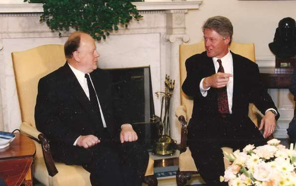

1. [~~Про мой род, себя и нашу элиту~~](./01.md)
2. [~~Бацькаўшчына~~](./02.md)
3. [~~Академия — завод — университет~~](./03.md)
4. [~~МРТИ — хорошо, БГУ — лучше~~](./04.md)
5. [~~Чернобыль~~](./05.md)
6. [~~В Москву, к властям~~](./06.md)
7. [~~Дорога к Вискулям~~](./07.md)
8. [~~Народы малочисленные и к ним приравненные~~](./08.md)
9. [~~Если б знал я, с кем еду, с кем водку пью…~~](./09.md)
10. [~~Беловежская пуща, Вискули, 7—8 декабря 1991 года~~](./10.md)
11. [**Беларусь — Соединённые Штаты**](./11.md)
12. [Интеллигенция и политика](./12.md)
13. [О университетах и ВУЗах, степенях и лекциях](./13.md)
14. [О «моём» зарубежье](./14.md)
15. [Патология](./15.md)
16. [Через годы, через расстояния](./16.md)

---

11\. Беларусь — Соединённые Штаты ^[Благодарю Александра Старикевича за подборку материалов из СМИ для этой главы. С.Ш.]

# Первый визит в США

>На военной базе Эндрюс в Вашингтоне, где 21 июля утром сделал посадку самолёт с официальной делегацией Республики Беларусь, в терминале на глобусе такое государство отсутствует. На его месте обозначено иное — Белорусская советская республика.\
БелаПАН специально для газеты “Свобода”, №8, июль, 1993.

Официальный визит в США очень хотел совершить премьер-министр Вячеслав Францевич Кебич. Для этого он мобилизовал все подчинённые ему службы и всех, зависящих от него сослуживцев. Министр иностранных дел Кравченко, а по его наставлению и другие высокие чиновники МИДа, доверительно говорили послу США в Беларуси Дэвиду Суорцу, что Шушкевич не хочет наносить визит в США, а если и нанесёт, то это будет пустой тратой времени, так как у него нулевой опыт налаживания международных отношений. Кравченко специально слетал в США и совместно с послом Беларуси в США Мартыновым постарался проникнуть во все щели Госдепартамента, убеж дая американскую сторону пригласить премьера, и был абсолютно убеждён, что достиг своей цели.

В это время посол Суорц попросил его принять по совсем иному вопросу. Завершая нашу беседу, он спросил.

— Почему вы категорически отказываетесь от визита в Соединённые Штаты?

— Впервые об этом слышу.

Честно говоря, я соврал. Незадолго до этого наш представитель при ООН Геннадий Буравкин нашёл способ поставить меня в известность об интригах Петра Кравченко, но я решил не вспоминать об этом в разговоре с Суорцем. Посол продолжил.

— Мой служебный долг сообщить вам, что именно так информирует наше посольство ваш министр иностранных дел и ваш посол в Вашингтоне Мартынов. Но я бы просил вас…

Здесь я позволил себе бестактность и перебил посла.

— Не беспокойтесь, я не буду никому об этом говорить и не стану никого в этом упрекать. Помогите, пожалуйста, моему советнику академику Анатолию Михайлову, который днями летит в Вашингтон, встретиться в Госдепартаменте с теми, кто занимается Беларусью.

Михайлов, в котором мне, к сожалению, пришлось разочароваться позднее, представлялся тогда мне человеком высшей гуманитарной образованности, свободно владеющим английским, немецким и французским языками. Семь лет он работал в ООН и прекрасно знал, что такое американская бюрократия. Мы неплохо сотрудничали с ним в Белорусском государственном университете, где он согласился возглавить кафедру «марксистской этики и эстетики» при условии, что в её названии останутся два последних слова. Мне такой подход понравился. Но через много лет я узнал, что это был ординарный пиар.

Михайлов слетал в Вашингтон в качестве моего официального представителя, без лишнего шума дезавуировал бредни Петра Кравченко там, где это нужно было сделать. Через десяток дней посол США информировал меня, что Госдепартамент США направил в наше Министерство иностранных дел ноту — приглашение на моё имя посетить Соединённые Штаты Америки с официальным визитом.

Но и при таком повороте дел Кравченко разыграл роль несправедливо обиженного, заявил, что не представляет себе, как может сопровождать меня, если подготовка визита шла без его — министра иностранных дел — ведома.

Пришлось объяснить министру, что в соответствии с Конституцией Республики Беларусь внешнюю политику определяет Верховный Совет, а Министерство иностранных дел обязано делать всё возможное, чтобы её осуществить. Если же он не знает, как меня сопровождать, то это означает только одно, что он не имеет соответствующей квалификации и осведомлённости в иностранных делах. При тех интригах, которые он плёл, я не считал себя обязанным пояснять ему что-то деликатно.

— Вам необходимо посоветовать ся с профессионалами — дипломатами, протоколистами и прочими, что делать и как делать, — сказал я ему, сознавая, что его гипертрофированное себялюбие сделает его ещё большим моим врагом. Кравченко заявил, что не может нести ответственность за визит при таком моём к нему отношении и поэтому не может ехать.

Он был убеждён, что держит в руках все рычаги, чтобы понизить ранг визита, потому что в таких условиях я буду вынужден пригласить в делегацию одного из его заместителей. Забыл бывший секретарь минского горкома КПСС по идеологической работе, что можно пригласить и его начальника.

Так функции министра иностранных дел во время визита легли на плечи вице-премьера Михаила Мясниковича. Я объяснил ему, что поскольку у нас с Кравченко есть определённые недопонимания, то пусть тот сидит дома, а мы поедем и всё необходимое сделаем. Мясникович, как мне показалось, был очень доволен таким поворотом событий. Не знаю, чему он больше радовался, тому, что не едет Кравченко или тому, что едет сам

Кстати, как мне рассказал позднее наш представитель в ООН Геннадий Буравкин, Кравченко во время своего нахождения в Нью-Йорке заставил сотрудника представительства Беларуси при ООН отправить от имени представительства факс о том, что я отказываюсь быть с визитом в Соединённых Штатах.

Небезынтересна и чуть иная, отличающаяся от моей версия произошедшего. Она содержится в интервью Геннадия Буравкина журналисту Александру Старике вичу (здесь и далее перевод с белорусского мой — С. Шушкевич):

>Я отлично помню, как готовился визит нашей делегации в Америку. Дело в том, что в то время белорусского посольства в США, фактически, не было, и подготовкой визита занимались мы.\
\
В чём был наш козырь? Беларусь отказалась от ядерного оружия без всяких предварительных условий. Об этом в декабре 1991 года в Вискулях и в Алмааты заявил Шушкевич. Это был просто гениальный дипломатический ход, хотя Шушкевич объяснял его как физик: ради обеспечения безопасности населения Беларуси.\
\
Именно благодаря этой позиции вызрела идея пригласить Шушкевича как руководителя белорусского государства с официальным визитом в Америку. Однако была одна загвоздка: по формальному статусу Шушкевич не являлся президентом, а президент имеет право официально пригласить только президента.\
\
С другой стороны, Шушкевич был первым лицом в государстве. Приглашать нужно, но как это сделать? В итоге с Госдепартаментом мы разработали механизм, согласно которому Шушкевичу направляют приглашение руководители определённых комиссий. Договорились уточнить детали. И вдруг приезжает Кравченко…\
\
Между прочим, Кравченко был просто уникальным министром иностранных дел. Если приезжали министры иностранных дел иных государств, они были в США не более недели: день-два до выступрления, потом — выступление и через день-два едут домой.\
\
Кравченко же у нас жил по три месяца! Все удивлялись: в чём дело? Говорили, что в Беларуси “над ним что-то висело”, и он просто прятался. Хотя, нужно сказать, при моём критическом отношении к Кравченко, его энергия временами была на пользу Беларуси. Однако не всегда.\
\
Тем не менее, по сей день считаю, что это была найгрубейшая ошибка Стаса (значит меня — С.Ш.), что вместо Кравченко он взял тогда в Штаты Мясниковича. Нельзя пренебрегать такими вещами, как международная практика. Ну, если тебя не удовлетворяет министр, ты должен снимать его с должности, а если не снимаешь — так работай.\
\
Но что делает Кравченко, приехав в США: он подговаривает моего заместителя Сергея Мартынова (сегодняшний министр иностранных дел) и тот звонит в Госдепартамент и сообщает, что нужно приглашать не Шушкевича, а Кебича. Всё это делается за моей спиной. Это грубейшее нарушение! Я имел тогда полное право в 24 часа отправить Мартынова в Минск.\
\
Вечером того же дня моя секретарь сообщает, что со мной хотят поговорить представители госдепа. Я беру трубку и слышу по голосу, что люди просто в растерянности: такого в международной практике ещё не было. Говорят: нам позвонили и сказали, что нужно переписать приглашение Шушкевича на Кебича. Это же всё меняет! Кебич же — Председатель Совета Министров, это же иной уровень! Нужно целиком менять программу.\
\
Я пытаюсь выяснить, что и как. Я тоже оказался в неудобном положении. Не говорить же мне им, что наш министр — идиот? Я начинаю хитрить: мол нужно уточнить, подождите, ничего пока не делайте.\
\
Кладу трубку и начинаю «наводить шмон»: кто мог такое сделать? Выясняется — Мартынов, мой заместитель. Вызываю его: «Что, загрустили по дому, скучно быть моим заместителем? Как вы могли, вы же профессионал». Тот искренне признался, что всё было сделано по прямому приказанию Кравченко.\
\
Всю эту информацию я после передал Стасу.\
\
Когда следующий раз нам позвонили из госдепа, я сообщил, что мы отзываем эти неподписанные мною документы. Так Стас приехал в США.

Возможно, многим сегодня непонятно, почему при наличии подтверждённых фактов о злоупотреблениях Кравченко я не проявил инициативы, чтобы поставить вопрос о его отстранении от должности перед Верховным Советом? К сожалению, даже при страстном моём желании отправить его в отставку я не мог. Более того, я уверен, что Кравченко, по договорённости с Кебичем, провоцировал меня своим поведением на постановку мною перед парламентом вопроса о его отставке. Подавляющая часть депутатов Верховного Совета могла бы поверить версии, что это месть за неподдержку министром моих личных инициатив по моим зарубежным поездкам.

Я шёл иным путём, так как давно знал Кравченко и его сообщников. Знал его ко мне отношение. Знал о его кульбитах в отношении к белорусской культуре и белорусскому языку. В 1986—87 годах на созываемых горкомом совещаниях, на которые оказывался приглашённым и я как проректор университета, он предупреждал, что «националисты штурмуют наши советские устои». Когда же почуял, что ветер может изменить направление, стал горячим сторонником белорускости и даже язык белорусский не то восстановил в памяти, не то выучил. Человек ведь талантливый, не отымешь.

Американская интрига была не единственной непристойной выходкой Кравченко на должности министра. Позднее я понял, какими бы ни были его действия, направленные против меня, его всегда поддержит премьер-министр Кебич.

Когда 22 октября 1993 года к нам ехал госсекретарь Уоррен Кристофер, снова возникли споры, как его принимать. Было решено, что он приезжает ко мне, как к первому лицу, а потом встречается с Кебичем. Кравченко обиделся. «Как это, он — Госсекретарь и я, фактически, госсекретарь, а он не встречается со мной!» И не поехал в аэропорт встретить Кристофера.

Согласно протоколу это выражние неуважения.

Мне звонят по спецсвязи, спрашивают: что делать ? Для протоколистов это небывалое событие, они не знают, как поступать, а мне посоветоваться не с кем. Приказываю: «Езжайте ко мне!».

Как говаривал когда-то мой дед, заковыристые вопросы нужно решать просто, по-крестьянски, руководствуясь здравым смыслом. Раз мы на более низком, чем подобает по рангу уровне, встретили одно из высших лиц великой державы, в знак компенсации повышу-ка я уровень его приёма мною — высшим должностным лицом Республики Беларусь.

Вместо того, чтобы ждать, как это подобает по протоколу, Госсекретаря в своём кабинете, я выхожу из здания Верховного Совета и встречаю Кристофера при выходе из автомобиля.

— Извините, — говорю, произошло досадное недоразумение, наш министр иностранных дел не смог встретить вас по техническим причинам. Ещё раз приношу вам наши извинения и приглашаю ко мне.

Разговор у нас получился хороший, но установлению доброжелательных, почти дружеских отношений помогло ещё одно обстоятельство. Именно в этот день 22 октября у Госсекретаря Кристофера был день рождения, и я об этом знал. Закончив деловую часть, я сказал.

— Господин Госсекретарь Соединённых Штатов Америки Уоррен Майнор Кристофер, я чуть-чуть знаком с американскими традициями. У вас принято отмечать именины. Но вы находитесь на белорусской земле. У нас принято отмечать дни рождения. Поздравляю вас с вашим днём рождения, желаю здоровья, благополучия, успехов. Позвольте, как у нас принято, вручить вам эти розы и пригласить вас и всех сопровождающих вас господ на небольшое угощение в мою комнату отдыха.

Кристофер явно обрадовался, поблагодарил, сказал, что ему нравятся белорусские традиции, удивился нашей осведомлённости, прошёл в комнату отдыха. За ним — все его сопровождавшие.. Он не прикоснулся ни к одному напитку, ни к одному блюду, но его команда не оставила никакого сомнения в том, что ей по вкусу и белорусская кухня и белорусские напитки.

Но вернёмся к моему визиту в США.

Делегация наша была более, чем представительной: президент Академии наук академик Леонид Сущеня, Народный поэт Беларуси профессор Нил Гилевич, представители правительства во главе с Михаилом Мясниковичем, Председатель Националь ного банка Станислав Богданкевич, представитель предпринимателей Леонид Козик. Тогда он числился в первых рядах тех, кто «активно» преобразует возглавляемые ими предприятия в рыночные. Я формировал тогда делегацию так, чтобы её члены были способны активно вести переговоры, а не кивать головой в знак согласия с руководителем делегации.

>Соединённые Штаты официальными визитами не удивишь — большая могучая держава видела их на своём веку достаточно. Видит и сейчас: гостевая резиденция президента работает — Блэйр Хауз — «работает» почти непрерывно».\
\
Три дня у неё на прошлой неделе, как известно, были белорусскими. Американская столица принимала первую официальную делегацию независимой Беларуси во главе с Председателем Верховного Совета Станиславом Шушкевичем».\
\
“Народная газета”, июль 1993

Приём осуществлялся по самой высокой категории. Для меня это было полной неожиданностью: парад в мундирах гражданской войны, 21 выстрел из старинной пушки, К нам относились как к равным, хотя сравнить страну с 300-миллионным населением и самой мощной экономикой в мире с нашей маленькой страной просто язык не поворачивается. Тем не менее корректность была проявлена чрезвычайная.

Из воспоминаний Юлии Буравкиной:

>Не могу передать, с какой радостью мы ждали приезда нашей делегации. Для нас здесь в США это было чрезвычайное событие. Это же наши! И не просто наши, а руководители независимого государства!\
\
Ещё тогда, когда Беларусь стала суверенным государством, подписав Декларацию о независимости, мы не находили себе места от счастья. Кем мы были до этого там, в Америке? Фактически, никем. А теперь — представители независимого государства! Мы хотели чем быстрее вывесить наш флаг, чтобы все видели, что мы — независимая страна, но даже не знали, как он должен выглядеть. Ясно бело-красно-белый, но в каких пропорциях, какой оттенок красного?\
\
Что вы думаете, пришлось обращаться за помощью к нашей диаспоре. Наконец, мы заказали этот флаг. После его собственноручно гладили. Для нас всё это было чрезвычайно важно, поэтому и ждали приезда нашей делегации с особыми чувствами.\
\
Самолёт должен был прилететь в одиннадцать вечера. Мы заблаговременно приехали в аэропорт. Сидим, ждём. Одиннадцать — нет, два часа ночи — нет. Три… Наконец в четыре сообщают, что самолёт приземлился.\
\
Мы — невыспавшиеся, голодные — стремимся как-то выглядеть. Это же государственный уровень! Развернули плечи, поправили бобочки. Выходим встречать на лётное поле. Выстроились все за Геннадием (Буравкиным — С.Ш.), как должно быть по протоколу. В груди бьётся: «Наши! Наши прилетели!»\
\
И вот открывается дверь самолёта. И что вы думаете? Иного слова я не могу подобрать — вываливаются наши. Они не брились двое суток, лица опухшие. А штаны какие! Неглаженные, обвисшие.\
\
Позднее американцы удивлялись: «А что это у ваших ребят штаны на туфли нависают, что их три раза закатать можно? Ничего не скажу Стас с женой были в абсолютно приличном виде. Но как посыпались депутаты — одним словом, ужас!\
\
Американцам, а там был и Тэлбот и ещё несколько официальных лиц, от этого зрелища сделалось, повидимому, не по себе. Тэлбот даже переспросил у Геннадия: «Это что, всё политические деятели?» А они себе высыпаются и лезут целоваться. Помню, меня Герасименко так поцеловал, что я не знала, что потом будет с моими щёками. Ну и мы, конечно, бросились к ним. Это же свои!

# Пенсильвания авеню: Блэйр-Хауз — Капитолий

Большая часть делегации была размещена в Блэйр-Хаузе — гостевом доме президента напротив Белого дома на Пенсильвания авеню. Всё здание было отдано в наше распоряжение. К нам в Блэйр-Хауз приезжали руководители всех министерств. Сами мы «ездили», точнее — перешли на другую сторону улицы — к президенту и в Федеральную резервную службу. В нашей терминологии это Национальный банк США, независимый от правительства и и это всегда подчёркивается.

На приём в нашем посольством в Вашингтоне, прибыли высокие гости, среди них — советник Президента США по вопросам стран СНГ Строуб Тэлбот. Месяцом раньше он подарил мне во время встречи в Москве книгу, написанную им совместно с Майклом Бесчлоссом «At the highest levels» (На высших уровнях) с собственноручной подписью «Президенту Шушкевичу с большим уважением и надеждой на самое успешное будущее, от автора» и, по-видимому, был убеждён, что я не буду её читать, так как там на странице 450 написано, что мне, как второразрядному участнику тройки подписантов Беловеж ского соглашения Ельцин и Кравчук преднамеренно поручили звонить из пущи Горбачёву и сообщить о сущности произошедшего. Я и впрямь целиком книжку не прочёл, так как не на таком уровне владею английским, чтобы это сделать, но, найдя в её глоссарии своё имя, хотя и заглядывая в словарь тщательно изучил всё, относящееся в ней ко мне лично.

Когда мы с Тэлботом поприветствовали друг друга, как старые знакомые, я поблагодарил его за то, что он нашёл время заглянуть к нам в посольство на торжество. После чего спрашиваю.

— Вы и впрямь, как написали в вашей книге, считаете меня второразрядным политиком по сравнению с остальными участниками встречи в Вискулях?

— Я никогда так не считал и не считаю, но, проработав много лет корреспондентом газеты «Таймс» в Советском Союзе, привык к советским штампам типа перворазрядные политики — это секретари ЦК КПСС и компартий союзных республик, все остальные — второразрядные.

— Тогда спасибо, что вы не зачислили меня в кагорту секретарей ЦК, кое-где и такое случалось.

Приятнейшей неожиданностью был приезд на приём Эла Гора. Обычно вице-президент такие приёмы не посешает, хотя, само собой разумеется, приглашение ему направляется. Когда Гор подъехал и кто-то громко об этом сказал, посол России в США Владимир Петрович Лукин — дипломат высшей осведомлённости и опыта — еще громче воскликнул.

— Гор? Ошибаетесь, такого не бывает!

К счастью, ошибся Лукин, а у меня нашёлся для Гора подарок — слуцкий пояс ручной работы, естественно, современного изготовления, но со строгим соблюдением наших традиций. Подарок Гору понравился и он не снимал его до конца своего присутствия на приёме.

Кстати про Президента и вице-президента США говорили тогда так: Клинтон выступает чтобы всем понравиться; Гор — чтобы последовательно и точно довести суть дела до всех, кто его слушает. И это было правдой.

Я хорошо помню разговор с Гором в нашем посольстве. Соединённые Штаты видят, — сказал он — ваша страна — Беларусь идёт по пути демократизации, уважения прав человека, верховенства закона.

Такие слова сегодня часто повторяются, но тогда услышать такое от вице-президента США было чрезвычайно важно. Гор заметил далее, что Соединённые Штаты приветствуют такой подход и будут стремиться помогать в этом деле. Но всё в Беларуси обязаны сделать мы сами, ещё раз подчеркнул он.

Когда разговор коснулся Беловежской пущи, Гор спросил.

— А вы не боялись, что вас могут орестовать?.

По поводу чего стоявший рядом Председатель Комитета Государственной Безопасности Республики Беларусь Эдуард Иванович Ширковский обоснованно заметил.

— Мы бы этого не допустили. Контроль был в наших руках.

Хотя через некоторое время, переехав в Москву, Ширковский говорил совсем иное и даже в одном из интервью сожалел, что не арестовал нас в Беловежской пуще. Но там, в США, председатель КГБ вёл себя так, как подобает вести человеку, занимающемуся безопасностью суверенной Беларуси. Он ведь действительно был первым белорусом на посту председателя КГБ сначала БССР, а потом и Республики Беларусь.

>Итоги визита — действительно беспрецедентные для молодого белорусского государства. 59 миллионов долларов в качестве невозвратной американской помощи в рамках закона Лугара-Нана намного превышают рублёвый кредит, выпрошенный недавно Кебичем у Москвы. Разговор о серьёзных гарантиях безопасности со стороны США, который вёлся на самом высоком уровне, снова же сильно ударяет по позиции присоединения нашей республики к Договору о коллективной безопасности. Американская сторона приняла к изучению ряд программ, разработанных в Министерстве обороны Беларуси, для выделения в следующем финансовом году 500 миллионов долларов США.\
\
Руководство Соединённых Штатов заверило, что учтёт заинтересованность Беларуси в получении своей справедливой части от продажи Россией Соединённым Штатам Америки высокообогащённого урана. Общая выручка от его продажи составит около 10 миллиардов долларов. Сколько из них будет передано Беларуси, пока не конкретизируется. Наконец, достигнута договорённость о американских поставках в Беларусь в 1993—94 гг. Около 150 тысяч соевых бобов (третья часть — бесплатно, остальные — по низким ценам). Судьба их, нет никаких сомнений, не будет похожа на судьбу широко разрекламированного прошлым летом казахстанского зерна, оплоченного белорусскими тракторами и рабочей силой, но до сих пор так и не поставленного в пролном объёме.\
\
БелаПАН, специально для Свабоды, №8, июль 1993

Переговоры были о том, чтобы иметь определённую экономическую поддержку. Тогда полученные в резуль тате переговоров 59 миллионов были большими деньгами. Мне же очень понравился разговор о ядерном разоружении. Я и тогда и сегодня придерживаюсь той точки зрения, что вывод ядерного оружия из Беларуси — важнейшее дело прежде всего для населения самой Беларуси. Если не хочешь погубить свій народ, не держи ядерного оружия на своей территории, особенно на территории такой небольшой страны, как Беларусь.

С сенаторами Лугаром и Наном я встречался и ранее. Они были в Беларуси вместе с боль шой группой своих советников. Я им сказал.

— Уважаемые сенаторы, авторы всемирно известного закона Лугара-Нана. Конгресс принял предложенный вами законопроект о помощи тем, кто содействует ядерному разоружению. Но ни я, ни мои коллеги не видим, как в соответствии с вашим законом можно помочь Беларуси хотя бы одним миллионом долларов, хотя именно Беларусь взяла на себя обязательство полностью вывести со своей территории как стратегическое, так и тактическое ядерное вооружение без всяких предусловий и компенсации.

При всей его внешней медлительности сенатор Лугар демонстративно посмотрел на часы и прореагировал мгновенно.

— Господин президент. Перед вами команды наших с сенатором Наном советников — разработчиков этого закона. Мы с сенатором Наном даём им 24 часа, чтобы они определили, как помочь Беларуси по придуманному ими закону.

Советники справились с полученным заданием. Первоначальная помощь составила 4,5 миллиона долларов, тесно с ним связанная последующая — 59 миллионов.

На Верховном Совете я не единожды говорил: никакой компенсации мы не должны требовать, потому что большей опасности для людей Беларуси, чем ядерное оружие на её территории, быть не может. Верховный Совет меня поддержал. Тактическое оружие было выведено довольно быстро. Стратегическое планировалось вывести до начала 1996 года.

Михаил Николаевич Чигирь — первый премьер-министр после избрания Лукашенко президентом в 1994 году — поведал мне, что Лукашенко, заняв высшую должность в государстве, начал рьяно сопротивляться выводу стратегического ядерного оружия. Тогда в Минск приехал премьер-министр России Виктор Степанович Черномырдин и решительно потребовал от Лукашенко выполнять договорённости.

— Ты чего хочешь, великих потрясений? Всё подписано, всё ратифицировано парламентами, поэтому ничего не может быть изменено.

И всё было вывезено.

Во время визита в США были переговоры с федеральной резервной службой, встречи с бизнесменами. Командующий штабами Пауэл (впоследствии — Госсекретарь США) подписал с министром обороны Павлом Козловским предваритель но парафированное соглашение о достойном взаимодействии между США и Беларусью. Мы шутили: Пауэл с Павлом пришли к взаимопониманию.

Я всё время стремился, чтобы переговоры не сводились только к приятным разговорам и чтобы члены делегации были не их свидетелями, а их участниками. Обычно разговор начинался со мной, а я переводил его на вопросы к иным. Науку — на Л. Сущеню, Национальный банк — на С. Богданкевича, культуру — на Н. Гилевича, экономику — на М. Мясниковича, бизнес — на Л. Козика, муниципальные вопросы — на А.Герасименко. Команда работала неплохо.

Интересный случай произошёл в Капитолии во время официального завтрака с сенаторами и конгрессменами. По существующей в США традиции меня попросили сделать пятиминутное выступление, и минут 12—15 я отвечал на вопросы. Когда же начались разговоры в кулуарах, ко мне подошёл очень представительный конгрессмен.

— Знаете ли, вы прекрасно выступили и ответили на вопросы. Я давно интересуюсь вашей страной и слежу за событиями в Беларуси. Мне ваша страна очень нравится. А когда вы покончили с вашим Чаушеску, я полюбил её ещё больше.

Мой переводчик смутился и попробовал исправить ситуацию «скользким» переводом, но я напомнил ему о его обязанностях и он исправился, перевёл, так как конгрессменом было сказано.

Что оставалось делать мне?

Поблагодарил конгрессмена за доброе отношение к Беларуси, пожелал здоровья и долголетия.
Впоследствии я не раз сталкивался с тем, что помощники, советники, секретари сенаторов и конгрессменов — те, кого мы называм чиновниками, очень просвещённые люди, каждый в своей отрасли: юристы, финансисты, экономисты, международники… А что касается самих сенаторов и конгрессменов, то курьёзы с ними — не редкость.

# Relax

На третий день нашего пребывания в Блэйр-Хаузе к нам заглянула наша хозяйка — красивая, безупречно одетая, очень вежливая женщина.

— Извините, что я к вам обращаюсь, но президент Клинтон приказал нам исполнять все ваши пожелания, а вы до сих пор ничего не пожелали.

Рядом со мной, в отведённых нам с Ириной аппартаментах, находились в это время два академика — президент Академии наук Леонид Петрович Сущеня и Анатолий Арсеньевич Михайлов. Мы закончили все переговоры и хотели начинать готовиться к отлёту. Я решил сделать процесс подготовки более приятным.

— Знаете, мы давно хотим что-то выпить, что-то серьёзное. Если это в рамках ваших возможностей, будем очень рады.

— Все понятно, — говорит хозяйка и исчезает.

Через пять-семь минут входит снова же очень красивая молоденькая девушка в сияющих белизной переднике и чепчике с подносом, на котором 24 больших фужера с виски. Однако… в каждом — не более глотка, ну и «закуска» в виде орешков, чипсов и прочей мелочи в изящных серебряных посудинах.

Когда мы слили содержимое 24 фужеров вместе, получились три неполных. Выпили. Молчание прервал Леонид Петрович.

— Скажу прямо, американский бурбон выше всякой похвалы. Только американцы умеют делать из кукурузы действительно превосходный виски. Но, ребята, грустно на такой ноте завершать визит. Я ехал в эту поездку, как в командировку, и, конечно же, кое-что у меня с собой есть, из Минска.

Ушёл, мгновенно вернулся с бутылкой шотландского виски «из Минска». Так всё стало на свои места.

---

У моей жены, как у первой леди, была особая, женская программа визита. В первый день ей предстояло встретиться с Хиллари Клинтон. Но случилось несчастье, и Хиллари вместе с президентом Клинтоном уехали на похороны близкого им человека. Её советница — сотрудница избирательного штаба Била Клинтона — сообщила об этом моей Ирине.

Из воспоминаний моей жены.

>«Мне предложили отдельную женскую программу. Согласовали со мной, что именно я хотела бы увидеть. Естественно, мне хотелось увидеть как можно больше. «А вы не устанете?» — беспокоились они. «Да что там уставать — всего два-три дня. Главное — больше покажите!».\
\
И вот я практически с раннего утра до позднего вечера ездила и ходила по Вашингтону. Было очень интересно. Посетили Белый дом, ряд музеев, художественную галерею и даже дельфинарий.\
\
На второй день нашего визита среди вариантов проведения досуга мне предложили сделать прическу у парикмахера-стилиста, который обслуживает и Хилари Клинтон. Отказаться от такого заманчивого соблазна было сложно. Стилист оказался очень интересным человеком. Кроме того, что он сделал великолепную стрижку, мы отлично поговорили. Он показал альбом с фотографиями моделей свитеров для мужчин, которые вяжет сам. Чувствовалось, что у человека прекрасное художественное воображение.\
\
Что же касается прически, то он сделал все в таком же стиле, как у меня и было. Но сделал очень качественно. Корректность была проявлена исключительная. У них же принято продумывать имидж первых лиц государства. Очевидно, он тоже посчитал, что мой стиль продуманный и не решился что-нибудь изменить. Подарок был действительно приятный.\
\
Все остальное время мы подробно изучали Вашингтон.

Впоследствии, когда я говорил о предполагаемом визите к нам кого-то из руководителей зарубежных стран, моя жена обязательно спрашивала, тщательно ли мы продумали культурную программу для жены высокого гостя.

Долго-долго после этого жена обвиняла меня в недостаточном понимании значимости Вашингтона и его окрестностей как культурного и исторического центра США. Позднее во время работы в центре Вудро Вильсона и во многочисленных поездках в американские университеты мне удалось своё отставание от неё уменьшить. Но меня тянуло больше в музеи типа космического и американского «краеведческого», который казался мне увеличенным вариантом Политехнического музея в Москве, с чисто американскими экспонатами моторов, электровозов, автоматических линий, галереей изобретений Томаса Алва Эдисона.

# Встреча с Клинтоном

>В четверг в Белом доме произошла встреча президента США Билла Клинтона с Председателем Верховного Совета Беларуси Станиславом Шушкевичем, который находится здесь с официальным визитом. Я хотел бы публично поблагодарить руководителя Беларуси за поддержку его страной нераспространения оружия, Договора СНВ-1, заявил президент США перед началом разговора. «У нас будет хорошее партнёрство. Я ожидаю, что оно будет развиваться», — сказал президент.\
\
ИТАР-ТАСС, Народная газета

Все документы для подписания с президентом Клинтоном были заблаговременно старательно подготовлены, согласованы со всеми государственными американскими и белорусскими службами. Ставя на них свои подписи, мы только подтверждали, что все они приобретают юридическую силу.

После их подписания и обмена папками все направились для разговора в Овальный зал. Согласно протоколу знак уважения может быть высказан подарком, соответствующим вкусами обычаям президента. Когда мы собирались в Соединённые Штаты, долго думали, что привезти. Известный белорусский художник Михаил Андреевич Савицкий обещал написать картину. Точной договорённости о том, что это будет за картина, не было. Намётки были: ожидали, что это будет портрет Хилари Клинтон. Естественно, картина художника такого уровня была бы хорошим подарком, но творческие люди не всегда соблюдают договорённости, потому что в отведённое по уговору время их просто может не посетить Муза. Так было и в этом случае. В последний момент Савицкий сказал, что картину не создаст.

Пришлось ломать голову. Задумались, чем славится Беларусь? Вот в Швейцарии три позиции: сыр, шоколад и часы. А у нас в Беларуси? Мне говорят: картошка и стекло.

— Так что, драники и фужеры повезём? А вдруг президент не пьющий?

— И тогда мастера в Борисове сделали стеклянный кабинетный набор для письменного стола. Должен сказать, получился он очень красивым. Сочетание красного с прозрачным делало его символом нашего государственного бело-красно-белого флага. И до того и после того я ничего подобного нигде не видел. Подарки были выставлены на столе у входа в Овальный зал. Я на них насмотрелся раньше, поэтому внимательно смотрел на президента Клинтона. Он неторопливо всё осмотрел. Замер, лицо преобразилось, как будто стоит перед восьмым чудом света.

— Это великолепно, — говорит — какие у вас замечательные мастера. Набор делает захватывающее впечатление и будет прекрасно сочетаться с условиями нашей работы.

Затем был содержательный совместный разговор в Овальном зале о ситуации в Беларуси, о том, к чему Беларусь стремится и какие у нас сложности. Нам обещали помощь по проблемам, по которым мы испытываем трудности. Всё записывалось и позднее все обещания американской стороны были выполнены полностью.

Какое впечатление производил Клинтон? Всё укладывается в определение, которое я приводил выше. Он вёл себя так, что нравился всем без исключения: красивый человек, который очень спокойно, вдумчиво немногословно говорит о любых проблемах и любых вещах. Даже в обмене папками он неподражаем. Это я вышел из среды, где, ну получил ты диплом профессора или Государственную премию, поблагодарил вручившего, положил в карман, и всё! А там — нет. Нужно публично рассмотреть, обратить внимание на особенности, остановиться на отдельных деталях, разъяснить, показать.

История, которая позднее «выползла» с Моникой Левински, была для меня неприятной и абсолютно непонятной. Эта сторона американской действительности мне не нравится. Чтобы высшего ранга прокурор затратил на такого толка «расследование» 30 миллионов долларов — сумасшествие. На делах государственных это вряд ли скажется.

>Возвращаясь в Минск, Станислав Шушкевич и иные высокопоставленные лица из белорусской делегации не прятали своей удовлетворённости результатами визита и оказанным им в Вашингтоне приёмом. Американцы и впрямь проявили неожиданные для нас доброжелательность и уважение. Встреча Председателя Верховного Совета Беларуси с Президентом США не просто состоялась, не глядя на то, что как раз в этот час покончил собой друг детства и сотрудник администрации Билла Клинтона, но и продолжилась дольше запланированного программой визита времени. А это, говорят, исключение из строгих правил Белого дома.\
\
Встреча в Пентагоне по словам одного из белорусских визитёров “имела ошеломляющий характер”. И наконец, что стало уже вообще неожиданным для белорусской делегации: на приём, организованный посольством Беларуси в Вашингтоне прибыли советник Президента США по вопросам стран СНГ Тэлбот и вице-президент Соединённых Штатов Гор.\
\
Если же откровенно, по большому счёту удивительным здесь является только то, что высокопоставленные белорусы считали такое отношение к себе удивительным. Повидимому, нам ещё привыкать и привыкать к цивилизованному обхождению…”\
\
БелаПАН специально для Свободы, №8, июль, 1993

Мы, действительно, ожидали меньшего. Я вообще всегда готовлюсь к худшему. Думал, как себя вести, если будут говорить, что вы такие бедные, вы такие слабые — а мы в действительности такими и были — и как здесь сдержаться, как не вспылить? Но такое не случилось.

Что не получилось? Повидимому, можно было сделать визит ещё более содержательным. Прав Генадь Буравкин, логично было бы, чтобы присутствовал министр иностранных дел — так принято, чтобы МИД детально подготовил проекты предложений, чтобы вместе с иными государственными институтами были сделаны определённые расчёты. Но министр Кравченко не видел в таком подходе собственной выгоды, а не нагружать же себя работой только для страны. В разговорах с членами Белорусского Народного Фронта и белорусской интеллигенцией, особенно с представителями белорусской диаспоры за рубежом, он мог напомнить и из Ларисы Гениюш: «як жыць, дык жыць для Беларусі…»; хотя истинное его жизненное кредо иное: ничего не упускать и брать от жизни для себя всё, что сможешь, иначе иные возьмут и возрадуются”.

Главный итог поездки — о Беларуси узнал мир. О нас до этого очень мало знали. Куда не ткнёшься, где эта Беларусь? Не Болгария? А то и на азиатские просторы перебросят: не Бангладеш?

Начало на высшем уровне было положено, нужно было идти дальше, работать на всех направлениях и на всех уровнях, исполь зовать установившиеся тогда отношения взаимодоверия действительного сотрудничества с Соединёнными Штатами. Все наши представители — министерства иностранных дел, финансисты, экономисты, бизнесмены — тот же Козик и Мясникович — были на уровне задач, которые нужно было решать Беларуси. Казалось, они понимают, куда надо идти. Казалось! Но далеко не всё свершилось.

А сегодня?

Позор, когда президент относится к великой стране как невежественный председатель к бригадиру запущенного колхоза. Если вы считаете политику неправильной, то всегда имеются подходы это выразить, не выходя за рамки общепризнанной этики международных отношений. К сожалению, сегодняшняя власть способна нагло господствовать, нагоняя страх, ссылаясь на наличие множества врагов — внешних и внутренних. Она не управляет, руководствуясь хотя бы той противоречивой конституцией, которую сама восхваляет и теми драконовскими античеловеческими декретами и законами, которые проштамповывают её институты.

А тогда мы с достоинством показали, что Беларусь — европейское государство. И нас приняли как европейскую страну, которая становится на ноги, но находится в нелёгком экономическом состоянии. Короче: мы вышли в мир, и хотя это был дебют, он состоялся, дал результаты. Оказался результативным, потому что во всей делегации не было лицемерия.

А что касается внешнего вида отдель ных членов нашей делегации, о чём, к сожалению, искренне и правдиво высказалась в приведенном выше интервью Юля Буравкина, то я также искренне возражу.

Дорогая Юля!

В то время Вы слегка оторвались от белорусских реалий. Оно и понятно: довольно долго жили за рубежом и достойно представляли Беларусь. Красоты Вам не занимать, и, как подобает жене дипломата, не раз были с Геннадием Николаевичем на дипломатических приёмах и иных мероприятиях — в среде, где приняты строгие нормы дипломатического этикета. Вы, простите, к ним привыкли.

А мы? Мы в лучшем случае соответствовали уровню среднестатистического белорусского чиновника. Большинство прилетевших вообще никогда не было за границей. Не могла не отразиться на нас бессонная ночь, длившаяся из-за смены часового пояса на семь часов больше обыкновенной и далеко не идеальные условия полёта, ночная посадка в аэропорту Рейкъявика. Более того, что для Вашингтона в то время было нормой, для нас по инерции считалось недопустимым и непристойным.

И простите за совсем личное. Когда я сегодня смотрю на снимок 1992 года моей жены с женой президента Германии Рихарда фон Вайцзеккера, то хорошо понимаю, что костюмчик моей Ирины за 100% моеготогдашнегомесячногозаработкаиплатье госпожиВайцзекерза единицы процентов месячного заработка её мужа категорически отличаются в пользу первой леди Германии.

А вот по компетентности делегатов, прилетавших в США, упрёков не было и нет.

# Президент Клинтон в Беларуси

Если откровенно — официальный визит Президента Соединённых Штатов Америки Билла Клинтона в Беларусь в январе 1994 года — результат моего сговора с Чрезвычайным и Полномочным Послом США в Республике Беларусь Дэвидом Суорцем.

Я пригласил Клинтона посетить Беларусь с официальным визитом во время моего официального визита в Вашингтон. Он обещал приехать, и готов был сдержать слово. Труднее было мне остаться полномочным приглашающим до момента визита. Понимая, что прилёт может состояться только тогда, когда посол Суорц официально информирует Вашингтон о наличии должных условий для приёма президента и сопровождающих его лиц, я постарался убедить посла в том, что такие условия у нас ёсть для любого варианта визита: многодневного, многочасового, предельно короткого.

В соответствии с порядком обеспечения руководителей Верховного Совета и правительства мне была выделена большая резиденция в Дроздах — бывший дом Первого секретаря ЦК КПБ Машерова. Но я туда не переехал. Считал неприемлемым занимать 560 квадратных метров семьёй из трёх человек. Когда я был избран на высшую государственную должность Председателя Верховного Совета 9 сентября 1991 года, мы жили в двухкомнатке на улице Одоевского. Свою сегодняшнюю квартиру я получил в декабре 1992 года. А здесь предлагалось прыгнуть с 37 квадратных метров полезной площади — на 560!

Когда мы с женой пришли первый раз в отведённую мне резиденцию, сын, ему было семь лет, начал носиться по этажам и комнатам, мы его едва отыскали. Жена заупрямилась.

— Я сюда не перееду, что ты со мной не делай. Будем лучше ездить на нашу дачу, там все соседи — наши знакомые, университетчики, без комплексов.

Так мы и сделали. Я даже обрадовался предложению Ирины, так как была и принципиальная причина моего нежелания занять резиденцию в Дроздах, о которой я и жене не сказал. Резиденцию нужно обслуживать: убирать, подметать, чистить. Жена бы с этим не справилась. Нанять кого-то при зарплате Председателя не очень просто. Все высокопоставленные обитатели Дроздов шли на уловку и рекомендовали мне сделать то же самое: зачисляли на какую-то терпимо оплачиваемую должность человека (а то и двоих) в правительственной или же в иной государственной структуре. Там эта особа получала зарплату, а реально была прислугой у какого-то начальника. Согласись с таким подходом, и попробуй после этого остаться принципиальным, если сам такой!

Но мне показалось, что я нашёл выход, придумал, как с пользой для дела использовать бывшую машеровскую резиденцию, где, к слову, есть и бассейн и сауна. Время от времени мы стали проводить там заседания Президиума Верховного Совета, который состоял из 23 депутатов. Хватало там места и для самого заседания, для разговоров (и сговоров) по интересам и склонностям, для снятия стресса в сауне и бассейне.

Я подумал, что дом этот прекрасно бы подошёл в качестве гостевого при визите американского президента с семьёй, охраной и сопровождающими лицами. Такой, знаете ли, белорусский “блэйр-хаузик”. Пригласил Дэвида Суорца, походили по комнатам, попарились в бане, поплавали в бассейне. Поделился с ним своими планами, обсудили детали возможного визита. Реакция посла была положительной.

— При наличии такой резиденции может быть реализован любой вариант визита нашего президента. Я сообщу об этом в Госдепартамент.

---

А надо мной сгущались грозовые тучи.

Летом 1993 года наши «молодые волки» — депутаты Дмитрий Булахов, Виктор Гончар, Анатолий Лебедько, Геннадий Карпенко, разыгрывающий роль их единомышленника Леонид Синицын — повсеместно утверждали, что я провожу весьма нерешительную политику. Каждый из них был уверен, что имеет больше оснований занимать должность Председателя, чем я. Старая умудрённая опытом номенклатурная братия решила поставить на моё место Дмитрия Арцименю и поддерживала «молодых волков», чтобы они помогли лишь место расчистить.

Если говорить прямо, то прямо на трибуне Верховного Совета в это тяжёлое время меня неожиданно предал член Президиума, председатель комиссии по национальной безопасности Мечислав Гриб. Он перестал быть сторонником записанного в Конституции стремления Беларуси к нейтральности и присоединился к тем, кто ратовал за вступление нашей страны в Договор о коллективной безопасности СНГ.

Мне же противостоять таким “объединённым силам” было непросто.

Следует признать также, что Дмитрий Константинович Арцименя был силь ным хозяйственником, разумным опытнейшим руководителем. Он подтвердил качества руководителя боль шого масштаба, возглавляя Гродненщину. Из закалённых номенклатурщиков он, бесспорно, был наиболее подходящей кандидатурой на моё место. Но его застрелил в Гродно убийца, нанятый теми, кому Арцименя мешал развернуть свой преступный бизнес. Весьма вероятно, что Дмитрий Константинович сам имел отношение к не вполне законному бизнесу и поддерживал предпринимательский клан, конкурирующий с кланом, пославшим к нему киллера. Найденная при вскрытии служебного сейфа Арцимени долларовая наличность была настолько внушительной, что повергла, к примеру, меня в состояние шока. Она никак не могла быть заработана им на государственной службе.

Убийство произошло 20 сентября 1993 года в 21-30. О трагедии сообщил мне председатель КГБ Эдуард Ширковский по новому средству связи, появившемуся в этот день в моём служебном автомобиле — мобильному телефону. После этого меня долго пугал вызов мобильника.

Убийца был идентифицирован белорусскими следователями, но успел сбежать в Россию, совершить там новое преступление и сесть в российскую тюрьму. Все наши усилия экстрадировать и судить его в Беларуси, включая мои звонки Ельцину и российскому генеральному прокурору, результата не дали.

Трагедия породила задержку с моим смещением. Старая партийная номенклатура, располагая совместно с «молодыми волками» убедительным большинством в Верховном Совете, должна была найти новую кандидатуру на должность председателя, которую бы это большинство поддержало. А вообще, окончатель но оправившиеся от страха после подавления августовского путча 1991 года коммунистическое большинство продолжало жёрстко пресекать мои инициативы и в Верховном Совете и в Президиуме. Были отвергнуты шесть, предложенных мною кандидатур на должность первого заместителя, кандидатуры председателя Комитета государственного контроля, кандидатуры заведующих отделами Секретариата ВС. Для хотя бы временного урезонивания президиума я вынужден был предложить на должность первого заместителя моего политического противника Вячеслава Кузнецова, прекрасно зная, что это за человек. Я не мог пригласить на работу в секретариат Президиума соответствующего уровня специалистов, требовалось согласие президиума, а оно не давалось.

С другой стороны группа депутатов от Белорусского Народного Фронта с маниакальным упорством требовала, чтобы, пользуясь статусом председателя, я внёс в повестку дня вопрос о самороспуске Верховного Совета и назначении досрочных выборов. Все обычные депутатские инициативы по этому вопросу Верховный Совет отвергал, а депутаты от БНФ и, в первую очередь Зенон Позняк, толи никак не хотели понимать, толи, не оглашая, желали того, чтобы использование моего особого права привело к немедленной моей отставке.

Ещё в июне 1993 года Верховный Совет включил в повестку дня вопрос о недоверии Председателю. Желающие меня сместить располагали необходимым количеством голосов для моей отставки. Однако на съезде Народных депутатов СССР я кое-чему научился у Лукъянова, который чаще других вёл сессии. Я не имел права исключить из повестки дня вопрос о вынесении мне недоверия, но мог поставить его на голосование в удобный момент времени. И такой момент наступил. Заседание давно началось, кворум был, а некоторые рьяные мои противники задержались в буфете, празднуя мою политическую кончину. Проголосовали. Для отставки не хватило шести голосов, и я распустил парламент на летние каникулы. Так остался я на своей должности, сознавая, что следующий раз вопрос о недоверии в парламенте пройдёт.

Напряжение возросло до предела в конце 1993 года. Как раз тогда предстоял саммит в Ашхабаде. Я не сомневался, что если поеду туда и оставлю здесь Кузнецова, то он провернёт всё, чтобы меня сбросить и сорвать визит Клинтона.

Я даже заболел и лёг в больницу. По моим меркам в таком и даже более плохом состоянии я никогда в больницу не ложился, а лечился на рабочем месте работой от утра до вечера. Но в этот раз, так как все основания для больницы — температура, давление, результаты анализов — были в наличии, я в больницу лёг, предварительно подписав распоряжение о назначении Кузнецова руководителем делегации в Ашхабаде. В этой ситуации он не мог туда не поехать, а в его отсутствие преодолеть препятствия на пути визита Клинтона в Беларусь было легче.

Но и без него противостояние было фантастическое. Председатель КГБ Эдуард Ширковский перешёл от предупредительных советов к официальным шагам. КГБ присылает мне письмо: в сложившихся условиях Комитет не может гарантировать полную безопасность прибытия и нахождения Клинтона в Беларуси. Я срочно приглашаю посла США Дэвида Суорца.

— Как быть?

Обещает быстро прояснить ситуацию. Просит принять его через два часа.

Возвращается и, улыбаясь, прямо от входной двери кабинета.

— Не могут они, обеспечим мы!

КГБ меняет пластинку, присылает новое письмо: нельзя Клинтону ехать в Куропаты. По дороге могут быть снайперы. У Комитета нет необходимого количества сотрудников взять под контроль весь путь следования.

Я снова зову Суорца. На мой устный запрос через полтора часа получаю письменный ответ посольства: американская сторона берёт ответственность за следование кортежа президента в Куропаты на себя.

Почему Комитет Государственной Безопасности так поступал?

Могу только догадываться. Ширковский далеко не всё определял в КГБ. Если безопасность встречи в Беловежской пуще он гарантировал и потом не раз подтверждал это в том числе и в Соединённых Штатах Америки в разговоре с вице-президентом Гором, то в данном более простом случае что-то мешало ему поступать также. В России Министерство безопасности (МБ России) в это время реорганизовывалось. За двадцать дней до пика напряжённости с предстоящим визитом Клинтона у нас — 23 декабря 1993 года Ельцин подписал указ о преобразовании МБ в Федеральную службу контрразведки (ФСК России).

Московские преобразования системы безопасности могли отразиться и на нашем КГБ, ибо было бы великой наивностью полагать, что бывший отдел КГБ СССР — КГБ Беларуси стал за три года самостоятельным и полностью независимым от породившего его монстра. Не нравилось деятелям ФСК России то, что люди их склада называли заигрыванием Беларуси со США, нужно было этому помешать. Американцы же, по-видимому, ориентировались в происходящем в России и понимали, что угрозы, исходящие оттуда, носят чисто словесный характер и рассчитаны на традиционную пугливость провинциалов, т. е. сотрудников белорусского КГБ. Такова моя версия происходившего, фактами я подтвердить её не могу.

Итак, несмотря на все угрозы, предупреждения и «добрые советы» Президент США Билл Клинтон в Минск прилетел.

Январская газета «Свабода» № 3 подавала прилёт так.

>В 11 часов садится … самолёт № 29000 … Подъезжает трап. К нему идут С. Шушкевич с женой и американский посол Д. Суорц. За ним спешат смёрзшиеся девушки в фольклорных нарядах, на головах — искусственные веночки. Какой-то дядька в когда-то модной в Политбюро шапке-«пирожок» несёт следом каравай.\
\
С центрального трапа спускаются 5—6 человек, а за ними спускается Клинтон с Хиллари. Сцена приветствия (нас отделяет метров 120, поэтому не так хорошо видно). Очень быстро девушки с караваем убегают прочь. Клинтон и Шушкевич шагают к почётному караулу. Офицер с шашкой рапортует по-российски, строй ревёт «здравия желаем, господин президент!». Звучит американский гимн, а потом «Мы — белорусы…».\
\
Клинтон смотрится очень элегантно, его плащ подобен, кажется, дирижёрскому фраку. Наш руководитель рядом с ним смотрится пожилым уставшим человеком в сером пальто”.

Дошли до газеты и слухи о чинимых препятствиях визиту.

>Посещение Клинтоном Куропат всемирная пресса подала как самую главную новость визита американского президента в Минск. За распространение информации об этом стоит поблагодарить в том числе и нашу номенклатуру. Своими безмозглыми попытками не допустить Клинтона в куропатский лес они привлекли ещё большее внимание прессы и помогли сделать Куропаты центральным событием визита.\
\
А сражалась номенклатура отчаянно. Мы узнали, что 13 января Президиум ВС направил в американское посольство письменное обращение следующего содержания: белорусские спецслужбы не могут гарантировать безопасность президента Клинтонтона во время посещения им Куропат; поэтому предлагаем вместо Куропат посетить Курган Славы и установить там мемориальный знак. Через тринадцать часов американцы дали ответ: если вы не способны, то мы сами обеспечим гарантированную безопасность своего президента.

Программа приёма состояла из двух частей. Моя жена поехала с Хиллари Клинтон знакомить первую леди США с деятелями культуры и развозить гуманитарную помощь в госпитали и военные части. В Соединённых Штатах знали о Елизарьевском балете, а дочь Клинтонов занималась в балетной школе, поэтому почти вся женская культурная часть свелась к общению с балетной труппой и её руководителем Елизарьевым.

Из интервью Ирины Шушкевич журналисту Александру Старикевичу:

>Хиллари Клинтон произвела на меня очень сильное впечатление. Спокойная, умная, привлекательная женщина, мгновенно оценивающая ситуацию и тонко чувствующая обстановку. Держит себя элегантно, непринуждённо, с достоинством первой леди великой страны и в то же время предельно просто. Супруги Клинтоны прилетели с дочерью Челси. У девочки была и своя программа: она посетила балетное училище — ей это было интересно, поскольку она сама занималась балетом. Вечером мы все вместе были в оперном театре.

Январская 1994 года газета «Республика» писала об ином:

>Тем временем на проспекте Франциска Скорины вовсю кипела работа. На придорожные столбы укреплялись государственные флаги, а работники ГАИ очищали дорогу от припаркованных машин. В Америке их, вероятно, вывозили бы специальным подъемником, а тут легковушки просто вскрывали, снимали с ручного тормоза и оттаскивали в сторону. Проспект в это время еще не был перекрыт, и мы направились на площадь Победы. Выход из станции метро работал лишь на перекрестке ул. Козлова, а площадь уже была обтянута по периметру белым канатом, вдоль которого располагались сотрудники МВД. По милицейским рациям слышались указания начальников участков «обеспечить сохранность флагов». На моих глазах один лихач вскочил на крышу такси и стал владельцем «звездно-полосатого».\
\
Жильцов всех квартир, выходящих окнами на площадь, накануне обошел участковый. «Нам сказали никого не пускать, окон не открывать, а мы уже друзей заранее пригласили, с балкона собирались посмотреть», — рассказала гостеприимная дама. — Теперь придется через занавеску подсматривать, хотя и этого нам не рекомендовали».
\
Из аэропорта в город я поехал с Клинтоном в одном автомобиле. Он восторгался стройками Минска, упорядоченностью и чистотой города, архитектурным корпусом Политехнического института, напоминающим парус. Приехали в резиденцию на Войсковом переулке для подписания межгосударственных договоров. Процедура подписания документов никаких сложностей не составила и носила скорее сценический, чем деловой характер. Всё было заблаговременно подготовлено, вычитано, выправлено и парафировано службами обеих сторон.
\
Потом была встреча на Площади Победы. Там Клинтона ждали ветераны. Сначала сдержанные, а потом не то, что не устоявшие перед его умением нравиться, а пришедшие в восторг от этого умения, они приветствовали американского президента очень искренне. Я бы сказал, что это было замечательное братание белорусов и американцев. Великолепная встреча!
\
Следующий пункт программы был по моему мнению самым важным. Предстояла встреча и выступление президента Клинтона перед молодёжью в главном корпусе Академии наук. Когда за несколько дней до встречи мне принесли “рассадку” приглашаемых на встречу президента с молодёжью, я ахнул. Три первых ряда были отведены имеющим несомненные заслуги представителям старшего поколения, ветеранам войны и труда.
\
Уважение ветеранов, почтительное к ним отношение, забота о их благополучии — наш святой долг. Но пытаться из них делать “вечно молодых” уместно в песнях и тостах в их честь. Опасаться, что предоставленная сама себе молодёжь будет искать не лучший способ самовыражения — ни что иное, как неуважение молодёжи. И, как не раз случалось в деликатных ситуациях, я спокойно попросил меня внимательно меня выслушать.
\
— Мой приказ такой: в трёх первых рядах должны находиться молодые люди, свободно владеющие английским языком. В этих рядах не должно быть никаких наушников для синхронного перевода. У нас предостаточно молодёжи, свободно владеющей английским. Далее поступайте как угодно, но не отбросьте тех, кого уже пригласили или обещали пригласить по своей оплошности. Незаслуженно обижать людей не надо. Тем не менее, постарайтесь предельно “омолодить” зал. Всё!
\
В итоге зал выглядел впечатляюще.
\
Потом, приезжая в университеты США, Канады, высшие школы Франции, Польши, Чехии и других стран я встречал молодых людей из первых рядов на встрече с Клинтоном. Обычно они сами подходили ко мне и спрашивали, не узнаю ли я их? Самая многочисленная группа — четыре человека — стали докторантами в университете Торонто, двое — в Денвере, по одному — в Гарварде и Колумбийском университете. К сожалению, они как правило не спешат вернуться в Беларусь, они здесь не востребованы!

А без таких людей трудно идти по пути наукоёмкого производства, инноваций и нанотехнологий. Но они ощутили, что такое свобода и их не уложишь в прокрустово ложе неуважения прав человека.

Мало кто знал о том, что наше правительство, в частности премьер Кебич и министр иностранных дел Кравченко, категорически настаивали на том, чтобы Клинтон выступил перед коллективом Минского часового завода и всеми силами пытались убедить посла США Дэвида Суорца включить в программу пребывания президента США в Беларуси посещение часового завода. Однако посол поддержал моё предложение — встретиться с молодыми учёными и студентами.

О приглашённых на встречу газета «Республика» писала так:

>На площадке у входа в Академию наук свой паек отрабатывала симпатичная собачка из той же службы безопасности. Она деловито обнюхивала все клумбы и подстриженные накануне кусты, отыскивая взрывчатку. В холле уже толпилась молодежь, пришедшая на встречу с американским президентом. На мой вопрос, по какому принципу шел отбор на эту встречу, девчата из иняза со смехом ответили: «По экстерьеру». Вкус у отбирающего был неплохой.

Началась встреча с выступления молодого человека, который сначала по-английски, а затем по-белорусски приветствовал Клинтона. Клинтон удивился: “И что, дальше будет такой перевод?” Я успокоил его, нет, перевод будет синхронный. Наш обмен простыми фразами был показан в прямой трансляции, а потом в записи, что породило миф о том, что я свободно владею английским. Увы, я знаю его по-советски.

Газета «Республика»:

>Начало встречи планировалось на 14:30. Клинтон с Шушкевичем зашли в зал в 15:15. Вопреки ожиданиям, рядом с президентом не было ни одного охранника. Лишь перед сценой встали два телохранителя. Впрочем, зал в это время был уже полностью оцеплен, а внутри сидели только проверенные, осмотренные и обнюханные люди. Тем не менее по громкоговорителям всех предупредили, чтобы никто не вскакивал с мест, когда (и если) президент пойдет пожимать руки молодежи.Свою речь Билл Клинтон начал с того, что поблагодарил собравшихся за то, что они пришли на встречу. «Я надеюсь, что переводчики работают хорошо и вы меня понимаете», — продолжил президент. Зал не ответил. «Не знаю, как мне трактовать ваше молчание — да или нет?» — спросил Билл Клинтон. «Йес, йес», — ответили из зала. Речь продолжалась ровно 15 минут. После этого Билл Клинтон направился к первому ряду и пошел вдоль него, пожимая руки всем, кто мог дотянуться. Забыв о предупреждениях, народ из задних рядов пошел вперед. Президент не обижал никого и не очень торопился”.

Был ещё один любопытный случай. На встречу в Академию наук мы должны были ехать в разных машинах. Клинтон же приглашает меня в свой лимузин (автомобили для президента и охраны американцы доставили до прилёта Клинтона транспортным самолётом Геркулес).

— У меня в автомобиле свой микрофон, и мы сможем обращаться к людям.

Я подсел, и мы поехали. Используя микрофон мы действительно несколько раз поприветствовали людей, окруживших проезжую часть улиц, а потом продолжили разговор, благодаря прекрасному русскому языку посла Суорца, ехавшего с нами.

Клинтон не попробовал у нас никакой предложенной еды. В автомобиле он достал “ссобойку” типа нашей студенческой, налил Суорцу и мне кофе. Добротный кофейный запах испугал меня. Я подумал, что если попью кофе, то буду содрогаться вместе с сокращениями моего сердца. А оно частило, так как я побаивался, что не всё получится, как задумано.

— Уважаемый господин президент, я просто боюсь пить настоящий кофе, обстановка для меня волнительная.

На что Суорц.

— Вы даром думаете, что президент в такой обстановке пьёт настоящий кофе. Декофенат это, а не кофе.

Тогда Клинтон, и это наверняка не понравилось бы нашим протоколистам, предлагает мне какую-то вафлю в шоколаде в красивой, редкой в то время у нас, красочной упаковке. Я кладу вафлю в нагрудный карман — сладкого совсем не хотелось, а отказаться — неудобно.

— Передам это своему семилетнему сыну, скажу, что такое ест сам президент Соединённых Штатов Америки!

---

Когда Клинтон улетал, я проводил его в аэропорт «Минск-2».

Считал это своей обязанностью, и из-за удачного в целом официального визита полностью забыл в тот момент, что. День-два меня должны снять с должности Председателя ВС. Меня это не волновало.

После этого я с Клинтоном больше не встречался, но через 16 лет (!) в день моего 75-летия он прислал мне письмо-поздравление с юбилеем.

А вот с другими бывшими президентами США — Бушем-старшим, Фордом, Картером — я встречался позднее и не один раз на конференциях и симпозиумах в Вашингтоне, Нью-Йорке, Сеуле.

# Куда идти?

На сегодняшние белорусско-американские отношения я смотрю с великим сожалением. Белорусская сторона пытается решать политические международные проблемы методами урегулирования скандалов на свиноферме. Если дело дошло до того, что великая держава применила определённые санкции, нужно срочно задуматься, почему это произошло? Санкции жёрсткие, но законные. По сути дела нам сказали: мы не хотим, чтобы у нас были такие клиенты, как вы. Чувствуется, что это очень сильно затронуло интересы определённых лиц. Тот вой, который они учинили, доказывает: это санкции не в отношении Беларуси, это санкции в отношении их. А что сделано в ответ…

Сдержанность, проявляемая американской стороной обоснована. Штаты всегда найдут способ показать, что с ними так обращаться нельзя. К сожалению, отразится это не только на нашей власти, но и на людях, которые эту власть терпеть не могут.

Лишь один маленький пример. Начали сотрудничать с Венесуэлой. Подурачились по волевому решению предводителя с доставкой нефти за тридевять земель, поняли, что и ежу было ясно — у России по любой цене покупать выгоднее. Но могло было быть и иное взаимодействие. Наши специалисты собрались в Венесуэлу искать и добывать нефть . Взаимовыгодно! Нужно приобрести оборудование — хорошо, деньги есть. Но американской фирме, которая его производит, рекомендовано не продавать. А купить у других — проблема. Российское и китайское — не того качества. Смеяться будут венесуэльцы, сравнивая с работающим у них американским. Некуда белорусским бурильщикам ехать, негде прилично заработать.

Неразумное это дело — ссориться с великой державой. Даже с великой Россией проще — там знают характер и уровень политической компетенции здешнего предводителя, и на петушиную воинственность давно не обращают внимания.

Какими должны быть отношения с Америкой?

Не были романтиками депутаты 12, да и 13 созыва ВС, ратующие за сотрудничество, но не вступление в НАТО, за нейтральный статус Беларуси, которого можна добиться при активной поддержке США. Если Россия, США и ЕС стали бы гарантами такой нейтральности Беларуси, было бы всем выгодно.

Так получилось, что в Беларуси сегодня сконцентрированы большие сложности. На западе — тектонический политический и прогрессирующий экономический разлом с Евросоюзом, с востока прёт многоденежное оголтелое российское предпринимательство, навязывая дикий капитализм. Власть свирепствует и, пытаясь закрепиться на века, подавляет зачатки гражданского общества, делает неуклюжие попытки сотворить своё привластное послушное «гражданское общество» от «союза писателей» до «союза поляков», фальсифицирует выборы, физически устраняет оппонентов и не только из политической жизни, клянёт то Восток, то Запад.

Вступи мы в НАТО — тектонический слом будет на восточной границе. Нам обязательно нужно пережить состояние нейтральности. Сегодня Польша занимает проамериканскую позицию, для неё это единственный способ спасения от имперской России. Будь мы нейтральными, она может стать иной, более поль ской. Наша нейтральность смягчает обстановку, лучше становится и России, и Польше, и Украине, Литве, Латвии.

Фактически, у нас было устное согласие на нейтральность со стороны Европы и США. Велись разговоры и с Россией. Нужно действовать так, чтобы Россия поняла, что это лучший, выгодный для неё вариант. Делать из Беларуси античечню, убеждать, что она хочет стать частью России по своей воле — абсурд. Беларусь уже попробовала глоток свободы, показала что остаётся европейской после двух веков российского закабаления и переживёт отравление этой свободы лукашизмом.

---

1. [~~Про мой род, себя и нашу элиту~~](./01.md)
2. [~~Бацькаўшчына~~](./02.md)
3. [~~Академия — завод — университет~~](./03.md)
4. [~~МРТИ — хорошо, БГУ — лучше~~](./04.md)
5. [~~Чернобыль~~](./05.md)
6. [~~В Москву, к властям~~](./06.md)
7. [~~Дорога к Вискулям~~](./07.md)
8. [~~Народы малочисленные и к ним приравненные~~](./08.md)
9. [~~Если б знал я, с кем еду, с кем водку пью…~~](./09.md)
10. [~~Беловежская пуща, Вискули, 7—8 декабря 1991 года~~](./10.md)
11. [~~Беларусь — Соединённые Штаты~~](./11.md)
12. [**Интеллигенция и политика**](./12.md)
13. [О университетах и ВУЗах, степенях и лекциях](./13.md)
14. [О «моём» зарубежье](./14.md)
15. [Патология](./15.md)
16. [Через годы, через расстояния](./16.md)
