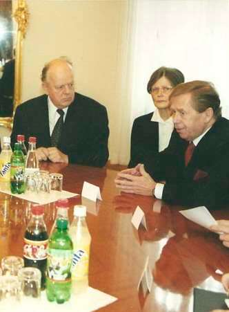

1. [~~Про мой род, себя и нашу элиту~~](./01.md)
2. [~~Бацькаўшчына~~](./02.md)
3. [~~Академия — завод — университет~~](./03.md)
4. [~~МРТИ — хорошо, БГУ — лучше~~](./04.md)
5. [~~Чернобыль~~](./05.md)
6. [~~В Москву, к властям~~](./06.md)
7. [~~Дорога к Вискулям~~](./07.md)
8. [~~Народы малочисленные и к ним приравненные~~](./08.md)
9. [~~Если б знал я, с кем еду, с кем водку пью…~~](./09.md)
10. [~~Беловежская пуща, Вискули, 7—8 декабря 1991 года~~](./10.md)
11. [~~Беларусь — Соединённые Штаты~~](./11.md)
12. [**Интеллигенция и политика**](./12.md)
13. [О университетах и ВУЗах, степенях и лекциях](./13.md)
14. [О «моём» зарубежье](./14.md)
15. [Патология](./15.md)
16. [Через годы, через расстояния](./16.md)

---

# Политика и искусство

Так уж устроен мир, что достойнейшие люди могут быть отнесены к преступникам, а воинствующие неучи взойти на вершины власти. Не будем завидовать судьбе невежды иль глупца в величии неправом. В конце концов, правда всегда торжествует. Хотя нередко к этому времени уже почти не остаётся в живых многих, кто за эту правду боролся, был без причин оклеветан, унижен, репрессирован. Так, увы, было всегда, поэтому и стали столь популярными утверждения «политика — дело грязное» или же, что то же самое — «политика делается грязными руками». Их, не задумываясь, приклеивают и к тем, кому грязные методы чужды. Строго говоря, доля непорядочных людей среди политиков ничем не больше такой же доли среди людей любого рода занятий, но во многих иных случаях непорядочность не столь явно обнажена для общества.

В конце 80-х Горбачёв ввел в обиход заимствованное им без ссылки на Николо Макиавелли (1469—1527) троесловие: «политика — искусство возможного». На съездах народных депутатов СССР ему никто не возразил, так как этими словами можно было оправдывать неудачи и Горбачёва, и съездов. Если же над этой фразой задуматься, то получается, что политика — это делание того, что получается, а не того, что обязывают делать, например, разум, долг, совесть. Можно трактовать и иначе, как прославление макиавеллизма: для укрепления государства допустимы любые средства — насилие, убийства, предательство.

Поздравляя сограждан с новым 1990 годом, президент Чехословакии Вацлав Гавел, фактически, споря с Горбачёвым, но, не упоминая его имени, парировал: *политика — искусство невозможного*. Об этой перепалке не было тогда ни слова в советских средствах массовой информации, так как гласность гласностью, а порочить имя генсека было делом по-прежнему опасным. В качестве примера того, что политика для лиц творческих — искусство, а не приспособленчество и не пренебрежение моралью, Вацлав Гавел напомнил о деятельности Яна Масарика. Она хорошо известна чехам, но почти не замечена в других странах.

Поэтому напомню.

Ян Масарик совершил действительно невозможное: имел мужество покинуть пост посла Чехословакии в Великобритании в знак протеста против подписания в 1938 году Мюнхенских соглашений, точнее, сговора премьера Великобритании Чемберлена, премьера Франции Даладье, Гитлера и Муссолини о передаче Чехословакией Германии Судетской области. Вряд ли можно лучше охарактеризовать сущность произошедшего для Великобритании, чем это сделал Черчилль: «**Англии был предложен выбор между войной и бесчестием. Она выбрала бесчестие и получит войну**».

Как министр иностранных дел чехословацкого правительства в изгнании Ян Масарик добился признания этого правительства Лондоном и денонсации в 1942 году Британским кабинетом Мюнхенских соглашений. Одновременно он поддерживал хорошие отношения с СССР. В июле 1941 года подписал соглашение о взаимопомощи, по которому в СССР должны были создаваться чешские части, позднее — Договор о дружбе с СССР. После войны был назначен министром иностранных дел в кабинете К. Готвальда, где был единственным беспартийным. Спустя несколько дней после перехода власти в Чехословакии к коммунистам его нашли мертвым под окнами своей квартиры, размещавшейся в здании министерства иностранных дел. Есть версия, что его смерть — дело рук советских спецслужб. Если попадаешь впервые в Министерство иностранных дел Чехии, тебе обязательно покажут эту реликвию — квартиру Яна Массарика, человека, который доказал своей жизнью, что политика — искусство невозможного.

Вацлав Гавел прежде всего как человек творческий считал настоящую политику искусством. Он не мог нравиться ни советскому руководству, ни Горбачёву, ни тандему Путин-Медведев. Но его смерть 18 декабря 2011 года и похороны 23 декабря обнажили невиданные неизлечимые язвы высших российских политиков. Лично для меня Дмитрий Медведев потерял последние крохи интеллигентности и цивилизованности, послав в Северную Корею соболезнование по поводу кончины диктатора Ким Чен Ира и не послав соболезнование родным Гавела и всему чешскому народу. Такова мстительность Путина, воле которого безропотно подчинён Медведев. А ему — Путину — из-за позиции Гавела не была вручена в 2011 году премия Квадрига, основанная немецкими бизнесменами. Гавел заявил, что если это произойдёт, то он откажется от премии Квадрига, вручённой ему в 2009 году.

На похороны Вацлава Гавела прилетели президент Франции Николя Саркози, президент Германии Кристиан Вульф, премьер Британии Дэвид Кэмерон, президент Литвы Даля Грибаускайте, Лех Валэнса, Билл Клинтон и многие другие известнейшие люди, Никто не приехал из России. А как иначе? Ведь Гавел заявлял о грубейшем попрании прав человека в Чечне, о политической составляющей обвинения Ходорковского, об антидемократичности российской модели демократии.

Ремесло и творчество, наука, политика и искусство. Люди различного уровня интеллигентности, образованности, личных умений и опыта по-разному видят разграничения между этими понятиями. Что наука — это сфера человеческой деятельности, функция которой получение, накопление и систематизация знаний, мне было известно задолго до того, как выпало счастье к науке прикоснуться. Не буду скрывать, в политику я вошёл значительно раньше, чем на уровне ремесленника понял, что это такое.

Удивительного здесь мало, хотя для изучения дисциплин, называемых общественно-политическими, отводилось в СССР до 30% учебного времени в любом вузе и на любой специальности, в том числе и на физико-математическом факультете университета, где я учился. После университета в моём багаже были только отличные оценки по общественным наукам, а после аспирантуры — кандидатский минимум по марксистско-ленинской философии. Тем не менее, я обязательно должен был поступать и каждые 7-10 лет заканчивать вечерний университет марксизма-ленинизма. Успел это сделать дважды. Но из всего этого общественно-политического многообразия запомнилось лишь следующее: марксистское учение всесильно, потому что оно верно; партия — ум, честь и совесть нашей эпохи (имеется в виду КПСС, других партий не было); наша цель — коммунизм; политика — концентрированное выражение экономики. Повторяю: что такое политика на самом деле, я так и не знал, хотя по так называемым общественно-политическим наукам не имел иных оценок, кроме отличных.

# Партийная номенклатура и политики

С политикой и политиками советского покроя я по-деловому соприкоснулся после Чернобыля. Для минимизации негативных последствий катастрофы нужны были консультанты по вопросам радиационной безопасности на всех уровнях партийной и государственной власти; нужна была измеритель ная радиометрическая аппаратура и специалисты, умеющие с нею обращаться. Практически все профессионалы такого профиля находились в БССР в университете и двух институтах Академии Наук. Что касается университета, то львиная их доля была на кафедре, которую я возглавлял. Это и обусловило появление моих широчайших контактов с высокопоставленными представителями партийных и государственных органов. На практике я понял и их обязанности: решать только те задачи, которые доведены директивными партийными органами, регулировать отношения между социальными группами, умиротворять или же пресекать попытки искать решения, которые могут быть истолкованы как не вполне согласующиеся с линией партии, т.е. с коммунистической идеологией.

Такой подход сделал партийные органы пристанищем и убежищем для многих бездарностей и посредственностей. Настоящему коммунистическому руководителю нужно было усвоить лишь одно правило: *план любой ценой*, потому что это спущено с самого верха и не подлежит обсуждению. Такой руководитель имел право упрекать, наказывать, карать всех подчинённых, которые, безразлично по каким причинам, хотели бы это правило нарушить. Если же он сам не обеспечил выполнение плана, то с ним могли обойтись самым нежелательным для него образом.

Казалось бы, неплохая система, если планы разумные. А они могут быть весьма совершенными в век вычислительной техники, позволяющей собирать и быстро обрабатывать гигантские объёмы информации, необходимой для обоснованного составления планов.

Однако невозможно предусмотреть все сбои, не говоря уже о таких, как Чернобыль . Поэтому и пошло цивилизованное человечество по пути саморегулирования, конкуренции, постоянной коррекции производства в соответствии с потребностями людей и выразителем этих потребностей — рынком. Базирующаяся на таком подходе рыночная экономика, конечно же, не панацея от всех бед, но колоссальный шаг вперёд по сравнению с экономикой плановой, регулируемой административными методами, в которой по нелепой задумке коммунистических идеологов конкуренцию должно было заменить социалистическое соревнование.

Наука экономика считает более эффективной рыночную экономическую систему, что обязывает освободить производителей от плановых пут, дать им свободу экономической деятельности. Такая либерализация — гибель для так называемой плановой социалистической и любой иной авторитарной, диктаторской, тоталитарной политической системы.

Как только ни изощрялись после Чернобыля высшие руководители БССР, чтобы обеспечить производство продовольствия на уровне, близком к дочернобыльскому. Перед ними была поставлена именно такая задача. И вот, усвоив одно единственное понятие по радиационной безопасности, они проявляли фантастическую изобретательность, как всё -таки скормить населению, например, мясо, радиоактивность которого в десять раз больше допустимых норм.

Один министр БССР, характеризовавшийся как очень умный вдумчивый работящий руководитель, так мне и говорит:

— В районах, не загрязнённых выбросами Чернобыля, мы производим идеально чистое мясо. Кто нам мешает делать фарш или суповые наборы из 90% этого мяса и 10% загрязнённого. Смесь укладывается по допустимой радиоактивности и в наши и в международные стандарты.

Терпеливо пытаюсь объяснить ему то, что обязан знать каждый студент, специализирующийся на нашей кафедре. Нельзя так поступать, потому что размазывание радиоактивности не уменьшит главного — полученной населением коллективной дозы радиации. При таком подходе та же общая доза радиации будет распределена между большим количеством людей. А все достоверно известные негативные последствия воздействия радиации на население определяет именно коллективная доза.

Для убедительности повторяю еще раз: коллективная доза при таком подходе не уменьшится, а величина негативного воздействия на людей однозначно определяет коллективная доза.

Но министр не сдаётся.

— А если вы такой умный, объясните мне, почему мы не можем продавать населению мясной продукт, радиоактивность которого не превышает допустимой нормы?

Начинать объяснять всё с начала не хочется, поэтому иду по другому пути — добиваюсь приёма у Председателя Госплана, Зам. председателя Совмина. Тот всё понял, сказал, что никаких смесей в республике делать не будут и словами, которые я не решаюсь повторить, охарактеризовал деятельность моего несговорчивого оппонента. Подождав, добавил: не один он у нас такой!

Так произошла моя первая встреча один на один с Вячеславом Францевичем Кебичем, ставшим позднее первым премьером независимой Беларуси. Я был тогда благодарен судьбе за то, что в руководстве республики есть такие люди. Однако оказалось, что я восхитился вершиной айсберга. О подводной его части уже пришлось напомнить в этой книге.

# Межклассовая прослойка

Коммунистической партии были нужны учёные. Без них во многом не разобрать ся. Без них государство существовать и развиваться не может. Вместе с тем, учёные и вообще высококвалифицированные люди умственного труда — контингент достаточно опасный для беспрепятственной реализации догматов КПСС. Поэтому партия проводила такую политику, благодаря которой учёные, интеллектуалы имели пренебрежительно малое отношение к реальной политической деятельности.

Интеллигенции в социалистическом обществе была отведена унизительная политическая роль, роль межклассовой прослойки. До простого люда невзначай доводилось, что люди умственного труда, в отличие от рабочих и крестьян, не создают материальные ценности, но их потребляют. Трудящиеся массы воспринимали это как намёк относить ся к учёным и вообще людям умственного труда настороженно, считать их чем-то типа иждивенцев на теле рабочего класса и трудового крестьянства. Если начиналась какая-нибудь кампания осуждения врачей, кибернетиков, генетиков и даже языковедов, массы единодушно такое осуждение поддерживали и требовали жестокого наказания «провинившихся».

Научным работникам, имеющим учёные степени и звания, платилась довольно большая по советским меркам заработная плата. Партийные руководители не упускали случая подчёркнуть, что у этого профессора, а тем более академика, зарплата больше, чем даже у секретаря обкома, горкома или райкома. И это было правдой. Александр Николаевич Яковлев в своей книге «Сумерки» показал, чем отличались партийные руководители от учёных в плане оплаты их труда. Некоторое время партийцы имели «конверты» — не облагаемую налогами доплату, всегда — столы заказов и иные возможности приобрести то, что обычным гражданам никогда не доставалось. Покупательная способность партийного жалования была высокой, чаще всего более высокой, чем зарплата учёных.

Волею судьбы мне пришлось много раз бывать в Южной Корее. Там любят утверждать: среди образованных нет бедных. В любые времена, даже в самые тяжёлые годы японской оккупации, среди образованных действительно бедных не было. Похожая ситуация имеет место и в иных странах. Про людей с высшим образованием в СССР такого не скажешь. Нищий интеллигент понятие советское. Да и само слово интеллигенция появилось в российской империи в середине XIX столетия. Британских, французских, немецких или американских интеллигентов не бывает. Там бывают просто интеллектуалы.

Что же это такое — интеллигенция? Интеллигент — человек большой внутренней культуры, как правило, образованный, не позволяющий себе отступить от важнейшего элемента внутренней культуры — верности определённым принципам. К ним, прежде всего, относятся совесть, справедливость, честность. Большая внутренняя культура отличает интеллигентов от просто образованных людей. Именно это качество возведено в ранг главного при определении понятия интеллигенция в современных российских и иных словарях и энциклопедиях.

Стоявшая на страже коммунистических идеалов Большая советская энциклопедия (БСЭ), толковала понятие интеллигенция так, как указал Ленин. К интеллигентам он отнёс «…всех образованных людей, представителей свободных профессий вообще, представителей умственного труда... в отличие от представителей физического труда». На пяти страницах (!) БСЭ, поясняющих понятие интеллигенция (cтр. 311—315, том 10), нет ни слова о большой внутренней культуре. Это преимущество коммунисты лицемерно присвоили себе, повсеместно твердя, что именно КПСС — ум, честь и совесть нашей эпохи.

Такой подход позволял отвести неоднородной массе, названной Лениным интеллигенцией, унизительную роль межклассовой прослойки и успокоить её, например, словами Программы КПСС 1971 года: «когда труд каждого человека приобретёт творческий характер, когда небывало поднимется научно-технический и культурный уровень общества, интеллигенция перестанет быть особым социальным слоем». А до того «особый социальный слой» обязан не размышлять, а выполнять повеления партии.

В 1990 году французский журналист, политолог Ги Сарман подметил: «*Советское общество чрезмерно страдает от неподготовленности интеллигенции к позитивной исторической роли*». Сейчас, казалось бы, страшно представить, какие поступки по требованию КПСС вынуждены были совершать советские учёные, советские интеллигенты против своих же коллег-интеллигентов и учёных. Были в совершенстве отработаны методы умиротворения, осуждения, психологического и морального подавления учёных, не желающих быть безоговорочными рычагами партии, руками самих же учёных. Чтобы пояснить, что тогда творилось, приведу лишь один пример. Не сотрудники КГБ, не академики общественных наук (т. е не марксисты-ленинцы), а гордость советской науки всемирно признанные академики математик А. А. Дородницын, математик А. Н. Тихонов, микробиолог Г. К. Скрябин, Нобелевский лауреат физик А. М. Прохоров в июне 1983 публично открытым письмом осудили академика А. Д. Сахарова, назвали его непорядочным, не думающим, человеком, которому ненависть застилает глаза, человеком, потерявшим честь и совесть. Да, да! Именно такими эпитетами они нарекли Андрея Дмитриевича Сахарова, который стал символом величайших человеческих достоинств для всего мира, именем которого названы сотни улиц и площадей в крупнейших городах мира. Не верите? Читайте. Вот это письмо:

>**Когда теряют честь и совесть**\
\
Открыв номер американского журнала «Форин афферс» и обнаружив в нем пространную статью академика Андрея Сахарова, мы взялись за ее чтение, ожидая, по правде говоря, всякого. Что Сахаров пытается очернить все, что нам дорого, что он клевещет на собственный народ, выставляя его перед внешним миром эдакой безликой массой, даже и не приблизившейся к высотам цивилизованной жизни, мы хорошо знали.\
\
Сахаровское творение в «Форин афферс» нас тем не менее поразило. Как бы вступив в полемику с американским профессором из Стэнфордского университета С. Дреллом, который высказывается в пользу замораживания существующих ядерных арсеналов СССР и США, Сахаров призывает США, Запад ни при каких обстоятельствах не соглашаться с какими-либо ограничениями в гонке вооружений, ядерных в первую очередь. Он прямо-таки заклинает руководителей Вашингтона продолжать их милитаристский курс, курс на конфронтацию с Советским Союзом, на военное превосходство, доказывая, что Соединенные Штаты, НАТО не должны ослаблять гонку вооружений как минимум еще 10—15 лет.\
\
Это может показаться неправдоподобным, но нижеследующее написано черным по белому. Сахаров умоляет тех, к кому он обращается, «не полагаться на благоразумие противника». Кто же этот «противник»?\
\
Советский Союз, страна, в которой он живет. Он предупреждает хозяев Америки: не верьте миролюбию социалистических государств. Открыто, не стесняясь, Сахаров одобряет планы США и НАТО по развертыванию американских «першингов-2» и крылатых ракет в Западной Европе — этого оружия первого удара, которое намереваются нацелить на нашу страну и другие социалистические государства. Один из его аргументов — если у Вашингтона будут ракеты МХ, а это тоже всем известное оружие первого удара, — «Соединенным Штатам будет легче вести переговоры» с СССР.\
\
Мы несколько раз возвращались к этим местам в статье Сахарова. И у нас появилось какое-то странное ощущение: да он ли это пишет? Ведь все это мы уже много раз слышали, читали. Именно так говорит министр обороны США Уайнбергер. Так говорит президент Рейган. Это язык американских генералов и политиков-ультра. Сахарову не хватает только назвать СССР «исчадием зла» и объявить «крестовый поход» коммунизму — и его хоть сажай в Пентагон, в Белый дом.\
\
И еще одно нам показалось невероятным. Сахаров — ученый. Ему предметнее видно и лучше известно, какими могут стать последствия тех действий, к которым он призывает правительство страны, уже однажды испробовавшей на людях оружие массового уничтожения. Тогда США обрушили атомную смерть на японские города. Их правители хотели показать миру, и прежде всего нашей стране, какой силой они обладают. Сегодня Сахаров по существу призывает использовать чудовищную мощь ядерного оружия, чтобы вновь припугнуть советский народ, заставить нашу страну капитулировать перед американским ультиматумом. Да к какой стране и к какой «цивилизации» он себя относит и чего в конечном счете добивается? И неужели он не понимает, что наращивание вооружений, к которому он призывает, несет угрозу не только нашей стране, потерявшей в последней войне 20 миллионов человек, но всем без исключения народам, самой человеческой цивилизации?\
\
И здесь мы начинаем думать о Сахарове уже не как об ученом. Что же он за человек, чтобы дойти до такой степени нравственного падения, ненависти к собственной стране и ее народу? В его действиях мы усматриваем также нарушение общечеловеческих норм гуманности и порядочности, обязательных, казалось бы, для каждого цивилизованного человека.\
\
Мы знаем, что Сахаров ходит в больших друзьях у тех в Америке, кто хотел бы смести с лица земли нашу страну, социализм. Эти его друзья все время поднимают шум о «трагической судьбе Сахарова». Не хотим сейчас говорить об этом беспредельном лицемерии. Нет, наше государство, наш народ более чем терпимы по отношению к этому человеку, который спокойно проживает в городе Горьком, откуда и рассылает свои человеконенавистнические творения.\
\
Вот что вспомнилось. Ровно тридцать лет назад, в такие же летние дни, в США произошло одно из самых неправедных, постыдных событий XX века. Власти Америки казнили тогда ученых Этель и Юлиуса Розенбергов. Казнили, основываясь на нелепых, гнусных обвинениях. «Улики» сфабриковали секретные службы США. А, между прочим, в отличие от Сахарова, который призывает к ядерному шантажу против собственной страны, фактически к созданию условий для применения против нас первыми ядерного, оружия, Розенберги были не просто невинными людьми, ставшими жертвой безжалостного механизма американского «правосудия». Они еще и выступали за уничтожение смертоносного оружия. И вообще были честными, гуманными людьми.\
\
Говорить о честности, когда человек по существу призывает к войне против собственной страны, трудно. Несколько столетий назад Эразм Роттердамский сказал, что лишь немногие, чье подлое благополучие зависит от народного горя, делают войны.\
\
Дело, конечно, не в Эразме Роттердамском. А в том, что и в его времена порядочным, думающим людям ненависть не застилала глаза и они не теряли чести и совести».\
\
Академики А. А. ДОРОДНИЦЫН, А. М. ПРОХОРОВ, Г. К. СКРЯБИН, А. Н. ТИХОНОВ.

А могли ли академики поступить иначе, могли ли отказаться подписывать такое письмо или сделать вид, что не они сами его написали и подписали? Для этого нужно было иметь мужество академика Сахарова, а оно — отсутствует в среде тех, кто был принудительно втянут и погряз в соглашательстве, не воспротивился называть себя прослойкой, не претендующей на какую бы то ни было политическую роль. Тогда, в 1983 году, когда письмо четырёх было опубликовано в «Известиях», Генеральным секретарём ЦК КПСС был Юрий Владимирович Андропов — экс-председатель КГБ с 15-летним стажем на этой наводящей ужас должности. Отказ мог стоить жизни. А за спасение жизни своей и своих родственников грех осуждать академиков.

# Наши белорусские реалии

Грех осуждать и белорусских великих, солидаризировавшихся в своём творчестве с подонками, осуществляющими сталинский государственный террор. Но забывать, скрывать от людей их поступки, которые с позиции наших дней никак нельзя считать достойными, тоже вряд ли следует.

27 января 1937 года в Москве начался судебный процесс над 17 известными большевиками из «параллельного антисоветского троцкистского центра», из них 13 человек были приговорены к расстрелу. Остальные — к длительным срокам тюрьмы. Естественно, что приговор приветствовали коллективы рабочих, крестьян и интеллигенции всего Советского Союза. Сессия Академии наук БССР единогласно потребовала «расстрела всей банды фашистов». Через день после начала процесса Янка Купала написал, а 3 февраля 1937 года опубликовал в газете «Звязда» стихотворение «Мало их повесить». Не сомневаюсь, что русскоязычный читатель легко поймёт приводимые далее несколько из 20 четверостиший этого стиха.

>Мала іх павесіць\
На сухой асіне,\
Бо нават асіна\
Ад сябе адкіне.\
\
Дзерава адкіне,\
Дзерава сухое,\
Сябе не спаганіць\
Поскуддзю такою…\
\
Гандляры айчынай\
Па чужым заказу…\
Вынішчыць дашчэнту\
Гэтую заразу!\
\
Хай пад сонцам знаюць\
Чым мы сёння сталі.\
Мы падставім грудзі\
За цябе, наш Сталін

Белорусские патриоты, почитатели творчества Янки Купалы единодушны во мнении, что поэта вынудили явить бесчеловечность и написать такие человеконенавистнические строки. Мне же представляется, что великий поэт был не просто романтиком, как и большинство настоящих поэтов, а романтиком, искренне верящим в реализуемость идеалов коммунистической утопии. Он считал обоснованными выдвинутые предателям обвинения и с присущими ему страстностью и профессиональным мастерством гневно их осудил.

---

Страшные времена, когда невосхваление деяний партии и правительства грозили смертью, уступили место подходам не менее подлым, но жёстоким, а вынужденные позорные поступки переросли в привычку угождать власти, независимо от того, как ты оцениваешь её действия. Слишком медленно выветриваются они из умов многих наших белорусских академиков и иных высокообразованных людей. На ментальность мэтров науки способны влиять лишь их личные потрясения. Если же таковых нет, то их угодничество приобретаем местами даже гипертрофические формы.

Белорусы, по мнению уважаемых политологов, были в советское время более советскими, чем русские. Сегодня отдельные наши академики по уровню верноподданничества власти, нарушающей конституцию и законы, опередили своих коллег на постсоветском пространстве, включая русских. Некоторые из них остаются зашоренными академиками коммунистического толка, хотя их коммунистический прародитель Карл Маркс считал самой отвратительной чертой человека угодничество.

После перестройки отдельные учёные, в том числе и академики, двинулись в политику. В большинстве случаев — чтобы внести идеи, предложения, программы для совершенствования государства и общества, для улучшения благополучия людей, чтобы квалифицированно работать ради этого самого благополучия. В Верховном Совете Беларуси 12 и 13 созывов были академики, профессора, доктора наук, доценты, кандидаты наук и заметные учёные без степеней и званий. Никому из них не могу бросить никакой иной упрёк, кроме того, на который указал всей советской интеллигенции Ги Сарман: *неподготовленность к позитивной политической роли*. Этот упрёк я принимаю и на свой счёт.

Однако с исчезновением информационной изолированности следовало бы ожидать от интеллигентов если не прозрения, то хотя бы критического анализа своей позиции, осознания своего долга перед обществом, своей политической роли. Но старая картина, увы, пока не изменяется: интеллигенты остаются в рамках ленинского определения и идут в услужение далёким от интеллигентности деятелям, проще — в услужение властвующему интеллектуальному невежеству.

Вспоминаю, как депутат ВС академик Евгений Фёдорович Конопля, пытаясь вырваться из рокового круга невмешательства интеллигентов в политику, развесил в зале заседаний Верховного Совета множество плакатов с таблицами и графиками, пытаясь втолковать депутатам, как отражается Чернобыльская катастрофа на здоровье граждан Беларуси. Благородные порывы академика ощутимого воздействия на депутатов не возымели. Получился диалог глухонемого со слепым. Принятые позднее законодательные акты базировались больше на эмоциях, чем на научных данных. Но кое у кого след остался. Продолжайся такие подходы систематически — эффект был бы несомненный.

Меня же тянет привести иные примеры неподготовленности интеллигенции творческой и научно -технической к позитивной политической роли, но при этом её страстного желания внедриться в политику. Хотя учёные должны лучше иных знать, что проникновение в политику обязывает предварительно что-то понять в науке о власти — политологии, изучить, освоить на практике. Они же, как правило, набивают в политике шишки, работая методом проб и ошибок. Идя во власть, они имеют все основания считать, что их интеллектуальный потенциал несоизмеримо выше того примитивизма, который демонстрировали всему миру отдельные высшие руководители СССР и БССР на трибуне съездов народных депутатов и парламентов. Это действительно так, но, увы, не показатель уровня политической квалификации тех, кто реально правил, оставаясь в тени. Тем не менее, прямая телевизионная трансляция заседаний съездов Народных депутатов СССР и парламентов республик усилила стойкое заблуждение, что ленинское «кухарка может управлять государством» — истина. А раз по Ленину может кухарка, то академики тоже должны уметь.

# Соблазн для академика

Не уразумел президент Национальной Академии Наук (НАН) академик Александр Павлович Войтович, чем является сделанное ему в 2000 году предложение возглавить так называемый Совет Республики. Не понял, что это способ сделать вакантным место президента Национальной Академии Наук, на которое он был избран по Уставу НАН РБ тайным голосованием учёными академии в 1997 году. Не задумался глава академической науки Беларуси и над тем, какой политический орган поручается ему возглавить и какова значимость этого органа. Если бы задумался и прочёл конституцию, фальшивым способом утверждённую референдумом, то понял бы, что орган этот бутафорский и служит только для одобрения инициатив и действий президента страны. По Ги Сарману — явил неподготовленность к позитивной политической роли. Тщеславие затуманило разум. Недаром компетентные психологи утверждают: доля людей, совершающих неразумные действия, примерно одинакова среди рабочих, крестьян, профессоров, дворников, академиков и прочих категорий граждан.

Просветление, конечно же,наступило, но с некоторой задержкой. А до того было великое самоудовлетворение и удовольствие от дополнительного возведения в столь же непотребные должности в межгосударственных масштабах: академик Войтович стал Председателем Межпарламентской Ассамблеи ЕврАзЭС, заместителем Председателя Межпарламентской Ассамблеи СНГ (всё — 2001—2002 гг.). После высшей фазы облагодетельствования помутнение разума частично прошло, и академик начал выражать неудовольствие и даже позволил себе не согласиться с каким-то утверждением президента.

Забыл, неблагодарный, что, угождая Лукашенко, стал академиком НАН РБ (1996), Лауреатом Государственной премии Беларуси (1996), Президентом НАН (1997), получил орден Франциска Скорины (1998). Забыл… и достукался: 28 июля 2003 года Лукашенко отозвал Войтовича с поста спикера верхней палаты парламента.

Академик не на шутку возмутился, перешёл в оппозицию и даже заявил о нелегитимности президента. Не покаялся, правда, любезный, за то, что сотворил множество гадостей, дабы угодить всё тому же нелегитимному президенту. И у меня извинения не попросил за то, что ради демонстрации своей преданности Лукашенко в 1998 году своим личным решением, заявив президиуму НАН, что я с этим согласен, лишил меня — члена-корреспондента НАН — академических выплат таким же непристойным образом, как Лукашенко лишил меня пенсии. В действительности же, когда Войтович позвонил мне по телефону и начал разговор о финансовых трудностях академии, я ответил, что не в состоянии противостоять его страстному желанию угодить предводителю.

Если действия Лукашенко объяснимы: он мстил мне за то, что я абсолютно обоснованно никогда не воспринимал его как порядочного или интеллигентного человека, то мотивация Войтовича была чисто академическая: *отошёл, мол, Шушкевич от науки*. Сам же он отошёл от науки из-за занятия чистым администрированием гораздо дальше, во всяком случае, никому в голову не пришло пригласить его, как учёного, с лекцией в какой-нибудь путный университет, как приглашали меня, в российские, украинские, Варшавский, Ягеллонский, Вроцлавский, Йельский, Колумбийский и даже Гарвардский университет. Зато в лапидарном политическом творчестве академик Войтович преуспел. Опубликовал несколько больших статей в оппозиционных газетах, объявил правящий режим диктатурой, чего почему-то не замечал, находясь на должности спикера верхней палаты и на должности президента НАН.

Лукашенко 20 июня 2004 года реагировал на выступления Войтовича по-колхозному: «проблема состоит в том, что это все бывшие плюс пенсионеры, которые очень успешно годами сидели у кормушки Лукашенко. Войтовичи, Кравченки эти, Козулины и прочие, они же хрюкали у кормушки Лукашенко, окрепли, встали на ноги, проворовались или заняли просто предательскую позицию»

Все, кого данными или же подобными словами Лукашенко по-хамски поносил, не унизились до того, чтобы вступить с ним в дискуссию, считая, что это будет унизительным для их человеческого достоинства. Войтович же не понял, что его, как говорят (и не только в Одессе), назвали верблюдом, чтобы насладиться тем, как аргументированно он будет доказывать, что это не так. Что и произошло. 28 сентября 2004 года академик Александр Павлович Войтович написал:

>Относительно Ваших оскорбительных и ложных заявлений в мой адрес отвечу кратко: нет, нет и нет. Не «хрюкал у кормушки Лукашенко» и не пользовался ею, «окреп и встал на ноги» без всякой Вашей помощи (еще в то время, когда Вас за пределами организаций, где Вы работали, никто не знал), не «воровал», не «занимал предательской позиции», не «вставал в оппозицию», не совершал «глупость за глупостью». За все деньги, которые я получал, работая в академии и в Совете Республики, расписывался, так что легко сосчитать, сколько имел этих денег; в академии получал больше, чем работая в Совете Республики! 

Заметьте, все обращения к воинственно невежественному оскорбителю во втором лице сделаны с большой буквы.

Далее последовали трудные для понимания деяния. Войтович попытался участвовать в президентских выборах 2006 года. Не потянул. Сошёл с дистанции под смешным предлогом «не подыгрывать Лукашенко». Перенёс на политическое поприще сказку о мышках, решивших привязать к хвосту кошки колокольчик: посоветовал премьер-министру Сидорскому принять на себя полномочия президента «из-за нелегитимности Александра Лукашенко». Не переставал важничать. Объявил себя лидером Международного общественного движения «Сотрудничество и прогресс» (январь 2007), через месяц — председателем общественного объединения «Правовая инициатива». Потом урезонился, внял советам не дразнить нелегитимного. Ведь тот может дать команду, которую сам Войтович угодливо выполнял по отношению к другим: лишить права работать в науке и получать академические.

# Иной академический путь

Иначе действовал другой академик. Ему было легче, так как он был воистину талантлив. То, что давалось Войтовичу в науке длительной усидчивостью и кропотливым трудом, он постигал быстро и изящно: всегда был отличником, даже Ленинским стипендиатом, с блеском окончил университет, получил красный диплом и в дальнейшем достиг больших высот в научной работе. Стал доктором, профессором, лауреатом Государственной премии СССР, академиком, подготовил более 20 кандидатов наук, некоторые из них позднее стали докторами.

А в смысле письмотворчества... Ну как тягаться трудолюбивому академику Александру Войтовичу, которому для изложения своего скромного мнения нужен, как минимум, газетный разворот, с экстравагантным академиком Анатолием Рубиновым, которому для достижения намеченной цели нужна неполная страница, например:

>Уважаемый Александр Григорьевич!\
\
От души поздравляю с Вашей великолепной победой! С победой всего нашего народа! Это был важнейший и решающий момент для всех нас, для всей нашей страны! Это было то, что называется «момент истины», оценивающий прошлое и определяющий будущее. Блестящие результаты референдума убедительно показали, что наш народ в своем подавляющем большинстве поддерживает Ваш курс, Ваши идеи, Ваши непрестанные усилия по налаживанию всех сторон жизни нашего общества. Если страна продолжит этот курс еще лет пятнадцать, то можно быть спокойным за ее будущее — наше общество и наше государство окрепнут экономически и политически настолько, что станут менее зависимы от личности руководителя. И пусть тогда Президент страны сменяется каждые пять лет — это уже не сможет сбить страну с установившегося пути развития. Но ближайшие пятнадцать лет смена руководителя была бы чрезвычайно опасной и рискованной для будущего нашего государства. И хотя все мы понимаем, что для Вас это неимоверная нагрузка — и психологическая, и интеллектуальная, и чисто физическая, но таков выбор истории, такова уж Ваша судьба от рождения…\
\
Победа на референдуме вдохновила всех Ваших сторонников, всех, кто честно работает на благо нашей Беларуси. Желаю Вам, Александр Григорьевич, на долгие годы сохранить присущую Вам неисчерпаемую энергию, мудрость и страстное желание привести наш народ и нашу страну к счастью и процветанию.\
\
Председатель ВАК А. Рубинов

Каков угодник!

И всё это при полном понимании, что адресат грубо попрал Конституцию, отверг демократию, не может быть непричастен к исчезновению известных политиков! А ради чего? Ради мелкой личной выгоды, ради приближения к власть имущему, что, бесспорно, должно отразится на личном достатке и благополучии. Вполне подпадает под ленинское определение интеллигента. Человек умственного труда! Но, увы, не человек высокой внутренней культуры.

И нужно же было такому случиться. С автором этих строк — тогда совсем не заслуживающим никаких упрёков пай-мальчиком — судьба свела меня в Белорусском государственном университете в 1955 году, когда я был на последнем, а он на первом курсе уже физического факультета, который выделился из физико-математического.

Мой замечатель ный однокурсник Владимир Казущик и я с первых студенческих дней играли в оркестре народных инструментов университета на четырёхструнных домрах, были первыми примами. По меркам нашего оркестра мы с Володей играли неплохо. Во всяком случае, сменившие друг друга руководители оркестра — истинные профессионалы, имена которых — Георгий Иванович Жихарев и Михаил Аркадьевич Лисицын — и сегодня на слуху, не только не имели к нам претензий, но даже нас хвалили.

И вот к нам приходит новенький. Володя и я сразу же поняли: он играет лучше нас. Простые произведения играет с листа. Мудрый Михаил Аркадьевич сразу же ставит нам его в пример. Вот, мол, чего достигают старанием и трудолюбием. Я со своей стороны радуюсь, потому что могу теперь прекратить бесперспективные, по моему убеждению, усилия освоить концерт Будашкина для домры с оркестром народных инструментов. Лисицын заставлял меня этот концерт разучивать, думаю, для того, чтобы удовлетворить моё тщеславие; говорил, что я способен сыграть, нужно только каждый день уделять этому время. Но я сознавал, что не сыграю это очень серьёзное для моих умений произведение. Теперь же, естественно, это должно было стать задачей новенького, у которого в отличие от меня — самоучки — за плечами музыкальная школа, а наяву — лучшая техника игры.

Многие годы я был свидетелем и научных достижений Анатолия Рубинова, вплоть до избрания его в 1991 году академиком. Наши цветные фотографии, как преуспевших в решении задач, поставленных XXVI съездом КПСС, оказались в 1986 году на соседних страницах книжки «Ритмы созидания». В то время каждый снимок, помещаемый в такую книжку, и надпись под ним должны были быть согласованы с ЦК КПБ. Под снимком Рубинова его фамилия почему-то не упоминалась, и все похвалы были в адрес установки «Гном-2», возле которой он снят. Подпись под снимком с моим участием, наоборот, восхваляла нашу кафедру, моего заместителя Евгения Фурсу и меня.

Потом Рубинова потянуло в политику. Летом 1992 года звонит мой советник академик Михайлов Анатолий Арсеньевич, спрашивает, не может ли он зайти ко мне в кабинет Председателя Верховного Совета вместе с академиком Рубиновым.

Я с удовольствием их принял — академиков, настоящих (по моему убеждению того времени) учёных, известных не только в Беларуси. Говорили о трудностях, переживаемых Академией наук, научными учреждениями и вузами страны, обсуждали возможные пути преодоления трудностей. Потом, то ли в шутку то ли всерьез, заговорили о том, как хорошо, когда физики и вообще естественники попадают в политику. Вспомнили академика Сахарова. Но цели визита я не уразумевал до тех пор, пока Михайлов не посоветовал найти для Рубинова, если я действительно его высоко ценю и уважаю, какую-то высокую государственную должность.

Анатолий Николаевич не стал отнекиваться. Поведал, какой он горячий патриот Беларуси, сторонник демократии, рыночной экономики, прав человека, свободы слова, вероисповедания и проч. и проч. Для меня было полной неожиданностью его желание расстаться с наукой. Без лишнего пафоса могу сказать, что Рубинова я считал гордостью белорусской науки. Стремился сделать всё возможное, чтобы такие учёные не покидали науку из-за трудностей переходного периода.

Не скрывая удивления, я разоткровенничался. Рассказал то, о чём воздерживался говорить открыто с кем-нибудь кроме родственников и самых верных друзей. Рассказал о том, как я из-за шутливого характера своих друзей случайно попал в политику. А случилось это так: пообещал вечером во время дружеского застолья не брать самоотвод, как всегда это делал. Назавтра, когда меня предложили кандидатом в Народные депутаты СССР, а секретарь райкома в президиуме собрания, улыбаясь, смотрел на меня и был уверен, что я, как всегда, заявлю о самоотводе, я молчал. Председательствующий переспросил ещё раз.

— Самоотводы есть?

Все, предложенные собранию, молчали. В итоге я стал кандидатом в депутаты, а потом и депутатом.

— Обратного пути, Анатолий Николаевич, нет, — пояснил я Рубинову, — сочтут предателем.

Искренне желая академику добра, предложил, если он не против, поговорить о жизни и обсудить поднятый им вопрос в иной обстановке. Он согласился, предложил встретиться у него дома. Там меня ждала недюжинная кулинарная хватка хозяина и новая неожиданность: ни малейшего упоминания со стороны академика о желании получить высокую государственную должность. Не скрою, я снова обрадовался. Сохранил всё-таки для науки светлую голову!

После этого мы, практически, не встречались даже на сессиях Национальной академии наук, на которые я просто перестал ходить, когда Лукашенко лишил учёных права не только избирать, но и называть президентом НАН её руководителя.

В 2002 году Рубинов назначен на должность Председателя ВАК. Я счёл, что такой пост он, как настоящий учёный, вправе занимать и что его назначение будет способствовать должному уровню справедливых требований к претендентам на учёные степени и звания в Беларуси. Вскоре после этого, будучи за рулём, затормозил перед светофором на перекрёстке улиц Богдановича и Киселёва. Увидел Рубинова в служебном автомобиле рядом с шофёром тоже у открытого окна. Поприветствовал и поздравил с назначением. Эта встреча была последней, во всяком случае, из тех, когда мне приятно было его видеть.

Последовавшее далее подтвердило, что я опять ошибся в человеке. Во-первых, появился своего рода эталон угодничества — приведенное выше письмо, во-вторых, стали известны факты отказа в утверждении диссертаций по политическим мотивам. В угоду правителю и другим антибелорусам он, в частности, «зарубил» докторскую диссертацию председателя Союза белорусских писателей Алеся Пашкевича, которая была успешно защищена в БГУ на самом компетентном в Беларуси Учёном Совете по филологии. Есть и иные убедительные примеры его ненаучного подхода к делам науки на посту председателя ВАК.

Дальше — больше. Стал разрабатывать антибелорусскую, антидемократическую государственную идеологию, хотя по конституции идеологии, обязательной для граждан, не должно быть. И если министров и высокопоставленных чиновников силовых ведомств принято называть цепными псами правящего режима, то Анатолий Николаевич вполне заслуживает того же звания в области идеологии.

Сегодня на вопрос, почему я так высоко ценил Рубинова во всех отношениях, отвечаю: я очень плохо его знал и воспринимал таким, каким он исключительно ловко прикидывался. Благодарен его тщеславию, во имя которого он хотел прослыть ещё и поэтом: издал книжку своих стихов, точнее псевдоноваторского рифмоплётства. О том, какое отношение его творения имеют к изящной словесности, судите сами.

>Ох, народ ты наш, народ,\
Ох, народище!\
Из полтысячи пород —\
Одна породища!\
Наш один — за ихних двух\
Только дай борща…\
И раз в двадцать крепче дух…\
Из туалетища!

Если бы не газета «Народная воля» от 20 сентября 2011 года, то упустил бы немаловажную деталь. Во время, что и говорить, финансового кризиса в стране, когда бешено растут цены, а белорусский рубль за считанные дни обесценился по отношению к доллару, евро, российскому рублю и прочим валютам в два—три раза глава верхней палаты, так называемого парламента, «сенатор» Рубинов абсолютно спокоен, денег не считает и не знает, сколько их у него. Так, во всяком случае, он заявил корреспонденту, невольно объяснив причину стремления в чиновники, теоретически — в «сановники», но сановники принимают решения, а он — одобряет всё, предложенное правителем. Получает за это увесистое вознаграждение, каковы цены и что получают обычные граждане, его не интересует. Ленин о таких говорил: страшно далеки они от народа. Впрочем, для академика это допустимо, для политика — преступно.

# «Университетский» вариант

В 2001 году мой родной Белорусский государственный университет отмечал своё 80-летие. Я, естественно, был тогда в оппозиции правящему режиму и очень удивился, получив приглашение на юбилейное торжественное заседание в лучший зал Минска — театр оперы и балета. Приглашение было размашисто подписано ректором профессором А. В. Козулиным.

На заседание я решил не идти, хотя очень хотелось встретиться с давними друзьями и знакомыми. Принял нелёгкое решение не идти, потому что знал А. Козулина лет двадцать: сначала как секретаря комитета комсомола университета, а потом как преподавателя и секретаря партбюро факультета прикладной математики. Я очень хорошо к нему относился, когда сам работал в университете, но потерял тёплые чувства, так как счёл его человеком, втёршимся в доверие к Лукашенко, не имея ни научных, ни педагогических заслуг такого уровня, чтобы стать ректором университета. Как педагог и учёный он, по моему мнению, не был соизмерим ни с одним из предшествующих ректоров: К. И. Лукашовым, А. Н. Севченко, В. М. Сикорским, В. А. Белым, Л. И. Киселевским, Ф. Н. Капуцким. Не импонировало мне и то, что Козулин недопустимо плохо владел белорусским языком. Именно по этой причине Комиссия по образованию, культуре и сохранению исторического наследия Верховного Совета 12 созыва, возглавляемая народным поэтом Нилом Гилевичем, отказалась поддержать его назначение на должность министра образования. Но для Лукашенко незнание белорусского языка было фактором положительным, и он указом от 28 августа 1996 года назначил Александра Владиславовича ректором БГУ.

Многие мои университетские коллеги, преимущественно физики и математики, знавшие, что мне было послано приглашение на юбилейные торжества, пришли ко мне домой через день после торжественного заседания в оперном театре и недвусмысленно дали понять, что, не придя, я поступил правильно. Наговорили много приятного. Мол, я по-прежнему чую фальшь, не попадаюсь в ловушки типа присутствия на юбилее. Ведь будь я там, Козулин мог бы говорить, что все — и власть, и оппозиция его очень любят, а в коллективе университета это очень положительная характеристика.

Пусть он довольствуется тем, что охмурил патриаршего экзарха Филарета, который пришёл на юбилей и сделал его окончатель но православным, назвав в своём выступлении Александром Владимировичем, а не Владиславовичем. Ведь без такого уточнения от его отчества католицизмом попахивает. Пусть наслаждается тем, что сам ректор Московского университета был на торжествах и что число его, Козулина, членств и председательств в самопровозглашённых академиях и обществах приближается к числу орденов у Брежнева.

— Ты же знаешь,— продолжал один из моих знакомых, — Козулин сам лекций по-прежнему не читает и занятий со студентами не ведёт, но посмотри, как описывает его наша многотиражка: «Внёс существенный вклад в становление системы образования независимого белорусского государства, был инициатором её реформирования и перевода на инновационный путь развития. Один из авторов закона «Об образовании» Республики Беларусь. Никогда не прерывал научной работы, защитил докторскую диссертацию по новым образовательным технологиям». Но всем хорошо известно, что в математике он не так горазд, чтобы стать доктором. Поэтому он так угождает Луке, что тот сделал его и доктором, и профессором, заметь, педагогических наук — и всё это без монографии и каких-нибудь путных публикаций. Да и вообще он остаётся позёром, работает только на себя, а университет гниёт. Над предложениями приблизить БГУ к национальному белорусскому открыто насмехается. Выслуживается, изгоняя путных студентов по политическим мотивам. И избрание своё на объединённом совете в прошлом году он устроил только для того, чтобы показать, что он не назначенец Лукашенко, а всеми любимый избранный Советом ректор. Поверь, это ему не простится, ведь Лука популярных давит. Популярным должен быть только сам Лука. Мясникович в Академии такой же «учёный», как и Козулин, но хитрее, и не формирует совет для своего безоговорочного избрания, хотя наделён для этого всей полнотой власти.

Поначалу мне казалось, что мой друг легонько перегибает, имея, по-видимому, какую-то личную неприязнь к правящему ректору и назначенному, а не избранному, как это всегда было, предводителю академической науки. Попытался возразить, но убедился, что так думают все без исключения мои давние соуниверситетчики.

Так что же происходило с Козулиным до и после юбилея?

Окрылённый фантастически высоким карьерным взлётом. Александр Владиславович решил не просто закрепить ся на достигнутом уровне, а идти дальше. Он заболел той же болезнью, что и, как их тогда называли, «молодые волки» в Верховном Совете Беларуси 12 созыва — Дмитрий Булахов, Виктор Гончар, Геннадий Карпенко, Анатолий Лебедько и примкнувший к ним, но вовремя удалившийся, Леонид Синицын. Каждый из них считал, что вправе претендовать на гораздо большее, чем достиг.

В начале нового тысячелетия Александр Козулин учуял, что может подать себя так, что будет поддержан теми российскими интеллектуалами, к мнению которых прислушивается российская власть . Он начал беззастенчиво «пиарить ся», забыв, что в придворном стаде нельзя подымать голову выше остальных приближённых ко «всенародно избранному».

Александр Владиславович становится академиком Академии образования Республики Беларусь (оказывается, есть такая!), академиком Международной Академии высшей школы (и такая есть), вице-президентом Петровской академии наук и искусств, председателем общества «Беларусь —Австрия», председателем Совета ректоров ВУЗов Беларуси. Оставаясь ректором, становится членом правительства Республики Беларусь, министром, членом Президиума Национальной Академии Наук. Искуснейшим образом добивается титула почётного профессора Московского государственного университета имени М. В. Ломоносова.

Один из известнейших российских интеллектуалов Председатель Совета по внешней и оборонной политике России (СВОП) Сергей Александрович Караганов сказал мне тогда в частной беседе после встречи членов СВОП с представителями белорусской демократической оппозиции в Москве:

— У вас в Беларуси вырисовывается прекрасная ситуация. На смену лидеру, самобытность которого республику не сильно украшает, может придти настоящий высокообразованный лидер. На мой вопрос, кто он, этот лидер, прямого ответа не последовало. Но довольно быстро я понял, что ответить должен был я сам и сказать Козулин. Весомые члены СВОП пояснили мне это прямым текстом. Оказывается, Козулин давно с ними в контакте, хорошо себя здесь подал и очень высоко котируется.

Успешное раскручивание Козулина в российских привластных кругах не могло остаться незамеченным. А повод для превентивного и решительного пресечения потенциального конкурента, поддерживаемого весомыми российскими силами, найти не трудно. Его нашли незамедлительно. 17 ноября 2003 г. Указом президента Козулин был освобожден от должности ректора Белорусского государственного университета в связи со скандалом вокруг унитарного предприятия «Унидрагмет БГУ».

# В роли невинно пострадавшего

Таким образом, Александр Владиславович оказался с нимбом репрессированного и со статусом пострадавшего за правое дело. Как талантливый менеджер он хорошо понимал, что в новых условиях и в новом качестве терять ему уже нечего. «Всенародно избранный» никогда его больше не полюбит, поэтому есть только один путь остаться на виду — добиться лидерства в оппозиции.

Кстати, здесь как нельзя лучше подходит клеймо репрессированного, оно как бы подтверждает, что он давно противостоит диктатуре и, как и вся истинно демократическая оппозиция, борется за демократию, права человека, государственную независимость Беларуси. А для себя лично и с мудростью древних такой подход согласуется: лучше быть первым в Египте, чем вторым в Риме. Кроме того, оппозиции обещают поддержку и Восток и Запад, если она объединится. Она же занимается «непотребщиной». Вырабатывает принципы, регламент, порядок справедливого объединения и прочую чушь.

Не распыляясь на мелочи, Козулин объявляет себя самым главным объединителем всех социал-демократов, собирает симпатизирующих ему представителей от всех существующих социал-демократических партий, объявляет это сборище объединительным съездом социал-демократов и 10 апреля 2005 г. избирается на нём председателем Белорусской социал-демократической партии. После этого «расширяет» объединение и в том же году объявляет себя учредителем и координатором гражданской инициативы Общенационального движения «Воля народа», хотя до сих пор никто так и не знает, что это такое и кто в него входит.

В этом же году на основе достаточно чистых демократичных процедур на итоговом Конгрессе демократических сил должно было состояться избрание лидера объединённых демократических сил (ОДС), который после официального объявления выборов автоматически должен был стать кандидатом в президенты от ОДС.

Предшествовавшая конгрессу кампания по выдвижению кандидатов на роль лидера объединённой оппозиции и делегатов могла нежелательным для диктатуры образом всколыхнуть Беларусь. Власти всех уровней изощрялись, препятствуя проведению избирательных собраний. Помещения для собраний нельзя было добыть ни за какие коврижки. Если же запрет удавалось преодолеть, то приезжал наряд милиции и требовал немедленно освободить зал, так как «поступил сигнал», что он заминирован. В Светлогорске, Витебске и других местах запрет на проведение собрания в частных помещениях и садах производился на основе «заявления соседей» о происходящей там страшной драке. Подсылались провокаторы из абсолютно опустившихся людей, которые в беспробудно пьяном состоянии действительно пытались такие драки инициировать . Приходилось удивляться, как «доблестная милиция» может использовать в качестве своих посланцев такой сброд. В Молодечно в помещении, где находились офисы партий, была объявлена срочная учебная тревога, и бравые брандмейстеры то разматывали, то сматывали шланги.

Несмотря на все чинимые помехи, Конгресс собрался. По итогам региональных собраний выбирать кандидата в президенты нужно было из четвёрки: С. И. Калякин, А. В. Лебедько, А. В. Милинкевич и С. С. Шушкевич. На Конгрессе я сразу же снял свою кандидатуру, так как приезжал на региональные собрания только для того, чтобы привлечь к ним как можно больше внимания и выполнить решение Центральной Рады моей партии — Белорусской социал-демократической Грамады (БСДГ). Рада сочла нелогичным заниматься выборами и не выдвигать члена партии для участия в избирательной кампании. Именно этот фактор и обусловил моё выдвижение от партии.

На Конгрессе, опередив во втором туре Анатолия Лебедько на 8 голосов, победу одержал Александр Милинкевич. После успешно поведённой кампании по сбору подписей он стал кандидатом в президенты от ОДС. Однако Объединённые демократические силы расколол Александр Козулин: в декабре 2005 года он также собрал необходимое количество подписей и был зарегистрирован кандидатом в президенты.

При моём настороженно-отрицательном отношении в то время к Козулину я вынужден был признать, что его выступление по телевидению было во много крат более захватывающим, впечатляющим, содержатель ным и логичным, чем выступление Милинкевича. В избирательной кампании и после неё он проявил завидные бойцовские качества, и, не исключаю, что Лукашенко стал по-настоящему его бояться даже в статусе оппозиционера. Правителю республики не стоило особых усилий запрятать Козулина в тюрьму. Сатрапы предводителя состряпали соответствующий приговор.

Пять с половиной лет лишения свободы!

# Перманентный лидер

В отличие от Козулина, Милинкевич фактически и пальцем не пошевелил, чтобы разоблачить тотальную фальсификацию итогов голосования на выборах 2006 года, но счёл себя лидером оппозиции на все времена. Козулин за попытку разоблачить фальсификацию итогов голосования сел в тюрьму.

После президентской кампании 2006 года Милинкевич ездил по Европе, не возражал, когда именно его одного воспринимали как лидера, получал похвалы и крупные денежные премии. Наивные европейцы отождествляли его с теми борцами за права человека и за демократизацию, кого в Беларуси разгоняют, сажают, избивают, штрафуют, лишают работы и пенсий.

Сознавая, что политика стран Евросоюза в отношении Беларуси потерпела провал, Милинкевич хорошо освоил роль хвалителя мудрости руководителей ЕС, решивших эту политику изменить на политику пряника и перевоспитания диктатора неж ность ю. Он просто захлёбывался, выражая солидарность с Бенитой Ферреро Вальднер и Хавьером Соланой, когда те забыли о своих 4-х требованиях к диктатору, сформулированных в 1999 году на саммите ОБСЕ в Стамбуле и о детализации их до 12 условий в 2006 году. Даже Лукашенко растрогался, узнав о милинкевической трактовке ситуации в Беларуси и его рекомендациях оппозиции и Западу. Как-то даже поблагодарил Александра Владимировича Милинкевича, назвав «конструктивным оппозиционером».

А трактовка эта проста, как грабли, но только для наивных, не вникающих в сущность проблемы обывателей. Базируется она на лозунге: «все войны заканчиваются переговорами и миром, поэтому я за диалог». Забыл, пригретый зарубежьем свежей выпечки политолог, что войны заканчиваются и безоговорочной капитуляцией.

Бывший единый кандидат в президенты от объединённых демократов на выборах 2006 года так и не нашёл в себе смелости создать, возглавить или же вступить в политическую партию и стать на путь открытой политической борьбы с нечеловечным диктаторским режимом. Ведь это не совсем безопасно честно объяснять людям, что происходит, почему и как с этим бороться. Спокойнее быть в НПО — неправительственной организации, а значит и непартийной, т. е. не преследующей политических целей. И власти она не помеха, и зарубежную финансовую помощь законно получать может, и иметь, казалось бы, осуждающее власть название «За свободу» никто не запрещает.

Преимущественно на своём сайте, так как другие коммуникационные средства его раскусили и не очень-то жаловали, Милинкевич стал выдавать себя за этакого аналитика-миротворца, политолога, способного сделать глубочайший анализ достижений и провалов президентской избирательной кампании 2006 года, когда он был официальным лидером объединённых демократических сил и когда, благодаря именно его лидерству, всё было правильно. Высказал глубочайшую обиду по поводу того, что оппозиция не хочет объединять ся, разумеется, под его лидерством. Испуганный событиями 19 декабря 2010 года сначала вошёл в Раду объединённых демократических сил в начале января 2011 года, но, увидев, что не исключён вариант создать настоящее объединение и не под его предводительством, быстренько из Рады вышел, обвинив всех остальных в непрочности объединения.

Он очень доволен собой и уверен, что завоевал своей безупречной деятельностью право поучать всех белорусов, как Ленин большевиков. Приведу в подтверждение этого моего сугубо личного суждения фрагменты его творчества в моём переводе с белорусского.

>Может ли сегодня демократическая оппозиция захватить политическую инициативу и положить конец режиму, упадок которого виден даже школьникам?\
Нет, пока не может.\
Но она способна это сделать при условии, что выработает привлекательное, понятное и убедительное для большинства белорусов видение страны и будет по-настоящему народной.

Ну чем не Ленин? И далее.

>Сегодняшнее состояние оппозиции можно определить как ошеломлённость, похмелье после эйфории да иллюзий и определённую дезориентацию. Причина этого — далеко не лучшее поведение самонадеянных лидеров, которые по разным причинам своеобразно вели себя во время испытаний. По-человечески, гуманистично, можно и нужно их понять, простить их, но политически планка всегда должна быть высокой — это в интересах нашего народа и будущего страны. Потому что заниженная планка ведёт к деградации и всепрощению. А в политике нужно научиться отвечать за свои заявления, действия, союзы и средства, которые получаешь, особенно, если они из «неизвестных» источников и их задача — нанять политических шабашников на сомнительные эгоистические или небелорусские цели.

На Ленина Милинкевич здесь уже не смахивает, но на Кису Воробьянинова, инструктированного Остапом Бендером, вполне. Поэтому не буду утомлять читателя цитированием внутренне противоречивого многословного трактата, смысл которого сводится к тому, что избирательная кампания 2006 года и её лидер — Милинкевич были лучшими, чем все вместе взятые кандидаты в президенты и их достижения в кампании года 2010-го.

Страстно желая оставаться главным лидером оппозиции для зарубежья, Милинкевич по -преж нему оригиналь ничает. В самой Беларуси он, фактически, мешает надёжному объединению всей демократической оппозиции по той простой причине, что считает себя самым лучшим её лидером на все времена.

Но как смотрится за рубежом!

# «Молодые волки» и генерал милиции

Есть много противоречивых суждений о прошлом и будущем. Два наиболее распространённых: 

1. Кто старое помянёт, тому глаз вон и 
2. Новое — это хорошо забытое старое. Второе, по моему мнению, позволяет учиться на ошибках прошлого и не повторять ошибок старых.

Убеждённость считать себя очень умными усилилась у депутатов Верховного Совета буквально на самом первом заседании, когда председатель Центральной избирательной комиссии — гроза всех руководителей БССР, Председатель Комитета народного контроля БССР Михаил Лагир — так и не смог провести первое «организационное» заседание парламента. Депутаты-филологи сразу вспомнили, что древнерусское «лагир» обозначает топор.

— Это же надо, была его воля — топором рубил, а когда голова понадобилась — хвост поджал. И такие неразумные деятели занимали такие высокие должности! Мы им покажем!

Так в упрощённом виде восприняли первое заседание многие депутаты. Но быстро убедились, что «показать » не так просто. Избрали председателем ВС БССР Николая Ивановича Дементея, который не слишком сильно от Лагира отличался.

Нельзя не отметить, что группа депутатов от Белорусского Народного Фронта (БНФ) увлечённо работала на благо Беларуси, в рамках их понимания, *что* для страны является благом. Группа имела авторитетного высокообразованного лидера — Зенона Позняка, безоговорочно ему подчинялась. Никто из депутатов от БНФ не делал заявлений, не согласованных с Позняком. Он был непререкаемым для депутатов от БНФ авторитетом во всех отношениях: политических, национальных, научных, образовательных, нравственных. Не было у него опыта работы с людьми, и это сказывалось. Несгибаемость не всегда была уместной, а заносчивость — даже вредной. Пробовал выделять ся Олег Трусов, но, так как ни о чём, кроме своего правильного предвидения и собственной значимости не вещал, его быстро осадили, напомнив, что Верховный Совет и БНФ не партгруппа Института истории АН БССР, где он был парторгом.

Наибольшие амбиции являли те, кого назвали «молодые волки». Они работали «на себя». Каждый из них был абсолютно несоизмерим во всех отношениях с лидером БНФ Зеноном Позняком, хотя претензий и амбиций у них было немало. Но вместе они считали себя силой, способной превзойти в Верховном Совете всех, включая группу БНФ во главе с Позняком. Дмитрий Булахов, Анатолий Лебедько, Виктор Гончар, Геннадий Карпенко и примкнувший к ним Леонид Синицын были людь ми соизмеримых достоинств и возможностей, поэтому никто из них не в состоянии был стать в таком объединении лидером. Придумали неплохую на первый взгляд схему — позвать княжить человека, явно уступающего каждому из них по интеллекту. Мол, с сообразительностью у него неважно, а политической воли — не занимать! Мы будем мозговым центром, а он будет примитивным, но надёжным исполнителем, наслаждающимся иллюзорной власть ю, базирующейся на наших интеллектуальных достижениях и на наших потребностях. Ведь у него хватит ума, чтобы понять, что без нас он — никто!

И начали.

Сначала решили место расчистить, убрать Шушкевича. Союзников в этом деле более чем достаточно: большинство старых номенклатурщиков, включая самого Кебича, плюс депутаты-аграрии — председатели колхозов, вульгарные сельские коммунисты во главе с Владимиром Гаркуном. Шушкевич их иначе не величал, как красные помещики… В наступление пошли не гурьбой, а по очереди,на разных заседаниях при каждом удобном случае без включения в повестку дня.

Начал Булахов. Выступает, говорит, что все сложности из-за меня — Председателя Верховного Совета, поэтому у него, депутата Булахова, нет иного выхода, как сложить депутатские полномочия, и кладёт на трибуну депутатское удостоверение.

Понимаю, что блефует. У меня — два хода. Первый — поручить комиссии разобраться в ситуации и внести предложение, второй — просто поставить на голосование. Решаю, что второй для меня лучше, потому что комиссия может предложить, учитывая сложность ситуации, включить в повестку дня и вопрос о доверии мне. Ставлю на голосование предложение удовлетворить просьбу. Не проходит. Сложение полномочий не принимается. Для меня — не поражение, но счёт открыт: один — ноль в пользу волков.

Следующий — Карпенко. Посмотрите, говорит, с кем имеем дело. Шушкевич, фактически пенсионер, он почти достиг пенсионного возраста, а по уму он давно пенсионер. Пусть убирается на пенсию. Он ведь во время войны на минских пожарищах коз пас, пусть снова освоит старую профессию.

Далее — Гончар. Вальяжно, широко, обстоятельно. Шушкевич причастен к сложению о себе серии облагораживающих его мифов. Я берусь развенчать всё это мифологическое творчество. Далее формулирует им же придуманные, но правдоподобные мифы, и камня на камне не оставляет от самим же придуманного.

Какой адвокат пропадает, — думаю я!

Но меня в дискуссию о мифотворчестве не втянешь, я такое не раз проходил. Вспоминаю любимое изречение моего друга математика: могу, но не буду доказывать, что я не верблюд. Большинство же хлопает в ладоши, одобряя гневные осуждения в мой адрес в убеждении, что я начну оправдываться.

В этот же период на то же колесо той же мельницы льётся вода председателем комиссии по национальной безопасности Мечиславом Ивановичем Грибом. У меня были тогда все основания назвать его предателем, но, сидя на месте спикера Верховного Совета, делать такое было неудобно, и я от страстного желания воздержался.

Суть дела: на нескольких международных встречах на высоком уровне я отказался подписывать документ о вступлении Беларуси в военный союз в рамках СНГ, мотивируя это положением нашей Конституции о том, что Беларусь стремится к нейтральности. Во всех без исключения случаях, когда при этом присутствовал М. Гриб, он меня поддерживал. И это было логично, потому что нельзя, стремясь к нейтральности, вступать в военные союзы.

А здесь выступает на сессии Верховного Совета и говорит совсем иное!

— Как же вы, Мечислав Иванович, так резко изменили своё мнение на противоположное?

— Так решило большинство членов комиссии по национальной безопасности, которую я возглавляю.

— А своё мнение у вас есть?

— На этот вопрос я не обязан отвечать!

Как говорится, приплыли. Убеждения, если это выгодно, отступают на задний план. Но я-то думаю, что их и не было. Просто, когда было выгодно, он меня поддерживал. А ситуация меняется не в мою пользу. Не умом он это понимает, а старым милицейским чутьём, генерал милиции всё-таки! Да и обстановка в России подсказывает дистанциироваться от Шушкевича. Дистанциировался.

После всех потрясений, инициированных разгромом 1991 года августовского путча в Москве, Ельцин назначил в России левое правительство во главе с Е. М. Примаковым, значит, и у нас пора вспомнить, что первоначально в нашем парламенте было 82% коммунистов. Пусть часть из них сознательно отреклась от марксизма-ленинизма, но большинству-то это невыгодно! Ведь почти все руководящие работники не по-советски работать не умеют.

Судьба молодых волков известна. Виктора Гончара, как наиболее харизматичного и популярного за пределами парламента, явного претендента на должность президента,устранили физически. Не исключаю, что и Карпенко помогли уйти из жизни. Версия о том, что и Булахов сам укоротил свою жизнь, добившись прощения у Лукашенко угодничеством, весь ма правдоподобна. Честолюбие заставило его запить. И он скоро умер. Остальные молодые волки для власти опасности не представляли и не представляют.

# «Куды вецер вее, туды голле гнецца»

Грустные слова из белорусской народной песни в заглавии — мягкий вариант решительного русского «держи нос по ветру» и даже более серьёзного поучительного русского: «не плюй против ветра».

В СССР можно было получить признание в качестве учёного в области общественных наук путём восхваления коммунистических догматов или беспощадной критикой западной немарксистской философии, политологии, экономики. Не очень одарённые, а таких к общественным наукам прилипало немало, выбирали первый путь. Более смышлёные шли по второму пути. Те, кого можно отнести к категории пронырливых, ловко сочетали и то и другое в надежде получить доступ к первоисточникам того, что надлежало критиковать и содержалось в спецхране или в закрытых отделах библиотек. Для особо отличившихся железный занавес мог приоткрыться и шире: их выпускали за границу, как правило, с неоглашаемым дополнительным заданием за кем-то присматривать.

Итак, если ты, например, философ и хочешь быть осчастливлен благами социализма, поноси западных философов, историков, экономистов и прочих интеллектуалов немарксистов. Докажи, что твои убеждения соответствуют требованиям коммунистической партии, которой ты служишь.

А с каким рвением служили! Не подкопаешься. Если бы, как говорят, не наследили, то оставался бы и я в полном неведении о том, кто есть кто. Но попала мне в руки книжечка, изданная в давнем 1962 году «*Философия обречённых*». Её автор А.А.Михайлов — тогда талантливый молодой философ, толь ко что — в 1961 году — окончивший Белорусский государственный университет. Но какая безапелляционная большевистская хватка! На обложке в скобках — пояснение: *экзистенциализм — реакционное течение в современной буржуазной философии*. Далее: «*это — философия отживающего свой век капиталистического общества, которая пытается внушить трудящимся мысль о бесцельности их борьбы против господства монополий и сил реакции*». Как и требовала коммунистическая идеология. По-ленински: нет литературы и философии не партийной, есть литераторы и философы только нашенские, партийные или обслуживающие другие партии, т.е. монополии и силы реакции. Их надо разоблачать.

Для благожелательного восприятия автора высшими коммунистическими идеологами он, критикуя экзистенциализм, обязан был забыть, что зародилось это направление в России в начале ХХ века (см., например, Новый большой энциклопедический словарь, Москва, 2006, стр. 1388). Ни в коем случае нельзя было забыть, что «*Современная эпоха — эпоха гигантских всемирно-исторических изменений. Её основным содержанием является закономерная смена капитализма социализмом, упадок и загнивание капитализма, непрерывное развитие и укрепление мировой социалистической системы*». А потом мимоходом упомянуть: «*Не случайным поэтому является и тот факт, что философия экзистенциализма возникла в Германии, где резче всего выразились экономические и политические противоречия*». Ну не бороться же с тем, что зародилось в России.

А у меня снова своё: «если б знал с кем еду…». Поэтому не удивляйтесь, читатель, что я анализирую содержание маленькой книжонки 50-летней давности. Таких были тысячи, а я вдруг об одной заладил.

В конце 1980-х и в начале 1990-х я познакомился с совсем иным Михайловым. Анатолий Арсеньевич предстал большим знатоком западной философии. Рассказал мне, как трудно ему это далось . Много лет, работая за границей, по крохам собирал философские статьи и книги, сделал тысячи ксерокопий, чтобы быть на уровне требований времени. Я в свою очередь старался, как мог, чтобы он возглавил в университете кафедру. Наконец, на смену ортодоксальным марксистам приходит знаток и почитатель западной философии, особенно Шопенгауэра, которому, как он меня заверил, посвящены многие его научные статьи. А какая гражданская позиция. Сторонник правового государства, демократии, прав человека, рыночной экономики. Ничего не абсолютизируя, считает необходимым продвигаться именно в этих направлениях. Как было не пригласить такого, да ещё знающего несколько иностранных языков, в советники. Пригласил и, должен сказать, долго оставался доволен его работой.

А в попавшей в мои руки только в 2011 году брошюре всё наоборот. Поносятся Е. Коррет, К. Ясперс, М. Хайдеггер, Р. М. Рильке, Ж. П. Сартр, А. Камю, А. Мальро, Э. Костелли. Среди них, к слову, двое стали лауреатами Нобелевской премии по литературе. Их произведения соответствовали канонам экзистенциализма. Одного из них — Жана Поля Сартра — даже Михайлов в конце своей брошюры помиловал: «*В последнее время он принимает активное участие в борьбе за мир и демократию. Значительную эволюцию претерпели и его взгляды на марксизм-ленинизм, хотя он и не освободился полностью от своих прежних попыток «улучшения» марксизма при помощи экзистенциализма*».

Уважаемый Анатолий Арсентьевич, я не философ, но как любой грамотный человек азы экзистенциализма понять в состоянии. Экзистенциализм придаёт величайшее значение свободе. По Сартру, быть свободным — значит быть самим собой, нести бремя свободы, если ты личность. Человек обречён быть свободным. Стать «как все» можно только ценой отказа от себя как личности.

Вопреки вашему предположению, Сартр не освободился *от экзистенциализма*, поэтому и был в 1964 году удостоен Нобелевской премии по литературе «**за богатое идеями, пронизанное духом свободы и поисками истины творчество, оказавшее огромное влияние на наше время**». Казалось бы, какое признание, какое счастье для автора, удостоенного престижнейшей премией мира. А Жан Поль Сартр от премии отказывается, хочет остаться абсолютно свободным, никакой марксизм и никакую иную идеологию он не желает улучшать, «*не желает, чтобы его превращали в общественный институт*», считает, что статус нобелевского лауреата только помешает свободе его политической деятельности.

А поучающий Сартра Михайлов верноподданнически восхваляет то, что подобало хвалить в советское время. 

>Действительность опровергает философию экзистенциализма, как и опровергала десятки других предшествующих идеалистических теорий. Победное шествие марксистско-ленинских идей по всему миру, успехи социалистической системы ведут к высвобождению широких народных масс из-под влияния буржуазной идеологии. Только учение марксизма -ленинизма отвечает на запросы нашего времени, завоёвывая миллионы умов во всех странах.

Право же, не слыхал, чтобы сейчас Михайлов демонстрировал сотрудникам и студентам ЕГУ свою преданность марксизму-ленинизму или покаялся в том, что навязывал её людям ранее.

У меня часто спрашивают.

— Какие ошибки вы совершили? Отвечаю:

— Одну большую: несколько раз ошибался в людях; воспринимал как очень достойных тех, кто искусно изображал принципиальных, честных, добросовестных, преданных науке или другому делу. Некоторыми даже восторгался. Успокаивает лишь то, что в подавляющем большинстве случаев не ошибался и что мне несравненно больше везло на людей порядочных, честных, достойных, нелицемерных.

Досадно, что ошибся в Михайлове. Из предыдущих глав этой книги, которые я переделывать не намерен, следует, что относился я к Михайлову хорошо. Пригласил его быть моим советником в бытность Председателем Верховного Совета, высоко ценил его образованность и не раз доверял ему выполнение ответственных поручений. Не отрицаю, что способствовал созданию и развитию Европейского гуманитарного университета в значительной мере из-за доверия к Михайлову и хотел видеть его ректором. Только к десятилетию ЕГУ осознал, что корабль плывёт в антибелорусском направлении и не по воле волн. На юбилее выступали по-английски, по-немецки, по-французски, по-русски, по-итальянски, но ни одного слова не было сказано по-белорусски. После торжественного заседания решил молча покинуть сборище, но не сдержался. Сказал при всех.

— Манкуртов вы собрали в ЕГУ, Анатолий Арсеньевич.

Сказал, потому что закралось в меня сомнение. Не решил ли ректор угодить «всенародно избранному» для спасения ЕГУ, над которым нависли тучи. Прямым признанием — нельзя, приведёт к осуждению западными спонсорами; а демонстрацией того же, что делал наш нелегитимный президент — неуважительным отношением к белорусскому языку — можно. Да и в преподавателях оказались тогда те, кого к студентам и подпускать нельзя, например, И. В. Котляров — инженер механик по образованию и социолог-угодник по призванию.

Заигрывание не помогло, ЕГУ был изгнан из Минска и получил прописку в Вильнюсе. Михайлов перестал повсеместно пояснять, что ЕГУ вне политики, стал выдавать себя на Западе и в США оппозиционером, и ЕГУ возымел неплохую поддержку западных спонсоров как оппозиционный белорусский репрессированный институт. Проще говоря, оппозиционеры противостояли режиму, арестовывались, подвергались экономическим репрессиям, избивались на пикетах и собраниях, а Михайлов, не заезжая в Беларусь, представлял её в международных комиссиях, на конференциях, считался страдальцев, спокойно устроившись на европейском жаловании в европейском Вильнюсе.

После множества упрёков лишь слегка позаботился о том, чтобы там, в ЕГУ были признаки белорускости, но далеко не в той мере, как это требуется для белорусского европейского гуманитарного университета в изгнании. Монополия на ректорство ЕГУ также не напоминает Европу. Академик Михайлов ректорствует дольше, чем президентствует Лукашенко. Такого в Европе нет.

# Сухой остаток

Не просто с нашей интеллектуальной элитой строить национальное европейское государство, стремиться к реформированию политической системы ради благополучия страны и всех населяющих её граждан. Ничто её, эту элиту, надёжно не объединяет. Её представители на деле заботятся о своём личном благополучии, не демонстрируют высокой внутренней культуры, забывают о долге, чести, достоинстве, правах человека, демократии.

Трудно народу с такой элитой.

К счастью, как бы ни старались власти, себялюбы и политические извращенцы оболванить новое поколение, изолировать его от источников информации нельзя. На них, на молодых, надежда. Их бросают в тюрьмы, изгоняют из вузов, избивают, запугивают.
Они выстоят и победят.

---

1. [~~Про мой род, себя и нашу элиту~~](./01.md)
2. [~~Бацькаўшчына~~](./02.md)
3. [~~Академия — завод — университет~~](./03.md)
4. [~~МРТИ — хорошо, БГУ — лучше~~](./04.md)
5. [~~Чернобыль~~](./05.md)
6. [~~В Москву, к властям~~](./06.md)
7. [~~Дорога к Вискулям~~](./07.md)
8. [~~Народы малочисленные и к ним приравненные~~](./08.md)
9. [~~Если б знал я, с кем еду, с кем водку пью…~~](./09.md)
10. [~~Беловежская пуща, Вискули, 7—8 декабря 1991 года~~](./10.md)
11. [~~Беларусь — Соединённые Штаты~~](./11.md)
12. [~~Интеллигенция и политика~~](./12.md)
13. [**О университетах и ВУЗах, степенях и лекциях**](./13.md)
14. [О «моём» зарубежье](./14.md)
15. [Патология](./15.md)
16. [Через годы, через расстояния](./16.md)
