1. [~~Про мой род, себя и нашу элиту~~](./1.md)
2. [~~Бацькаўшчына~~](./2.md)
3. [~~Академия — завод — университет~~](./3.md)
4. [~~МРТИ — хорошо, БГУ — лучше~~](./4.md)
5. [~~Чернобыль~~](./5.md)
6. [~~В Москву, к властям~~](./6.md)
7. [~~Дорога к Вискулям~~](./7.md)
8. [~~Народы малочисленные и к ним приравненные~~](./8.md)
9. [~~Если б знал я, с кем еду, с кем водку пью…~~](./9.md)
10. [~~Беловежская пуща, Вискули, 7—8 декабря 1991 года~~](./10.md)
11. [~~Беларусь — Соединённые Штаты~~](./11.md)
12. [~~Интеллигенция и политика~~](./12.md)
13. [**О университетах и ВУЗах, степенях и лекциях**](./13.md)
14. [О «моём» зарубежье](./14.md)
15. [Патология](./15.md)
16. [Через годы, через расстояния](./16.md)

---

Моя альма-матер — Белорусский государственный университет (БГУ). Здесь я учился, работал, отсюда ушёл в политику. Могу детально сравнивать его с другими университетами, прежде всего, с университетами СССР. По союзным меркам он относился к хорошим университетам, а его естественнонаучные факультеты и ряд кафедр этого же профиля — к очень хорошим. Не знаю случаев, когда на научных конференциях мирового уровня сотрудники университета — математики, физики, химики, биологи, географы, филологи чувствовали бы себя ущербными. Думаю, что это утверждение справедливо и по отношению к другим специальностям, но просто я не соприкасался с конкретными примерами, это подтверждающими. Горжусь своим университетом, факультетом, кафедрой. В БГУ — большинство тех, кто без длинных предисловий понимает меня, и кого понимаю я. Во время учёбы и работы в БГУ мне пришлось побывать во многих знаменитых вузах СССР и на научно -методических конференциях по высшему образованию, позднее — во множестве зарубежных университетов. Своим детям, внучке, друзей и знакомых я никогда не советовал пойти учиться в какой-то иной университет, если интересующее их направление представлено в БГУ.
Во многие вузы и университеты, о которых мне хочется рассказать, я попадал, как правило, по приглашению прочесть лекции или по благоприятному стечению обстоятельств, подталкиваемому моим неуёмным любопытством. Очень хотелось посмотреть, что являют изнутри учебные заведения, ставшие известными всему миру. Практически не было случая, чтобы я не обнаружил в посещаемом вузе чего-то поучительного и полезного для себя лично и для своей работы, не только педагогической. За редчайшими исключениями я сам никогда и нигде не предлагал свои услуги в качестве лектора или исследователя. Инициатива исходила от приглашающей стороны.

# Люблянский
В 1965 году мой заведующий кафедрой буквально вынудил меня послать доклад на «Amper-colok» — периодически проводимую всемирную научную конференцию по исследованию атомов и молекул радиочастотными методами. На этот раз конференция должна была состояться в Югославии. Я был уверен в безнадёжности затеи туда попасть и упирался, как мог, так как не хотел заниматься долгой и нудной работой по подготовке материалов для отправки. Но Александр Николаевич Писаревский умел настоять на своём.
Направить письмо в оргкомитет конференции от себя лично считалось тогда чуть ли не государственным преступлением. А для того, чтобы отправить за рубеж страницу тезисов доклада от имени университета и полустраничную анкету с краткой информацией о себе (фамилия, имя, место работы, должность, адрес) нужно было подготовить огромное количество бумаг и справок, подтверждающих, что тезисы не разглашают государственную тайну, не содержат ничего, наносящего вред СССР и не способны принести пользу капиталистическому миру. Кроме того, нужно было собственноручно заполнить в трёх экземплярах многостраничную брошюру с данными о себе и ближайших родственниках, написать подробнейшую автобиографию тоже от руки и тоже в трёх экземплярах. Всё это я проделал. Пись мо с тезисами и анкетой было отправлено канцелярией университета в оргкомитет конференции в Югославию.
Не скрою, был приятно удивлён, когда очень быстро примерно через месяц пришел ответ: тезисы будут напечатаны, вы приглашаетесь на конференцию в Любляну.
Однако Министерство высшего и специального образования СССР утвердило для поездки в Любляну группу из пяти человек, в которую меня не включили. На конференцию посылались сотрудники московских и ленинградских вузов, в том числе и те, кто не направил на конференцию доклад и не был автором публикуемых тезисов докладов.
Я, конечно же, возмутился, пожаловался ректору университета профессору, академику Антону Никифоровичу Севченко.
— Такова стандартная практика, — сказал он, — я хорошо это знаю, но попытаюсь тебе помочь.
Он написал личное письмо министру высшего и среднего специального образования СССР Вячеславу Петровичу Елютину, с которым, по его словам, хорошо знаком лично.
— Поедешь в Москву к своим заказчикам, зайди и в министерство к моему хорошему другу (имя рек), который к министру вхож. Ты сам никогда к министру не попадёшь, а если и попадёшь, то только всё ис по р тишь .
Мне действительно довольно часто приходилось ездить в столицу СССР в командировку к заказчикам выполняемых на кафедре хоздоговорных работ, и я сразу же туда отправился. Зашёл и к «хорошему другу», которому ректор уже позвонил. Хороший друг письмо прочитал, поморщился и велел мне зайти через день. В назначенное для прихода время друга ректора на месте не оказалось, но его секретарь сказала мне возвращаться в Минск, так как мой вопрос «в принципе решён», в чём я очень и очень усомнился.
Но вот уж воистину, нет худа без добра!
Возвратившись в Минск в университет, я узнал, что по программе обмена лекторами с зарубежными странами министерство
выделило Белгосуниверситету место для поездки в Югославию в Люблянский университет. Срок поездки — месяц, а не пять дней, как для участников конференции, в число которых меня не включили.
— Уважаемый Антон Никифорович, — говорю я сообщившему мне новость ректору — а кому читать лекции в июне, когда у студентов сессия?
Ректор, много раз бывавший за границей, хорошо знал
существующие порядки и мгновенно меня успокоил.
— Найдётся кому, это их университета дело.
Важно, что конференция в июне, ты же на неё стремился. Так вот и будешь на конференции. И чтобы меня не подвёл — вёл себя там по-советски, скромно и с достоинством. «Обкатку» нужно пройти без замечаний
тех, кто за тобой присматривать будет. А такие всегда есть. Отчёт о поездке должен быть без задержки и, как говорят, образцово-показательный. Это ведь твоя первая поездка, а если что не так, то будет последней. Югославия — страна почти капиталистическая, помни это. Правила ведь такие: там тебе их профессорский оклад дадут месячный, так ты смотри, голову не потеряй, получив кучу денег.
Ректорские наставления были более, чем сдержанными, по сравнению с тем, что я с большой группой отъезжающих в разные страны должен был выслушать в одном из зданий ЦК КПСС в Москве. Инструктаж проводился отдельно для тех, кто ехал к капиталистам и для отъезжающих в страны социалистического лагеря. Югославия по инструктажу приравнивалась к стране капиталистической.
Ректор всё предвидел правильно. Я действительно «прошёл обкатку»: отчитал лекции, сделал доклад на конференции, вопросы задавал и при обсуждении сказал несколько слов. Всё для того, чтобы за мной смотрящий не доложил, что я вёл себя пассивно или же слишком ретиво. После конференции выступил на семинаре в люблянском ядерном центре «Джозеф Стефан», полагая, что и там есть смотрящий, хотя на семинаре я был единственным иностранцем. Так вот пусть доложит, что старался и что меня и впредь можно посылать за границу. Самыми же впечатляющими и незабываемыми оказались интереснейшие поездки по Югославии, которые я в состоянии был осуществить, благодаря тому, что полученный мною оклад профессора в Люблянском университете был раза в три весомее оклада университетского профессора в СССР.
Во время моего посещения Люблянский университет (ЛУ) был единственным университетом в югославской республике Словении, одним из старейших и крупнейших вузов Югославии. Он был основан как иезуитский колледж в 1595 -1596 годах, подвергался реорганизации в 1809 и 1919 году. Получил статус современного университета в 1919 году, т. е на два года раньше, моего родного Белорусского государственного.

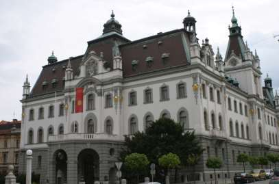

Расположен университет в самом центре Любляны. Специалисты-физики готовились на факультете естественных наук и технологии. С руководством факультета я договорился о том, что они — в Югославии, а я — в СССР будем ходатайствовать об обмене студенческими группами между БГУ и ЛУ по специализации «ядерная физика». О тогдашней скорости реализации взаимовыгодных задумок можно судить по двум датам: договорённость была достигнута в 1966-м, а первая (и последняя!) группа из восьми студентов кафедры ядерной физики с преподавателем кафедры доцентом Владимиром Николаевичем Линёвым и «досмотрщицей» от парткома БГУ Аллой Станиславовной Касперович выехала из Минска в Любляну в 1974-м.
Для меня оказалось абсолютно неожиданным отношение словенцев к Наполеону: к его памятнику постоянно приносились живые цветы. Оказывается, во время французского правления в 1810 году здесь был основан первый университет, который, однако, вскоре был закрыт. В сознании словенцев, с которыми мне пришлось работать, жила легенда о Наполеоне как о великом человеке, который очень высоко ценил словенцев. Наполеону приписываются слова, якобы сказанные им после завоевания здешних мест: «Иллирия (т.е. в моём понимании — именно эта часть Балкан — Словения) заслуживает своей государственности!»).
В Югославии, с моей точки зрения, было много хорошего, чего у нас просто не было или же считалось дурным тоном, а то и просто запрещалось. Мне, например, нравилось, что улицы и помещения были по сравнению с нашими как бы очищены, вымыты от лозунгов и плакатов с призывами выполнять, перевыполнять, строить коммунизм и помнить, что партия — наш рулевой. За месяц пребывания в стране я увидел только одно большое панно в зале городской ратуши с призывом, который не сразу смог перевести. Лозунг предназначался для участников происходивших там вечеров отдыха и гласил: «танцуя, не наступай партнёру на ногу!»
Нравилось и то, что обсуждение серьёзных вопросов на научных семинарах в университете велось в крайне непринужденной обстановке. На столах, как правило, были не только вода, кофе и чай, но и вино и даже виньяк. Правда я ни разу не видел, чтобы алкогольный напиток кто-то несимволически попробовал.
На первом пленарном заседании международной научной конференции не обошлось без курьёза. Несмотря на жару все выглядели достаточно серьёзно, как принято шутить — в манишках и при галстуках, многие — в наушниках для синхронного перевода. И вот, когда заседание уже началось, в зал входят два субъекта в потёртых шортах и мятых «бобочках», а один из них ещё и с волосами длиннющими. Мало того, садятся не на кресла, а на ступеньках в центральном проходе, хотя свободных мест в зале предостаточно.
Ну, думаю я, бродяги какие-то, сейчас их отсюда с треском турнут (как сделали бы, к примеру, у нас в университете). Ан нет, никто и внимания не обращает. А длинноволосый ещё и вопросы докладчику начал задавать, после чего председательствующий попросил его подойти к микрофону — мол, переводчики, находящиеся в стеклянных кабинах, не слышат...
Оказалось, что эти по моему советскому восприятию «бродяги» — известные канадские учёные Букмастер и Скоуэл. На принципах, описанных в их совместной статье, я вместе с сотрудниками лаборатории радиоспектроскопии Института физики АН БССР ещё в аспирантские годы построил первый в БССР прибор, с регистрацией сигналов парамагнитного резонанса методом малой модуляции.
До сих пор не знаю точно, разыграли меня мои люблянские коллеги как совка, или же по неведению завели туда, где мне не позволено было находить ся. Двое молодых физиков, один — сотрудник Института ядерных исследований «Джозеф Стефан», другой — профессор университета, пригласили меня в воскресенье на рыбную ловлю. Моё заявление о том, что я понятия не имею, как ловить рыбу вообще, а тем более спиннингом, ответили, что пора учиться. Вручили мне спиннинг с редкой в те времена безинерционной катушкой. Подучили забрасывать на пустыре — ровной, покрытой невысокой травой плоской площадке, и — в путь на маленьком «фиате» югославской сборки.
Ехали долго. Остановились в горах и пошли по берегу небольшой речушки против течения, забрасывая блесну в подходящих, по их мнению, местах. Я шёл последним и тоже пытался забрасывать в тех местах, где они это делали до меня. Умудрялся делать «бороду» из лески, за что они заподозрили меня в незаурядных способностях, так как до меня не встречались ещё ни с кем, кто умудрился бы сделать «бороду» на высококачественном фирменном спиннинге с безинерционной катушкой. Одну рыбку — маленькую форель — мои наставники всё-таки поймали. Потом мы подошли к подвесному мостику, перешли на другую сторону реки и продолжили наше дело: кто забрасывания, а кто распутывание.
Часа за полтора продвижения по противоположному берегу мои наставники рыбной ловли поймали ещё три форели и уже не совсем малень кие.
— Видишь, — говорит более удачливый — на итальянском берегу рыбка ловится лучше.
— Почему на итальянском?
— Граница с Италией здесь по речке проходит. Перейдя мост, мы вышли на итальянский берег. Но ты не бойся. Если нас обнаружит итальянский пограничник, а мы не отойдём от берега более, чем на 200 метров, то он только поставит в наших паспортах штемпели о том, что мы посетили итальянскую туристическую зону. И в твоём паспорте тоже поставит.
Такой штемпель, подумал я, будет прямым доказательством грубейшего нарушения полученных мною в ЦК КПСС инструкций при отправке из СССР. И хорошо, если я отделаюсь только тем, что меня не выпустят больше за границу; а можно и с работой распрощаться. Быстрее сматывать удочки! Точнее — леску на катушки спиннингов. И к мостику. Желание поймать рыбку и показать, что и я что-то умею, пропало. К счастью, к автомобилю мы вернулись без приключений.

# Ягеллонский

В старейший университет Восточной Европы — Ягеллонский в польском Кракове — я поехал весной 1974 года по программе Министерства высшего и среднего специального образования СССР «Обмен преподавателями и студентами ВУЗов Советского Союза и стран народной демократии». Я должен был прочесть там лекции по модному в то время курсу — ядерной электронике.
Специализацию «ядерная физика» обеспечивала в Ягеллонском университете кафедра профессора Казимежа Гротовского. Очень широкую известность имел тогда его родной брат — руководитель театра и режиссёр Ежи Гротовский. Ряд спектаклей он поставил по произведениям, не очень приветствуемым в социалистическом лагере в неадаптированном для этого лагеря виде. Среди них «Каин» Байрона, «Мистерия-Буфф» Маяковского, «Дзяды» Мицкевича, «Акрополь» Выспянского, «Трагическая история доктора Фауста» Марло и многое другое и в то непростое время триумфально путешествовал со своими спектаклями буквально по всему миру. Но если и было у меня чувство путешественнической зависти, то было оно не к брату-театралу, а к брату-физику. Физик Казимеж Гротовский, как и каждый профессор Польши, имел право раз в пять лет выехать на длительную стажировку для повышения квалификации, практически, в любой зарубежный научно-исследовательский институт или университет, подтверждающий согласие его принять . Для профессоров в СССР не было даже жалкого подобия такой возможности.
Я приехал в Краков, когда Гротовский только вернулся из исследовательского центра в Льеже и не уставал рассказывать о достопримечательностях третьего по величине города Бельгии — места поломничества христиан и любителей старинной архитектуры.
Будучи насквозь советским, я в соответствии с инструктажем, полученным перед поездкой в Москве в здании ЦК КПСС, обязан был не восторгаться тем, о чём рассказывал наверняка заражённый буржуазно-капиталистическим вирусом профессор. Не моё это дело, что где-то есть множество интересных соборов и церквей, что самая знаменитая церковь Льежа Сен-Бертелеми XI-XII веков отличается от остальных европейских храмов того времени западным фасадом и двумя башнями, что церковь Сен-Мартина XV века — образец редкого готического стиля, а церковь Святого Якоба XI века — самая изящная в Льеже из-за своих каменных кружев.
Я должен был постоянно помнить о том, что приехал читать лекции, в которых обязан не забывать упоминать о преимуществах социализма, и повышать свою квалификацию в области физики и педагогики высшей школы.
Очень сильное впечатление произвели на меня привезённые Гротовским из Льежа рекламные проспекты электронной аппаратуры для научных исследований. То, что давалось нам титаническими усилиями по выбиванию фондов, «добыче» дефицитных деталей, кропотливому монтажу в примитивных условиях университетских и иных вузовских мастерских, там можно было просто приобрести и использовать в исследовательской работе. Ошеломляли, правда, цены. Но когда Казимеж Гротовский по большому секрету рассказывал о заработной плате тамошних работников и бюджете лабораторий, стоимость приборов переставала быть заоблачной.
Вместе с тем, мне было приятно сознавать, что учебные и исследовательские лаборатории «моей» родной кафедры в Минске оборудованы весьма прилично. Не глядя на множество не лучшим образом смотрящихся «самоделок», наши приборы позволяли сделать процесс исследований и обучения соответствующим новейшим достижениям науки, содержательным и эффективным. Поэтому недосягаемость для меня городов типа Льежа вместе с его достопримечательностями тысячелетней давности не была обидной, и я находил причины гордиться тем, что параметры отдельных наших «самотужных» устройств были на уровне и даже превосходили параметры фирменных изделий известнейших фирм.

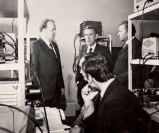

Более всего я сблизился в Кракове с профессором Адамом Стшалковским — директором Института ядерных исследований в Броновицах, тех самых примыкающих сейчас к Кракову малопольских Броновицах, в которых разворачивается действие драмы Станислава Выспянского «Свадьба». Её автор, прожив всего 38 лет, умер в 1907 году, но вряд ли можно найти в Польше человека, который не знает его как художника, драматурга, искателя способа вырвать Польшу из застоя. А Броновицы по-прежнему более известны тем, что о них писал Выспянский, чем тем, что там находится ядерный исследовательский центр.
Об этом с юмором говорил мне профессор Стшалковский, ставший позднее — проректором Ягеллонского университета по научной работе (и по промоциям, т.е. по продвижению чего-то или кого-то). Он приезжал ко мне на кафедру в Минск, как сказал, чтобы убедиться, что и на советских комплектующих и интегральных схемах можно создавать превосходную исследовательскую аппаратуру.
А у профессора Гротовского я перенял и, не оглашая, постоянно использовал метод приёма экзаменов. Не оглашал потому, что такая «профессорская самодеятельность» запрещалась чиновниками, приписанными к советским вузам и, как мне кажется, запрещена сейчас писаными правилами приёма и выставления оценок, хотя, на мой взгляд, этот запрет — порождение тех советских времён, когда чиновник, а тем более, партийный функционер были убеждены в своей всесторонней компетентности и наделены правами указывать профессорам и доцентам, как проверять знания студентов.
Суть метода такова. На последнюю консультацию для студентов перед экзаменационной сессией вы приглашаете не только тех, у кого есть вопросы по прочитанному вами курсу, но и всех желающих попробовать досрочно сдать экзамен на отлично. Консультация идёт как обычно, но если задаётся серьёзный вопрос, вы спрашиваете, кто из присутствующих студентов может дать на него полный ответ. Ответившему вы адресуете далее новый интересный вопрос. Два-три содержательных ответа позволяют вам заявить.
— Приходите в день экзамена с зачёткой, я не буду вас спрашивать, а просто поставлю «отлично».
Студенты, как известно, всегда готовы на хитрости. За это их грешно наказывать, но уместно показать, что они вас не одурачили, а просто развеселили. Чертовски приятно услышать через 20—25 лет после выпуска от бывшего студента такие слова.
— Зная ваш метод приёма на «отлично», мы заранее подготовили несколько вопросов и, естественно, полных хороших ответов на них. Вы же мне сказали.
— Вы тянете только на четвёрку, на крепкую четвёрку, но за хорошо продуманную режиссуру поставленного спектакля я добавляю вам один бал. Приходите с зачёткой в день экзамена.
— Так вот этот ваш бал я запомнил на всю жизнь, и, поверьте мне, оправдал его с лихвой своей работой.

—-

Но вернёмся к Ягеллонскому университету.
Готовясь к отъезду в Минске, я пожалел, что ещё не вышел из печати том Большой Советской Энциклопедии со словами на букву «Я», где мож но было бы найти информацию о Ягеллонском университете. Но моё совковское чутьё подсказывало: не могут цензоры допустить заглавный термин «Ягеллонский», связанный с чуждой советскому человеку королевской династией, если его можно чем-то заменить.
И не ошибся.
В 13 томе БСЭ нашел статью «Краковский университет», начинающуюся словами 
>Ягеллонский университет, старейший университет в Польше, один из первых государственных университетов в Центральной Европе. Основан в 1364 Казимиром Великим, в 1400 реорганизован Владиславом Ягайло (отсюда и название) по образцу Парижского университета. Расцвет учебной и научной жизни университета приходится на конец 15 и начало 16 веков. Университет имел факультеты теологический, юридический, медицинский и свободных наук. Он был единственной высшей школой в Польше.
Далее в энциклопедической справке: в середине 16 века обучение в университете приобрело церковно-схоластический характер, во время фашистской оккупации (1939—1944) он был закрыт, а многие профессора арестованы, в 1942 университет организовал обучение в подполье, после освобождения Кракова возобновил свою работу. В 1971—72 учебном году в состав университета входили факультеты: юридический, философии и истории, филологический, математики и химии, биологии и географии. Библиотека университета основана в 1364 году и насчитывает свыше 1 млн. томов.
Все иные доступные мне советские источники не содержали сколь-нибудь интересной дополнительной информации о Ягеллонском университете, и я познавал и университет и Краков на месте, как говорят, на ощупь. Многое раскрылось в читальных залах библиотеки, иное из приобретённых в самом Кракове книг.
На всю жизнь запомнил воскресенье 13 июня 1974 года, когда я решил пройтись по улицам города. Две недели нахождения в нём сильно раззадорили моё любопытство. За оставшиеся 17 дней хотелось более-менее прилично познакомиться хотя бы с тем, что принято называть вершиной айсберга: с достопримечательностями, внесёнными в туристические рекламные проспекты.
Выйдя на улицу, понял: планы придётся менять.
Море людей медленно двигалось по неизвестной мне тогда причине к неизвестной мне тогда цели. Шествие было хорошо организовано. С обеих сторон некоторых частей колонны шириной в проезжую часть улицы на расстоянии 7—8 метров друг от друга шли монахи (возможно, священнослужители) в сутанах, держа в руках толстую верёвку. Они как бы формировали колонну. Иные люди в сутанах несли громкоговорители, усилители, микрофоны, поддерживали соединяющие их провода.
Спрашивать, что происходит, было неудобно. Все, кроме меня, это знали, и не хотелось выглядеть, «сибирским валенком».
Я, наконец, понял, что это «фэст» или крестный ход верующих и примкнувших к ним любознательных. Шествие последователь но продвигалось к временным алтарям, возведённым специально для этого праздника. Возле каждого алтаря, которых оказалось четыре, движение прекращалось и все слушали фрагмент Евангелие, а затем выступление (проповедь) митрополита Кароля Войтылы. Лично для меня все его проповеди были захватывающе интересными, злободневными, однозначно доказывающими, что оратор — человек неординарный, авторитетный, всеми уважаемый, что все рады его слушать и слушаться.
Содержание одной из проповедей, произнесённой с алтаря с видом на Коллегиум Новум — главное здание Ягеллонского университета, я не забыл до сих пор. Говорить такое по моим в то время советским понятиям, казалось крайне опасным, рискованным преж де всего для самого выступающего. Государственные и партийные власти обвинялись им в невежественном отношении к университету, к образованию и воспитанию, в лицемерии, лживости и аморальности, в преднамеренном извращении предназначения Ягеллонского университета, акт о учреждении которого издал 12 мая 1364 года король Казимеж Великий, получив на это разрешение папы римского Урбана V. Стараниями королевы Ядвиги университет в 1397 году получил от папы римского Бонифация XIX право открыть теологический факультет. Но невежественные власти не хотят об этом знать, и теологического факультета в Ягеллонском университете сегодня нет.
Через четыре года — в 1978 — митрополит Кракова Кароль Войтыла стал Папой Римским Иоанном Павлом II. Всей своей деятельностью в Ватикане и до него Иоанн Павел II подтвердил свой статус величайшего гуманиста на стыке тысячелетий. Соизмерить с ним кого-либо просто невозможно.
Я же очень горжусь тем, что в декабре 1993 года мне было вручено личное послание Иоанна Павла II, в котором Его Святейшество благодарил Верховный Совет и Правительство Беларуси за возрождение в нашей стране свободы вероисповедания. Более всего в послании мне понравились слова о том, что католическая церковь сделает всё возможное, чтобы католики Беларуси обращались к Богу на родном белорусском языке и чтобы все священнослужители костёлов тоже говорили на родном языке белорусского народа.

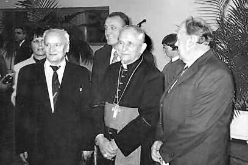

Нельзя в этой связи не сказать добрых слов и о человеке, который привёз мне это послание из Ватикана, о человеке из легенды митрополите Казимире Свёнтеке, которому в 1994 году Иоанн Павел ІІ присвоил самый высокий титул в католической церкви — звание кардинала. С 1991 года он был первым митрополитом новообразованной Минско—Могилёвской митрополии и Апостольским Администратором Пинской епархии.
Когда ему было 3 года, его семью сослали в Сибирь. В период преследований верующих Казимир Свёнтек был арестован, осуждён на смерть и брошен в камеру смерти. Война помешала исполнить приговор, однако, в 1944 году — новый арест и 10 лет каторжных работ в Сибири, за Полярным кругом, у Воркуты. Выйдя на свободу в 1954 году, он оказался в Пинске и отдавал все силы возрождению духовности, восстановлению и реставрации храмов, укреплению позиции Католической Церкви Беларуси до дня своей кончины — 21 июля 2011 года.

—-

Мой второй визит в Ягеллонский университет в 1987 году совсем не был похож на первый в 1974. Чтобы попасть в Краков мне не пришлось заполнять уйму бумаг и проходить инструктаж в ЦК КПСС. Министерство высшего и среднего специального образования СССР обязано было включиться в процесс политических и экономических перемен, инициированных Горбачёвым и названных перестройкой. Было рекомендовано расширять межвузовские связи, и Ягеллонский университет был определён в качестве партнёра Белорусского государственного университета. В университет-партнёр по-старому направлялась почти партийные делегации для подписания договора о сотрудничестве. Обычно — в составе трёх человек: представитель парткома, комитета комсомола и администрации. Мой ректор — профессор Леонид Иванович Киселевский почему-то не захотел возглавить делегацию в Краков и сформировал её из двух человек — секретаря парткома БГУ профессора Николая Иосифовича Юрчука и меня.
Мы прибыли в Краков, когда в СССР заканчивался начальный период перестройки. Он характеризовался признанием отдельных недостатков существовавшей политико-экономической системы СССР и попытками исправить их несколькими крупными кампаниями административного характера. Антиалкогольная кампания, ускорение, борьба с нетрудовыми доходами, госприёмка… Каких только названий не придумывали партийные руководители высшего уровня, но всё оставалось по-старому. Однако это было затишье перед бурей, которая началась со слова гласность, впервые прозвучавшего как раз перед нашим приездом в Краков.
Поляки же, не увлекаясь провозглашением перестроечных лозунгов, продвинулись в плане реального реформирования во всех сферах жизни общества дальше нас. Привезенный нами проект договора о сотрудничестве не устраивал руководство ЯУ. Они категорически воспротивились словам, которые для нас в то время оставались обязательными в документах такого рода: «выполняя решения такого-то съезда КПСС и такого-то пленума ПОРП (Польской объединённой рабочей партии)» и т. п. В Польше 1987 года, а тем более, в интеллектуальных её кругах уже не было ни раболепского почитания коммунистических партий и их идеологий, ни осуждения частной собственности. В такое состояние мы пришли значительно позже. Польская сторона решительно потребовала очистить текст договора о сотрудничестве в области науки и совершенствовании академического процесса от идеологии и партийности.
Пришлось лишь радоваться, что «парткомыч» Николай Юрчук, совсем не парткомыч, а настоящий профессор математики и что его никто не воспринимал в ЯУ как партийного руководителя, поэтому процесс «очищения» прошёл безболезненно. В итоге договор был подписан, а мы с Николаем Иосифовичем кое в чём разобрались и кое-чему научились и, как говорят сейчас, вернулись в БГУ более продвинутыми. Это коснулось и сведений о самом Ягеллонском университете, которые уже тогда не подвергались классовой цензуре. Перестало умалчиваться, что кроме Николая Коперника и Франциска Скорины ЯУ окончили король Ян III Собесский, Кароль Войтыла (Иоанн Павел II), писатель-фантаст Станислав Лем, кинорежиссёр Кшиштоф Занусси, Лауреат Нобелевской премии поэтесса Вислава Шимборска и ставший позднее моим добрым знакомым британский историк Норман Дэвис.

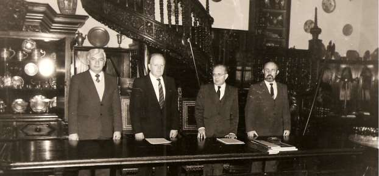

Сегодня трудно подсчитать, сколько раз мне довелось бывать в Ягеллонском университете на конференциях, симпозиумах и с лекциями. Но третье посещение, состоявшееся в 1993 году, запомнилось хорошо и надолго. Оно было частью программы моего официального визита в Польшу как Председателя Верховного Совета Республики Беларусь. Моё выступление перед преподавателями и студентами ЯУ происходило в главном здании университета — всё том же Коллегиум Новум.

—-

Обычно тексты для выступлений главы государства во время официального визита готовятся министерством иностранных дел и согласовываются с Комиссией по иностранным делам парламента. В самом преддверии визита все они вместе с окончатель но доработанной программой пребывания предоставляются выступающему для окончательной правки. Однако, к счастью, к тому времени наше министерство до такого уровня действий ещё не доросло и предоставило по моей просьбе лишь справку о истории, развитии и состоянии наших двухсторонних отношений с Польшей.
«К счастью» потому, что я терпеть не могу ни лекций, ни выступлений, читаемых по бумажке, хотя не единожды рекомендовал молодым преподавателям кафедры написать полный конспект читаемой студентам лекции, добавляя при этом: войдя в аудиторию, положите его перед собой на кафедру и убедитесь, что у вас нет необходимости в него заглядывать; он вам не нужен. Такой подход позволит вам понять, сколько материала можно довести до студента, чтобы он смог осознавать смысл и вести конспект. Если же вы осознали, что способен «переварить» студент и хорошо владеете доводимым до его сознании материалом, то для прочтения лекции достаточно одного листа формата А4 с планом лекции, ключевыми словами и формулами.
Сегодня на лекции многое помогает сделать компьютер и сопряжённый с ним проектор, но ни в коем случае он не должен заменять голову, то есть служить источником информации и запоминающим устройством для самого лектора!

—-

Итак, выхожу на трибуну самого большого зала Ягеллонского
университета в Коллегиум Новум. В первых рядах много лиц, легко узнаваемых, хотя со времени моей работы в ЯУ прошло 18 лет! Ну как тут строго соответствовать протоколу и придерживаться подготовленного текста выступления? Веду себя так, как советовал молодым начинающим лекторам. А ведь правильный давал совет! Совершенно спокоен, потому что передо мной аккуратно отпечатанный полный текст выступления на польском языке, проверенный и уточнённый хорошим знатоком польского языка. Начну сбоить, открою очередной лист и дочитаю. Но в этом нет необходимости. Отношение зала к ставшей на путь независимости Беларуси доброжелательное, а я — её официальный представитель!
После общепринятого благодарю за внимание — вопросы, море вопросов. Больше всего — о Беловежском соглашении, о Вискулях, о том, как решились на такой шаг — заявить всему миру, что нет больше монстра, грозящего всему миру ядерными ракетами, изгоняющего целые народы со своих земель и истязающего невинных людей в гулагах. Как хватило смелости взять на себя ответственность за мирный переход от принудительного объединения — СССР к добровольному Содружеству Независимых Государств. В кратких ремарках — напоминание о том, что Беловежская пуща — наше общее национальное достояние.
Финал давал все основания написать о выступлении и встрече так, как это делалось в напоминающих подобную ситуацию случаях в советских газетах в советское время: *бурные аплодисменты, переходящие в овацию, раздаются возгласы «Niech żyje Białoruś!», «Жыве Беларусь!»*.
Однако в Минске наряду с высокой оценкой визита в целом и выступления в Ягеллонском университете в частности не обошлось и без особого мнения. При первой же встрече с Зеноном Позняком, я услышал менторский поучительный голос.
— Вы совершили очередную грубую политическую ошибку, выступив в ЯУ на польском языке. Нельзя так угождать западному соседу, с которым у нас не простая предыстория.
Я ничего не ответил, но, честно говоря. удивился. Ведь и Зенон Станиславович был в делегации, посетившей Польшу вместе со мной. В делегации был и сам Василь Быков. Он тоже никаких замечаний не сделал.
По нашей просьбе польская сторона отыскала на краковском кладбище могилу белорусского поэта Алеся Гаруна. Мы посетили кладбище, убедились, что уход за его могилой такой же уважительный, как и за всеми захоронениями. Возложили цветы.
Что же произошло после?
Ларчик открывался просто. Пришлось ещё раз убедиться, что крайне правые и крайние левые с большим энтузиазмом объединяются, когда считают своим общим врагом (соперником, конкурентом) кого-то лично или какой-нибудь политический институт (структуру, партию). В данном конкретном случае слились в экстазе Председатель Белорусского Народного Фронта Зенон Позняк и тогдашний министр иностранных дел Пётр Кравченко, имевший богатый опыт служения делу КПСС как секретарь Минского горкома партии по идеологии и как помощник секретаря ЦК КПБ. Именно он, вернувшись из Польши, убеждал членов фракции БНФ в Верховном Совете в том, что я предал интересы всех настоящих белорусов, «забыв о том, что государственный язык у нас — белорусский».
Кроме удовлетворения своей личной ко мне неприязни Кравченко демонстрировал такими действиями свою преданность премьер-министру Вячеславу Кебичу, показывал настолько он искусен, что безо всяких оснований может сотворить «компромат» на меня и настроить против меня БНФ. Сам же Кебич постоянно выдавал себя за моего большого друга, никогда не позволял себе делать даже малые замечания в мой адрес. Работая на перспективу, на то, чтобы с помощью старой номенклатуры получить президентское кресло Кебич нуждался в помощи именно такого человека — внешне интеллигентного, образованного, активного и вместе с тем не обременённого понятиями морали, чести, правдивости.
Не обвиняйте меня в плагиате за то, что назвал Петра Кузьмича Кравченко человеком без совести и чести, хотя действительно значительно раньше меня это сделал в своей книге «Искушение властью» сам первый премьер -министр независимой Беларуси Вячеслав Кебич, потому что и его Кравченко в конце концов «допёк». Я же такое мнение имею о нём очень давно.

# Польша, негосударственное образование
Когда из-за мстительности нашего президента и очередного грубейшего нарушения им конституции я лишился, назначенной мне законом пенсии, как нельзя кстати, оказалось предложение основателя частных Высших школ бизнеса Кшиштофа Павловского прочесть в этих школах лекции. Как всегда спросил — на какую тему, Павловский ответил.
— Определить темы и количество лекций должны вы сами. Учебные планы школ в Новом Сонче и Тарнове составлены по принципу обучения в чикагском National-Louis University. В этих планах предусмотрены лекции известных политиков. Как правило, они сами предлагают и темы и количество лекций.
Тем лучше, подумал я, готовиться, практически, не надо. Расскажу о том, что хорошо знаю. Но вскоре осознал, что всё не так просто, ведь нужно обосновать и Павловскому и студентам и быть самому уверенным в том, что доводимое до слушателей имеет принципиальное значение для сегодняшних политических реалий. И это в условиях полной свободы масс-медиа и доступа в интернет. В итоге подготовка к лекциям оказалась более трудоёмкой, сложной и волнительной, чем в случае конкретно предложенной тематики.
Во время нахождения в Новом Сонче у меня была возможность разобраться в том, что сделал Кшиштоф Павловский в Польше и сравнить с подобными действиями сторонников организации негосударственных вузов в Беларуси. Сам Павловский — выпускник Ягеллонского университета, физик — кандидат наук Горно-металлургической академии в Кракове, действовал как подобает бизнесмену. Изучил спрос, понял, что стремиться получить диплом только что вылупившегося из яйца нового вуза вряд ли кто захочет. Начал с малого, стал готовить секретарей бизнесменов. Срок обучения — три года. Договорился с National-Louis University в США, что будет руководствовать ся их программами плюс небольшая добавка местной специфики.
Первый год обучения — освоение английского языка, со второго курса — английский становится основным языком обучения. Для некоторых занятий и на выпускные экзамены пригласил специалистов из того же National-Louis University, чтобы они убедились, что студенты программу их американского университета для секретарей бизнесменов освоили. В итоге официально заключённых с американским университетом соглашений колледж Павловского в Новом Сонче и Тарнове выдавал диплом американского университета. В созданные Павловским учебные заведения потянулись не только граждане Польши, но и зарубежные студенты, в частности, молодые люди из США, которые за значительно меньшую плату, чем в Америке смогли получить американское образование, а дети граждан США польского происхождения могли не только освоить программу National-Louis University, но и польский язык усовершенствовать. Немаловажную роль сыграл и тот фактор, что проживание в Новом Сонче или Тарнове обходится значительно дешевле, чем не только в США, но и в Варшаве, Вроцлаве, Кракове и других больших городах.
В качестве учебного корпуса Павловский исполь зовал выкупленное за сравнительно небольшие деньги административное здание бывшего завода железобетонных изделий, обанкротившегося в результате внедрения новых технологий в строительстве. Оно было разумно модернизировано. Меня же поразила буквально стерильная чистота холлов и коридоров на всех шести этажах.
— Как вам это удаётся, — спросил я у ректора Павловского.
— Это мой маленький секрет, но вам я его открою. Семейный подряд. Все коридоры и холлы на всех этажах убирает одна женщина, когда она отлучается — её дочка. У них одна единственная, но весьма современная уборочная машина для влажной уборки, практически бесшумная. Убирают во время лекции, отдыхают в перерыве между лекциями. Два этажа за лекцию, и так весь день. Поэтому чисто.
И как здесь не посмеяться над модным в советское время «чисто не там, где убирают, а там, где не сорят».
Может ли быть такое частное учебное заведение в Беларуси?
При сегодняшних кругозоре, образованности и менталитете наших чиновников и законодателей — ни в коем случае. Они захотят контролировать, проверять, навязать идеологические курсы, ввести должность проректора по идеологической работе, обязать получить лицензию на право выдачи диплома. Всё это при должном законе об образовании и строгом его выполнении — суета.
Государство не может быть гарантом качественного образования в конкретном учебном заведении. Разумному правителю такое и в голову не придёт. Президент США не гарантирует качества образования в Гарварде, Йельском, Колумбийском или Калифорнийском университете, об этом заботятся сами университеты. Президент США, Франции или Польши не вручает диплом доктора наук, хотя все эти президенты были прекрасно успевающими студентами. Наш же, являвший собой далеко не подходящий для подражания пример ученика и студента, вручает. Смешно. Но для сатрапов у трона — высшая степень восторга: сам президент счёл возможным… 

# Польша, столица
В 1997 году ректор Варшавского университета профессор Владимеж Сивиньский прислал мне письмо-приглашение прочесть лекцию о Содружестве Независимых Государств. Она состоялась в самой на то время большой аудитории университета — Рыцарском зале. Студентов на лекции, по моему мнению, почти не было. Зал был полностью заполнен людьми старшего возраста. Обстановка в зале была крайне доброжелательной, вопросы задавались в изысканно вежливой форме. Естественно, что мне всё это очень понравилось, и впоследствии я стремился не отказываться ни от одного приглашения в Варшавский университет, хотя из-за моего подвижного образа жизни это не совсем просто было делать. Случались накладки.

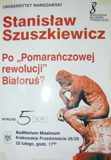

Начиная с 1998 года, я регулярно читал лекции в летних международных молодёжных школах, организуемых при ВУ человеком, хорошо известным всему университету и далеко за его пределами — Яном Малицким. Он же возглавляет в Польше программу Калиновского — финансируемое польским правительством обучение студентов из Беларуси.
История Варшавского университета — пример безжалостного подавления польского патриотизма царским самодержавием. Университет был основан в 1816 году и открыт 20 сентября 1817 года при Александре I. Польское восстание 1830 года привело к его закрытию. Как университет он открылся снова только при Александре II в 1869 году, причём его устав был типичным уставом российских университетов, из которого были полностью устранены элементы самоуправления. Русский язык довлел в университете, всё делопроизводство до 1917 года велось только на русском языке.

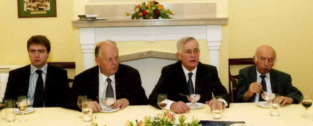

Срок полномочий ректора университета — 3 года, он может быть переизбран на второй срок только один раз. В январе 2005 года я получил приглашение от нового ректора выступить на «ректорском семинаре» в новом самом большом зале ВУ, не получившем к тому времени своего названия.
Большинство слушателей — студенты. Вёл собрание, иначе мероприятие не назовёшь, ректор — генетик с мировой известностью — профессор Петр Венгленьский. Я опять был обрадован вниманием зала и тёплым приёмом. После этого ректорского семинара, спонсируемого клубом бизнесменов Варшавы, я неоднократно читал лекции на открытии и завершении работы летних молодёжных школ. У меня даже сложится «тандем» с президентом Литвы Валдасом Адамкусом — он читал вступительную инаугурационную лекцию на английском языке, я — финальную на польском. Таковы рабочие языки современных молодёжных школ в Варшавском университете.

# О католическом университете и «моём памятнике»
Абревиатура KUL звучит по-польски «куль» и известна каждому гражданину Польши. Таковы первые буквы названия Католического университета имени Иоанна Павла II в Люблине — Katolicki Uniwersytet Lubelski Jana Pawła II. Однако мало кто знает, что к появлению и становлению KUL имеет отношение Санкт-Петербург и российские революции.
Во время моей работы в Ягеллонском университете в Кракове в 1974 году я жил в аспирантском общежитии «OLIMP» в одной из двух комнат так называемого бокса. На две отдельные комнаты была одна «лазенка» с умывальником, ванной и душем. Во второй комнате бокса жил стажёр из KUL юрист Адам Гонсяровски. В маленькой общей входной комнатке, которую и у нас и в Польше принято называть предбанником, мы несколько раз столкнулись рано утром и поздно вечером, так как в одно время уходили и приходили из университета. В результате познакомились и стали заходить один к другому на чай, а то и на глоток вина. Адам был одним из тех редких индивидуумов, к которым почему-то абсолютно безосновательно проникаешься доверием. Мы часто довольно откровенно обменивались мнениями.
Однажды разговор зашёл о священнослужителях, и я «поплакался», что чувствую за собой большую вину за не лучшим образом выполненную предсмертную просьбу моего деда — Петра Иосифович Шушкевича. Адам попросил рассказать подробнее.
Дед в конце 1951 года передал через мою двоюродную сестру Валю, что очень хочет меня видеть, и я приехал к нему в деревню. Он велел мне его не перебивать и дать выговориться.
— Сыновья мои Бронись и Франэк погибли на фронте, твой отец Стах гниёт в Сибири, твой дядя Вацэк — в Карелию строить завербовался, Янэк — мой младший — хоть и работящий, но только армию отслужил в глуши какой-то, поэтому мыслит по здешнему, по-деревенски. Другое дело ты с Валей. А просьба у меня серьёзная. Хочу, чтоб похоронили меня на нашем деревенском кладбище, по православному обряду и обязательно со священником.
Я попытался было что-то вставить. Мол, о чём ты дед, тебе жить да жить. Но он не позволил и продолжал.
— Так вот, обязательно со священником. Я — православный и хочу быть похоронен как православный. И не спорь, не говори, что мне помирать ещё рано.
Воинствующий агрессивный атеизм того времени, навязываемый коммунистической партией, вынуждал верующих скрывать свои убеждения, чтобы не потерять работу или же вообще не быть причисленными к врагам народа. Найти священника было не просто.
Через три месяца — в феврале 1952 года дед умер, а наша с сестрой предварительно проделанная подготовительная работа дала результат: попа в трескучий мороз привезли. Привезли на лошади из деревни Слобода, что километрах в 50 от дедовой деревни Щитомиричи. И хотя абсолютно недопустимо так говорить и думать в день похорон, но сестра Валя и я были счастливы: дедово завещание было выполнено!
Однако радовались мы рано, ибо, как говорится, всё решает последний дюйм.
Похороны со священником в 1952 году были событием невиданным. Если бы комитет комсомола, партком или деканат моего университета знали, что я причастен к их организации, то я бы пулей вылетел из числа студентов, а сестра Валя — с «непыльной» работы. С такими «несознательными» тогда только так и поступали. Но концовка была омрачена иным.
Найденный за тридевять земель священник всем понравился и вёл себя безукоризненно. Отказался войти в дом, пока не будет изготовлен и поставлен у гроба крест, махал кадилом, громогласно и очень долго молился в доме и в трескучий мороз на кладбище. Однако... на поминках после похорон напился так, что его нельзя было рассматривать иначе, чем предмет неодушевлённый. Как сноп соломы бросили мы его в розвальни, укутали в овчину и сосед повёз его назад в Слободу. Я же воспринял случившееся, как оскорбление памяти моего искренне православного, истинно верующего деда.
По большому счёту я, наверное, не прав. С каждым может случиться непредвиденное. И что греха таить, многим, очень многим я прощал и худшие прегрешения. Но память деда стучит в моём сердце, обидно, по сей день обидно.
Слушая меня, Адам не проронил ни слова, потом заметил.
— Во время моей учёбы в KUL теперешний митрополит Кракова Кароль Войтыла был там профессором этики и нравственного богословия. Не думаю, что кто-нибудь из его учеников, да и вообще из католических священнослужителей, монахов, монахинь, служителей костёла может проявить нравственную нечистоплотность . Мы сохраняем моральность и духовность только благодаря костёлу. Хватит того, что у нас, да и у вас, власть далека от моральности и духовности.
Я хотел было в соответствии с полученными в ЦК КПСС инструкциями попросить не обобщать, но подумал, что застукать нас некому: мы только вдвоём. Адам продолжил.
— Если вы увидите где-нибудь в Польше нетрезвого ксендза, неаккуратную монахиню, служителя костёла или монаха или же услышите от них грубое слово, то считайте, что католицизм закончил своё существование на польской земле, что мы — католики — не заслуживаем достойной жизни, что нормальной Польши никогда не будет...
С той поры, вот уже почти сорок лет, я пялю глаза на служителей католического костёла Польши, а последние 20 -25 лет и на католических ксендзов Беларуси и проникаюсь убеждением, что Адам был прав. Они — поляки — пришли, а мы — граждане Беларуси, идём и обязательно придём к нормальной жизни.
А пятна есть и на Солнце.
Адам был интересным рассказчиком, очень любил свой KUL, сравнивал его с другим университетом Люблина, носящим имя выдающейся польки Марии Склодовской-Кюри.
От него я узнал, а впоследствии уточнил, что KUL был и остаётся университетом негосударственным и нерелигиозным, дающим образование в области теологии, канонического права и управления, а также в области гуманитарных, общественных, естественных наук, математики, права и экономики.
Основан KUL в 1918 году после закрытия в Санкт-Петербурге католической семинарии. В оргкомитет по созданию университета входили видные польские интеллектуалы. Они считали своим долгом обеспечить формирование новой католической интеллигенции для возродившей свою независимость Польши путём глубокого изучения как религиозных, так и научных дисциплин в духе гармонии науки и веры. Конференция архиепископов Польши, возглавляемая в то время нунцием Акилле Рати, ставшим позднее папой Пием XI, 27 июля 1918 года одобрила план оргкомитета по созданию университета в Люблине, а в июне 1922 года университет переехал в здание бывшего доминиканского монастыря.
Во время фашистской оккупации Польши университет был закрыт и вновь открылся 21 августа 1944 года после освобождения города Красной армией.
Другой люблинский вуз — государственный Университет имени Марии-Кюри Склодовской (Uniwersytet Marii Curie-Skłodowskiej) был основан коммунистическими властями Польши в 1944 году как конкурент KUL, финансировался государством и должен был превзойти KUL во всех отношениях, затмить его. Тем не менее, граждане Польши проявили достойную солидарность и не дали унизить ни KUL ни бросить тень на новый университет, которому было присвоено имя одной из самых выдающихся полек — дважды лауреата Нобелевской премии Марии-Кюри Склодовской. Один день в неделю все костёлы коммунистической Польши собирали пожертвования на функционирование KUL, и он выжил. Сегодня оба университета плодотворно сотрудничают.
В 2003 году меня пригласил в Люблин на политологическую конференцию легендарный профессор KUL Ежи Клочовски — герой антигитлеровского Варшавского восстания, многократно проявивший незаурядное личное мужество и потерявший в бою с фашистами руку. Он председательствовал тогда на пленарном заседании конференции по политическим проблемам Восточной Европы и читал лекции в Летней политической школе Варшавского университета. Я также был и участником конференции и лектором.
Клочовский предложил продолжить разговор на конференции в KUL, после чего я зачастил в Люблин.
В конце мая 2009 года ректор KUL профессор Станислав Вильк направил мне письмо, в котором сообщил, что Католический Университет имени Иоанна Павла II начал процедуру по присвоению мне звания почётного доктора KUL за активную деятельность по сближению между народами и что торжества по вручению диплома почётного доктора состоятся 1 июля в главном корпусе университета в рамках празднования 440-летия подписания Люблинской унии.
Я же находился в это время в Польше в Кошалине и о письме ничего не знал. В Кошалин переместилась тогда организованная Евросоюзом выставка «Термоядерный синтез». Меня пригласили прочесть на ней инаугурационную лекцию. И вот 4-го июня 2009 года, войдя в самую большую поточную аудиторию Кошалинского политехнического института, чтобы начать лекцию, я увидел на огромном компьютерном экране поздравление с присвоением мне звания доктора Honoris Causa Католического университета имени Иоанна Павла II в Люблине. Оказывается об этом сообщил уже не только интернет-сайт KUL, но и СМИ Польши.
Шесть человек были удостоены почётного звания доктора HONORIS CAUSA Католического университета в Люблине в день 440-летия подписания Люблинской Унии:
Президент Литвы Валдас Адамкус,
Президент Эстонии Тоомас Гендрик Илвес,
Президент Украины Виктор Ющенко,
Президент Польши Лех Качиньски,
Президент Латвии Валдис Затлерс и
Первый глава независимой Беларуси Станислав Шушкевич.
Из них на торжества вручения дипломов, мантий и юбилейных
медалей в Люблин прибыли только четверо — Адамкус, Ющенко, Качиньский и я. Награждённые, которые не смогли прибыть, направили на торжества своих полномочных представителей. По приглашению президента Качиньского наша четвёрка и уполномоченные представители Залтерса и Илверса прилетели из Варшавы на военную авиабазу недалеко от Люблина тем самым злополучным самолётом ТУ-154, который потом 10 апреля 2010 года разбился под Смоленском, унеся жизни около ста человек. Тяжко и больно об этом вспоминать и в Польше, и в России, и в Беларуси. Район чудовищного злодеяния, осуществлённого энкаведистами по приказу Сталина в Катыни дополнился невиннымии жертвами тех, кто летел почтить их память . Треклятое место с одинаковой безжалостностью, не разбираясь кто есть кто, отобрало жизни людей простых и людей широко известных — замечательных представителей польской политической, военной, деловой и религиозной элиты. Беларусь потеряла в этой катастрофе своих влиятельных друзей — президента Леха Качиньского, его жену Марию, президента II Речи Посполитой на эмиграции Ришарда Качаровского, передавшего символ президентской власти II Речи Посполитой демократически избранному Президенту III Речи Посполитой Леху Валэнсе. Более десяти человек, погибших в катастрофе, я хорошо знал лично. Память о них — навсегда в моём сердце.

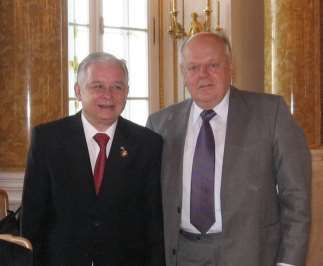

Возвращаясь к процедуре награждения дипломами о присвоении почётных званий в KUL, замечу, что проводилась она в строгом соответствии с древними европейскими университетскими традициями дополненными элементами современности, например, синхронного перевода. Перед началом торжественного заседания все награждаемые надели подаренные им докторские мантии докторские мантии и шапочки.
Последователь ность награждений происходила в порядке латинского алфавита от Адамкуса до Залтерса. Решение Сената университета о награждении и диплом зачитывал на латыни ректор профессор Станислав Виль к. Деятель ность каждого из награждённых освещал в своём выступлении лаудатор (от латинского laudätor — хвалитель, панегирист). Я очень горжусь, что в моём случае это был упомяный выше легендарный профессор Ежи Клочовски — герой Варшавского восстания, директор Института Восточной и Центральной Европы. Каждому награждённому были вручены диплом факсимильная копия Люблинской унии в натуральную величину, застеклённая в основательном деревянном обрамлении и памятные сувениры Люблина и KUL.
Не обошлось и без инцидентов. Во время пешего перехода участников торжеств к центральной площади Люблина среди тысяч приветствовавших шествие граждан была организованная группа человек из 50-60 с лозунгами и плакатами, призывающими президента Украины Ющенко наказать украинцев, виновных в бесчинствах на польской земле во время Второй мировой войны.
Я шёл рядом с Виктором Андреевичем и видел, как он переживает происходящее. Он совсем перестал быть похожим на того Ющенко, с которым я встречался много раз, например, в 1997 году, когда он был председателем Национального банка Украины, и мы оба были удостоены престижной Международной украинской премии имени Пилипа Орлика. На всю ночь задержал он тогда на работе несколь ких сотрудников банка и увлечённо вместе с ними рассказывал каким образом Украина решает труднейшую задачу по обеспечению стабильности национальной валюты. Эта и многие последующие встречи убедили меня в его глубочайшей порядочности, человечности и несгибаемом украинском патриотизме.

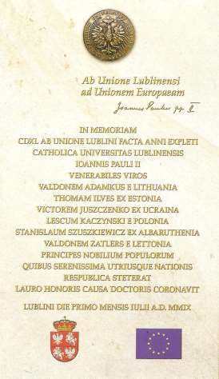

У меня возникает естественное желание смягчить обстановку, попытался успокоить так болезненно реагирующего на упрёки демонстрантов Президента. — Ведь наказание это дело суда и правоохранительных органов, — говорю ему я, — а законы, по которым можно наказывать — прерогатива парламента.
— Когда нация подымается с колен, — отвечает он, — несправедливо обиженные, униженные и оскорблённые люди, увы, требуют наказания тех, кого они считают виновными в своих страданиях, теми же методами, какими их самих ставили на колени.
Наше не лучшее настроение, порожденное протестующими, продолжает ещё некоторое время ухудшаться, а потом быстро идёт на поправку на ликующей праздничной площади, где с речью выступил мэр Люблина и с очень краткими приветствиями все четверо награжденных. К началу своего выступления преобразился и Президент Ющенко. Площадь восторженно приветствовала его речь. Но особенно горячо было принято выступление Президента Польши Леха Качиньского. Потом мы все направились к университету, где состоялось торжественное открытие гранитной мемориальной доски, вмурованной в стену главного здания KUL. На ней высечены имена всех докторов honoris causa, удостоенных этой степени в честь 440-летия Люблинской унии.
Так я вошёл в когорту тех, кому при жизни открыли памятник.

# ВВЦ или тайна, которую семь лет хранила жена
Так уж повелось, что если у тебя есть любимое занятие, то обязательно найдутся препятствия, чтобы им заниматься. Моё любимое занятие — принимать гостей у себя дома, но только в день рождения никто не мешает мне делать это так, как мне правится.
С конца 90-х я не мог насладиться любимой домашней вольностью. Именно в день рождения оказывался где-нибудь далеко от дома. Так было и в 1999-м: 12—17 декабря мне в соответствии с давно согласованным со мной учебным планом пришлось читать лекции в высшей экономической школе в Варшаве. Вечером 15 декабря, в день своего рождения, я пригласил нескольких своих друзей в небольшое кафе в центре города в пяти минутах ходьбы от гостиницы, в которой проживал.
Во время нашего скромного застолья официант позвал меня к телефону (мобильников тогда ещё почти не было), мол, звонит жена. Такого я не ожидал. Отыскать меня по телефону за границей в кафе, о котором знали только приглашённые! Но она не стала пояснять, как совершила такой поисковый подвиг, и потребовала срочно вернуться в Минск, так как у неё на руках билеты на самолёт и приглашение для меня за океан на условиях, «которые мне и не снились».
В итоге 19 декабря 1999 года я прилетел в Вашингтон и стал стажёром-исследователем в Центре Вудро Вильсона. Почему и как я туда попал, мне стало известно лишь в 2007 году, хотя жена, как она мне в этом 2007 году пояснила, обещала хранить тайну лишь 5 лет.
Постепенно осознав, что такое Центр Вудро Вильсона (ВВЦ), я спросил у заместителя директора по исследовательской работе господина Ван Дюзена, подпись которого была на направленном мне в Минск приглашении.
— Почему вы меня сюда пригласили. Ведь я не подавал прошения на получение стипендии, а конкурс у вас огромный и правила жёсткие: на стипендию «могут претендовать исследователи, обладающие выдающимися способностями и уникальным опытом», а я даже гуманитарного образования не имею.
Ответ был исчерпывающим.
— Это распоряжение господина директора Ли Гамильтона, а его мнение нельзя ставить под сомнение: у него более, чем тридцатилетний опыт конгрессмена и не лишь бы какого, а широко известного.
Но спросить об этом у Ли Гамильтона я не решался, и подумал, что со временем всё прояснится. Следуя правилу «дарёному коню в зубы не глядят», я быстро угомонился да и отказаться от стипендии, которая в долларовом исчислении раз в 20 превышала мой оклад в бытность Председателем Верховного Совета, я, а тем более, моя жена, сочли абсолютно необоснованным. В итоге до 28 апреля 2000 года я жил и работал в Вашингтоне.
Имея щедрую американскую стипендию, никак не мог привыкнуть к вынужденной американской расточительности. В том же долларовом исчислении продукты питания в Вашингтоне стоили раз в 7-8 дороже, чем в Минске. Месячная плата за квартиру, которую я обязан был снять, была 1000 долларов в месяц. Так что получаемые в ВВЦ деньги было на что потратить.
Препятствий при желании отлучиться из Вашингтона не было, и я слетал за это время на конференцию в Токио, потом в Чикаго и Торонто с публичными лекциями. По их приглашению выступил с докладами в престижнейших Гарвардском и Колумбийском университетах. Встретился с американцами белорусского происхождения в Нью Йорке, Саут Ривере, Чикаго и других местах. Да и сам Вашингтон с его музеями, галереями, памятниками, планировкой и архитектурой был моим очередным университетом. Иными словами, моя страсть к путешествиям и познанию была удовлетворена здесь как никогда ранее. Кстати четыре месяца и одна неделя стажировки были самой продолжительной моей отлучкой из родного Минска.
Одна из важнейших задач стажёров-исследователей Центра Вудро Вильсона — «содействовать пониманию важных политических процессов современности во взаимодействии с политическими деятелями в Вашингтоне и с сотрудниками Центра». Это и определяет статус исследователей Центра, его отличие от статуса сотрудника или стажёра в бывших советских и в большинстве постсоветских политологических исследовательских учреждений. Попробуй сегодня сказать, что белорусская государственная идеология — нагромождение нелепостей в угоду малообразованному правителю, и ты тотчас же вылетишь из более-менее уютного гуманитарного «исследовательского гнезда» Беларуси. А будешь без избыточной ненавязчивости, но верноподданнически восхвалять правителя — станешь почитаемым в придворных кругах. Более того, при наличии таланта холуя ещё и в никому не потребные Совет Республики или палатку попадёшь на «стипендию», как генерал Николай Чергинец, академик Анатолий Рубинов или борзописец Павел Якубович.
А там в ВВЦ нужно подготовить отчёт по теме «в области гуманитарных наук по национальным и международным проблемам, перекликающийся с вопросами государственной политики и очерчивающие культурные рамки событий..., уделяя особое внимание исследованиям управления, включая развитие демократии и гражданского общества, а также осознавая основные вызовы, перед которыми стоят США и другие страны мира».
Надо, так надо. С моим негуманитарным образованием это не просто, но я твёрдо решил — сделаю всё, чтобы не отличаться от завоевавших право на стажировку в ВВЦ по конкурсу. Хотя стажировались здесь выпускники дипломатических и политологических отделений престижнейших университетов мира, блестяще проявившие себя на достаточно высоких государственных должностях или же в общественно -политической деятель ности глобального масштаба. Вице-президенты США, например, Альберт Гор, госсекретари, такие как Мадлен Олбрайт, министры и/или заместители министров иностранных дел России и многих других европейских, азиатских, африканских и латиноамериканских стран.
Стажёр ВВЦ — свободный человек, единственная его обязанность один раз в неделю не пропускать без предупреждения научный семинар ВВЦ. К услугам стажёра — библиотека со свободным доступом к книгам и периодике. В неё можно приходить в любое время дня и ночи: индивидуальная карточка — ID («айди») — автоматически открывает все, надёжно закрытые для иных, желающих проникнуть в библиотеку, двери. Эта же карточка позволяет с 8 до 23 часов приходить в отведённый вам офис, с прекрасным компьютером и телефоном для бесплатных звонков в любой штат США.
В рекреации на третьем «стажёрском» этаже сидит вечно улыбающаяся Линзи — доброжелательная секретарь — делопроизводитель, окружённая дисплеями, факс -машиной, телефонами и современнейшими копировальными установками. С её помощью каждый стажёр может бесплатно позвонить в любую страну, бесплатно отправить посылку, но только с книгами, и только на свой домашний адрес.
Последней возможностью я увлёкся больше меры, так как обнаружил весьма интересную особенность американской жизни. Книги в США дорогие. Но есть гигантские магазины-склады, которые у нас назывались бы букинистическими, так как они торгуют подержанными книгами. Обычно в таких магазинах продаются книги в хорошем состоянии, а стоимость отобранных вами для покупки книг определяет продавец по одному ему известным правилам. Если вам покажется, что запросил он дорого, вы вправе отказаться от покупки.
Откуда же берутся такие книги?
Пояснение мне дал профессор университета в Балтиморе с истинно русскими именем, фамилией и отчеством — Бакунин Андрей Мстиславович, не имеющий, однако, никаких родственных отношений со своим марксистским однофамильцем. Его малолетнего отца, родители которого погибли в 1918 или в 1919 году, принял в свою семью какой-то очень важный российский железнодорожный начальник, воспитал как сына и перевёз в Америку. Я познакомился с Бакуниным на семинарах ВВЦ. Благодаря его безупречным русскому, английскому и тактичности, я чувствовал себя рядом с ним не пассивным свидетелем происходящего, а вполне уверенно. Он поразительно точно ощущал слова и мысли выступающих, которые не доходят до моего неанглоязычного сознания, и шёпотом пояснял мне на чистейшем русском суть докладываемого. Во время пауз многое рассказал о себе. Считает себя американцем, эмигрантом во втором поколении, очень гордится российским происхождением, верен традициям российских интеллигентов, знает порядки продолжающие господствовать на постсоветском пространстве. Ситуацию с книгами пояснил так.
— Я не могу поступать как большинство американцев. Для меня — расстаться с книгой — тяжёлая утрата, хотя я отлично понимаю, что действуют они разумно и вполне обоснованно. Таково одно из следствий развитого рынка труда. Вы переезжаете на новое место жительства по семейным обстоятельствам, на более высокооплачиваемую или же более нравящуюся вам работу. Американцы, как правило, не перевозят в новый дом или квартиру холодильник, стиральную и сушильную машину, громоздкую или нелюбимую мебель и… большинство книг. Отвозят книги в ближайший американский «букинистический» и продают их за очень скромную цену. Иногда вообще отдают бесплатно, руководствуясь соображением: я прочёл, пусть другие прочтут.
А далее в очень деликатной форме он сделал мне упрёк в расточительности при приобретении книг для внучки, которая была тогда дошкольницей и для сына, заканчивающего школу и решившего поступать на экономический факультет университета.
— За практически такие же словари с замечательными картинками и книги по экономике, которые я видел в вашем офисе, в магазине использованных книг вы заплатите не по 30—40 долларов, а по 3—5, а то и доллар-два. Можем завтра поехать в такой магазин, я помогу вам там сориентироваться и предоставлю багажник моего бьюика для транспортировки купленного.
— Андрей Мстиславович, не в силах скромничать и отказаться. С благодарностью принимаю ваше предложение.
Так родились 17 посылок с книгами, отправленных мною в Минск. Не глядя на наклейку на каждой посылке «BOOKS ONLY» с внушительным штампом Вудро Вильсон Центра, почти все они были вскрыты белорусской таможенной службой, неряшливо упакованы снова с добавлением акта с концовкой «недозволенных вложений нет».
Запомнилась встреча с донорами ВВЦ в марте 2000 года. Наиболее влиятельной личностью на встрече была элегантная высокая полная женщина солидного возраста — сестра умершего в возрасте 66 лет в январе 1978 года 38-го вице-президента США Губерта Хамфри младшего (Hubert Humphrey, Jr.). Как молодой сенатор Хамфри прославился ключевой фразой своей речи перед конвенцией Демократической партии США в 1948 году: «Пришло время Демократической партии уверенным шагом выйти из мрака прав штатов на яркий свет прав человека».
Сестра Хамфри неизменно называла меня Шушкович с ударением на «у» и спросила, почему я приехал без жены. Не дожидаясь конца моего ответа, обратилась к сопровождавшему её молодому человеку.
— Майкл, сделайте всё необходимое, чтобы жена президента Шушковича незамедлительно прилетела к нам сюда.
Как только доноры уехали, Майкл не пришёл — прибежал ко мне в офис с переводчиком, чтобы я не понял чего-нибудь неправильно и стал буквально умолять меня немедленно позвонить жене, чтобы она как можно быстрее прилетела в Вашингтон.
— Мы покроем ей все расходы на перелёт туда и обратно по любому маршруту, если надо — встретим в аэропорту.
Я заверил Майкла, что жена с радостью прилетит безо всяких задержек и что я позвоню ему сразу же по её прибытии в Вашингтон. В итоге всё так и произошло, 27 марта моя Ирина прилетела в Вашингтон. Единственное, чего никак не мог понять Майкл, как моя жена умудрилась купить билеты на поезд Минск—Москва туда и обратно и на самолёт Москва—Вашингтон также туда и обратно за неполные 800 долларов. Мне же Ирина пояснила всё доходчиво и просто.
— Это у тебя здесь большущая стипендия, а мы там живём, как и раньше, и 800 долларов — заоблачная сумма! Мне непросто было её одолжить, а ещё сложнее — в неё уложиться, но, к счастью, сейчас не туристический сезон и через Интернет я нашла множество льготных вариантов, из которых выбрала самый дешёвый.
Чего при моей, остающейся советской ментальности, долго не мог понять я, то это зачем сестра Хамфри пригласила мою жену. После оплаты Майклом понесённых женой транспортных расходов о ней никто и не вспомнил. Когда я поделился с Ириной своими размышлениями, то получил ответ, первую часть которого лучше не воспроизводить .
— Совок ты! Цивилизованные люди всегда ездят в цивилизованные страны с жёнами, если в состоянии их поездку оплатить. Ужав нерациональные расходы, ты и сам мог пригласить меня сюда за свою стипендию. Вот тебе и утёрли нос, объяснив, как надо себя вести.
К этому времени, то есть за три месяца проживания в городе, я очень хорошо разобрался в том, как спланирован и построен Вашингтон и его ближайшие окрестности и мог многими часами показывать здешние архитектурные и ландшафтные прелести жене. Она оказалась гораздо лучшим, чем я, знатоком художественных галерей, выставок искусства и культурных центров. Это был «сухой остаток» от её особой индивидуальной женской программы пребывания в столице США во время моего официального визита летом 1993 года. Её не только провезли и провели тогда по наиболее значимым музеям и художественным галереям, но и напичкали несметным количеством проспектов, книжек и прочих информационных материалов. В отличие от меня она по приезде в Минск не отвезла их на дачу и не сложила в иное укромное место, чтобы когда-то прочесть, а тщательно изучила. Поэтому с её приездом всякая безалаберность проведения свободного времени для меня закончилась .
29 апреля 2000 года, после успешно защищённого мною отчёта о проделанной в ВВЦ работе, мы вместе с Ириной возвратились в Минск.

—-

Лишь в 2007 году жена открыла мне тайну, которую обязалась хранить пять лет. Оказывается, 15 декабря 1999 года её пригласил в посольство Чрезвычайный и полномочный посол США в Республике Беларусь господин Дэниэл Спекхард.
— Надеюсь, что вы умеете хранить тайны, — сказал он, — то, о чём я вам скажу, можно рассказывать кому угодно, но только через пять лет. По имеющимся у нас сведениям ваш муж может пропасть так, как пропали министр Захаренко и депутат Гончар. Вот вам билеты на самолёт и приглашение для вашего мужа в Вашингтон. Вылет 19 декабря.

# О Гарварде, Сахаровском колледже и шотландском виски
Теоретически я познакомился с Гарвардским университетом в 1989—1992 годах. Этому, сам того не подозревая, способствовал тогда ещё доцент кафедры ядерной физики Александр Михайлович Люцко, пригласив профессора Гарвардского университета Ричарда Вильсона в Попечительский совет Сахаровского колледжа в Минске. Вильсон, в разговорах о чём бы то ни было, напоминал о Гарварде и постоянно подчёркивал, что главное преимущество этого университета — умение при наборе студентов руководствоваться исключительно способностями абитуриентов, а не статусом их родителей и возможностями платить за обучение. Когда я переспросил, знаниями или способностями, он чётко ответил способностями и трудолюбием. Это — причины, знания — следствие.
— Расходы на обучение и проживание частично и даже полностью могут быть покрыты за счет целевых стипендий и финансовых ссуд. Около 70% учащихся Гарварда получают прямую финансовую помощь от университета. В их числе — иностранные студенты. А вот способностями наделить нельзя, это дано свыше, — говорил он.
Как горячий сторонник поддержки талантливой молодёжи профессор Виль сон убеждал меня, что нельзя комплектовать студенческие группы по социальным, имущественным, национальным и им подобным признакам, что инвестиции в образование именно талантливой трудолюбивой молодёжи — путь к процветанию любой страны, в том числе и Беларуси.
— За сотни лет мы в Гарварде освоили именно такой подход, свято его блюдём и стараемся совершенствовать. Ищем и находим сочетание таланта и трудолюбия.
Многие мои коллеги и я тоже хотели бы научиться правильно измерять способности абитуриентов, но в лучшем случае мы умеем оценивать только их знания, в ещё лучшем — сообразительность, поэтому, слушая профессора Вильсона и не имея никаких оснований ему не верить, я ловил себя на мысли, что хотел бы побывать в его альма-матер, этой цитадели науки и образования — Гарварде и хотя бы уловить, как достигли они таких потрясающих высот и стали не просто старейшим частным университетом США, но и университетом с мировым именем.
Судьба оказалась ко мне благосклонной. Я побывал в Гарварде, и не один раз!
Первое приглашение в этот университет я получил в начале 2000 года, будучи стаж ёром-исследователем в Вашингтоне. В телефонной трубке звучал чистейший русский голос без всякого намёка на акцент.
—Я — Алексей Буланов, аспирант Гарвардского университета из России, был два дня тому в Иллинойсе и слушал ваше интервью для русского радио Чикаго. Позвонив на радио, узнал номер вашего телефона. Мой научный руководитель и директор русского центра Гарвардского университета хотели бы пригласить вас сюда с лекцией о встрече в Беловежской пуще в 1991 году. Я звоню вам по их просьбе.
Как говорят в Одессе, слетать в Америке из Вашингтона в Гарвард, не труднее, чем фунт изюма скушать. Именно так сказала мне тоже по телефону, только не о Гарварде, а о Чикаго, позвавшая меня в этот город для интервью и публичной лекции Марта Лидас — энергичная деловая одесситка, давно переехавшая в США и сменившая свою длинную еврейскую фамилию на фамилию своего мужа-грека.
— Приглашайте, — отвечаю аспиранту из России, который пока ещё Алексей, но очень скоро станет Алексом. Так здесь принято. Называю ему номер «своего» факса, точнее факс-машины у всеобщей любимицы секретаря-делопроизводителя ВВЦ Линзи, и буквально через полчаса она приносит мне приглашение с детальнейшим описанием как, куда и когда прилететь, кто встретит, как и кем будут компенсированы расходы и выплачен гонорар.
Лечу в Бостон, в шести километрах от него — Кембридж, в нём главные здания Гарвардского университета. У выхода из аэропорта в толпе встречающих стоит невысокий щуплый молодой человек с двухметровой палкой, к концу которой прикреплена бумажка со словами STANISLAW SHUSHKEVICH. Это Алексей, он приехал за рулём автомобиля, чтобы отвезти меня в русский центр Гарварда.
В пути слышу рассказ Алексея о том, что такое Гарвард. Большую часть того, о чём он говорит, я уже знаю. Услыхал от профессора Вильсона и прочёл в книгах библиотеки ВВЦ.
Но цифры поражают. Старейший университет Америки. Основан в 1636 году. более 6 тысяч студентов, более 12 тысяч аспирантов.
Среди выпускников 8 президентов Соединённых Штатов, среди выпускников и сотрудников 49 лауреатов Нобелевской Премии, 75 нобелевских лауреатов были связаны с университетом как студенты, преподаватели или сотрудники.
Мне же предстоит скромнейшее соприкосновение с этим величием. Нужно прочесть две лекции — одну для сотрудников «Русского центра», другую, с переводом, для тех, кто придёт по объявлению на сайте университета в Интернете.
На первой лекции меня представил ведущий — заместитель директора центра. В лестных тонах рассказал мою биографию и добавил.
— В зале 47 человек, что для меня неожиданно много, так как сотрудников Центра здесь только тридцать. Но вход у нас свободный и я рад приветствовать всех тех, кто нашими делами интересуется.
Я же в отличие от ведущего не просто удивлён, а шокирован и не тем, что говорит ведущий, а тем, что вижу в зале, и поэтому почти ничего не слышу. В первом ряду вся из себя сидит Клара Соломоновна Рукшина, которая в первые дни моего проректорства в университете в Минске буквально извела меня своими непрекращающимися посещениями. Я знал, что она совсем недавно эмигрировала в США, но не мог себе представить, что её взяли на работу в этот известнейший в мире питомник президентов и нобелевских лауреатов — Гарвард.

—-

Вряд ли могла догадаться Клара Соломоновна, что к успешной
защите ею докторской диссертации в Институте Истории Академии Наук СССР в конце 80-х имеет отношение моя бабушка Франя или Франтишка Рафаиловна Романовская (Камейша), которая умерла в 1964 году.
А ведь это так!
Бабушка, истинная христианка-католичка, постоянно учила меня искать в людях хорошее и напоминала об этом в каждом удобном для неё случае.
— Найти в человеке плохое очень легко, легче, чем хорошее, оно на поверхности — говорила она, — а ты ищи хорошее, оно всегда есть, но запрятано. Только тогда людей любить будешь, только тогда сможешь счастливым стать.
В случае с Кларой Соломоновной поиск хорошего был задачей не из лёгких. Её страшно не любили на кафедре. Не любили как человека, но не могли осуждать как специалиста. Она окончила Институт иностранных языков, свободно владела английским языком, защитила кандидатскую диссертацию по истории. Преподавала, была очень требовательной, но студенты на неё не жаловались. Считали справедливой.
На кафедре сложилась ординарная, часто встречающаяся в наших вузах ситуация, когда член коллектива кафедры, на которой нет докторов наук, пытаясь защитить докторскую диссертацию, как бы бросает вызов всем остальным. Остальные стихийно объединяются в противостоянии. Заслушивают претендента на кафедре и рекомендуют ему доработать, исправить, улучшить, так как не к лицу кафедре рекомендовать к защите «сырую» работу. Такое «заслушивание» может безрезультатно повторяться много раз.
Кафедра отвергала все попытки Рукшиной представить к защите её докторскую диссертацию, и с первого моего рабочего дня в качестве проректора по научной работе я вынужден был выслушивать её жалобы по этому поводу.
Пригласил заведующего кафедрой, на которой она работала, переговорил с преподавателями. Все в один голос: какая там диссертация, бред, да и только! Напереводила с английского ворох чужих мыслей и текстов и выдаёт за свои.
А Клара Соломоновна атакует. Приносит мне свои публикации, просит прочесть главу диссертации.
— Да я же не специалист в исторической науке, по большому счёту ничего в ней не понимаю.
— Это они, Станислав Станиславович, не хотят ничего понимать в исторической науке, пересказывают студентам старые басни, не видят нового. А вы поймёте!
В очередной раз обещаю подумать, как ей помочь. Признаюсь, что не очень представляю, как это сделать. Уходит, а я начинаю листать и выборочно читать обзорную главу оставленной рукописи... Хороший стиль, чёткие определения, достаточно лаконичные формулировки. У неё можно поучиться тому, что я постоянно требую от своих аспирантов и соискателей: если у вас есть мысль, не размазывайте её на страницу. Уместите в абзац!
Через день секретарь опять сообщает: доцент Рукшина просит её принять.
Приглашаю, прошу не перебивать.
—Уважаемая Клара Соломоновна. Я не могу вмешиваться в Ваш конфликт с коллективом кафедры хотя бы потому, что было бы невежеством полагать, что я вправе иметь суждение о научных достоинствах диссертации по исторической науке или осуж дать научную компетентность Ваших коллег по работе. В ближайшие дни я постараюсь договориться с очень компетентной организацией, чтобы там прошла Ваша предзащита. Мне по должности дано на это право, и я подпишу Вам письмо в эту организацию без официального представления кафедры.
— Простите, но в Минске нет ни организации, ни Учёного совета, которые бы не прислушались к голосу моих недоброжелателей.
— Я это давно понял и не намерен искать такую организацию ни в Минске, ни в Беларуси. Но, если Вы в этой организации, простите за грубость, провалитесь, то пеняйте сами на себя и не обращайтесь больше ко мне никогда.
— А если не провалюсь?!
И вот здесь, именно в этом месте нашего разговора, я допустил не совсем интеллигентную шутку, которая в принципе не могла быть хорошо понята Кларой Соломоновной, но вполне могла быть истолкована и её, и моими недоброжелателями, как вымогательство.
— Если не провалитесь, то с Вас бутылка настоящего виски.
Приехав в Москву, звоню председателю самого престижного совета по защите диссертаций данного профиля, которого никогда не видел и не знаю. Называю себя, прошу меня принять. Отвечает — приезжайте. Объясняю, что в нарушение общепринятых этических правил хочу направить в возглавляемый им совет диссертацию без предзащиты в университете, где она подготовлена.
Смеётся, просит не ссылаться на разговор с ним, не называть его фамилию. Говорит, что я излишне щепетилен, что не усматривает в моём деянии нарушения каких-то этических норм, что вне зависимости от того, была ли где-то предзащита или не была, без предзащиты в отделе их Института совет диссертаций не рассматривает.
А дальше — сказка для взрослых о гадком утёнке.
Клары Соломоновны диссертацию принимают к защите в Москве, в Институте Истории Академии Наук СССР, и через два месяца происходит её успешная защита.
Последующие события развиваются так, хоть возбуждать уголовное дело о коррупции.
Опять приходит ко мне Клара Соломоновна. Но не в кабинет, а на дачу. Приходит с элегантным подарочным пакетом несоветского происхождения. А в нём — литровая (!) бутылка настоящего шотландского виски.
И вот прошло лет десять, и я вижу Клару Соломоновну в Гарварде и не как обывателя, случайно заглянувшего на открытую лекцию, а как полноправного сотрудника престижнейшего университета.
Какими же не замеченными мною, а тем более, кафедрой, понятливостью, чувством юмора и пробивной силой должна была обладать эта женщина, чтобы так прореагировать на мою шутку и так жизнеутвердиться за океаном? А может быть здесь, в Гарвардском университете, да и в Институте Истории Академии Наук в Москве умеют совсем по иному, чем у нас в Минске, ценить научные достижения и не пытаются их обесценивать из-за того, что автор достижений кому-то не нравится?
Моя первая лекция в Гарварде закончилась обычно, как и другие лекции за рубежом. Было много вопросов. Но, в основном, не по главной теме, а о том, что вообще происходит на постсоветском пространстве и куда идут бывшие республики Советского Союза.
После лекции и кофе-паузы с сотрудниками русского центра Клара Соломоновна сочла своим долгом показать мне «хотя бы что-нибудь очень важное» в Гарварде, за что я по сей день ей очень благодарен, гораздо больше, чем за бутылку.

—-

Прогуливаясь по ночным улицам кампусов Гарварда я узнал, что самыми неприступными даже для очень талантливых абитуриентов считаются в университете медицинский и юридический факультеты: поступить сюда сложно. Самые популярные программы подготовки бакалавров — программирование, микроэлектроника и робототехника. Среди магистерских программ наибольший интерес вызывают экономика и финансы.
Для лучших студентов юридического факультета учреждены ряд именных стипендий, в их числе и самая престижная — стипендия имени академика Сахарова. В Высшей школе управления при университете, носящей имя Джона Ф. Кеннеди существует конкурс на стипендии для получения магистерской степени в области государственного администрирования.
Что-то похожее, как известно, всегда было и в наших вузах: именные стипендии для лучших студентов, занятия по индивидуальному плану. Но вот такое у нас вряд ли когда-нибудь случится, чтобы в любое время суток вы могли заглянуть в библиотеку, например, в отдел периодики, найти без чьей-либо помощи и почитать свежие газеты из любой страны мира. В три часа ночи, когда я из чистого любопытства зашёл в читальный зал периодики библиотеки Гарвардского университета, то оказался там совсем не в одиночестве и смог, правда, с помощью библиотекаря, найти «Нашу Ніву», «Народную волю» и любую нашу республиканскую газету трёх-пяти дневной давности. Всё в этом зале настолько просто организовано и размещено, что при следующем визите помощь сотрудника библиотеки мне вряд ли понадобится.
В СССР любили называть советского человека самым читающим человеком в мире. Может быть это и так. Но вот условия для чтения у американцев значительно лучшие. Взять в библиотеке книгу, а особенно сдать — требует минимальных затрат времени. Выбираешь в библиотеке книгу: в читательский билет вписывается день её получения и дата, до которой её следует вернуть. Вернуть можно в любой день и в любое время дня и ночи. В библиотеку можно не заходить, и из автомобиля выходить не надо. Контейнер-приёмник, напоминающий увеличенный в пять раз почтовый ящик с боковым отверстием на уровне открывающегося стекла автомобиля, расположен вплотную к проезжей части улицы у здания библиотеки. Сбросил в него книгу, и езжай дальше.
Библиотеки в США бесплатные, но за задержку книги сверх дозволенного времени взимается штраф, и очень большой.

—-

Второй раз я побывал в Гарварде в 2005 году. Снова не обошлось без неожиданностей. Русский центр остался на том же месте, сохраняя старые традиции, но возымел новое название — Дэвидсон-центр. Он стал так называться в память о человеке, завещавшем центру большую сумму денег. При таком «ненациональном» названии проще понять, почему здесь равнозначной по статусу может быть украинская тематика и даже белорусская. Именно занимающиеся украинской тематикой были инициаторами моего второго приглашения в Гарвард. В зале на встрече со мной была большая группа украинцев из Торонто, которые вместе со своими гарвардскими коллегами ликовали по поводу сдачи в печать очередного тома их совместного творения — Украинской энциклопедии.

# Коннектикут, Нью-Хевен, Йельский университет
Мне повезло быть лектором в трёх университетах США, входящих в так называемую «Лигу плюща» — Гарвардском, Йельском и Колумбийском. Название лиги дало растение, обвивающее старые здания университетов. Всего в этом неформальном объединении восемь колледжей и университетов. Их позиции никогда не опускаются ниже пятнадцатой строчки рейтинга журнала U.S. News and World Report.
Отправляясь в поездку, всегда ищу в Большой Советской энциклопедии (БСЭ) информацию о городах и учреждениях, с которыми придётся соприкоснуться. Для меня по сей день не ясно, почему в БСЭ нет ни слова о Йельском университете (ЙУ). Не упоминается о нём и в заметке в БСЭ о штате Коннектикут, в котором ЙУ находится. Может быть потому, что он не является гигантским? Сегодня в нём 5300 студентов. Но он, вне всякого сомнения, элитный, и аспирантов в нём больше, чем студентов — 6100! Да и основан он ранее Московского университета — в 1701 году. Может быть, о нём нет упоминания в БСЭ потому, что на его гербе надпись «Свет и Истина» не только по латыни «Lux et Veritas», но и на иврите? Может быть потому, что со дня основания его предназначение — воспитывать «образцовых мужей», а не строителей светлого будущего или просвещения широких масс трудящихся?

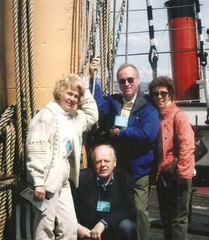

Так или не так, но в легендарный Йельский я попал. Попал, благодаря знакомству с известным американским писателем дважды лауреатом Пулитцеровской премии Ричардом Роудсом, автором *художественных произведений* — книг о создании ядерной и водородной бомб. Он в свою очередь давно сотрудничал с моим давним знакомым Юрой Орехвой, а для меня просто — Юрой — белорусом, родившимся в Минске и волею судьбы оказавшемся в Америке.
Юра, по образованию — физик-ядерщик, в 1986 году, работая в Аргонской национальной лаборатории США в окрестностях Чикаго, так жаждал побывать на своей родине — в Беларуси, что добился от руководства лаборатории командировки на стажировку на возглавляемую мною кафедру в Белорусский государственный университет.
Стажёры всегда выступают с докладом на научном семинаре. Юра предпочёл выступить на белорусском языке. Таким образом в 1986 году впервые в послевоенной истории в Белорусском университете состоялся первый белорусcкоязычный научный семинар по физике. Мы, конечно же, не сказали ему об этом, старались по-белорусски задавать вопросы и по-белорусски вести дискуссию. Получилось неплохо, почти без «трасянки» — простонародной белорусско-русско-польской смеси, тем более — физико-математической. В деликатных случаях выручал английский, пассивное знание которого, т.е. умение переводить печатные тексты и неумение говорить по-английски, было основополагающим принципом изучения языков в советских вузах.
Хорошему белорусскому Юру научили родители, которые после войны долго скитались по Европе и, наконец, получили гражданство США. Отец Юры — Аркадий Орехва, проживая в Западной Беларуси, дружил с Евгением Скурко (Максимом Танком), получившем широкую известность.

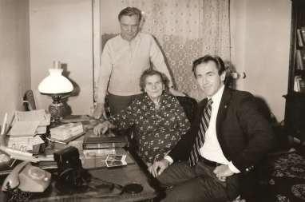

Ко времени моего приезда в ВВЦ Юра переехал на работу в пригород Вашингтона Силвер Спринг в Федеральную службу контроля за ядерными реакторами. Здесь в Вашингтоне и состоялась наша совместная с Юрием встреча с Ричардом Роудсом. Многие мои американские дела были спланированы именно во время этой встречи. Прежде всего, Ричард сказал, что он уполномочен пригласить меня с лекциями о встрече в Вискулях в свою альма-матер — Йельский университет, профессором которого работает, и что, если я согласен, то мне будет направлено официальное приглашение. Я, естественно, с радостью согласился и осенью 2000 года прилетел в Нью Йорк, где меня ждал автомобиль, чтобы отвезти из аэропорта JFK (Джона Фитцджмеральда Кеннеди) в Нью-Хейвен, до которого от JFK по американским меркам — рукой подать, 130 километров.
Мне хотелось сразу же убить нескольких зайцев, что обычно не получается, но здесь удалось. Дело в том, что в Йельский университет перебралась к этому времени моя замечательная однокурсница, которую все мы, выпускники физфака Белгосуниверситета 1956 года, иначе как Инночка не называем по сей день.
Так вот наша очаровательная Инночка с девичьей фамилией — Курилова, не раз заявляла в студенческие годы, что обязательно свяжет свою судьбу с какой-то дальней стройкой коммунизма. Потом эта страсть угасла, и талантливая Инночка с блеском защитила в Москве диссертацию, с таким же блеском освоила английский язык и переехала со своим очередным очень умным, как и все предыдущие, мужем в США. Там в отличие от менее талантливых эмигрантов с кандидатской (по-западному—«докторской») степенью она не пошла для начала в посудомойки или няньки, а сочла себя достойной стать сотрудницей Йельского университета. И, знай наших, стала!
Узнав, что я приглашён в «Yale University», она предложила забрать меня в аэропорту, приехав туда автомобилем вместе со своим мужем, и по дороге «наговориться сколько хочешь, никому не мешая, пока муж Володя будет крутить баранку».

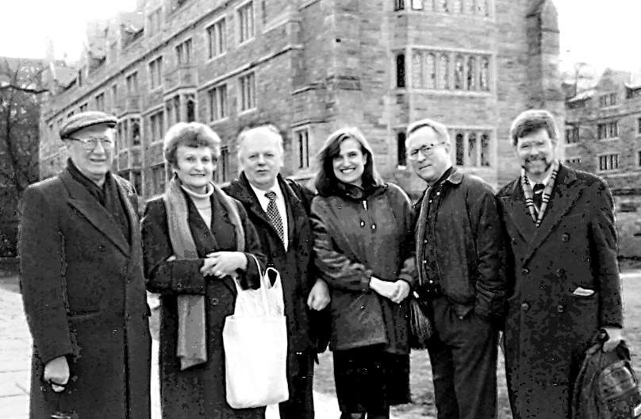

В пути я узнал, что в Йельском университете 12 кампусов (колледжей-общежитий) и девять факультетов.
Каждый колледж-общежитие включает столовую, библиотеку, комнаты для занятий и зал для собраний, занимает целый городской квартал, создавая, как написано в рекламном проспекте, «неповторимую атмосферу студенческой жизни».
Самый известный сегодня факультет университета — медицинский, основанный в 1810 году, в котором работали в момент моего посещения семь нобелевских лауреатов. Наибольшие конкурсы на факультеты искусств, где готовят музыкантов, художников и актеров. Самыми популярными среди абитуриентов считаются кафедры биологии, химии и биохимии, физики, астрономии, математики и защиты окружающей среды. Наиболее престижные аспирантские специальности: биомедицина, прикладная химия, инженерные науки, вычислительная техника, геофизика, молекулярная биофизика.
Студентов и сотрудников, владеющих русским языком, в Йельском университете предостаточно, и моя первая лекция шла без перевода, хотя аудитория человек на 200-220 была практически полной. Несколько человек, включая Ричарда Роудса, не владевшие русским в совершенстве, сидели возле гражданки Канады украинского происхождения Галины Гринь, приглашённой в Йель из Торонто в качестве преподавателя современного украинского языка. Она прекрасно знала русский и помогала своим соседям меня понять.
После лекции Галина была моим гидом и переводчиком, показала и рассказала мне много интересного. Оказалось, например, что одна из предназначенных для визит-профессоров квартир, в которой меня поселили и где я с неповторимым трепетом провёл вечер, греясь у старинного камина при свете не менее старинных электрифицированных канделябров, совсем не старая. А старинные канделябры, переделанные (по моему мнению) в электрические люстры, совсем не канделябры, а обыкновенные электрические светильники. Само здание тоже совсем не старое, хотя и напоминает особняк богатого владельца 17-18 столетия. Архитектор возвёл его и множество других строений университета в 30 годы прошлого века, однако, все они как бы говорят: посмотрите, какие мы древние, но какие качественные! Да и вообще, 30-е годы прошлого века были годами бурного развития древнего Йельского университета. На производстве оружия и нефти здешние бизнесмены зарабатывали большие деньги и щедро оплачивали счета университета, необходимые для его совершенствования и развития.
— Как вы думаете, что это такое, — спросила Галина Гриль, когда мы подъехали к зданию, напоминающему по размерам и форме пятиэтажную панельную «хрущёвку».
— Думаю, что это не хрущёвка, хотя бы потому, что сооружение простое и симпатичное, хотя и без окон.
— Ошибаетесь, стен в ней нет, сплошные окна, но не из стекла.
Хотя я и физик, но сначала не понял, зачем такие огромные дорогущие окна, да еще из дюймовой толщины белого мрамора.

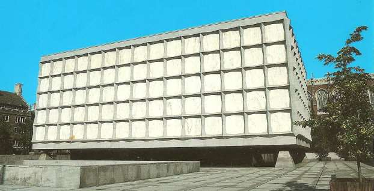

Оказалось, что всё предельно просто. Мы подъехали к уникальному корпусу библиотеки университета — хранилищу и читальным залам старинных книг и рукописей. Эти уникальные книги и рукописи категорически не переваривают ультрафиолетовое излучение. Меняют под его воздействием цвет, деструктурируются или просто крошатся, выцветают. А мрамор вредный для библиотечного богатства ультрафиолет поглощает полностью, не создавая заметных препятствий для излучения, видимого человеческим глазом, поэтому днём в библиотеке солнечный свет и тепло, но никакого ультрафиолета.
Йельский университет окончили пять президентов США: Тафт Уильям Говард (1909—1913), Форд Джеральд Рудольф (1973—1974), Буш Джордж Герберт Уокер (1989—1993), Клинтон Уильям Джефферсон (1993—2001), Буш Джордж Уокер (2001—2009), с двумя из них — С Бушем-старшим и Биллом Клинтоном мне довелось не один раз встретиться во время их президентства.
Но, пожалуй, самым известным выпускником Йельского университета стал изобретатель и художник Сэмюэл Морзе, имя которого носит предложенная им азбука, широко применявшаяся в телеграфии и вообще в электро- и радиосвязи более ста лет.
Когда Галина Гриль сказала мне, что она приглашена в Йельский университет для работы со студентами, занимающимися по индивидуальным планам, я не сразу уяснил, в чём состоит такая работа. Ведь у нас по индивидуальному плану занимаются студенты, как правило, с отличной успеваемостью, хорошо проявившие себя в исследовательской работе. Да и вообще индивидуальный план — достаточно редкая форма поощрения тех, кто, занимаясь самостоятельно, способен освоить больше, чем предусматривает программа отдельных лекционных курсов и связанных с ними семинаров и практических занятий.
В Йельском университете — наоборот, по индивидуальному плану в стенах университета занимаются только те, кто недостаточно подготовлен, чтобы стать полноправным студентом. За подобного рода занятия по действительно индивидуальному для каждого желающего стать студентом плану нужно платить. Иногда очень дорого. Университет же приглашает для работы с такими почти студентами высококвалифицированных педагогов, и они проводят занятия с группами обучаемых — по 2, 3, максимум 4—5 человек, а иногда и совсем индивидуально.

# Крупнейший в американской столице
Высшие учебные заведения США различными способами добиваются высокого качества получаемого в них образования. В качестве ещё одного примера «непохожести» на других предельно кратко упомяну о крупнейшем в американской столице и самом дорогом по оплате за обучение частном вузе США Университете Джорджа Вашингтона. Он создан решением Сената в 1821 году. В 2008 году плата обучения составляла в нём 38000 долларов в год. Здесь обучались тогда 24500 студентов, 13700 аспирантов, работали 2060 преподавателей. В 2012 году плата за обучение достигла 50000 долларов в год, однако, очень талантливые молодые люди из небогатых семей могут получить здесь образование за меньшую плату и даже бесплатно. Для этого разработаны строгие критерии оценки уровня обеспеченности семей обучаемых и критерии оценки способностей и трудолюбия.
В университете три кампуса: городской, начинающийся в полукилометре от резиденции Президента США — Белого Дома, пригородный и сель ский. В каждом из них множество исследовательских институтов. Один из них — Институт исследований Европы, России и Евразии. В сфере его интересов находится Беларусь. Учебная и исследовательская работа теснейшим образом взаимосвязаны, и к той и к другой привлекаются учёные, деятели культуры и искусства, государственные деятели, политики из зарубежья.
Мне повезло. В 2000 и в 2012 годах и я был удостоен чести быть в этом университете в числе приглашённых лекторов.

---

1. [~~Про мой род, себя и нашу элиту~~](./1.md)
2. [~~Бацькаўшчына~~](./2.md)
3. [~~Академия — завод — университет~~](./3.md)
4. [~~МРТИ — хорошо, БГУ — лучше~~](./4.md)
5. [~~Чернобыль~~](./5.md)
6. [~~В Москву, к властям~~](./6.md)
7. [~~Дорога к Вискулям~~](./7.md)
8. [~~Народы малочисленные и к ним приравненные~~](./8.md)
9. [~~Если б знал я, с кем еду, с кем водку пью…~~](./9.md)
10. [~~Беловежская пуща, Вискули, 7—8 декабря 1991 года~~](./10.md)
11. [~~Беларусь — Соединённые Штаты~~](./11.md)
12. [~~Интеллигенция и политика~~](./12.md)
13. [~~О университетах и ВУЗах, степенях и лекциях~~](./13.md)
14. [**О «моём» зарубежье**](./14.md)
15. [Патология](./15.md)
16. [Через годы, через расстояния](./16.md)
