1. [~~Про мой род, себя и нашу элиту~~](./1.md)
2. [~~Бацькаўшчына~~](./2.md)
3. [~~Академия — завод — университет~~](./3.md)
4. [~~МРТИ — хорошо, БГУ — лучше~~](./4.md)
5. [~~Чернобыль~~](./5.md)
6. [~~В Москву, к властям~~](./6.md)
7. [~~Дорога к Вискулям~~](./7.md)
8. [~~Народы малочисленные и к ним приравненные~~](./8.md)
9. [~~Если б знал я, с кем еду, с кем водку пью…~~](./9.md)
10. [~~Беловежская пуща, Вискули, 7—8 декабря 1991 года~~](./10.md)
11. [~~Беларусь — Соединённые Штаты~~](./11.md)
12. [~~Интеллигенция и политика~~](./12.md)
13. [~~О университетах и ВУЗах, степенях и лекциях~~](./13.md)
14. [**О «моём» зарубежье**](./14.md)
15. [Патология](./15.md)
16. [Через годы, через расстояния](./16.md)

---

Люблю путешествовать, а что касается отдыха, то путешествие — лучшая его форма. Во времена Советского Союза желание увидеть мир не должно было выходить за границы СССР, но семь раз я за эти границы вышел. Мне повезло: побывал в Югославии (1966), три раза в Польше (1974, 1987, 1988) и три раза в ГДР (1975, 1976, 1978), по дороге в Югославию целый день провёл в венгерском Будапеште. Официально все поездки были деловыми: 5 раз для чтения лекций (два раза это сопрягалось с научными конференциями); раз чисто для участия в научной конференции; раз для заключения договора о сотрудничестве.
Отдыхать за границей даже не пытался. Иногда выезжал на отдых за пределы Беларуси, в места, которые сейчас стали «ближним зарубежьем». За всю жизнь — пять раз. Три раза — по путёвкам (Мисхор, Сочи, Юрмала, два — «диким образом» (Сухуми, Якорная Щель).
Не по душе мне отдых по путёвке. Только в Мисхоре я выдержал такое 24 дня и до сих пор вспоминаю их с содроганием. Планировал два раза побыть в санатории по 12 суток, но удалось только один раз — в Сочи, вторая попытка в Юрмале сорвалась — в первую же ночь попал на операционный стол с аппендицитом.
Страшно не люблю долго находиться в одном и том же месте, завтракать, обедать и ужинать по расписанию. Иное дело — бродить с рюкзаком и спальным мешком в хорошей компании. Такого за мою жизнь не пересчитать в Беларуси, Крыму, Кавказе, на Памире, в Приморье, на Камчатке. Все невзгоды и трудности забываются, эмоции только положительные. Что касается дальнего зарубежья, то, как говорят украинцы, «мешок развязался», начиная с 1991 года.

# ФРГ
(Й. Рау, Ю. Шноор, Г. Шноор, М. Штольпе, А. А. Собчак, Р.М, Горбачёва, М.С, Горбачёв, Г. Шрёдер)
В начале сентября 1991 года состоялся мой визит в Дюссельдорф — столицу земли Северный Рейн — Вестфалия. Когда поездку начали готовить, я был Первым заместителем Председателя Верховного Совета, а поехал туда в ранге исполняющего обязанности Председателя ВС РБ. У нас установились очень добрые отношения с этой Землёй, главным образом по двум причинам. Во -первых, премьер-министром там был великий гуманист, истинный христианин Йоханнес Рау, во-вторых, благодаря тому тому, что в Дюссельдорфе жила замечательная женщина — Юта Шноор. Её муж — вице-премьер министр полиции в правительства Земли — Герберт Шноор прямо говорил, что помощью Беларуси в Земле Северный Рейн-Вестфалия руководит Юта. Не занимая никакой должности, она делала всё, чтобы помочь детям Беларуси. Благодаря ей в Минске появилась детская хирургическая клиника, оборудованная по последнему слову медицинской науки.
Во время первого посещения мне не хотелось быть слишком любезным с немецкими руководителями, так как в моей памяти не стёрлись преступления немецких фашистов на белорусской земле. По-видимому, премьер это понимал. Он приветствовал меня краткой речью, которую начал словами.

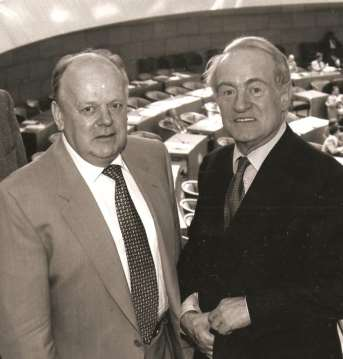

— Прежде всего пользуясь данными мне полномочиями, я хочу попросить прощения от имени граждан Земли Северный Рейн — Вестфалия у господина Шушкевича, а в его лице попросить прощения у всего белорусского народа за те злодеяния, которые чинили мои соотечественники на белорусской земле.
Такого начала я не ожидал. Краткая речь премьера меня шокировала, и обязала изменить моё намерение произнести сдержанное приветствие. Я волновался, но ничего не мог с собой поделать и начал, буквально, навзрыд.

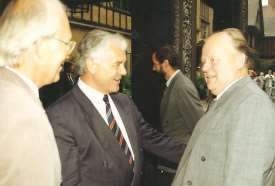

— Ваше превосходительство, господин премьер-министр Йоханнес Рау, дамы и господа. Благодарю вас, господин премьер, за ваши добрые слова, за приглашение посетить одну из известнейших и богатейших земель Федеративной Республики Германия. Когда я был ребёнком для меня слова немец и враг были синонимами. Но белорусы — цивилизованные люди, европейцы.
Они научили меня отличать Германию Гётте и Шиллера, Баха и Бетховена, Дюрера и Канта от Германии, связанной с именами, которые я не хочу здесь произносить . Судьба разместила нас недалеко друг от друга, в одной части света, и нам предназначено судьбой иметь и развивать добрые взаимовыгодные отношения ради благополучия наших граждан.
Из Дюссельдорфа я планировал полететь в Потсдам к премьеру Земли Бранденбург господину Манфреду Штольпе. Выяснил, что господин Рау собирается к нему же. Предложил полететь «моим» самолётом. Он спросил.
— Останется ли в самолёте после того, как мы с господином Шноором присоединимся к вам, место для маленького подарка лично вам от земли Северный Рейн Вестфалия?
Я недоумевал, о чём идёт речь, и господин Рау пригласил меня в соседнюю комнату. Там стоял тренажёр.
— Я слышал, что вы любите велоспорт. Но у вас теперь служебный автомобиль — враг велосипеда, а этот велотренажёр не займёт в квартире много места.
Не признаваться же премьеру, что живу я в двухкомнатной квартире с женой и сыном, и такая роскошь как тренажёр превратит в полосу препятствий мой путь к письменному столу.

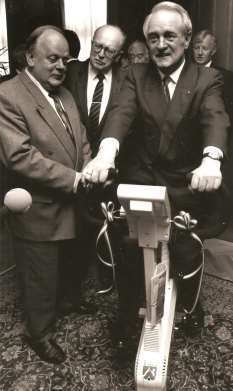

В салоне нашего Ту-134 собралась четвёрка — Йоханнес Рау, Герберт Шноор, Сергей Степанович Линг и я. Интересная беседа сократила до минимума время полёта в нашем воображении.
В Потсдаме я спросил у заместителя премьера РБ Линга, не думает ли он, что Рау займёт в ФРГ более высокий пост? Сергей Степанович ответил молниеносно: займёт обязательно!
И действительно 23 мая 1999 года Йоханнес Рау был избран президентом ФРГ.
На новом посту он продолжил свою великую христианскую миссию, делал всё, чтобы общество было свободным от ненависти, насилия, одностороннего восприятия, предубеждения.
Можно долго рассказывать о гостеприимстве в Дюссельдорфе, о подписанных во время визита соглашениях, о предприятиях и банках, посещение которых входило в программу визитов, наконец, о красоте и благоустройстве Дюссельдорфа. Вместо всего этого я расскажу о впечатлении и делах, навязанных мне Ютой Шноор.
Худенькая невысокая госпожа Юта, не произнося почти ни одного слова, не бросая властных взглядов на тех, кого ей нужно было привлечь для решения вопросов, которые она считала важными, в одинаковой степени успешно повелевала и премьером Рау, и своим мужем — вице-премьером Шноором, и мною. После подписания всех официальных документов с руководителями земли Северный Рейн-Вестфалия она взяла меня за руку выше кисти, сказала что-то типа хватит терять время на заверения всех и всяк в искреннем к ним уважении, поедем заниматься делом. Иначе можем не застать в палате тех, кто и мне и вам очень нужны.
О какой палате шла речь и кто нам был нужен, я вначале даже не догадывался. Когда приехали, понял — торговая палата, а в ней собрались «акулы дюссельдорфского предпринимательства». Юта продвигалась к подиуму, обмениваясь взглядами, рукопожатиями и дружескими поцелуями, со встречными, бросая удалённым «привет, Ганс, Кнут, Франк...». Взошла на подиум, велела мне сесть в стоящее рядом кресло и произнесла краткую речь о том, что я совсем недавно стал главным в стране, где дети пострадали от Чернобыля и лишены должного медицинского обслуживания. Оторопев и не зная, что делать, я кивал головой в знак согласия. Оказывается именно это от меня и требовалось.

Вся поездка в Торговую палату заняла не более 40 минут. Просмотрев полученные там чеки, госпожа Юта сказала.
— Мы с вами собрали миллион марок. Это, примерно, одна восьмая часть того, что требуется, чтобы детская хирургическая клиника в Минске отвечала современным стандартам. Как вам известно, более половины этой суммы уже есть, остальное будет!
Через год госпожа Шноор организовала пригон в Минск более 50
автомобилей скорой помощи, и они были переданы водителям со всей Беларуси перед зданием Верховного Совета. Единственное, чем мы могли её отблагодарить в то непростое время, была Почётная грамота Верховного Совета.
И грустный финал.
Вскоре после всего этого Юта Шноор умерла. Она оставила завещание, суть которого такова: ни в коем случае не приносите на мои похороны цветы. Пожертвуйте предназначенные для этой цели деньги на помощь нуждающимся в поддержке детям.
Вышедший на пенсию её муж Герберт Шноор переехал из Дюссельдорфа в Потсдам — ближе к своим взрослым детям и занялся активной благотворительной деятельностью. Он также внёс значительный вклад в обеспечение финансирования и оснащения детского хирургического центра в городе Минске.

—-

Потом мне довелось побывать в ФРГ немало. В том же
Дюссельдорфе, Бонне, Франкфурте, Фрайбурге, Мюнхене, Вольфсбурге, Кёльне. Мог сопоставить, что изменилось в Дрездене, Лейпциге, Наумбурге, Йене, Гере, Айзенахе, Альтенбурге, Потсдаме, по сравнению с тем, что я видел там в коммунистические времена, когда почти все, получаемые за свою работу в Йене деньги, потратил на поездки по ГДР. Пожалуй, больше всего меня поразили Дрезден, Лейпциг и Берлин. Моя любимая Сикстинская Мадонна Эль Греко в картинной галерея Дрездена на том же месте и так же ошеломляет посетителей, но Дрезден совсем иной: по-прежнему чистый, но более красивый и без памятника войне — руин. В Лейпциге, куда меня с женой пригласил размещённый там один из более 20 зарубежных Институтов Польши, я обнаружил совсем иной вокзал и совсем иной город. Полностью исчезла грязная серость зданий и дурной «гэдээровский» запах. Вокзал же, знаменитый тупиковый лейпцигский вокзал, перестал быть только вокзалом, а стал одновременно культурным и торговым центром, где можно отдохнуть и съесть не только знаменитые немецкие колбаски, под не менее знаменитое немецкое пиво, но и попробовать настоящие белорусские драники, украинский борщ и российскую солянку.

Можно долго говорить и про сегодняшний Берлин. Немцы достойно реконструировали здание рейхстага, не убрали из него надписи, сделанные советскими воинами, а разумно вписали их в обновлённое здание с новым великолепным залом заседаний парламента под стеклянной крышей.
Однако самое интересное за рубежом — неожиданные встречи. Одна из них произошла от Вольфсбурга,
города, где градообразующим началом является автогигант Volkswagen. Километрах в 20 километрах от него расположен краеведческий музей, на территорию которого свезено множество ветряных мельниц со всей Германии. Там я встретил Анатолия Собчака — своего давнего знакомого по съездам народных депутатов и Межрегиональной Депутатской Группе, и, к сожалению, слегка подпортил торжество в его честь.
Мэру Санкт-Петербурга, горячему стороннику преобразования своего города в культурную столицу России Анатолию Александровичу Собчаку предполагалось преподнести изготовленную немецкими мастерами копию пропавшего колокола. Я ничего об этом не знал. Увидев электрическую кнопку, решил, что это включение подсветки экспонатов и нажал её. Раздался громкий звон. Предполагаемый сценарий был сорван — колокол зазвонил ранее, чем документы о его передаче вручили Собчаку. Группа вручающих была расстроена, Собчак шепнул мне на ухо.
— Вы до предела сократили процедуру передачи. Больше времени останется на ужин.
Михаил Сергеевич Горбачёв при встречах в Вольфсбурге, наоборот, не шутил. Он, полагаю, был обижен на меня за заявление на пресс-конференции. Там на вопрос журналиста, как я отношусь к избранию его председателем Зелёного креста, я ответил.
— Не понимаю, как можно председателем всемирного экологического общества избрать человека после того, как он позволил себе в мае 1986 года в выступлении по всесоюзному телевидению говорить неправду об опасных последствиях Чернобыля. Именно это выступление стало причиной многих пагубных последствий катастрофы для здоровья граждан Беларуси, прежде всего для здоровья детей. Коммунистический подход и в иных случаях брал в деятельности Михаила Сергеевича Горбачёва верх над подходом экологическим, да и чисто человеческим.

Автогигант Фольксваген 16-18 сентября 1992 года организовал конгресс IPI International Partnership Initiative (Международная партнёрская инициатива) «Европа и мир на переломе» (Europa und die Welt im Unbruch), Были приглашены лица, которых считают интеллектуальной элитой Европы, и известные политики, такие, как Горбачёв и будущий канцлер ФРГ Герхард Шрёдер, а также известные бизнесмены. Здесь можно было узнать видение будущего людьми просвещёнными и очень опытными. Всё это сочеталось с хорошо продуманными действиями организаторов по рекламе продукции фирмы Фольксваген. Показывая машины спецназначения, представитель фирмы спросил.
— Вас не пугает этот автомобиль? Он очень большой и может служить пожарникам, строителям, перевозчикам специальных грузов в экспедициях по бездорожью и т. д. Но управлять им может любой человек, умеющий ездить на легковом автомобиле. Не хотите попробовать? Предлагаю вам ключи от него.
Рассказчик, я думаю, был абсолютно уверен, что никто из женщин, к которым он обращался, на такое предложение не согласится. Конечно же. Откуда ему было знать, что в группу аристократов и первых леди затесалась моя жена, которая к тому времени никогда не водила никакого автомобиля, кроме Жигулей, но абсолютно уверовала, что делает это лучше других.
— Да, я хочу,— крикнула она по-английски, выхватила у экскурсовода ключи и, сняв туфли на высоких каблуках, поднялась по ступенькам в кабину гиганта.
— Филипп,— сказал я шофёру, эмигранту из Эстонии, хорошо говорившему по-русски, предоставленного в моё распоряжение с роскошным лимузином Ауди, — это результат твоих похвал в её адрес. Поехали за ней до того столба или дерева, которое она снесёт.
Поехали, но, к счастью, ничего плохого не случилось. Моей Ире удалось доказать, что огромная машина вполне ей подвластна. Она даже припарковаться сумела примерно там, откуда стартовала.

# Китай
(Цзян Цземин, Вань Ли, Ли Пэн)
Официальный визит в Китай не был похож на все иные визиты такого рода. На нашем Ту-154 мы приземлились в Пекине в аэропорту Шоуду в 20 градусный мороз. Сразу же нас поместили в тепло и показали, как летают китайские руководители и сопровождающие их лица. Всю делегацию Беларуси мгновенно «переселили» в Боинг-737, оборудованный исключительно богато и уютно. Начали «ублажать», наделив китайскими сувенирами и предлагая изысканные блюда китайской и европейской кухни. Я с женой находился в отдельном самом роскошном салоне. Нас обслуживали две очень красивые стюардессы в китайских национальных нарядах, потом я узнал, что и остальная делегация также пребывала не в спартанских условиях. У меня и до этого не было стойких иллюзий насчёт рабоче-крестьянского характера власти в Поднебесной, но здесь они окончательно исчезли.
Через два часа приземлились в международном аэропорту Гаоци города Сямэнь в районе тайваньского пролива. Помня январский холод Минска Пекина, надели на себя то, в чём приехали и вышли из самолёта в ушанках и зимних пальто навстречу китайским пионерам в лёгких костюмчиках и платьицах. Температура воздуха была 25 градусов.
Гостиница «Сямэнь», в которой нас разместили, тянула по основным показателям на пятизвёздочную европейскую. У меня в номере была даже электрическая сауна, которую отделяла от ванной комнаты стена из монолитного толстого стекла, но включить сауну не удалось ни мне, ни гостиничным служащим.

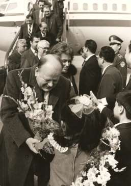

После обеда поехали смотреть Сямэньский мост — многокилометровое сооружение, соединяющее плотно заселённый (более 20 тысяч человек на кв. км) маленький остров Гуланьюй с материком. Посетили обувную фирму Цзили и кондитерскую фабрику. Вечером был ужин от имени правительства Фунцзянь в ресторане «Минсяо».
Таким образом, перед основными встречами на уровне руководителей КНР нам показали, что такое образцовая китайская провинция и специальная экономическая зона. Я бы сказал, и правильно сделали, потому что именно там можно было понять, что в китайском смысле вся Беларусь уже стала более, чем свободной экономической зоной. Все граждане Беларуси усилиями Верховного Совета получили к тому времени больше экономических и политических прав и свобод, чем китайские предприниматели в свободных экономических зонах КНР.
Следующим утром мы продолжили знакомиться с фирмами — чемоданно-сумочной, текстильной, электронной и совершили экскурсию по острову Гуланьюй. Посмотрели, как на острове площадью 0,97 км кв., из которых лишь 3,6% плоскость, остальное — скалистые горы, проживают 22 тысячи человек. Вечером состоялся наш отлёт в Пекин. Ужинали на борту самолёта. В 20 часов 15 минут всех членов делегации разместили в резиденции «Дзяоюйтай», меня с женой в огромном роскошном особняке, соединённом тёплым переходом со зданиями, где находились остальные члены делегации.
Трудно представить что-то более роскошное и красивое, чем правительственная резиденция КНР в Пекине для приёма гостей, которых власть Китая считает важными. До этой поездки я, чаще всего с женой, размещался во время официальных и просто деловых визитов в известнейших резиденциях — Блэйр-Хаузе в Вашингтоне, в правительственном отеле Петерсберге возле Бонна, в апартаментах Капакабана-палас в Рио де Жанейро и старинных аристократических отелях Парижа, наконец, в апартаментах для VIP-гостей древней столицы Японии Киото, но китайская резиденция ошеломляла и по сравнению с ними.

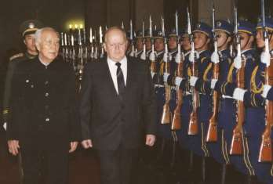

Зная размер своего шага, я быстро посчитал, что мне с Ирой предоставлено не менее 1500 кв. метров площади с тремя рабочими кабинетами, большим залом для встреч, столовой, тремя спальнями с выходами в по-разному, но предельно качественно оборудованными ванными комнатами, в одной из которых был небольшой бассейн. Что касается жены, то она никак не могла покинуть переходы между всеми этими залами, которые язык не поворачивается назвать коридорами. В них везде 8—10 января (!) цвела адаптированная к комнатным условиям сакура — множество небольших деревьев японской вишни с приятно пахнущими розовато-белыми цветочками в керамических чашах. В одном из рабочих кабинетов также цвела сакура, в остальных были неизвестные мне китайские вазоны.
На следующее воскресное утро 10 января планировалось посещение Великой китайской стены, но оно не состоялось из-за гололедицы. Поехали в волость Синдзицин, производящую зелень во все времена года. Посетили теплицы и, как нам сказали, дома кооператоров — китайских «колхозников». В процессе распития с ними зелёного чая и вручения им сувениров в благоустроенных коттеджах с раскалёнными трубами центрального отопления все мы усомнились в том, что кооператоры в этих домах действительно живут. Они подолгу искали и чашки, и чайники, и заварку и, ложечки, и, похоже, не меньше, чем мы, удивлялись окружающей обстановке, посуде и мебели. Не нужно было быть психологом, чтобы понять, что демонстрация кооператорского благополучия — просто спектакль.

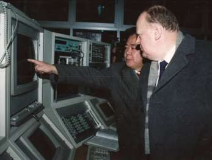

Иное дело — поездка в Императорский дворец «Гугун», где масштабы и великолепие производят неизгладимое впечатление или Институт физики больших энергий Академии наук Китая, куда я попал на следующий день и где стал свидетелем, проводимых там экспериментов на ускорителе встречных пучков.
Церемония встречи с Председателем Постоянного Комитета (ПК) Всекитайского Совета Народных Представителей (ВСНП) Вань Ли в зале Хэйбэй и приём в Западном зале ВСНП соответствовали высшей категории приёма зарубежных гостей.

Деловая в государственном смысле часть поездки состояла из переговоров с премьером Ли Пэном в особняке «Фанфэйюань» резиденции, где мы были размещены, и беседы с Первым лицом КНР Генеральным Секретарём ЦК КПК Цзян Цзэмином в его резиденции « Чжуннаньхай» .

—-

Китайская и белорусская пресса высоко оценили итоги визита.
Но... Через 3-5 дней после нашего возвращения из Китая заходит ко мне один из сотрудников Секретариата Верховного Совета.
— Станислав Станиславович, простите, но не могу от вас скрывать слухи, которые ходят среди сотрудников и депутатов. Очевидцы клянутся, что видели, как из грузового отсека Ту-154, летавшего в Китай, выгружали кожаную мебель. Утверждают, что это вы приобрели её в Китае для личных целей, так как никто иной не мог дать команду загрузить её с самолёт. Я говорю об этом вам, так как убеждён, что вы такого сделать не могли.
— Спасибо, попробую разобраться.
Зову к себе начальника секретариата Александра Петровича Антипенко. Он прямо с порога кабинета.
— Станислав Станиславович, таким взволнованным голосом вы могли пригласить меня только по одному вопросу. Да, да, да! Мебель из Пекина самолётом привезли в обход вас и меня. Опытный человек (назвал имя, фамилию, должность ) договорился с командиром экипажа. Всё по правилам, перегрузки самолёта не было. Факт установлен, действующие лица тоже, приказывайте, что делать.
Злоба очень медленно уступает место рассудительности, поиску справедливого решения. Если на высшем уровне творится такое, что можно вытворять на более низких уровнях государственного управления? Если честно открыто объяснить всем, что произошло, значит прежде всего высечь самого себя.
— Александр Петрович, приказ мой такой. Пусть любитель кожаной китайской мебели оплатит доставку этой мебели воздушным транспортом из Пекина в Минск по коммерческому тарифу. А шум подымать не надо, о нас и так идёт не лучшая слава.
Шеф Секретариата ВС со мной согласился, сказав, что денег, за которые можно продать мебель, наверняка не хватит на то, чтобы оплатить привоз. Зато запомнит, что жульничество наказуемо.

# Бразилия, Уругвай, Кабо-Верде,
(Колор ди Мелу, Лупа да Силва, Джордж Буш, Фидель Кастро, выходец из Беларуси, пакистанский приём, Александр Руцкой)
В 1806 году, спасаясь от войн Наполеона, в Бразилию перенёс свой двор португальский король Жуан VI. В 1821 году он вернулся в Португалию, оставив сына Педру I вице-королём Бразилии. Тот в 1822 году отказался подчиняться парламенту Португалии и провозгласил независимость Бразилии. В 1889 году его сын — король Педру II был свергнут в результате военного переворота. Бразилия перестала быть монархией и стала президентской республикой. Вот, пожалуй, и всё, что я знал о Бразилии, отправляясь в 1992 году на экологический саммит глав государств в Рио де Жанейро (Рио).
В Бразилию белорусская делегация добиралась рейсовым самолётом по довольно любопытному маршруту Москва — Мальта — Саале (Кабо-Верде) — Монтевидео. Сначала самолётом Аэрофлота мы пролетели над бразильским Рио и аргентинским Буэнос-Айресом к уругвайскому Монтевидео, а потом латино-американским Боингом-747 прилетели из Монтевидео в Рио с посадкой в Буэнос-Айрес. Маршрут был не очень логичным, потому что по инерции со времён СССР считалось, что Аэрофлоту не выгодно летать в Рио.
Саммит был посвящён устойчивому развитию человеческого общества и природы. На нём предстояло принять Повестку дня на XXI век и отнести экологический менеджмент к ключевой доминанте устойчивого развития, а также к высшим приоритетам промышленной деятельности и предпринимательства. Для меня полёт на саммит стал источником целого ряда полезных, по-человечески интересных поучительных встреч и обсуждений в Монтевидео и Рио.
Началось с Монтевидео, где в резиденции российского посла я узнал, что в Уругвае на три миллиона граждан приходится не менее 19 миллионов разгуливающих по прериям быков, стада которых периодически загоняют в загоны и отвозят на бойни. Далее на кораблях-рефреж ираторах туши плывут в Америку и Европу. Небезынтересно также, что Уругвай, как и все латиноамериканские государства — страна католическая. Но католицизм здесь особый. Костёл посещают по заверению российского посла не более 200 тысяч человек, тем не менее, все граждане вносят пожертвования для функционирования костёлов и считаются добропорядочными христианами.
Второй поучительной неожиданностью был выход из самолёта с великолепным кондиционированием в 38 градусную жару и стопроцентную влажность вечернего Рио, где в салоне первого класса я был одним из попутчиков Генерального секретаря ООН Бутроса Бутроса Гали. Из уважения к должности и возрасту я. естественно, попытался пропустить Генсека ООН перед собой из люка авиалайнера. Он, наоборот, пропускал вперёд меня. Произошла заминка.
Тогда Бутрос Гали пояснил.
— Я — высший чиновник (bureaucrat), а вы — сановник (dignitary). Мой долг вас пропустить первым.
Так методом проб и ошибок познавались мною и азы дипломатического протокола.
Саммит открылся на следующий день — 3 июня 1992 года. На него приехали 114 глав государств. Открывая саммит и конференцию, мой вчерашний учитель по правилам хорошего тона — Генеральный секретарь ООН Бутрос Гали отметил: «Никогда ранее в истории так много не зависело для вас самих, для ваших детей, для ваших внуков, для жизни во всем многообразии её форм от того, что вы делаете или не делаете».
Весьма эффектно приветствовал саммит президент Бразилии Фернандо Афонсу Колор ди Мелу или просто Колор. Молодой и красивый он находился на посту президента второй год, но через четыре месяца после саммита сам ушёл в отставку, спасаясь от импичмента. Выступления глав государств — президента США Джорджа Буша (старшего), президента Франции Франсуа Миттерана, премьера Великобритании Джона Мейджора и др. были приняты на саммите достаточно тепло. Ни одно выступление, однако, не было так восторженно принято, как выступление Фиделя Кастро. Я до сих пор помню, и, что самое удивительное, являюсь сторонником его аргументации. Он призвал развивающиеся страны не соглашаться безропотно, без финансовой поддержки высокоразвитых стран, выполнять вполне логичные строгие экологические требования.
— Вы разбогатели, осквернив Землю промышленными отходами и ядовитым дымом, а теперь хотите запретить нам покончить с нищетой и встать на ноги или же просто улучшить нашу жизнь теми же методами, как это делали вы. Нельзя в наших странах решить за наш счёт наши и ваши экологические проблемы. Развитые страны должны оказать безвозмездную поддержку развивающимся странам в плане освоения экологически чистых технологий.
Не уверен, конечно, что точно воспроизвожу его слова, но смысл их передаю без искажений. Саммит бурно аплодировал Кастро. Большинство делегатов встали. Я тоже встал. Главы государств — участники саммита — сидели в порядке латинского алфавита по названиям стран. Рядом со мной находился бельгиец, он вскочил и восторженно захлопал в ладоши, но потом опомнился и сел снова в своё кресло. Нельзя представителю демократической страны долго восхищаться диктатором, сколь бы логичны не были его заявления!
На саммите были одобрены несколько важных документов: «Декларация РИО по окружающей среде и развитию»; «Повестка дня на XXI век» (Программа 21); «Рамочная конвенция ООН об изменении климата»; «Конвенция ООН о биологическом разнообразии» и др. В совокупности они декларировали набор добрых пожеланий: люди должны иметь право на здоровую и плодотворную жизнь в гармонии с природой; охрана окружающей среды должна стать неотъемлемым компонентом процесса развития и не может рассматриваться в отрыве от него; удовлетворение потребностей в развитии и сохранении должно распространяться не только на нынешнее, но и на будущие поколения; уменьшение разрыва в уровне жизни между странами, искоренение бедности и нищеты принадлежит к числу важнейших задач мирового сообщества; государства должны исключить или уменьшить не способствующие устойчивому развитию модели производства и потребления.
Через 20 лет не трудно убедиться в утопичности этих правильных пожеланий и в обоснованности гнева диктатора Фиделя Кастро. Конференция ООН «Рио+20», состоявшаяся в июне 2012 года, констатировала: полтора миллиарда человек не имеют доступа к электричеству, два с половиной миллиарда человек не имеют туалета, почти миллиард человек ежедневно голодает, более трети всех известных видов грозит окончатель ное исчезновение из -за изменения климата… Если мы хотим оставить потомкам пригодный для жизни мир, проблемы деградации окружающей среды нужно решать сейчас.
Но вернёмся к 1992 году. Хозяева саммита в Рио организовали поездку белорусской делегации в Петрополис — бывшую резиденцию португальских королей в 70 километрах от Рио на высоте над уровнем моря порядка километра. Побывав там, можно понять, почему это место называют раем на Земле. Яркое солнце, но не жарко, низкая влажность, море цветов, красивые утопающие в зелени и цветах виллы. Как утверждают бразильцы, здесь самое большое казино в мире, так и не начавшее функционировать в качестве казино. В год окончания его строительства (1947-й) парламент Бразилии запретил в стране азартные игры. Тем не менее, круглый зал предполагаемого казино и дворцового типа отель рядом впечатляют. Ходит невероятное количество баек о тех, кто снимает здесь апартаменты и отдыхает. Что-то определённое утверж дать трудно: клиентам гарантируется конфиденциальность.
Известный всему миру Христос на горе и ботанический сад возле Рио запомнились нашей делегации и по своему величию, и по сравнительно небольшому кафе, хозяином которого оказался выходец из Беларуси. В его выбеленный одноэтажный дом под тростниковой крышей в тени вечнозелёных деревьев мы зашли и заказали минеральную воду. Хотелось утолить жажду. Узнав, кто мы и откуда, хозяин явил унаследованное от своих далёких предков истинно белорусское гостеприимство: принёс «от заведения» поднос с фужерами, наполненными почти до верха тем, что применительно к компании можно называть ромом, тростниковой водкой или самогоном. А для меня нет страшнее напитка, чем сахарный самогон. Раза два в жизни мне пришлось его по неведению попробовать, и я после этого, буквально, целые сутки изнывал от головной боли. А здесь всё опять шло к этому. Мои внутренние рассуждения были чисто совковскими: обидеть симпатичного, жизнерадостного, гостеприимного, давно не видевшего выходцев из своей древней родины людей, или смириться с предстоящей головной болью? Была, не была. Обижать не будем. Провозгласили тост, чокнулись фужерами с хозяином, выпили. До дна выпили. Все!
Хозяин незаметно исчез и сразу же вернулся со вторым подносом с такими же фужерами с тем же содержимым. Внутренние совковые переживания повторились, и под дружное «Жыве Беларусь!» мы повторили предыдущую процедуру, и, поблагодарив хозяина, быстренько покинули кафе, ссылаясь на необходимость торопиться. Понимали: третий тур мог привести к абсолютно нежелательным последствиям.
Оказалось, что бразильская тростниковая водка не ровня белорусскому сахарному самогону. Ни у кого из её попробовавших не было никаких нежелательных последствий! А кой у кого даже прорвалось.
— Эффект такой, как будто пили наш, житный.
Кроме официального выступления на саммите, которое наше министерство по окружающей среде подготовило мне так, что не пришлось вносить в него какие-то ощутимые правки, у меня были две индивидуальные встречи. Первая — непродолжительная с президентом Бушем, который вряд ли надеялся на переизбрание в приближающемся ноябре; вторая — с Фиделем Кастро, который во всех своих переизбраниях на Кубе никогда не сомневался. Буш был предельно вежлив, ориентировался в белорусских реалиях, сказал, что ему нравится ориентация Беларуси на демократию, права человека и рыночную экономику, что рад познакомиться со мной, чья подпись стоит под Беловежским соглашением. Конкретные деловые вопросы в разговоре с президентом США не затрагивались.
С Фиделем Кастро было проще. Мне нравился его кубинский патриотизм, и я, хотя и давно, но внимательно от корки до корки прочёл книгу под названием «Кубинская публицистика», изданную в Советском Союзе. Там была большая статья моего собеседника «История меня оправдает». Абсолютно не лицемеря, я признался, что мне нравится его статья и импонирует его личный героизм. Сказал также о своём участии в обучении кубинских студентов в СССР, после чего Кастро встал, но не позволил подняться из кресла ни мне, ни переводчику. Прогуливаясь перед нами, он рассказал о своём видении ситуации на Кубе и в мире, а также о его желании крепить связи с Беларусью.
Продолжая сидеть, я заметил, что полуботинки Кастро имеют очень высокий каблук, т. е. хотя он достаточно высок, но желает казаться ещё более высоким, настоящим гигантом. И это ему удаётся.
Экзотика для меня всегда привлекательна. Именно за это я был наказан в Рио. Получив приглашение от главы делегации Пакистана на официальный приём в окрестностях Рио, я поехал на него. Встретил там нескольких россиян и других представителей постсоветских стран. Приём по неизвестной нам тогда пакистанской традиции оказался безалкогольным. Пили соки и неизвестные мне ранее напитки, заедая тоже доселе мне неизвестными и для кого-то, по-видимому, очень приятными порошками и гранулами, насыпанными на серебряные большие и малые подносы. Было нетрудно понять, что тремя пальцами можно захватывать и класть в рот большими порциями то, что насыпано на больших подносах. Со снадобьями на маленьких подносах так поступать опасно — обжигают.
В итоге все «постсоветские» согласились, что поступили опрометчиво, «предали Польшу»: пошли не на польский приём, куда нас тоже звали. Исходили по-совковски из неправильных посылов: поляки, мол, рядом, шанс попасть на приём к ним в будущем не совсем маленький, а Пакистан — экзотика, интересно, забавно!
Это опытные зажиточные карьерные дипломаты идут на приём решать вопросы, которые в официальной обстановке продвигаются трудно, а совки — попить да поесть «на халявку» или же увидеть что-то до сих пор невиданное. Не поднялся тогда и я до уровня трезвых политических оценок, куда идти надо, куда — не следует, а куда — пустая трата времени. К счастью, в процессе дальнейшей работы довольно быстро исправился, но всё тем же низкоэффективным методом проб и ошибок.
Интересной частью путешествия в Латинскую Америку стало возвращение. Надо же такому случиться, что как раз в это время в Рио прилетел мой давний знакомый и в то время весьма мною уважаемый первый (и, как выяснилось позднее — последний) вице-президент России Александр Владимирович Руцкой. Он завоевал мои симпатии, когда в Кремле простецки взял меня за лацканы пиджака и громким шепотом сказал.
— Да я за Бориса Николаевича (Ельцина — С.Ш.) жизни не пожалею!
Не поверить ему было нельзя. Герой Союза, героически слетал в Форос за Горбачёвым, лётчик с более, чем четырьмя сотнями боевых вылетов, дважды сбит, раненый ушёл от преследования в Афганистане… и многое, многое такое, о чём другие и не мечтали.
И вот он возвращается из Венесуэлы, куда летал с официальным визитом, через Рио. Решил заглянуть на экологический саммит. Со мной — как со старым другом. Говорит не шепотом, как в Кремле, а громко всё в той же свойственной ему решительной манере.
— Какого чёрта уважаемому Ивану Степановичу Плющу — Председателю Верховного Совета Украины, в которой я родился, и вам — нашему с ним славянскому брату, возвращаться рейсовым самолётом? Приглашаю вас обоих на мой правительственный ИЛ-62, гораздо более совершенный, чем ИЛ-62 рейсовый. Прилетим быстрее и комфортнее. Да и поговорить в дороге есть о чём. Новых впечатлений — уйма! Самое главное — в океане на острове Саале поплаваем пока самолёт заправят.
Отказываться от столь заманчивого предложения мне и моему, без преувеличения, доброму другу — Ивану Степановичу Плющу, казалось неправильным, и мы, поблагодарив за предложение, согласились. Совсем не к месту, подумал я, вспоминать, что сначала Александр Владимирович гневно осудил Беловежское соглашение. Понял потом, наверное, что ошибся. Неожиданные ходы делал: фракцию «Коммунисты — за демократию», названную шутниками «Волки — за вегетарианство», создал, но и она помогла Ельцину при избрании голоса собрать, компартию России с человеческим лицом создать пытался... Убедил я себя в итоге, что положительный человек вице-президент России, но, убедил, как оказалось, ненадолго.
Минут через 15 после взлёта Александр Владимирович пригласил нас в салон в хвостовой части самолёта. За столиком для пяти человек сидел он, его жена и его помощник. Когда мы сели, комплект оказался полным. Любой из нас мог выйти, подняв сидевшего во главе стола Руцкого.
Стюардесса поставила на стол бутылку водки «Smirnoff», хлеб, холодные закуски. Стопки были устойчивыми и ёмкими. После первого их наполнения в бутылке 0,8 Л осталось менее половины содержимого. Не помню, каким был первый и остальные тосты, но хорошо помню, что активно пьющими были только вице-президент России и его помощник. Остальные пригубливали, но не пили. Сначала Руцкой корил нас за сдержанность, потом перестал замечать. Время от времени он допускал недопустимые в приличном обществе высказывания, в том числе и в адрес очень милых женщин — своей жены и стюардессы, систематически наведывавшей нас то с очередной бутылкой, то с новой закуской.
Я вспомнил почему-то Ельцина и китайское: «беда, коль пигмеи пытаются изобразить себя титанами». Борис Николаевич мог выпить лишнее, и не один раз я был свидетелем этого, но чтобы сквернословить или изменять решение под действием выпитого… Никогда!
Положение у нас с Плющом аховое! Возражать бессмысленно — вице-президент абсолютно уверен в своей правоте и уже давно никого не слышит и не пытается слушать. Убежать некуда, защищать женщин словами — не по-мужски. Молчим, не пьём, хотя я уже и не прочь выпить, чтобы снять стресс, но Иван Степанович — глыба! Ни грамма, а знаю, что умеет. Стремлюсь поступать, как он.
Вице-президент важничает и всё увереннее и увереннее несёт сплошную околесицу.
— Договорился в Венесуэле о поставках тропических фруктов в Россию. Наконец-то, россияне получат нужные витамины. Да давно бы имели, но вот Гайдар, сколько его на путь истины не ставил, не понял во время своего премьерства важность фруктов из тропиков и вообще в экономике ничего не понимает, сколько его не учил. Не присмотри я, наподписывал бы писем с арифметическими ошибками, хотя сам — человек честнейший, но невнимательный, а окружение, то ещё! Не то, что палец, руку откусить способно.
Монолог прервался, когда лайнер приземлился на острове Саале. Вице-президента России встречал премьер островного государства Кабо-Верде — бывшей португальской колонии Острова Зеленого Мыса с населением меньшим, чем собирается в праздничный день на Красной площади.
К делу подключился помощник Руцкого, который до этого времени пил в нашей компании и молчал.
— Поприветствуйте премьера, подчеркните важность наших с его страной контактов.
И вице-президент России начал объяснять премьеру Кабо-Верде важность российско-кабовердийских отношений с таким пафосом и вдохновением, как рассказывал мне с Иваном Степановичем Плющом о влиянии тропических фруктов из Венесуэлы на жизнь российских граждан. К счастью, обмен мнениями с премьером островного государства (кстати, выпускником Гарварда, как мне сообщил сопровождавший его советник) был недолгим.

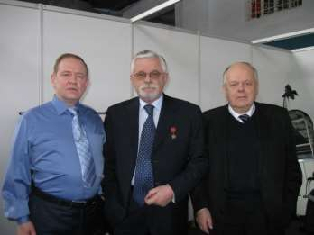

Поехали на пляж по единственной на острове не широкой асфальтной дороге, ведущей от аэропорта к, снова же, единственному на острове посёлку с пятью тысячами обитателей и с бесконечными «пляжами» вокруг. Охранники вице-премьера — атлетического телосложения весёлые и вместе с тем очень серьёзные и ответственные ребята — стремились уберечь Александра Владимировича от накатывающихся на песчаный берег волн, а он, восклицая, «будет буря, мы поспорим и поборемся мы с ней», рвался в океан. Успокоился лишь тогда, когда при всём старании охранникам не удалось уберечь его от выброса волной на берег. Волны сравнительно быстро смыли с песка отпечаток тела вице-президента и следы унёсших его охранников.
После взлёта Руцкой попросил позвать командира авиалайнера. — До Москвы сделайте посадку в Киеве.
— Товарищ генерал, есть проблемы…
Командир не успел договорить, вице-премьер прервал его.
— Приказываю сделать посадку в Киеве.
— Слушаюсь. Разрешите исполнять.
— Исполняйте.
Посадку в Киеве Руцкой решил сделать ради Ивана Степановича
Плюща, которого такой жест заставил смутиться и попробовать возразить, мол, к чему такие заботы сажать громадину с почти сотней человек на борту. Но доброжелательность генерала оказалась безмерной. В Киеве мы сели, Плюща высадили и полетели в Москву.

—-

Детали полёта в Бразилию в 1992 году я вспомнил по пометкам в старой рабочей тетради, готовясь к поездке в польский Гданьск в конце сентября 2011 года. Ежегодно там 29 сентября в день рождения первого постсоветского президента Польши Леха Валэнсы происходит вручение международной премии его имени. Как член жюри по присуждению этой премии я всегда с удовольствием летаю в Гданьск на заседания жюри и торжества вручения премии в старинном Дворце Артуса. Кроме того, не могу отказаться от удовольствия очередной раз взглянуть на старинный Гданьск — колыбель польского профсоюза «Солидарность», испытать радость общения со старыми друзьями и членами жюри, такими как бывшие президенты Чехословакии — Гавел, Румынии — Константинеску, Болгарии — Желев.

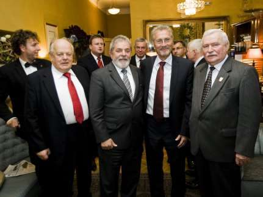

Премия 2011 года присуж дена нами бывшему президента Бразилии Луису Инасиу Лула да Сильво, которого мы кратко называли Сильво. Главная его заслуга на посту президента — решительное снижение процента граждан Бразилии, находящихся на уровне бедности. Процесс этот продолжает его преемница президент Бразилии Дилма Вана Русеф. По заверениям экспертов близится время, когда в этой стране не нужно будет отгораживать бронемашинами массивы хижин бедняков (фавеллы) от международных мероприятий типа саммита 1992 года. Тогда члены делегации и километра не могли проехать без бронемашин сопровож дения, а за городом — без барожирующих над вашим автомобилем вертолётов с пристёгнутыми к сидениям стрелками у открытых люков.

# Монголия
Приятная неожиданность произошла осенью 2008. Меня пригласили на открытие Фестиваля культуры и спорта в Улан-Батор — столицу Монголии. Многие руководители этой страны получили образование в СССР. Некоторых из них я знаю ещё со времён СССР.
Сведения о давней истории Монголии, приведенные в БСЭ и школьных учебниках советского времени, расходятся с тем, что доводили до нашего сознания гиды музеев и политики этой страны.
Раньше я был уверен, что путём военных кампаний, отличающихся невиданной жестокостью, Чингисхан, правивший Монголией с 1206 по 1227 год, создал самую крупную империю во всей мировой истории. Её население составляло свыше трети тогдашнего 300 миллионного населения Земли. Однако мои старые и новые монгольские знакомые единодушно утверждали, что Чингисхан — деликатнейший правитель, который проводил мудрейшую политику, оставляя на завоёванных землях прежних руководителей и лишь возлагал на них обязанность платить скромную дань. Наказывались лишь те, кто делал это не так, как было предписано.
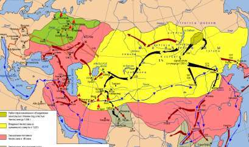

Культ Чингисхана в Улан-Баторе огромный. Аэропорт Чингисхан, лучший отель — Чингисхан, гигантская скульптура у входа в парламент Чингисхан, в музеях и галереях — географические карты империи 1227 года и Чингисхан во множестве величественных поз.
Очень хотелось как можно лучше во всём этом разобраться, но мне не повезло. Я сильно отравился и не смог не только везде побывать, но и выступить в намеченное для этого время в парламенте — Великом государственном хурале. Однако болезнь позволила мне детальнее познакомиться с тем, что не входило первоначально в программу поездки. Левомицетин поставил меня на ноги через сутки, и местом моего выступления стал правительственный приём в честь Международного фестиваля.
Приём проводился на бывшей в даче Чойбалсана. Мои монгольские друзья вспоминали его недобрым словом: уничтожил 36 тысяч «врагов народа», разрушил сотни монастырей и храмов. Всё как и в СССР и в те же 1937-38 годы, только населения меньше, поэтому и жертв меньше. При Чойбалсане была запрещена религия. Не знаю, как выглядела прежде его дача, сейчас она являет собой роскошный дворец. Гигантский участок лесистого предгорья, что в условиях Монголии — большая редкость, как мне пояснили, был капитально отгорожен от остального мира ещё при нём.
Небезынтересным было для меня, что Монголия многим обязана СССР и России. Мог только добавить — не только в хорошем, но и в дурном смысле. В миниатюре здесь было повторение событий в СССР. В 1952 году к власти пришёл соратник Чойбалсана Цэдэнбал, в 1956 и 1962 гг. был осуждён культ личности Чойбалсана, в 1984 году Цэдэнбал при содействии ЦК КПСС был смещён со всех постов «по болезни» и до смерти в 1991 году был «на пенсии» в Москве.
До 1990 года Монголия была социалистической страной с единственной правящей Монгольской народно-революционной
партией. (МНРП). Сейчас не без трудностей Монголия строит парламентскую республику. Демократии и прав человека в ней несоизмеримо больше, чем в Беларуси.
По Конституции 1992 года Глава государства — президент, избираемый на альтернативной основе путём всеобщего прямого и тайного голосования сроком на 4 года. Президент может переизбираться ещё на один срок. Законодательную власть осуществляет парламент — Великий государственный хурал (ВГХ) в составе 76 членов, избираемых всенародно путём тайного голосования сроком на 4 года. Исполнительную власть осуществляет правительство, формируемое ВГХ по предложению премьер-министра и согласованию с президентом. Кандидатуру главы Кабинета министров представляет на рассмотрение ВГХ президент. Правительство подотчётно ВГХ. На местах власть осуществляют органы местного самоуправления.
Я специально подробнее описал политическую ситуацию в бывшей социалистической МНР, ставшей демократической Монголией, чтобы отметить, что и в Азии между коммунистическим Китаем и довольно далёкой от демократии Россией строится демократическое государство. Здесь несколько партий, они борются на выборах за места в парламенте, создают коалиционные правительства. Массы протестуют, когда считают, что имеет место недобросовестность членов избирательных комиссий или иная фальсификация. Выходят на площадь. На это не нужно получать разрешение.

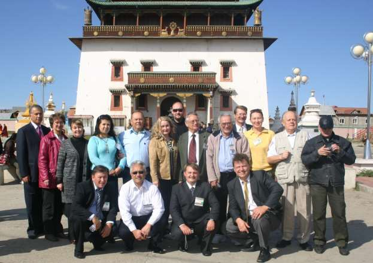

Наличие множества полезных ископаемых в Монголии сделали Улан-Батор местом размещения офисов зарубежных фирм, а сам город стал сочетанием небоскрёбов, роскошных коттеджей, юрт и старой городской инфраструктуры. Население его выросло за последние 20 лет почти в три раза, а дороги и улицы изменились слабо. Таких беспросветных автомобильных пробок как в Улан-Баторе я, пожалуй, нигде не видел. Если ночью из аэропорта до гостиницы мы приехали за неполных 20 минут, то днём на обратный маршрут нам понадобилось более трёх часов. Монголы — люди спокойные, доброжелательные, если по-русски что-то спросишь на улице, обязательно привлекут того, с кем вместе всё детально разъяснят и пожелают успеха. Легковых автомобилей — невиданное множество: с правым и левым рулём, преимущественно бывшие в употреблении японские и корейские, но есть и роскошные лимузины представительского класса.

# Япония
Японией нельзя не восторгаться. Однако понять, кто такие японцы и что такое Япония не просто. Для этого нужно, наверное, с японцами в Японии «пуд соли съесть», а они стремятся солить пищу как можно сдержаннее. Да и был я в Японии совсем недолго: за пять поездок чуть более месяца. Но и за это короткое время впечатлений много, хочется ими поделиться.
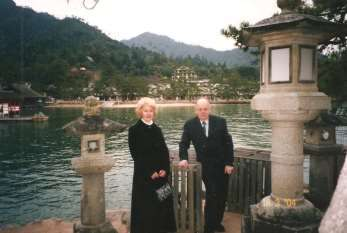

Японцы любят красоту, дисциплинированность и пунктуальность. Доктор Кван — кореец, много лет проживший в Японии, хорошо знает эту страну и её обычаи. В этой 128-миллионной стране есть единственная диаспора иностранцев — корейская. В ней порядка 600 тысяч человек. И хотя из приведённых цифр следует, что на одного корейца в Японии приходится более 210 японцев, доктор Кван организовал мою поездку по южной Японии для чтения публичных лекций, как он сказал, опираясь на корейскую диаспору. Он сопровождал меня с моей женой во время всей поездки, заблаговременно договорился о моих встречах в университете, парламенте Токио, с несколькими губернаторами, каждый вечер вручал мне детальный план проведения следующего дня.
— Я планирую здесь всё так, как принято в Японии, — говорил он.
Не сразу я уловил, что Кван — профессиональный менеджер, успешно занимающийся различного рода бизнесом, в том числе и организацией публичных лекций. Когда первый раз я из Сеула летел в Токио на конференцию и имел там после окончания конференции один свободный день, доктор Кван предложил мне прочесть в этот день,как он сказал, «пробную публичную лекцию на тему «Куда идут бывшие республики Советского Союза».
— В вашей книжке «Неокоммунизм в Беларуси» эта тема раскрыта по состоянию на 2000-2001 годы. Уверен, что вы и дальше следите за происходящим.
— Слежу.
— Тогда договорились. Организацию я беру на себя. Переводить, как и в Корее, будет господин Хироюки.

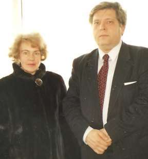

Детали организации и проведения этой лекции я выяснил позднее. А начиналось всё так. Мы подъехали к небольшому зданию, расположенному на горе. Ко входу вела широкая длинная лестница. На её ступеньках стояло несметное количество обуви. Я тоже снял туфли, поняв, что в это помещение в обуви не входят. Не побоялся перепутать свои туфли с иными при выходе. Мои были сантиметров на пять длиннее остальных. В помещении, которое логично назвать большим предбанником, тоже стояло множество обуви. Прошёл в зал, где, подумал, будет лекция. На полу в нём перед огромным плазменным экраном сидели человек 150—200. Оказалось, что это холл, в котором посетители мероприятий обычно проводят перерывы. Мне пояснили, что с другой стороны есть такой же холл и что в нём тоже на полу сидят люди. Далее был главный зал. И там тоже все сидели на полу.

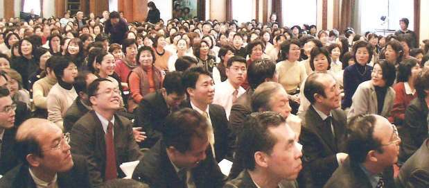

Оказывается, что мой дорогой доктор Кван так разрекламировал лекцию, что на неё купили билеты значительно больше людей, чем вмещал зал. Более того, первоначально предполагалось, что слушатели будут сидеть на стульях. Представляю, что было бы у нас в таком случае!
А японцы образовали цепочку и, передавая стулья друг другу, удалили 300 стульев из зала. В зале сели на пол в два с лишним раза больше человек, чем удалили стульев. Остальные разместились в двух холлах перед плазменными экранами. Везде имелись микрофоны для того, чтобы задать вопросы.
Я никогда не забуду эту лекцию и эту аудиторию. Более благодатных слушателей у меня не было.
Организатором всех моих лекций в Японии был, повторяю, кореец доктор Кван, а переводчиком и в Японии и в Корее — японец, постоянно проживающий в Корее Хироюки Ямакава, окончивший в Москве университет имени Патриса Лумумбы.

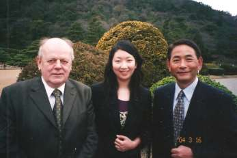

План моего очередного дня всегда составлялся с минимальной дискретностью до двух минут, т. е. одно дело от другого могли отделять только две минуты. Выполнялся план, практически, без опозданий и опережений, не глядя на капризы погоды и автомобильные пробки. И лишь один раз в последний день нашего нахождения в Японии на острове Окинава план был нарушен: из-за проливного дождя, начавшегося на несколько часов раньше, чем следовало из интернетовского прогноза. Кван считал, что после прочтения семи публичных лекций в различных городах Японии я заслужил два часа отдыха — прощальное купание в море. Но его пришлось заменить удлинением пребывания в океанарии. Там за отделяющим нас от морской воды стеклом невообразимо большого размера и десятидюймовой (!), т. е. 25-сантиметровой толщины, плавали экзотические рыбы, включая то ли шести, то ли семитонную акулу-молот.
Итак, об университетах. Я познакомился в Японии только с одним из них — университетом Васседа в Токио. Вступительные экзамены в университет сдаются в марте, учебный год начинается первого апреля. Постороннему войти на территорию университета в марте невозможно Для нас по предварительной договорённости с профессорской лигой (клубом) Токио сделали исключение. Полицейские, которым при несении службы и вообще в форменной одежде запрещен вход на территорию университета, пропускают к нему в марте только сотрудников университета и сдающих экзамены.

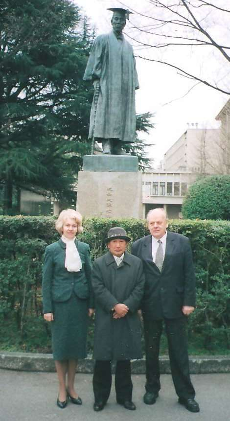

На памятнике 1847 года первому ректору надпись: «Он сделал Шекспира понятным японцам». Преподаватели, показывавшие университет были немногословными. Университет, как университет. Созданы все условия для занятий, самостоятельной работы, спорта и отдыха студентов. По нашим меркам — очень много компьютеров. Что ещё можно узнать, когда в марте нет занятий и нет студентов.
Самым важным, полноценным университетом, и в описываемую поездку и в поездках на конференции и симпозиумы, стала для меня сама Япония и её обитатели.
Началось с посещения парламента города Токио. Приезжаем туда в точно указанное в моём рабочем распорядке время. Встречает председатель комиссии по международным делам. В зале комиссии начинается деловой разговор. Первые слова председателя комиссии для меня — неожиданность.
— Почему в Токио нет посольства Беларуси?
— Как так нет? Есть посольство и посол есть — Пётр Кравченко. Непродолжительное молчание. После чего председатель
комиссии по иностранным делам парламента города Токио поясняет, что у них существует известная всем традиция, которую доводит до сведения послов глава дипломатического корпуса — дуайен: после прибытия в Японию послы зарубежных стран наносят визит вежливости в Комиссию токийского парламента по зарубежным делам. Визит помогает наладить деловое сотрудничество. Однако посол Беларуси такой визит не наносил, поэтому мы не знаем, что здесь есть ваше посольство.
Я вспомнил бродившие по Минску слухи.
— Как это Кравченко добился у Лукашенко назначения его послом, ведь тот хорошо знает, что он продвигает только личные дела и кого угодно продаст?
— Пообещал, сказав, что это только ему под силу, организовать триумфальный приезд Лукашенко в Токио на зимнюю олимпиаду, а также встречу с императором Японии.
В иронической форме я сообщил об этом моему собеседнику. Тот рассмеялся.

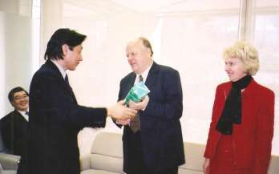

— Их величества император Акихито и императрица Митико с иностранными политиками не встречаются.
Во время нашего разговора шло заседание парламента. В перерыве в зал комиссии зашёл спикер и обратился ко мне.
— Вы возглавляли парламент страны, а я только парламент города. Но мы тоже решаем довольно серьёзные задачи. Распределяем, к примеру, бюджет Токио, который значительно превышает бюджет Канады.
— Уважаемый господин председатель, я понимаю ваш юмор. У меня нет оснований важничать. Бюджет, который утверждал во время моего председательства Верховный Совет Беларуси, был очень и очень маленьким по сравнению с упомянутым вами бюджетом Канады.
— Но ваша республика, теперь — независимая страна и, в частности, вы лично известны всему миру. В лесах Беларуси, в пуще (это слово спикер произнёс на русском со «щ», звучавшем как «с»), найдено выдающееся политическое решение, приведшее к бескровному разделению империи с ядерным оружием на независимые государства.
После ещё нескольких любезностей спикер извинился и сказал, что ему пора идти работать. Пригласил нас заглянуть в зал, где будет вести сессию. Туда, кстати, может войти и сесть на специально предусмотренные места для гостей на «галёрке» любой человек, находящийся в здании парламента. Войти в здание парламента также может кто угодно, предъявив документ, удостоверяющий личность.
Посидев минуты три, я собрался уходить, но переводчик Хироюки Ямакава сказал, что из соображений вежливости нужно остаться ещё на некоторое время и продолжил пересказывать суть речей выступавших. И вдруг.
— Теперь вам нужно встать и поклонится.
Встаю, кланяюсь залу. Депутаты и спикер тоже встали и приветствовали меня аплодисментами. Оказалось, что спикер рассказал депутатам обо мне, о том, что моя подпись стоит под Беловежским соглашением. Сказал, что я в зале, в ложе для гостей.
Библиотеки, музеи и иные культурные центры в Токио бесплатные. Не расскажи нам об этом первый секретарь посольства Российской Федерации, мы бы, наверняка задумались, что посетить, а что — не стоит. Тогда были свежи в моей памяти стоимость посещения смотровой площадки небоскрёба The Empire State Building или площадки на крыше торгового центра в Нью-Йорке, разрушенного 11 сентября 2001 года террористами, или, например, плата за подъём и 7-10 минутное нахождение на смотровой площадке телевышки в Торонто.
А здесь — всё бесплатно. Вас любезно приглашают на смотровую крытую (всепогодную!) застеклённую площадку-перемычку между 42-ми этажами двух небоскрёбов, вручают красочный буклет. Гиды на японском, китайском, корейском, английском рассказывают о Токио, предлагают посмотреть в буссоль на город, окрестности и даже на Фудзи, если видимость хорошая. Затем вас спускают на лифте другого небоскрёба и, улыбаясь, глядят вам в глаза, как будто вы их воистину осчастливили. И невольно веришь: обслуживающий персонал действительно счастлив, потому, что доставил вам радость. Ну чем не университет или колледж хороших манер и доброжелательности?

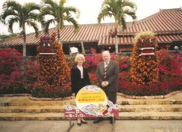

Япония во всём заставляет удивляться. Страна расположена на Японском архипелаге, состоящем из более 6800 островов. Четыре крупнейших острова — Хонсю, Хоккайдо, Кюсю, Сикоку — составляют 97% её общей площади, которая, в свою очередь лишь в неполных два раза больше территории Беларуси. Самый большой остров на юге — Окинава. Он расположен примерно на одинаковом расстоянии между Кюсю и Тайванем. До 1972 года им распоряжались американцы. Теперь на острове есть американские военнослужащие, в частности, авиационная база Кадэна, но управление Окинавой перешло в руки японцев.

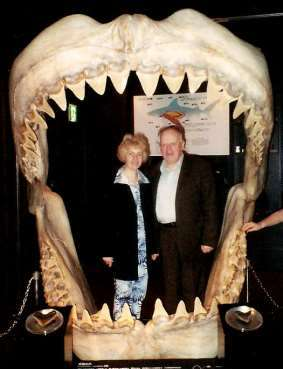

Нельзя не упомянуть о том, что Окинава — рекордсмен по долгожительству. Здесь средняя продолжительность жизни мужчин 88 лет, а женщин — 92 года. На 10—12 лет больше, чем в остальной Японии! На Окинаве у меня были две публичные лекции. Одна — в столице префектуры Окинава — городе Наха, другая — в городе Окинава. С ними было всё благополучно, как и со всеми остальными лекциями в Японии.
Более всего меня поразил на Окинаве мемориал погибшим во Вторую мировую войну японцам. Его отличие от памятников Европы в том, что японцы не знают, что такое могила неизвестного солдата. На обязатель ном элементе воинской экипировки — большом металлическом пулезащитном нагрудном медальоне выгравированы сведения о его владельце. Благодаря этому, все погибшие военные японской армии идентифицированы. Имена всех погибших на Окинаве, а это более 238 тысяч, высечены на плитах из чёрного гранита, установленных возле храма-мемориала. Сам храм со скульптурой скорбящего Будды внутри — творение архитектора, два сына которого здесь погибли. Окинава — единственное место американо-японского сухопутного
сражения во время Второй мировой войны. Захватив остров, американцы превратили его в стратегически важную военную базу. Располагая более совершенным вооружением, артиллерийской и авиационной поддержкой с моря, американцы потеряли на Окинаве более 70 тысяч человек, примерно в три раза меньше, чем японцы.

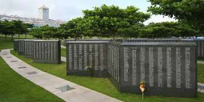

Из Окинавы мой путь лежал на север, на остров Сикоку в административный центр префектуры Эхимэ город Мацуяму. Город издавна известен своими лечебными минеральными водами. В нём во время русско-японской войны 1904—1905 годов лечили раненых русских военнопленных. Умерших хоронили на кладбище, на скалистой горе. В день нашего прилёта в Мацуяму исполнилось сто лет со дня первого захоронения, и префект во время нашей с ним встречи спросил, не хочу ли я возложить цветы к подножию обелиска на кладбище.
Я поблагодарил за предложение, и мы с женой поехали на кладбище. Возложили венки и цветы, участвовали в траурном, боюсь этого слова, митинге, посвященном памяти воинов.
Как бы был я счастлив, если бы могилы и места захоронения советских воинов времён отечественной войны были в таком состоянии, как захоронения столетней давности в Мацуяма. Идеальная чистота, идеальный порядок, идеальное состояние столбиков-надгробий с надписями на русском и японском языках: кто похоронен, когда, кем служил на флоте, когда и где родился. На таблички занесены данные со слов раненых, многие из которых, служа на российском флоте, оставались неграмотными. Поэтому кое-что в отдельных надписях может вызывать вопросы. Я же понял, что по меньшей мере из 94 умерших от ран и похороненных здесь — семь белорусов.

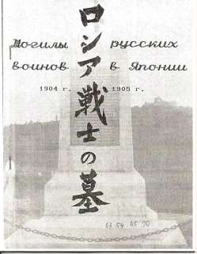

Учащиеся гимназий Мацуямы, а их в городе 22, соревнуются за право ухаживать за захоронениями воинов. Занявшие первое место получают право досматривать могилы японских военных, те, кто на втором месте, ухаживают за могилами военнопленных российской империи. Мне японцы вручили брошюру со списком похороненных и перепечаткой написанного на надгробиях. Приехав домой, я передал брошюру в Институт истории нашей Академии наук.
Мацуяма город студентов, в 1923 году здесь открыт университет, и издавна — город поэтов. 3000 поэтов-любителей ежегодно соревнуются в Мацуяма в искусстве хайку — умении описать момент в трёх строках. В маленьком стихотворении каждое слово на вес золота, каждый образ на счету. Сказать многое, используя мало слов, — главный принцип хайку.
Узнав всё это, я стал побаиваться за восприятие здешними жителями своей предстоящей многословной лекции. Но всё закончилось хорошо, а с группой слушателей, моим уважаемым переводчиком и женой я отправился в ботанический сад. В Муцуяма он имеет равнинную часть с небольшой речушкой и старинной рукотворной дамбой, образующей пруд, а также часть горную. Поэтому в нём произрастают растения нескольких климатических поясов. В пруду — разноцветные большие карпы, которых разрешается кормить только продаваемыми здесь же «пирогами» — воздушными пористыми плитками, мало отличающимися по виду и массе от упаковочного пенопласта. Учитывая плотность плиток и их стоимость, можно быть уверенным, что ими рыбок, смахивающих по комплекции на годовалых поросят, не перекормят. В ботаническом саду всё красиво, и не удивительно, ведь наводят здесь красоту уже 400 лет.

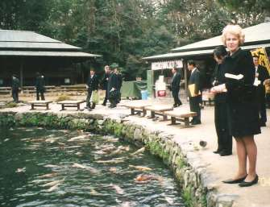

Следующий город, где доктор Кван организовал мою публичную лекцию о Беловежском соглашении и встречу с мэром, — Фукуока — самый большой город на острове Кюсю. Название Фукуока означает «счастливый холм». В рекламных проспектах перечислен целый ряд символов города: камфорное дерево, камелия масличная, чайка обыкновенная, овсянка красноухая. За короткое время пребывания в Фукуока ни я, ни моя жена Ира не уловили, что связывает город с этими символами, а мэр господин на нашей встрече ничего об этом не сказал. Он отметил, что Фукуока — четвёртый по значению город Японии — после Токио, Осака и Нагоя, сообщил, что город считается лучшим в мире для шопинга и что, хотя он в этом не сомневается, но не он автор такого утверждения, а авторитетный британский журнал Monocle, который провёл по этому вопросу специальное исследование.
Лекция моя прошла нормально, было много вопросов и одна просьба — сделать общий снимок. Я переадресовал вопрос к доктору Квану, так как не мог себе представить «общий снимок» с 900—1000 слушателей, находящихся в зале. Кван сказал, что просьба понятна и снимок будет сделан сразу же после ответов на вопросы.
На сцене зала, где я выступал, находились четырёхступенчатые станки для хора. Доктор Кван взял микрофон и начал командовать. Пригласил на сцену мужчин, сидевших на приставленных стульях вместе со стульями, на которых они сидели. Их оказалось человек 15—20. Попросил этих мужчин сдвинуть станки. Образовалась четырёхступенчатая лестница шириной метров семь-восемь. Перед ней поставили в ряд принесённые стулья. Попросил ещё нескольких человек подняться на сцену вместе со стульями, чтобы ряд стульев имел такую же ширину, что и лестница. Потом последовали команды: ряды от первого до пятого — на сцену. Затем от шестого до десятого и т. д. Неизменным для всех фотографирований оставался сотворённый под командованием Квана ступенчатый подиум со стульями, доктор Кван, переводчик Хироюки Ямакава, моя жена Ирина и я. Мы занимали четыре центральных стула.

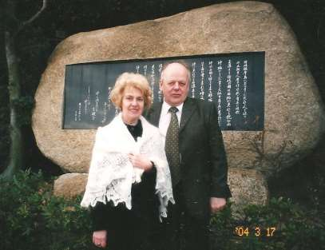

Тогда, в 2004 году, цифровых фотокамер с хорошим разрешением ещё не было. Местный фотограф делал снимки высококачественной широкоплёночной камерой. Обещал прислать один из снимков и мне, но я его так и не получил. Боюсь, что в этом виноват не он, так как японцы — люди исключительно обязательные.

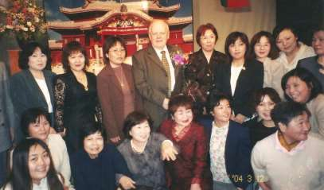

Название города, куда мы отправлялись на следующий день, известно всему миру — Хиросима. Хирóшима, как произносят японцы, делая ударение на «ó». Не один раз доводилось мне рассказывать о бомбе, которую сбросили на Хиросиму американцы, о том, как великие физики эту бомбу придумали и к чему привели их гениальные открытия и находки. На уровне развития науки тех дней для бомбы, сброшенной на Хиросиму понадобилось сто килограммов обогащённого урана. А мощность взрыва была эквивалентна взрыву двенадцати с половиной тысяч тонн тротила. Глядя в музее Хиросима на то, что этот взрыв натворил, содрогнётся каждый. Погибли сразу же и умерли вскоре, претерпев чудовищные страдания, 130 тысяч преимущественно мирных граждан, детей, женщин, стариков. Ещё 140 тысяч человек умерли за полгода от лучевой болезни.
После ознакомления с музеем ядерной бомбардировки и осмотра Мемориального парка Мира я понял, что читать лекцию на тему «Хиросима и Чернобыль здесь в Хиросиме, в зале, расположенном в 500—700 метрах от эпицентра взрыва, нельзя так, как я делал это в других местах!
Прежде, чем начать лекцию, я попросил почтить память погибших от ядерных бомбардировок, ядерных катастроф и ядерных аварий. Встали, провели минуту молчания. Далее рассказал о моём видении виновности и о виновниках катастрофы в Чернобыле. Рассказал примерно так, как написано в разделе о Чернобыле этой книги. А потом разговор был о том, что мы называем духовным Чернобылем, а японцы — безответственность ю политиков при принятии стратегических решений. Лекцию в целом я прочёл не так, как обычно, а почти на одних эмоциях, но, простите за нескромность, думаю, что получилось неплохо. Желающих получить автограф было несметное множество.
На одном из автографов я прозрел… 
Дело в том, что я никак не мог понять, что происходит на самом деле. Менеджером оплачен мой с женой прилёт-отлёт, мы ездим в первоклассных автомобилях, летаем, где логично, самолётами, останавливаемся в превосходных отелях, наконец, я получаю приличный по моим понятиям (и даже очень приличный, по понятиям моей жены) гонорар.
Так причём здесь автограф?
Очень просто. Об автографе попросил по-русски выпускник университета имени Патриса Лумумбы. За пять лет учёбы в Москве он, по-видимому, слегка отвык от хороших японских традиций и, в отличие от остальных, протягивающих для моей подписи открытки, календарики, записные книжки, ещё какие -то красивые карточки, попросил расписаться на входном билете. Я рассмотрел билет, к слову, он тоже выглядел достаточно красиво, Естественно, ничего, написанного иероглифами, я не понял. Но стоимость билета была обозначена арабскими цифрами и стоящим за ними значком «YEN». Это-то я понял! И, вспомнив число слушателей на лекциях, тоже понял, что никакого таинственного спонсора моих лекционных поездок нет. Есть только разумный менеджер, который профессионально всё планирует, организует и платит по совести привлечённым. Не забывает о налогах и о себе.

# Южная Корея
В апреле 1992 года на моё имя пришло письмо-приглашение и проспект с предварительной программой, планируемой в Сеуле конференции по проблеме объединения Кореи. Тогда я не знал порядка планирования таких конференций и возмутился тем фактом, что в программе я фигурировал в качестве выступающего с сообщением на тему «Объединение Кореи. Взгляд из Европы». Потом заметил, что возле некоторых фамилий, в том числе и возле меня, напечатано «no confirmed» — не подтверждено. Поскольку мне не позволено было выезжать за границу без решения Верховного Совета, я попросил помощника подготовить вежливое письмо-отказ мол, из-за большой занятости неотложными государственными делами приехать не могу.
На следующий день помощник принёс проект желаемого письма и большой красивый запечатанный картонный конверт от той же организации, что и вчерашнее письмо-приглашение. В конверте были два комплекта авиабилетов туда и обратно на рейсы Минск-Франкфурт и Франкфурт-Сеул. В прилагаем к билетам послании говорилось, что Федерация за мир во всём мире будет рада приветствовать на конференции меня и «сопровождающее меня лицо», берёт на себя все расходы по поездке, а визовые вопросы будут без задержки решены прямо в аэропорту Сеула.
Что таить, соблазн слетать в Корею на таких условиях, да ещё первым классом от Франкфурта до Сеула и обратно во Франкфурт, был велик. Мой, как оказалось, искушённый в подобных делах помощник — Леонид Захарович Комаров — посоветовал не горевать по поводу того, что сейчас перерыв между заседаниями ВС, а наоборот радоваться и уйти на время путешествия в краткосрочный очередной отпуск. Так я и сделал.
Поездка в Сеул и подготовка к ней стали ещё одним жизненным университетом, практическими занятиями по правилам общения на высоком уровне. Оставаясь в рамках советских представлений, я не знал тогда, что в их капиталистическом мире сопровождающим лицом бывает обычно жена или охранник. Жена, к счастью, тоже не знала. Точнее, и подумать не могла, потому что мыслила по-советски: представьте себе, что на научную конференцию в СССР я приехал бы с сопровождающим лицом — женой! В кулуарах бы только и говорили: спятил профессор — без жены уже и приехать не в состоянии. Хотя переводчиком приглашающая сторона обеспечивала, я решил, что лучше всего быть с человеком, компетентным в международных делах и знающим языки. По этим причинам сопровождающим лицом стал мой советник академик Анатолий Арсеньевич Михайлов.

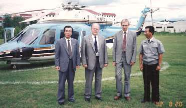

Кроме участия в конференции в Сеуле мы имели возможность побывать с ним в Пуссане и ознакомиться с рядом заводов фирмы DAEWOO. От завода к заводу летели на вертолёте корейского производства «Сикорский», в кабине которого можно спокойно разговаривать. Представитель фирмы DAEWOO обратил на это наше внимание, сказав, что именно корейцам удалось так усовершенствовать американскую модель вертолёта. Он довольно хорошо говорил по-русски, рассказывал нам в каждом очередном перелёте о месте предстоящего посещения, но лингвистическая и вообще смысловая помощь академика Михайлова была очень кстати.
В Корее я, пожалуй, скорее, как физик, а не как Председатель ВС РБ находил для себя много нового. Был приятно удивлён, увидев реализацию на практике новейших технологических процессов, например, резку дюймовой толщины гигантского стального листа
плазмотроном с точностью до долей миллиметра для корпусов
морских нефтеналивных танкеров. Когда в полёте представитель фирмы сказал, что мы такое увидим, я, полагая, что резка происходит в цеху, спросил.
— А как вы защищаете персонал от сопутствующего процессу
мощного рентгеновского излучения?
Он мгновенно ответил.
— Самой надёжной из защит — квадратом расстояния.

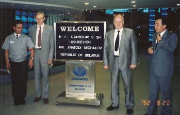

Действительно, излучение ослабевает обратно пропорционально расстоянию от источника в квадрате, но я никак не мог предположить, что цехом служит площадка суши, выступающая в мелководный морской залив. От места резки, где всем управляет компьютер, до помещения с персоналом метров 250—300. Действительно надёжнейшая, не портящаяся и не ломающаяся защита от излучения. Здесь же мы увидели, как из нарезанных плазмотроном деталей свариваются секции самых больших в мире нефтеналивных танкеров, а из них собирается и сам танкер. Применяемый для этих целей козловой кран грузоподъемностью десять тысяч тонн (!) демонстрировал успехи международного сотрудничества: стоял на западногерманских ногах, имел японскую перемычку и корейское компьютерное управление. Показанный нам автосборочный завод тоже заставил задуматься. В Корейской Республике, где согласно закону рабочий день не должен превышать 8 часов работа длилась по 10 часов в день от понедельника до пятницы и 8 часов в субботу. Узнав об этом от рабочих, я спросил у представителя администрации.
— Кто позволяет вам нарушать законодательство?
— Мы его не нарушаем. Все без исключения рабочие подали заявления с просьбой изыскать возможность для дополнительного заработка. Профсоюз поддержал просьбу. Администрация пошла
навстречу. Выигрывает и фирма в связи с более эффективным использованием оборудования и увеличившимся спросом, и рабочие — добавочное время оплачивается по более высокому тарифу.
Можно привести и иные примеры, когда завоёванное профсоюзами, революциями и левыми правительствами право на ограниченную длительность рабочего дня порождает трудноразрешимые проблемы государственного и межгосударственного уровня. 35 часовая рабочая неделя во Франции и 40 часовая в Германии обязывает французов всё время работать с эффективностью на 12,5% более высокой, чем работают немцы, чтобы одинаково преуспевать в Европейском Союзе. Это не просто!
Но вернёмся к Корее.

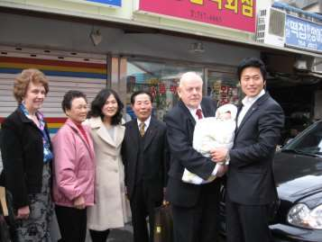

Каждая новая поездка в эту страну усиливала моё убеждение в том, что многие её достижения обусловлены древней традицией использовать любую возмож ность учиться. Родители готовы пожертвовать всем, чтобы дети получили как можно лучшее образование.
— Среди образованных нет бедных, — самая «крылатая» фраза в корейском обществе тех, кого принято называть простыми людьми. Из моего личного опыта общения с корейцами я бы назвал одной из их национальных черт жажду познания.
Часа через два после моей лекции в Сеульском лингвистическом университете мне позвонил в гостиничный номер служащий гостиницы и спросил не откажусь ли я встретиться уважаемым в Сеуле бизнесменом. Я спустился в холл гостиницы, где мне принёс много извинений за беспокойство элегантный человек.

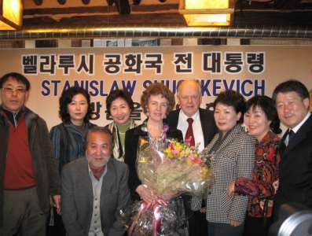

— Моя дочка была на вашей лекции в университете, и я знаю, что завтра вы уезжаете из Сеула в Тегу. Я хотел бы вас попросить встретиться сегодня вечером с бизнесменами, работающими или же желающими работать с Беларусью и другими постсоветскими странами и ответить на наши вопросы.
— Я никогда не занимался бизнесом и не уверен, что смогу на вопросы бизнесменов ответить.
— У нас не будет более сложных вопросов, чем были сегодня в университете.
В итоге мы договорились о чём-то вроде встречи без галстуков, но и бизнесмены и я пришли на неё в галстуках. Получился вечер вопросов и ответов, преимущественно о Беларуси, встречи в Вискулях и Чернобыле. Удивительным было то, что бизнесмены оказались людьми, имеющими хорошее представление о Беларуси, её истории и существующих у нас порядках.

Южная Корея не переставала удивлять меня во время каждой новой поездки, а таких поездок с 1992 года у меня было без малого 30. Прежде всего, её столица — Сеул. Он сменил много названий. Первое из них — Виресон — столица государства в 18 году до нашей эры! В годы японского колониального управления город назывался Кёнсон. Окончатель ное название этого древнего города было утверждено лишь после освобождения в 1945 году. Сеул дважды переходил в руки северокорейских войск во время войны в Корее в 1950— 1951 годах и был сильно разрушен, его заполнил поток беженцев, боль шей частью бездомных. Но после войны был восстановлен и снова стал политическим и экономическим центром. Сегодня в нём живёт четверть населения страны. В 1988 году Сеул стал столицей XX летних Олимпийских игр, а в 2002 году — одним из мест проведения чемпионата мира по футболу.
Корейцы заботливо сохраняют всё то, что мож но считать их историческим наследием. Здесь много краеведческих музеев под открытым небом, реставрированных древних строений, таких, например, как традиционная корейская деревня с жилищами на деревянных сваях и домиками с подогреваемым от примитивной топки полом.

Мы с женой решили сфотографировать друг друга в одном из таких краеведческих музеев на фоне каменных корейских башен, построенных до открытия бетона.

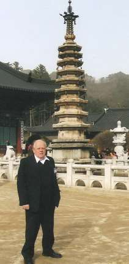
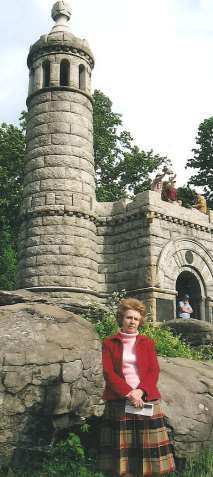

# Франция
13 мая 1970 года в Москве после успешной защиты моей докторской диссертации я пригласил в ресторан «Будапешт» своих уважаемых оппонентов и ещё нескольких давних московских друзей и знакомых. Банкетом в связи с защитой это назвать было нельзя — запрещалось. Дружеским ужином без причины — не возбранялось.
Искренне, от души излился в благодарностях известным учёным — своим оппонентам, один из которых — Герштейн Семён Самуилович — присутствовать не смог. Потом были провозглашены абсолютно неожиданные для меня тосты. Первым «тостующим» был директор Института ядерной энергетики академик Андрей Капитонович Красин.
— Станислав Станиславович, не следует так трогатель но благодарить оппонентов, ведь они мало отличаются от женщин лёгкого поведения. Во-первых, получают удовольствие от клиента, простите, диссертанта; во-вторых, 20 рублей денег (гонорар оппонента — С.Ш.) и, в-третьих, если диссертант достойный, приглашаются вечером в ресторан. Предлагаю тост за их достоинства.
Второй тост провозгласил профессор Владимир Николаевич Лавренчик, с которым я познакомился всего два месяца назад. Узнал, что он, осевший в Москве белорус, работает в месте моей предстоящей защиты — ВНИИОФИ — Всесоюзном научно-исследовательском институте оптико-физических измерений и читает лекции в Московском университете. Я рискнул попросить его быть моим оппонентом, и он согласился.
— Андрей Капитонович, вы напрасно хвалите клиента, точнее диссертанта. Он не идёт ни в какое сравнение с настоящими докторами наук, которые отстаивали право получить чёрную шапочку доктора в дискуссии с двадцатью диспутантами в течение 12 часов, не имея всё это время права на перерыв, глоток воды или какую-нибудь еду. Так было во Франции в XVI столетии, когда колледж Сорбонна объединился с Парижским университетом. А наш! Ответил на три десятка вопросов и всё. Ещё и семи часов не прошло с начала защиты, а он уже не только ест, но и от коньяка не отказывается. Предлагаю выпить за великодушие Учёного совета, который к нему так благосклонно отнёсся. Соотношение прекрасное: 16 «за», 2 «против». Такое у нас в Совете ВНИИОФИ редко случается.
Не думал я тогда, что мне, как профессору Лавренчику, который перед моей защитой летал в Париж на научную конференцию, удастся когда-нибудь побывать в Сорбонне. А ведь удалось . Однако соприкоснуться с современной Сорбонной мне посчастливилось только во время поездки во Францию в марте 2007 года и уже не в роли физика, а в непредсказуемой во время нашего ужина в московском «Будапеште» роли политолога.

# Официальный визит
Моя первая поездка во Францию летом 1992 года была официальным государственным визитом по приглашению Председателя Сената Алена Поэра.

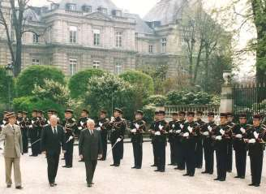

Председатель Сената — второе после Президента лицо в системе госиерархии Франции. Ален Поэр провёл в Сенате 24 года, был Председателем Европарламента, временно исполнял обязанности Президента, баллотировался на пост Президента Франции, но проиграл выборы Жоржу Помпиду. Разговор с этим благожелательным человеком доставил мне большое удовольствие.

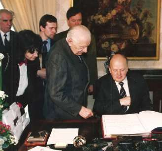

Мы прошли с ним вместе вдоль возле строя почётного караула в здание сената, где мне предложили сделать запись в книге почётных гостей. Ален Поэр вручил мне памятную медаль Сената, после чего попросил вернуть её и сказал, что она обязательно попадёт ко мне после того, как на ней будет выгравировано моё имя и дата посещения. Досрочно это никогда не делается.
Ален Поэр добавил далее, что уполномочен передать мне приглашение президента Франсуа Миттерана посетить его в резиденции в Елисейском дворце, куда я и отправился.
Описывать дела государственные двадцатилетней давности вряд ли имеет сегодня смысл, скажу только, что всё, намеченное сделать во Франции во время визита, было сделано и сделано успешно. Тем не менее, на культурных аспектах поездки и о любопытных личных контактах во Франции не могу не вспомнить.
Уже в Сенате я заметил, что красивая молодая женщина, бойко разговаривавшая с Аленом Поэром на неизвестном мне французском, — моя давняя знакомая. Но как такое может быть? Я встречался с ней как с профессиональным переводчиком-синхронистом с английского на советско-индийском симпозиуме по парамагнитному резонансу в Душанбе в 1982 году, а здесь — французский. Но до чего похожа! Впрочем, прошло десять лет! Вряд ли она. В помещении Сената мне так и не удалось к ней обратиться.

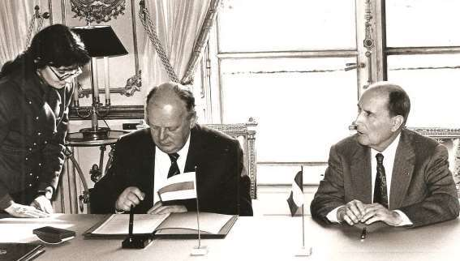

И вот у президента Франции Франсуа Миттерана опять она, и опять по-французски с президентом! Меня, как говорится, прорвало!.
— Простите, а вы, случайно, не Ирина?
— Ирина, и не случайно. Помню вас, Станислав Станиславович, по двум научным конференциям в Душанбе и в Москве. С вами непросто работать, вы не любили говорить медленно, сколько вас не просили. Для синхрониста вы были крепким орешком. А сейчас, смотрю, и уговаривать не надо — никакой торопливости. Я уже пять лет в Париже. Вышла замуж за гражданина Франции.
— Жаль, что таких увозят, ведь вы и здесь в числе лучших. Я-то не догадывался, что у вас и французский язык — рабочий.
— Немецкий, испанский, португальский и итальянский — тоже.
Очередной раз ловлю себя на мысли, что ничего не могу с собой поделать. Зависть — отвратительное качество, а я, как ни стыдно, завидую, завидую настоящим профессионалам. К счастью, белой хорошей завистью.

# О достоинстве и чести
После была встреча с премьер-министром Пьером Береговуа — сыном Адриана Берегового — эмигранта из Украины, который, попав во Францию, не захотел возвращаться в свою охваченную гражданской войной страну, влюбился в красавицу-француженку Ирен Боделин, обвенчался с ней и поселился во Франции, изменив имя и фамилию на французский манер. Последующие трагические события не оставили меня и вряд ли могут оставить кого-то равнодушным.
Я уже начал упоминать сведения из биографии сына украинского эмигранта, достигшего своим трудом и талантом одной из вершин власти во Франции. Они стали известны мне уже после визита, однако, хочется сообщить их и читателю, поэтому продолжу.

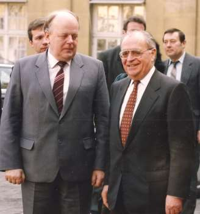

Петру Береговому, ставшему Пьером Береговуа, исполнилось 14 лет, когда началась Вторая мировая война. В свои 17 он стал участником Сопротивления, а в 20 вступил во французскую секцию Социалистического Интернационала. И толь ко в эти свои 20 он получает специальность фрезеровщика — первое и последнее своё образование. Все остальные знания он приобретает самостоятельно, поэтому до конца жизни его называли «самоучка», хотя правильнее бы было называть «человеком, который сам себя сделал».
После победы социалистов на выборах в 1981 году Миттеран назначает Пьера Береговуа Генеральным секретарём Елисейского дворца, в 1984 он становится министром экономики, финансов и бюджета. Его деятельность позволила Франции достигнуть определённых экономических успехов, а его авторитет во Франции и среди зарубежных финансистов стал неимоверно высок. В 1992 году Миттеран, как считают многие, желая укрепить позиции социалистов в канун предстоящих парламентских выборов 1993 года, назначил Береговуа премьером. Его премьерство оценивают по-разному. Тем не менее, социалисты выборы проиграли, и в марте 1993 года Пьер Береговуа подаёт в отставку.
Во время выборов нередко имеют место скандалы с сомнительной аргументацией. Экс-премьер был обвинён в коррупции. Впоследствии была полностью доказана его невиновность, но... поздно. 1 мая 1993 года Пьер Береговуа приехал в свой избирательный округ, где, кстати, победил и на выборах 1993 года, встретился с избирателями. Вечером попросил шофёра и охранника отвезти его на окраину города, где хотел побродить в одиночестве. Через полчаса он выстрелил себе в голову из пистолета, взятого из тайника охранника, а через ещё четыре часа умер в госпитале, не приходя в сознание. Столь трагично, не в силах противостоять распространяемой прессой клевете победивших на выборах правых, подтвердил Пётр Береговой свои честь, достоинство и незапятнанность репутации.

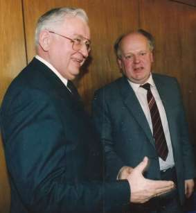

Официальный визит во Францию продолжался. Из Парижа мы вылетели в Страсбург для встреч с европарламентариями. Там мне предоставили слово на сессии Европарламента, который  приветствовал нашу делегацию стоя. Я постарался как можно короче рассказать о том, как работает Верховный Совет Беларуси и заверил парламентариев, что мы намерены идти по пути правового государства, демократии, прав человека, рыночной экономики. Не скрывал и переживаемые нашей страной сложности. Было задано немало вопросов. В ответном слове Председатель Европарламента Эдгон Клепш заверил нас, что европарламентарии будут стремиться помогать Беларуси и содействовать её прогрессивному реформированию.

# Встреча с пророком
Следующая моя поездка во Францию была чисто самодеятельной. Хотелось лично встретиться с человеком уроженцем Минска — Ежи Гедройцем. Впервые я услышал о нём в 1974 году во время моей работы в качестве визит-профессора в Ягеллонском университете. Один из сотрудников шёпотом сказал мне, что есть такой несерьёзный поляк в Париже, который в 1946 году навыдумывал, что Польша, Украина, Литва и Беларусь обязательно станут независимыми суверенными государствами, но кое-кто в университете в это верит. Мне такое начало разговора показалось провокационным, и я ничего не ответил.
Позднее, получив доступ к запрещённым в советское время публикациям, я открыл для себя Ежи Гедройца как человека, который воссоединил в себе мыслителя, редактора, политолога, организатора оппозиционной элиты, учителя новых поколений и конструктора новой внешней политики, прежде всего Польши. Вряд ли можно найти иную такую личность. Он был уникальным для нашего времени человеком, великим интеллектуалом, умевшим приспосабливаться к реальности, не пытаясь её переделать, и стал живым критерием того, что нравственно в коммунистических условиях.
Гедройц — человек идей и прозрений — отверг привычные стереотипы мышления, дал пример, как нужно освободиться от мифов межнациональ ных отношений между поляками, украинцами, белорусами, литовцами, русскими. Он сумел предложить польской и иным национальным элитам совершенно новое видение международных отношений и новый тип европейского порядка. Он призвал, прежде всего, поляков признать право украинцев, литовцев, белорусов на самостоятельное государство тогда, когда польское общество было пронизано идеей «Великой Польши». Это означало и идею неизбежности распада СССР, мысль совершенно абсурдную даже для большинства критиков СССР и советских диссидентов.
Гедройц оказался провидцем, опередившим политических лидеров мира, предвидел то, что казалось невозможным. Раньше, чем французы и немцы он начал размышлять о европейском единении.
Инструментами реализации идей Гедройца были издаваемый им в Париже журнал «Культура» (Kultura) и публикации книг, ставших вкладом в культурную жизнь польского и европейского общества. Не боясь большинства, он учил не опасать ся противостоять «общепринятым истинам». Вокруг него концентрировались великие люди, такие как Юзеф Чапски, Чеслав Милош, ставший позднее нобелевским лауреатом, Юлиуш Мерошевски, с которым Гедройц сформулировал свое новое видение международных отношений, включавших независимую Украину, Беларусь и Литву. Гедройц и его «Культура» помогли Владимиру Максимову начать издание «Континента», показали пример, как можно объединить ся и советскому диссидентству вокруг печатного органа, как создавать институты влияния.
Трудно было поверить, что Ежи Гедройц здравствует и по-прежнему живёт в Париже. И меня охватило страстное желание его увидеть. А если я чего -то хочу, и это можно осуществить, то обязательно осуществлю. Узнал телефоны, адрес, созвонился, услышал приятное «буду рад видеть», и в Париж.
Франция производит неодинаковое впечатление на прилетевшего в аэропорт Орли правительственным самолётом, как это было со мною ранее, и на индивидуума, приехавшего скромным поездом по льготному железнодорожному тарифу на Восточный вокзал Парижа. В первом случае красота и роскошь укрывают обыденность, во втором, до красот добираться сложно и долго, а о роскоши и вспоминать не следует. Благо, инстинкт привыкания к красоте и роскоши развит у меня не сильно, поэтому, сняв в гостинице возле вокзала дешёвый номер с завтраком из маленькой чашечки кофе и такой же маленькой булочки, я отправился на автостоянку у вокзала на встречу с моим давним приятелем, аккредитованным в Париже чешским журналистом. Вместо приветствия он развёл руки и сказал.
— Беда! Я вас страшно подвёл. Ни на одной из станций обслуживания нет крышки, которую я потерял. Моя Тойота плюётся маслом, приходится всё время его доливать, и я не могу вас отвезти в Мезон-Лаффит, как обещал.
— Не дёргайся, Иржи. Открой капот.
Он открыл, а я в очередной раз вспомнил, чем отличаемся мы, граждане советского происхождения, от западных обывателей. Пожалел лишь о том, что я одет для встречи с великим Гедройцем, а не для езды на Жигулях. Риск потерять белизну рубашки и свежесть галстука была велика, но упустить желаемую встречу было ещё страшнее.
— Есть ли у тебя свежий номер твоей любимой парижской газеты? Впрочем, можно и несвежий, и нелюбимый, и непарижский.
— Есть.
— Дай её мне.
Свернув затычку, такую, какими в деревнях в отсутствие пробок
затыкали бутылки с самогоном, но только большего размера, я заглушил ею отверстие для доливки масла в мотор Тойоты. Иржи спросил, а не опасно ли это и не вырвет ли затычку при включении мотора?
— Не бойся, твоя Тойота, я думаю, не хуже моих Жигулей, а в них обычно не вырывает. Давление то под пробкой — ничтожное, а брызги не вытолкнут.
Так и приехали мы в предместье Парижа Мезон-Лаффит, где я и встретился с Гедройцем. Представитель старинного рода князей Гедройцев, публицист, политик, мемуарист, основатель и редактор журнала «Культура» — путеводной звезды польских интеллектуалов коммунистического периода — оказался в свои 93 любознательным человеком, который больше спрашивал, чем можно было ожидать. Весьма располагали к себе его большие добрые, светящиеся интересом глаза, и, глядя в них, я всё-таки уловил момент спросить.
— Господин Гедройц, как вам удалось правильно предсказать то, что с чем не соглашалось большинство польских интеллектуалов — независимость Литвы, Украины и Беларуси?
— Это было неизбежно, и подтвердили неизбежность в том числе и вы, видимо, не позднее, чем я ожидал. В этом месте Европы и с этими народами иначе быть не может. Беларусь имеет давний опыт
2 государственности, и это не стереть из народной памяти ^[За точность передачи смысла слов Ежи Гедройца я ручаюсь. Единственным уточнением может быть общепринятый перевод с польского слова «narodowość» — национальность, тогда — «не стереть из памяти нации».].
Как, оказывается, всё просто!… Для гения!

—-

Через год пришло известие о том, что 14 сентября 2000 года Ежи Гедройц умер. Сейм Польши провозгласил год столетия со дня его рождения — 2006-й — годом Ежи Гедройца, а ЮНЕСКО включило его 100-летие во всемирные памятные даты.

# Париж, Нормальная политическая школа
Эту школу окончили все премьер-министры Франции, кроме Береговуа. Естественно, что я не мог не обрадоваться, получив приглашение принять участие в организованном этой школой «круглом столе» и прочесть в ней лекцию. Если бы я вздумал поступить иначе, то не избежать семейного скандала. Галантные французы приглашали меня вместе с женой и брали на себя все расходы по поездке.
За «круглым столом» на подиуме было трое основных участников — посол Франции в Украине, профессор -политолог Нормальной школы и я. В зале на двести мест — человек 120—150, тема — «Франция и восточная политика Евросоюза», Управление дискуссией — в руках ведущего — посла Франции в Украине, выпускника Нормальной школы. Ко мне вначале обращались редко. Оно и понятно, Отношения с 40-миллионной Украиной для Запада важнее отношений с 10-миллионной Беларусью. Но когда, отвечая на вопросы, мне пришлось заверить зал, что Беловежское соглашение подписано людьми трезвыми, я стал главным допрашиваемым.
— Такого не может быть. Как же вы не устрашились КГБ?
— Как вы не побоялись замахнуться на ядерную страну?
— Что, даже Ельцин был трезвый?
Ведущий быстро вернул дискуссию в безалкогольное русло, и здесь случилось то, чего ни я, ни моя жена не можем вспомнить без ликования: в зал вошла, снова же, красивая, элегантная ухоженная женщина, занимающая, по-видимому, какой-то руководящий пост в школе, и попросила у ведущего разрешение сделать срочное объявление. Ведущий позволил.

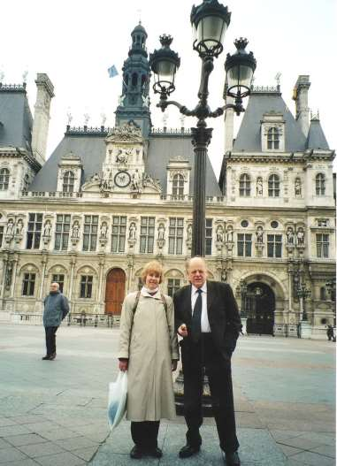

Суть объявления сводилась к тому, что студенты приняли решение объявить забастовку, поэтому никаких занятий от понедельника до четверга включительно не будет. Забастовку учащихся, оказывается, допускает и французское законодательство и устав Нормаль ной школы, если решение принимается официальным студенческим органом самоуправления.
Вспоминаю всё это с радостью, потому что благодаря студенческому бунту, были созданы неповторимые условия для моего знакомства с Парижем. Моя лекция, намеченная на понедельник, сорвалась. Руководство школы принесло мне извинения по поводу непредвиденного стечения обстоятельств и предложило прочесть лекцию в следующую субботу, оставив за мной на всё это время квартиру визит-профессора в 200 метрах от Пантеона.
Итак, квартира в центре Парижа со всем необходимым для
жизни и полная свобода действий! Плюс погода, благоприятствующая замыслам. За всю неделю был только один дождливый день — вторник. Так и хотелось воскликнуть: берегись Париж, я на тебя насмотрюсь вдоволь! И действительно, удалось увидеть многое, но невольно пришло убеждение, что увидеть только вершину айсберга. Могу лишь повторить то, что много раз слышал от других и в чём ещё не раз смог убедиться потом: Париж не перестанет покорять своим великолепием, сколько бы времени ты не посвятил осмотру его улиц, строений, парков, музеев, галерей и выставок.

# Мексиканская свадьба в Испании

В 1996 году я познакомился с интересным молодым человеком, гражданином Мексики Фредо Ариас Кингом, получившим в начале 1990-х годов высшее техническое образование в Волгограде. Наши пути неожиданно пересекались то в Варшаве, то в Праге, то в Торонто, то в Вашингтоне. Он хорошо говорит по-русски, тем не менее, в его русском была и остаётся какая-то самобытность, приводящая, хотя и редко, к русскоязычным фразам с изумительными ошибками, которые веселят не только меня. Довольно часто в присутствии весьма уважаемых людей Фредо называл меня своим учителем, на что я никак не мог претендовать, так как никогда его ничему не учил. Но он упорно настаивает на такой моей для себя значимости и доволь но хорошо знает моими политические приключения от выборов и подписания Беловежского соглашения, до дел сегодняшних. Утверждает, что всё отыскивает в интернете. Своё уважительное ко мне отношение Фредо выразил в дарственной надписи как автор написанной им книги «Transiciones la experiencia de Europadel este». Вот эта надпись:
>Станислау! Спасибо за всё, то что Вы вкладываете на освобождению и трансформацию Беларуси и других стран.\
Ваш учитель и друг, Фредо.

Трансформация ученика в учителя меня не смутила, и стала пополнением «Фредо-афоризмов» в моей коллекции. Так как книга написана на испанском языке, понять в ней я смог только фотографии и имена изображённых на них лиц в подписях под ними. Список оказался внушительным: Фредо с Горбачёвым, Валэнсом, Ландсбергисом, А. Яковлевым, Егором Гайдаром, Галиной Старовойтовой, премьером Эстонии Марти Лари, с Ивонкой Сурвиллой и даже со мной, а также с президентом Мексики в 2000—2006 годах Винцентом Фоксом, избирательный штаб которого Фредо Ариас Кинг возглавлял и сделал таким образом весомый вклад в победу Фокса на президентских выборах 2000 года.
И вот летом 2011 года электронная почта приносит мне не менее непреднамеренно шуточное, чем подарочная надпись на книге, послание Фредо — приглашение на его свадьбу в Испанию. Затем одно за другим приходят снова же весёлые письма, из которых можно понять, что гражданин Мексики Фредо вступает в брак с гражданкой Словакии Даной и что свадьба состоится в старинном замке, принадлежащем родной тёте Фредо, в испанской провинции Астурия. Хотя вступающие в брак Фредо и Дана — католики, по канонам католической церкви Испании брак не может быть официально зарегистрирован и освящён католической церковью в Испании. Такое происходит только в тех случаях, если хотя бы кто-то один — жених или невеста — являются гражданами Испании. По этой причине церемония бракосочетания предстояла чисто светской.

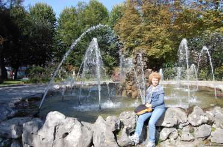

При моём любопытстве, тяге к путешествиям и экзотике отказаться от предложения быть вместе с женой на интернациональной свадьбе в старинном испанском замке было бы самобичеванием. И вот мы в Астурии, в сказочном городе Овьедо.

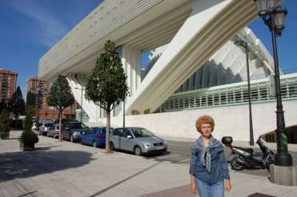

Если Минск славится своей чистотой, то весь 220-тысячный город Овьедо — улицы, парки, дома, дворы, магазины и прочее можно отнести к категории стерильных. За многие столетия все потенциальные источники пыли укрыты газонами, кустарником, каменными плитами, щебёнкой. Входя в чей-то дом, нелепо снимать обувь — неизвестно, где чище — в квартире или на улице. Ползающий по полу супермаркета младенец в белоснежных одёжках никого не удивляет. Мама может спокойно выбирать для него овощи и фрукты — не запачкается.

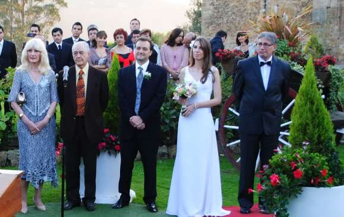
Мы приехали из аэропорта Астурия в Овьедо в середине дня 13 октября 2011 года, свадебная церемония началась в пятницу 14 октября в 20-00 на площадке и газонах перед замком. Около часа длились приветствия и поздравления родственников и гостей. Затем здесь же возле замка начался фуршет и появился мексиканский ансамбль певцов и музыкантов. Играли и пели профессионалы. Им не нужно было укрывать свои дефекты с помощью электроники, поэтому громкость была умеренной. Это способствовало спокойному без напряжения голосовых связок человеческому общению, чего я давно не встречаю здесь у нас в Беларуси на похожих мероприятиях. Всё это хорошо сочеталось с прекрасным асурийским вином и базирующейся на местных продуктах асурийской кухне. Кстати, ассурийцы также хорошо солят и вялят свиные «кумпяки», как и крестьяне в белорусской деревне, но окорока эти в Ассурии мясные, почти без сала.

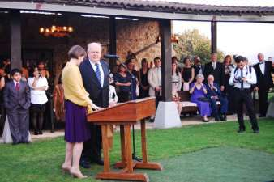

Я был уверен, что в 24:00 всё закончится, и мы поедем в Овьедо спать. Но оказалось, что всё только начинается. Нас пригласили в крытый павильон рядом с замком. У входа висел напечатанный огромными буквами список участников в алфавитном порядке с номером стола, на котором предусмотрено для него место. В 0:30 начался праздничный ужин, тосты-поздравления и продолжились великолепные песни всё того же мексиканского ансамбля. Часов с трёх ночи пришло время танцев, управляемее диск-жокеем, а к часам четырём из примерно 300 участников половина уехала в Овьедо специально арендованными автобусами. Пришло время и нам покинуть продолжающееся веселье.

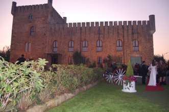
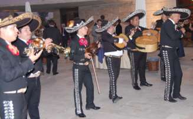

Свадьба продолжалась и на следующий день. Все приезжие поехали в Ковадонга, где на вершине невысокой горы в окружении гор более высоких находится построенный в 14 и модернизированный в 15 веке костёл, возведённый в честь отстоявших независимость Астурии христиан в борьбе с арабами, не позволивших завоевателям вступить на ассурийскую землю. Вечером того же дня все стали участниками застолья в винном хранилище, где в огромном прохладном павильоне выдерживается знаменитое ассурийское вино в дубовых бочках вместимостью до 35 тонн. И, наконец, в последний — третий день свадьбы, для участников, сохранивших силы продолжать веселиться, был приём в старинном ресторане Овьедо Ассурия.

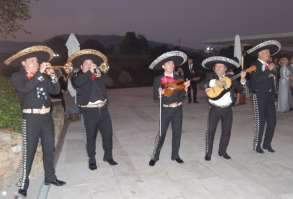

Что сказать более. Ассурийцы — испанцы очень похожие на белорусов, но находящиеся в более тёплых климатических условиях. Остальное — как и у нас в «старое доброе время». Трёхдневное свадебное гулянье, очень похожие на белорусские народные танцы, толерантность, доброжелательность. Отличие — ни одного не то, что выпившего лишнее, но и намёка на приближение такого состояния. Видимо, потому, что очень часто пьют вино, и знают как это делать с пользой для здоровья. Так у них принято.

---

1. [~~Про мой род, себя и нашу элиту~~](./1.md)
2. [~~Бацькаўшчына~~](./2.md)
3. [~~Академия — завод — университет~~](./3.md)
4. [~~МРТИ — хорошо, БГУ — лучше~~](./4.md)
5. [~~Чернобыль~~](./5.md)
6. [~~В Москву, к властям~~](./6.md)
7. [~~Дорога к Вискулям~~](./7.md)
8. [~~Народы малочисленные и к ним приравненные~~](./8.md)
9. [~~Если б знал я, с кем еду, с кем водку пью…~~](./9.md)
10. [~~Беловежская пуща, Вискули, 7—8 декабря 1991 года~~](./10.md)
11. [~~Беларусь — Соединённые Штаты~~](./11.md)
12. [~~Интеллигенция и политика~~](./12.md)
13. [~~О университетах и ВУЗах, степенях и лекциях~~](./13.md)
14. [~~О «моём» зарубежье~~](./14.md)
15. [**Патология**](./15.md)
16. [Через годы, через расстояния](./16.md)
