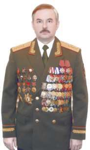
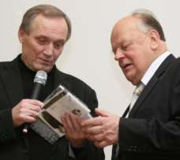
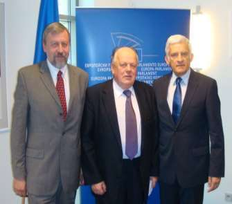
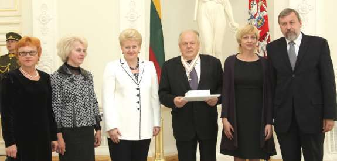

1. [~~Про мой род, себя и нашу элиту~~](./1.md)
2. [~~Бацькаўшчына~~](./2.md)
3. [~~Академия — завод — университет~~](./3.md)
4. [~~МРТИ — хорошо, БГУ — лучше~~](./4.md)
5. [~~Чернобыль~~](./5.md)
6. [~~В Москву, к властям~~](./6.md)
7. [~~Дорога к Вискулям~~](./7.md)
8. [~~Народы малочисленные и к ним приравненные~~](./8.md)
9. [~~Если б знал я, с кем еду, с кем водку пью…~~](./9.md)
10. [~~Беловежская пуща, Вискули, 7—8 декабря 1991 года~~](./10.md)
11. [~~Беларусь — Соединённые Штаты~~](./11.md)
12. [~~Интеллигенция и политика~~](./12.md)
13. [~~О университетах и ВУЗах, степенях и лекциях~~](./13.md)
14. [~~О «моём» зарубежье~~](./14.md)
15. [**Патология**](./15.md)
16. [Через годы, через расстояния](./16.md)

---

# Никаких достоинств
Патологией называют любое отклонение от нормы. Более подходящее негрубое слово для характеристики деяний нашего правителя и нашей власти вряд ли можно найти. Наследственное это у предводителя или приобретенное, установить трудно. В начале 1990-х годов он часто вспоминал о тяжелом детстве, о том, что натерпелся, по-видимому, от сверстников. Похоже, что постоянно мстит за свое страдальческое детство всем, кто не унижается до восхваления его деяний.
Мне не удалось найти, увидеть или услышать заявление, интервью, публикацию хотя бы одного учителя, преподавателя вуза, одноклассника или однокурсника, который бы сказал, что он был не то, что хорошим, а просто путным студентом или учеником. Последующая жизнь, в том числе и райская, не способствовала исправлению дефектности образования и мышления. После многих лет президентства продолжает утверждать, что учился на стихах Василя Быкова, который, как всем известно, стихов не писал. Награждает орденом Франциска Скорины, утверждая, что тот гулял по Петербургу, хотя Скорина умер более чем за 150 лет до основания Петербурга. Все это зафиксировано телекамерами, за что осуществившие видеозапись этих перлов теле -корреспонденты лишены аккредитации в Беларуси.
Систематически говорит неправду и, похоже, сам во все это верит. Утверждает, например, что был рецензентом программы «500 дней». Не исключено, конечно, что говорил о программе на кухне и считает это рецензированием, но автор программы Г. А. Явлинский не только не слышал, но и понятия не имеет о таком рецензенте. Перечень составляющих воинственного невежества предводителя велик, но их перечисление — не моя цель. Напомню лишь о случаях, породивших серьезное разбирательство.
Приехав в Вильнюс весной 2010 года, публично заявил перед телекамерами президенту Дале Грибаускайте, что был в этом городе и разделял опасность нахождения в нем в часы противостояния советским военным, помогал литовцам отстаивать независимость в осажденном парламенте. Выдумка совершенно неожиданно возымела на меня прямое и, что очень удивительно, положительное воздействие. Комиссия Сейма Литвы выяснила, что заявитель из Беларуси не был в трудное для литовцев время в Вильнюсе, а был другой человек — Шушкевич, и представила меня к награде за содействие демократизации Литовской республики. Так, благодаря Лукашенко литовцы вспомнили обо мне, и президент Даля Грибаускайте сочла необходимым наградить меня высшим орденом Литвы для иностранцев.
Любимый метод правления нашего предводителя — публично унизить подчиненного, убедить ся, что и после этого он являет верноподданничество, и именно за это «великодушно» его простить. Оказалось, что довольно много лиц, сделанных правителем высокопоставленными, готовы перетерпеть любое публичное унижение, лишь бы эту высокопоставленность сохранить или возобновить. Примеры. Министру обороны Леониду Мальцеву во время его выступления в заполненном зале заявляется: «Вы уже не министр!» Через некоторое время за проявление безграничной услужливости он получает прощение и снова становится министром.
Есть ли у офицера, точнее генерала, военная гордость и достоинство? Не стыдно ли ему перед подчиненными возвращаться в услужение к воинствующему невежеству? Где славные традиции, где офицерское (генеральское) «честь имею!»?
Или же губернатор Александр Куличков. В похожей обстановке: «Вы уже не губернатор!», и охранники президента выпроваживают экс-губернатора из зала. Оправился, поплакался, стал министром.
Я ни на секунду не сомневаюсь, что бесследное исчезновение генерала Юрия Захаренко, который был членом избирательной команды Лукашенко 1994 года, и вице-спикера Верховного Совета Виктора Гончара, связано с патологической мстительность ю правителя страны. Он ненавидел их за то, что они умнее, красивее, истинно образованные, особенно за то, что они — интеллигентные люди, что для него самого, конечно же, недостижимо.
Вспоминаю выступление на съезде Народных депутатов СССР Председателя Советского (потом —российского) фонда культуры академика Дмитрия Сергеевича Лихачева, который буквально разъярил добрую треть народных депутатов СССР, сказав примерно следующее:
— Можно занять высокую должность, притвориться ученым, инженером, специалистом в любой отрасли науки или техники, преподавателем, кем угодно, но нельзя, невозможно притвориться интеллигентом.
Лихачев не приводил никаких конкретных примеров, но многие из Народных депутатов съезда реагировали в перерыве примерно так:
— Вот врезал и по Хрущеву, и по Брежневу, да и по Горбачеву.
Естественно, что в треть разъяренных попал бы и Лукашенко, потому что он был бы во Дворце съездов, если бы не проиграл в 1989 году выборы в Народные депутаты СССР Вячеславу Кебичу.
Изощренную (на уровне его понимания изощренности) мстительность проявил Лукашенко и по отношению ко мне и к другим лицам, занимавшим руководящие должности, которые сочли унижением явить безоговорочное верноподданичество или же явили его в недостаточной мере. То, что при этом он грубо нарушил Конституцию и законы, может официально подтвердить только Конституционный Суд (КС), но обратиться в КС граждане не имеют права вообще, в том числе и те, по отношению к которым нарушение совершено. По своей инициативе Конституционный суд также не может рассмотреть какой-либо вопрос. Более просто: КС может рассматривать только вопросы, инициированные президентом или государственными институтами, руководителей которых назначает президент. Этих институтов пять : Совет Министров, две палаты «парламента», Верховный суд и Высший Хозяйственный Суд.
Своим декретом №16 от 9 сентября 1997 года Лукашенко сохранил мою пенсию «как имеющего особые заслуги перед белорусским народом» в размере на день введения в действие этого же декрета (11 сентября 1997 года). Она составляла тогда 3 196 000 рублей, сегодня, после деноминации и исключения из обращения мелких купюр, она выплачивается мне в размере 3200 белорусских рублей в месяц, что менее половины доллара США по курсу Национального банка Республики Беларусь.

Мои обращения в суды всех инстанций и ко всем структурам, имеющим право обратиться по этому вопросу в Конституционный Суд с индивидуальным запросом и с открытым опубликованным в «Народной воле» письмом, как и следовало ожидать, оказались безрезультатными.
Патология. Сервилизм во всех структурах на всех высших уровнях. Ответы руководителей упомянутых государственных институтов — Совета Министров, обеих палат «парламента», Верховного суда и Высшего Хозяйственного Суда — (правда, в большинстве случаев их подписали заместители, руководители «стесняются») лицемерны и убедительно звучат лишь в переводе на общепонятный язык. Он — начальник, мы — дураки. Оправдать можно лишь ответ Высшего Хозяйственного Суда, в котором четко сказано, что в подобных случаях Совмин обязан обратиться в Конституционный Суд.
Где же то правовое государство, о котором написано в конституции? Откуда столько раболепствующих перед начальником, насаж дающим беззаконие ради самоудовлетворения и личного благополучия? Что за нелюди выбились в руководители и откуда их столько? В переводе на язык для нормальных граждан существует лишь одно понятие — низкая политическая культура. Строго говоря, говорить о куль туре в сообществе нынешних белорусских распорядителей бессмысленно. Низка культура не только политическая, но политическая причиняет людям больше вреда и боли.
А откуда ей, высокой политической культуре, взять ся? Интеллигенция ее не старается прививать, да и сама проникнута ею в извращенном виде. Не осознала, как в других странах Европы, своей исторической роли. Не претендует быть на уровне европейских интеллектуалов в политическом смысле, довольствуется позволением быть людьми умственного труда. Руководствуется старыми постулатами власти, вбитыми в головы в советский и предшествующий тоже имперский период. Чтобы достойные подходы в головах людей не зарождались и не овладевали массами в стране, создано множество силовых структур. Главное требование к силовикам — быстрое озверение.
Вспоминаю выступление на сессии сотрудника милиции, депутата, заместителя председателя Верховного Совета 13 созыва Малумова Юрия Георгиевича.
— О какой сознательности и соблюдении законности нами — милиционерами — можно говорить, когда мы стоим в оцеплении, а против нас гигантская толпа, готовая разорвать нас на части. Тогда любую команду я воспринимаю, как бить, бить и бить! И бью вместе со всеми остальными милиционерами, бью и бью!
Кто вбил в голову Малумова, что безоружные люди, в том числе женщины, старики и дети, вышедшие на мирную демонстрацию протеста, готовы разорвать его на части? И это на трибуне законно избранного парламента говорил законно избранный депутат Верховного Совета 13 созыва, имеющий юридическое образование. Он был последним выступающим при рассмотрении вопроса о неправомерных действиях милиции, и дать оценку выступлению мог только председатель Семен Георгиевич Шарецкий, но он промолчал.
А что же делать тем необученным, попавшим под командование сиваковых, павлюченковых, наумовых, малумовых?
Верховный Совет 13 созыва был разогнан воинствующим предводителем, точнее был превращен в новый «парламент», в котором из 220 были оставлены лишь 110 депутатов, заявивших о своей преданности Лукашенко. Малумов, естественно, остался, так как по-прежнему готов бить, бить и бить. Это сборище верноподданных предводителю получило название «нижняя палата». Для создания так называемой верхней палаты и правительства никакого избрания депутатом не требовалось, и предводитель включает в них лиц по своему личному усмотрению.

# Источники и составные части белорусской государственности
Число анекдотов о сегодняшнем правителе Беларуси не меньше количества таковых о Брежневе времен его деградации на посту генсека. Один из них — расшифровка аббревиатуры ГУЛАГ как Государства, Управляемого Александром Григорьевичем Лукашенко.
Криминализированная система управления сегодняшними белорусскими госорганами и институтами построена по схеме одной из опор социализма и советской государственности. Такой опорой служило преднамеренно не замечаемое тюремными надзирателями и начальством вообще жесточайшее самоуправление заключенных в тюрьмах, в лагерях и в зоне их «свободного» поселения. Над заключенными всегда висела угроза помещения их в камеры с уголовниками, осужденными за тягчайшие преступления и наслаждающимися издевательствами над сокамерниками. В такие камеры с «воспитательными» целями переводили политических или, например, тех, кто не соглашался стать тайными рычагами тюремщиков и выполнять их задания в качестве «подсадных уток» в камерах с подследственными заключенными.
И в упомянутых зонах, и в сегодняшней Беларуси абсолютная власть принадлежит тому, кого зовут пахан и которому все дозволено. Все остальные в государственных органах и институтах страны — шестерки двух типов — обычные и козырные. Те и другие безропотно подчиняются пахану, безоговорочно поддерживают все его действия и требования, поэтому допущены к кормушке, наполняемой из государственного бюджета, никем, кроме пахана не контролируемого. Пахан нарекает шестерок тузами, королями, дамами и т. д., т. е. министрами, председателями судов, прокурорами, руководителями организаций и т. п. Однако козырная шестерка, т. е. наиболее приближенное к пахану лицо, в праве замахиваться, а иногда и побить более крупную карту, даже туза, т. е. министра или председателя совета республики, если пахан не наложит запрет. За попытку вести себя неблагочестиво козырная шестерка перестает быть козырной или же вообще изгоняется из зоны, т. е. из системы управления государством. Чаще всего после отстранения от власти шестерка, занимавшая высокий пост, как бывшие шефы КГБ Республики Беларусь, уезжает от греха подальше — в Россию. На вопрос, кто какой шестеркой является, не всегда просто найти ответ. Козырность нужно заслужить великим угодническим деянием, а надежнее всего — кровью, как в настоящем преступном мире, как в криминализированной зоне.

Единственная известная всем долговременная стабильная козырная шестерка — Виктор Шейман. Он, вне сомнения, причастен ко многим нечистым деяниям и провокациям, связанным с предводителем и замешан в грязных его проделках. Как говорят в преступном мире, повязан с ним кровью. В свое время любовь пахана к нему была безмерной. Он даже назначил его генеральным прокурором, хотя тот не имел тогда соответствующего юридического образования, возвел из майора в генерал-полковники, одарил множеством орденов, медалей и значков. Вместе с тем, пахан не позволяет козырным шестеркам возвысится до уровня, на котором они могут составить конкуренцию самому пахану. Нашелся повод и для понижения статуса В. В. Шеймана.
Предводитель сообщил о желании отстранить его от должности госсекретаря Совета безопасности Беларуси за взрыв в Минске в 2008 году. 8 июля того же года появился указ № 368 об освобождении Шеймана от должности в связи с переводом на другую работу. Указ демонстрировал принципиаль ность предводителя: не умеешь обеспечить безопасность людей, не подтверждаешь заверения президента в стабильности в стране, иди на другую работу. Однако последующие события вернули Шеймана в ранг козырной шестерки.
11 апреля 2011 года в Минске в метро на станции «Октябрьская» в 17 часов 55 минут происходит новый взрыв, унесший жизни 15 человек. Число пострадавших превысило 200 человек. Лукашенко сразу же изрекает личные умозаключения о причастности к террористическому акту оппозиции. «*Я поручил рассмотреть все заявления от политических деятелей. Эти деятели от так называемой пятой колонны, может, раскроют карты и укажут, кто заказчик*». Далее, как и всегда, предводитель впал в фазу самолюбования и проговорился о своем истинном отношении к демократии: «Всех привлечь и допросить, не глядя ни на какую демократию и вой зарубежных страдальцев».
Через день после взрыва 13 апреля Лукашенко заявляет:
>**Задержанные признались не только в совершении теракта в метро, на их совести теракты в день независимости 3 июля и в Витебске.**
Таким образом молниеносно нашлись лица, на которых были повешены все имевшие место в Беларуси теракты и взрывы. Ими оказались Дмитрий Коновалов и Владислав Ковалев, приговоренные 30 ноября 2011 года к расстрелу. Судебный процесс подтвердил то, что сказал Лукашенко через день после взрыва. Многие, в т.ч. и родственники погибших, в результате теракта сомневаются в том, что найдены и осуждены истинные преступники, заслуживающие сурового наказания. Убежденность в идентификации преступников и справедливости вынесенного приговора высказывают лишь комментаторы монополизированных государством средств пропаганды. Незамедлительное приведение приговора в исполнение (расстрел Дмитрия Коновалова и Владислава Ковалева) предельно усложнили возможность доказательного установления истины.
О криминальных методах управления государством Лукашенко проговорился на второй стадии своего президентства в Гомеле. Он фактически подтвердил свою причастность к физическому устранению криминальных авторитетов государственными службами. Вот фонограмма его выступления: 
>У нас никто стрелять не будет. А почему? А потому, что президент расставил все на место и говорит: смотрите, мужики, не дай Бог! Всем будет! Я обеспечил это в Минске в основном, в Гомеле, наверное, поменьше. Через определенных мужиков поставил в известность 5 лет назад: не дай Бог только где-то вы создадите обстановку криминальную, я вам поотрываю головы. А мы знаем, сколько их и кто они. Этих ворюг в законе мы же знаем. Вся милиция их знает. Вот сидит наш милиционер. Он работает в Минске. Что ты не знаешь? Знаешь все группы в Минске (смех в зале). Я вам даже больше скажу. Когда я стал президентом, потребовал от министра внутренних дел принести мне списки, положить на стол все преступные криминальные элементы в Минске. А потом пошел по Гомелю, по областям и составил каталог. До сих пор в сейфе лежит. Мы их знаем всех, и они знают, что мы их знаем. И не дай Бог только он шевельнется, а он не дурак. Если власть криминальная, если власть проворовалась, как он, ничего не удержишь. Так же? Если ты честно проводишь политику, если сам не ворюга, они этого жутко боятся. И они думают, хлопцы, батька сказал: замочит (смех в зале). Был случай, когда они неправильно себя повели. Помните этих Шавликов и прочих. Где они сейчас? Поэтому в стране порядок, и все довольны. И докладывают через службу безопасности: три тыщи голов за вас проголосовало!

Напрашивается вопрос, кто мог устранить Шавликов и прочих? Ответ ясен: в государстве имеется то, что в диктаторских странах Латинской Америки называли «Легионами Смерти». Очевидно и то, что такой легион может по указанию пахана устранять, т. е. убивать без суда и следствия, профессиональ но устраняя следы государственного терроризма, не только авторитетов преступного мира, но и политических лидеров.
Вероятнее всего, исчезновение бывшего министра внутренних дел Юрия Захаренко, бывшего депутата и вице-премьера Виктора Гончара — дело рук тайного белорусского государственного террористического подразделения — легиона смерти.
Не подлежит сомнению, что функции криминальных банд выполняют и иные подразделения силовиков, находящихся на государственной службе. Молодых людей запугивают прекрасно оснащенные люди в штатском, завязывают им глаза, увозят в лес, грозят убийством и оставляют вдали от населенных пунктов ночью. 20 декабря 2011 года такое случилось и с группой украинских девушек, протестовавших в Минске возле здания КГБ 19 декабря в годовщину побоища мирной демонстрации протестующих против тотальной фальсификации выборов. Их выследили и захватили при посадке в поезд. На этот раз угрозы оказались еще более изощренными. Люди в масках облили их машинным маслом и грозились поджечь.
Криминализация управления коснулась и зон заключенных. Нагоняя страх на граждан, пахан и его шестерки, включая тех, кто работает в ведомстве государственной пропаганды, не ограничиваются абсолютно необоснованными с правовой точки зрения осуж дением политических и общественных лидеров и отправкой их в места заключения. В тюрьмах, изоляторах и зонах продолжается давление на заключенных с целью написания ими них просьб о помиловании. Отказ от написания просьб о помиловании людьми, осужденными безо всякой вины и поэтому не признающими себя виновными, порождает отправку политических заключенных в камеры к предельно криминальным элементам, осужденным за тягчайшие преступления. Это отрепье побуждается к насильственным действиям против политических узников руководством мест заключения. Понять, что все это звенья одной цепи устрашения помогают и такие факты, как «просочившиеся из зон содержания заключенных сведения» в средства государственной пропаганды, в частности на государственное телевидение, домыслов шестерок об отрицательном отношении к политическим заключенным, **даже криминальных авторитетов, отбывающих наказание за тяжкие преступления**.
Возникает законный вопрос, кто поместил политических заключенных в камеры уголовников, осужденных за тягчайшие преступления? Ответ очевиден, все это звень я одной цепи устрашений населения криминализированной системой управления во главе с нелегитимным президентом.
Правящий режим и его предводитель обречены держаться за власть. Потеря власти и демократизация страны неизбежно ведет к тому, что большинство сегодняшних сановников должны будут ответить за творившиеся ими беззакония. Наиболее рьяных ждет скамья подсудимых. Не избежать и перегибов в другую сторону: у людей накопилось очень много обид за тотальную несправедливость, издевательства и глумление над ни в чем не повинными гражданами. Представители нашей интеллектуальной элиты и контрэлиты не доросли и вряд ли скоро дорастут до уровня понимания необходимости «мирного общественного договора» и возведения памятника в натуре и в сознании жертвам и пострадавшим с обеих сторон, как это сделано, например, в Испании.
Беспредел и вседозволенность стали нормой для опричников реж има, т.е. для правоохранителей органов, которые должны охранять граждан, а предпринимают превентивные меры в плане подавления зачатков любого свободомыслия. Их действия приобретают формы, несовместимые даже со временами сталинизма и андроповщины, когда людей задерживали на улице или в кино для проверки личности и выяснения вопроса, не должен ли данный человек быть в это время на рабочем месте. ОМОН и лица в штатском врываются в квартиры и дома граждан под предлогом типа «поступил сигнал, что здесь приготавливаются наркотики». Ворвавшаяся шайка крошит все, не замечает открытую дверь, выбивает окна и увозит всех в отделение милиции.
Лишь один пример. Вечером 8 февраля 2012 года «Литвинский клуб» проводил еженедельное собрание интеллектуально — религиозного характера в частном доме, расположенном в Загородном переулке Минска. Сотрудники спецназа в масках ворвались в дом через окно. Были задержаны 32 участника клуба. Впоследствии всех их отпустили без составления протоколов. Лица в штатском не представлялись, цель проникновения в дом не объясняли, выбили два оконных стекла, одно из которых было выломано полностью вместе с пластмассовой коробкой, разбили более десяти тарелок. Хозяин дома считает, что действия сотрудников милиции «нарушили его права и законные интересы, нанесли ущерб его имуществу, нанесли моральные страдания» и требует провести проверку фактов и дать правовую оценку действиям сотрудников УВД Московского района Минска, привлечь к ответственности лиц, виновных в нарушении прав и законных интересов граждан согласно законам Республики Беларусь. Однако, как и всегда, ничего подобного не будет сделано.

# Кандидаты в президенты на «выборах» 2010 года
>«Если человек думает, что может бесконечно руководить, то он опасен для общества».\
Д. Медведев, в бытность президентом РФ.

Поучительным примером для авторитарных правителей СНГ, обеспечивших себе третий и последующие сроки правления путем наглого изменения конституций своих стран, стала российская рокировка Путин-Медведев-Путин. Медведев весьма галантно выразил словами, вынесенными в эпиграф этого раздела, свою признательность Путину: тяжела, мол, для таких, как я, шапка Мономаха, на второй срок претендовать не стану, спасибо за доверие, идите, дорогой Владимир Владимирович, на третий и четвертый сроки. Мало, кто догадывался, почему Путин рекомендовал в 2008 году Медведева на высшую должность в России. Оказывается, бывший резидент КГБ в ГДР прекрасно разбирался в людях и вычислил, кому можно доверить сохранить для себя высшую должность России, не нарушая Конституцию РФ и не опасаясь, что тот сам будет пытаться переизбраться.
Белорусский предводитель убежден, что может быть президентом вечно и никому не может доверить никакой срок, так как никому не доверяет вообще. Он обречен на высшую власть в стране. Её потеря сулит ему печальный финал за содеянные прегрешения. Он вынужден продолжать действовать методами, противоправность которых все время возрастает. Примерами для подражания служат ему африканские диктатуры, но он думает, что избежит судьбы Каддафи или Мубарака, или судьбы пригретого им бывшего киргизского президента Курманбека Бакиева.
Наибольшую опасность для Лукашенко на декабрьских выборах представляли кандидаты в президенты Андрей Санников и Владимир Некляев. При мало-мальски честном подсчете голосов один из них был бы сегодня президентом Беларуси. Таковы данные заслуживающих доверия негласных социологических исследований, не афишируемых потому, что открытые социологические исследований в Беларуси позволены только придворным службам, остальных за это жестоко наказывают.
Итоги сегодняшней белорусской социологии, прибранной к рукам пропагандистской службой правителя, известны до начала «исследований». Более того, для того чтобы опорочить любой подпольный зондаж, используются авторитетные в прошлом «независимые социологи», находящиеся «под колпаком» власти. К ним относятся те, кто поначалу пытался быть независимым и даже публиковал результаты, не нравящиеся правителю, а потом не устоял перед соблазном, угождая власти, получить за это ощутимые выгоды. После появления информации о неофициальном исследовании выступает, например, профессор Олег Манаев с заявлением о том, что, по его данным, рейтинг Лукашенко в день выборов был 53 %, но почему-то не удивляется и, конечно же, не протестует по поводу 82 % приписанных предводителю Центральной избирательной комиссией.
После такого заявления официальная пропаганда на все лады перепевает: видите, профессионалы-социологи, хотя и оппозиционеры, но вынуждены признать, что Лукашенко выборы выиграл. Легкое заигрывание высоко оценивается власть ю. Профессору Манаеву позволяют даже работать в Беларуси и читать лекции студентам. Более того, ему позволено снова явить из себя независимого и даже заявить, что рейтинг Лукашенко стал самым низким за все время его правления. Но никто в оппозиции не сомневается, что в нужное для правителя время профессор найдет способ поддержать его своим «независимым» заявлением.
В условиях фактического отсутствия доступа к СМИ оппозиция выдвинула несколько кандидатов, чтобы охватить предвыборной агитацией во время сбора подписей за право стать кандидатом и во время предвыборной агитации как можно больше граждан. В итоге были зарегистрированы кандидатами Андрей Санников, Владимир Некляев, Николай Статкевич, Ярослав Романчук, Виктор Терещенко, Григорий Костусев, Александр Михалевич, Дмитрий Усс, Виталий Рымашевский. Совершенно надежно собрали по более чем 100 000 подписей Санников, Некляев, Статкевич, Романчук. Команды остальных потенциальных кандидатов сами высказывали сомнения, что имеют необходимые сто тысяч, однако ЦИК зарегистрировала всех. Цель ясна: используя слабых кандидатов, заявить, что все они одинаковы и не имеют никаких достоинств.
Надо сказать, что спецслужбам это удалось. Костусев абсолютно бездоказательно заявил, что все, кроме него, получали незаконную финансовую помощь . Романчук поклялся в верности Лукашенко. Терещенко во время бесчинств ОМОНа на площади заигрывал с властью на государственном телевидении. Рымашевский и Михалевич письменно подтвердили согласие стать сексотами КГБ.
Достойно и мужественно поступили кандидаты Санников, Статкевич и Некляев, а также Дмитрий Бондаренко — ключевая фигура в команде Санникова. Их не сломили ни тюрьма, ни издевательства.
Настоящий поэт, он же — абсолютно неопытный политик Некляев, и высокообразованный дипломат, чиновник и умудренный опытом политик Санников были одержимы одинаковыми устремлениями — противостоять лжи, фальши, попранию человеческих прав и достоинства граждан Беларуси. У обоих — сильные группы поддержки, и не удивительно, что они лидировали среди девяти оппозиционных кандидатов в президенты на выборах 2010 года.
Понимая, что при подсчете голосов он выборы проиграет, а в ответ на тотальную фальсификацию будет массовый протест, Лукашенко принял превентивные меры, чтобы в зародыше уничтожить очаг очередной цветочной революции на территории СНГ. В Минск были стянуты подразделения ОМОН со всех областей республики. Еще до окончания выборов начались задержания и избиения потенциальных лидеров протестующих. Вечером 19 декабря были арестованы или «задержаны» семь из девяти кандидатов в президенты, причем наиболее популярные из них — Санников и Некляев — были безжалостно избиты людьми, точнее нелюдями в штатском.
На Октябрьскую площадь и мирное шествие по проспекту независимости вышло больше людей, чем на киевский Майдан в аналогичной ситуации, по различным оценкам — от 40 до 70 тысяч. Далее все развивалось по стандартной схеме государственного терроризма. Провокаторы разбили несколько окон. ОМОН не то чтобы не препятствовал этому, скорее способствовал. Затем поступила команда «бей», и хорошо экипированные ОМОНовцы начали дубинками зверски избивать всех, кто попадал под руку. Наведение всеобщего страха дополнилось арестом почти тысячи граждан.

—-

Поэты, как известно, руководствуются повелениями сердца, чувствами возвышенными; дипломаты и политики — расчетом, учетом существующих реалий. Случилось так, что до Владимира Некляева, арестованного без всяких оснований и заключенного в тюрьму КГБ, дошла весточка из зарубежья «Держись, Володя! Твой брат, Евгений Евтушенко». И в рождественскую ночь 25.12.2010 в тюремной камере Некляев подтвердил, что остаётся поэтом, и написал:

>Мой друг, мой брат, привет тебе, привет!\
Ты руку подал мне в нелегкий час, не мешкая.\
Поэт в России больше, чем поэт —\
И в Беларуси он ничуть не меньше.\
\
Ну, вот ему и вышел укорот.\
В том ничего невиданного нету.\
Пророс 37-й гадючий год.\
Из ненависти подлецов к поэтам.\
\
Неся кресты, терновые венцы,\
Поэты, наши кровные отцы,\
Шли по этапам, вешаясь, стреляясь,\
А вслед им ухмылялись подлецы,\
В самих себе, как в коконах, рождаясь.\
\
Они себе цепляли ордена\
И на погонах звезды зажигали…\ 
Они украли наши времена!\
Они страну у нас с тобой украли!\
\
Украли нашу музыку, стихи,\
В лай превратили речи нашей звуки,\
По всем святыням расползлись, как мхи,\
Не трогайте мое! Отдайте, суки!\
\
Пусть я кричал про то не по уму,\
Пусть не туда я встрял — и мне за это\
Башку отбили, бросили в тюрьму,\
Но я не предал сам в себе поэта.\
\
Поэзию не предал, видит Бог…\
Одно мне душу мучает до жженья:\
Какой за нами неотплатный долг!\
С ума сойти! Но мы отплатим, Женя!\
\
Не отдадим на поруг и на смех\
Святое наше братство цеховое…\
Мы, может быть, последние из тех,\
Кто еще помнит, что это такое.\
\
Еще вдохнем мы терпкой густоты\
Вина, стихов, и, как не раз бывало,\
Я выпью за Есенина, а ты,\
Со мной обнявшись, выпьешь за Купалу.\
\
И будут в окнах бабочки на свет,\
Лететь всю ночь, и лики с небосвода\
Всю ночь смотреть… Привет тебе, привет,\
Мой друг, мой брат! Привет тебе, свобода!

Через месяц с небольшим Некляева перевели под домашний арест. Поэзия мало понятна тому клану, который властвует в Беларуси сегодня, поэтов они ненавидят, но пока не боятся.
Политические заключенные Санников и Бондаренко находились в тюрьме полтора года, и вышли на волю лишь благодаря санкциям стран Евросоюза. Лукашенко продолжает их бояться, считая опасными для своей нелегитимной власти, поэтому выпавшие на их долю физические и моральные истязания оказались самыми жестокими. Демонстрирует невиданное мужество остающийся в тюрьме безо всякой вины политзаключённый Николай Статкевич. Он категорически отказывается писать прошение о помиловании, так как справедливо считает себя ни в чём не виновным, а изощрённость карателей сегоднящнего белорусского правящего режима, требующих от него такого прошения, превосходит изобретательность палачей-энкаведистов мрачного 1937 года. К нему в камеру подсаживают психически неуравновешенного больного СПИДом, который грозится его заразить, в подтверждение чего вскрывает себе вены.
Солидаризуется с подавлением в Беларуси всякого инакомыслия и российский посол в РБ Александр Суриков, безапелляционно заявляя, что в Беларуси нет политзаключённых. Когда же на дипломатическом приёме к нему подошёл вышедший из тюрьмы Дмитрий Бондаренко и сказал: «Александр Александрович, я — тот, кого, по Вашему мнению, в Беларуси нет», господин Суриков поспешил удалиться. Вообще же, бывший губернатор края, сумевший за время своего правления основательно загубить экономику Алтая, выведя её на 78 место в рейтинге российских регионов, почувствовал себя в Беларуси полносластным генерал-губернатором и заявил, что в ответ на размещение в Европе американских систем ПРО в Беларуси могут появиться новые военные объекты, в том числе и ядерные. Даже МИД Беларуси 7 февраля 2009 года выступил с критикой заявления Сурикова, который ретировался сказав, что его «неправильно интерпретировали».

# Надежда на спасение
Победить диктатуру на выборах нельзя. Старое сталинское «неважно, как голосуют, важно, как считают», срабатывает без сбоев. Однако выборы могут быть и во многих случаях стали импульсом, приведшим к падению данного конкретного диктатора, но не всегда к изменению политической системы. В Беларуси выборы — возможность в условиях монополии государства на СМИ и тотального превращения государственных СМИ в пропагандистские структуры сделать предвыборные дни временем более широкого, чем в обычной ситуации, общения с людьми.
В этом плане наличие многих кандидатов, противостоящих действующему президенту — фактор положительный, с учетом того, что кандидаты не обрушивают критику друг на друга, а пусть и по-разному противостоят диктатору. Так преимущественно и было на декабрьских выборах 2010 года. Никак не принижая достоинства других кандидатов, убежден, что лучшим кандидатом был Андрей Олегович Санников. Подавляющее большинство членов партии «Белорусская социал-демократическая Грамада» (БСДГ), председателем Центральной Рады которой я являюсь, его поддерживало. Он несоизмеримо лучше других был готов к серьезной государственной деятельности, имел опыт работы на уровне заместителя министра, опыт работы на различных должностях за рубежом, свободно владел английским и французским, неплохо знал польский, успешно сотрудничал с общественными организациями. Наконец, Санников был широко известен за рубежом в США, Польше, Эстонии, Латвии, Литве, Германии, Чехии и других странах.

Не будет особым преувеличением сказать, что первым шагом к участию в президентских выборах стали более ста тысяч подписей, которые собрал Андрей Санников со своими единомышленниками в 1997 году под разработанным им текстом «Хартия-97». Официальной предвыборной кампании Санникова предшествовала также большая подготовительная работа в возглавляемой им «Европейской Беларуси». Андрей Олегович «сколотил» великолепную команду молодых, талантливых, работящих людей: Дмитрий Бондаренко, Олег Бебенин, Павел Маринич, Наталья Радина, Евгений Афнагель, Влад Кобец, наконец, его жена Ира Халип и многие другие.
На наиболее посещаемом оппозиционном сайте «Сharter97.org» помещались информационные материалы о Санникове, сущности его предвыборной программы, призыв выйти на Октябрьскую площадь Минска после окончания голосования 19 декабря 2010 года. Выйти мирно и показать, как много тех, кто голосовал за перемены, т. е. против Лукашенко. К мирному выходу на площадь после окончания голосования кандидат в президенты Андрей Санников призывал и во время официальных встреч с избирателями во всей Беларуси.
Действенность призыва была фантастической. 19 декабря 2010 года на площадь вышло, по самым скромным оценкам, не менее 40 тысяч человек, а по иным — 70 тысяч. Первый шаг, подтверждающий тотальную фальсификацию итогов голосования, был значительно более убедительным, чем выход протестующих в первый день после голосования на киевский Майдан. Но если в Киеве у фальсификаторов выборов были остатки человечности и силовики по -человечески относились к гражданам своей страны, то в Беларуси командиры силовиков явили свое стандартное озверение и начали самым бесчеловечным образом избивать и калечить мирных протестующих. Начали бить, бить и бить, как говорил один из их представителей на сессии Верховного Совета 13 созыва Малумов Юрий Георгиевич. Еще до окончания голосования специально сформированные группы силовиков в штатском жестоко избили кандидатов в президенты Санникова, Некляева и Статкевича.

Всю эту акцию иначе, чем государственным терроризмом, назвать нельзя.

—-

В начале июня 1974 года, когда я был пропитан гордостью за
свою советскую родину, английский профессор задал мне простой вопрос:
— Как вы относитесь к вашей аристократии?
В точном соответствии с полученными при инструктаже отъезжающих за границу указаниями, да и в не меньшей мере со своими тогдашними убеждениями, я гордо заявил:
— Уважаемый профессор, в СССР с аристократией покончено в 1917 году. У нас аристократии нет.
— Общества без аристократии не бывает. Мы, англичане, бережно относимся к нашей старой родовой знати — аристократии. **Нет ничего хуже аристократии в первом поколении!**
Последние слова профессора мне понравились. Вспомнились многие самодовольные партийные начальники, наделенные правом руководить и требовать, с которыми приходилось сталкиваться. Мало кого среди них можно было отнести к людям высокой культуры. Но только лет через 25—30 я понял, сколь деликатным и вежливым был мой собеседник — профессор из Англии, который не упрекнул меня в воинствующем невежестве за мое незнание элементарных понятий, с которыми знакомят детей в школах цивилизованных стран. Откуда мне было знать также, что был великий русский философ Николай Александрович Бердяев (1864—1948), высланный в 1922 году большевиками из Советской России, который давно ответил на все возникшие у меня по этому поводу вопросы.
Хочу напомнить их тем, кто ещё не испытал радости соприкосновения с его публикациями.
>Аристократическая идея требует реального господства лучших, демократия — формального господства всех. Аристократия как управление и господство лучших, как требование качественного подбора остается на веки веков высшим принципом общественной жизни, единственной достойной человека утопией.
Я же был тогда совком, не только усвоившим, но и верившим в определения, созданные большевистской пропагандой. Понятие аристократия существовало для меня только в одном его значении — родовая власть. О знати, об аристократии мы ведь знали лишь одно — безудержные эксплуататоры, безжалостные угнетатели. Черное на белом, никаких иных качеств. А о том, что представители аристократии хранили культурное наследие, сберегали традиции, создавали литературу, музыку, живопись, в советских источниках ни слова. Что касается власти: профессор был прав, действительно, **нет ничего хуже аристократии в первом поколении!**
Не могу воздержаться от желания пояснить ситуацию в сегодняшней Беларуси словами того же Бердяева: «Если нарушены истинные иерархии и истреблена истинная аристократия, то являются ложные иерархии и образуется ложная аристократия. **Кучка мошенников и убийц из отбросов общества может образовать новую лжеаристократию и представить иерархическое начало в строе общества**».

---

1. [~~Про мой род, себя и нашу элиту~~](./1.md)
2. [~~Бацькаўшчына~~](./2.md)
3. [~~Академия — завод — университет~~](./3.md)
4. [~~МРТИ — хорошо, БГУ — лучше~~](./4.md)
5. [~~Чернобыль~~](./5.md)
6. [~~В Москву, к властям~~](./6.md)
7. [~~Дорога к Вискулям~~](./7.md)
8. [~~Народы малочисленные и к ним приравненные~~](./8.md)
9. [~~Если б знал я, с кем еду, с кем водку пью…~~](./9.md)
10. [~~Беловежская пуща, Вискули, 7—8 декабря 1991 года~~](./10.md)
11. [~~Беларусь — Соединённые Штаты~~](./11.md)
12. [~~Интеллигенция и политика~~](./12.md)
13. [~~О университетах и ВУЗах, степенях и лекциях~~](./13.md)
14. [~~О «моём» зарубежье~~](./14.md)
15. [~~Патология~~](./15.md)
16. [**Через годы, через расстояния**](./16.md)

