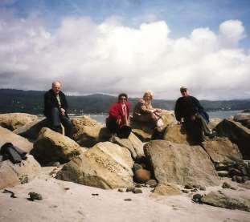

1. [~~Про мой род, себя и нашу элиту~~](./1.md)
2. [~~Бацькаўшчына~~](./2.md)
3. [~~Академия — завод — университет~~](./3.md)
4. [~~МРТИ — хорошо, БГУ — лучше~~](./4.md)
5. [~~Чернобыль~~](./5.md)
6. [~~В Москву, к властям~~](./6.md)
7. [~~Дорога к Вискулям~~](./7.md)
8. [~~Народы малочисленные и к ним приравненные~~](./8.md)
9. [~~Если б знал я, с кем еду, с кем водку пью…~~](./9.md)
10. [~~Беловежская пуща, Вискули, 7—8 декабря 1991 года~~](./10.md)
11. [~~Беларусь — Соединённые Штаты~~](./11.md)
12. [~~Интеллигенция и политика~~](./12.md)
13. [~~О университетах и ВУЗах, степенях и лекциях~~](./13.md)
14. [~~О «моём» зарубежье~~](./14.md)
15. [~~Патология~~](./15.md)
16. [**Через годы, через расстояния**](./16.md)

---

# Или связанные с моей жизнью микро-эссе в случайной последовательности.

![В декабре 1991 года этот снимок появился в сотнях газет и журналов мира. Не исключаю, что по этой причине получило широкое распространение неточное мнение о том, что Соглашение о Создании Содружества Независимых Государств подписали в Вискулях три человека, изображённые на снимке: Леонид Кравчук, Станислав Шушкевич и Борис Ельцин (слева направо). В действительности под ним стоят также подписи госсекретаря РФ Геннадия Бурбулиса, премьера Украины Витольда Фокина и премьера Беларуси Вячеслава Кебича. Мы же втроём подписали тогда краткое одностраничное Заявление о сути Соглашения о создании СНГ.](./img/16-01.jpg)

![2011 год. Станция Гудагай. Бдительные пограничники высадили из поезда Вильнюс-Минск группу студентов Европейского Гуманитарного Университета и меня, полагая, что они под моим руководством едут в Минск протестовать против злодеяний правящего режима. Официальный повод для задержания — «тщательная проверка документов». Никого из задержанных я прежде не знал. ЕГУ был основан в 1992 году в Минске, но правящий в Беларуси режим счёл необходимым его ликвидировать, поэтому в 2004 году он вынужден был переехать в столицу Литвы.](./img/16-09.jpg)

![В 20 километрах от Сеула вниз по течению реки Ханган на её берегу построены комфортабельные домики для семейного отдыха. Их внутренние стены и перегородки сделаны из натурального ничем не покрытого дерева. Называют домики «русскими». Стоимость проживания в русском доме такая же, как в фешенебельном отеле Сеула. Хозяева строений долго убеждали нас, что жить в таких домах полезно для здоровья и что именно в таких домах живёт большинство граждан России, так как в этой стране очень много леса. А в Корее таких домов мало, так как дерево стоит дорого.\
От себя добавлю — все отдыхающие здесь — народ молодой и весёлый, с ними захотелось сфотографироваться.](./img/16-32.jpg)

![В 1993 году известный американский писатель Норман Майлер (в центре) через посла США попросил меня его принять. У своего советника Сергея Паньковского (первый слева), я узнал, что на русский переведена лишь книга Майлера о корейской войне «Нагие и мёртвые». Не желая выглядеть непросвещённым, за ночь я эту книгу прочёл. Подумал, что автор наверняка знает всемирно известных В. Быкова и К. Симонова, спросил, как он к ним относится. Оказалось, что он ни о них, ни об их творчестве ничего не знает. Майлер смог ознакомиться в КГБ РБ с личным делом Ли Харви Освальда, попросил меня ответить на ряд вопросов и вскоре издал книжку «Oswald’s Tale» — очередное *художественное* произведение об Освальде. Мне, например, приписано в этой книжке то, чего я ему никогда не говорил. Но «Освальдиада» продолжается и многие цитируют Майлера, считая его «Oswald's Tale» исторической правдой.](./img/16-37.jpg)

![Ион Илиеску — весёлый собеседник. В 1965—1968 годах он руководил отделом пропаганды ЦК РКП, был первым секретарём ЦК коммунистической молодёжи. В середине 70-х годов Чаушеску увидел в нём конкурента, снял со всех постов, но не преследовал, В 1989 году Илиеску возглавил волнения против Чаушеску, а после его свержения дважды избирался на пост президента Румынии — в 1990 и в 2000 году. Не отрёкся от методов, применявшихся Чаушеску: привозил в Бухарест шахтёров, вооружённых железной арматурой, для разгона оппозиционных демонстраций.](./img/16-39.jpg)

![27 августа 2005 года с экс-президентом Болгарии доктором философских наук профессором, по-прежнему интереснейшим собеседником, писателем и аналитиком Желю Желевым на террасе президентского дворца в Варшаве на конференции по проблемам Восточной Европы. Здесь не раз вспоминали о изданной в 1982 году (через 15 лет после полной подготовке к изданию!) его книги «Фашизм». Через несколько дней после напечатания десятитысячный тираж книги был запрещён и уничтожен: коммунистический режим в Болгарии и остальных странах «социалистического лагеря» оказался идентичен фашистскому, детально описанному в книге Желева.](./img/16-43.jpg)

![Июль 1992 года. По просьбе Председателя Сейма Литвы Витаутаса Ландсбергиса мы выбрали местом переговоров Вискули и сели за стол, на котором было подписано Соглашение о создании СНГ. Сознавая, что вокруг пуща, наши охранники играли в соседнем зале в бильярд. Я попросил их присмотреть за моим семилетним сыном, так как жена в это время знакомила госпожу Гражину Лансбергис с резиденцией. Дверь бильярдной была закрыта, ключ торчал в двери. Сын пытался выбежать в холл, но его сразу же вернули. Правильно оценив ситуацию, мой Стас вынул из замочной скважины ключ и запер им дверь снаружи. Профессионалам спецслужб Литвы и Беларуси, оказавшимся в изоляции от охраняемых, пришлось выбираться через форточку и долго искать виновника своего заключения на просторах бывшей резиденции ЦК КПСС.](./img/16-52.jpg)

![С Вигдис Финнбогадоттир — первой женщиной в мире, избранной на пост главы государства в соответствии с Конституцией страны, я познакомился в Швеции в Гётеборгском университете. Она не готовилась к политической карьере, изучала французский язык и литературу в Сорбонне и в университете Гренобля, историю театра — в университете Копенгагена. Будучи избранной на пост Президента Исландии в 1980 году, четырежды переизбиралась на этот же пост и отказалась участвовать в следующих выборах. Всегда уделяла большое внимание развитию исландского языка, культуре Исландии, интересам молодёжи, женскому лидерству.](./img/16-54.jpg)

России трудно сберечь её национальную гордость — достойнейших, талантливых высокообразованных политиков. Добрые слова о них остаются в памяти и на памятниках. «Галина Васильевна Старовойтова — учёный, правозащитник, народный депутат СССР, РСФСР, депутат Госдумы РФ, советник Президента России, председатель партии «Демократическая Россия». Погибла 20 ноября 1998 года в результате террористического акта от рук наёмных убийц.

Самый дешёвый и самый лучший способ познать красоту природы Соединённых Штатов Америки и научиться природу беречь, — арендовать автомобиль и отправиться в поездку по национальным паркам США.

У меня было большое преимущество перед рядовыми путешественниками: я мог надолго доверить руль жене, для которой вождение автомобиля — любимое занятие

Мне довелось познакомиться и вести переговоры с тремя президентами ФРГ. На момент знакомства господин Рихард фон Вайцзеккер был действующим президентом, а господам Иоганесу Рау и Иоахиму Гауку предстояло стать первыми лицами Федеративной Республики Германия в будущем.

![2005 год, Калифорния, Национальный парк США Red Wood, в котором созданы превосходные условия для сохранения рощи из деревьев секвойи и для комфортного пребывания в ней туристов. Я сфотографировал в парке мою жену Ирину со знаменитым американским писателем Ричардом Роудсом, его женой Джинджер и переводчицей Марией у среза секвойи, сломанной ураганом в возрасте более 2000 лет. На срезе обозначены годовые кольца, окончания Второй мировой войны, принятия Декларации независимости США, открытия Колумбом Америки и рождения Христа.](./img/16-92.jpg)

![Большой честью для меня было приглашение прочесть инаугурационную лекцию в связи с открытием в штате Канзас белорусского академического центра, созданного усилиями бывших послов США в Беларуси Дэвида Суорца и Кеннета Яловица совместно с Радой Белорусской Народной Республики, деятелями белорусской диаспоры за рубежом и энтузиастами колледжа в Винфилде. Торжественное открытие центра состоялось на собрании в самом большом городе штата Канзас Вичита в конференц-зале гостиницы «Hyatt» 19 апреля 2008 года.](./img/16-104.jpg)

![Пути Господни неисповедимы. Этот снимок сделан у входа в гостевой дом Президента США Блэйрхауз 22 июля 1993 года во время моего официального визита в США. Тогдашние (слева направо) Председатель Национального банка РБ Станислав Богданкевич, вице-премьер Михаил Чигирь, Юля Буравкина, Михаил Мясникович, представитель РБ при ООН Геннадий Буравкин, Ирина Шушкевич, Станислав Шушкевич и посол РБ в США Сергей Мартынов были, казалось, борцами за государственный суверенитет Беларуси, за справедливость, демократию, права человека, рыночную экономику. Верность этим принципам сохранили лишь шесть из восьми, причём М. Чигиря не сломила и тюрьма, а остальную пятёрку — репрессии. Мясникович и Мартынов стали приверженцами авторитаризма и «верой и правдой» служат последнему диктатору Европы.](./img/16-107.jpg)

Как я не уходил от этого слова, но получились мемуары. Почему же в финале — фото какой-то благочинной семьи на ступеньках моего загородного домика в 55 километрах от Минска?
Самый правый на снимке — муж этой очаровательной женщины и отец этих радостных детей — Даниэль Спекхард — Чрезвычайный и Полномочный посол Соединённых Штатов Америки в Республике Беларусь в 1998-2002 гг.
ОН СПАС МНЕ ЖИЗНЬ.
Как это произошло описано в разделе «Об университетах и вузах, степенях и лекциях».
Я же узнал обо всём достаточно поздно, и не было случая поблагодарить господина Даниэля Спекхарда за его благородный поступок. Исправляю упущение: СПАСИБО, ДАНИЭЛЬ!

Высокопоставленные сотрудники Госдепартамента США Даниэль Рассел и бывший Чрезвычайный и Полномочный посол США в Республике Беларусь Майкл Козак занимаются проблемами Восточной Европы. Они убеждены, что нелепость отношений РБ — США, порождённая белорусским правящим режимом, неизбежно уступит место конструктивному взаимовыгодному сотрудничеству.

Такого же мнения придерживаются сенатор от штата Иллинойс Ричард Дурбин и сенатор от штата Мэриленд Бен Кардин — вице-президент Парламентской Ассамблеи ОБСЕ и сопредседатель Хельсинской Комиссии Сената США по безопасности и сотрудничеству в Европе.

![Вечером 28 марта 2012 года после моей лекции в Университете Джорджа Вашингтона самой трудной задачей было отыскать место в каком-нибудь недалёком пабе для нашей небольшой компании, чтобы в непринуждённой обстановке продолжить начатый в аудитории разговор. В среду (!) все бары и другие заведения Вашингтона между Белым Домом и землёй университета, в которых можно посидеть за фужером пива, сока или колы, были переполнены студентами, молодыми сотрудниками госдепартамента и… удручёнными опытом профессорами, также, оказывается, жаждущими общения. Нам повезло, поиск завершился успешно: нашли всё, что хотели, и любители пива (профессор Генри Хейл, профессор Роберт Орттунг, переводчик-профессионал Алексей Собченко, Фредо Ариас Кинг и я) и любители колы (стажёр-исследователь Суфьян Жемухов, мусульманин) и не упускающая случая продемонстрировать своё отрицательное отношение к алкоголю любительница сока — моя жена Ирина.\
Все мы ещё раз согласились с Антуаном де Сент-Экзюпери: «**Самая великая роскошь — радость человеческого общения**».](./img/16-121.jpg)

Ежегодно 25 марта в День Памяти жертв тоталитаризма в Вашингтоне возле памятника погибшим в борьбе за свободу проходит траурный митинг. Люди, родные и близкие которых стали жертвами фашизма, сталинизма и иных человеконенавистнических режимов, ставят у памятника зажжённые свечи. В память о великом поэте Беларуси зажёг свечу и живущий в США внук Янки Купалы Висвидас Матулис (центральный на правом снимке). Организаторы митинга пригласили и меня выступить перед собравшимися как лауреата Медали Свободы 2012 года. Переводчиком была Алеся Кипель — дочь известного белорусского культурного деятеля в эмиграции Витаута Кипеля.

![Беларусь продолжают покидать талантливые учёные высшей квалификации, как молодые, так и имеющие несомненные заслуги и умудрённые большим опытом. Среди них — мой коллега по БГУ физик, доктор физико-математических наук А. Патрин — сын Героя Советского Союза Алексея Патрина, первым форсировавшего Днепр во время Великой Отечественной войны. Он — профессор, заведующий кафедрой, вице-декан Политехнического института в Кошалине (Польша), где мы и встретились. Его вряд ли можно подозревать в умеренном белорусском патриотизме. Но невозможно заниматься наукой в Беларуси, стране, которая больше тратит на содержание репрессивного аппарата для подавления свободомыслия, чем на поддержку науки.](./img/16-126.jpg)
![С Алесем Беляцким, осуждённым позднее белорусским диктаторским режимом за свою правозащитную деятельность на 7,5 лет лишения свободы, мы отыскали на кладбище в Праге могилу известного белорусского оперного певца Михаила Ивановича Забейды-Суницкого.\
Он родился в 1900 году в деревне Нестеровичи на Гродненщине. Во время российско-польской войны переехал в Барнаул, затем в Харбин. Дебютировал в партии Ленского в опере «Евгений Онегин»., Учился у знаменитого Фернандо Карпи. Стажировался в Милане. В Ла-Скала познакомился с Шаляпиным и Собиновым. Карьеру певца продолжил в Познани, Варшаве и Праге, где начал всё чаще включать в свой репертуар белорусские песни, услышанные в детстве от матери, знакомя с ними тысячные аудитории. Лишь в 1963 году ему, наконец, разрешили побывать в БССР и выступить с концертами в Минске и Гродно.](./img/16-127.jpg)
![Организация по безопасности и сотрудничеству в Европе (ОБСЕ) начала свое формирование в 1975 г. В неё входят 56 государств: все европейские страны, США, Канада, государства Центральной Азии и Закавказья. Государства-участники обладают равным статусом. Решения принимаются консенсусом, имеют большое политическое значение, однако, не носят юридически обязательного характера. Статус партнёров по сотрудничеству имеют средиземноморские страны — Израиль, Иордания, Египет, Тунис, Алжир и Марокко. Азиатскими партнёрами по сотрудничеству являются Япония, Южная Корея, Таиланд, Афганистан и Монголия. Фактически, сфера деятельности ОБСЕ по раннему предупреждению, предотвращению конфликтов, регулированию кризисов и постконфликтному восстановлению охватывает пространство «от Ванкувера до Владивостока». Высшим органом ОБСЕ являются саммиты, которые проводятся по договоренности государств, как правило, один раз в два-три года.\
Первый саммит тогда ещё СБСЕ состоялся в Хельсинки в 1975 году. 1 августа 33 государства Европы, США и Канада подписали Заключительный акт Совещания по безопасности и сотрудничеству в Европе (СБСЕ) — документ, названный «10 заповедей разрядки» или «хельсинкский декалог», включивший в себя положения об уважении суверенитета, нерушимости границ, отказа от использования силы при решении конфликтов, признание территориальной целостности и права народов на самоопределение, невмешательство одних стран во внутренние дела других, уважение прав человека и свобод, сотрудничество между государствами и соблюдение международных законов. В 1992 году в Хельсинки от имени вновь возрождённого европейского государства Республики Беларуси я подписал Хельсинские Соглашения 1975 года, и все мы — участники саммита — приняли документ «Вызов времени», который наделил СБСЕ полномочиями осуществлять практические меры по предотвращению и урегулированию локальных и региональных конфликтов.\
Во время саммита Хельсинки-92 я имел официальные личные встречи с президентом США Джорджем Бушем (старшим) и канцлером ФРГ Гельмутом Колем по их инициативе. На общем снимке участников с автографами всех глав государств есть моя подпись и я (пятый справа в третьем ряду).](./img/16-128.jpg)

---

1. [~~Про мой род, себя и нашу элиту~~](./1.md)
2. [~~Бацькаўшчына~~](./2.md)
3. [~~Академия — завод — университет~~](./3.md)
4. [~~МРТИ — хорошо, БГУ — лучше~~](./4.md)
5. [~~Чернобыль~~](./5.md)
6. [~~В Москву, к властям~~](./6.md)
7. [~~Дорога к Вискулям~~](./7.md)
8. [~~Народы малочисленные и к ним приравненные~~](./8.md)
9. [~~Если б знал я, с кем еду, с кем водку пью…~~](./9.md)
10. [~~Беловежская пуща, Вискули, 7—8 декабря 1991 года~~](./10.md)
11. [~~Беларусь — Соединённые Штаты~~](./11.md)
12. [~~Интеллигенция и политика~~](./12.md)
13. [~~О университетах и ВУЗах, степенях и лекциях~~](./13.md)
14. [~~О «моём» зарубежье~~](./14.md)
15. [~~Патология~~](./15.md)
16. [~~Через годы, через расстояния~~](./16.md)

# [Все книги](..)
