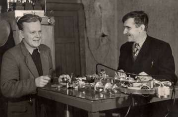
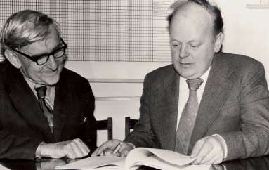
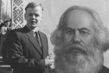
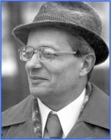
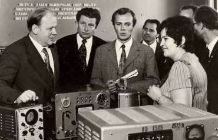
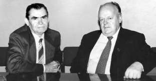

1. [~~Про мой род, себя и нашу элиту~~](./1.md)
2. [~~Бацькаўшчына~~](./2.md)
3. [**Академия — завод — университет**](./3.md)
4. [МРТИ — хорошо, БГУ — лучше](./4.md)
5. [Чернобыль](./5.md)
6. [В Москву, к властям](./6.md)
7. [Дорога к Вискулям](./7.md)
8. [Народы малочисленные и к ним приравненные](./8.md)
9. [Если б знал я, с кем еду, с кем водку пью…](./9.md)
10. [Беловежская пуща, Вискули, 7—8 декабря 1991 года](./10.md)
11. [Беларусь — Соединённые Штаты](./11.md)
12. [Интеллигенция и политика](./12.md)
13. [О университетах и ВУЗах, степенях и лекциях](./13.md)
14. [О «моём» зарубежье](./14.md)
15. [Патология](./15.md)
16. [Через годы, через расстояния](./16.md)

---

# Аспирантские вояжи и будни

Среди легенд о величайшем физике XIX—XX веков Эрнесте Резерфорде есть и такая. Если он давал своему ученику задание, тот успешно его выполнял и приходил к учителю с вопросом, что делать  дальше, Резерфорд его выгонял. Не знаю, этим ли руководствовался мой научный руководитель академик Михаил Александрович Ельяшевич, прекрасно знавший историю физики, или чем-то иным, но, сформулировав для всех сотрудников и аспирантов лаборатории проблему — освоить экспериментально регистрацию сигналов электронного, ядерного и квадрупольного резонансов — он никогда потом не интересовался у нас, как идут дела и что освоено. Считал, по-видимому, что это уже чисто наши проблемы. У нас же не было и намёка на мысль спросить, что делать дальше. С трудом справлялись с тем, чего нельзя было не делать.
В первый год аспирантуры в полном соответствии с советскими традициями в меня была заложена дефектность, от которой я так и не избавился. Мой руководитель, узнав, что в университете я изучал немецкий, велел обязательно освоить английский, так как вся научная периодика и новая литература по нашей проблеме — англоязычная. Сам он свободно владел французским, немецким и английским. Таким был результат его детского домашнего воспитания в дореволюционном Петербурге и в Мюнхене, где он родился. Мне же, уже взрослому, за девять месяцев нужно было освоить английский так, чтобы сдать экзамен кандидатского минимума. Экзамен я сдал, и язык освоил, но по-советски: довольно ловко перевожу научные статьи физического профиля. А воспринимаю английский ухом с уймой проблем. Должен представить себе, как это пишется.
Научно-техническая задача, поставленная шефом, была гигантской, под силу большому коллективу учёных и инженеров, имеющих хорошую производственную базу. Но это мы поняли позднее. Моей частью задания было построить прибор для измерения сигналов электронного спинового резонанса или, как тогда чаще всего называли, — электронного парамагнитного резонанса, сокращённо — ЭПР. Удалось разведать, где в Советском Союзе такие спектрометры есть. Оказалось, что самодельный — только в Москве в Физическом институте Академии Наук СССР имени П. И. Лебедева (ФИАН) в отделе профессора А. М. Прохорова и спектрометр фирмы Вариан в Институте химической физики АН СССР (ИХФ) у академика Н. Н. Семёнова.
Я захотел съездить туда на несколько дней, чтобы разобраться, что это за спектрометры. Сотрудники лаборатории отнеслись к этому скептически, сказав, что отдел колебаний ФИАН, который возглавляет Александр Михайлович Прохоров, секретный, и туда нужен допуск. А в ИХФ попасть ещё труднее. Обратился к Михаилу Александровичу. Он пообещал зайти к начальнику первого отдела, чтобы мне срочно сделали допуск, и от руки написал два коротких письма — Прохорову и Семёнову.
— Езжайте вместе с Потаповичем Александром Константиновичем и не на день-два, а на недели три, изучите там установки по парамагнитному и по ядерному резонансу.
Вскоре я понял, что личное письмо моего шефа — пропуск в любую дверь любого научного учреждения СССР, и не упускал возможности этим воспользоваться. М. А. Ельяшевича — автора монографии «Молекулярная спектроскопия» — настольной книги каждого физика, соприкасающегося с спектроскопией, действительно, все знали и искренне уважали.

Так мы с редкостным «трудоголиком», Сашей Потаповичем, моим замечательным однокурсником, способным работать непрерывно многие дни и ночи подряд без перерыва, попали на почти месячную стажировку в ФИАН имени П. И. Лебедева в лабораторию колебаний, руководимую Прохоровым. Именно здесь и в Институте химической физики (ИФХ) мы соприкоснулись с физикой и физиками мирового уровня. По познавательности наш месяц в Москве стоил года в ординарной физической исследовательской лаборатории. 
Первый день нашего пребывания в ФИАНе совпал со днём еженедельного обхода лаборатории Александром Михайловичем Прохоровым. Заметил он и нас. Подробно расспросил Потаповича и меня, с чем мы соприкасались в физическом эксперименте и что намерены делать, закрепил за каждым куратора из числа сотрудников.
По московским масштабам из ФИАНа до ИХФ — рукой подать, и мы несколько раз побывали в Институте химической физики. Директора — академика, Лауреата Нобелевской премии 1956 года Николая Николаевича Семёнова нам увидеть не удалось, и я передал письмо М. А. Ельяшевича одному из его заместителей. И в таком варианте оно стало отмычкой к лаборатории, где был фирменный американский спектрометр ЭПР.
Тогда, в начале 1957 года, мы не знали, что в ФИАНе находимся в лаборатории будущего Лауреата Нобелевской премии, будущего академика АН СССР, одного из «отцов» квантовой электроники.
Легенда о том, как Прохоров стал академиком и лауреатом, такова. Он решил бросить занятие сверхвысокими частотами — СВЧ и переключиться на лазеры. (А именно СВЧ мы у него и познавали!)
Часть научного коллектива (того самого, в котором мы стажировались!) противостояла этому. Заведующему лабораторией пришлось вывести из строя или разломать приборы, обеспечивавшие работу по старой тематике. В результате — скандал, и половина сотрудников уволилась. Оставшиеся занялись новым делом. Итог — Нобелевская премия за лазеры.
Мы с Александром Потаповичем возвратились в Минск, сознавая, что наступать широким фронтом — бессмысленно и убедили нашего научного руководителя сконцентрировать силы на одном направлении — электронном парамагнитном резонансе. С этим все согласились, хотя и в шутку и всерьёз я не раз потом слышал.
— Ты, Шушкевич, и здесь подмял всех под себя.
Я не оправдывался. Однако в статусе аспиранта, «подмять под себя» означало вынудить работать на мою диссертацию. Этого не было и в помине. Мы все работали много, как говорится, на износ, потому что это было захватывающе интересно. Брались решать сложные задачи, жаждали доказать, что способны их решать. В лаборатории была только здоровая состязательность.

Три года аспирантуры пролетели как одно мгновение. Диссертацию в аспирантуре я так и не подготовил. Не до неё было. В день, когда я стал аспирантом, оборудование двух небольших комнат нашей лаборатории составляли четыре подержанных стола плюс пять—шесть не новых табуреток и стульев. Сотрудников и аспирантов было также четверо.
Через три года — в отобранном у хозяйственников складе, в который они в своё время превратили четвёртую часть вестибюля главного корпуса Академии наук, стоят два пятитонных электромагнита, изготовленные для нас ленинградской «Электросилой», собственной конструкции и собственного изготовления электроламповые стабилизаторы тока этих гигантов. Супергетеродинный спектрометр ЭПР, множество электронных устройств и приборов, обеспечивающих проведение физических исследований. Неплохо оснащённая лаборатория, хороший коллектив сотрудников!

Другая сторона медали — аспирантская стипендия 620 рублей в месяц, но для учащегося, для получающего образование это оправдано. А предстоящая после окончания аспирантуры зарплата младшего научного — 820 рублей… Слабовато. Мои существенно более хилые по успеваемости одноклассники уже получают по 1200, 1300 и даже по 1400. И прогрессивка у многих есть и премиальные. Прилично работающие на путных заводах мои сверстники через пяток лет и квартиры получат, а в Академии наук с этим вообще без учёной степени беспросветно… 
И хотя распределился я после аспирантуры на должность младшего научного сотрудника с окладом 820 рублей в свой же Институт, который отделился от математиков и стал Институтом физики, но меня снова одолела лютая тоска. Младший научный — не аспирант. В рабочее время нужно быть на рабочем месте. Мой реальный доход сократился. Невозможно подрабатывать ни в вузе, ни даже в школе.
В это тоскливое время приходит ко мне Яков Аронович Слепян, у которого я проходил студенческую практику в возглавляемой им Центральной заводской лаборатории радиозавода. Рассказывает о том, что на радиозаводе образовано Специальное конструкторское технологическое бюро (СКТБ) для разработки измерительных приборов и приборов для научных исследований. От имени начальника СКТБ приглашает на работу. Предлагаемый оклад в два раза больше моего, плюс прогрессивка 40%. Уверяет, что с моим характером я без прогрессивки не останусь.
— Что предполагается разрабатывать в первую очередь?
— То, что нужно во всех физических лабораториях и что не лучшим образом собирают в них радиолюбители — низкошумящий селективный усилитель низких частот. Вы и сами не раз этим занимались. Плановый срок разработки год, если с вашим заделом сдать досрочно, можно получить увесистую премию министерства. 
Таким образом, мне предлагалось занять ся тем, что мне нравится, но за почти в три раза большую зарплату. Я согласился, и после трёх месяцев пребывания на должности младшего научного сотрудника с окладом 820 рублей стал старшим инженером с окладом 1600 рублей плюс 640 рублей прогрессивки, если план выполняется.

# СКТБ радиозавода
История Минского радиозавода, который носил тогда имя «50-летия Октябрьской революции», а потом стал главным элементом объединения «Горизонт», связана и с моей родной Слепянской улицей. В строения лесопилки между ул. Советской, Бондаревской и Слепянской в 1939 году перевезли оборудование радиозавода из захваченного Красной армией Вильнюса. Вход в административный корпус со столовой на первом этаже был как раз с улицы Слепянской. 
Трудно однозначно ответить, на каких условиях и под каким предлогом из того же Вильнюса в Минск переехали для работы на открывающемся предприятии специалисты по радиотехнике, из
Вильнюса, преимущественно евреи. Так образовался минский радиозавод имени Молотова, выпускавший хорошего по советским меркам качества радиоприёмники и радиолы.
После войны завод довольно быстро восстановили, так как его не коснулся пожар. Возвратились и некоторые работники. Завод совершенствовался и начал производить приборы для применения в армии. По негласным советским порядкам на предприятиях, производящих что-то для оборонных целей, не допускалась высокая концентрация евреев. Поэтому почти всех их перевели в филиал завода на улице Красной, который быстро превратился в радиозавод с вполне приличной репутацией. выпускающий снова же по советским меркам вполне приличные приёмники и телевизоры. Старый радиозавод (бывший имени Молотова, о имени которого уже не надлежало вспоминать) стал головным предприятием объединения имени Ленина. Оно специализировалось на выпуске радиоизмерительной аппаратуры и радиоэлектронных устройств, в том числе и для военных целей.
В Специальном конструкторском технологическом бюро (СКТБ)
будущего «Горизонта» сконцентрировалась радиотехническая элита предприятия. Начальник СКТБ — Вениамин Натанович Пумпянский получил высшее образование в Бордо. Естественно, он владел французским. Думаю, что неплохо знал английский, так как несколько раз посоветовал мне посмотреть относящиеся к моей работе статьи в американских журналах.
Полной неожиданностью для меня стало то, что научиться новому я смог в СКТБ преимущественно у ветеранов-самоучек, не имеющих высшего и даже среднего специального образования. Многие из них с нескрываемым пренебрежением относились к инженерам — выпускникам радиотехнических вузов РСФСР и УССР, а также к выпускникам моего родного физфака БГУ, так как лучше их знали, что и как надо делать. Поначалу они и ко мне отнеслись таким же образом, а их неофициальный лидер Изя Каплан мимоходом заметил, что он уже сделал действующий макет прибора, на разработку которого взяли на работу и меня.
Изя был человек авторитетный и серьёзный. На десять лет меня старше, участник войны, имеющий награды, автор множества внедрённых в производство рационализаторских предложений. Слов на ветер он не бросал, поэтому я попросил у него схему макета и, буквально за пару часов, проверил характеристики изиного творения. Они оказались вполне приличными, и что греха таить, лучше тех, которых мы добивались в академической лаборатории. Изя, правда, располагал лучшими, чем мы, комплектующими деталями, но это не обесценивало его достижений, да и схемотехническое решение было у него иное.
Я целую ночь просидел над нехитрой схемой макета. Как бы построил её теоретическую модель. Получалось, что параметры устройства можно значительно улучшить. Утром у нас с Капланом состоялся примерно такой разговор.
— Изя, позволь мне кое-что перепаять в твоём макете, и ты увидишь, что характеристики его улучшатся.
— Все умники с высшим образованием, которые сидят с тобой в комнате, уже пытались это сделать. Не получилось.
— Но у меня кроме высшего ещё и аспирантское.
— Рассмешил. Ладно, попробуй.
Вечерняя речь моего утреннего спорщика уже не содержала язвительной иронии и носила чисто доброжелательный характер.
— Ты, Станислав, первый знакомый мне человек, который с помощью авторучки и крючков смог улучшить схемное решение.
Признание Капланом обозначало признание ветеранами завода, а значит и остальными сотрудниками. А что касается руководства СКТБ и прочего начальства, то оно ко мне сразу отнеслось положительно. Однако моя работа на радиозаводе сделала меня известным не только в СССР, но и за границей, по причине, не имеющей никакого отношения к радиотехнике, электронике и вообще к моим прямым служебным обязанностям.

# Мой с Сашей ученик — Ли Харви Освальд
Чего только не написали обо мне любители сенсаций! Наиболее распространённая легенда, которую и сейчас временами кое-кто вспоминает. *Шушкевич — сексот. По заданию КГБ он покинул работу в Академии наук, где уже настучал на всех, на кого надо. Его специально устроили на радиозавод, чтобы сделать из бежавшего в СССР американского дезертира агента КГБ, который готов к выполнению любого задания советских спецслужб*.
В действительности события развивались так. Приходит к моему рабочему месту секретарь парткома экспериментального цеха Либезин. Заверяет, что не имеет ко мне претензий за то, что я отказался давать заключения на два рационализаторских предложения рабочих экспериментального цеха, хотя ранее бранил меня за это. А отказался я что-то писать потому, что рационализаторы вообще не понимали принципа работы схем, которые предлагали упростить. Поэтому я и сказал, что могу написать «предложена глупость». А это — унижение гегемона — рабочего класса, поэтому обратитесь за рецензией к кому-то другому.
— У меня к вам совсем иное дело, — продолжил Либезин, — рассматривайте его как партийное поручение беспартийному, как вашу общественную работу. К вам все ходят разбираться со статьями на английском языке, потому что вы лучше других знаете английский. Раз так, то подучите, пожалуйста, русскому языку американца, который работает у нас в цеху. Он сам язык слегка знает, но нужно, чтобы знал лучше.
Внутренне я сразу же согласился с предложением. Для приличия высказал некоторые опасения, мол, с натуральным американцем никогда не встречался, да и с английским языком у меня туговато. Секретарь парткома успокоил.
— Всё когда-то бывает впервые, а с языком вам поможет Александр Рубенчик. Вы его ещё по университету знаете, хороший работник, он тоже для других с английского переводит. Втроём, так сказать, всегда будете.
Что я могу сказать о «нашем ученике» Ли Харви Освальде доказательно? Ничего! Единственное могу утверждать, что он не мой и не Сашин, а наш с Сашей Рубенчиком ученик. Мы должны были работать с ним только вместе.
Нам с Александром Рубенчиком было категорически запрещено спрашивать кто он, откуда, где рос, учился, как попал в Минск. Сам Освальд не очень распространялся и о себе, о том, где и кем был. Темы занятий также не побуждали откровенничать: погода, город, страна, цех, завод, спорт, магазин, базар, театр, кино и т. п. Но десяток уроков общения и не совсем безмолвного создаёт о человеке какое-то впечатление. Более того, я чуть-чуть знал его и по цеху, где он числился слесарем. Больше всего боялся, чтобы его куратор — настоящий слесарь-профессионал, как и большинство рабочих в экспериментальном цеху — не поручил ему делать детали по моему заказу. Испортит.
Так вот всё это не позволяет мне поверить заключению, комиссии во главе с председателем Верховного суда США Эрлом Уорреном. Она в течение десяти месяцев расследовала преступление и пришла к выводу что одиночка Ли Харви Освальд задумал и выстрелом из винтовки смертельно ранил 22 ноября 1963 года президента Соединённых Штатов Америки Джона Кеннеди, когда тот вместе со своей женой Жаклин ехал в кортеже по Элм-Стрит в Далласе. Я не одинок, более 70% американцев не верит в официальную версию убийства. Побывав в 2008 году в Далласе на месте преступления, я, как и большинство американцев, отвергаю официальную версию.

# Возврат в альма-матер
О более увлекательной работе, чем в СКТБ радиозавода, казалось бы, нельзя и мечтать. Да и коллектив был прекрасный. Организация работ разумная: мы в лаборатории макетируем, нашему действующему макету конструкторы придают приличный вид на бумаге, экспериментальный цех делает образец... Но физики не зря придумали *«теоретическую мэрфологию»*, к которой и далее нам придётся обращаться. Закон Мэрфи *«Если какая-нибудь неприятность может произойти, она случается» имеет ряд следствий. Одно из них: «Если дела идут хорошо, что-то должно случиться в самом ближайшем будущем»*.
Дела шли хорошо. Мы сдали Госкомиссии низкочастотный селективный усилитель и синхронный детектор — приборы, которые были нужны буквально всем, кто занимается оптической спектроскопией и радиоспектроскопией. Приступили к выпуску небольшой партии таких приборов на нашем радиозаводе и передаче их производства на завод в Муроме. Я был уверен, что руководство нашего завода подаст заявку на разработку новой аппаратуры для научных исследований. Союзное министерство подталкивало на такой шаг. Но умудрённое жизненным опытом руководство завода не хотело рисковать и вести новые разработки. Спокойнее было сопровождать производство давней продукции и улучшать её характеристики.
Меня мучил вопрос.
— Почему завод с таким рвением добивался получения новых серьёзных разработок ранее, и почему сейчас делает всё, чтобы таких заказов нам не дали?
Умудрённый опытом Изя Каплан искренне удивился, что я ещё не понял «мудрости» высшего руководства завода.
— Два года назад они поднарядились сделать новые разработки, чтобы открыть новое структурное подразделение — СКТБ, получить штаты, фонды, деньги на капстроительство. А сейчас: чем проще и чем меньше, тем лучше. Ты, Станислав, оказывается, совсем без понятия; думал, что мы будем здесь всё время разрабатывать новые приборы. Всё новое начальству до лампочки, им лишь бы не рисковать .
После этих слов Изи Каплана захотелось снова впасть в тоску, но я не успел это сделать.

Мне позвонил Александр Николаевич Писаревский, сказал, что приехал в Минск из Ленинграда, работает в университете и хотел бы со мной встретиться. После работы я заехал к нему в университет. Узнал, что он приглашён создать на физическом факультете кафедру ядерной физики. Услышал от него несколько хвалебных слов в свой адрес. Понял, что кто-то из моих собратьев по работе ему обо мне рассказал, и вдруг.
— А вообще-то, вы занимаетесь чепухой.
Ваша электроника — вчерашний день. Нужно в любых делах брать на вооружение цифровую.
Мне такой поворот разговора, да и сам Писаревский не понравились, и я попытался его слегка уесть.
— Уважаемый Александр Николаевич. Я тоже читаю научно-популярные журналы и знаю, что у цифровой электроники прекрасное будущее. Более того, пять лет назад в моей курсовой работе были электронные цифровые элементы. Знаю ребят, которые создают в Институте физики ЭВМ «Луч», понимаю, какие проблемы они решают.
— А разве его ещё не выбросили на свалку этот «Луч»? Я о другой цифровой, о той, которая сегодня называется ядерной электроникой, о самой высокоскоростной и интенсивно развивающейся. За нею будущее. Короче: я предлагаю вам заняться настоящим делом и постараюсь, чтобы вы зарабатывали примерно столько, сколько в СКТБ.

# Кафедра ядерной физики и мирного использования атомной энергии
С чего начинается кафедра?
Граждане, ставшие во времена СССР взрослыми, не могли не усвоить, что театр начинается с вешалки. Об этом методически напоминали по радио и телевидению все участники передач, относящие себя к людям творческих профессий, хотя далеко не каждый из них знал где, когда, в каком контексте о театральной вешалке высказался Константин Сергеевич Станиславский. А уж о том, что он вообще не Станиславский, а Алексеев, и что главное, сделанное им для русской сцены — не забота о вешалке, а утверждение принципов режиссерского театра, вряд ли кто из наивных телезрителей и догадывался.
В отличие от театра, кафедра начинается с названия.
Полное название кафедры, сотрудником которой я стал, вынесено в заголовок этого параграфа. Нетрудно уловить, что это была университетская структура широкого профиля. Подобного подхода терпеть не могут специалисты узкого профиля, деятельность которых направлена на глубокое познание какой-то конкретной науки. Они знают буквально всё в очень узкой области конкретной науки. Впадающих в крайность прекрасно охарактеризовал Бертольд Брехт: *«знают всё ни о чём»*. Он же дал характеристику и альтернативному увлечению: *«знают ничего обо всём»*.
При названии кафедры, которое придумал А. Н. Писаревский, можно было оправдать многие виды работ и исследований, особенно, если учесть, что все виды энергии на нашей планете произошли от ядерной энергии, т.е. от Солнца, разогреваемого термоядерной реакцией, или же радиоактивного излучения Космоса и внутреннего разогрева самой планеты Земля.
Первое, сформулированное заведующим кафедрой Писаревским задание, я бы мог выполнить сегодня в течение нескольких часов с помощью скромного персонального компьютера и ординарного стандартного аналого-кодового преобразователя. Но тогда… Я долго искал доступное сравнение пояснить возможности электронных приборов начала 1960-х и начала 2010-х годов. Не придумал ничего лучше следующего.
Мы располагали технологиями времён Колумба. Писаревский же требовал построить быстроходное судно, хотел, чтобы мы научились пересекать океан не за несколько месяцев, а за несколько дней. Наше первое аппаратурное творение было копией того, что разработали в 1961 году в Ленинградском электротехническом институте имени Ульянова-Ленина (ЛЭТИ) под руководством Валериана Орестовича Вяземского. Амплитудный многоканаль ный анализатор (АМА) содерж ал 160 электронных ламп, память на потенциаллоскопе, монитор на электронно-лучевой трубке и ленточный самописец. Весил АМА более 150 килограммов. Было удовлетворено и наше себялюбие: в процессе воспроизводства разработки ЛЭТИ мы внесли довольно много усовершенствований, и сам Валериан Орестович Вяземский это признал.
Затем последовало множество приборов, разработанных непосредственно на кафедре. В основе большинства из них лежал простой принцип. На исследуемый объект направлялось ионизирующее излучение с вполне определёнными временными и энергетическими характеристиками. Отклик на такое воздействие фиксировали детекторы, сигналы которых автоматически обрабатывали наши электронные устройства.

У нас было ощутимое преимущество перед остальными. В то время мы создали совместно с учёными и инженерами московского Института прикладной физики (ИПФ) самые чувствительные в мире приёмники световых излучений — считали отдельные кванты! Когда в американском журнале Review of Scientific Instruments появилась первая в зарубежной научной печати статья по счёту отдельных фотонов, то под её заглавием была ремарка: *«Когда настоящая статья была направлена в печать, авторы обнаружили в журнале «Приборы и техника эксперимента» публикацию, в которой реализован такой же метод»*. В такой форме появилось зарубежное признание нашего первенства.
Кафедра заняла престижное место в отчётах университета по, как тогда именовалось, внедрению научных достижений, она росла численно, так как имела большое количество заказчиков договорных работ. Богатых, по советским меркам, заказчиков, которые в целом ряде случаев ради срочного решения возникших у них проблем не просто платили деньги за выполнение исследований и разработку приборов, но и передавали фонды, в том числе и фонд заработной платы. Научный и педагогический потенциал кафедры позволил привлекать её сотрудников к работе на Факультете повышения квалификации преподавателей вузов СССР (ФПК) при БГУ. На ФПК обучались такие же преподаватели физики университетов, как и мы. Не было случая, чтобы кто-то из них сказал, что у нас нечему было научиться.

# Кандидатская и её харьковский и сибирский триумф
В начале 1963 года заведующий кафедрой позвал меня к себе и, как обычно, начал в манере, только ему свойственной.
— Ваш отчёт по работе для ВЧ (назвал № военной части) тянет на докторскую, а вы и кандидатскую не сделали. Пора этот вопрос закрыть. Так как дело секретное, писать придётся в первом отделе. Думаю, что с вашей прытью двух недель вам хватит.
— Александр Николаевич, вы же знаете, что я ценю ваш юмор, а иногда и подражаю вам. Месяца два мне надо… 
— Сойдёмся на месяце, и точка!
Так и сошлись. За месяц я написал, а ещё через два месяца защитил кандидатскую диссертацию. После этого Писаревский практически ежедневно напоминал, что у меня хватает материала на докторскую и что я обязан её писать. Я не спорил и даже делал кое-какие наброски.
Тема моей кандидатской диссертации давно перестала быть секретной, поэтому нечего её скрывать. Она звучала так же, как и заказанная нам по договору работа «Физические принципы обнаружения разведывательных приёмников». Да и сам метод обнаружения приёмника, хотя и в выключенном состоянии, но не дюже хитрый. Как в случае большинства приборов ядерной электроники, которые мы разрабатывали, посылался зондирующий сигнал, регистрировался и анализировался отклик на него. В данном конкретном случае зондирующим был радиочастотный сигнал в том диапазоне, для которого приёмник предназначен.
Почти все наши разработки были итогом коллективных усилий, если хотите, коллективного мозгового штурма, напоминающего телевизионную игру «Что, где, когда?». Только вопросы придумывали не умники, а ставили заказчики. Судьба работы с обнаружением приёмников — иная, это тот случай, где именно меня осенило перед сном, и я утром бежал на работу, чтобы как можно быстрее проверить собственную идею на практике. Оказалось, я напрасно боялся, что кто-то другой успеет сделать что-то подобное раньше меня. То, что лежит на поверхности, замечают, оказывается, не сразу. Судьба моей находки 1962 года тому подтверждение. Американцы сообщили в журнале Electronics о сущности нового (для них!) принципа обнаружения радиоэлектронных устройств лишь в 1974 году.
Году в 1980 я приехал в Харьков в очень уважаемый институт к очень уважаемому академику. Не называю институт и имя учёного по той простой причине, что мои воспоминания о нём могут быть вырваны из текста и неуваж итель но по отношению к нему истолкованы. А он для меня был и остаётся непререкаемым авторитетом. Его ответ на мою просьбу поначалу меня смутил.
— Вы зачем ко мне приехали, за отзывом? — Если вы сочтёте возможным его дать.
— Да вы же отпетый мерзавец...
Здесь академик сделал паузу и смотрит на меня, но с усмешкой и явно дружелюбно. Значит шутит! А вдруг нет? Молчу. А он продолжил.
— Да, да! Отпетый. Мы здесь заявили, что это невозможно, а вы сделали. Это первый случай в моей жизни, когда я признаю своё научно-техническое поражение. Всё-таки и от секретности бывает прок. Хорошо, что это не попало на страницы научных журналов.
Отзыв я вам, конечно же, дам и сделаю это с удовольствием.
И здесь я понял, что академик знает мою давнюю работу и предложенный мною метод.
Но это не последняя деловая реакция на мою находку 1962 года.
В 1997 году звонит мне ректор Томского университета систем управления и регулирования (ТУСУР) профессор Иван Николаевич Пустынский. Мы давно с ним сотрудничаем, сделали немало совместных работ, давно на «ты».
— Станислав, я послал тебе приглашение на праздник 50-летия радиотехнического образования в Сибири. Билеты на самолёт к нам и обратно тебе тоже отправили. Ты наш желанный гость хотя бы потому, что мы до сих пор используем твой учебник, плюс здесь несколько здравствующих твоих кандидатов наук. Но не это главное. Обязательно приезжай. Будешь приятно удивлён. Я договорился о твоём визите на завод, который по сей день клепает твою разработку.
Я и понятия не имел, что кто-то может в 1997-м «клепать мою разработку», так как с 1991—го перестал профессионально заниматься и физикой и радиоэлектроникой. Но оказалось, что действительно клепают, т. е. производят на заводе и не разработку конца 80-х, а начала 60-х. На томском заводе я увидел симпатичный прибор — конструкторское воплощение моего макета, детально описанного в отчёте 1962 года, предшествовавшем моей кандидатской диссертации. Узнал, что прибор давно используется в армии.

Лучшего момента, чтобы «тряхнуть стариной» и показать, что есть ещё порох в пороховницах, и я ещё не совсем потерял ориентацию в радиоэлектронике, придумать было нельзя. И я разразился речью, перешедшей в лекцию для профессионалов, с которыми мы на редкость хорошо понимали друг друга.
— Дорогие мои! Старая советская секретность не всегда и не во всём шла на пользу делу. Года через три после сдачи имеющегося у вас моего отчёта я, работая над докторской диссертацией, предложил иной способ обнаружения. Он более, чем на порядок, раз в 30—40, чувствительнее метода нелинейного переизлучения, на котором базируется выпускаемый вами прибор. Если у вас есть желание и терпение, я за 10—15 минут расскажу вам его суть… 
Были и желание, и терпение, и в сути метода разобрались мы достаточно быстро. Поругали существовавшие ранее порядки. Выразили опасение, что вряд ли что-нибудь изменилось в подобного рода делах в лучшую сторону в России и в теперь уже независимой Беларуси.
Лишь только я завершил выступление, меня попросили зайти в дирекцию к городскому телефону. Звонил ректор профессор Пустынский.
— У проходной завода тебя ждёт автомобиль академика Месяца — шефа Института физики атмосферы. Он хочет показать тебе институт. Езжай к нему, скажу тебе честно, что мало кто был удостоен такого его приглашения. В институт этот вообще попасть весьма трудно.
— Спасибо, я очень рад. Кое-что знаю о Геннадии Андреевиче, но боюсь, что очень мало. Не попасть бы впросак.
— Не бойся, он мужик настоящий, сам увидишь. В 70-е годы он был профессором нашего института, тогда ТИАСУРа — Томского института автоматизированных систем управления и радиоэлектроники.

# Ахиллесова пята сибирского академика
Не нахожу синонима слову легендарный.
Считаю, что я был удостоен великой чести — у входа в Институт физики атмосферы (ИФО) меня встретил *легендарный* академик Геннадий Андреевич Месяц. Это имя было известно всем в СССР, кто прямо или косвенно соприкасался с наносекундной импульсной техникой, хотя большинство работ академика были секретными. Сразу же при встрече я попытался сказать несколько добрых слов, показать, что знаком с достижениями академика, но, фактически, споткнулся.
— Геннадий Андреевич, спасибо. Это для меня большая честь быть приглашённым в ИФО его создателем и директором.
— Я уже не директор, а почётный директор. По нечётным, да и по чётным дням его возглавляет один из моих учеников.
Следующим, неправильно воспринятым мною фактором, был возраст академика. Я почему-то подумал, что он старше меня: худой, высокий, стройный, абсолютно седой и столь известный. Оказалось — моложе меня на год и два месяца.
А какая непростая биография. Сын репрессированного. Мать после ареста отца выселена из дома и вынуждена была ютиться с малыми детьми и свекровью у родственников. Школу Геннадий Месяц окончил с медалью, поступил на радиотехнический факультет Томского политехнического института, однако учиться на нём не смог — факультет был режимным. С отличием окончил там же
энергетический факультет. В тридцать лет получил учёную степень доктора наук... А далее — активнейший инициатор и участник создания могучайших научно-исследовательских центров в Сибири и на Урале. Профессор престижных вузов Москвы, Урала, Сибири. Среди его учеников — около 40 докторов наук, известнейшие академики и члены-корреспонденты Российской Академии Наук.
И вот этот легендарный академик приглашает меня пройти к
нему в кабинет, а из кабинета в комнату отдыха при кабинете. Там стоял маленький типа журнального столик, покрытый белой скатертью, возле него — два удобных кресла.
— Вы, я знаю, без обеда, давайте перекусим.
Я поблагодарил за приглашение, сказал, что можно и без этого обойтись, что меня одолевает любопытство взглянуть на Институт. Геннадий Андреевич тем временем сервировал столик, поставил на
него из морозильника мгновенно запотевшую бутылку лучшей водки того времени — «Столичной», столовые приборы, ёмкую чашку с красной икрой, хлебницу со свежайшим нарезанным батоном, маслёнку со сливочным маслом и салатницу с чем-то овощным.
— Моя Нина Александровна (жена) заботится, чтобы у меня в холодильнике что-то было. Сами понимаете, не вино же пить в тридцатиградусный мороз, а сейчас около этого.
По-хозяйски налил в фужеры водку, одинаково обоим. Известные мне академики такими дозами не пили, и я ожидал стандартного: пригубит и очень деликатно пожурит меня за то, что я тоже не больше, чем пригубил. Тем более, Томск — город, где 17 лет
правил секретарь обкома Егор Кузьмич Лигачёв — инициатор начавшейся 7 мая 1985 года безалкогольной кампании в СССР.
Но Геннадий Андреевич спокойно выпил всё налитое в фужер, по моей оценке граммов так 120—130. Сказать, что я — непьющий, было поздно. Я тоже выпил до дна, и мы основательно закусили. После следующего наливания пустая бутылка была поставлена на пол.
Процедура повторилась. Гостеприимный хозяин достал из морозилки холодильника вторую бутылку.
— Уважаемый Геннадий Андреевич, не лишнее ли это для меня — непрофессионала в таком деле?
— По третьей — добрая российская традиция, здесь в Сибири — обязательный минимум.
Не подумайте, прочитав название этого раздела, что выпивка — ахиллесова пята академика. Было абсолютно ясно, что, как говорят, у него «ни в одном глазу». Я же, как не старался держаться трезвым, но ощущал, что полыхаю неюношеским румянцем. Поинтересовался, когда же можно будет посмотреть Институт?
— А зачем? Вы же не дилетант. Увидите лидары и коробки с электроникой. Лучше потратить то малое время, которое мы имеем, и продолжить начатый разговор здесь. Никто не войдёт и не помешает.
Я встречался с несколькими учёными соизмеримого ранга, но так просто «по-сибирски» — ни с кем. Узнал в разговоре ряд интересных подробностей о российской постсоветской науке, об отъезде многих учёных работать за рубежом. Сын академика Вадим, хотя и физик, но больше известен как поэт и писатель, также переехал в США, внучка — в Новую Зеландию.
Была, однако, маленькая зацепка, которая частично могла объяснить интерес академика Геннадия Месяца ко мне, хотя по большому счёту и несоизмеримому по научным достижениям с ним, и к тому времени уже бывшему, но учёному-физику.
В 1989 году он жил и работал в Свердловске. КПСС теряла тогда свой престиж и власть. Для поддержки своей репутации партия выставляла авторитетных профессионалов в депутаты. По инициативе партийных органов академик Геннадий Андреевич Месяц был выдвинут кандидатом в Народные депутаты СССР. Казалось бы, ни у кого нет шансов победить этого известнейшего учёного и организатора науки, удостоенного несметного количества наград и премий. Но о должной предвыборной кампании академика никто не позаботился. Настоящий учёный не позволил себе стать популистом и проиграл выборы. Народным депутатом СССР от Свердловского национально-территориального округа избрали оппозиционного судью Леонида Сергеевича Кудрина.
Впоследствии, в конце прошлого и в новом тысячелетии, мне было приятно видеть и слышать, что мой великий собеседник в томском Институте Оптики Атмосферы стал Председателем Высшей Аттестационной комиссии России, директором Физического института имени П.Н. Лебедева РАН. Академик Месяц возглавил тот самый престижный физический институт, где я проходил стажировку у человека, которого Геннадий Андреевич считает одним из своих учителей, у Нобелевского лауреата академика А.М. Прохорова. 
Дальнейшее моё пребывание в сибирском Томске шло по обычной для меня, отработанной к тому времени схеме. В переполненном актовом зале Томского университета систем управления и радиоэлектроники состоялась встреча с сотрудниками и студентами. Тема встречи, ставшая для меня привычной, — Беловежские соглашения и СНГ. Среди собравшихся в зале преподавателей и студентов почему-то не нашлось горячих сторонников возрождения СССР. Лейтмотивом выступлений было: как хорошо, что разошлись мирно и дай Бог Ельцину силы и разум справиться с руководством остающейся по-прежнему великой Россией.

—-

Вспоминая дела кафедры ядерной физики от 60-х и до начала 80-х годов, должен заметить, что, фактически, мы переживали предсмертный всплеск радиоэлектронной схемотехники. Развиваясь, от ламп перешли к транзисторам, потом — на интегральные схемы.
Авторами новых кафедральных разработок стали молодые сотрудники, которые ещё вчера начинали с воспроизведения чужих разработок. Но кафедра вовремя учуяла, что с этим нужно кончать, что будущее за микропроцессорными решениями, воспроизведение мало чему учит, а временами и вредит делу. И мы своевременно перестроились. Не безболезненно, нет. В муках, но перестроились. Более правильно сказать, матёрых схемотехников, засидевшихся на совершенствовании «электронных велосипедов», начали легко обгонять молодые сотрудники, усвоившие, казалось бы только чисто теоретически, университетские курсы по микропроцессорам.
Новое поколение инженеров по радиоэлектронике смотрело на профессионалов схемотехников как на специалистов редко кому нужных, как строители автомобилей на мастеров каретных дел. Достигшее совершенства ремесло не открывало перспектив для творчества. Тем, кто считался специалистом по радиоэлектронике старой закалки, приходилось слышать обидный, но, к сожалению, справедливый упрёк: в электронике нет сложных вопросов, есть плохие контакты.

---

1. [~~Про мой род, себя и нашу элиту~~](./1.md)
2. [~~Бацькаўшчына~~](./2.md)
3. [~~Академия — завод — университет~~](./3.md)
4. [**МРТИ — хорошо, БГУ — лучше**](./4.md)
5. [Чернобыль](./5.md)
6. [В Москву, к властям](./6.md)
7. [Дорога к Вискулям](./7.md)
8. [Народы малочисленные и к ним приравненные](./8.md)
9. [Если б знал я, с кем еду, с кем водку пью…](./9.md)
10. [Беловежская пуща, Вискули, 7—8 декабря 1991 года](./10.md)
11. [Беларусь — Соединённые Штаты](./11.md)
12. [Интеллигенция и политика](./12.md)
13. [О университетах и ВУЗах, степенях и лекциях](./13.md)
14. [О «моём» зарубежье](./14.md)
15. [Патология](./15.md)
16. [Через годы, через расстояния](./16.md)
